# Linux

# 内核实验教程

# Linux 内核实验教程

版本 4.10

# 内容简介

本书结合操作系统原理以及赵炯博士编写的《Linux 内核完全注释》一书，详细分析了一个适合在教学中使用的操作系统——Linux 0.11 内核源代码。本书从 Linux 0.11 操作系统中引用了丰富的代码实例，并配以大量的图示，一步一步地引导读者分析 Linux 0.11 操作系统的源代码。本书与其它操作系统理论书籍最明显的不同，就是配有若干个精心设计的实验题目。读者可以亲自动手完成这些实验题目，在实践的过程中循序渐进地学习 Linux 0.11 操作系统，进而加深对操作系统原理的理解。

本书前2章是基础知识，后面配有十二个实验题目和八个课程设计题目。是一本真正能够引导读者动手实践的书。适合作为高等院校操作系统课程的实践教材，也适合各类程序开发者、爱好者阅读参考。

# 目录

前言 4

第1章 概述 ..... 5

1.1 Linux 0.11 操作系统 ..... 5

1.2 VSCode 编程环境 5

1.3 对原版Linux0.11的改进 6

1.4 从源代码到可运行的操作系统 ..... 7

1.5 Bochs 虚拟机 ..... 8

1.6 在线实验教学管理平台 9

第2章Linux0.11编程基础. 10

2.1 Linux 0.11 内核源代码的结构 ..... 10

2.2NASM汇编 11

2.3 C和汇编的相互调用 ..... 12

2.4 原语操作 ..... 15

2.5 C语言中变量的内存布局. 16

2.6 字节顺序 Little-endian 与 Big-endian ..... 22

2.7 使用 VSCode 阅读 Linux 0.11 源代码的方法和技巧 ..... 23

实验一 实验环境的使用 ..... 28

实验二 操作系统的启动 39

实验三 Shell 程序设计 ..... 50

实验四 系统调用 ..... 56

实验五 进程的创建 62

实验六 进程的状态与进程调度 ..... 71

实验七 进程同步与信号量的实现 ..... 85

实验八 地址映射与内存共享 96

实验九 页面置换算法与动态内存分配 ..... 116

实验十字符显示的控制 126

实验十一 proc 文件系统的实现 ..... 135

实验十二 MINIX 1.0 文件系统的实现 ..... 139

附录1 课程设计实验题目 ..... 143

附录2Linux常用命令 147

附录3vi编辑器使用方法. 149

参考文献 150

# 前言

纸上得来终觉浅，绝知此事要恭行。

——陆游

众所周知，操作系统原理是计算机知识领域中最核心的组成部分，也是高校计算机相关专业学生的重要核心课。同时，操作系统原理也是一门实践性很强的课程。本书精心挑选了一个最适合于初学者学习的操作系统实例——Linux 0.11 内核，使读者能够接触到一个实际操作系统的源代码，并动手完成实验，进而帮助读者理解操作系统的原理。

“工欲善其事，必先利其器”。本书提供了一个专门为Linux 0.11内核定制的VSCode编程环境。读者可以在这个编程环境中非常轻松的编辑、编译和调试Linux 0.11的源代码，使读者将有限的时间和精力放在学习操作系统的原理上，而不是浪费在如何构建实验环境，或者学习使用各种工具上。

现代操作系统已经变得越来越复杂，虽然Linux 0.11内核的源代码相对于一些商业操作系统（例如Windows、Unix等）已经是非常的简化，但是相信很多读者都是第一次接触到具有如此规模的源代码。所以，强烈建议读者在使用本书完成操作系统实验的同时，一定要同步阅读赵炯博士编写的《Linux内核完全注释》一书，该书可以帮助读者理解Linux 0.11源代码中的大量细节。“细节决定成败”对于操作系统来说实在是再恰当不过了，即便是操作系统内核中某一个位的值0或者1发生了错误，都有可能会导致操作系统停机（Panic）。虽然本书为了方便读者，在每个实验的开始部分会提示读者去阅读《Linux内核完全注释》一书对应的章节，帮助读者缩小阅读的范围。但是这并不表明《Linux内核完全注释》一书中其它的内容就不重要，恰恰相反，强烈建议读者在使用本书完成操作系统实验后，再从头至尾的通读《Linux内核完全注释》一书。可以说，没有哪个Linux 0.11中的问题是读一遍这本书解决不了的，如果有，就读两遍。

本书的重点是让读者真正动手实践。正像开始处的陆游诗句所说，只有通过亲身实践学习到的知识才能够真正被掌握，而那些仅仅从书本上得到的知识更容易被忘记。本书为了让读者在动手实践的过程中达到“做中学”的目的，精心设计了十二个配套的实验，可以覆盖操作系统原理知识领域中所有重要的模块和知识点。本书配套的实验按照“由易到难，循序渐进”的原则进行设计。前面的若干个实验以“验证型”为主，后面的若干个实验会添加适当的“设计型”和“综合型”练习。在单个实验内容的安排上，一般会首先带领读者阅读并调试Linux 0.11相关模块的源代码，并结合对应的操作系统原理进行分析。待读者对Linux 0.11的源代码和操作系统原理熟悉后，再安排读者对已有代码进行适当的改写，或者编写新的代码。在每个实验的最后还会提供一些“思考与练习”的题目，感兴趣的读者可以完成这些题目，从而进一步提高动手实践能力和创新能力。此外，请读者设想一下在实际的工作中，如果一位刚刚参加工作的工程师进入了一个项目，项目负责人一定会让他首先阅读项目已有的代码，并在已有代码的基础上进行一些小的修改，待他工作一段时间后，就会对项目有较深入的理解，才能在项目中添加一些复杂的、创新的功能。读者按照本书提供的实验进行实践的过程，与上述过程是完全一致的，这也是本书实验设计的目的之一。

研究表明，图示具有直观、简洁、易于说明事物的客观现状或事件的发展过程的特点。在对某一事物或事件进行描述时，图示往往比文字更容易被读者所理解和接受。所以，本书不遗余力的使用各种图示或者表格，力求将枯燥、复杂的操作系统原理，以更直观的方式展现在读者的面前。而且，本书在适当的地方会从Linux 0.11的源代码中引用一些关键的代码片断，并结合操作系统原理对这些代码片断进行详细的讲解，让读者有一种身临其境的真实感。

# 第1章 概述

本章简要介绍Linux0.11操作系统、VSCode编程环境和用于实验教学管理的平台。阅读本章内容是学习Linux0.11操作系统，并使用VSCode完成操作系统实验的基础。

# 1.1 Linux 0.11 操作系统

Linux操作系统最初是由芬兰赫尔辛基大学的LinusTorvalds于1991年开始编写的开源操作系统。伴随着互联网的发展，Linux得到了来自全世界软件爱好者、组织、公司的支持。现在，Linux除了在服务器和手机上保持着统治地位外，在个人电脑和嵌入式系统上也有着长足的进步。

Linux 0.11 是一个可以正常运行的早期 Linux 内核版本，其中包含的内容基本上都是 Linux 的精髓，可以真实的反映出很多最基本、最重要的操作系统概念。虽然读者在学习 Linux 0.11 的过程中会遇到一些不完善之处，但是并不影响其作为一款教学操作系统，相反，正是由于这些不完善之处，才给了读者更多的想象和发挥空间。

Linux 0.11 的源代码主要使用 C 语言编写，也包含少量的汇编语言代码（主要在操作系统的引导和加载程序中）。Linux 0.11 开放了全部源代码，并配有大量的英文注释。本书用到的 Linux 0.11 又在此基础上添加了相对应的中文注释，让阅读和理解 Linux 0.11 源代码更加容易。

Linux 0.11 操作系统基于 Intel X86 硬件平台，并为 Linux 0.11 应用程序提供操作系统服务（如图 1-1 所示）。一方面，Linux 0.11 操作系统对 X86 平台中的各种硬件进行统一的管理，提高了系统资源的利用率。另一方面，Linux 0.11 操作系统提供了一个“虚拟机”和一组系统调用，使 Linux 0.11 应用程序通过这些系统调用获得操作系统的服务，从而可以在此“虚拟机”上运行。

Linux0.11 应用程序

Linux0.11 操作系统

X86 硬件平台

图1-1：Linux0.11操作系统处于X86硬件平台和Linux0.11应用程序之间

# 1.2 VSCode编程环境

微软开发的Visual Studio Code（简称VSCode）是一款免费且开源的现代化轻量级代码编辑器，可以在Windows、Linux和MacOS平台上运行，支持几乎所有主流开发语言的语法高亮、智能代码补全、自定义快捷键、括号匹配和颜色区分、代码片段提示、代码对比、代码调试等特性，也拥有对Git源代码版本管理的开箱即用的支持。同时，它还支持插件扩展，通过插件市场中成千上万个插件为用户提供更多高效的功能。

本书充分利用了 VSCode 高度可定制的特性，为 Linux 0.11 内核专门制作了一个 VSCode 编程环境，读者只需要下载该 VSCode 编程环境的压缩包文件，然后解压缩到 64 位 Windows 7 或 Windows 10 本地磁盘上的某个目录中就可以开始使用了，无需修改环境变量，也无需进行任何安装操作（当然 Python 语言解释器和 Git 软件需要读者单独安装）。该 VSCode 编程环境中已经集成了 Make 构建工具、GCC 编译器、NASM 汇编器、GDB 调试器、Bochs 虚拟机等必要工具，同时包含了一些有用的 VSCode 插件，目的就是免去读者手工构建实验环境所带来的学习成本，使读者可以将主要精力放在对操作系统原理和 Linux 0.11 源代码

的分析与理解上。

VSCode 编程环境提供的强大的功能可以用来编辑、编译和调试 Linux 0.11 源代码，如图 1-2 所示。编辑功能可以用来阅读和修改 Linux 0.11 源代码；编译功能（使用 GCC、NASM 和 Make）可以将 Linux 0.11 源代码编译为二进制文件（包括引导程序和内核）；调试功能（使用 GDB 和 Bochs）可以将编译好的二进制文件写入一个软盘镜像，然后让 Bochs 虚拟机运行此软盘中的 Linux 0.11，并对其进行远程调试。VSCode 编程环境提供的调试功能十分强大，包括设置断点、单步调试，以及在中断发生时显示对应位置的 C 源代码、查看表达式的值、显示调用堆栈等功能。灵活运用各种调试功能对分析 Linux 0.11 的源代码有很大帮助。

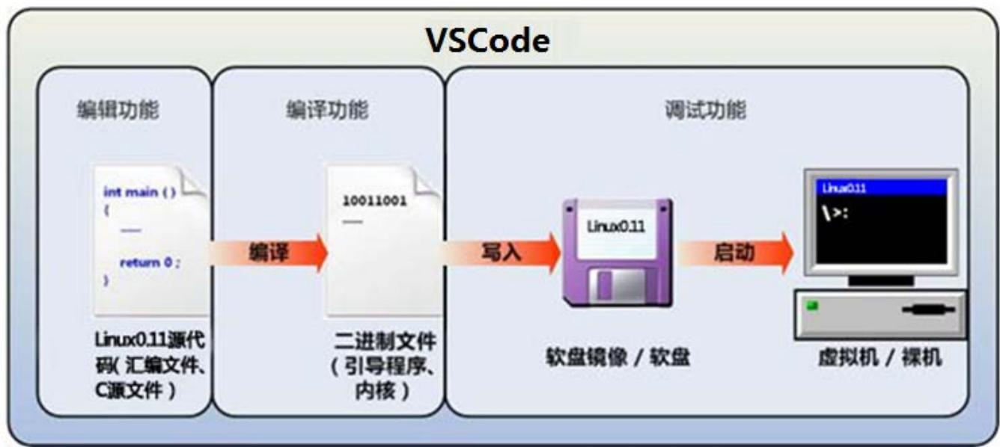


图1-2：使用VSCode编辑、编译和调试Linux0.11源代码


Linux 0.11 内核源代码与 VSCode 编程环境一同组成了本书提供的操作系统集成实验环境。图 1-3 显示了读者在进行操作系统实验时的过程，读者通过使用 VSCode 编辑、编译、调试 Linux 0.11 源代码，从而在动手实践的过程中达到理解操作系统原理的目的。


图1-3：读者进行操作系统实验


# 1.3 对原版Linux0.11的改进

本书使用的Linux0.11系统与原版的Linux0.11系统有所不同。主要体现在以下几个方面：

- 原版生成的内核文件使用 aout 格式，导致无法使用最新版本的 GDB 调试内核源代码，即便能够

使用 Bochs 虚拟机进行调试，但是由于原版生成的调试信息不准确，导致在单步调试源代码时经常发生无法预测的跳跃或异常，严重影响调试过程。本书重新优化了所有 C 源文件的编译器选项，并使用 Windows 平台的 PE 格式生成内核文件，这样就生成了能够被最新版本 GDB 识别的完整调试信息，从而允许在 Windows 平台上使用 GDB 交叉调试内核源代码。并且，由于生成的调试信息能够准确的将源代码和二进制指令一一对应，从而允许读者更加准确无误的单步调试源代码，方便读者通过调试源代码来正确理解操作系统的行为。

- 原版需要在进入Linux 0.11操作系统后使用vi编辑器编写Linux 0.11应用程序的源代码文件，然后使用GCC v1.4工具链生成aout格式的可执行文件，操作十分不便。本书成功将GCC v1.4工具链移植到了Windows平台，从而允许在Windows中编写应用程序的源代码文件，然后交叉编译出可在Linux 0.11上运行的aout格式的可执行文件，大大简化读者为Linux 0.11开发应用程序的过程。

- 原版使用晦涩难懂的 AT&T 汇编语言编写引导程序（bootsect）和加载程序（setup），这与国内读者学习的 IBM 汇编语言相差较大。本书配套的 Linux 0.11 内核使用了与 IBM 汇编语法更加类似的 NASM 汇编语言所编写的引导程序和加载程序，方便读者学习操作系统的引导和加载过程。

- 本书在原版英文注释的基础上重新编写了大量的中英文对照的注释，方便读者阅读源代码。

- 原版在终端输出大量字符时经常发生缓冲错误，导致花屏，需要频繁清理屏幕，严重影响使用效果。本书修改了源代码中的 BUG，当在终端输出大量字符时也无需再使用清屏命令。

- 原版中无法正常使用 chmod、mkdir、rm等文件操作命令，导致使用者几乎无法完成一般的文件操作。本书修改了源代码中的Bug，使这些命令都可以正常执行，从而允许读者可以通过使用这些命令，来练习Linux中的基本文件操作。

- 原版提供的 strcmp、 strcpy 等函数存在 Bug，会导致读者在修改内核的过程中产生一些很难定位的错误。本书重写了这些函数的源代码，使读者在修改内核时可以正常调用这些函数。

- 本书提供的配套 VSCode 编程环境可使用图形化的方式显示 Linux 内核的进程列表、进程控制块、进程运行轨迹、物理内存、二级页表、全局描述符表、信号量、tty0 缓冲区等重要的操作系统数据，使用户可以随时观察操作系统内部的运行情况，从而更加直观、形象的理解操作系统原理。

# 1.4 从源代码到可运行的操作系统

接下来有必要学习Linux0.11操作系统内核从源代码变为可以在虚拟机上运行的过程，参见图1-4。在将Linux0.11操作系统内核包含的源代码文件生成为二进制文件的过程中，会将boot/bootsect.asm文件生成为bootsect.bin文件（软盘引导扇区程序)，将boot/setup.asm文件生成为setup.bin文件（加载程序)，将boot/head.s和其它源代码文件生成为linux011.bin文件。其中linux011.bin文件是Linux0.11操作系统的内核。

在生成Linux 0.11内核项目的最后阶段，会自动将bootsect.bin、setup.bin和linux011.bin三个二进制文件写入软盘镜像文件floppya.img中，并将此软盘镜像文件装入Bochs虚拟机的软盘驱动器A中。启动调试后，Bochs虚拟机会从软盘驱动器A开始引导，继而启动其中的Linux 0.11操作系统。

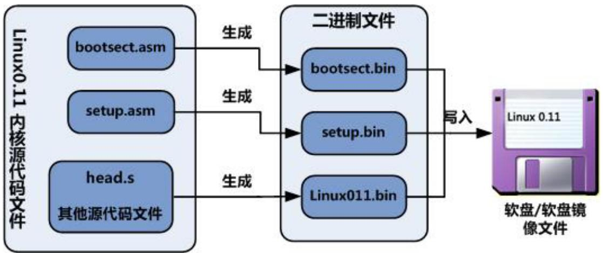


图1-4：Linux0.11操作系统内核从源代码变为可以在虚拟机上运行的过程


# 1.5 Bochs 虚拟机

本书使用虚拟机工具 Bochs 来运行 Linux 0.11 操作系统，这里对 Bochs 这种虚拟机工具软件进行简单的介绍。

# Bochs

Bochs 是一款使用 C++ 语言编写的开源 IA-32(x86) PC 模拟器，完全使用软件模拟了 Intel x86 CPU、通用 I/O 设备以及可定制的 BIOS 程序。这种完全使用软件模拟的方式又被叫做仿真。所以，准确的说 Bochs 应该是一个仿真器（Emulator），而不是虚拟机（Virtual machine）。大多数操作系统都可以在 Bochs 上运行，例如 Linux，DOS，Windows。

由于Bochs完全使用软件模拟X86硬件平台，所以可以用来调试BIOS程序和操作系统的引导程序。也就是说，Bochs可以从CPU加电后执行的第一条指令（也就是BIOS程序的第一条指令）处开始调试。本书正是利用了Bochs的这个特点，使用Bochs调试软盘引导扇区程序和加载程序。但是，正是由于Bochs完全使用软件来模拟硬件平台，造成其运行时占用大量CPU资源且性能较差。

为了使Bochs能够更好的调试Linux0.11操作系统，对Bochs的源代码进行了必要的修改，重新编译生成了能够与Linux0.11匹配的Bochs版本。所以，必须使用与VSCode编程环境一起提供的Bochs，而不能直接使用Bochs官方提供的安装包。

Bochs 常用的调试命令可以参见下面的表格：

<table><tr><td>类型</td><td>命令</td><td>操作</td></tr><tr><td rowspan="4">执行控制</td><td>c</td><td>继续执行，遇到下一个断点后中断。</td></tr><tr><td>s</td><td>逐指令调试，执行完下一个指令后中断。可以进入中断服务程序、子程序等。</td></tr><tr><td>n</td><td>逐过程调试，执行完下一个过程后中断。</td></tr><tr><td>q</td><td>结束调试。</td></tr><tr><td rowspan="4">断点</td><td>vb segment:offset</td><td>在指定的段地址（segment）和偏移地址（offset）处添加一个断点。</td></tr><tr><td>pb address</td><td>在指定的物理地址（address）处添加一个断点。</td></tr><tr><td>d n</td><td>删除指定序号（n）的断点。</td></tr><tr><td>info break</td><td>显示当前所有断点的状态信息，包括各个断点的序号。</td></tr><tr><td rowspan="3">寄存器</td><td>r</td><td>列出CPU中的通用寄存器和它们的值。</td></tr><tr><td>creg</td><td colspan="1">列出CPU中的控制寄存器和他们的值。</td></tr><tr><td>sreg</td><td colspan="1">列出CPU中的段寄存器和他们的值。</td></tr><tr><td rowspan="4">内存</td><td>x /nuf segment:offset</td><td>显示从指定的段地址和偏移地址处开始的内存中的数据,其中n用数字代替,表示数量,u可以用b代替,表示以字节为单位,f指定数据的表示方式,默认使用十六进制表示。例如命令x /1024b 0x0000:0x0000就是显示从段地址0x0000偏移地址0x0000处开始的1024个字节。</td></tr><tr><td>xp /nuf address</td><td colspan="1">显示从指定物理地址处开始的内存中的数据。/nuf和x命令中的用法一致。</td></tr><tr><td>calc register:offset</td><td colspan="1">将参数指定的逻辑地址(由段寄存器和偏移组成)转换为线性地址。</td></tr><tr><td>u /n</td><td colspan="1">显示从当前中断位置开始的n条指令的反汇编代码。</td></tr></table>

# 1.6 在线实验教学管理平台

为本书的操作系统实验提供的在线平台是一个功能十分强大的实验教学管理平台，教师可以使用浏览器登录此平台开设实验课程，并在课程中为学生发布实验任务。学生可以使用浏览器登录此平台领取实验任务，然后使用 VSCode 编程环境提供的 Git 功能将 Linux 0.11 内核源代码克隆到本地，当学生编写源代码并完成实验后，可以将源代码推送到平台供教师审阅。

平台还提供了代码量统计、线上答疑、代码查重、文档查重、团队协作、代码变更历史、实验报告在线预览、实验报告信息统计（包括页数、字数、图片数、表格数）等特色功能。

# 第2章 Linux0.11编程基础

本章主要介绍在Linux 0.11源代码中涉及到的C语言、汇编语言、数据结构等一些基础知识，并在最后简要介绍了使用VSCode提高阅读Linux 0.11源代码效率的方法。学习本章内容对阅读并理解Linux0.11源代码有很大帮助，建议读者先通读本章内容，尽量掌握本章的知识。

# 2.1 Linux 0.11 内核源代码的结构

使用 VSCode 打开 Linux 0.11 内核项目后，在“项目管理器”窗口中可以看到如图 2-1 所示的内容，在此窗口中可以浏览 Linux 0.11 内核包含的源代码文件和文件夹。展开文件夹，可以浏览文件夹所包含的文件。Linux 0.11 内核的源代码文件按照其所属的模块或其实现的功能，组织在不同的文件夹中，详细的说明可以参见表 2-2。

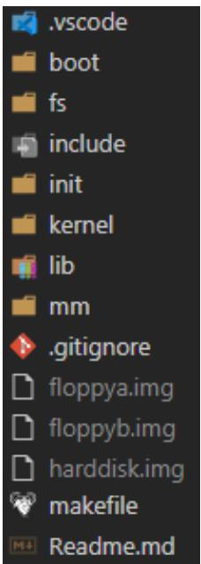


图2-1：VSCode“项目管理器”窗口中的Linux0.11文件和文件夹


<table><tr><td>文件或文件夹</td><td>说明</td></tr><tr><td>.vscode</td><td>VSCode 配置文件放在此目录中,包括任务配置文件 tasks.json 和调试配置文件 launch.json 等。</td></tr><tr><td>boot</td><td>引导启动程序目录,包括磁盘引导程序 bootsect.asm、32 位运行启动代码程序 head.s 和获取 BIOS 中参数的 setup.asm 汇编程序。</td></tr><tr><td>fs</td><td>文件系统相关的源代码文件。</td></tr><tr><td>include</td><td>头文件主目录,包括所有的头文件。</td></tr><tr><td>init</td><td>包括内核系统的初始化程序 main.c 文件。</td></tr><tr><td>kernel</td><td>内核程序主目录,包括进程调度、系统调用函数以及 blk_dev 目录下的块设备驱动程序、chr_dev 目录下的字符设备驱动程序和 math 目录下的数学协处理器仿真程序。</td></tr><tr><td>lib</td><td>内核库函数目录,包括向编译系统等提供接口函数的库函数源代码文件。</td></tr><tr><td>mm</td><td>内存管理程序目录,包括内存管理模块程序的源代码文件。</td></tr><tr><td>floppya.img
文件</td><td>无文件系统的平坦式软盘镜像，大小为1.44MB。Linux 0.11的引导程序、加载程序和内核都会写入此软盘镜像中，然后让 Bochs 虚拟机从该软盘镜像启动 Linux 0.11 操作系统。</td></tr><tr><td>floppyb.img
文件</td><td>FAT12 文件系统软盘镜像，大小为1.44MB，用于在 Linux 0.11 与 windows 之间交换文件。</td></tr><tr><td>harddisk.img
文件</td><td>MINIX 1.0 文件系统硬盘镜像，提供根文件系统，并存储 Linux 0.11 需要用到的文件（包括应用程序可执行文件和库文件等）。</td></tr><tr><td>makefile
文件</td><td>构建脚本 makefile 文件。Make 工具使用此文件中的脚本，将 Linux 0.11 的源代码构建为可以在虚拟机中运行的二进制文件，并写入软盘镜像文件 floppya.img 中。</td></tr><tr><td>.gitignore
文件</td><td>Git 源代码版本管理工具使用此文件中的内容将文件夹中的指定文件或文件夹忽略掉，不将这些忽略掉的文件或文件夹放入 Git 的版本库中。在图 2-1 中可以看到由于三个磁盘镜像文件比较大，所以都被忽略掉了（在 VSCode 中使用浅色文本表示从 Git 库中忽略的文件）。</td></tr><tr><td>Readme.md</td><td>使用 Markdown 格式编写的自述文件。</td></tr></table>

表 2-2: Linux 0.11 内核源代码组织方式的详细说明

请读者注意，在后面的内容中，为了准确说明源代码文件在Linux 0.11内核项目的文件夹中的位置，会使用路径格式来表示文件，例如，init/main.c就是指在init文件夹中的main.c文件。

# 2.2 NASM汇编

假设读者已经系统的学习过如何使用MASM工具编写汇编程序，这里通过阐述MASM与NASM之间的主要区别，帮助读者迅速掌握NASM的用法。如果读者从来没有学习过汇编语言的相关知识，可以立即跳过本节和下一节，阅读本书并不要求读者必须具备汇编语言方面的知识。

# NASM 是大小写敏感的

一个简单的区别是NASM是大小写敏感的。当使用符号“foo”，“Foo”或“FOO”时，它们是不同的。

# NASM需要方括号来引用内存地址中的内容

先来看看在MASM中是怎么做的，比如，如果声明了：

foo equ 1

bar dw 2

然后有两行代码：

mov ax, foo

mov ax, bar

尽管它们有看上去是完全相同的语法，但MASM却为它们产生了完全不同的操作码。

NASM为了在看到代码时就能知道会产生什么样的操作码，使用了一个相当简单的内存引用语法。规则是任何对内存中内容的存取操作必须要在地址上加上方括号，但任何对地址值的操作则不需要。所以，形如“mov ax, foo”的指令总是代表一个编译时常数，无论它是一个“EQU”定义的常数或一个变量的地址；如果要取变量“bar”在内存中的内容，必须将代码编写为“mov ax, word [bar]”。

这就意味着NASM不需要MASM的“OFFSET”关键字，因为MASM的代码“mov ax, offset bar”同NASM的“mov ax, word [bar]”是完全等效的。

NASM同样不支持MASM的混合语法。比如MASM的“mov ax, table[bx]”语句使用一个中括号外的部分加上一个中括号内的部分来引用一个内存地址，NASM的语法应该是“mov ax, word [table+bx]”。同样，MASM中的“mov ax, es:[di]”在NAMS中应该是“mov ax, word [es:di]”。

# NASM 不存储变量的类型

NASM 不会记住声明的变量的类型。然而，MASM 在看到“var dw 0”时会记住类型，也就是声明 var 是一个字大小的变量，然后就可以隐式地使用“mov var, 2”给变量赋值。NASM 不会记住关于变量 var 的任何东西，除了它的起始位置，所以必须显式地编写代码“mov word [var], 2”。

因此，NASM不支持“LODS”，“MOVS”，“STOS”，“SCANS”，“CMPS”，“INS”或“OUTS”指令，仅仅支持形如“LODSB”，“MOVSW”和“SCANSD”之类的指令。它们都显式地指定了被处理的字符串大小。

# NASM 不支持内存模型

NASM同样不含有任何操作符来支持不同的16位内存模型。在使用NASM编写16位代码时，必须自己跟踪哪些函数需要FARCALL，哪些需要NEARCALL，并有责任确定放置正确的“RET”指令（“RETN”或“RETF”，NASM接受“RET”作为“RETN”的另一种形式）；另外必须在调用外部函数时在需要的地方编写CALL FAR指令，并必须跟踪哪些外部变量定义是FAR，哪些是NEAR。

# NASM 不支持 PROC

在MASM中使用PROC关键字编写函数时，会在函数的开始自动添加代码：

push bp

move bp, sp

还会在函数结尾的 ret 指令前自动添加 leave 指令。但是由于 NASM 不支持 PROC 关键字, 所以, 以上由 NASM 自动添加的代码在 NASM 中必须手动添加。

# NASM可以生成BIN文件

NASM 除了可以将 ASM 文件汇编成目标文件（用于与其它目标文件链接成可执行文件）外，还可以将 ASM 文件汇编成一个只包含编写的代码所生产的二进制机器指令的 BIN 文件。BIN 文件主要用于制作操作系统的引导程序和加载程序，例如由 Linux 0.11 内核源代码文件 boot/bootsect.asm 和 boot/setup.asm 所生成的 boot.bin 和 setup.bin 文件。

用于生成BIN文件的ASM文件的第一行语句往往会使用org关键字，例如“org 0x7C00”。此行语句告诉NASM汇编器，这段程序生成的BIN文件将要被加载到内存偏移地址0x7C00处，这样NASM汇编器就可以根据此偏移地址定位程序中变量和标签的位置。

NASM还经常会用到$和$$。$表示当前指令在完成汇编过程后,在二进制程序中的地址,所以,语句“jmp $”表示不停地执行本行指令,也就是死循环。$$表示一段程序的开始处在二进制程序中的地址。在Linux 0.11的软盘引导扇区程序源文件(boot/bootsect.asm)中$$就表示引导程序的开始地址。所以,在该文件末尾的语句

times 510-($-$$) db 0

表示将0这个字节重复510-($-$$$)遍,也就是从当前位置开始,一直到程序的第510个字节都填充0。

另外，NASM中宏与操作符的工作方式也与MASM完全不同，更详细的内容请参考NASM汇编器的配套手册。

# 2.3 C和汇编的相互调用

操作系统是建立在硬件上的第一层软件，免不了要直接操作硬件，而操作硬件的唯一办法就是使用汇编语言。Linux 0.11 中只包含了极少量的汇编代码，这些汇编代码将一些基本的硬件操作包装成可供 C 语言调用的函数。本节内容主要介绍 C 和汇编在相互调用时应该遵守的一些约定，Linux 0.11 中的代码也同样遵守这些约定。下面示例中的汇编代码使用的是 NASM 汇编语法，如果读者有不明白的地方，可以参考 2.2 节。

在编译C代码时，编译器会先将C代码翻译成汇编代码，然后再将汇编代码编译成可在硬件上执行的机器语言。下面简单介绍各种C编译器在将C代码翻译成汇编时所遵守的几项约定：

1. 全局变量的名称和函数名在翻译成汇编符号时，要在名称的前面添加一个下划线。

2. 默认通过调用栈（Call Stack）传递函数参数。函数参数入栈的顺序是从右到左。

3. 被调用的函数（Callee）返回后，由调用者（Caller）释放函数参数占用的栈空间。

4. 通过EAX寄存器传递函数的返回值。

5. 被调用函数在使用 EBX、ESI、EDI、EBP 寄存器前要先保存这些寄存器的值（通常是保存在栈中），在函数返回前还要恢复这些寄存器的值。被调用函数可以随意使用 EAX、ECX、EDX 寄存器。

<table><tr><td>C 代码</td><td>NASM 汇编代码</td></tr><tr><td>// 定义全局变量c。int c = 0; // 定义求和函数。int add(int a, int b) {</td><td>[section .data] ; 数据段_c dd 0[section .text] ; 代码段_add: ; 构造调用栈帧(Call Stack Frame)。push ebp ; 保存ebp mov ebp, esp ; 新的ebp指向栈顶</td></tr><tr><td>// 定义局部变量int c; c = a + b; return c; } int main() {</td><td>sub esp, 4 ; 在栈顶为局部变量c分配空间L2: mov eax, [ebp + 8] ; eax = a。通过ebp访问参数mov ecx, [ebp + 12] ; ecx = badd eax, ecx ; 求和mov [ebp - 4], eax ; 将和赋值给局部变量cmov eax, [ebp - 4] ; 将返回值赋值给eaxleave ; 销毁调用栈帧, 相当于: ; mov esp, ebx; ; pop ebxretmain::构造调用栈帧。push ebpmov ebp, esp</td></tr><tr><td>c = add(5, 6); return 0}</td><td>L1: push dword 6 ; 参数二入栈push dword 5 ; 参数一入栈call _add ; 调用函数L3: add esp, 8 ; 释放参数占用的栈空间mov [_c], eax ; 将函数返回值赋值给全局变量cxor eax, eax ; eax = 0leave ; 销毁调用栈帧ret}</td></tr></table>

表 2-3: C 代码对应的 NASM 汇编代码。

表2-3使用一段非常简单的C程序和其对应的NASM汇编代码来举例说明上面的各项约定。仔细观察表2-3中的代码可以发现，C代码中的全局变量c和函数名称add到了汇编代码中都在其前面添加了一个下划线，这是符合第一条调用约定的。在main函数和add函数返回时都将返回值放入了EAX寄存器中，

这又符合了调用约定四。调用约定二和约定三规定了函数调用与堆栈协同工作的方式，接下来结合图示进行详细说明。

在开始之前，需要再强调一下关于堆栈的几个知识点：堆栈是一个后进先出的队列，X86 CPU从硬件层次就支持堆栈操作，提供了SS、ESP、EBP等寄存器，其中SS寄存器保存了堆栈段的起始地址，ESP寄存器保存了栈顶地址。X86 CPU还提供了用于操作堆栈的指令PUSH、POP等。由于X86 CPU的堆栈是从高地址向低地址生长的，所以，PUSH指令会先减少ESP寄存器的值（CPU在16位实模式下减2，在32位保护模式下减4)，再将数据放入栈顶，POP指令会先从栈顶取出数据，再增加ESP寄存器的值。强调了关于堆栈的基本知识，再结合示例程序在32位保护模式下执行的过程，详细讨论函数调用对堆栈的影响。

当程序执行到 main 函数的 L1 行代码时，可以认为这是调用堆栈的初始状态，此时 EBP 和 ESP 同时指向栈顶，如图 2-4。

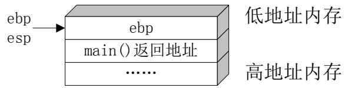


图2-4：初始的堆栈状态


在调用add函数前，首先将函数的参数按照从右到左的顺序压入堆栈，如图2-5。

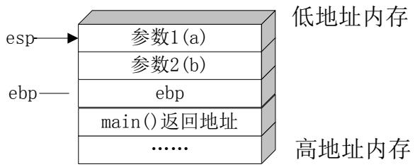


图2-5：参数入栈后的堆栈状态


使用CALL指令调用add函数，会首先将add函数的返回地址压入堆栈，然后再跳转到add函数的起始地址继续执行，所以当执行到add函数的L2行代码时，堆栈状态如图2-6。

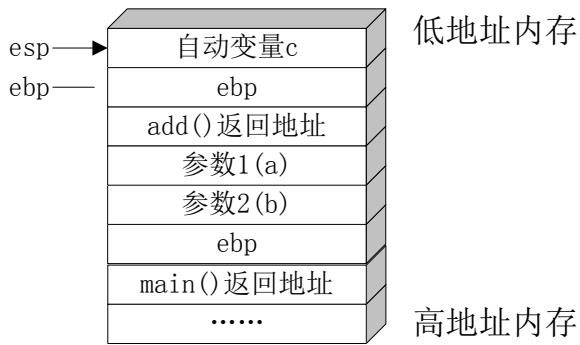


图2-6：进入函数后的堆栈状态


由于在参数入栈后，又先后有add函数的返回地址和EBP寄存器入栈，所以  $\mathrm{EBP} + 8$  是参数1的起始地址， $\mathrm{EBP} + 12$  是参数2的起始地址。在add函数结束时，LEAVE指令会将EBP赋值给ESP，然后再将EBP出栈，也就是恢复旧的EBP中的值，此时堆栈状态如图2-7。

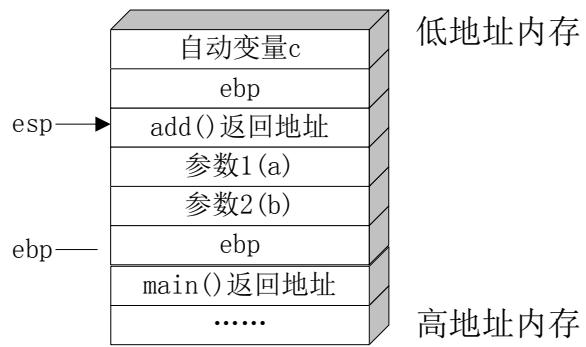


图2-7：LEAVE指令执行后的堆栈状态


RET指令会将add函数的返回地址出栈并放入IP寄存器继续执行，也就是从main函数的L3行代码处继续执行，此时堆栈的状态如图2-8。

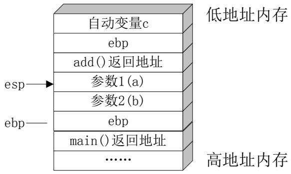


图2-8：RET指令执行后的堆栈状态


最后，为了清理堆栈中传递给add函数的参数，还需要在main函数中为ESP增加8，从而回到图2-8所示的状态。至此，调用约定二和调用约定三也讲解完毕。

弄明白了调用约定，在C中调用汇编函数就很简单了。先按照调用约定编写汇编函数，然后在汇编文件中使用global关键字将汇编函数符号声明为全局的，最后在C源文件中声明汇编函数对应的C语言函数原型，即可在C中像调用C函数一样调用汇编函数了。

在汇编中调用 C 函数同样简单。完成 C 函数后，在汇编文件中使用 extern 关键字声明 C 函数名称对应的汇编符号，然后，在汇编中按照约定调用即可。

# 2.4 原语操作

Linux 0.11 内核中维护了大量的内核数据，正是这些内核数据描述了 Linux 0.11 操作系统的状态。如果有一组相互关联的内核数据共同描述了操作系统的某个状态，那么在修改这样一组内核数据时就必须保证它们的一致性，即要么不修改，要么就全都修改。这就要求修改这部分内核数据的代码在执行的过程中不能被打断，这种不能被打断的操作就被称为“原语操作”。

如何保证代码的执行不被打断呢？或者说如何保证一个操作是原语操作呢？这要从软、硬两个方面来解决。首先从软的方面考虑，需要保证编写的代码在修改内核数据的过程中不会中断执行，例如不能在只修改了一部分数据后就结束操作，这只需要在设计原语操作和编写代码的时候多加小心即可。接下来从硬的方面考虑，外部设备发送给CPU的中断会让CPU暂时中止当前程序的执行，转而执行相应的中断处理程序。现在假设一个原语操作要修改内核中的日期和时间两个变量，但是在原语操作只修改了日期后就发生了外部中断，中断处理程序从内核中读取的日期和时间肯定就是错误的。所以，一般情况下，在执行原语操作前需要通知CPU停止响应外部中断，待操作执行完毕后再通知CPU恢复响应外部中断。

X86 CPU 是根据 eflags 状态字寄存器中的 IF 位来决定是否响应外部中断的，并提供了 STI 指令设置 IF 位从而允许响应外部中断，还提供了 CLI 指令清空 IF 位从而停止响应外部中断。

在Linux 0.11内核中应该成对使用指令STI和CLI来实现原语操作。例如，内核中的函数A需要实现一个原语操作，就应该按照下面的方式编写代码：

```txt
void A()  
{  
    BOOL IntState; // 定义一个局部变量，用于保存停止中断响应前的中断状态。  
    … // 非原语操作代码。  
    CLI; // 停止响应外部中断。  
    … // 原语操作代码。  
    STI; // 恢复停止响应外部中断前的中断状态。  
    … // 非原语操作代码。
```

Linux 0.11 中不支持原语操作的嵌套。所以下面的代码是有问题的，原因是在 A 函数的末尾打开了中断，导致 B 函数中在调用 sti 之前就打开了中断。读者可以考虑使用代码示例中的 IntState 变量来实现可嵌套的原语操作，也就是改造 Linux 0.11 提供的 cli() 和 sti() 函数（在 include/asm/system.h 文件中定义），使 cli 函数在调用时，首先返回当前中断的状态，并保存在 IntState 变量中，然后再关闭中断，而 sti 函数在调用时，不再总是打开中断，而是根据函数中 IntState 变量的值来决定是否真的需要打开中断。

```txt
void B()   
{ BOOL IntState; CLI; A();//调用函数A。B的原语操作包含了A的操作内容。 …//其它原语操作 STI;
```

# 2.5 C语言中变量的内存布局

C语言编写的源代码用于描述程序中的指令和数据。其中，指令全部保存在程序的可执行文件中，并随可执行文件一同载入内存。绝大多数情况下，指令在内存中的位置是不变的，并且是只读的，所以暂时不做过多的讨论。程序中的数据主要是由C源代码中的各种数据类型定义的变量来描述的，而且这些数据在内存中的分布情况要复杂一些，这就是本节要讨论的重点。通过阅读本节内容，读者可以了解到C语言定义的数据类型所描述的内存布局，还能够了解到各种变量在内存中的位置，这对于读者深刻理解Linux0.11操作系统的行为，特别是内存使用情况会有很大帮助。

从CPU的角度观察，内存就是一个由若干字节组成的一维数组，用来访问数组元素的下标就是内存的地址。与典型数组不同的是，CPU可以将从某个地址开始的几个连续的字节做为一个整体来同时访问，例

如，CPU可以同时访问1个、2个、4个或更多个字节。可以这样来理解，CPU在访问内存时需要同时具备两个要素：一个是内存基址，即从哪里开始访问内存；另一个是内存布局，即访问的字节数量。相对应的，在C语言编写的源代码中，数据类型（包括基本数据类型和结构体等）用来描述内存布局，并不占用实际的内存，而只有使用这些数据类型定义的变量才会占用实际的内存，从而确定内存基址。

# 数据类型描述的内存布局

在C语言中预定义的基本数据类型，包括char、short、long和指针类型等，所描述的内存布局就是若干个连续的字节。例如char类型描述了1个字节，short类型描述了2个字节，long类型描述了4个字节（基于32位处理器，下同)，指针类型（无论是哪种指针类型）也是描述了4个字节。使用这些数据类型定义变量的过程，就是为变量分配内存的过程，也就是确定基址的过程。再结合这些数据类型所描述的内存布局，CPU即可访问变量所在的内存。考虑下面的代码：

```txt
char a = 'A';  
short b = 0x1234;  
long c = 0x12345678;  
void* p = &c;
```

这四个变量的内存布局可以像图2-9所示的样子（注意字节是反序的，原因参见第2.6节）。以变量p为例，其内存基址为0x402008，并且由于空指针类型描述的内存布局是4个字节，所以变量p所在的内存为从0x402008起始的4个字节。由于变量p所在的内存同时具备了内存基址和内存布局这两个要素，CPU就可以访问变量p所在的内存了，于是CPU可以将变量c的地址放入变量p所在的内存。

接下来分析一下CPU在访问内存时，如果缺少了某个要素，会出现什么样的情况。如果添加了一行语句“*p = b;”，则编译器会报告错误。原因是该语句的本意是将变量b内存中的数据复制到指针p所指向的内存中。虽然已经知道指针p指向的内存基址是0x402004，但是由于指针p是一个空指针类型，即p所指向的内存的类型为空（void)。所以CPU在试图访问指针p所指向的内存时，就无法确定从基址开始访问的字节数量，也就是缺少了内存布局这个要素。对于这种情况，可以将语句修改为“*(short*)p = b;”，将指针p的类型强制转换为short指针类型，即使用short类型描述指针p所指向的内存，则该语句就可以将0x402004字节的值修改为0x34，将0x402005字节的值修改为0x12了。于是可以得出一个结论：类型转换（包括自动转换和强制转换）的过程，就是修改内存布局这个要素的过程。

本质上，只要具备了内存基址和内存布局这两个要素，即使不使用变量也同样可以访问内存，例如语句“ $(\text{short}*)0x402006 = \text{b}$ ；”也是可以正确执行的。读者应该学会从内存基址和内存布局的角度来理解各种数据类型（特别是指针类型）的使用方法。当源代码中出现问题或者是难于理解的地方，可以尝试使用内存基址和内存布局这两个要素来进行分析。

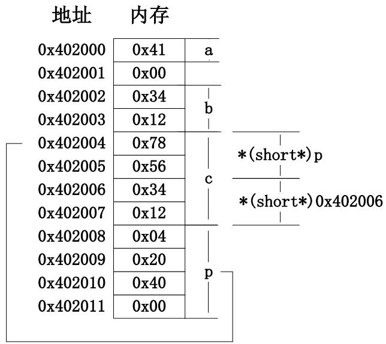


图2-9：最简单的数据类型所描述的内存布局。


结构体类型定义的变量也同样具有内存基址和内存布局这两个要素，只不过由结构体类型定义的变量，其内存布局还需要遵守以下的两条准则：

- 结构体变量中第一个域的内存基址等于整个结构体变量的内存基址。

- 结构体变量中各个域的内存基址是随它们的声明顺序依次递增的。

接下来通过一些实际的例子来说明这两条准则。为了强调内存基址和内存布局这两个要素，举例时会使用结构体类型的指针指向一块内存，从而确定内存基址和内存布局。首先考虑下面的源代码：

```c
unsigned char ByteArray[8] = {0x10, 0x20, 0x30, 0x40, 0x50, 0x60, 0x70, 0x80};
```

```c
typedef struct _F00{ longMember1; longMember2; }F00，\*PF00;
```

```txt
PFOO Pointer = (PFOO)ByteArray;
```

指针 Pointer 指向的内存基址和内存布局可以像图 2-10 所示的样子。此时，表达式 Pointer->Member1 的值为 0x40302010，表达式 Pointer->Member2 的值为 0x80706050。其中，表达式&Pointer->Member1 得到的地址为 0x402000，与指针 Pointer 指向的地址相同，可以说明第一条准则是成立的；表达式&Pointer->Memeber2 得到的地址大于&Pointer->Member1 得到的地址，可以说明第二条准则也是成立的。


地址 内存


<table><tr><td>0x402000</td><td>0x10</td><td rowspan="4">Member1</td><td rowspan="12">ByteArray</td></tr><tr><td>0x402001</td><td>0x20</td></tr><tr><td>0x402002</td><td>0x30</td></tr><tr><td>0x402003</td><td>0x40</td></tr><tr><td>0x402004</td><td>0x50</td><td rowspan="4">Member2</td></tr><tr><td>0x402005</td><td>0x60</td></tr><tr><td>0x402006</td><td>0x70</td></tr><tr><td>0x402007</td><td>0x80</td></tr><tr><td>0x402008</td><td>0x00</td><td rowspan="4">Pointer</td></tr><tr><td>0x402009</td><td>0x20</td></tr><tr><td>0x402010</td><td>0x40</td></tr><tr><td>0x402011</td><td>0x00</td></tr></table>

图2-10：结构体类型所描述的内存布局。

这里需要特别说明一下二元操作符“->”，注意此操作符的左侧和右侧都会涉及到内存基址和内存布局这两个要素。该操作符的工作过程是这样的，首先根据左侧的结构体类型和右侧的域，计算出域在结构体类型中的偏移值，然后将该偏移值与左侧的结构体指针变量所指向的地址相加，从而得到右侧域的内存基址，最后再结合域的数据类型（内存布局）来访问对应的内存。例如，考虑表达式 Pointer->Member2，“->”操作符首先计算出域 Member2 在结构体 F00 中的偏移值是 4，与 Pointer 指向的地址 0x40200 相加得到地址 0x40204，再结合域 Member2 的数据类型（内存布局）访问内存中的数据。

结构体中相邻的域所描述的内存布局总是紧密相邻的吗？答案是否定的。为了提升CPU访问内存的速度，默认情况下，C语言编译器会保证基本数据类型的内存基址是某个数k(通常为2或4)的倍数，这就是所谓的内存对齐，而这个k则被称为该数据类型的对齐模数。以用来编译Linux0.11源代码的GCC编译器为例，默认情况下，任何基本数据类型的对齐模数就是该数据类型的大小。比如对于double类型(大小为8字节)，就要求该数据类型的内存基址总是8的倍数，而char数据类型（大小为1字节)的内存基址则可以从任何一个地址开始。考虑下面的两个结构体：

```txt
// #pragma pack(1)
```

```txt
typedef struct _F001{ shortMember1; longMember2; }F001，\*PFO01;
```

```c
typedef struct _F002 {
    unsigned char Member1;
    short Member2;
    long Member3;
} F002, *PF002;
```

如果使用这两个结构体定义的指针变量指向 ByteArray 数组，则指针变量描述的内存布局可以像图 2-11

所示的样子。

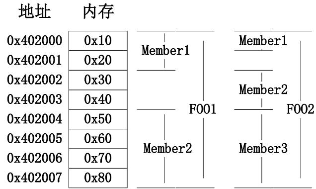


图2-11：默认情况下结构体的内存布局。


C语言提供了一个编译器指令“#pragma pack(n)”用来指定数据类型的对齐模数。将n替换为指定的对齐模数，则在该编译器指令之后出现的所有数据类型都会使用指定的模数来进行内存对齐，如果忽略了小括号中的n，就会使用默认的方式来进行内存对齐。所以，如果取消注释之前代码中的第一行和最后一行语句，内存布局就会变为图2-12所示的样子。

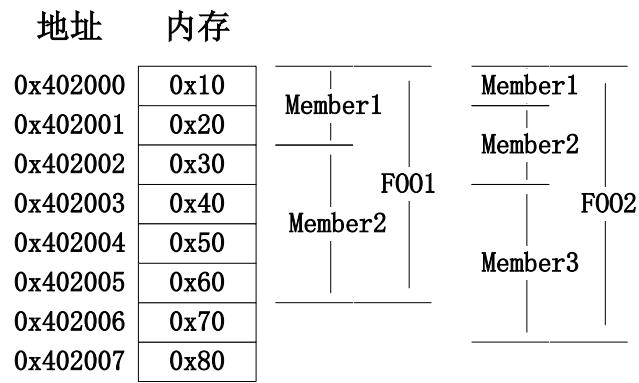


图2-12：按照1字节对齐后的结构体的内存布局。


接下来说明一下联合体类型所描述的内存布局。联合体类型中的各个域总是使用相同的内存基址，但是它们会使用各自的数据类型来描述内存布局，并且联合体类型的大小由占用字节最多的那个域来决定。下面的代码在结构体类型中嵌入了一个联合体：

```txt
typedef struct _F003{ union { shortMember1; longMember2; }u; longMember3; }F003，*PFO03;
```

如果使用此结构体定义的指针变量指向 ByteArray 数组，则指针变量描述的内存布局可以像图 2-13 所示的样子。


地址 内存


<table><tr><td>0x402000</td><td>0x10</td><td>Member1</td><td></td></tr><tr><td>0x402001</td><td>0x20</td><td rowspan="3" colspan="2">Member2 u</td></tr><tr><td>0x402002</td><td>0x30</td></tr><tr><td>0x402003</td><td>0x40</td></tr><tr><td>0x402004</td><td>0x50</td><td rowspan="4" colspan="2">Member3</td></tr><tr><td>0x402005</td><td>0x60</td></tr><tr><td>0x402006</td><td>0x70</td></tr><tr><td>0x402007</td><td>0x80</td></tr></table>


图2-13：联合体的内存布局。


最后，由于Linux 0.11源代码中还用到了位域这种数据类型，所以再简单介绍一下位域的内存布局（关于位域的详细用法，请读者参考C语言程序设计教材）。所谓位域，就是把若干字节中的二进制位划分为几个不同的区域，并说明每个区域的位数。定义位域时，其各个域的数据类型必须是相同的，并且由此数据类型决定整个位域的内存布局（占用的字节数量），而各个域只说明各自占用的位数。考虑下面定义的位域：

```txt
typedef struct _F004 { long Head:10; long Middle:10; long Tail:12; }F004，*PFO04;
```

如果使用此位域定义的指针变量指向 ByteArray 数组，则指针变量描述的内存布局可以像图 2-14 所示的样子。此位域中各个域都是 long 类型的，所以整个位域可以描述从 0x402000 开始的 4 个字节。此时，表达式 Pointer->Head 的值为 0x10（0000010000），表达式 Pointer->Middle 的值为 0x08（0000001000），表达式 Pointer->Tail 的值为 0x403（010000000011）。

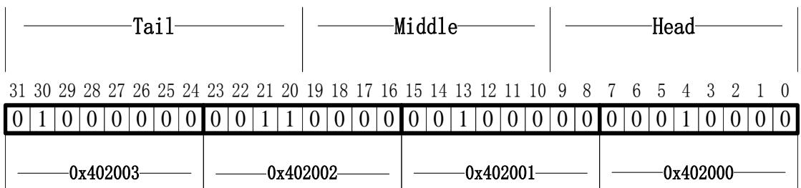


图2-14：位域的内存布局。


# 变量在内存中的位置

以变量在内存中的位置来区分，可以将变量分为静态变量和动态变量。静态变量是指在程序运行期间在内存中的位置不会发生改变的那些变量，包括全局变量和使用static声明的局部变量。动态变量是指在程序运行期间会动态的为其分配内存的那些变量，包括函数的形式参数和局部变量（未加static声明）。

相对应的，程序在运行期间所占用的内存也会分为静态存储区和动态存储区。其中，静态存储区与程序可执行文件中的数据区是完全相同的，原因是在使用C源代码生成程序的可执行文件时，就已经将所有的静态变量放置在数据区中。在一个程序开始执行时，操作系统会首先将程序的可执行文件载入内存，并使用可执行文件中的数据区创建静态存储区，这样所有的静态变量就很轻松的出现在内存中了。对于动态存储区，它是在程序开始执行之前被操作系统创建的一块内存，用来存放动态变量以及函数调用时的现场和返回地址，也就是常说的栈（stack）。在程序运行期间，调用函数时会为动态变量分配栈，函数结束时会展开栈（可以参考第2.3节）。

# 2.6 字节顺序 Little-endian 与 Big-endian

# 字节顺序

这里的“字节顺序”是指，当存放多字节数据（例如4个字节的长整型）时，数据中多个字节的存放顺序。典型的情况是整数在内存或文件中的存放方式和网络传输的传输顺序。

对于单一的字节，大部分处理器以相同的顺序处理位元，因此单字节的存放方法和传输方式一般相同。对于多字节数据，在不同的处理器的存放方式主要有两种，一种是Little-endian，另一种是Big-endian。

# Little-endian

采用此种字节顺序存储长整型数据0x0A0B0C0D到内存或文件中是下面的样子：

# 低地址

<table><tr><td>a</td><td>0x0D</td></tr><tr><td>a+1</td><td>0x0C</td></tr><tr><td>a+2</td><td>0x0B</td></tr><tr><td>a+3</td><td>0x0A</td></tr></table>

# 高地址

可以简单的记忆为“低字节存在低地址”。

# Big-endian

采用此种字节顺序存储长整型数据0x0A0B0C0D到内存或文件中是下面的样子：

# 低地址

<table><tr><td>a</td><td>0x0A</td></tr><tr><td>a+1</td><td>0x0B</td></tr><tr><td>a+2</td><td>0x0C</td></tr><tr><td>a+3</td><td>0x0D</td></tr></table>

# 高地址

可以简单的记忆为“高字节存在低地址”。

# 何处使用

网络传输一般使用Big-endian。而不同的处理器体系会使用不同的字节顺序：

X86，MOS Technology 6502，Z80，VAX，PDP-11等处理器为Littleendian。

- Motorola 6800，Motorola 68000，PowerPC 970，System/370，SPARC（除V9外）等处理器为Bigendian。

- ARM, PowerPC (除 PowerPC 970 外), DEC Alpha, SPARC V9, MIPS, PA-RISC and IA64 的字节序是可配置的。

# 掌握的意义

在多数情况下，不需要关心字节顺序就可以编写程序，但是在某些场合必须知道平台的字节顺序才能完成工作，例如在采用Intel X86处理器的计算机上调试程序，如果想查看一块内存中的数据，就必须意识到数据是使用Little-endian的字节顺序存储到内存中的，这样在人工读取的时候才能够识别出正确的数据。

# 2.7 使用 VSCode 阅读 Linux 0.11 源代码的方法和技巧

相信很多读者一拿到Linux 0.11操作系统的源代码，就会怀着极大的好奇心开始如饥似渴的阅读，迫不及待的想将Linux 0.11的源代码全部掌握。但是，万事开头难，虽然Linux 0.11操作系统的规模比任何一个具有商业价值的软件至少要小上一个数量级，要想在很短的时间内掌握Linux 0.11的所有源代码还是有一些困难。如果读者为自己设定的目标不合理，采用的方法不正确，很可能会在执行失败后产生挫败感，甚至放弃学习。接下来为读者提供一些有益的建议，希望能够帮助读者更顺利的阅读Linux 0.11的源代码。

首先，读者应该明确阅读Linux 0.11源代码的目的，或者说通过阅读Linux 0.11源代码，读者能够学到哪些有用的知识，对读者参加实际工作会有哪些帮助。最重要的目的当然是理解操作系统原理，Linux 0.11源代码能够帮助读者将书本上枯燥的理论实例化。虽然读者亲自动手开发一个商业操作系统的可能性很小，但是操作系统所使用的许多思想在计算机科学的各个领域有广泛的适用性，学习操作系统的内部设计理念对于算法设计和实现、构建虚拟环境、网络管理、并行计算等其它多个领域也非常有用。而且，Linux 0.11源代码是精心编写的高质量源代码，无论是代码的组织结构还是代码的编写风格，都是按照商业级的规格来完成的，这些在读者的实际工作中都会有很大的借鉴意义。此外，本书由于篇幅的限制，不可能涉及到Linux 0.11操作系统的所有内容，幸好源代码本身就是最完全、最准确的文档，读者通过学习Linux 0.11的源代码，能够获得几倍于本书内容的知识。

其次，读者在开始深入分析Linux 0.11的源代码之前，还应该完成一些准备工作。Linux 0.11的源代码主要使用C语言编写，定义有较多的数据结构，并尽量使用常用的、简单的算法来操作这些数据结构，所以读者需要有比较扎实的C语言程序设计、数据结构和算法的相关知识。如果读者感觉自己在这些方面还比较薄弱，也不用紧张，本书的第2章会帮助读者回忆和巩固这些知识。此外，阅读源代码也是一件相对比较枯燥的事情，读者要对可能遇到的困难有一个正确的认识，并做好心理准备，应该根据实际情况为自己设计一个合理的目标，并保证必要的投入和毅力。

建议读者将赵炯博士编写的《Linux内核完全注释》一书做为主线，在阅读每一个章节的同时，阅读相应的Linux 0.11 源代码，并动手完成本书中的实验。这样，在本书的帮助下，读者可以有重点的、分模块的详细分析Linux 0.11 的源代码。在阅读源代码时应该使用一些正确的方法，从而达到事半功倍的效果。已经有专门的书籍详细介绍阅读源代码的方法，本书由于篇幅的限制，在这里只能为读者列举一些快速而有效的方法。

- 应该首先搞清楚 Linux 0.11 源代码的组织方式。例如 Linux 0.11 都包含哪些源代码文件，这些源代码文件是如何组织在不同的文件夹中的。这对于读者快速掌握 Linux 0.11 的结构有很大帮助。

- 重视Linux 0.11中的数据结构。要搞清楚数据结构中各个域的意义，以及Linux 0.11使用这些数据结构定义了哪些重要的变量（特别是全局变量）。Linux 0.11 操作系统的大部分函数都是在操作由这些数据结构所定义的变量，要搞清楚函数对这些变量进行的操作会产生怎样的结果。

- 分析函数的层次和调用关系。要特别注意哪些函数是全局函数，哪些函数是模块内部使用的函数。

- 本书对于特别简单或者特别复杂的函数会一语带过，读者也可以在搞清楚这些函数功能的基础上暂时跳过它们，从而将有限的时间和精力用于学习本书详细介绍的重要函数。

- 重视阅读源代码文件中的注释，必要的情况下可以根据自己的理解添加一些注释。

- 充分使用 VSCode 提供的强大功能提高阅读源代码的效率。

- 每当阅读完一部分源代码后，应该认真思考一下，大胆的提出一些问题，例如“为什么要这样编写？可以不可以用别的方法来编写？”。也可以试着向别人介绍自己正在阅读的源代码，或者将自己的心得发布到互联网上。以某种方式表达自己思想的过程，其实就是重新疏理知识的过程，这样能够让读者的知识更加系统化，并且有可能发现被忽略掉的细节。

由于Linux 0.11操作系统的源代码是完全开放的，所以，读者除了可以完成本书配套的实验之外，还可以自己设计一些小实验，例如对Linux 0.11进行一些修改或者添加一些功能来验证读者的想法。

接下来重点介绍一下如何使用 VSCode 提供的强大功能提高阅读源代码的效率。VSCode 的设计初衷之一就是希望解放用户的鼠标，使所有的操作都能通过键盘进行，所以建议读者在学习下面介绍的各种功能的时候，有意识的练习快捷键的用法，让手指在键盘上飞起来。

# 符号高亮与代码折叠

VSCode提供的源代码编辑器为多种源代码文件（.c，.cpp，.h，.asm等）提供了符号高亮显示功能，可以帮助读者在阅读源代码的过程中，轻松分辨出各种符号（包括关键字、字符串、寄存器、注释等）。在编辑器中还显示了源代码所在的行号，方便读者准确定位源代码的位置。编辑器还提供了代码折叠功能，读者可以使用该功能将一些嵌套较深的源代码折叠起来，帮助读者理解源代码的结构。在图2-15中显示了将一个双重循环的第二层循环和大段注释折叠后的效果。读者在阅读一些大型的代码文件时，还可以使用折叠功能将一些不关心的函数或者大段的注释折叠起来，使代码看起来更加短小。

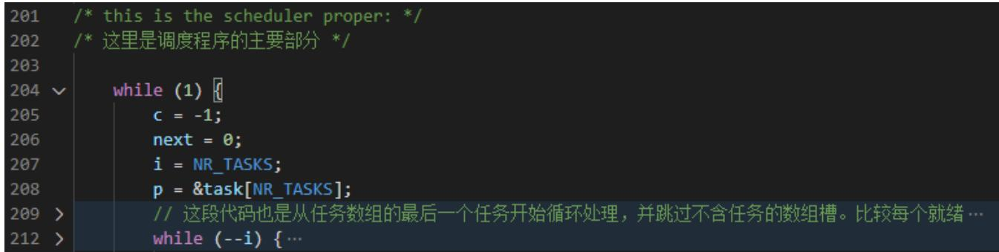


图2-15：使用源代码折叠功能


# 并排编辑

并排编辑在阅读源代码时是十分有用的。比如，在阅读源代码时，读者可能需要同时打开C源代码文件和相应的头文件。读者可以在垂直或水平方向上打开多个编辑器。如果读者已经打开了一个编辑器，那么可以通过以下几种方式在另一侧打开一个新的编辑器。

- 单击编辑器右上角的SplitEditor按钮。

- 通过拖拽文件的标签，把当前文件移动到任意一侧。

- 选择View菜单中EditorLayout中的菜单项。

当读者打开多个编辑器后，可以在按下 Ctrl 快捷键的同时，按下 1、2、3 或 4 键在不同编辑器之间进行快速切换。

# 缩略图

当某个文件中的代码量很大时，位于编辑器右侧的缩略图就非常有用了。缩略图可以使读者随时预览全局，并且读者可以通过点击缩略图中的位置在文件中进行快速跳转。

# 禅模式

对于读者来说，专注于阅读代码是一件十分快乐的事情。VSCode 提供了禅模式，可以让读者专注于阅读代码，特别是在开启了并排编辑的情况下。当禅模式开启后，VSCode 会进入全屏模式，只显示编辑器，而其它窗口都会被隐藏起来。可以通过 View 菜单中 Appearance 中的 Zen Mode 或快捷键 Ctrl+K 再按下 Z 键进入禅模式。双击 Esc 键可以退出禅模式。

# 文件导航

相信读者在接触 VSCode 一段时间后都可以熟练使用文件资源管理器（Explorer）在不同的文件之间跳转。但是，当读者专注于某一个任务时，会发现自己经常需要在一组文件之间进行反复的跳转。针对这种情形，VSCode 提供了多种强大的快捷键来帮助读者快速跳转到不同的文件。

按住Ctrl键，然后按下Tab键，就能在顶部的列表中看到所有打开的文件。再继续按下Tab键，就可以在不同的文件之间进行选择。释放Ctrl键，就能打开在列表中选中的文件。

此外，通过 Alt+Left 和 Alt+Right 快捷键，可以在不同的编辑位置进行跳转。特别是当读者在一个大文件中的不同行之间进行跳转时，这两个快捷键会十分方便。

如果读者想在任意文件之间进行跳转，那么可以使用 Ctrl+P 快捷键。

# 面包屑导航

编辑器上方的导航栏被称为面包屑导航（Breadcrumbs）。如图2-16所示，面包屑导航能够显示当前文件在文件夹中的位置，读者也可以使用面包屑导航快速的跳转到不同的文件夹、文件或符号（包括全局变量、函数、宏定义等）。

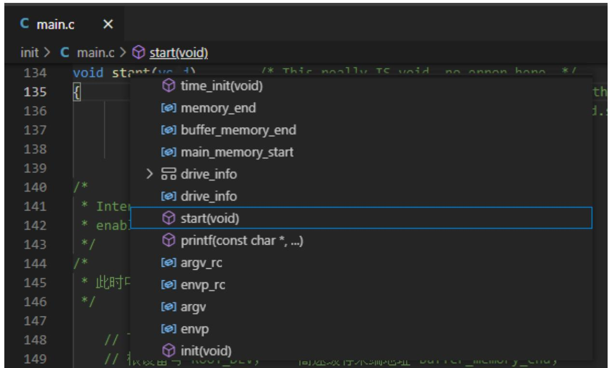


图2-16：面包屑导航能够显示当前的位置


需要说明的是，面包屑导航中的符号列表与文件资源管理器中的大纲视图（OUTLINE）显示的内容是相同的，显示的都是当前文件的符号树（symbol tree）。

# 代码导航

在编辑器中，把鼠标放在任意一个符号上（例如变量名称或函数名称等），然后点击右键，在弹出的右键菜单最上面的一个分组中，包含了与代码导航相关的命令。通过这些命令读者可以快速的在不同的代码之间进行跳转，对于提高读者阅读源代码的效率十分有帮助。

选择右键菜单中的“Go to Definition”，读者可以跳转到一个符号的定义，例如可以跳转到一个结构体在头文件中的定义，或者跳转到一个函数在源文件中的定义。读者也可以在源代码文件用于包含头文件的代码行使用此功能，快速跳转到需要浏览的头文件。跳转到符号定义更快捷的方式是，将鼠标悬停在一个符号上，就会出现相应的定义预览；或者点击鼠标左键将光标定位在一个符号上，然后使用F12快捷键；也可以在按下Ctrl快捷键的同时，用鼠标点击符号；另外一个技巧是在按下Ctrl+Alt快捷键的同时，用鼠标点击符号，可以把定义所在的文件在另一侧打开。

选择右键菜单中的“Go to Declaration”，读者可以跳转到一个符号的声明，例如可以跳转到一个函数在头文件中的声明。

选择右键菜单中的“Go to References”，读者可以查看一个符号的所有引用，例如可以查看一个函数的所有引用（所有调用此函数的代码行）。当读者希望了解某个全局变量在哪里被使用了，或者希望了解一个函数在哪些地方被调用了，就可以使用此功能。

如果读者选择右键菜单中 Peek 中的 Peek Definition、 Peek Declaration 和 Peek References 就可以在内联编辑器中直接查看定义、声明和引用，而不用跳转到其它文件，避免了在不同的文件之间切换，而且还可以直接在内联编辑器中进行编辑。

使用快捷键 Ctrl+Shift+0 可以查看当前文件中的所有符号。如果输入“:”，所有符号都会按类型进行分组。通过使用上/下键，可以在列表中选择不同的符号，然后按回车进行跳转。

使用快捷键 Ctrl+T 可以查看工作区中的所有符号。在命令面板中可以输入想要搜索的符号的名称进行进一步查找。通过使用上/下键，可以在列表中选择不同的符号，然后按回车进行跳转。

# 括号匹配

当编写的源代码比较复杂，例如条件表达式包含很多小括号，或者代码块包含很多大括号时，匹配括号就是一件具有挑战性的工作，幸好 VSCode 提供了括号匹配功能，当点击鼠标将光标设置在一个括号上时，该括号以及与之对应的括号就会被一个细边的方框包围起来，还可以通过快捷键 Ctrl+Shift+\在匹配的括号之间进行跳转。

# 文本搜索

使用 VSCode 可以方便的在文件中进行搜索与替换，可以在当前打开的文件中进行搜索与替换，也可以跨文件进行搜索与替换。

在当前打开的文件中进行搜索与替换时，可以使用Ctrl+F快捷键在编辑器的右上角区域打开搜索框，输入要搜索的内容后，搜索结果就会在编辑器中高亮显示。如果搜索到的结果超过一个，可以按下Enter键跳转到下一个搜索结果，或者按下Shift+Enter跳转到上一个搜索结果。在搜索框中还提供了3个高级搜索选项，包括区分大小写（Aa图标）、全字匹配（Aa|图标）和正则表达式（.*图标）。当光标设置在搜索框中时，还可以按下Ctrl+Enter快捷键在搜索框中插入新的一行，从而进行多行搜索。

VSCode 还提供了快捷键用于在当前打开的文件中迅速查找文本。例如在一个函数中遇到了一个局部变量 Var，如果想知道此变量在该函数中的使用情况，可以使用鼠标选中此变量的名称，然后按 Ctrl+F3 快捷键向下查找相同的文本，也可以按 Ctrl+Shift+F3 向上查找。

如果需要进行跨文件搜索，可以使用快捷键 Ctrl+Shift+F 打开左侧的搜索视图，然后在搜索框中输入要查找的文本即可。搜索的结果会按照文件进行分组，并包含匹配的数量和位置信息。还有一种更快速的完成跨文件搜索的方法，例如在阅读代码时遇到了一个函数 Fun，如果想查看此函数所有出现的地方，可以首先使用鼠标选中函数的名称（在函数名称上双击左键），然后按 Ctrl+Shift+F 快捷键，就会在搜索视图中会自动填入选中的函数名称，并完成搜索。

这里需要注意的是，如果读者要查找的函数是在汇编代码中定义的，在C语言代码中被使用（或者相反），则函数的名称会不同（参见第2.3节），此时需要将“全字匹配”取消。

# 编译器工具（GCC）

编译器工具可以帮助读者定位代码中的警告和错误，读者可以适时的使用编译器生成项目。如果在 VSCode 的“问题”窗口中输出了警告或者错误，可以在“问题”窗口中双击要查看的行，源代码编辑器会打开源代码文件，并将光标设置在警告或错误所在行。

如果生成项目时报告的错误非常多，可以尝试着修改最前面的一两个错误，然后再次重新生成项目，报告的错误往往会减少很多。例如修改了头文件中的语法错误，则所有包含了此头文件的源文件都不会再报告此错误。

# 调试器工具（GDB）

要探究程序动态运行时的每个细节，需要在调试器中运行它。调试器不但可以用于查找程序的错误，它还是分析程序运行时行为的利器。下面的列表概括了对阅读代码最有帮助的调试器特性。

- 单步执行允许读者针对给定的输入，跟踪程序执行的精确顺序。调试器允许读者跳过子例程调用（当对特定的函数不感兴趣时可以按F10跳过函数）或者进入调用（当希望分析函数的行为时按F11进入函数）。

- 断点能够在程序执行到特定的点时，让程序停下来。读者可以使用断点快速地跳转到感兴趣的点，或检查某块代码是否在期望的时刻得到执行。

- 变量监视功能可以为读者提供相应的视图，显示变量的值。使用它们可以监控这些变量在程序运行过程中如何变更。同时能够展开结构的成员，帮助读者对数据结构进行分析、理解和检验。

- 调用堆栈为读者提供通向当前执行点的调用历史，以及每个函数的地址及参数，可以帮助读者理解函数调用的层次。

- 反汇编可以让读者查看函数的汇编代码，可以用于检查 C 语言编写的与硬件相关的代码，是否执行

行了预期的操作，也可以让读者调试那些没有调试信息的汇编模块。

以上提到的各种工具不单是VSCode会提供，很多集成开发环境都会提供类似的功能。读者在阅读Linux0.11源代码的过程中应该有意识的多使用这些工具，熟练使用后才能发挥真正的威力。

# 实验一 实验环境的使用

实验性质：验证

任务数：1个

建议学时：2学时

实验难度：★★☆☆☆

# 一、实验目的

熟悉 VSCode 的基本使用方法。

$\bullet$  练习编译、调试Linux内核及应用程序。

$\bullet$  学习Linux中的基本命令和常用工具的使用方法。

# 二、预备知识

请读者认真阅读本书第1章和第2章的内容，同时可以阅读赵炯博士编写的《Linux内核完全注释》一书第1章的内容，从而对Linux 0.11内核以及VSCode有一个初步的认识。

# 三、实验内容

# 3.1 VSCode的基本使用方法

# 安装和启动 VSCode

本书充分利用了 VSCode 高度可定制的特性，为 Linux 0.11 内核专门制作了一个 VSCode 编程环境。该 VSCode 编程环境中已经集成了 Make 构建工具、GCC 编译器、NASM 汇编器、GDB 调试器、Bochs 虚拟机等必要工具，同时包含了一些有用的 VSCode 插件，目的就是免去读者手工构建实验环境所带来的学习成本，使读者可以将主要精力放在对操作系统原理和 Linux 0.11 源代码的分析与理解上。

读者首先需要下载与本书配套的 VSCode 压缩包文件, 然后将其解压缩到 64 位 Windows 7 或 Windows 10 本地磁盘的一个目录中 (例如 D:\vscode-for-linux011, 目录路径不要包含中文字符或者空格), 无需修改环境变量, 也无需进行任何安装操作。在启动 VSCode 之前, 读者还需要单独安装 Python 语言解释器 (3.8 及以上版本) 和 Git 客户端软件 (2.18 及以上版本)。

最后，读者就可以双击D:\vscode-for-linux011\Code.exe文件启动VSCode了。

# VSCode的窗口布局

VSCode的窗口布局由下面的若干元素组成：

$\bullet$  编辑器：这是主要的代码编辑区域，可以多列或者多行的打开多个编辑器。

- 侧边栏：位于左侧的侧边栏包含了文件资源管理器、文件搜索、源代码版本管理、调试与运行、插件等基本视图。

- 活动栏：位于侧边栏的左侧，可以方便的让用户在不同的视图之间进行切换。

- 状态栏：位于底部的状态栏用于显示当前打开文件的光标位置、编码格式等信息。

- 面板：编辑器的下方可以展示不同的面板，包括显示输出信息的面板、显示调试信息的面板、显示错误信息的面板和集成终端。面板也可以被移动到编辑器的右侧。

# 3.2任务（一）：Linux0.11内核项目的生成和调试

在后续的实验过程中，读者主要会使用两个项目，一个是Linux 0.11内核项目，用于生成Linux 0.11操作系统，另外一个是Linux 0.11应用程序项目，用于生成Linux 0.11的应用程序。接下来，首先学习一下Linux 0.11内核项目。

# 使用浏览器从在线课程平台领取任务

在线课程平台是用于教师在线布置实验任务，并统一管理学生提交的作业的平台。

1. 读者通过浏览器访问平台，可以打开平台的登录页面。注意，如果读者使用的是校园网或局域网中的平台，需要从平台管理员处获得URL。

2. 在登录页面中，读者输入用户名和密码，点击“登录”按钮，可以登录平台。

3. 登录成功后，在“课程”列表页面中，可以找到Linux操作系统对应的实验课程。点击此课程的链接，可以进入该课程的详细信息页面。

4. 在课程的详细信息页面中，可以查看课程描述信息，该信息对于完成实验十分重要，建议读者认真阅读。

5. 点击左侧导航中的“任务”链接，可以打开任务列表页面。

6. 在任务列表中找到本次实验对应的任务，点击右侧的“领取任务”按钮，可以进入“领取任务”页面。

7. 在“领取任务”页面填写“新建项目名称”和“新建项目路径”，然后选择“项目所在的群组”，点击“领取任务”按钮后，可以创建个人项目用于完成本次实验，并自动跳转到该项目所在的页面。

提示：在“领取任务”页面中，“新建项目名称”和“新建项目路径”这两项的内容可以使用默认值，如果选择的群组中已经包含了名称或者路径相同的项目，就会导致领取任务失败，此时需要修改新建项目名称和新建项目路径的内容。

8. 在新建的个人项目页面中，包括左侧的导航栏、项目信息、文件列表等，如图1-1所示。

9. 点击图 1-1 红色方框中的按钮，可以复制个人项目的 URL，在本实验后面的练习中会使用这个 URL将此项目克隆到读者计算机的本地磁盘中。


图1-1：领取任务后得到的个人项目页面


# 使用 VSCode 将 Linux 0.11 内核项目克隆到本地磁盘

在读者从平台领取了任务之后，可以按照下面的步骤将个人项目克隆到本地磁盘中。

1. 在 VSCode 的 “View” 菜单中选择 “Command Palette...”, 会在 VSCode 的顶部中间位置显示一

个用来输入命令的面板。

2. 在 VSCode 的命令面板中输入 “Git” 后，会在列表中提示出所有与 Git 相关的命令。选择列表中的 “Git: Clone” 命令后按回车，会提示输入 Git 远程库的 URL，将之前复制的个人项目的 URL 粘贴到命令面板中并按回车。

3. Git 远程库的 URL 输入成功后，会自动打开“选择文件夹”窗口，提示用户选择一个本地文件夹用来保存项目。此时，读者就可以在本地磁盘中选择一个合适的文件夹（注意，本地文件夹路径中不要包含中文字符和空格），然后点击“Select Repository Location”按钮。

<table><tr><td>注意：如果在选择文件夹后，弹出了Windows 安全中心的凭据登录窗口，读者可以选择其中的“取消”按钮，跳过此步骤。这里不建议读者使用 Windows 凭据管理 Git 远程库的账号信息，一方面是由于一旦读者把用户名密码输入错误后，需要去 Windows 控制面板中的凭据管理器修改、或者删除凭据，比较麻烦；另外一方面，如果读者是在一台公共电脑上操作的话，使用 Windows 凭据管理器保存登录的用户名和密码是非常危险的。</td></tr></table>

4. 选择本地文件夹后，VSCode会在命令面板中提示输入“Username”，输入平台的用户名后按回车。接下来会提示输入“Password”，输入平台的密码后按回车。用户名和密码校验成功后就开始将Git远程库克隆到本地了。

5. 克隆成功后，会在 VSCode 的右下角弹出克隆完成提示框，点击其中的“open”按钮会使用 VSCode 打开克隆到本地的项目。

# 使用 VSCode 登录平台

使用 VSCode 打开 Linux 0.11 操作系统内核项目后，VSCode 会自动在顶部中间位置弹出登录平台的提示框，只有登录平台后才能继续使用为 Linux 0.11 内核定制的功能。

登录平台的步骤如下：

1. 首先，需要在 VSCode 顶部弹出的列表中选择平台 URL。如果是第一次登录平台，URL 列表应该是空的，此时就需要选择列表中手动输入平台 URL 的那一项。

2. 然后，在弹出的编辑框中根据提示信息输入平台URL后按回车。平台URL的格式类似于http://www/domain.com，具体使用哪个URL可以咨询平台管理员。

3. 最后，按照提示依次输入平台的用户名和密码即可完成登录。

# 查看Linux0.11内核项目中的文件

将Linux 0.11内核项目克隆到本地磁盘后，在VSCode左侧的“文件资源管理器”窗口中可以查看Linux0.11内核项目包含的所有文件夹和源代码文件。也可以使用Windows资源管理器打开项目所在的文件夹，方法是在“文件资源管理器”窗口中的任意一个文件夹或文件节点上点击右键，然后在弹出的快捷菜单中选择“Reveal in File Explorer”。

# 生成Linux0.11内核项目

在Linux 0.11内核项目的文件夹中提供了一个makefile文件，在各个子文件夹中也提供了makefile文件。Make工具就是使用这些makefile文件中的脚本将Linux 0.11内核的源代码生成为可以运行的二进制文件的。由于篇幅的限制，本书没有详细说明每个makefile文件的内容，请读者参考《Linux内核完全注释》一书中的第3.6节学习Make工具的使用方法，并通过其它章节中对makefile文件内容的介绍自行学习相关的内容。虽然本书提供的Linux 0.11内核中的makefile文件与原版的文件有一些差异，但是实现的功能是完全一致的。

生成Linux 0.11内核项目的方法是，在VSCode的“Terminal”菜单中选择“Run Build Task...”，会在VSCode的顶部中间位置弹出一个可以执行的Task列表，选择其中的“生成项目”即可。在项目生成的过程中，位于编辑器下方的“TERMINAL”窗口会实时显示生成的进度和结果。如果源代码中不包含语法错误，会在最后提示“Build Linux 0.11 success!”，表示生成成功。

如果源代码中存在语法错误，“TERMINAL”窗口会输出相应的错误信息（包括错误所在文件的路径，错误在文件中的行号，以及错误原因），并在最后提示生成失败。此时在“TERMINAL”窗口中，在按下Ctrl键的同时，用鼠标左键点击错误信息所在的行开始部分的文件路径，VSCode会使用源代码编辑器打开错误

所在的文件，并自动定位到错误对应的代码行。定位错误的另外一种方法是，在编辑器下方的“PROBLEMS”窗口的错误列表中选择对应的行。

读者可以尝试在某个C源代码文件中故意输入一些错误的代码（例如删除一个代码行结尾的分号），然后再次生成项目，尝试通过错误信息来完成定位，将代码修改正确后再生成项目。

生成项目成功后，可以在左侧的“文件资源管理器”窗口中打开boot文件夹，找到刚刚生成的bootsect.bin和setup.bin文件，还可以在根目录下找到linux011.bin文件，这三个二进制文件就是Linux0.11操作系统需要运行的可执行文件。这三个二进制文件已经被写入大小为1.44MB的软盘镜像文件floppya.img中。在启动调试时，会将该软盘镜像文件插入虚拟机的软盘驱动器A中，然后让虚拟机从软盘A开始引导，并最终运行其中的Linux0.11操作系统（相当于将写有三个二进制文件的软盘插入一台裸机的软盘驱动器A中，然后按下开机按钮）。

读者可能会注意到，生成项目成功后在左侧的“文件资源管理器”窗口中的根目录下，还新出现了几个文件，包括软盘镜像文件floppya.img和floppyb.img，硬盘镜像文件harddisk.img，以及与Bochs虚拟机相关的多个文件。这些文件是在生成项目的过程中安装到项目目录中的，并且没有被包含到Git库中（在“文件资源管理器”窗口中使用浅色显示文件名），原因是这些文件占用磁盘空间比较大，这样设计可以显著减小Git库的大小，大大加快克隆Git库和提交Git库的速度。

# 启动调试Linux0.11内核项目

VSCode 提供的调试器（GDB）是一个功能强大的工具，使用此调试器可以观察程序的运行时行为并确定逻辑错误的位置，可以中断（或挂起）程序的执行以检查代码，计算和编辑程序中的变量，查看寄存器，以及查看从源代码创建的指令。为了顺利进行后续的各项实验，读者一定要学会灵活使用这些调试功能。

按照下面的步骤练习调试Linux0.11源代码的过程：

1. 在“文件资源管理器”窗口的init文件夹中找到main.c文件，双击此文件节点使用源代码编辑器打开。

2. 在 main.c 文件中 start 函数的 “chr_dev_init();” 语句所在行（第 172 行）的行号左侧点击鼠标左键，添加一个断点，如图 1-2 所示。Linux 0.11 启动时执行的第一个内核函数就是这个 start 函数。

```txt
170 trap_init(); //陷阱门（硬件中断向量）初始化。（kernel/traps.c)  
171 blk_dev_init(); //块设备初始化。（kernel/blk_dev/ll_rw_blk.c)  
172chr_dev_init(); //字符设备初始化。（kernel/chr_dev/tty_IO.c)  
173 tty_init(); //tty初始化。（kernel/chr_dev/tty_IO.c)  
174time_init(); //设置开机启动时间：startup_time。
```

图1-2：在Linux0.11内核项目的init/main.c文件中添加一个断点

3. 启动调试的方法是选择“Run”菜单中的“Start Debugging”或者按F5快捷键。启动调试后，Bochs虚拟机开始运行软盘镜像A中的Linux 0.11操作系统。Bochs虚拟机启动后有两个窗口，一个是Console窗口，用来输入Bochs命令（目前不需要输入任何命令），另外一个是Display窗口，相当于计算机的显示器。随后，VSCode窗口会被自动激活，并且在刚刚添加断点的代码行左侧显示一个黄色箭头，表示程序已经在此行代码处中断执行（也就是说下一个要执行的就是此行代码)，如图1-3所示。在Bochs的Display窗口中可以看到Linux 0.11的启动过程也中断了。

```txt
170 trap_init(); //陷阱门（硬件中断向量）初始化。（kernel/traps.c)  
171 blk_dev_init(); //块设备初始化。（kernel/blk_dev/ll_rw_blk.c)  
172chr_dev_init(); //字符设备初始化。（kernel/chr_dev/tty_IO.c)  
173 tty_init(); //tty初始化。（kernel/chr_dev/tty_IO.c)  
174time_init(); //设置开机启动时间：startup_time。
```

图1-3：Linux0.11内核启动调试后在断点处中断执行

# 单步调试

单步调试功能可以让读者“逐过程”或者“逐语句”的调试源代码，进而跟踪程序执行的过程。按照

下面的步骤练习使用单步调试功能：

1. 在 VSCode 的 “Run” 菜单中选择 “Step Over” 或者按 F10 快捷键, 会执行黄色箭头当前指向的代码行, 并将黄色箭头指向下一个要执行的代码行, 即 “tty_init();” 语句所在行 (第 173 行)。这就是 “逐过程” 调试功能, 该功能不会调试进入 chr dev init 函数。

2. 在 VSCode 的 “Run” 菜单中选择 “Step Into” 或者按 F11 快捷键, 可以发现黄色箭头指向了函数 tty init 中, 说明 “逐语句” 功能可以进入函数, 进而调试函数中的语句。

3. 在 VSCode 的 “Run” 菜单中选择 “Step Out” 或者按 Shift+F11 快捷键，会跳出 tty_init 函数，返回到上级函数中继续调试（此时 tty_init 函数已经执行完毕）。

# 查看变量的值

在调试的过程中，VSCode提供了多种查看变量值的方法，按照下面的步骤练习这些方法：

1. 将鼠标移动到源代码编辑器中变量的名称上，此时会弹出一个窗口显示出变量的值。例如将鼠标移动到变量 main memory start 或者 memory end 的上方，就可以查看这些变量的值。

2. 第二种方法是，在源代码编辑器中变量 main_memory_start 或者 memory_end 的名称上双击鼠标左键，可以选中变量的名称，然后再点击鼠标右键，在弹出的快捷菜单中选择“Add to Watch”，可以将变量添加到左侧“调试和运行”窗口中的“WATCH”中，并显示变量的值。这种方式的好处是，可以在调试的过程中随时查看变量的值。

# 调用堆栈（Call Stack）

调用堆栈显示在左侧“调试和运行”窗口中的“CALL STACK”中，用来在调试的过程中查看当前堆栈上的函数，可以帮助理解函数的调用层次和调用过程。按照下面的步骤练习使用调用堆栈：

1. 按F11（“逐语句”功能的快捷键）调试进入time_init函数，查看“CALL STACK”中的内容，可以发现在堆栈上有两个函数time_init和start。其中当前正在调试的time_init函数在栈顶位置，start函数在紧邻time_init函数的下方，说明是在start函数中调用了time_init函数。

2. 将time init函数开始位置定义的变量time添加到“WATCH”中，可以查看此局部变量的值。

3. 在“CALL STACK”中双击start函数所在的行，会激活start函数的堆栈帧。同时，编辑器会自动跳转到start函数的源代码，并有一个绿色箭头指向调用time_init函数的代码行。在“WATCH”中的time变量会报告无法计算其值，原因是time变量是一个time_init函数中的局部变量，在start函数中无法访问此变量。

4. 在“CALL STACK”中双击time_init函数所在的行，可以重新激活此堆栈帧。

# 继续运行和停止调试

1. 如果要让程序从当前中断的位置继续运行，可以在 VSCode 的“Run”菜单中选择“Continue”或者按 F5 快捷键。此时查看 Bochs 虚拟机的 Display 窗口，会显示 Linux 0.11 操作系统已经启动完毕，并且终端已经打开，可以接受用户输入命令了。

2. 停止调试通常包括两部分，一个是停止 VSCode 的调试功能，另外一个是关闭 Bochs 虚拟机。在 VSCode 的 “Run” 菜单中选择 “Stop Debugging” 或者按 Shift+F5 快捷键可以停止 VSCode 的调试功能；点击 Bochs 虚拟机 Console 窗口右上角的关闭窗口按钮可以关闭 Bochs 虚拟机。通常这两个操作都需要进行，才能完全停止调试，但是先后顺序没有要求。

# 学习Linux常用命令

在附录2的表格中列出了Linux的常用命令。无论是最新版本的Linux，还是比较古老的Linux 0.11，都可以支持这些常用命令，由此可见这些命令旺盛的生命力和它们的重要性。

读者在前面的实验内容中使用了 VSCode 提供的调试功能，并搭配 Bochs 虚拟机的远程调试模式完成了 Linux 0.11 内核源代码的调试。在练习 Linux 的常用命令时，就不需要启动 Bochs 虚拟机的调试模式了，因为调试模式需要时刻检查调试状态和断点的位置，导致 Bochs 虚拟机在运行 Linux 0.11 的时候性能明显下降。

这里建议读者在 VSCode 的 “Terminal” 菜单中选择 “Run Build Task...”, 会在 VSCode 的顶部中间位置弹出一个可以执行的 Task 列表, 选择其中的 “Bochs 运行 (不调试)”, 即可让 Bochs 虚拟机在非调

试的模式下用最快的速度来运行Linux 0.11操作系统。练习Linux常用命令后关闭Bochs虚拟机。

提示：在Linux的命令行中，可以使用TAB键让Linux提示用户可以使用的命令，例如，当用户输入了“ch”两个字符后按Tab键，Linux会将所有以“ch”开始的命令在下方提示出来，方便用户继续输入命令。如果用户在输入了“chm”三个字符后按Tab键，由于以这三个字符开始的命令只有“chmod”，Linux会直接帮助用户完成这个命令，这样可以大大加快用户输入命令的速度。使用“cd”命令进入某个目录时，同样可以使用此技巧，在输入目录名称前面的若干字符后按Tab键，尝试让Linux自动补全目录的名称。用户也可以使用键盘上的向上箭头和向下箭头按钮来显示之前输入过的历史命令，方便用户直接使用。

# 学习代码导航功能

Linux 0.11 的源代码虽然不足两万行，仅为任何一个具有商业价值的软件代码量的十分之一，但是，读者很可能还是首次接触到具有如此规模的源代码，这就为读者系统、高效的阅读和理解 Linux 0.11 的源代码带来不小的挑战。即便是一位有着丰富经验的开发者，在没有适当工具的帮助下，阅读如此数量的源代码也会感到非常棘手。例如，当遇到一个变量时，想查看这个变量是在哪里定义的，其数据类型是什么；或者遇到一个函数时，想查看这个函数是如何实现的，在整个系统中都有哪些地方调用了此函数。

VSCode为了解决此类问题，提供了强大而灵活的代码导航命令。通过这些命令读者可以快速的在不同的代码之间进行跳转，对于提高读者阅读源代码的效率十分有帮助。请读者按照下面的步骤练习使用代码导航功能：

1. 打开 init/main.c 文件，在第 183 行调用了一个 init 函数。在 init 函数名称上点击鼠标右键，选择菜单中的“Go to Definition”，就会跳转到该函数的定义（第 221 行）。

2. 在init函数名称上点击鼠标右键，选择菜单中的“Go to Declaration”，就会跳转到该函数的声明（第65行）。

3. 在init函数名称上点击鼠标右键，选择菜单中的“Go to References”，就会使用内联编辑器显示所有引用此函数的位置，包括此函数的声明、定义和调用。

在本书第2.7节详细介绍了VSCode提供的与代码导航相关的功能，以及阅读源代码相关的方法与技巧，请读者自行练习。

# 尝试修改Linux0.11内核项目中的源代码

激动人心的时刻终于到来了，请读者屏住呼吸，按照下面的步骤尝试亲自动手修改一个操作系统内核的源代码：

1. 打开 init/main.c 文件，在第 233 行调用了内核中的 printf 函数（注意，这里调用的 printf 函数不是 C 标准库中函数）将空闲内存的数量打印输出到了屏幕上。

2. 请读者模仿第 233 行的源代码，在其下面添加一行新的源代码，将字符串 “Hello Linux!” 打印输出到屏幕上。

3. 生成项目成功后，按 F5 启动调试，查看 Bochs 虚拟机的 Display 窗口是否能够正常显示读者添加的信息。

现在，读者已经是一位合格的操作系统内核编写者了，真的是太酷了！

# 提交作业

实验结束后需要将本地磁盘上修改后的源代码文件提交到平台的个人项目中，方便教师通过平台查看读者提交的作业。可以按照下面的步骤提交作业：

1. 使用 VSCode 查看文件变更详情，具体方法是在 VSCode 的 “View” 菜单中选择“SCM”，打开左侧的“Git 源代码版本控制”窗口，在变更列表中会显示最近新建、删除或内容被修改的文件。使用鼠标左键双击变更列表中的文件，会使用编辑器显示当前的文件内容（右侧）与上一个版本的文件内容（左侧）相比较有哪些修改。如果想放弃对文件的修改，可以点击文件所在行右侧的“Discard Changes”按钮。

2. 在确认文件变更详情没有错误的情况下，读者就可以开始提交作业了。最快捷的方法是，在 VSCode 的“Terminal”菜单中选择“Run Build Task...”，会在 VSCode 的顶部中间位置弹出一个可以执行的 Task 列表，选择其中的“提交作业”，会自动完成 Git 库的提交（commit）和推送（push）

操作，读者只需要在 VSCode 顶部中间位置弹出的命令窗口中，按照提示依次输入平台的用户名和密码即可。

3. 提交作业成功后，会自动使用浏览器打开平台中个人项目的页面，读者可以在这个页面中浏览项目中的文件和变更记录。

4. 如果在提交作业后发现仍然有文件需要修改，可以在完成修改后重复上面的步骤，再次提交作业。

除了上面步骤中介绍的使用 Task 完成提交作业的方法外，读者也可以使用 VSCode 提供的 “Git 源代码版本控制” 窗口中的提交(Commit)和推送(Push)功能完成作业的提交，具体方法请读者自行学习，这对于读者今后熟练使用 VSCode 中的 Git 功能也是很有帮助的。

# 3.3 任务（二）：Linux0.11应用程序项目的生成和运行

# 准备实验

使用浏览器登录平台领取本次实验对应的任务，从而在平台上创建个人项目（Linux 0.11 应用程序项目），然后使用 VSCode 将个人项目克隆到本地磁盘中并打开。

# 生成Linux0.11应用程序项目

在Linux 0.11应用程序项目的文件夹中提供了一个makefile文件。Make工具就是使用该makefile文件中的脚本将Linux 0.11应用程序的源代码文件linuxapp.c生成为可以运行的二进制文件linuxapp.exe的。请读者自行学习makefile文件中的内容。

生成Linux 0.11应用程序项目的方法与之前介绍的生成Linux 0.11内核项目的方法完全一致，同样是在VSCode的“Terminal”菜单中选择“Run Build Task...”，会在VSCode的顶部中间位置弹出一个可以执行的Task列表，选择其中的“生成项目”即可。在项目生成的过程中，位于编辑器下方的“TERMINAL”窗口会实时显示生成的进度和结果。如果源代码中不包含语法错误，会在最后提示“Build Linux 0.11 app success!”，表示生成成功。

如果源代码中存在语法错误，“TERMINAL”窗口会输出相应的错误信息（包括错误所在文件的路径，错误在文件中的行号，以及错误原因），并在最后提示生成失败。此时在“TERMINAL”窗口中，在按下Ctrl键的同时，用鼠标左键点击错误信息所在的行开始部分的文件路径，VSCode会使用源代码编辑器打开错误所在的文件，并自动定位到错误对应的代码行。

生成项目成功后，可以在左侧的“文件资源管理器”窗口中找到刚刚生成的linuxapp.exe文件，该文件就是Linux 0.11应用程序的可执行文件。注意，该可执行文件使用的是aout格式，而不是Windows的PE格式，所以不能在Windows中运行，只能在Linux 0.11中运行。VSCode每次生成应用程序项目成功后，都会自动将应用程序的可执行文件写入软盘镜像文件floppyb.img中，以便在Linux 0.11中运行。

# 查看软盘镜像文件floppyb.img中的内容

在 VSCode 的 “Terminal” 菜单中选择 “Run Build Task...”, 会在 VSCode 的顶部中间位置弹出一个可以执行的 Task 列表, 选择其中的 “打开 floppyb.img” 后会使用 Floppy Editor 工具打开该项目中的 floppyb.img 文件, 用于查看软盘镜像中的文件。其中的 linuxapp.exe 文件就是刚刚生成的 Linux 0.11 应用程序, 可以注意查看一下该文件的修改日期, 如图 1-4 所示。查看完毕后关闭 Floppy Editor。

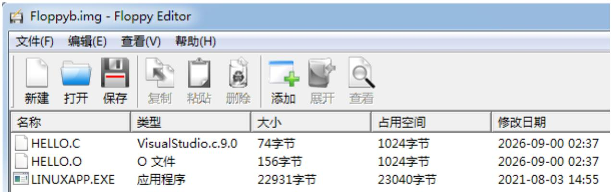


图1-4：查看floppyb.img中Linux0.11应用程序项目生成的可执行文件


注意：Bochs虚拟机在调试内核项目的过程中，会独占访问软盘镜像文件，此时，使用FloppyEditor工具打开该项目中的floppyb.img文件会失败。如果需要修改软盘镜像中的文件，需先停止Bochs虚拟机，然后再使用FloppyEditor工具打开软盘镜像文件，修改软盘镜像中的文件后，点击“保存”按钮。

# 运行Linux0.11应用程序

由于Linux 0.11应用程序可执行文件使用的是种既古老，又相对简单的可执行文件格式——aout格式，而VSCode中的GDB已经不支持调试此格式的可执行文件了，所以这里无法使用类似前面介绍的调试Linux 0.11内核那样的功能来调试Linux 0.11应用程序，也就是说不能在VSCode中按F5启动调试Linux0.11应用程序，无法添加断点，也无法使用单步调试、查看变量的值、查看调用堆栈等功能。但是读者仍然可以充分利用VSCode提供的强大的源代码编辑功能，提高开发Linux 0.11应用程序的效率，并按照下面的步骤查看Linux 0.11应用程序的运行结果：

1. 在 VSCode 的 “Terminal” 菜单中选择 “Run Build Task...”, 会在 VSCode 的顶部中间位置弹出一个可以执行的 Task 列表, 选择其中的 “Bochs 运行 (不调试)” 后, 会使用 Bochs 虚拟机运行软盘镜像 A 中的 Linux 0.11 操作系统, 并将文件 floppyb.img 加载到软盘驱动器 B 中。读者可以在 Bochs 虚拟机 Display 窗口的工具栏上依次点击软件驱动器 A 和 B 的按钮, 确认加载了对应的软盘镜像文件。

2. 待 Linux 0.11 启动后，在 Bochs 的 Display 窗口的终端中使用“mcopy b:linuxapp.exe linuxapp”命令将软盘 B 中的可执行文件 linuxapp.exe 拷贝到硬盘的当前目录中，并命名为 linuxapp，如图 1-5 所示。


图1-5：将可执行文件linuxapp.exe从软件B拷贝至硬盘


3. 在终端输入“linuxapp”命令运行上一步拷贝的文件linuxapp,此时会提示“无法运行二进制文件”信息，原因是linuxapp文件没有可执行权限。使用“ls -l linuxapp”命令查看该文件的权限，可以看到其只有r（read）和w（write）权限，而没有x（execute）权限，如图1-6所示。

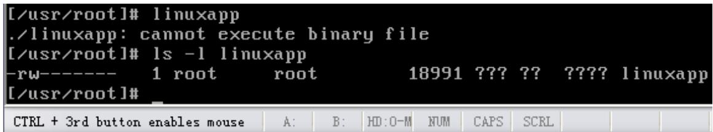


图1-6：使用ls命令查看文件linuxapp的权限


4. 使用“chmod +x linuxapp”命令使之具有可执行权限。再次使用ls 命令确认文件权限修改后，就可以运行该文件了，如图1-7所示。

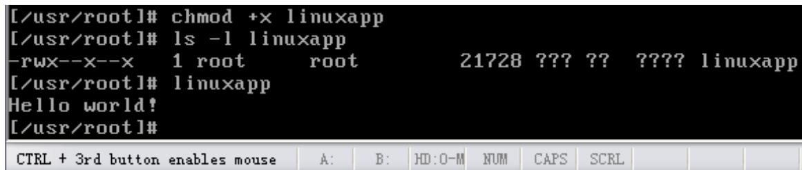


图1-7：为文件linuxapp增加可执行权限并运行


# 3.4 在Linux 0.11操作系统中编写应用程序

之前的内容详细介绍了使用 VSCode 编写并运行 Linux 0.11 应用程序的方法。经常在 Windows 操作系

统中编写程序的读者会对这种操作方式十分熟悉，并觉得很方便。但是，在Linux 0.11操作系统中，由于没有图形化的人机交互界面，在其中编写应用程序的过程就会比较复杂，但是也有必要深入学习一下这种操作方式，为今后在Linux操作系统中编程打下基础。

接下来，会向读者详细介绍在Linux 0.11操作系统中如何使用vi编辑器编写源代码文件，如何使用GCC工具将源代码编译为可执行文件，以及如何编写makefile文件将多个源代码文件作为一个项目来进行管理的方法。

# 使用 vi 编辑器编写 Linux 0.11 应用程序并编译运行

vi（visual interpreter）是Linux操作系统使用的最基本的文本编辑器，每个Linux发行版都会自带vi编辑器，不需要用户单独安装。注意，vi和vim是不同的编辑器，vim可以认为是vi的增强版本，而且通常需要用户单独安装。

接下来请读者按照下面的步骤，练习在Linux 0.11中使用vi编辑器编写源代码文件，然后使用GCC将源代码文件编译为可执行文件。读者应该会感受到这种方法比较繁琐，没有使用VSCode直接编写Linux0.11的应用程序来的方便，不过学习这种方法还是很有必要的，当读者今后在一个只有命令终端的Linux系统上工作时，就不得不使用这种方法来编写程序了。

1. 继续使用 VSCode 打开在本实验 3.3 节获取到的 Linux 0.11 应用程序项目。

2. 在 VSCode 的 “Terminal” 菜单中选择 “Run Build Task...”, 会在 VSCode 的顶部中间位置弹出一个可以执行的 Task 列表, 选择其中的 “Bochs 运行 (不调试)” 后, 会使用 Bochs 虚拟机运行软盘镜像 A 中的 Linux 0.11 操作系统。Linux 0.11 启动完毕后, 在其终端中使用 ls 命令查看当前目录, 并用 rm 命令将 hello.c 文件删除。

3. 在Linux 0.11终端中使用命令“vi hello.c”新建并打开hello.c文件，在此文件中使用C语言编写一个可以输出“hello world”的程序，保存源代码文件并退出vi。

4. 在Linux 0.11终端中使用命令“gcc hello.c -o hello”让GCC工具编译hello.c文件，得到可执行文件hello。

5. 运行可执行文件hello，查看输出的内容。

注意：由于Linux 0.11应用程序使用比较古老的、版本号为1.40的GCC进行编译，所以只支持标准的C语言语法，例如，仅支持使用“/* */”进行块注释，不支持使用“//”进行行注释，另外必须在函数的开始位置定义局部变量。

# 编写makefile文件管理项目

Make工具可以用来管理一个项目中多个源代码文件的编译和链接过程，也可以用来管理多个模块间的依赖关系，甚至是软件的安装过程。练习编写简单的makefile文件，对于读者今后在Linux下开发应用程序还是非常必要的。

下面是一个可以完成编译链接hello.c任务的makefile文件的内容：

```makefile
hello: hello.c gcc hello.c -o hello
```

第一行描述依赖关系，指出目标文件hello依赖于源代码文件hello.c，第二行描述操作命令，指出要用GCC编译器的可执行文件gcc将源代码文件hello.c编译输出为可执行文件hello。当修改hello.c文件后，需要编译时，只需在该makefile文件所在目录中输入make命令即可。

注意，在makefile文件中跟在依赖关系命令行之后的操作命令行必须用制表符(Tab键)进行缩进，不能使用空格进行缩进，否则make命令会报告“missing separator”错误。

也可以在makefile文件分步骤完成对hello.c文件的编译和链接，内容如下：

```txt
hello:hello.o gcc hello.o -o hello   
hello.o:hello.c gcc-c hello.c -o hello.o
```

```txt
clean: rm -f *.o rm -f hello
```

可执行文件hello依赖于对象文件hello.o，而hello.o又依赖于源代码文件hello.c（选项-c指示GCC仅完成编译操作，而不进行链接操作)。另外又增加了一个clean目标，用于清理操作。可在任何时刻使用clean作为目标，删掉makefile生成的文件。

Make工具默认会构造makefile文件中的第一个目标，但如果在命令行中指定目标，就可以构建任何一个目标，例如指定clean目标的命令如下：

```txt
make clean
```

# 3.5 编写更复杂的Linux0.11应用程序

读者已经学习了编写简单的Linux 0.11应用程序（只有一个源代码文件）和简单的makefile文件。接下来，请读者按照下面的步骤编写更复杂的Linux 0.11应用程序（包含两个源代码文件）和makefile文件，确保其可以正常运行。后面还会将这些文件作为本次实验的成果，提交到平台供教师审阅。

1. 继续使用 VSCode 打开在本实验 3.3 节获取到的 Linux 0.11 应用程序项目。

2. 在 VSCode 的 “Terminal” 菜单中选择 “Run Build Task...”, 会在 VSCode 的顶部中间位置弹出一个可以执行的 Task 列表, 选择其中的 “Bochs 运行 (不调试)” 后, 会使用 Bochs 虚拟机运行软盘镜像 A 中的 Linux 0.11 操作系统。Linux 0.11 启动完毕后, 在其终端中使用下列命令创建一个 newapp 文件夹, 并进入该文件夹。

```txt
mkdir newapp cd newapp
```

3. 使用 vi 创建一个源代码文件 add.c，在其中定义一个函数 int add(int x, int y)，计算并返回两个参数之和。

4. 使用 vi 创建一个源代码文件 main.c，包含头文件 stdio.h，并定义 main 函数。在 main 函数中首先定义两个整形变量，然后调用 scanf 函数从标准输入得到这两个整形变量的值，最后调用 add 函数将两个整形变量作为参数传入，并调用 printf 函数将计算的结果打印到标准输出。

5. 使用 vi 创建一个 makefile 文件，分步完成对 add.c 和 main.c 文件的编译、链接，并最终生成一个可执行文件 app。在 makefile 中添加一个 clean 目标，用来清理文件，包括对象文件 add.o 和 main.o，以及可执行文件 app。

6. 使用 sync 命令将所有的文件保存到硬盘。

为了将刚刚编写的文件提交到平台，需要按照下面的步骤将这些文件从Linux 0.11操作系统中复制到软盘B，然后再复制到本地。

1. 在Linux 0.11的终端使用下面的命令将刚刚编写的文件复制到软盘B中。

```batch
mcopy add.c b:add.c  
mcopy main.c b:main.c  
mcopy makefile b:makefile
```

2. 关闭Bochs虚拟机。

3. 在 VSCode 左侧的“文件资源管理器”窗口顶部点击“New Folder”按钮，新建一个名称为 newapp 的文件夹。在“文件资源管理器”窗口中的 newapp 文件夹节点上点击鼠标右键，选择菜单中的“Reveal in File Explorer”，可以使用 Windows 的资源管理器打开此文件夹所在的位置，双击打开此文件夹。

4. 在 VSCode 的 “Terminal” 菜单中选择 “Run Build Task...”, 会在 VSCode 的顶部中间位置弹出一个可以执行的 Task 列表, 选择其中的 “打开 floppyb.img” 后会使用 Floppy Editor 工具打开该项目中的 floppyb.img 文件, 查看软盘镜像中的文件列表, 确保刚刚编写的文件已经成功复制到软盘镜像文件中。在文件列表中选中 makefile 文件, 并点击工具栏上的 “复制” 按钮, 然后粘贴到 Windows 的资源管理器打开的 newapp 文件夹中。采用同样的操作将软盘镜像文件中的

add.c和main.c文件也复制到newapp文件夹中。

# 3.6 提交作业

实验结束后先使用 VSCode 左侧的“源代码版本控制窗口”查看文件变更详情，确认无误后再将本地项目提交到平台的个人项目中，方便教师通过平台查看读者提交的作业。

# 四、 思考与练习

1. 练习使用单步调试功能（逐过程、逐语句），体会在哪些情况下应该使用“逐过程”调试，在哪些情况下应该使用“逐语句”调试。练习使用各种调试工具（包括“WATCH”窗口、“CALL STACK”窗口等），为后续调试Linux 0.11内核做好准备。

2. 练习使用Linux 0.11提供的各种文件操作命令。使用这些命令浏览硬盘中的目录结构，要求能够使用cd命令进入根目录，使用ls命令列出根目录中的所有文件夹，自行查找资料掌握根目录中各个文件夹的功能和用途。

# 实验二 操作系统的启动

实验性质：验证

任务数：1个

建议学时：2学时

实验难度：★★★☆☆

# 一、实验目的

- 跟踪调试 Linux 0.11 在 PC 机上从 CPU 加电到完成初始化的过程。

- 查看Linux 0.11启动后的状态和行为，理解操作系统启动后的工作方式。

# 二、预备知识

现代操作系统的启动过程比较复杂，涉及较多的技术和名词，如：GDT、GDTR、IDT、A20地址线、页表、保护模式等，有关这些介绍请读者自己查阅相关资料。本实验只介绍Linux 0.11操作系统启动的大致流程，不会关注太多的细节问题。

Linux 0.11 在 CPU 加电后、进入 init/main.c 中的 start 函数之前的阶段主要涉及三个源代码文件，分别是 boot/bootsect.asm、boot/setup.asm 和 boot/head.s。其中的 bootsect.asm 和 setup.asm 就是通常说的 Boot 和 Loader。现分别对这几个文件做简要介绍。

# bootsect.asm

此文件使用NASM汇编语言编写，生成的二进制文件为bootsect.bin。此二进制文件（512字节）会被写入软盘镜像文件floppya.img的0号扇区，作为引导程序。在CPU加电完成BIOS自检程序的执行后，BIOS程序会把软盘A的引导扇区加载到物理内存地址0x7c00处，并从该地址开始执行引导程序。引导程序会首先把自己移动到物理内存地址0x90000处，并继续执行。然后将软盘A中从1号扇区开始的4个扇区（这4个扇区包含了下面要介绍的由setup.asm生成的二进制文件setup.bin）加载到物理内存地址0x90200处。然后在屏幕上输出“Loading system…”，并随后将扇区中的内核模块（即linux011.bin）加载到物理内存地址0x10000处。最后，在确定根文件系统所在的磁盘后，跳转运行setup模块。

# setup.asm

此文件使用NASM汇编语言编写，生成的二进制文件为setup.bin。此二进制文件会被写入软盘镜像文件floppya.img的从1号扇区开始的4个扇区，作为操作系统加载程序。它首先利用BIOS中断读取机器参数，并放置在0x90000开始的物理地址处以备后用。然后将内核模块从之前的0x10000起始处移动到0x00000起始处。随后加载中断描述符表寄存器（idtr）等，并在开启A20地址线后对8259A中断控制芯片重新编程。最后进入保护模式，跳转到地址0:0（即内核模块中head.s的第一条指令处）运行。

# head.s

此文件使用AT&T汇编语言编写，生成目标文件head.o，此目标文件中的代码段会在链接时写入内核模块linux011.bin的代码段的开始位置。head.s在执行时会首先加载各个段寄存器的值，重新设置中断描述符表idt，并中断描述符表中的各个表项(共256项)指向一个只报错误的哑中断子程序ignore_int。最后head.s利用ret返回指令将预先放置在堆栈中的init/main.c文件中的start函数的地址弹出到指令计数寄存器EIP中，从而跳转到start函数中去执行。

为了更好的掌握Linux 0.11操作系统启动的过程，读者可以阅读《Linux内核完全注释》第6章和第7章的内容。阅读《Intel 80386编程手册》中的17.2.2.11节可以查看各个汇编指令的详细信息，关于CPU初始时的状态，可以参看第10章的10.1和10.2节，阅读第14章可以了解更多关于实模式的信息。阅读《NASM手册》了解NASM汇编器的特点，也可以访问NASM的网站http://www.nasm.us了解最新的信息。

# 三、实验内容

# 3.1 准备实验

使用浏览器登录平台领取本次实验对应的任务，从而在平台上创建个人项目(Linux 0.11 内核项目)，然后使用 VSCode 将个人项目克隆到本地磁盘中并打开。

在 VSCode 左侧的“文件资源管理器”窗口中打开 boot 文件夹中的 bootsect.asm 和 setup.asm 两个汇编文件。简单阅读一下这两个文件中的源代码和注释。

使用 Task 中的“生成项目”完成项目的生成过程后，使用 Windows 资源管理器打开项目文件夹中的 boot 文件夹。找到由 bootsect.asm 生成的软盘引导扇区程序 bootsect.bin 文件，确认该文件的大小为 512 字节（与软盘中一个扇区的大小相同）。

# 3.2 调试Linux0.11操作系统的启动过程

# 记录init/main.c文件中的内核入口函数start的地址

Linux 0.11 在执行完引导和加载程序后，执行的第一个内核函数就是 init/main.c 文件中的内核入口函数 start。首先按照下面的步骤记录下 start 函数的地址，留待后续使用：

1. 找到 start 函数的代码行 (init/main.c 文件中的第 134 行)。

2. 在此代码行添加一个断点。

3. 按F5启动调试，会在刚刚添加的断点处中断。

4. 在 start 函数名称上双击鼠标左键选中此名称，然后在此名称上点击右键，选择菜单中的“Add to Watch”，可以在左侧的“WATCH”窗口中查看 start 函数的地址，如图 2-1 所示：

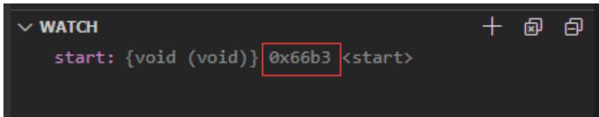


图2-1：在“WATCH”窗口中查看start函数的地址


5. 请读者先在纸上记录下图中红色边框圈出的函数地址。注意，读者得到的地址可能与图示中的不同，请读者记录实际的地址。

6. 结束此次调试。

# 调试BIOS程序

接下来会引导读者按照处理器加电运行的顺序，依次调试BIOS程序、软盘引导扇区程序和加载程序，直到进入Linux0.11操作系统的内核。由于BIOS程序、软盘引导扇区程序和加载程序没有提供调试信息，所以这里无法使用类似前面介绍的调试Linux0.11内核那样的功能来进行调试了，也就是说不能在VSCode中按F5启动调试，无法在汇编源代码文件中添加断点，也无法提供单步调试、查看变量的值、查看调用堆栈等功能。幸好Bochs提供了命令调试功能，可以用来调试包括BIOS程序在内的每条需要处理器执行的指令。

在 VSCode 的“Terminal”菜单中选择“Run Build Task...”，会在 VSCode 的顶部中间位置弹出一个可以执行的 Task 列表，选择其中的“Bochs 命令调试”即可，此时会弹出两个 Bochs 窗口。标题为“Bochs for windows - Display”的窗口相当于计算机的显示器，显示操作系统的输出。标题为“Bochs for windows - Console”的窗口是 Bochs 的控制台，用来输入调试命令和输出调试信息。

启动调试后，Bochs在CPU要执行的第一条指令（即BIOS的第一条指令）处中断。此时，Display窗口没有显示任何内容，Console窗口显示将要执行的BIOS的第一条指令，并等待用户输入调试命令，如图2-2所示。

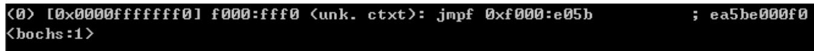


图2-2:Console窗口显示在BIOS第一条指令处中断


从 Console 窗口显示的内容中，可以获得关于 BIOS 的第一条指令的如下信息：

- 行首的[0x0000FFFFFF0]表示此条指令所在的物理地址。

- f000:fff0 表示此条指令所在的逻辑地址（段地址：偏移地址）。

- jmpf 0xf000:e05b 是此条指令的反汇编代码。

- 行末的ea5be000f0是此条指令的十六进制字节码，可以看出此条指令占用了5个字节。

接下来按照下面的步骤，查看CPU在没有执行任何指令前主要的寄存器中的数据（即CPU复位后的状态），以及内存中的数据：

1. 在 Console 窗口中输入调试命令 sreg 后按回车，显示当前 CPU 中各个段寄存器的值，如图 2-3 所示。其中 CS 寄存器信息行中的“cs:0xf000”表示 CS 寄存器的值为 0xf000。

```txt
<bochs:1> sreg es:0x0000, dh=0x00009300, dl=0x0000fff, valid=7 Data segment, base  $=$  0x00000000, limit  $=$  0x0000ffff, Read/Write, Accessed cs:0xf000, dh=0xff0093ff, dl=0x0000fff, valid=7 Data segment, base  $=$  0xFFFF0000, limit  $=$  0x0000ffff, Read/Write, Accessed ss:0x0000, dh=0x00009300, dl=0x0000fff, valid=7 Data segment, base  $=$  0x00000000, limit  $=$  0x0000ffff, Read/Write, Accessed ds:OxOoOo, dh=OxOoOo93Oo, dl=OxOoOoFFF, valid=7 Data segment, base  $=$  0xOooOOOOo, limit  $=$  OxOooOFFFF, Read/Write, Accessed fs:OxOoOo, dh=OxOooOO93Oo, dl=OxOooOOfff, valid=7 Data segment, base  $=$  0xOooOOOOo, limit  $=$  OxOooOOfff, Read/Write, Accessed gs:OxOooO, dh=OxOooOO93Oo, dl=OxOooOOfff, valid=7 Data segment, base  $=$  0xOooOOOOo, limit  $=$  OxOooOOfff, Read/Write, Accessed ldtr:OxOooo, dh=OxOooo82Oo, dl=OxOoooFFF, valid=1 tr:OxOooo, dh=OxOooo8bOo, dl=OxOoooFFF, valid=1 gdtr:base  $=$  0xOoooOOo, limit  $=$  OxFFFFFF idtr:base  $=$  0xOoooOOo, limit  $=$  OxFFFFFF
```

图2-3：使用sreg查看段寄存器中的值

2. 在 Console 窗口中输入调试命令 r 后按回车，显示当前 CPU 中各个通用寄存器的值，如图 2-4 所示。其中“eip:0x0000fff0”表示 IP 寄存器的值为 0xfff0。结合 BIOS 的第一条指令的地址，可以验证 CPU 将要执行的指令地址为 CS:IP。

```txt
<bochs:2> r  
eax: 0x00000000  
ecx: 0x00000000  
edx: 0x00000000  
ebx: 0x00000000  
esp: 0x00000000  
ebp: 0x00000000  
esi: 0x00000000  
edi: 0x00000000  
eip: 0x000fff  
eflags 0x0000002: id vip vif ac vm rf nt IOPL= of df if tf sf zf af pf cf
```

图2-4：使用  $\mathbf{r}$  寄存器查看通用寄存器中的值

3. 输入调试命令 xp /1024b 0x0000，查看从地址 0 开始的 1024 个字节的物理内存。在 Console 中输出的这 1K 物理内存的值都为 0，说明 BIOS 中断向量表还没有被加载到从地址 0 开始的物理内存。

4. 输入调试命令 xp /512b 0x7c00，查看软盘引导扇区要被加载到的物理内存。输出的内存值都为 0，说明软盘引导扇区还没有被加载到从地址 0x7c00 开始的物理内存。

通过以上的实验步骤，可以验证BIOS第一条指令的逻辑地址中的段地址和CS寄存器值是一致的，偏移地址和IP寄存器的值是一致的。由于物理内存还没有被使用，所以其中的值都为0。

# 查看软盘引导扇区程序生成的列表文件

NASM汇编器在将软盘引导扇区程序bootsect.asm生成为二进制bootsect.bin的同时，会生成一个

bootsect lst 列表文件。二进制文件 bootsect.bin 中包含了指令的机器码，是给处理器使用的，人阅读起来就十分吃力。而列表文件是一个文本文件，可以准确反映出汇编源代码文件中的指令与二进制文件中机器码的关系，帮助读者调试 bootsect.asm 文件中的汇编代码。

按照下面的步骤查看bootsect.lst文件中的内容：

1. 在 VSCode 的 “文件资源管理器” 窗口中打开 “boot” 文件夹, 打开其中的 bootsect. lst 文件。

2. 将bootsect.lst文件和bootsect.asm文件对比可以发现，此文件包含了bootsect.asm文件中所有的汇编代码，同时在代码的左侧又添加了更多的信息。

3. 在bootsect.list中查找到软盘引导扇区程序第一条指令所在的行

<table><tr><td>32</td><td>00000000</td><td>B8C007</td><td>mov ax, BOOTSEG</td></tr></table>

此行包含的信息有：

32是行号。

- 00000000 是此条指令相对于程序开始位置的偏移（第一条指令的偏移为 0）。

B8C007是此条指令的机器码，此条指令包含了3个字节。

4. 在 VSCode 的“文件资源管理器”窗口中打开“boot”文件夹，在其中的 bootsect.bin 文件上点击鼠标右键，在弹出的菜单中选择“Open With…”，会在 VSCode 的顶部中间位置弹出一个文件打开方式的列表，选择其中的“Hex Editor”，就会使用二进制编辑器打开此文件。可以看到 bootsect.bin 文件中的机器码与列表文件 bootsect.lst 中的机器码是完全一致的。

# 调试软盘引导扇区程序（bootsect.asm）

BIOS在执行完硬件设备自检和初始化工作后，会将软盘引导扇区（512字节）加载到物理地址0x7c00-0x7dff位置，并从0x7c00处的指令开始执行引导程序。按照下面的步骤从0x7c00处调试软盘引导扇区程序：

1. 在Bochs的Console窗口中输入调试命令vb 0x0000:0x7c00,这样就在逻辑地址0x0000:0x7c00（相当于物理地址0x7c00）处添加了一个断点。

2. 输入调试命令 c 让 Bochs 继续执行，会在 0x7c00 处的断点中断。此时会在 Console 窗口中输出下一个要执行的指令，即软盘引导扇区程序的第一条指令，如图 2-5 所示。

```txt
<bochs:1>vb0x0000:0x7c00  
<bochs:2>c  
(0) Breakpoint 1, in 0000:7c00 (0x00007c00)  
Next at t=17555472  
(0) [0x00000007c00] 0000:7c00 (unk.ctxt): mov ax, 0x07c0 ; b8c007
```

图2-5：软盘引导扇区程序的第一条指令

3. 为了方便后面的使用，可以在纸上记录下此条指令的字节码（b8c007）。

4. 输入调试命令 sreg 验证 CS 寄存器的值（0x0000）。

5. 输入调试命令 r 验证 IP 寄存器的值（0x7c00）。

6. 由于BIOS程序此时已经执行完毕，输入调试命令 xp /1024b 0x0000 验证此时BIOS中断向量表已经被载入。

7. 输入 xp /512b 0x7c00 显示软盘引导扇区程序的所有字节码。观察此块内存最开始的三个字节分别是 0xb8、0xc0 和 0x07, 这和引导程序第一条指令的字节码是相同的。如果将 Bochs 的 Console 窗口中显示的 512 个字节与 bootsect.lst 文件中的机器码进行比较, 或者与使用二进制编辑器打开的 bootsect.bin 文件中的内容进行比较, 读者会发现它们的内容是完全相同的。此块内存最后的两个字节分别是 0x55 和 0xAA, 它们是魔数, 是 BIOS 规定这两个字节的值必须为 0x55 和 0xAA 时才表示引导扇区是激活的, 可以用来引导操作系统。这两个字节对应 bootsect.asm 中最后一行语句 (注意, 字节顺序使用 Little-endian):

dw 0xAA55

接下来查看引导程序将自己复制到0x90000后的情况：

1. 输入调试命令 xp /512b 0x9000:0x0000 可以验证此时引导程序还没有将自己移动到 0x9000:0x0000 处。

2. 输入调试命令 vb 0x9000:0x0018，在 0x9000:0x0018 处设置一个断点。

3. 输入调试命令 c 继续执行，会在刚刚添加的断点处中断。

4. 再次输入调试命令 xp /512b 0x9000:0x0000，并与之前的内存比较，可以知道引导程序已经将自己移到了 0x90000 处，并在 0x9000:0x0018 处中断执行了。

5. 输入调试命令 xp /512b 0x9000:0x0200，可以验证此时 setup.bin 模块还没有被装入内存

6. 根据bootsect.lst文件下面一行的内容（执行此行指令时说明setup.bin加载完毕），输入调试命令vb 0x9000:0x0031，在逻辑地址0x9000:0x0031处设置一个断点。

75 00000031 OF830B00 jnc ok_load_setup ；读取成功

7. 输入调试命令 c 继续执行，会在刚刚添加的断点处中断。

8. 输入调试命令 xp /512b 0x9000:0x0200，此块内存已经发生改变。将此块内存中的字节码与 init/setup.list 文件和 init/setup.bin 文件中的内容比较，可以知道此时 setup.bin 模块已经被载入内存。

9. 输入调试命令 xp /512b 0x1000:0x0000，可以看到除前面有少量数据(BIOS自检程序残留下的)，后面全是0。可以知道此时内核模块linux011.bin还没有被装载进入内存。

10. 根据bootsect.lst文件下面一行的内容（执行此行指令时说明linux011.bin加载完毕，软盘驱动器中的马达被关闭了），输入调试命令vb 0x9000:0x006e，在逻辑地址0x9000:0x006e处设置一个断点。

119 0000006E E8DB00 call kill_motor

11. 输入调试命令 c 继续执行，会在刚刚添加的断点处中断。

12. 输入调试命令 xp /512b 0x1000:0x0000, 显示此块内存中的字节码与 boot/head.lst 文件（由 init/head.asm 编译时生成）和 linux011.bin 文件中开始位置的机器码是完全一致的。原因是 init/head.asm 生成了目标文件 init/head.o，此目标文件中的代码段（包括指令的机器码）会在链接时写入内核模块 linux011.bin 的代码段的开始位置。由此可知，此时内核模块 linux011.bin 已经被装入物理内存。

# 调试加载程序（setup.asm）

setup.asm 生成的 setup.bin 被加载到从地址 0x90200 开始的物理内存。可以按照下面的步骤进行调试。

1. 在Bochs的Console窗口中输入调试命令vb 0x9020:0x0000，在逻辑地址0x9020:0x0000（即setup程序的第一条指令）处设置一个断点。

2. 输入调试命令 c 继续执行，可在 0x9020:0x0000 处中断，如图 2-6。打开 setup.lst 文件，可以看到其中第一条指令的字节码与此处将要执行的指令的字节码是相同的，说明 Linux 0.11 将要开始执行 setup 模块。

(0) [0x00090200] 9020:0000 (unk. cxtt): mov ax, 0x9000 ; b80090 <bochs:25>


图2-6：在断点0x9020:0x0000处中断


3. 输入调试命令 xp /2b 0x9000:0x0000, 查看取得各种机器参数之前物理内存 0x90000-0x901FF 中前两个字节的值并记录下来，如图 2-7。

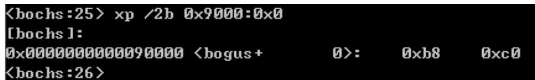


图2-7：取得机器参数前物理内存0x90000处的值。


4. 根据setup.lst文件下面一行的内容，输入调试命令vb 0x9020:0x0080。

116 00000080 FA cli

5. 输入调试命令 c 继续运行，在刚刚添加的断点处中断。此时 Linux 0.11 已经将各种机器参数放入 0x90000-0x901FF 的物理内存中。

6. 输入调试命令 xp /2b 0x9000:0x0000，查看此处内存的值，如图 2-8，并和步骤 3 进行对比。可以知道此时该地址处的内存值已经改变。

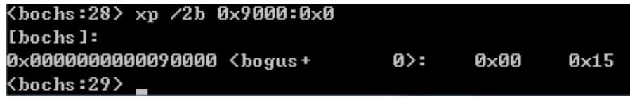


图2-8：取得机器参数后0x90000处内存的值


7. 根据setup.list文件下面一行的内容，输入调试命令vb 0x9020:0x010b。

```txt
209 0000010B EA00000800 jmp 8:0
```

8. 输入调试命令 c 继续运行，可以在刚刚添加的断点处中断。此时，setup.asm 已经完成了它的工作，并让处理器从实模式进入了保护模式，下一条将要执行的跳转指令是工作在保护模式下的，所以要指定段选择符和偏移，才会跳转到 head.s 的第一条指令处执行。注意，这里的段值的 8 已经是保护模式下的段选择符了，用于选择描述符表和描述符表项以及所要求的特权级。关于段描述符表和段选择符的知识，读者会在后面的实验中进一步学习。

# 调试内核模块中的 head.s

1. 打开 head lst，找到其第一条指令所在行，如下（此条指令包含了 5 个字节）：

```asm
25 0000 B8100000 movl $0x10,%eax
25 00
```

在生成Linux0.11内核的过程中，head.s会生成目标文件head.o，此目标文件中的代码段在链接时会写入Linxu011.bin中代码段的开始位置，并且linx011.bin会被从之前的0x10000起始的物理内存移动到0x00000起始的物理内存。所以，可以在物理地址0x0000处设置一个断点。注意，执行到这里时，CPU已经处于保护模式了，使用在物理地址添加断点的命令比较方便，所以输入的调试命令为：pb 0x0000。

2. 输入调试命令 c 继续执行，可在图 2-9 所示的指令处中断。对比 head.1st 文件中第一条指令的字节码，可以确认已经进入了 head.s 模块。

```html
（0）[0x00000000000] 0008:00000000（unk.ctxt）：mov eax, 0x0000010 ;b810000000<bochs:22>
```


图2-9：在head.s的第一条指令处中断


3. 根据 head.1st 文件下面一行的内容，输入调试命令：pb 0x540b。该指令负责将内核入口点函数 start 的地址压入栈。

```txt
202 540b 68000000 push1 $_start
202 00
```

4. 输入调试命令 c 继续执行，在步骤 3 设置的断点处中断，如图 2-10。

```html
(0) Breakpoint 1, 0x0000540b in ?? () Next at t=35110561 (0) [0x00000000540b] 0008:0000540b (unk. ctxt): push 0x000066b3 ; 68b3660000 <bochs:3>
```


图2-10：在将start函数地址压栈的指令处中断


将图中红框中的地址与之前记录的 start 函数的地址比较，可以确认这个地址就是 start 函数的地址。最终就是通过这个地址跳转到操作系统内核的入口点开始执行，从而结束引导过程的。

5. 根据head lst文件下面一行的内容，输入调试命令：pb 0x54a5。

```txt
316 54a5 C3 ret
```

6. 输入调试命令 c 继续执行，在 ret 指令处中断。然后接着输入调试命令 s，单步执行此行的 ret 指令，可以得到图 2-11:

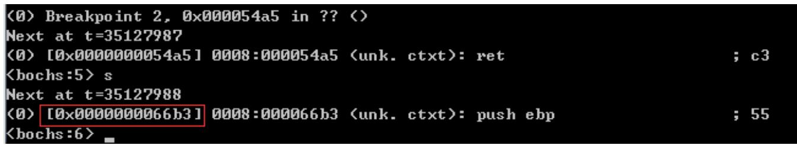


图2-11：准备执行start函数的第一条指令


图中红线圈出的是 IP 寄存器将要执行的下一条指令。对比可以发现它和图 2-10 中圈出的值是一样的，说明接下来就开始执行 start 函数中的指令了。将内核入口点 start 函数的地址压入栈，然后再通过 ret 指令进入此函数执行的是这里的一个小技巧，请读者仔细体会。

调试到这里，操作系统启动的部分就全部结束了，接下来操作系统将跳入init/main.c中的start函数去执行。在head.s中还做了许多其它事情，如对中断描述符表和全局描述符表进行设置，对页表的设置等，有兴趣的读者可以自己进行深入研究。

# 3.3 内核初始化

通过对比图2-1和图2-11中的函数地址，可以知道，处理器最终跳转到文件init/main.c的start函数中去执行。说明此时已经进入了内核，但从刚进入内核到系统最终稳定下来，等待用户输入命令，还有很多初始化工作要做。由于此过程较为复杂，不适合刚刚接触操作系统的读者学习，所以这里只做总体介绍，如果读者想了解初始化的详细过程，请阅读《Linux内核完全注释》第7章的内容。

读者可以在Bochs的Console窗口中输入调试命令c让Bochs虚拟机继续执行。当Linux0.11操作系统完成启动后，打开Bochs的Display窗口，然后按F1键，会列出当前的进程信息，如图2-12所示。这些进程信息显示出当系统启动完毕，开始等待用户输入命令时，有进程号（pid）分别为0、1、4、3的四个进程。

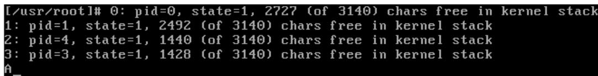


图2-12：Linux0.11完成初始化后的进程信息


显然，在终端显示的进程列表信息量比较小，读者此时可以使用可视化窗口查看Linux内核初始化过程中的更多信息。步骤如下：

1. 结束之前的调试，关闭Bochs虚拟机。

2. 读者可以继续使用 VSCode 打开在 3.1 中得到的 Linux 内核项目。选择“Run”菜单中的“Remove All Breakpoints”将所有断点清除。

3. 接下来读者需要在源代码中一个合适的位置添加断点, 从而查看Linux内核初始化完毕后的状态。之前介绍过, 当Linux内核完成初始化后, 就开始等待用户输入命令了。显然在处理等待用户输入命令的代码处添加这个断点最合适。所以, 读者可以在kernel\chr_drv\ttyio.c文件的tty_read函数中(第321行)添加一个断点即可。此函数就是终端进程读取用户输入的字符时调用的函数。

4. 按 F5 启动调试，待 Linux 内核初始化完毕后，就会命中刚刚添加的断点。

5. 在 VSCode 的 “View” 菜单中选择 “Command Palette...”, 会在 VSCode 的顶部中间位置显示命令面板, 输入 “Lab: New Visualizer View” 命令后, VSCode 会在其右侧弹出一个窗口让读者查看可视化视图。

6. 在右侧可视化视图顶部的编辑框中输入命令“#task”，就可以显示当前系统中所有进程的数据（如图 2-13 所示）。此时系统中存在四个进程，进程号分别为 0、1、4、3。其中 current 游标是一个全局变量，用于指向当前正在运行的进程。所以，从图上可以看出，当前正在运行的进程是 4 号进程，也就是终端进程，这与添加断点中断执行的位置是吻合的，说明终端进程正在（运行）从键盘获取用户输入的命令。当然，如果接下来用户没有输入任何命令，终端进程就会进入阻塞状

态，让出处理器，调度程序会让 0 号进程继续运行，直到用户输入命令时将终端进程唤醒继续执行。关于进程状态转换过程和进程调度，会在后面的实验中详细讨论。请读者根据可视化窗口中各个进程“父进程 ID”字段的值，整理出所有进程的父子关系。其中，-1 表示没有父进程。

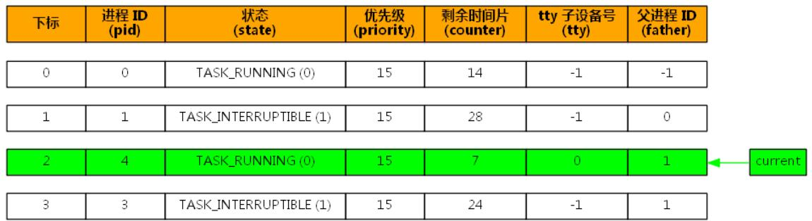


图2-13：Linux0.11内核初始化完毕时的进程信息


7. 在右侧可视化视图顶部的编辑框中输入命令“#sched”后按回车（需要等待较长时间完成刷新），就可以查看进程的运行轨迹。在图中每一行表示所有进程中的某一个进程进入了某个状态，并使用不同的颜色表示不同的状态（具体看图例），例如第一行表示pid为0的进程进入了运行态，后面在其运行的过程中创建了pid为1的进程。细心的读者一定会发现在每一行中最多只会有一个处于运行状态的进程，这是因为Linux 0.11内核虽然允许多个进程并发运行，但是不允许多个进程并行运行，也就是说只支持单处理器，不支持多处理器，所以某个时刻只能有一个进程在运行，请读者一定要理解并发和并行的区别。在图中最左侧是Jiffies时钟滴答，在本书后面会有详细的介绍，这里读者只需要将其理解为CPU运行的时间即可。在图中最右侧是函数名称和行号，根据这两个信息读者可以定位具体是哪一行代码让进程发生状态变化的。从图中可以看到进程号为0的进程是Linux初始化过程中创建的第一个进程，在完成加载系统后，演变为进程调度，交换以及存储管理进程。然后，以进程0为母本创建进程1，来继续完成系统的初始化，进程1是系统中所有其它进程的祖先进程。然后，以进程1为母本创建进程号为2的Shell进程。2号进程再创建进程号为3的update进程，然后进程2就结束了。update进程的主要任务是将缓冲区中的数据同步到外设(软盘和硬盘)。update进程启动后将会被阻塞，然后让进程1继续运行，此时进程1会创建一个新的Shell进程接受用户的命令，其进程号为4。进程5是进程4创建的，用于监听内核异常。当系统出现宕机，可以利用该进程将宕机时的一些堆栈信息写入指定文件，用于事后分析宕机的原因。当系统正常启动后，进程5结束。这就是Linux 0.11内核的初始化过程。

# 3.4 在Linux 0.11内核进入保护模式之前添加提示信息

Linux 0.11 在启动的过程中会让处理器从实模式进入保护模式。读者可以在 Linux 0.11 进入保护模式之前在屏幕上显示提示信息“Enter protected mode...”，提示用户将要进入保护模式继续执行。这样可以使读者更深入的理解 Linux 0.11 内核的启动过程。

# 测试方法

1. 代码修改完毕后，按F5启动调试。

2. 在Bochs的Display窗口中，应能看到图2-14所示的红框中的信息。

# 提示

1. 修改boot/setup.asm文件，在116行的cli指令之前添加代码。可以参考boot/bootsect.asm文件中的104行至112行的代码，通过BIOS中断调用int10输出字符串。注意，在BIOS中断调用int10中ES:BP指向字符串地址，所以在代码中一定要为ES寄存器设置一个合适的值。

2. 为了解决后面显示的内容会覆盖进入保护模式的提示信息的问题，需要修改 kernel/blk_drv/hd.c 文件在int sys_setup(void *BIOS)函数中的203行“printf("Partition table%s ok.\n\r", (NR_HD>1)?s:"");”代码处，输出Partition table ok之前，添加两个回车换行。

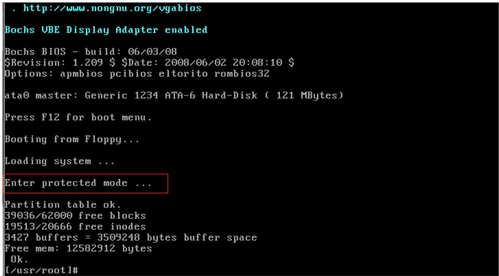


图2-14：进入保护模式之前的提示信息


# 3.5 提交作业

实验结束后先使用 VSCode 左侧的“源代码版本控制窗口”查看文件变更详情，确认无误后再将本地项目提交到平台的个人项目中，方便教师通过平台查看读者提交的作业。

# 3.6 学习 Windows 控制台应用程序 pe2bin 和 mkfloppy

在Linux 0.11内核项目的makefile中，会调用pe2bin和mkf floppy这两个Windows控制台应用程序，来生成Linux 0.11内核的可执行文件linux011.bin，并将其写入软盘镜像文件floppya.img中。在读者使用的定制版的VSCode中，已经将这两个应用程序的可执行文件pe2bin.exe和mkf floppy.exe放入了VSCode的code.exe_toolchain\bin文件夹中，但是读者还是有必要学习一下这两个应用程序的源代码，甚至是修改它们的源代码来实现一些特殊的功能，从而加深对Linux 0.11操作系统构建过程的理解。

pe2bin应用程序用于将生成的PE格式的可执行文件linux011.exe转换成平坦的linux011.bin文件。PE格式的可执行文件linux011.exe中存放着Linux0.11操作系统内核的数据和指令以及调试信息，由于其格式比较复杂，还无法被bootsect.asm程序识别，也就无法直接将linux011.exe文件中的数据和指令从软盘加载到内存中的指定位置。所以，pe2bin应用程序的目的就是将linux011.exe文件中的数据和指令信息抽取出来，并重新保存成平坦格式的linux011.bin文件，从而允许bootsect.asm程序用更简单的代码，直接将其从软盘加载到内存中的指定位置。

mkfloppy 应用程序用于将 bootsect.bin、setup.bin 和 linux011.bin 三个文件写入软盘镜像文件 floppya.img 中。每一个软盘扇区的大小都是 512 个字节，bootsect.bin 文件的大小也是 512 字节，正好占用软盘的第 0 扇区，setup.bin 文件占用软盘的第 1-4 扇区，linux011.bin 文件占用软盘的第 5-388 扇区。

读者可以打开Linux0.11内核项目中的makefile文件，在开始部分的目标all中调用了pe2bin和mkfloppy这两个Windows控制台应用程序，内容如下：

```batch
BOOT = boot\bootsect.bin  
Loader = boot\setup.bin  
TARGET = linux011.exe  
KERNEL = linux011.bin
```

```makefile
ARTIFACT = artifact.Done
...
all: $(TARGET) $(BOOT) $(loader) $(ARTifact)
@echo -
@echo ----- Build $(KERNEL) -----
copy $(TARGET) $(TARGET).tmp
strip $(TARGET).tmp
pe2bin.exe $(TARGET).tmp $(KERNEL)
del $(TARGET).tmp
@echo -
@echo ----- Build floppya.img -----
mkfloppy.exe $(BOOT) $(loader) $(KERNEL) floppya.img
@echo -
@echo ----- Build Linux 0.11 success! -----
```

目标all中的这些Windows控制台命令会在生成Linux0.11内核项目的最后阶段自动执行。其中echo命令用于打印信息；copy命令将linux011.exe文件拷贝成一个linux011.exe.bmp临时文件；strip命令将linux011.exe.bmp文件中的调试信息剥离；pe2bin.exe将linux011.exe.bmp文件转换为linux011.bin文件；del命令将linux011.exe.bmp临时文件删除；mkf floppy.exe将bootsect.bin、setup.bin和linux011.bin文件写入到floppya.img软盘镜像文件中。

访问下面的地址，可以获取这两个Windows控制台应用程序的源代码

https或http://平台域名或IP/engintime/linux011/project-template pe2bin

https或http://平台域名或IP/engintime/linux011/project-template/mkf floppy

# 四、思考与练习

1. 为什么Linux 0.11操作系统从软盘启动时要使用bootsect.bin和setup.bin两个程序？使用一个可以吗？它们各自的主要功能是什么？如果将setup.bin的功能移动到bootsect.bin文件中，则bootsect.bin文件的大小是否仍然能保持小于512字节？

2. 结合前面“预备知识”中对三个汇编语言源文件的介绍，在源代码文件中找到对应的实现代码，加深对Linux 0.11操作系统启动过程的理解。

3. 仔细阅读 mkfloppy 应用程序项目的源代码。此应用程序默认会将 linux011.bin 文件写入软盘镜像文件从 5 号（从 0 开始计数）扇区开始的位置。尝试修改该应用程序，将 linux011.bin 文件写入从 8 号扇区开始的位置。将生成的 mkfloppy.exe 拷贝覆盖 VSCode 中的原有文件（旧文件做好备份，用于恢复）。修改 boot\bootsect.asm 中的汇编代码，使之能够从软盘 A 的 8 号扇区加载 linux011.bin 文件，确保 Linux 0.11 能够正常启动。

4. 将Linux 0.11内核项目中的makefile文件中目标all的脚本修改为如下内容：

```txt
BOOT = boot\bootsect.bin  
Loader = boot\setup.bin  
......  
TARGET = linux011.exe  
ARTifact = artifact_done  
......  
all:  $$ TARGET)  $(BOOT)$ $(LOADER)$ $(ARTifact)$  @echo - @echo -Build floppya.img strip  $(TARGET)$
```

```batch
mkfloppy.exe  $(\mathrm{BOOT})$ $(\mathrm{L O A D E R})$ $(\mathrm{T A R G E T})$  floppya.img @echo - @echo -Build Linux 0.11 success! -
```

这样就会将PE格式的内核文件linux011.exe直接写入软盘镜像文件中，这就需要读者修改boot\bootsect.asm中的汇编代码，使之在读取软盘A中的内核文件时，能够识别PE文件的格式，并且将PE文件中的指令和数据直接加载到内存中的指定位置，从而使Linux 0.11仍然能够正常启动。可以参考pe2bin项目中的源代码完成此练习。

# 实验三 Shell 程序设计

实验性质：验证、设计

建议学时：2学时

任务数：1个

实验难度：★★★☆☆

# 一、实验目的

$\bullet$  了解Shell在Linux中的重要作用。

$\bullet$  学会编写简单的Shell脚本程序。

# 二、预备知识

Shell 为用户和 Linux 操作系统之间的命令交互提供最基本的接口，在使用者和操作系统之间架起一座桥梁。它的名字 Shell（外壳）形象的地表示它在用户与操作系统之间的关系。早期 Shell 主要用作命令解释器，经过不断扩充和发展，现在已是命令语言、命令解释器、程序设计语言的统称，被泛指为一个提供人机交互界面和接口的程序。

Shell 是一种解释型程序设计语言，它支持大多数高级程序设计语言中能见到的程序结构，如函数、变量和控制语句，具有极强的程序设计能力，可被用来编写 Shell 脚本程序。Shell 脚本程序包含一系列命令，运行脚本就是执行脚本中的每个命令，可用一个脚本在一次运行中执行许多个命令。

# 三、实验内容

# 3.1 准备实验

使用浏览器平台领取本次实验对应的任务，从而在平台上创建个人项目（Linux 0.11 内核项目），然后使用 VSCode 将个人项目克隆到本地磁盘中并打开。

在 VSCode 的“Terminal”菜单中选择“Run Build Task...”，会在 VSCode 的顶部中间位置弹出一个可以执行的 Task 列表，选择其中的“Bochs 运行（不调试）”，待 Linux 0.11 操作系统启动完毕后，按照下面的实验内容使用 vi 编辑器编写 Shell 脚本程序。

提示：下面的实验内容要求读者在Linux 0.11的Shell中，使用vi编辑器编写Shell脚本文件。如果读者不习惯使用vi编辑器，也可以在VSCode左侧的“文件资源管理器”中新建Shell脚本文件（注意，新建的Shell脚本文件必须放在本地项目的根目录中），然后使用VSCode在Shell脚本文件编辑源代码，并通过软盘镜像文件floppyb.img复制到Linux 0.11操作系统中，最后再运行Shell脚本程序。

# 3.2 Shell程序中的特殊字符

<table><tr><td>字符</td><td>作用</td></tr><tr><td>星号*</td><td>通配符，可匹配任何字符串</td></tr><tr><td>问号?</td><td>通配符，可匹配任何单个字符</td></tr><tr><td>方括号[]</td><td>匹配括号内所有字符中的任一字符，可在括号内的字符间用短划线“-”表示字符范围，例如，myfile[23456]与 myfile[2-6]效果相同，可以匹配文件 myfile2 至 myfile6。</td></tr><tr><td>反斜杠\</td><td>为了将 Shell 的特殊字符*、?、[]、&amp;和;等变成普通字符，必须在这些字符前加\，此外，\放行尾为续行符。</td></tr><tr><td>双引号”“</td><td>其所括字符中，除$、\及,外的其他特殊字符都失去特定含义。</td></tr><tr><td>单引号’’</td><td>其所括字符中的所有特殊字符都失去特定含义。</td></tr><tr><td>倒引号`’</td><td>其所括字符串被解析为命令行。</td></tr></table>

# 3.3回显

回显语句是Shell脚本中使用最多的语句，用来向标准输出打印变量值或字符串。

用法：echo 变量值|字符串

1. 使用 vi 编辑器新建 Shell 脚本文件 shell1.sh。

2. 编辑 shell1.sh 的内容如下（以‘#’开始的行为注释）：

```shell
print hello world  
echo hello world  
echo `echo command`
```

3. 退出 vi 编辑器并保存文件。

4. 在Shell中输入./shell1.sh后回车，观察运行结果。

5. 使用 sync 命令将新建的 Shell 脚本文件保存到硬盘。

# 3.4 变量

变量用于保存值或字符串，变量可以被创建、赋值和删除。通常所有变量都被看做字符串并以字符串来存储，即使它们被赋值为整数时也是如此。Shell 和软件工具会在需要时把数值型字符串转换为对应的数值以对它们进行操作。注意，变量名称只能包含大、小写字母、数字（0~9）和下划线，且只能以字母或下划线开头。

# 用户自定义变量

用户自定义变量也称局部变量,是用户在 Shell 脚本中定义的变量,可以对它赋值。可以是整形值、字符串(包含在双引号中)等。引用变量时,需要在其名称前面添加“$”。

编写如下Shell脚本文件shell12.sh，并观察运行结果：

```shell
a=1  
echo $a  
b=" hello world"  
echo $b
```

# 位置变量

位置变量类似于C语言程序的命令行参数,可以写在Shell程序文件名之后,共有9个,用$n表示(n为一个十进制数)。在参数传递时必须使命令行中提供的参数与程序中的位置参数一一对应。$0是一个特殊变量,它是当前Shell程序的文件名,第1个位置变量名为$1,第2个位置变量名为$2,以此类推。

编写如下Shell脚本文件shell13.sh，然后在命令行中输入“.shell13.sh 100 hello”，并观察运行结果：

```shell
echo $0
echo $1
echo $2
```

# Shell变量

Shell 变量的名字和含义是固定的。$?用于得到上一条命令的十进制返回码,$$用于得到当前 Shell 进程的进程号,$!用于得到上个后台进程的进程号,$#用于得到传递给 Shell 程序的参数个数(不限于 9 个,但统计数量时不包含作为第一个参数的 Shell 文件名),-$-用于得到当前 Shell(用 set)设置的执行标识名组成的字符串,$*用于得到命令行中实际给出的实参字符串。Shell 变量是由 Shell 程序本身设置的特殊变量,根据实际情况设置,不允许用户重新设置。

编写如下 Shell 脚本文件 shell14.sh，并观察运行结果：

```txt
echo \$#  
echo \$?
```

# 3.5 算数运算

let 语句后可跟算术表达式执行整数算数运算，因而 Shell 含有各种算数运算符。

编写如下Shell脚本文件shell15.sh，然后在命令行中输入“.shell15.sh 2 3”，并观察运行结果：

```txt
let k=$1+$2
```

echo $k

# 3.6 函数

Shell 脚本程序中的函数与一般语言中函数的用法类似，必须先定义后使用，并且可以传递参数，并返回值。

# 函数定义

```txt
function Fun()  
{ 函数体}
```

# 返回值

函数的返回值可以通过 return 关键字返回，返回值只能为整数或整数型数值字符串，也可以无返回值。

需要注意的是,函数的返回值不能通过‘=’直接赋值给变量,只能在调用函数后,通过‘$?’来获得函数的返回值,且中间不能有其它语句。

# 参数传递

函数的参数传递与 Shell 脚本的位置变量类似,也是通过$n 表示,n 是一个十进制数。

# 调用

在 Shell 脚本中调用函数与执行命令的格式一样：函数名 参数列表

编写如下Shell脚本文件shell16.sh，然后在命令行中输入“.shell16.sh 2 3”，并观察运行结果：

```shell
function Mul()
{
    let i=$1*$2
    return $i
}
Mul $1 $2
a=$(?
echo $a
```

# 3.7 控制语句

命令在脚本中的执行顺序称为脚本流。当编写一个较复杂的脚本时，常常需要根据不同的条件执行不同的脚本流，这就要求Shell提供各种流程控制语句。

# 测试语句

测试语句通常作为条件表达式来使用，从而实现一个条件测试。测试语句计算表达式的值，并返回真（0）或假（1）。其在Shell脚本中常常缩写为[expression]的形式（注意，中括号与表达式之间必须有空格）。

<table><tr><td>文件测试条件</td><td>返回值说明</td></tr><tr><td>[ -r file ]</td><td>表示若是文件存在且用户可读，则测试条件为真</td></tr><tr><td>[ -w file ]</td><td>表示若文件存在且用户可写，则测试条件为真</td></tr><tr><td>[ -x file ]</td><td>表示若文件存在且用户可执行，则测试条件为真</td></tr><tr><td>[ -b file ]</td><td>表示若文件存在且为块设备文件，则测试条件为真</td></tr><tr><td>[ -c file ]</td><td>表示若文件存在且为字符设备文件，则测试条件为真</td></tr><tr><td>[ -d file ]</td><td>表示若文件存在且为目录文件，则测试条件为真</td></tr><tr><td>[ -f file ]</td><td>表示若文件存在且为普通文件，则测试条件为真</td></tr><tr><td>[ -p file ]</td><td>表示若文件存在且为 FIFO 文件，则测试条件为真</td></tr><tr><td>[ -s file ]</td><td>表示若文件存在文件长度&gt;0，则测试条件为真</td></tr><tr><td>[ -t file ]</td><td>表示若文件描述符与终端相关，则测试条件为真</td></tr><tr><td>字符串比较测试条件</td><td>返回值说明</td></tr><tr><td>[ -z s1 ]</td><td>表示若字符串长度为0，则测试条件为真</td></tr><tr><td>[ -n s1 ]</td><td>表示若字符串长度&gt;0，则测试条件为真</td></tr><tr><td>[ s1 ]</td><td>表示若s1不是空字符串，则测试条件为真</td></tr><tr><td>[ s1=s2 ]</td><td>表示若两个字符串相等，则测试条件为真</td></tr><tr><td>[ s1!=s2 ]</td><td>表示若两个字符串不相等，则测试条件为真</td></tr><tr><td>[ s1&lt;s2 ]</td><td>表示若按字典顺序s1在s2之前，则测试条件为真</td></tr><tr><td>[ s1&gt;s2 ]</td><td>表示若按字典顺序s1在s2之后，则测试条件为真</td></tr></table>

<table><tr><td>整数比较测试条件</td><td>返回值说明</td></tr><tr><td>[ int1 -gt int2 ]</td><td>表示若 int1 大于 int2，则测试条件为真</td></tr><tr><td>[ int1 -eq int2 ]</td><td>表示若 int1 等于 int2，则测试条件为真</td></tr><tr><td>[ int1 -ne int2 ]</td><td>表示若 int1 不等于 int2，则测试条件为真</td></tr><tr><td>[ int1 -lt int2 ]</td><td>表示若 int1 小于 int2，则测试条件为真</td></tr><tr><td>[ int1 -le int2 ]</td><td>表示若 int1 小于或等于 int2，则测试条件为真</td></tr><tr><td>[ int1 -ge int2 ]</td><td>表示若 int1 大于或等于 int2，则测试条件为真</td></tr></table>

# 条件语句

格式为：

if条件表达式

then命令

else 命令

fi

条件表达式为任意逻辑表达式，大多数返回一个整数值。返回0时执行then后的语句，否则执行else后的语句。条件表达式也可以使用两个预定义的值true和false。

编写如下 Shell 脚本文件 shell17.sh，用于判断一个普通文件是否存在。然后在控制台中输入命令“shell17.sh shell17.sh”，观察运行结果：

if [ -f $1 ]

then echo File exist.

else echo Can not find file.

fi

# 开关语句

格式为：

case 字符串 in

模式字符串1）命令表1；;

··

模式字符串 n) 命令表 n;；

esac

开关语句允许多重条件选择，执行过程是：用字符串去匹配各模式字符串，发现某个匹配，便执行其后面的命令表。

编写如下Shell脚本文件shell18.sh，用于判断传递给Shell脚本的参数个数，然后在控制台中输入命令“shell18.sh 1 2”或不同的参数数量，观察运行结果：

 case $# in

0) echo 0 argument ;;

1) echo 1 argument ;;

```txt
2) echo 2 arguments ;;  
*) echo more than 2 arguments ;;  
esac
```

# 循环语句

循环语句包括while、for和until三种。

While 循环语句格式为:

while 测试语句

do

命令表

done

若测试语句返回真，则进入循环体执行命令表，然后再执行测试语句，直至其返回假为止。

编写如下 Shell 脚本文件 shell19.sh，观察运行结果：

i=0

while [ $i -lt 6 ]

do

 echo $i

 let i = $i + 1

done

for 循环语句格式为：

for 变量 in 值表

do

命令表

done

变量依次取值表中的各个值，然后进入循环体并执行命令表中的命令，变量变为空时结束 for 循环。编写如下 Shell 脚本文件 shell10.sh，观察运行结果：

for i in 0 1 2 3 4 5

do

 echo $i

done

until 语句格式为：

until 测试语句

do

命令表

done

until 与 while 语句相似，但当测试条件为假时，进入循环体执行，直至测试条件为真时结束循环。

编写如下Shell脚本文件shell11.sh，使用while语句编写双重循环，打印用字母a填充的三角形，观察运行结果：

i=1

while [ $i -lt 6 ]

do

$j = 0$

```shell
str=""
while [ $j -lt $i ]
do
str="$str `echo a' "
let j=$j+1
done
echo $str
let i=$i+1
done
```

# 读入语句

read语句从标准输入（键盘）上读取数据行，并给局部变量赋值。

编写如下 Shell 脚本文件 shell12.sh，从键盘读取数据并赋给变量 a，观察运行结果：

```txt
echo please input data  
read a  
echo $a
```

# 退出循环语句

break 语句可以退出循环体，continue 语句可以返回本层循环头，然后开始新一轮循环。break[n]表示跳出 n 层循环，默认为 1。continue[n] 语句表示退出到包含本语句的第 n 层，然后继续循环。

# 退出程序语句

exit 语句可以退出正在执行的 Shell 脚本。

# 等待语句

wait 语句使 Shell 等待后台启动的所有子进程结束后再继续运行。

# 3.8 提交作业

实验结束后先使用 VSCode 左侧的“源代码版本控制窗口”查看文件变更详情，并确保从 shell11.sh 到 shell112.sh 这十二个脚本文件在项目文件夹的根目录中。如果这些脚本文件是在 Linux 0.11 中通过 vi 编辑器编写的，并保存在了 Linux 0.11 的硬盘中，就需要通过软盘 B 复制到项目文件夹的根目录中。然后再将本地项目提交到平台的个人项目中，方便教师通过平台查看读者提交的作业。

# 四、思考与练习

1. 编写一个 Shell 脚本文件 calculator.sh，要求从命令行输入简单的算术表达式（加减乘除），根据不同的运算符调用不同的函数计算并返回结果，最后打印结果。例如输入命令：

```txt
./calculator.sh 2 + 4  
将调用计算加法的函数后返回结果6，并打印“ $2+4=6$ ”。
```

2. 编写一个Shell脚本文件，要求执行时，如果第一个位置参数是合法的目录，那么就把该目录及其所有子目录下的文件名称显示出来，如果第一个位置参数不是合法的目录，则提示参数不合法。（提示：脚本函数也可以使用递归）

3. 请分别使用 for 语句和 until 语句改写 shell11.sh 文件中的双重循环,打印用字母 a 填充的三角形。

4. 请选择一种循环语句编写 Shell 脚本文件，实现打印九九乘法表功能。

# 实验四 系统调用

实验性质：验证

建议学时：2学时

任务数：1个

实验难度：★★★☆☆

# 一、实验目的

深入了解Linux系统调用的执行过程，建立对系统调用的深入认识。

- 学会增加系统调用及添加内核函数的方法。

# 二、预备知识

系统调用是操作系统为应用程序提供的与内核进行交互的一组接口。通过这些接口，用户态应用程序的进程可以切换到内核态，由系统调用对应的内核函数代表该进程继续运行，从而可以访问操作系统维护的各种资源，实现应用程序与内核的交互。

系统调用通过中断机制向内核提交请求，系统调用的功能由内核函数实现，进入内核后不同的系统调用会有其各自对应的内核函数，这些内核函数就是系统调用的“服务例程”。

Linux 内核为了区分不同的系统调用，为每个系统调用分配了唯一的系统调用号。这些系统调用号定义在文件 include/unistd.h 中，系统调用号实际上对应于 include/linux/sys.h 中定义的系统调用函数指针表数组 sys_call_table[]中项的索引值（也就是数组的下标）。

在Linux中规定int 0x80指令是系统调用的总入口，系统调用号存放在EAX寄存器中，应用程序通过系统调用传递给内核函数的参数依次存放于EBX、ECX和EDX这三个寄存器中（即系统调用最多只能有3个参数）。

Linux 系统调用的执行过程为：首先，应用程序准备好系统调用需要的参数，并直接或间接（通过库函数）发出一个调用请求，即调用 int 0x80 指令；然后，该指令通过陷阱处理机制（中断处理机制的一种），使该系统调用进入内核的入口点_system_call 函数（kernel/system_call.s 文件中第 101 行）；最后由_system_call 函数找到系统调用对应的内核函数，该内核函数将被执行并通过 EAX 寄存器返回结果。

详细内容请读者认真阅读《Linux内核完全注释》第5章第5节和第8章第5节的内容。

# 三、实验内容

# 3.1 准备实验

使用浏览器登录平台领取本次实验对应的任务，从而在平台上创建个人项目(Linux 0.11 内核项目)，然后使用 VSCode 将个人项目克隆到本地磁盘中并打开。

# 3.2 在Linux 0.11内核中添加新的系统调用

为Linux 0.11添加一个新的系统调用max函数，该函数实现比较两个参数的大小并将较大值返回的功能。步骤如下：

1. 首先要为新系统调用分配一个唯一的系统调用号，以原来的最大系统调用号为基础加 1 作为新的系统调用号。在 VSCode 左侧的“文件资源管理器”窗口中双击打开 include/unistd.h 文件，在第 162 行添加新的系统调用号__NR_max，如图 4-1:


图4-1：添加新的系统调用号


2. 添加新系统调用号的同时，也要使系统调用总数在原来的基础上增加 1。打开 kernel/system_call.s 文件，修改在第 73 行定义的系统调用总数，如下图：


图4-2：修改系统调用总数


3. 在include/linux/sys.h文件中的第88行使用C语言声明内核函数的原型，如图4-3所示。注意，这里声明的函数原型并不需要与函数的定义完全一致，只需要定义函数的返回值为int类型，参数为空，能够让sys_max标识符代表一个函数名称即可。

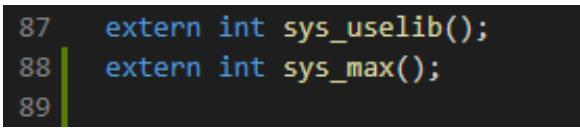


图4-3：声明内核函数的原型


在此文件的最后，向系统调用函数指针表 sys_call_table[]中添加新系统调用函数的函数指针（注意，系统调用号必须与系统调用内核函数指针在系统调用函数表中的数组下标一一对应），如图4-4所示：

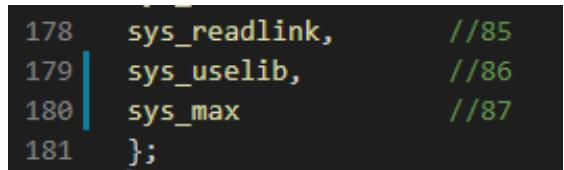


图4-4：在系统调用函数指针表中增加内核函数的指针


4. 在 kernel/sys.c 文件的最后编写代码，实现新系统调用对应的内核函数，如图 4-5:

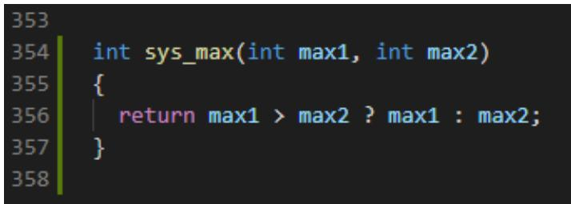


图4-5：系统调用对应的内核函数


5. 生成Linux0.11内核，修改语法错误直到生成成功。接下来需要编写一个Linux0.11应用程序来测试新系统调用是否添加成功。

# 3.3 在Linux 0.11应用程序中测试新的系统调用

1. 按F5启动调试。

2. 待Linux 0.11启动后，使用vi编辑器新建一个main.c文件。编辑main.c文件中的源代码（如图4-6所示）。其中，需要定义__LIBRARY__宏及包含unistd.h头文件，还需要再次定义__NR_max宏，并使用__syscall2宏（在文件include/unistd.h中的第197行定义）对系统调用函数进行定义，当该宏展开时，就会在源代码文件中使用C语言添加max函数的完整实现，并在其中通过中断和系统调用号访问新添加的系统调用。

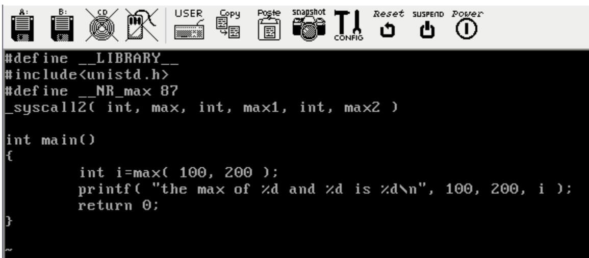


图4-6：编辑main.c文件


3. 使用命令gcc main.c -o main生成可执行文件main。

4. 执行 sync 命令，将文件保存到磁盘。

5. 执行 chmod +x main 命令为 main 文件添加可执行权限。

6. 执行./main命令运行main。如果main能输出正确的结果，则说明新系统调用添加成功。

可以按照下面的步骤查看_syscall12 宏展开后得到的 max 函数：

1. 依次执行下面的命令。其中 gcc 的 -E 选项是将源文件进行预处理，它会将源文件中的头文件以及宏定义都展开。

```batch
gcc -E main.c -o main.i sync  
mcopy main.i b:main.i
```

2. 结束调试后，使用软盘编辑器工具打开 floppyb.img 文件。将其中的 main.i 文件复制到 Windows 的本地文件夹中。

3. 将 main.i 文件拖动到 VSCode 中释放，在文件的最后部分就可以看到_syscal12 宏展开后得到的 max 函数了。可以重点学习一下通过在 C 代码中嵌入 AT&T 汇编，调用 int 0x80 号中断，并使用寄存器传递参数和返回值的过程。

注意，由于 vi 编辑器存在 Bug，如果在 Linux 0.11 中使用 vi 编辑器打开 main.i 文件可能会无法正常显示_syscall2 宏展开后得到的 max 函数。

# 3.4 调试系统调用执行的过程

根据__syscall10、__syscall11、__syscall12、__syscall13这四个宏（在文件include/unistd.h中的第167行定义）可知系统调用执行的过程如下：应用程序通过调用int 0x80中断，进入内核中的系统调用总入口_system_call函数，该函数以存放在EAX寄存器中的系统调用号作为系统调用函数指针表的索引，找到相应的内核函数，并通过EBX、ECX、EDX将参数传递给内核函数，最后通过call指令执行该内核函数并使用EAX寄存器返回结果。

为了调试系统调用执行的过程，需要在系统调用总入口_system_call 函数中添加一个断点。但是，因为Linux操作系统在启动的过程中会多次产生int0x80调，在_system_call处的断点就会被多次命中。为了减少断点的命中次数，需要将此断点设置为一个条件断点。调试的步骤如下：

1. 结束之前的调试过程。

2. 打开 kernel/system_call.s 文件，在标号_system_call 后的第一行汇编代码处（第 102 行）添加一个断点。

3. 在刚刚添加的断点上点击鼠标右键，在弹出的菜单中选择“Edit Breakpoint”，会在编辑器中显

示出用于输入条件表达式的编辑框。在编辑框中设置断点条件 $eax==87 后按回车确认,如图4-7:

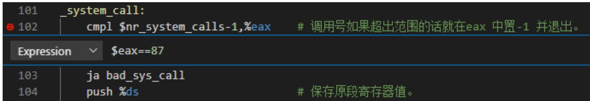


图4-7：设置断点条件


4. 按 F5 启动调试（注意，由于添加了一个条件断点，需要调试器频繁验证条件是否满足，这会导致启动过程明显变慢，请读者耐心等待启动完毕）。

5. 待 Linxu 0.11 启动后输入命令./main 运行应用程序 main，会命中刚刚添加的条件断点。

6. 选择“View”菜单中的“Run”，打开左侧的“运行与调试”窗口。

7. 在“运行与调试”窗口展开CPU寄存器，会发现EAX寄存器中的值为0x57（十进制为87），和max系统调用的调用号一致，说明应用程序正在调用max系统调用函数。查看EBX和ECX寄存器的值，存放的分别是max函数的参数0x64（十进制为100）和0xc8（十进制为200）。

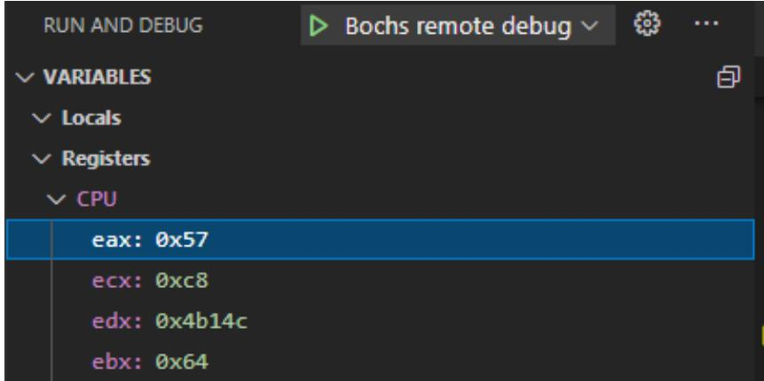


图4-8：查看寄存器的值


8. 按 F10 单步调试，直到黄色箭头指向第 110 行。其中第 103 行进行错误检查，第 104-106 行将各个段寄存器的值压入栈进行现场保护，第 107-109 行将保存在 EBX、ECX 和 EDX 寄存器中的参数压入栈，这与 C 语言参数从右到左压入栈的顺序是一致的。

9. 按 F10 继续单步调试，直到黄色箭头指向第 119 行。该行代码使用 EAX 寄存器存放的系统调用号作为系统调用函数指针表的下标，通过 call 指令调用对应的内核函数。

10. 按 F11 调试进入 kernel/sys.c 文件中的系统调用对应的内核函数，如下图：

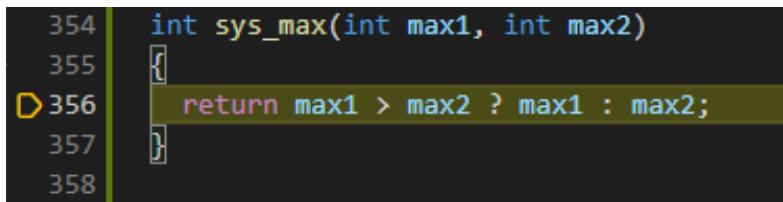


图4-9：进入系统调用对应的内核函数


11. 按 F10 单步调试，直到从内核函数返回到 kernel/system_call.s 文件中的第 120 行。从内核函数返回后，返回值 200 会存放在 EAX 寄存器中，如下图：

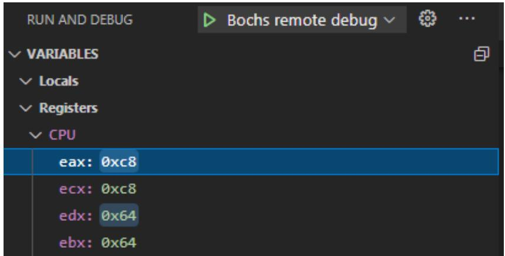


图4-10：EAX寄存器存放返回值200


12. 按 F10 单步调试，直到黄色箭头指向第 168 行。其中，因为后续工作（进程调度、信号处理）会用到 EAX 寄存器，所以 120-121 行会将 EAX 存放的返回值（200）入栈，并把当前任务数据结构地址存入 EAX 寄存器，122-160 行会进行进程调度以及信号的处理工作，161 行-167 行，恢复现场，恢复通用寄存器以及段寄存器，与保护现场时的顺序相反。此时查看监视窗口中的 EAX，EBX 和 ECX 寄存器的值，分别恢复为 200（返回值），100（参数一），200（参数二），如下图：

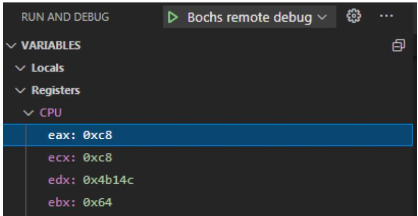


图4-11：出栈操作恢复了EAX，EBX和ECX寄存器的值


13. 按 F5 继续运行，第 168 行的 iret 指令从 0x80 中断返回到 main 程序中。此时打开 Bochs 虚拟机的 Display 窗口，可以看到 main 程序已经执行完毕了。

14. 结束调试。

# 3.5 提交作业

实验结束后先使用 VSCode 左侧的“源代码版本控制窗口”查看文件变更详情，确认无误后再将本地项目提交到平台的个人项目中，方便教师通过平台查看读者提交的作业。

# 四、思考与练习

1. 参考《Linux内核完全注释》第8.5.3.3节的内容，编写一个汇编程序，直接使用系统调用。

2. 在Linux 0.11内核中添加两个系统调用函数Iam和Whoami，函数原型如下：

- int Iam(const char* name); 将字符串 name 的内容保存到内核中，返回值是拷贝的字符数，如果 name 长度大于 32，则返回 -1，并置 errno 为 EINVALID。

- intWhoami(char* name, int size); 将Iam保存到内核中的字符串拷贝到数据缓冲区name中，size为数据缓冲区name的长度，返回值是拷贝的字符数。如果size小于所需空间，则返回-1，并置errno为EINVALID。

编写两个应用程序。其中，Iam 应用程序调用 Iam 函数，并使用命令行中的第一个参数作为 Iam 函数的参数；Whoami 应用程序调用 Whoami 函数，并打印输出获取的字符串。测试效果如下图：


图4-12：测试应用程序的执行结果


# 提示：

1. errno 是一个传统的错误代码返回机制。当一个函数调用出错时，会把错误值存放到全局变量 errno 中，调用者就可以通过判断 errno 来决定如何应对错误，请读者找到 errno 是在哪里定义的。

2. 要在内核中保存字符串数据，需要在内核中定义一个字符数组全局变量。可以把该字符数组和两个系统调用的内核函数定义在 kernel/sys.c 文件中。

3. Iam 和 Whoami 两个系统调用使用了指针参数传递用户地址空间的逻辑地址（字符串的开始地址），若在内核空间直接访问这个地址，访问的仍然是内核空间的数据，而不是用户空间的数据。所以，在 Iam 函数中需要在一个循环中重复调用 get.fs_byte 函数，获取用户空间中的数据；在 Whoami 函数中需要在一个循环中重复调用 put.fs_byte 函数，将内核空间中的数据复制到用户空间（详情请参考 include/asm/segment.h 文件）。

# 实验五 进程的创建

实验性质：验证

建议学时：2学时

任务数：2个

实验难度：★★★☆☆

# 一、实验目的

- 掌握创建子进程和加载执行新程序的方法，理解创建子进程和加载执行程序的不同。

- 调试跟踪fork和execve系统调用函数的执行过程。

# 二、预备知识

程序通常是指一个可执行文件，而进程则是一个正在执行的程序实例。利用分时技术，在Linux操作系统上可以同时运行多个进程。分时技术的基本原理是把CPU的运行时间分成一个个规定长度的时间片，让每个进程在一个时间片内运行。当一个进程的时间片用完时，操作系统就利用调度程序切换到另一个进程去运行。因此，本质上对于具有单个CPU的机器来说，某一时刻只有一个进程在运行，但是由于进程运行的时间片比较短（通常为几十毫秒），所以给用户的感觉是多个进程在同时运行。

对于Linux 0.11内核来讲，系统最多可有64个进程同时存在。除了第一个进程用“手工”建立以外，其余的都是现有进程使用系统调用fork函数创建的新进程。被创建的进程称为子进程，创建者则称为父进程。Linux内核使用进程标识号(PID)来标识每个进程。进程由可执行的指令代码、数据和栈组成。进程中的指令代码和数据分别对应于可执行文件中的代码段和数据段，而栈是在创建进程时由操作系统为其分配的。每个进程只能执行自己的代码和访问自己的数据和栈。

Linux 0.11 操作系统内核通过进程表 task（数组）对进程进行管理，每个进程在进程表中占有一项。这个进程表数组在 kernel/sched.c 文件的第 129 行定义，数组长度是 64。进程表项是一个 task_struct 任务数据结构的指针。任务数据结构（也称为进程控制块 PCB 或进程描述符 PD）定义在

include/linux/sched.h 文件中的第 146 行。其中保存着用于控制和管理进程的所有信息，主要包括进程当前运行的状态、信号、进程号、父进程号、运行时间累计值、正在使用的文件和本任务的局部描述符以及任务状态段等。

详细内容请读者阅读《Linux内核完全注释》第5章第7节的内容。

# 三、实验内容

# 3.1 任务（一）：在Linux0.11应用程序中调用fork函数创建子进程

# 准备实验

使用浏览器登录平台领取本次实验对应的任务，从而在平台上创建个人项目(Linux 0.11 内核项目)，然后使用 VSCode 将个人项目克隆到本地磁盘中并打开。

# 调用 fork 函数创建子进程

在Linux 0.11应用程序中调用fork函数创建子进程，并分析程序运行的结果。步骤如下：

1. 按F5启动调试。

2. 待Linux 0.11启动后，使用vi编辑器新建一个main.c文件，编写如下的代码。其中的getpid函数是一个系统调用函数，返回当前进程的进程号。

```c
define _LIBRARY  
#include <stdio.h>  
#include <unistd.h>
```

```c
int main(int argc, char * argv[])
{
    int pid;
    printf("PID:%d parent process start.\n", getpid());
    pid = fork();
    if (pid != 0)
        {
            printf("PID:%d parent process continue.\n", getpid());
        }
    else
        {
            printf("PID:%d child process start.\n", getpid());
        }
            printf("PID:%d child process exit.\n", getpid());
        return 0;
    }
    printf("PID:%d parent process exit.\n", getpid());
    return 0;
}
```

3. 使用命令 gcc main.c -o app 生成可执行文件 app。

4. 执行 chmod  $+\mathrm{x}$  app命令为app文件添加可执行权限。

5. 执行 sync 命令，将文件保存到硬盘。

6. 使用命令./app运行可执行文件app，分析运行结果。

系统调用函数 fork 在执行时，会在进程表中创建一个与调用此函数的进程（父进程）几乎完全一样的新的进程表项（子进程），子进程与父进程执行同样的代码，但子进程拥有自己的数据空间和环境参数。在 fork 函数的返回位置处，父进程将恢复执行，而子进程也从相同的位置开始执行。在父进程中，fork 返回的值是子进程的进程标识号 PID，而在子进程中 fork 函数返回的值是 0（这正是 fork 的神奇之处，调用一次，返回两次）。所以，通常会在分支语句中使用 fork 函数的返回值作为判断条件，从而使父进程和子进程开始运行不同的代码，而且习惯在子进程分支的最后使用 return 语句退出子进程（不是强制的），而不会让子进程继续运行分支语句后面的代码。

在父进程中可以调用wait函数阻塞父进程，直到子进程退出后才会从这个函数中返回，从而让父进程继续运行。该函数的原型在include/sys/wait.h文件中定义如下：

```cmake
pid_t wait(pid_t * wait_location)
```

按照下面的步骤继续使用vi编辑器修改main.c文件：

1. 在 printf(“PID:%d parent process continue\n”, getpid()); 语句前面添加一行语句: wait(NULL);

2. 重新编译、运行应用程序 app，观察运行结果与之前有何不同。

# 查看父进程与子进程的运行轨迹

在前面的练习中，读者可以通过父进程和子进程在屏幕上打印输出的信息来间接的观察到父进程和子进程运行的情况，接下来，读者可以使用可视化窗口，更加直观、形象的观察到父进程与子进程的运行轨迹。步骤如下：

1. 为了方便观察父进程和子进程的运行轨迹，需要在进程结束的位置添加一个断点。请读者在 kernel/exit.c 文件的第 166 行添加一个断点即可，这里就是一个进程在结束运行后，让调度程序选择其他进程继续运行的代码。

2. 按 F5 启动调试。在 Linux 操作系统启动完毕之前会多次命中刚刚添加的断点，每次命中断点后都按 F5 继续运行即可，直到 Linux 启动完毕。

3. 在Linux的终端输入命令./app后，父进程和子进程在结束时都会命中此断点，所以在第一次命中断点时，可以按F5继续运行，在第二次命中断点时，在VSCode的“View”菜单中选择“Command Palette...”，会在VSCode的顶部中间位置显示命令面板，输入“Lab：New Visualizer View”命令后，VSCode会在其右侧弹出一个窗口让读者查看可视化视图。在右侧可视化视图顶部的编辑框中输入命令“#sched”后按回车（需要等待较长时间完成刷新），就可以查看进程的运行轨迹。注意观察父进程和子进程创建和结束的顺序，如果读者在父进程中调用了wait函数等待子进程结束的话，还可以看到父进程首先创建子进程，然后父进程进入阻塞状态等待子进程结束，在子进程结束后父进程才会被唤醒的过程。

# 调试跟踪fork函数的执行过程

为了调试跟踪在Linux 0.11应用程序中调用fork函数时的执行过程（在Linux 0.11内核中当然也会调用fork函数，但是为了得到更好的实验效果，这里重点研究在应用程序中调用fork函数的情况），需要在内核中添加一个条件断点，从而确保只有在一个指定的应用程序中调用fork函数时，此断点才会被命中，步骤如下：

1. 在 VSCode 中删除所有断点，然后按 F5 启动调试。在 Linux 0.11 的终端输入下面的命令，查看可执行文件 app 的信息，将 app 文件的大小记录下来，在后面添加条件断点时会用到此值。ls -l app

2. 结束调试，关闭Bochs虚拟机。

3. 使用 VSCode 打开 kernel/system_call.s 文件，在第 102 行添加一个断点。

4. 在刚刚添加的断点上点击鼠标右键,在弹出的菜单中选择“Edit Breakpoint”,会在编辑器中显示出用于输入条件表达式的编辑框。在编辑框中设置断点条件为下面的表达式后按回车确认:$eax==2 && current!=0 && current->executable->i_size==文件大小

“文件大小”就是之前记录的应用程序可执行文件app的大小，需要读者根据实际的文件大小进行替换。这样就只有在执行app中的fork函数时，才会命中此条件断点，也就是说只有当条件断点中的布尔表达式的值为true时，此断点才会被命中。“$eax==2”中的2是fork函数的系统调用号。current是一个全局变量（在kernel/sched.c文件的第126行定义），总是指向当前正在运行进程的进程控制块。executable是进程控制块中保存的用于创建此进程的可执行文件的i节点，其中保存了可执行文件的一些重要信息，例如i_size就是文件的大小，所以通过指定文件大小，就可以准确指定一个可执行文件。注意，如果启动调试后，条件断点变成一个空心的圆环，说明读者为条件断点编写的布尔表达式有语法错误，只需将表达式语法修改正确即可。

5. 按 F5 启动调试（注意，由于添加了一个条件断点，调试器需要频繁验证条件是否满足，这会导致启动过程明显变慢，请读者耐心等待启动完毕）。

6．在Linux0.11的终端输入命令app，运行app应用程序，即可命中刚刚添加的条件断点。

此时，由于在app应用程序中调用了fork函数，所以就进入了int 0x80的中断处理程序并命中了断点。接下来会调用fork系统调用的内核函数，继续按照下面的步骤调试：

1. 在“WATCH”窗口添加last pid和current->pid，查看它们的值。全局变量last pid（在文件kernel/fork.c的第30行定义）记录了最新的进程号。current->pid的值是当前正在运行的进程的进程号，也就是app应用程序的进程号。

2. 在“WATCH”窗口添加全局变量 current 并展开它的值，可以查看当前进程的信息。其中，“state=0”表示当前进程（即使用可执行文件 app 创建的进程）正处于运行态；“counter=13”表示其剩余时间片的大小；“priority=15”表示其优先级；“father=4”表示其父进程的进程号。如图 5-1 所示。

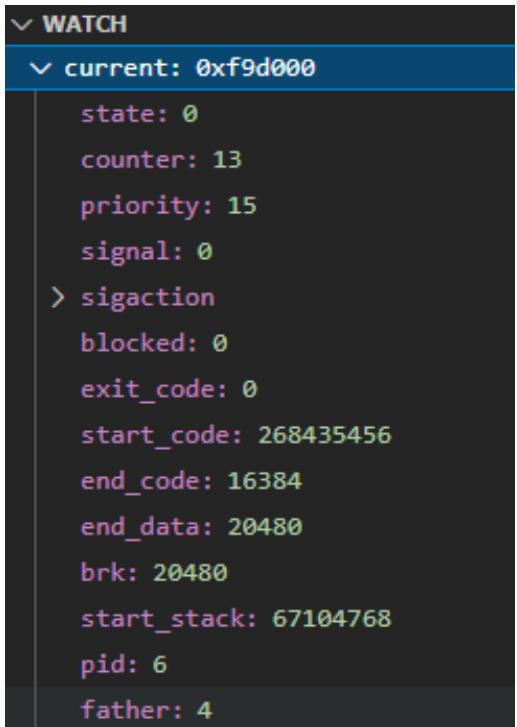


图5-1：查看全局变量current


注意，current 是一个结构体的指针，所以在其右侧显示了它所指向的地址。从 C 语言的角度理解，指针的值就是一个地址，只有在指针变量的前面添加了 * 后，才能访问地址所指向的内存，也就是结构体的各个域。VSCode 为了让用户有更好的体验，在这里进行了优化，当在“WATCH”窗口中添加一个指针变量时，VSCode 会尝试根据其指针类型访问其指向的内存，从而允许读者展开此变量。读者也可以尝试在“WATCH”窗口中添加 *current，可以得到同样的效果。

3. 在“WATCH”窗口添加全局变量task并展开它的值，可以查看进程表中的所有进程的信息，如图5-2所示。其中，下标为4的那一项存储的地址，与图5-1中current指针所指向的地址是一致的。也就是说，app应用程序进程和其它进程一样，都在task中进行了管理，但是由于该进程现在正在运行，所以让current指向了它的进程控制块。注意，task中的元素是进程控制块的指针，所以在每一个元素的右侧显示了它所指向的地址，同样适用于上面的注意事项。

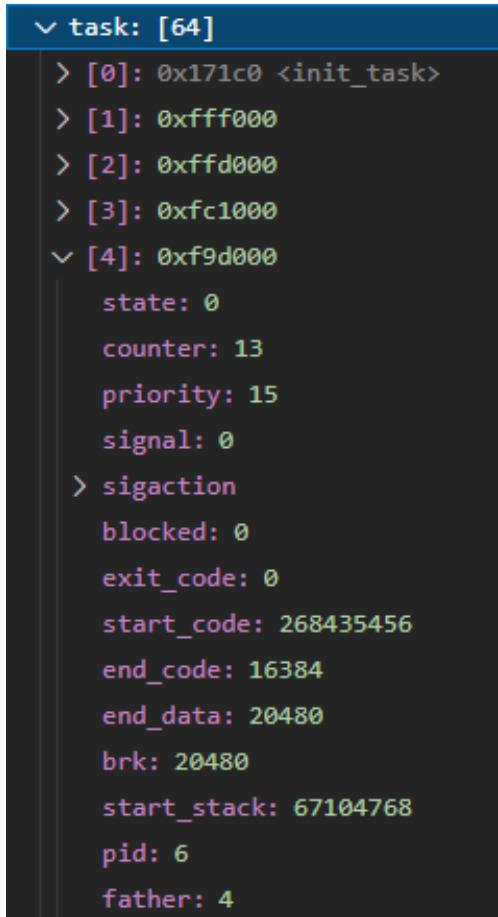


图5-2：查看全局变量task


4. 在 VSCode 的 “View” 菜单中选择 “Command Palette...”, 会在 VSCode 的顶部中间位置显示命令面板, 输入 “Lab: New Visualizer View” 命令后, VSCode 会在其右侧弹出一个窗口让读者查看可视化视图。在右侧可视化视图顶部的编辑框中输入命令 “#task” 后按回车, 就可以查看进程列表了, 如图 5-3 所示。其中背景色为绿色并且使用 current 游标指向的进程是当前进程, 其 state 字段的值为 0 表示当前进程 (即使用可执行文件 app 创建的进程) 正处于运行态; counter 的值为 11 表示其剩余时间片的大小; priority 的值为 15 表示其优先级; father 的值为 4 表示其父进程的进程号。读者也可以从图中直观的掌握其他进程的重要信息。

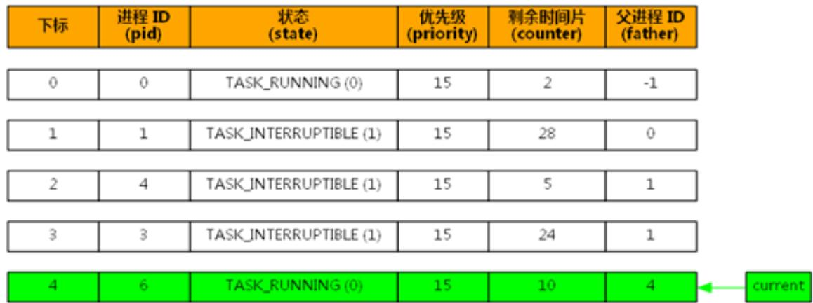


图5-3：进程列表


5. 按 F10 单步调试至第 119 行，再按 F11 进入 fork 系统调用的内核函数，可以看到其内核函数仍然是一个汇编函数。

6. 按F10单步调试至第272行。此时，第271行的find_empty_process函数（在文件kernel/fork.c的第175行定义）已经执行完毕，此函数为新进程取得了一个不重复的进程号，并在task数组中找到了一个未被使用的任务数组项，并返回其索引(在EAX寄存器中返回)。查看“WATCH”窗口，可看到last pid的值已经发生了变化，该值后面会作为新建的子进程的进程号。

7. 按 F10 单步调试至第 279 行，然后按 F11 进入 copy_process 函数。读者可以注意到，在第 278 行将 EAX 寄存器的值作为最后一个参数压入栈，根据 C 语言的函数调用约定，这也就意味着 copy_process 函数的第一个参数 nr 为子进程在任务数组 task 中的下标。

copy_process函数（在文件kernel/fork.c的第89行定义）是fork过程中调用的一个重要函数，该函数主要为新建的子进程从内存中申请一个进程控制块，并完成初始化工作。接下来，请读者按照下面的步骤继续调试copy_process函数：

1. 首先，读者需要注意到，第98行代码会从内核存储空间中申请一个空闲的物理页（大小为4KB），并返回此物理页的起始物理地址。然后，在第101行将此物理页的起始地址赋值给一个未被使用的任务数组task中的一项（由第一个参数作为数组下标），从而将此物理页作为新创建进程的进程控制块（显然，一个进程控制块的大小不会超过4KB，所以在此物理页的后部会有一些空间被浪费掉，但是申请整页内存作为进程控制块会让程序比较简单，运行的速度也更快）。另外需要读者注意的是，这里将物理地址直接作为逻辑地址使用了，这是由于Linux 0.11操作系统在管理内存时，将内核存储空间使用的所有物理页的物理地址都映射到了同样的逻辑地址，这样就方便进行管理，在使用时也很方便。关于内存管理的内容读者会在后面的实验中进行更加深入的研究，在这里只需要按照实验指导中的步骤观察到这种现象即可。

2. 按 F10 单步执行第 98 行的代码，将鼠标移动到第 98 行代码处的变量 p 上，可以看到此时 p 指针的值就是新分配的物理页的基址。

3. 按 F10 单步执行直到黄色箭头指向第 103 行。第 101 行将新创建的子进程控制块的指针放入了任务数组中，数组索引由第一个参数指定。此时在“WATCH”窗口中，可以看到 task 中下标为 5（nr 的值为 5）的进程就是新建的子进程，展开后可以查看子进程控制块中各个成员的值，可以看到新建的子进程控制块中各个成员的值都为 0，这是因为之前为进程控制块分配的物理页的内容都是 0 造成的（Linux 0.11 会将空闲物理页的内容清零）。

4. 按 F10 单步执行第 103 行的代码，黄色箭头指向第 104 行。第 103 行的代码非常关键，此行代码将 current 指向的父进程控制块中的内容完全复制到了 p 指向的子进程控制块中，也就是子进程完全继承了父进程的各种资源。此时在 “WATCH” 窗口中，可以分别查看父进程 task[4] 和子进程 task[5] 各个成员的值，可以发现它们的值是完全相同的。这就可以解释很多现象，例如子进程和父进程的优先级相同，使用相同的 tty 终端，打开了相同的文件等。

5. 由于子进程控制块除了从父进程控制块继承资源之外，还需要设置自己特有的资源，所以，第104行设置子进程为“不可中断等待状态”；第105行设置子进程的进程号；第106行设置子进程的父进程号；第125行将子进程EAX寄存器的值设置为0，这也就是fork函数在子进程中返回0的原因。随后设置子进程控制块中的其他成员。

6. 第146行代码调用copy_mem函数为父进程的内存空间创建了一个副本，该副本作为子进程的内存空间。这样，子进程在开始运行时，就拥有了和父进程完全相同的指令、数据和栈，当然，在子进程运行的过程中，子进程对这些内存的修改就不会影响到父进程了，同样的，父进程从fork函数返回后对这些内存的修改也不会影响到子进程。

7. 第164和第165行代码为子进程在全局描述符表中设置TSS和LDT描述符项，其作用会在后续的实验中进行讨论。

8. 在第171行点击鼠标右键，在弹出的菜单中选择“Run to Cursor”，会运行到第171行后中断。此时，子进程已经进入了就绪态，可以开始运行了。

接下来，读者可以按照下面的步骤查看从copy_process函数返回时的执行情况：

1. 按 F10 单步调试，直到从 copy_process 函数返回到 kernel/system_call.s 文件中的第 280 行。copy_process 函数的返回值是子进程的进程号，会被放入 EAX 寄存器中，也就是父进程从 fork 函数返回时得到的返回值。

2. 按F10单步调试，直到从汇编函数返回到kernel/system_call.s文件中的第120行。

3. 继续按 F10 单步调试，直到第 133 行。可以看到在从 fork 系统调用返回之前，并没有执行进程调度 reschedule 函数，所以父进程会继续运行。

4. 按 F5 继续调试，在 Bochs 的 Display 窗口中可以看到 app 可执行文件运行结束。

5. 结束调试，关闭Bochs虚拟机。

至此，读者已经在本练习的引导下调试跟踪了fork系统调用函数执行的完整过程。由于此练习涉及的内容较多，调试步骤也比较多，建议读者在时间允许的情况下，多调试几次，一边调试一边阅读代码和注释，加深理解。

# 提交作业

读者首先需要将Linux 0.11硬盘中的main.c文件通过软盘B复制到Linux 0.11内核项目的根目录中。然后使用VSCode左侧的“源代码版本控制窗口”查看文件变更详情，确认无误后再将本地项目提交到平台的个人项目中，方便教师通过平台查看读者提交的作业。

# 3.2 任务（二）：调用 execve 函数加载执行一个新程序

使用fork系统调用函数可以为父进程创建一个子进程，但是子进程和父进程执行的是同一个程序。如果需要让父进程加载执行一个新程序，可以使用execve系统调用函数。

int execve(char* file, char** argv, char** envp)函数用来加载执行一个新程序。参数file是需要被加载的程序文件名，参数argv是传递给新程序的命令行参数指针数组，参数envp是传递给新程序的环境变量指针数组。

# 准备实验

使用浏览器登录平台领取本次实验对应的任务，从而在平台上创建个人项目(Linux 0.11 内核项目)，然后使用 VSCode 将个人项目克隆到本地磁盘中并打开。

# 调用 execve 函数加载执行一个新程序

首先编写一个供execve函数加载的应用程序：

1. 按F5启动调试。

2. 待Linux 0.11启动后，使用vi编辑器新建一个new.c文件，编写如下的代码。

```txt
define _LIBRARY  
#include <stdio.h>  
#include <unistd.h>  
int main(int argc, char *argv[])  
{ printf("PID:%d new process.\n", getpid()); return 0; }
```

3. 使用命令 gcc new.c -o new 生成可执行文件 new。

4. 执行 chmod  $+\mathrm{x}$  new命令为new文件添加可执行权限。

5. 执行 sync 命令，将文件保存到硬盘。

6. 使用命令./new运行可执行文件new，确保其可以正常运行。

接下来编写调用 execve 函数的应用程序：

1. 使用 vi 编辑器新建一个 old.c 文件，编写如下的代码。

```txt
define _LIBRARY_   
#include<stdio.h>   
#include<unistd.h>   
int main(int argc, char \*argv[])   
{ printf("PID:%d old process start.\n",getpid()); execve("new",NULL,NULL); printf("PID:%d old process exit.\n",getpid()); return 0;   
}
```

2. 使用命令 gcc old.c -o old 生成可执行文件 old。

3. 执行 chmod  $+\mathrm{x}$  old命令为old文件添加可执行权限。

4. 执行 sync 命令，将文件保存到硬盘。

5. 使用命令./old运行可执行文件old，注意观察输出的PID的值，以及输出的内容与读者期望的是否一致，并尝试说明原因。

系统调用 execve 会清理掉当前进程的内存空间，并释放对应的物理页，然后为新加载的可执行文件中的指令和数据重新申请内存，并配置到当前进程的进程控制块中，还会将新加载程序的入口点设置为执行的起始位置。此时当前进程的代码和数据将完全被新程序替换掉，并在该进程中开始执行新程序的代码。所以在 old 程序中，调用 execve 加载 new 程序后面的代码就没有机会执行了，而是在当前进程中开始执行 new 程序了，并且 PID 保持不变。

# 调试跟踪 execve 函数的执行过程

为了调试跟踪 execve 函数的执行过程，同样需要在内核源代码中添加一个条件断点，步骤如下：

1. 在Linux 0.11的终端输入下面的命令，查看可执行文件old的信息，将old文件的大小记录下来，在后面添加条件断点时会用到此值。

```txt
ls -1 old
```

2. 结束调试，关闭Bochs虚拟机。

3. 使用 VSCode 打开 kernel/system_call.s 文件，在第 102 行添加一个条件断点，条件为：

```txt
$eax=11 && current!=0 && current->executable->i_size==文件大小
```

“$eax==11”中的11是execve函数的系统调用号。“文件大小”是之前记录的应用程序可执行文件old的大小。

4. 按 F5 启动调试（注意，由于添加了一个条件断点，需要调试器频繁验证条件是否满足，这会导致启动过程明显变慢，请读者耐心等待启动完毕）。

5. 在Linux 0.11的终端输入命令./old，运行old应用程序，即可命中刚刚添加的条件断点。

此时，由于在应用程序 old 中调用了 execve 函数，所以就进入了 int 0x80 的中断处理程序并命中了断点。接下来会调用 execve 系统调用的内核函数，继续按照下面的步骤调试：

1. 按 F10 单步调试到第 119 行，按 F11 进入到 execve 系统调用对应的汇编函数 sys_execve，黄色箭头指向第 260 行。

2. 按 F10 单步调试到底 262 行，按 F11 进入到 do_execute 函数中，该函数完成加载执行新程序的主要功能。

3. 在第 314 行点击鼠标右键，在弹出的菜单中选择“Run to Cursor”，会运行到第 314 行后中断。第 303 到第 304 行初始化参数和环境变量空间的页面指针数组。第 306 行取得可执行文件对应的 i 节点号。第 309 到第 310 行计算参数个数和环境变量个数。

4. 在第 472 行点击鼠标右键，在弹出的菜单中选择“Run to Cursor”，会运行到第 472 行后中断。该过程主要完成对文件合法性的检查以及参数和环境变量的复制。

5. 在第 494 行点击鼠标右键，在弹出的菜单中选择“Run to Cursor”，会运行到第 494 行后中断。当前进程的代码段和数据段内存被释放了，这是由第 485 和 486 行代码完成的。第 472 到第 474 行释放进程原始的可执行文件的 i 节点，并使其指向新程序的可执行文件的 i 节点，接下来是对进程控制块信号句柄和协处理器的处理。

6. 按 F10 单步调试到第 508 行 第 494 到第 496 行创建参数和环境变量指针表，并返回该堆栈指针。第 499 行设置代码段、数据段以及堆栈段信息。第 503 到第 509 行设置进程栈开始字段所在页面以及用户 ID 和组 ID。

7. 在第 515 行点击鼠标右键，在弹出的菜单中选择“Run to Cursor”，会运行到第 515 行后中断。第 508 到第 509 行初始化 bss 段数据。第 513 到第 514 行将栈上的代码指针替换为新程序的入口点地址，并将栈指针替换为新程序的栈指针。

8. 按F10单步调试，do_execute函数返回到sys_execute函数。

9. 按 F5 继续调试，在 Bochs 的 Display 窗口中可以看到 old 可执行文件运行结束。

10. 结束调试，关闭Bochs虚拟机。

体会 execve 函数的执行过程，该过程中并没有申请新的进程控制块，同时 PID 的值也没有发生变化，只是对当前进程的控制块进行了相应的修改，从而加载执行了另一个程序。

# 提交作业

读者首先需要将Linux 0.11硬盘中的new.c文件和old.c文件通过软盘B复制到Linux 0.11内核项目的根目录中。然后使用VSCode左侧的“源代码版本控制窗口”查看文件变更详情，确认无误后再将本地项目提交到平台的个人项目中，方便教师通过平台查看读者提交的作业。

# 3.3 fork 与 execve 的区别与联系

系统调用fork会为子进程重新申请一个进程控制块(task_struct)，并拷贝父进程的进程控制块信息到子进程的进程控制块中，再对子进程的控制块做简单的修改，使子进程与父进程执行同样的程序。系系统调用execve并没有申请新的进程控制块，而是直接修改当前进程的进程控制块，并开始执行一个新程序。

在为Linux开发应用程序时，往往会同时使用fork和execve函数。一个程序在使用fork函数创建了一个子进程时，通常会在该子进程中调用execve函数加载执行另一个新程序，例如：

```javascript
if( fork(!=0)  
{ /\* parent process \*/ } else { /\* child process \*/ execve(\*); }
```

# 四、思考与练习

1. 模仿 3.1 中 Linux 0.11 应用程序的源代码，使用 for 语句编写一个循环，使父进程能够循环创建 10 个子进程，每个子进程在输出自己的 pid 后退出，父进程等待所有子进程结束后再退出。

2. 结合3.3中的内容编写一个Linux应用程序，在main函数中使用fork函数创建一个子进程，在子进程中使用execve函数加载执行另外一个程序的可执行文件，并且让父进程在子进程退出后再结束运行。

# 实验六 进程的状态与进程调度

实验性质：验证、设计

建议学时：2学时

任务数：2个

实验难度：★★★★☆

# 一、实验目的

- 调试进程在各种状态间的转换过程，熟悉进程的状态和转换。

- 通过对进程运行轨迹的跟踪来形象化进程的状态和调度。

- 掌握Linux下的多进程编程技术。

# 二、预备知识

# 进程的状态

一个进程在其整个生命周期内，不同阶段可能具有不同的进程状态（在 include/linux/sched.h 文件的第 20 行定义了所有状态）。一个进程的状态由其进程控制块中的 state 字段指定。

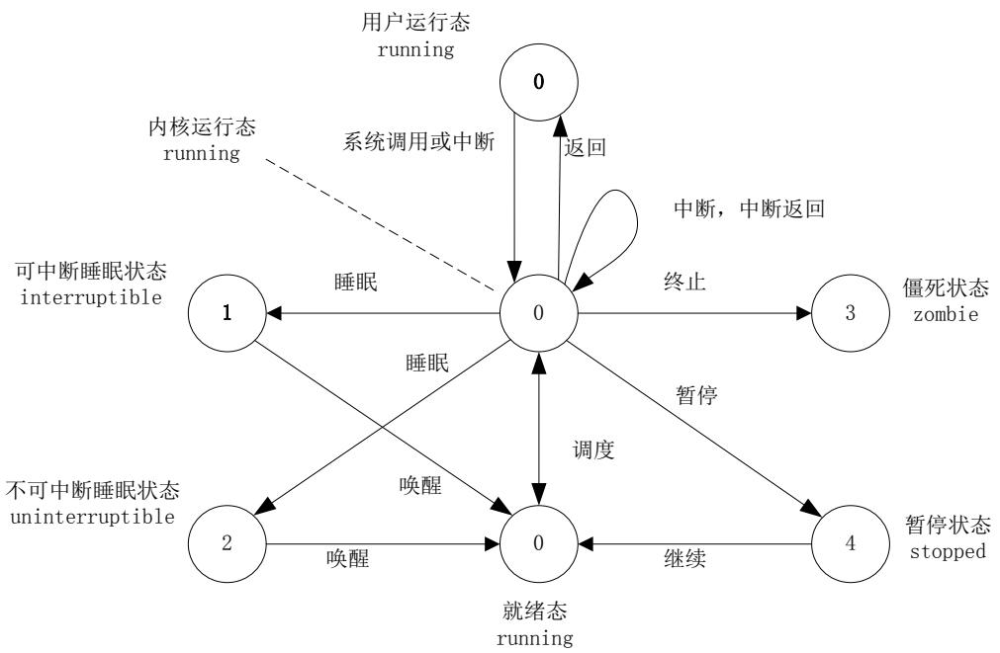


图6-1：进程状态的转换


- 运行状态（TASK_RUNNING）。当进程正在被CPU执行时，或已经准备就绪可由调度程序调度时，则称该进程处于运行状态。若此时没有被CPU执行，则称其处于就绪运行状态。进程可以在内核态运行，也可以在用户态运行。当一个进程在内核代码中运行时，称其处于内核运行态，或简称内核态；当一个进程正在执行用户自己的代码时（用户编写的应用程序代码），称其处于用户运行态，或简称用户态。当进程所需的系统资源已经可用时，进程就会被唤醒，从而进入就绪运行状态。这些状态在内核中表示方法相同，都被称为处于TASK_RUNNING状态。例如，当一个新进程刚刚被创建后就处于就绪运行态。

- 可中断睡眠状态（TASK_INTERRUPTIBLE）。当进程处于可中断睡眠状态时，系统不会调度该进程执行。当系统产生一个中断或者释放了该进程正在等待的资源，或者该进程收到一个信号时，该进程都会被唤醒，从而转换到就绪运行态。

- 不可中断睡眠状态（TASK_UNINTERRUPTIBLE）。除了不会因为收到信号而被唤醒外，该状态与可中断睡眠状态类似。但处于该状态的进程只有被 wake_up 函数明确唤醒时才能转换到就绪运行状态。该状态常在进程需要不受干扰地等待或者所等待事件很快就会发生时使用。

- 暂停状态（TASK_STOPPED）。当进程收到信号SIGSTOP、SIGTSTP、SIGTTIN或SIGTTOU时就会进入暂停状态。可向处于暂停状态的进程发送SIGCONT信号，让其转换到就绪运行状态。进程在调试期间接收到任何信号均会进入该状态。在Linux 0.11中，还未实现对该状态的转换处理，处于该状态的进程将被作为进程终止来处理。

- 僵死状态（TASK_ZOMBIE）。当子进程已停止运行，但其父进程还没有调用 wait 函数询问其状态时，则称该进程处于僵死状态。因为，父进程需要获取子进程停止运行的信息（例如获取子进程的退出码），所以，此时子进程的进程控制块还需要保留。一旦父进程通过调用 wait 函数取得了子进程的信息，则处于该状态的子进程的进程控制块就会被释放掉。

# 调度程序

当一个进程的时间片用完时，操作系统会使用调度程序强制切换到其他的进程去执行。另外，如果进程在内核态执行时需要等待系统的某个资源，此时该进程就会调用sleep_on或interruptible_sleep_on函数自愿放弃CPU的使用权，从而让调度程序去执行其他进程，此进程则进入睡眠状态

（TASK_UNINTERRUPTIBLE或TASK_INTERRUPTIBLE)。只有当进程从“内核运行态”转换到“睡眠状态”时，内核才会进行进程切换操作。在内核态下运行的进程不能被其他进程抢占，而且一个进程不能改变另一个进程的状态。为了避免进程切换时造成内核数据错误，内核在执行临界区代码时会禁止一切中断。

内核中的调度程序 schedule 函数（在文件 kernel/sched.c 中的第 190 行定义）用于从当前处于就绪状态的进程中选择出下一个要运行的进程。这种选择运行机制是多任务操作系统的基础。调度程序可以被看作一个在所有处于运行状态的进程之间分配 CPU 运行时间的管理器。为了能有效地使用系统资源，又能使各个当前处于运行状态的进程有较快的响应时间，就需采用一定的调度策略，在 Linux 0.11 中采用了基于优先级排队的调度策略。

# 时钟滴答 jiffies

时钟滴答 jiffies 是一个全局变量（在文件 kernel/sched.c 的第 122 行定义），它记录了 Linux 0.11 操作系统从开机到当前时刻的 8253 定时计数器发生的中断次数。在 sched_init 函数中（在 kernel/sched.c 文件的第 614 行定义），定时计数器的中断处理程序被设置为 timer_interrupt 函数，在此函数响应定时计数器中断的过程中，每次都会将 jiffies 的值增加 1（在文件 kernel/system_call.s 的第 243 行）。

此外，在 sched_init 函数中有如下代码（在 kernel/sched.c 文件的第 643 行：

```c
outb_p(0x36, 0x43);  
outb_p(LATCH & 0xff, 0x40);  
outb(LATCH >> 8, 0x40);
```

这段代码用来初始化8253定时计数器，设置中断时间间隔为LATCH，而LATCH是一个宏定义，在文件kernel/sched.c的第107行定义如下：

```txt
define LATCH (1193180/HZ)
```

宏 HZ 在文件 include/linux/sched.h 的第 5 行定义如下:

```txt
define HZ 100
```

同时，由于8253定时计数器输入时钟频率为1.193180MHz（即1193180/每秒），所以，

LATCH=1193180/100 就是将定时计数器设置为每跳 11931.80 下产生一次时钟中断，即每 1/100 秒（10 毫秒）产生一次时钟中断。所以，jiffies 实际上记录了从开机以来共经历了多少个 10 毫秒。

关于8253定时计数器以及X86保护模式下中断处理机制的更多内容，请读者自行回忆在《微机原理》相关课程中学习的内容。关于Linux0.11内核中进程状态和进程调度的相关内容请读者阅读《Linux内核完全注释》第5章第7节。

# 三、实验内容

使用浏览器登录平台领取本次实验对应的两个任务，从而在平台上创建两个个人项目，然后使用 VSCode 将这两个个人项目分别克隆到本地磁盘中并打开。其中一个任务需要读者修改 Linux 0.11 内核，另一个任务需要读者修改 Linux 0.11 应用程序。

# 3.1 在Linux 0.11应用程序中调用fork函数创建多个子进程

# 编写一个可以创建多个子进程的Linux0.11应用程序

请读者按照下面的步骤使用 fork 函数编写一个可以创建多个子进程的 Linux 0.11 应用程序，一方面可以学习 Linux 的多进程编程技术，另一方面，通过观察多个进程的运行过程，可以对进程的调度过程有一个初步认识。

1. 使用 VSCode 打开之前克隆到本地的 Linux 0.11 应用程序项目。

2. 打开linuxapp.c文件main函数，让父进程新建三个子进程，并分别输出子进程id及其父进程id。代码如下：

```txt
int main(int argc, char *argv[])  
{  
    if (0 == fork())  
    {  
        printf("child process pid=%d ppid=%d line=%d\n", getpid(), getppid(), _LINE());  
    }  
    else if (0 == fork())  
    {  
        printf("child process pid=%d ppid=%d line=%d\n", getpid(), getppid(), _LINE());  
    }  
    else if (0 == fork())  
    {  
        printf("child process pid=%d ppid=%d line=%d\n", getpid(), getppid(), _LINE());  
    }  
    else  
    {  
        wait(NULL);  
    }  
    return 0;
```

其中，getppid函数可以在子进程中获取父进程的id。“__LINE__”是GCC编译器提供的一个预定义宏，它的值是其在源代码文件中的行号。

3. 不能在 VSCode 中按 F5 启动调试 Linux 0.11 应用程序。只能在 VSCode 的 “Terminal” 菜单中选择 “Run Build Task...”, 会在 VSCode 的顶部中间位置弹出一个可以执行的 Task 列表, 选择其中的 “Bochs 运行 (不调试)”。

4. 待Linux 0.11启动完毕后，将生成的可执行文件从软盘B拷贝到硬盘，命令如下：

mcopy b:linuxapp.exe app

5. 为app文件添加可执行权限，命令如下：

chmod  $^+$  x app

6. 执行“sync”命令确保app文件写入硬盘。

7. 使用命令./app运行可执行文件app，观察各个进程开始执行的顺序和结束执行的顺序，理解进程在其生命周期中状态的转换过程和进程调度过程。

8. 结束调试，关闭Bochs虚拟机。

# 查看多个子进程的运行轨迹

在前面的练习中，读者可以通过父进程和子进程在屏幕上打印输出的信息来间接的判断出父进程和子进程运行的轨迹，但是并不直观，得到的信息也不全面。接下来，读者可以使用数据可视化窗口，更加直观、形象的观察到父进程与子进程的运行轨迹。步骤如下：

1. 使用 VSCode 的 “File” 菜单中的 “Open Folder” 打开之前克隆到本地的 Linux 0.11 内核项目文件夹。

2. 在 VSCode 的 “Terminal” 菜单中选择 “Run Build Task...”, 会在 VSCode 的顶部中间位置弹出一个可以执行的 Task 列表, 选择其中的 “生成项目”。

3. 待Linux 0.11内核项目生成成功后，使用Windows资源管理器分别打开之前克隆到本地的Linux 0.11应用程序项目和Linux 0.11内核项目所在的文件夹。

4. 用Linux0.11应用程序项目文件夹中的硬盘镜像文件harddisk.img覆盖Linux0.11内核项目文件夹中的harddisk.img文件，这样就可以在Linux0.11内核项目的硬盘中使用之前生成的app文件了。

5. 使用 VSCode 的 “File” 菜单中的 “Open Folder” 打开之前克隆到本地的 Linux 0.11 内核项目文件夹。

6. 为了方便观察 app 应用程序中的父进程和子进程的运行轨迹，需要在父进程结束的位置添加一个条件断点。请读者在 kernel/exit.c 文件的第 166 行（进程结束后触发进程调度的位置）添加一个条件断点，条件为“current->pid == 6”。

7. 按 F5 启动调试。输入命令./app 后，会命中刚刚添加的条件断点。

8. 在 VSCode 的 “View” 菜单中选择 “Command Palette...”, 会在 VSCode 的顶部中间位置显示命令面板, 输入 “Lab: New Visualizer View” 命令后, VSCode 会在其右侧弹出一个窗口让读者查看可视化视图。在右侧可视化视图顶部的编辑框中输入命令 “#sched” 后按回车 (需要等待较长时间完成刷新), 就可以查看进程运行的轨迹了, 如图 6-2 所示。

在进程运行轨迹图示的最左侧是 jiffies，表示每一次进程状态转换发生的时刻。在右侧的函数和行号记录了导致进程状态发生转换的源代码位置，读者根据这两列的信息可以发现，每当进程状态发生转换时，在源代码中是通过调用 RECORD_TASK_STATE 宏函数记录下来的，读者总是可以在调用 RECORD_TASK_STATE 宏函数的代码行前面不远处找到修改进程控制块中进程状态的代码。

请读者结合图6-2和对应的源代码完成下面的练习：

1）阅读源代码，理解当进程状态发生转换时，宏函数RECORD_TASK_STATE是如何将其记录到线性表task_trans_table中的。

2) 为了便于读者理解，并且方便绘制进程运行轨迹的图示，在记录进程的状态转换时，并没有完全按照Linux中定义的进程状态进行，而是定义了一组新的进程状态（在include/linux/sched.h文件的第51行定义）。请读者自行梳理这一组新状态与Linux中定义的状态之间的对应关系。

3）说明在同一个时刻最多有几个进程正在运行，并说明原因。

4) 结合图 6-2，尝试说明在 Linux 的终端进程（pid 为 4）创建了应用程序进程（pid 为 6）之后，进程 0、4、6、7、8、9 的调度过程。


图6-2：进程的运行轨迹


# 3.2自行编写代码记录进程的运行轨迹

跟踪进程的运行轨迹，本质上就是跟踪并记录进程在其生命周期中的状态转换过程和调度过程。进程在生命周期中状态的转换是由操作系统的调度程序实现的。所以要实现对进程运行轨迹的跟踪，不仅要对进程在其生命周期的各个状态有一个全面的了解，而且还要对进程的调度有一个透彻的理解。

读者通过前面的练习应该已经对进程的调度过程有了一个初步的认识，然而“知而不行，非真知也”，下面的练习需要读者自行编写代码将进程运行的轨迹记录在一个日志文件中，然后将日志文件中的结果与图6-2进行比对，确保正确无误。

读者一次就能编写出正确的代码，记录下正确的轨迹，还是有一定难度的。如果出现了错误也没关系，读者只需仔细研究一下调用宏函数RECORD_TASK_STATE的各处代码，应该能够解决遇到的各种问题。

在开始记录进程的运行轨迹之前，需要先在Linux 0.11内核中添加一个写日志文件的功能，然后使用此功能将进程状态转换的日志信息写入一个文本文件。

# 在系统初始化时打开日志文件process.log

为了记录操作系统从启动到关机过程中所有进程的运行轨迹，需要在硬盘上维护一个日志文件/var/process.log，然后添加一个写日志文件的功能，将进程状态转换的日志信息写入该日志文件。为了能尽早开始记录日志，应当在内核初始化时就打开process.log文件。请读者按照下面的步骤编写源代码，完成这部分内容。

首先，使用 VSCode 打开之前克隆到本地的 Linux 0.11 内核项目并定位到内核的入口函数，即 init/main.c 文件中的 start 函数，其中从第 181 行开始的一段代码是：

```c
......   
move_to_user_mode();   
if(!fork()）{ /\*we count on this going ok\*/ init();
```


这段代码是在进程0中运行的，其作用是先切换到用户模式，然后第一次调用fork函数创建子进程1，子进程1接着调用了本文件中的init函数继续进行操作系统的初始化工作。

在init函数中从第227行开始的一段代码是：

```matlab
......   
setup((void \*)&drive_info);   
(void) open("/dev/tty0", 0_RDWR, 0);   
(void) dup(0);   
(void) dup(0);
```

这段代码在进程1中建立了文件描述符0、1和2，它们分别是stdin、stdout和stderr，即标准输入、标准输出和标准错误。读者需要在这里添加一行代码把process.log文件关联到文件描述符3。修改后的init函数如下：

```txt
setup((void *) &drive_info);  
(void) open("/dev/tty0", 0_RDWR, 0);  
(void) dup(0);  
(void) dup(0);  
(void) open("/var/process.log", 0_CREAT | 0_TRUNC | 0_WRONLY, 0666);
```

添加了一行调用 open 函数打开 process.log 文件的代码。其中，第二个参数的含义是建立只写文件，并且如果文件已存在则清空已有内容。第三个参数设置文件权限为所有人可读可写。

这样，文件描述符0、1、2和3就在进程1中建立了，并在进程1的进程控制块中进行了记录。根据在前面实验中学习的fork函数的原理，fork函数通过将父进程的进程控制块完整复制给子进程，从而允许子进程从父进程那里继承所有的资源，当然也包括父进程拥有的文件描述符（即父进程打开的文件）。所以，由进程1创建的子进程就会从进程1中继承这四个文件描述符，而且，由于此后所有的进程都是进程1的子进程（包括由应用程序创建的进程），当然也都会继承这四个文件描述符了。

# 编写fprintk函数用于向process.log文件写入数据

文件process.log将会被用来记录进程运行的轨迹，但是，所有进程的状态转换工作都是在内核状态下进行的，此时write系统调用函数失效（其原理等同于不能在内核状态下调用printf函数，而只能调用printk函数。这就需要在Linux0.11的内核中编写一个fprintf函数用于向process.log文件写入数据。编写fprintf函数的难度较大，所以这里直接给出源代码，主要是参考了printk函数和sys_write函数而写成的。需要注意在else分支中开始部分的判断条件，首先判断进程控制块表task中下标为4的项是有效的，这样就避免了记录操作系统初始化进程的运行轨迹，缩小了日志文件的大小；第二个条件语句是从进程1中获取到process.log文件的描述符，并确保其有效。

```c
include<linux/sched.h>   
#include<sys/stat.h>   
static char logbuf[1024];   
intfprintf(int fd, const char \* fmt, ...) { va_list args; int i; struct file \* file; struct m_inode \* inode;
```

```c
va_start(args, fmt);
i = vsprintf(logbuf, fmt, args);
va_end(args);
if (fd<3)
{
    __asm__( "push %%fs\n\t")
    "push %%ds\n\t"
    "pop %%fs\n\t"
    "push1 %0\n\t"
    "push1 $_logbuf\n\t"
    "push1 %1\n\t"
    "call_sys_write\n\t"
    "add1 $8,%%esp\n\t"
    "pop1 %0\n\t"
    "pop %%fs"
    ::= "r" (i), "r" (fd): "ax", "dx");
}
else
{
    if(task[4] == 0)
        return 0;
    if (! (file = task[1] -> filp[fd])
        return 0;
    inode = file->f_inode;
    __asm__( "push %%fs\n\t")
    "push %%ds\n\t"
    "pop %%fs\n\t"
    "push1 %0\n\t"
    "push1 $_logbuf\n\t"
    "push1 %1\n\t"
    "push1 %2\n\t"
    "call_file_write\n\t"
    "add1 $12,%%esp\n\t"
    "pop1 %0\n\t"
    "pop %%fs"
    ::= "r" (i), "r" (file), "r" (inode) ;
}
```

读者可以将上面这部分示例代码添加在 kernel/printk.c 文件的结尾处，并且一定要在 include/linux/kernel.h 文件中添加 fprintf 函数的声明，这样才能在其它的源文件中调用该函数。该函数的第一个参数 fd 是文件描述符，为 1 时将信息写入标准输出 stdout，依此类推，为 3 时将信息写入 process.log 文件；第二个参数 fmt 是格式化字符串，类似于 printf 函数的第一个参数；后面的是可变参数列表，类似于 printf 函数的可变参数列表。

# 记录进程的运行轨迹

到现在为止，读者已经让Linux 0.11内核在初始化的时候打开了process.log文件，并解决了向process.log文件写入日志信息的问题。接下来需要解决在什么时刻将进程的运行轨迹信息写入process.log文件的问题。这就要求读者对进程的状态转换以及进程调度有一个全面的了解。

Linux 0.11 支持四种经典的进程状态的转换过程：

- 就绪到运行：通过 schedule 函数（在文件 kernel/sched.c 的第 190 行）完成。

- 运行到就绪：通过 schedule 函数完成。

- 运行到睡眠：通过sleep_on函数（在文件kernel/sched.c的第294行）和interruptible_sleep_on函数（在文件kernel/sched.c的第328行）完成。或者通过进程主动睡眠的系统调用内核函数sys_pause（在文件kernel/sched.c的第278行）和sys_waitpid（在文件kernel/exit.c的第186行）完成。

- 睡眠到就绪：通过 wake_up 函数（在文件 kernel/sched.c 的第 367 行）完成。

此外还有进程的创建和退出两种情况：

- 进程的创建：通过copy_process函数（在文件kernel/fork.c的第89行）完成。

- 进程的退出：通过do_exit函数（在文件kernel/exit.c的第122行）完成。

所以，只要在以上提到的这些函数的适当位置调用fprintf函数输出日志信息到process.log文件，就能完成进程轨迹的全面跟踪了。

在调用fprintf函数前，还需要先定义process.log文件中每行日志的格式为：

pid state time

其中“pid”是进程的id。“state”表示进程刚刚进入的新的状态，其取值及意义如下表：

<table><tr><td>state</td><td>意义</td></tr><tr><td>N</td><td>进程刚刚创建</td></tr><tr><td>J</td><td>进程进入就绪态</td></tr><tr><td>R</td><td>进程进入运行态</td></tr><tr><td>W</td><td>进程进入阻塞态</td></tr><tr><td>E</td><td>进程退出</td></tr></table>

“time”表示进程发生状态转换的时刻。注意，这个时刻不是实际的时间，而是系统的滴答时间 jiffies。这三个字段之间用制表符“\t”分隔。例如“06 J 529”表示进程6在第529个系统滴答时间进入了就绪状态。

读者可以在Linux 0.11内核项目中，使用VSCode提供的“查找”功能，以内核源代码中定义的所有进程状态名称为关键字进行搜索，就可以找到进程状态发生改变的所有源代码。读者也可以按照下面的步骤逐步添加调用fprintf函数的语句：

1. 为了跟踪进程的创建，可以修改 kernel/fork.c 文件中的 copy_process 函数。在第 114 行后面增加语句（一定在子进程控制块的 pid 和 start_time 被赋值之后）：

```c
p->start_time = jiffies;  
fprintf(3, "%ld\t%c\t%ld\n", p->pid, 'N', jiffies);  
记录进程在创建后进入了就绪状态。在第168行后面增加语句  
fprintf(3, "%ld\t%c\t%ld\n", p->pid, 'J', jiffies);
```

2. 当进程的状态被设置为 TASK_ZOMBIE, 并且已经获取了退出码时, 表示进程已经完成了退出操作,虽然此时进程的控制块还没有被释放 (要留待父进程获取子进程的信息)。子进程退出的最后一步是发送信号通知父进程, 目的是唤醒正在等待此事件的父进程, 由父进程来释放子进程的进程控制块。从时序上来说, 应该是子进程先退出, 父进程才被唤醒。所以, 为了跟踪进程的退出,可以修改 kernel/exit.c 文件中的 do_exit 函数。在第 159 行将进程状态设置为 TASK_ZOMBIE 的

后面插入一条语句，如下：

```c
current->state = TASK_ZOMBIE;
```

```txt
fprintf(3, "%ld\t%c\t%ld\n", current->pid, 'E', jiffies);
```

3. 接下来，修改 kernel/sched.c 文件中的 schedule 函数，跟踪进程进入就绪状态或运行状态。注意，schedule 函数找到的 next 进程是接下来将要运行的进程。如果 next 恰好是当前正处于运行态的进程，switch_to(next) 也会被调用，这种情况相当于当前进程的状态没有改变。在第 213 行进程由于收到信号而进入就绪状态，所以需要在此行的后面添加一条语句：

```javascript
fprintf(3, "%ld\t%c\t%ld\n", (*p) -> pid, 'J', jiffies);
```

4. 在第271行switch_to(next)语句前按照下面的要求添加代码。在第251行if判断语句中增加下面的语句，用于记录当前进程从运行态进入就绪态的情况，因为此时调度算法选择的next进程与处于运行态的当前进程是不同的，所以当前进程要进入就绪态等待下次调度，而next进程变为运行态获得处理器：

```txt
fprintf(3, "%ld\t%c\t%ld\n", current->pid, 'J', jiffies);
```

在第 262 行后面增加下面的语句，用于记录进程 0（空闲进程）恢复为就绪态的情况，因为当空闲时是进程 0 在运行，而此时调度算法选择的 next 进程不是进程 0，说明有新的进程可以运行了，进程 0 就需要让出处理器，从而进入就绪状态：

```txt
fprintf(3, "%ld\t%c\t%ld\n", current->pid, 'J', jiffies);
```

在第268行后面增加下面的语句，用于记录调度算法选择的next进程进入运行态的情况：

```erlang
fprintf(3, "%ld\t%c\t%ld\n", task next) -> pid, 'R', jiffies);
```

5. 另外，只要操作系统处于空闲状态，就会让进程 0 运行，进程 0 会不停的调用 sys_pause 函数，以激活调度程序，使得调度程序可以随时选择处于就绪态的进程来运行。此时，可以认为进程 0 处于等待状态（等待有其它可运行的进程），也可以认为进程 0 处于运行态，因为它是唯一在 CPU 上运行的进程，只不过运行的效果是等待。所以，在 sys_pause 函数中记录进程进入阻塞状态的情况时，应该将进程 0 排除在外，否则就会记录大量进程 0 进入阻塞状态（不可中断的等待状态）的情况，为后续分析日志中的数据代理很大困难。所以，在 sys_pause 函数的第 288 行的后面添加的跟踪语句应该在 if 条件语句中：

```txt
if(current->pid != 0)  
    fprintf(3, "%ld\t%c\t%ld\n", current->pid, 'W', jiffies);
```

6. 注意，当进程被唤醒时虽然会将进程设置为 TASK_RUNNING 状态，但是进程实际是进入了就绪状态，而并没有立即开始运行，所以此时在日志记录中应使用标志 ‘J’。只有在 schedule 函数的最后，被选中为 next 的进程才会进入实际的运行状态，才能在日志记录中使用标志 ‘R’。也就是说，在读者添加的所有调用 fprintk 函数的语句中，只有在 schedule 函数的最后这一个地方使用 ‘R’ 标志。余下的跟踪语句请读者在适当的位置自行添加。这里可以给出一点提示，包括前面提到的几处，总共需要在 15 处调用 fprintk 函数（不包含 fprintk 函数的定义和声明），读者可以将 “fprintk” 作为 “查找” 功能的关键字进行查找，确保数量和位置正确。

待读者添加完所有的跟踪语句之后，需要在Linux 0.11中运行在3.1中构建的应用程序app，来记录进程调度的日志。按照下面的步骤完成实验：

1. 使用Windows资源管理器打开3.1中克隆到本地的Linux0.11应用程序项目的文件夹，复制其中的harddisk.img硬盘镜像文件。

2. 使用Windows资源管理器打开3.2中克隆到本地的Linux0.11内核项目的文件夹，将上一步复制的harddisk.img文件粘贴覆盖同名的文件。这样就将之前构建的应用程序app的可执行文件通过硬盘复制到Linux0.11内核项目中了。

3. 使用 VSCode 打开 Linux 0.11 内核项目，按 F5 启动调试。

4. 待 Linux 0.11 启动完毕后，在终端输入命令 ./app 执行 app 可执行文件，然后在纸上记录下打印输出的父进程和子进程的 id，以便下面分析数据时使用。

5. 在Linux 0.11启动和app运行的过程中，就会将进程调度信息写入日志文件process.log中。使用下面的命令将日志文件复制到软盘B：

mcopy /var/process.log b:log.txt

6. 结束此次调试，关闭Bochs虚拟机。

7. 使用软盘编辑器工具打开 floppyb.img 文件，将软盘 B 中的 log.txt 文件复制到 Windows 本地目录中。

8. 打开 log.txt 文件（可以将 log.txt 文件拖动到 VSCode 窗口中释放）。要求读者在日志文件中能够找到类似于下面日志的 app 应用程序的运行轨迹信息，并且应该与图 6-2 中显示的进程运行轨迹一致。其中，4 是 Shell 程序的进程 id，6 是 app 的主进程 id，7,8 和 9 是三个子进程 id。结合应用程序 app 的源代码及其运行时打印输出的信息分析这些日志，理解进程在生命周期中状态的转换过程和进程调度过程。

```csv
4 R 116  
6 N 1386  
6 J 1387  
4 W 1388  
6 R 1388  
6 W 1388  
6 J 1388  
6 R 1388  
0 J 1388  
6 R 1388  
6 W 1389  
6 J 1389  
7 N 1393  
7 J 1394  
8 N 1394  
8 J 1395  
9 N 1395  
9 J 1396  
6 W 1396  
9 R 1396  
9 E 1397  
6 J 1397  
8 R 1397  
8 E 1398  
7 R 1399  
7 E 1400  
6 R 1400  
6 E 1401
```

对进程调度过程进行量化分析

在3.1中编写的应用程序app中还无法控制各个子进程运行的时间，特别是无法控制子进程实际占用CPU的时间和等待I/O操作的时间，也就无法对进程的调度过程进行量化分析。如果在内核中对各种设备的I/O操作时间进行统计，并在应用程序中对各种I/O设备进行实际访问也不现实。所以，接下来采用在应用程序中模拟这样一种折中的方式，从而实现对进程调度过程的量化分析。

使用 VSCode 打开在 3.1 中克隆到本地的 Linux 0.11 应用程序。首先在 linuxapp.c 文件中的 main 函数的前面添加一个新函数 cpuio_bound，用来模拟进程在生命周期中占用 CPU（运行态）与 I/O 操作（阻塞态）的情景，代码为：

```c
include<sys/wait.h>   
#include<linux/sched.h>   
#include<time.h>   
void cpuio_bound(int last, int cpu_time, int io_time)   
{ struct tms start_time, current_time; clock_t utime, stime; int sleep_time; while(last>0） { times(&start_time); do { times(&current_time); utime  $\equiv$  current_time.tms utime-start_time.tms utime;stime  $\equiv$  current_time.tms_stime-start_time.tms_stime; }while((utime+stime)/HZ)<cpu_time); last  $= =$  cpu_time; if(last<=0） break; sleep_time=0; while(sleep_time<io_time) { sleep(1); sleep_time++; } last  $= =$  sleep_time; 1
```

参数last表示占用CPU以及I/O操作的总时间，不包括在就绪队列中的时间。参数cpu_time表示一次连续占用CPU的时间，必须大于等于0。参数io_time表示一次I/O操作占用的时间，必须大于等于0。如果last  $\rightharpoondown$  cpu_time  $^+$  io_time,则往复多次占用CPU和I/O操作，且时间单位均为秒。其中struct tms在include/sys/times.h中定义，clock_t在include/time.h中定义。

将 main 函数修改为如下的代码：

```txt
int main(int argc, char *argv[])  
{  
    pid_t p1, p2, p3, p4;  
    if((p1=fork())==0)
```

```c
{ printf("in child1\n"); cpuio_bound(5,2,2);} else if((p2=fork())==0) { printf("in child2\n"); cpuio_bound(5,4,0);} else if((p3=fork()))==0) { printf("in child3\n"); cpuio_bound(5,0,4);} else if((p4=fork()))==0) { printf("in child4\n"); cpuio_bound(4,2,2);} else { printf("========This is parent process========\n"); printf("pid=%d\n",getpid()); printf("pid1=%d\n",p1); printf("pid2=%d\n",p2); printf("pid3=%d\n",p3); printf("pid4=%d\n",p4);} wait(NULL); return 0; }
```

按照下面步骤操作，得到新的应用程序：

1. 不能在 VSCode 中按 F5 启动调试 Linux 0.11 应用程序。只能在 VSCode 的 “Terminal” 菜单中选择 “Run Build Task...”, 会在 VSCode 的顶部中间位置弹出一个可以执行的 Task 列表, 选择其中的 “Bochs 运行 (不调试)”。

2. 待Linux0.11启动完成后，在终端输入下面的命令将可执行文件从软盘B拷贝到硬盘  
mcopy b:linuxapp.exe app

3. 为app文件添加可执行权限，命令如下：  
chmod +x app

4. 执行“sync”命令将文件保存到硬盘。

5. 使用命令./app运行app应用程序，确保应用程序可以正常运行。

6. 关闭Bochs虚拟机。

按照下面的步骤得到新的日志文件：

1. 使用Linux 0.11应用程序项目文件夹中的硬盘镜像文件harddisk.img覆盖Linux 0.11内核项目文件夹中的harddisk.img文件，这样就可以在内核项目中使用新生成的app可执行文件了。

2. 使用 VSCode 打开 Linux 0.11 内核项目，按 F5 启动调试。

3. 待Linux 0.11启动完成后，使用命令./app运行app应用程序，然后在纸上记录下打印输出的父进程和子进程的id，以便下面分析数据时使用。

4. 将process.log文件复制到软盘B，命令如下：  
mcopy /var/process.log b:log.txt

5. 结束调试，关闭Bochs虚拟机。

6. 使用软盘编辑器工具打开 floppyb.img 文件，将软盘 B 中的 log.txt 文件复制到 Windows 本地目录中。

7. 打开 log.txt 文件（可以将 log.txt 文件拖动到 VSCode 窗口中释放）。查看日志文件中记录的信息，根据之前记录的进程 id 找出 app 应用程序运行时产生的进程调度轨迹信息。

根据日志文件中的信息以及app的源文件思考app运行时父进程及子进程在生命周期状态转换的过程，分析进程调度的过程及其原因，进一步理解进程在生命周期中进程的状态转换和进程调度。

# 统计并分析数据

前面已经得到 log.txt 日志文件，为了加深对进程调度和调度算法的理解；接下来统计分析 log.txt 文件的数据，计算平均周转时间、平均等待时间和吞吐率，量化分析进程调度和调度算法。分析数据步骤如下：

1. 为了从日志文件读取数据，然后计算平均周转时间、平均等待时间和吞吐率，需要编写一个程序，用什么语言编写都行，读者可自行设计。为了方便，给读者提供一个Python语言编写的程序。打开“学生包”找到本实验对应的文件夹，将其中的“stat_log.py”文件复制到D盘根目录下。（有需要的读者可以从Python官网上下载Python3的安装包）

2. 将 log.txt 日志文件也复制到 D 盘根目录下。使用 VSCode 编辑 log.txt 日志文件，使之满足以下要求：

- 统计程序认为一个进程的第一条日志一定是新建此进程的记录（N记录）。所以为了让统计程序能够正常运行，建议读者在日志文件中只保留从app应用程序创建进程的记录（例如6 N 1792）开始到app应用程序结束的记录（例如6 E 2610）为止的这些日志，其它的在头部和尾部的日志都删除。如果在保留的日志中还混有系统进程的日志（例如进程号小于6），也将其删除。

- 日志文件末尾不能有空行。

- 日志文件最后一行记录必须是完整的，否则就删除该行。

3. 启动Windows的控制台，将当前目录设置为D盘根目录(可以使用Windows资源管理器打开D盘，然后在按下Shift键的同时在窗口空白位置点击鼠标右键，选择菜单中的“在此处打开命令窗口”或者“在此处打开PowerShell窗口”)，然后输入下面的命令进行量化统计。如果在输出的out.txt文件中报告错误，可以根据错误信息和行号继续调整log.txt文件，直到满足统计程序的要求。D:\>python stat_log.py log.txt -g > out.txt

4. 查看在D盘根目录下生成的out.txt文件中的内容，其中一部分内容如下：


(Unit: tick)


<table><tr><td>Process</td><td>Turnaround</td><td>Waiting</td><td>CPU Burst</td><td>I/O Burst</td></tr><tr><td>0</td><td>1754</td><td>0</td><td>0</td><td>0</td></tr><tr><td>6</td><td>818</td><td>10</td><td>2</td><td>805</td></tr><tr><td>7</td><td>721</td><td>415</td><td>200</td><td>105</td></tr><tr><td>8</td><td>810</td><td>404</td><td>405</td><td>0</td></tr><tr><td>9</td><td>764</td><td>18</td><td>0</td><td>745</td></tr><tr><td>10</td><td>807</td><td>391</td><td>200</td><td>215</td></tr><tr><td>Average:</td><td>945.67</td><td>206.33</td><td></td><td></td></tr></table>


Throughout: 0.23/s


意义如下表：

<table><tr><td>名称</td><td>意义</td></tr><tr><td>Process</td><td>进程 id</td></tr><tr><td>Turnaround</td><td>周转时间</td></tr><tr><td>Waiting</td><td>等待时间</td></tr><tr><td>CPU Burst</td><td>占用 CPU 时间</td></tr><tr><td>I/O Burst</td><td>I/O 时间</td></tr><tr><td>Average</td><td>平均周转时间和平均等待时间</td></tr><tr><td>Throughout</td><td>吞吐率</td></tr></table>

进程0比较特殊，因为其运行轨迹没有被完全记录下来，所以得到的信息误差比较大，可以忽略进程0；其它进程的信息可能也存在误差，但在误差允许范围之内。

# 调度算法、时间片和优先级

根据Linux0.11的进程调度函数schedule的代码（在文件kernel/sched.c的第190行），可知Linux0.11的调度算法是选取counter（时间片）最大的就绪进程占用CPU。处于运行态的进程（即current指针指向的进程）的counter每当发生时钟中断时就会减1（通过文件kernel/sched.c的do_timer函数第550行if（(--current->counter)>0）return;这行语句完成)，所以是一种比较典型的时间片轮转调度算法。

另外，由 schedule 函数可以看出，当没有 counter 大于 0 的就绪进程时，要对所有进程做“ $(\ast p) ->$ counter =  $(\ast p) ->$ counter >> 1) +  $(\ast p) ->$ priority；”操作（kernel/sched.c 第 241 行），效果是对所有的进程（包括阻塞进程）进行 counter 的衰减（除 2），并累加 priority 的值，这样对已经阻塞的进程来说，一个进程在阻塞队列中停留的时间越长，其优先级越大，被分配的时间片就越大（不会大于优先级的 2 倍），而对于时间片已经为 0 的进程来说，其时间片的值会被重置为其优先级的值。所以总的来说，Linux 0.11 的进程调度是一种综合考虑进程优先级，并能动态反馈调整时间片的轮转调度算法。

再来看一下进程的时间片是如何被初始化的。进程在被创建时，在copy_process函数（kernel/fork.c第107行）中有如下代码：

```txt
$\mathrm{*p} = \mathrm{*current};$ $\mathrm{p - >}$  counter  $=$  p->priority;
```

虽然父进程的时间片会发生改变，但是优先级不会改变，上面的第二句代码将  $\mathrm{p->}$  counter 设置成  $\mathrm{p->}$  priority，说明在创建进程时，分配的时间片是一个固定值。同时，由于每个进程的优先级都是从父进程继承的，除非自己通过调用 nice 系统调用函数（对应的内核函数 sys_nice 在文件 kernel/sched.c 的第 606 行）修改优先级。结合以上的因素，如果没有调用 nice 系统调用，进程时间片的初值就是进程 0 的优先级。进程 0 的优先级由宏 INIT_TASK（在文件 include/linux/sched.h 的第 186 行）定义如下：

```c
define INIT_TASK \{0,15,15,\//state，counter，priority
```

所以，如果修改了进程0的优先级，就会修改所有进程的初始时间片。

现在请读者尝试将进程的初始时间片改大一些（大于15），重新按照上面的内容跟踪进程运行的轨迹，得到新的日志文件，然后得到新的统计数据。再请读者尝试将进程的初始时间片改小一些（小于15），同样得到统计数据。最后，请读者将得到的统计数据填入下面的表格，通过对比这些数据体会时间片大小对平均周转时间、平均等待时间和吞吐率的影响，并分析其中的原因。

<table><tr><td>时间片大小</td><td>平均周转时间</td><td>平均等待时间</td><td>吞吐率</td></tr><tr><td>一个小于15的值</td><td></td><td></td><td></td></tr><tr><td>15</td><td></td><td></td><td></td></tr><tr><td>一个大于15的值</td><td></td><td></td><td></td></tr><tr><td>更多值</td><td></td><td></td><td></td></tr></table>

# 提交作业

使用 VSCode 左侧的“源代码版本控制窗口”查看文件变更详情，确认无误后再将本地项目提交到平台的个人项目中，方便教师通过平台查看读者提交的作业。在实验过程中，修改了 Linux 0.11 内核项目和 Linux 0.11 应用程序项目，因此这两个项目都需要进行提交。

# 实验七 进程同步与信号量的实现

实验性质：验证、设计

建议学时：2学时

任务数：1个

实验难度：★★★★☆

# 一、实验目的

- 加深对进程同步与互斥概念的理解。

- 掌握信号量的使用方法，并解决生产者—消费者问题。

$\bullet$  掌握信号量的实现原理。

# 二、预备知识

# 信号量

信号量（Semaphore）最早由荷兰科学家、图灵奖获得者 E.W. Dijkstra 设计。Linux 的信号量遵循 POSIX 规范，可以使用“man sem_overview”命令查看相关信息。但 Linux 0.11 还没有实现信号量，也不支持“man”命令。

Linux 0.11 是一个支持多进程并发的现代操作系统，虽然它还没有为应用程序提供任何锁或者信号量，但在其内核部分已经通过关中断、开中断的方式实现了锁机制，这样就允许执行原子操作，即在多个进程访问共享的内核数据时用来实现互斥和同步。通过使用 Linux 0.11 内核提供的锁机制，就可以实现信号量。本次实验涉及到的信号量系统调用同样遵循 POSIX 规范，可以参见下面的表格：

<table><tr><td>函数原型</td><td>说明</td></tr><tr><td>sem_t* sem_open(const char* name, unsigned int value)</td><td>创建/打开信号量。name就是信号量的名字，不同的进程可以通过提供同样的name而共享一个信号量。value是信号量的初始值，仅当新建信号量时，此参数才有效。</td></tr><tr><td>int sem_wait(sem_t* sem)</td><td>等待信号量。就是信号量的P原子操作。如果继续运行的条件不满足，则令调用进程等待在信号量sem上。</td></tr><tr><td>int sem_post(sem_t* sem)</td><td>释放信号量。就是信号量的V原子操作。如果有等待sem的进程，它会唤醒其中的一个。</td></tr><tr><td>int sem_unlink(const char* name)</td><td>关闭名字为name的信号量。</td></tr></table>

# 生产者一消费者问题

生产者一消费者问题是一个著名的进程同步问题。它描述的是：有一群生产者进程在生产某种产品，并将此产品提供给一群消费者进程去消费。为使生产者进程和消费者进程能并发执行，在他们之间设置了一个具有  $n$  个缓冲区的缓冲池，生产者进程可以将它生产的一个产品放入一个缓冲区中，消费者进程可以从一个缓冲区中取得一个产品消费。尽管所有的生产者进程和消费者进程都是以异步方式运行的，但它们之间必须保持同步，即不允许消费者进程到一个空缓冲区去取产品，也不允许生产者进程向一个已经装有产品的缓冲区中放入产品。

# 三、实验内容

# 3.1 准备实验

使用浏览器登录平台领取本次实验对应的任务，从而在平台上创建个人项目(Linux 0.11 内核项目)，

然后使用 VSCode 将个人项目克隆到本地磁盘中。

# 3.2 在内核中实现信号量的系统调用

按照下面的内容在Linux 0.11内核项目中实现简易版的信号量。只需要修改include/unistd.h、kernel/system_call.s和include/linux/sys.h三个文件、实现信号量的四个系统调用函数sem_open、sem_wait、sem_post和sem_unlink即可：

1. 在文件 include/unistd.h 中的第 161 行之后，定义四个新的系统调用号，如下：

```c
define _NR_sem_open 87  
#define _NR_sem_wait 88  
#define _NR_sem_post 89  
#define _NR_sem_unlink 90
```

2. 在文件 kernel/system_call.s 中的第 73 行，修改系统调用的总数：

```python
nr_system Calls  $= 91$
```

3. 在文件 include/linux/sys.h 中的第 87 行之后，添加系统调用内核函数的声明：

```c
extern int sys_sem_open();   
extern int sys_sem_wait();   
extern int sys_sem_post();   
extern int sys_sem_unlink();
```

在此文件的最后，向系统调用函数指针表 sys_call_table[]中添加新系统调用函数的指针（注意，系统调用号必须与系统调用内核函数指针在系统调用函数表中的索引一一对应），如下：

```c
fn_ptr sys_call_table[] = {  
......  
sys_sem_open, //87  
sys_sem_wait, //88  
sys_sem_post, //89  
sys_sem_unlink //90  
};
```

4. 打开“学生包”文件夹，在本实验对应的文件夹中找到“sem.c”文件。将此文件拖动到 VSCode 中释放，即可打开此文件。其中实现了信号量的四个系统调用函数。

5. 在 VSCode 的 “文件资源管理器” 窗口中, 右键点击 “kernel” 文件夹节点, 选择菜单 “New File” 新建一个名为 “semaphore.c” 的文件, 并将步骤 4 中找到的 “sem.c” 中的代码复制到刚刚创建的 kernel/semaphore.c 文件中。

6. 生成项目，确保没有语法错误。

现在已经在Linux 0.11的内核中添加了信号量相关的系统调用函数。此时，在Linux应用程序中就可以使用信号量完成进程的同步和互斥操作了。在编写Linux应用程序使用信号量解决生产者——消费者问题之前，请读者先仔细阅读文件semaphore.c中的源代码及注释，重点理解下面的内容：

# - sem_t 信号量结构体

用来定义信号量。成员 sem_name 是信号量的名称字符串。成员 value 是信号量中可用资源的数量。成员 used 是信号量的引用计数，每当有进程打开信号量时加 1，每当有进程关闭信号量时减 1，为 0 时表示信号量未被使用。全局变量 sem_array 是用来存放信号量的结构体数组，本实验中将要用到的 “empty”、“full”、“mutex” 信号量都会保存在此数组中。

# - item链表项结构体

此链表项可用来链接成一个存放进程（任务）的单向链表。sem_t 结构体中的成员 wait 作为链表的表头，从而可以将阻塞在信号量上的进程串成一个链表。当信号量变为有效，需要唤醒链表中的进程时，可以遵循先来先服务的原则。

# - get_name 函数和 find_sem 函数

get_name函数的作用是将用户传入的字符串参数从用户空间复制到内核空间，再返回内核空间中字符串的地址。find_sem函数的作用是在全局变量sem_array中查找是否存在与传入的字符串参数同名的信号量。

# - 信号量的PV原语操作

原语操作的实现方式可以参考本书第2章的第4节。

P原语操作由函数sys_sem_wait实现，动作如下：

1) 信号量的value减1;

2) 若value减1后仍大于等于零，则进程继续执行；

3) 若value减1后小于零，则将进程放入该信号量的等待队列，并使之进入阻塞状态，最后执行进程调度。

V原语操作由函数sys_sem_post实现，动作如下：

1) 信号量的value加1;

2) 若value大于零，则进程继续执行；

3) 若value小于等于零，则从该信号量的等待队列中唤醒一个进程，然后再返回该进程继续执行或执行进程调度。

# $\bullet$  cli与sti函数

实现原语操作时调用了cli和sti函数。其中，cli禁止中断发生，sti允许中断发生。

# 3.3 在Linux应用程序中使用信号量解决生产者一消费者问题

打开“学生包”，在本实验文件夹中提供了使用信号量解决生产者一消费者问题的参考源代码文件pc.c。将其拖放到VSCode即可打开，仔细阅读此文件中的源代码和注释，注意以下几点：

- 本实验是用文件作为生产者进程和消费者进程之间的共享缓冲区的。当生产者进程在文件中写入产品数据后，必须调用fflush函数，将磁盘缓冲区（内存）中的内容真正写入磁盘，才能确保消费者进程读取到正确的产品数据。

- fork函数调用成功后，子进程会继承父进程拥有的大多数资源，包括父进程打开的文件，所以作为子进程的生产者进程和消费者进程可以直接使用父进程已经打开的文件。

- 当多个进程同时（并发）使用printf函数向终端输出信息时，终端也成了一个临界资源，需要做好互斥保护，否则输出的信息可能错乱。另外，调用printf函数之后，信息只是保存在内核的输出缓冲区中，还没有真正送到终端上显示，这也可能造成输出信息顺序不一致，所以，必须调用函数fflush(stdout)确保将输出的内容送到终端。

- 生产者和消费者每次循环的最后都调用了sleep函数，从而确保生产产品和消费产品的速度存在差异，这样才会产生同步、互斥的效果。

按照下面的步骤查看生产者进程和消费者进程同步执行的过程：

1. 在 VSCode 的 “Terminal” 菜单中选择 “Run Build Task...”, 会在 VSCode 的顶部中间位置弹出一个可以执行的 Task 列表, 选择其中的 “打开 floppyb.img” 后会使用 Floppy Editor 工具打开该项目中的 floppyb.img 文件, 用于查看软盘镜像中的文件。将 pc.c 文件拖动到此工具窗口中释放, 点击工具栏上的保存按钮后关闭此工具, 这样就将 pc.c 文件复制到了软盘 B 中。

2. 按F5键启动调试，待Linux0.11启动后，将软盘B中的pc.c文件复制到硬盘的当前目录，命令如下：

```txt
mcopy b:pc.c pc.c
```

3. 使用gcc编译pc.c文件，命令如下：

```batch
gcc pc.c -o pc
```

4. 执行 sync 命令将对硬盘的更改保存下来。

5. 执行 pc 命令，查看生产者一消费者同步执行的过程，如图 7-1 所示。注意，读者获得的生产者和消费者进程的 id 可能会与图 7-1 中的不同。

6. 由于 Linux 0.11 不支持向上滚屏查看，可使用命令 pc > pc.txt 将输出保存到文件 pc.txt 中（此过程可能时间较长，请读者耐心等待），再使用命令 vi pc.txt 启动 vi 编辑器查看文本文件 pc.txt 中的内容。

仔细观察文件pc.txt中的执行结果，并思考下面的问题：

- 生产者和消费者是如何使用Mutex、Empty和Full信号量实现同步的？在两个进程中对这三个同步对象的操作能够改变顺序吗？

- 生产者在生产了 13 号产品后本来要继续生产 14 号产品，可此时生产者为什么必须等待消费者消耗一个产品后才能生产 14 号产品呢？生产者和消费者是怎样使用信号量实现该同步过程的呢？

```txt
[/usr/root]# pc Consumer pid=17 create success!   
Producer pid=16 create success!   
Producer pid=16 : 00 at 0   
Producer pid=16 : 01 at 1   
Producer pid=16 : 02 at 2   
Producer pid=16 : 03 at 3   
Producer pid=16 : 04 at 4   
Producer pid=16 : 05 at 5   
Producer pid=16 : 06 at 6   
Producer pid=16 : 07 at 7   
Producer pid=16 : 08 at 8   
Producer pid=16 : 09 at 9   
Producer pid=16 : 10 at 0   
Producer pid=16 : 11 at 1   
Producer pid=16 : 12 at 2   
Producer pid=16 : 13 at 3   
Producer pid=16 : 14 at 4   
Consumer pid=17:05at5
```

图7-1：生产者一消费者同步执行的过程

# 3.4 调试信号量的工作过程

之前读者已经通过Linux应用程序输出的内容观察到了生产者—消费者程序运行的过程，接下来，请读者按照下面的步骤调试Linux内核中与信号量相关的源代码，加深对信号量的理解。

# 3.4.1 创建信号量

1. 在文件 kernel/semaphore.c 的 sys_sem_open 函数中调用 cli 函数处（第 90 行）添加一个断点。

2. 按 F5 启动调试，在 Linux 的终端执行 pc 命令，会命中刚刚添加的断点。按 F10 执行 cli 函数后，再按 F10 执行调用了 get_name 函数的代码行，get_name 函数的作用是将用户空间输入的字符串参数 name 复制到内核空间中，此时查看变量 kernel_name 的值应为“empty”，说明应用程序 pc 正在创建名称为“empty”的信号量，这与应用程序 pc 中创建信号量的顺序是一致的。

3. 再按 F10 单步调试一行代码，会执行调用了 find_sem 函数的代码行。find_sem 函数在信号量数组 sem_array 中查找是否有与当前要创建的信号量同名的信号量，显然此时还没有“empty”信号量。所以，黄色箭头会在 for 循环处（第 103 行）停止。此循环体的功能是在信号量数组 sem_array 中找到一个还未被使用的信号量，并初始化其成员，使之作为新创建的信号量。

4. 继续按 F10 单步调试，即使调试进入内联函数 strcpy 也没关系，继续按 F10 单步调试，直到从第 112 行返回（停止在第 117 行）。调试的过程中注意观察信号量的各个成员是如何被初始化的。选中第 105 行中信号量数组“sem_array”，点击右键后选择“Add to Watch”，这样在左侧的监视窗口“WATCH”中可以查看在信号量数组中下标为 0 的信号量“empty”已经创建，如图 7-2 所示。

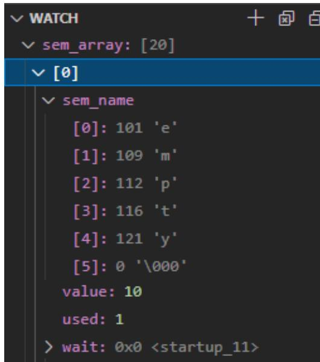


图7-2：“WATCH”窗口中显示的empty信号量


5. 在 VSCode 的 “View” 菜单中选择 “Command Palette...”, 会在 VSCode 的顶部中间位置显示命令面板, 输入 “Lab: New Visualizer View” 命令后, VSCode 会在其右侧弹出一个窗口让读者查看可视化视图。在右侧可视化视图顶部的编辑框中输入命令 “#sem” 后按回车, 可以看到已经创建完毕的 “empty” 信号量, 如图 7-3 所示。


图7-3：“信号量”窗口中显示的empty信号量


6. 按 F5 继续运行, 仍然会在之前添加的断点处中断, 可以按照之前的步骤继续调试“full”和“latex”信号量的创建过程。注意观察“WATCH”窗口中信号量数组下标为 1 的“full”信号量和下标为 2 的“latex”信号量的变化。也在右侧可视化视图顶部的编辑框中输入命令“#sem”后按回车查看信号量的创建结果。

# 3.4.2 等待信号量和释放信号量

# 消费者等待“full”信号量（阻塞）

生产者和消费者刚开始执行时，用来存放产品的缓冲区是空的，所以消费者在第一次调用sem_wait函数等待full信号量时，应该会阻塞。按照下面的步骤调试：

1. 结束之前的调试，删除所有断点。

2. 在文件 kernel/semaphore.c 的 sys_sem_wait 函数中调用 cli 函数处(第 123 行)添加一个断点。

3. 按 F5 启动调试，执行 pc 命令，会命中此断点。将任务数组 task 和第 127 行的变量 current、sem 添加到“WATCH”窗口。此时“WATCH”窗口中，可以看到当前正在运行的进程就是 pid 为 8 的消费者进程，如图 7-3 所示（current 表示当前正在运行的进程，并且 current 全局变量总是指向当前进程）。所以，在“WATCH”窗口中查看“current”的内容，图 7-3(b) 可以显示当前进程的进程控制块信息，查看其成员 pid 的值，应该与 Bochs Display 窗口中输出的消费者进程的 ID 值相同。在“WATCH”窗口查看表达式“sem”的内容，图 7-3(c) 可以确定正在使用的信号量就是“full”信号量。

4. 在 VSCode 的 “View” 菜单中选择 “Command Palette...”, 会在 VSCode 的顶部中间位置显示命

令面板，输入“Lab：New Visualizer View”命令后，VSCode会在其右侧弹出一个窗口让读者查看可视化视图。在右侧可视化视图顶部的编辑框中输入命令“#task”后按回车，也可以看到当前正在运行的进程就是pid为8的消费者进程，如图7-4所示。

5. 多次按F10单步调试，直到黄色箭头指向第129行。注意观察执行的源代码。

6. 在右侧可视化视图顶部的编辑框中输入命令“#task”后按回车可以看到进程列表信息，消费者进程已经进入了阻塞状态，如图7-5所示。在右侧可视化视图顶部的编辑框中输入命令“#sem”后按回车可以看到信号量列表信息，消费者进程在将“full”信号量的资源减1后调用wait_task函数将自己添加到了“full”信号量的等待队列中，如图7-6所示。

7. 读者也需要学会使用 VSCode 提供的“WATCH”功能查看操作系统内核变量的值，并从中梳理出内核数据间的关系。将信号量数组 sem_array 添加到“WATCH”窗口，可以看到消费者进程在将“full”信号量（下标为 1）的资源减 1 后，调用 wait_task 函数将自己添加到了“full”信号量的等待任务队列中（wait 中的 task 指针指向的地址与 current 指向的地址相同），如图 7-7(a) 所示；将 current 添加到“WATCH”窗口，可以看到当前进程（消费者进程）已经进入了阻塞状态，如图 7-7(b) 所示。接下来，消费者进程会执行调度程序（第 130 行）主动让出处理器，调度程序就会选择当前正处于就绪状态的生产者进程获得处理器，让生产者进程开始运行。

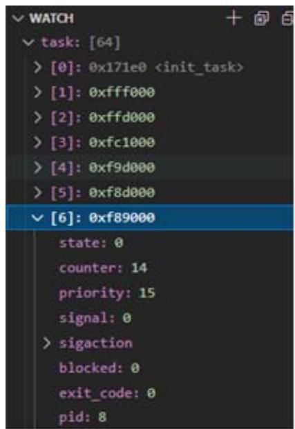


a. 队列中的消费者进程


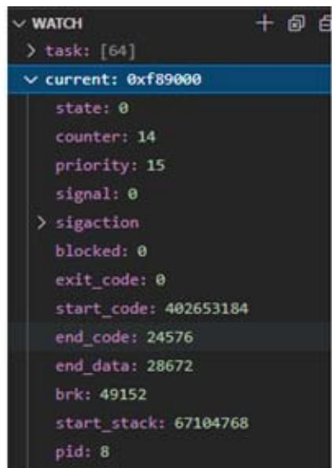


b. 当前进程为消费者进程


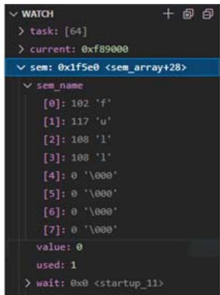


c. 当前信号量为“full”


图7-3：任务队列、当前进程窗口显示消费者进程正在运行

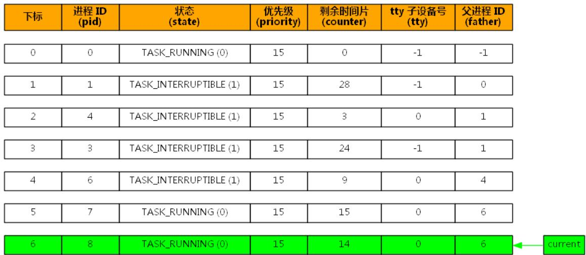


图7-4：进程列表显示消费者进程正在运行


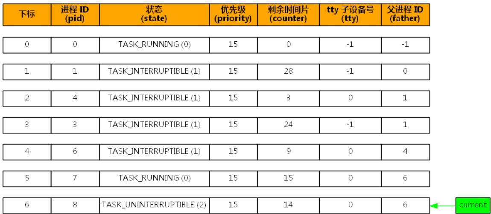


图7-5：消费者进程进入“阻塞”状态


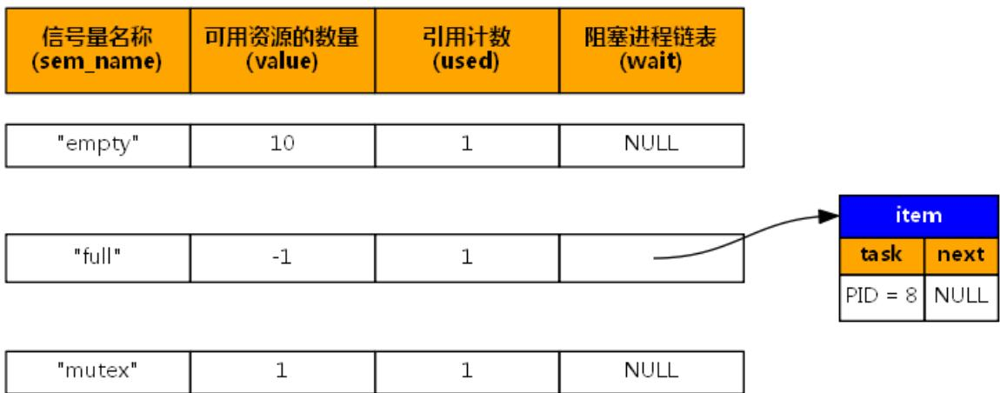


图7-6：消费者进程阻塞在“full”信号量


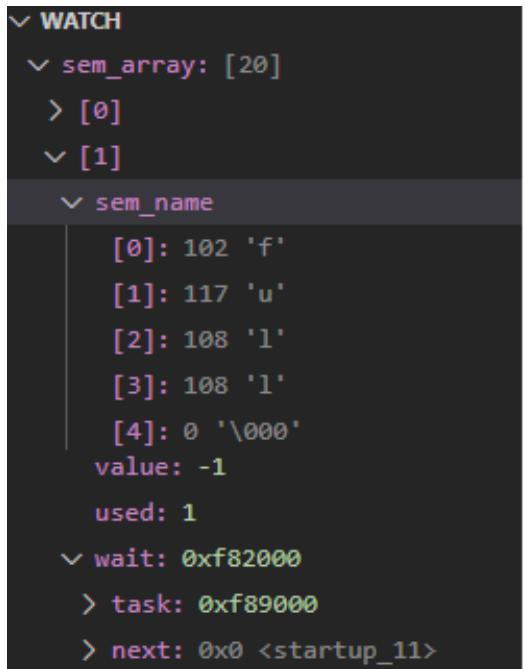


a. 信号量 “full”


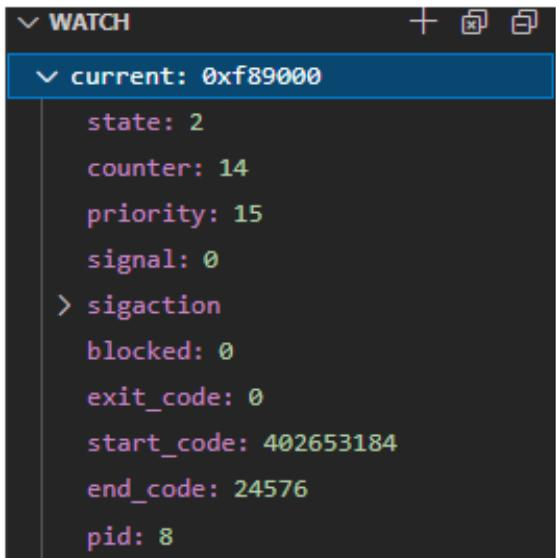


b.当前进程为“消费者”进程


图7-7：消费者进程阻塞在“full”信号量


# 生产者等待“empty”信号量（不阻塞）

现在的情况是消费者进程阻塞在了 full 信号量上，并且消费者进程会主动让出处理器（在 kernel/semaphore.c 文件的第 130 行），从而让生产者进程开始运行，而生产者进程会首先对 empty 信号量执行 P 操作。请读者按照下面的步骤进行调试：

1. 按 F5 继续执行，仍然会在之前添加的断点处中断。在“WATCH”窗口中查看“current”的内容，其 pid 的值与 Bochs Display 窗口中此时输出的生产者进程的 ID 值相同。将第 121 行的函数参数“sem”添加到 WATCH 窗口，可以确定其为“empty”信号量。说明生产者进程正在对“empty”信号量执行 P 操作。

2. 在右侧可视化视图顶部的编辑框中输入命令“#task”后按回车可以看到进程列表信息，当前正在运行的进程是 pid 为 7 的生产者进程。

3. 多次按 F10 单步调试, 直到黄色箭头指向第 132 行。在 “WATCH” 窗口中, 可以看到, 由于 “empty”信号量中有足够的资源 (所有缓冲区都为空), 所以生产者线程并没有阻塞, 而是在消耗了一个资源后直接返回了。

# 生产者释放“full”信号量（唤醒消费者进程）

此时生产者已经顺利的消耗了一个empty信号量资源，并在缓冲区中生产了一个产品，接下来当生产者对full信号量执行V操作后，会唤醒阻塞在full信号量上的消费者进程。请读者按照下面的步骤进行调试：

1. 删除之前添加的所有断点，在文件 kernel/semaphore.c 的 sys_sem_post 函数中调用 cli 函数处（第 142 行）添加一个断点。

2. 按 F5 继续执行，在生产者释放“latex”信号量时会命中一次此断点，此时在“WATCH”窗口中查看 sem 中的 sem_name 字符串的值应该为“latex”。

3. 所以，需要再按一次 F5 继续执行，在生产者释放“full”信号量时又会命中此断点。此时，在“WATCH”窗口可以看到当前运行的进程为生产者进程，表达式“current”的pid值，应该与生产者进程的ID值相同。在“WATCH”窗口查看表达式“sem”的内容，可以确定其为“full”信号量。此时，在BochsDisplay窗口中显示生产者已经在缓冲区的0位置生产了一个0号产品。

4. 在右侧可视化视图顶部的编辑框中输入命令“#task”后按回车可以看到进程列表信息，当前正在运行的进程是 pid 为 7 的生产者进程。

5. 多次按 F10 单步调试, 直到黄色箭头指向第 153 行。添加变量 p 到 “WATCH” 窗口查看其 pid 的值, 应该与消费者进程的 ID 值相同。在右侧可视化视图顶部的编辑框中输入命令 “#sem” 后按回车可以看到信号量列表信息, 生产者在将 “full” 信号量的资源数量加 1 后, 将阻塞在 “full” 信号量等待队列队首的消费者进程唤醒了（使消费者进程进入就绪状态, 并将其移出 “full” 信号量的等待队列）。

6. 消费者进程被唤醒后，会继续从之前被阻塞的位置（第130行）继续执行，这是由于每当进程让出处理器时，该进程当前运行的状态（主要是处理器中各个寄存器的值，当然也包括EIP寄存器）会保存到它的进程控制块中（请读者在task_struct结构体中找到用来保存各个寄存器值的字段），当其需要继续运行时，会将之前保存的状态恢复到处理器中，就会从之前EIP寄存器指向的位置继续执行了，这个过程就是进程上下文切换的过程。所以请读者在第132行添加一个断点，按F5继续调试会命中此断点。

7. 在右侧可视化视图顶部的编辑框中输入命令“#task”后按回车可以看到进程列表信息，当前正在运行的进程是 pid 为 8 的消费者进程，说明消费者进程被唤醒后进入了运行状态，继续向后运行的话，就开始消费产品了。

# 消费者释放“empty”信号量（不唤醒）

1. 删除第 132 行的断点，保留第 142 行的断点，按 F5 继续执行。消费者被从等待 “full” 信号量

的状态下被唤醒之后，会首先消费一个产品，然后释放“mux”信号量，这时就会命中第142行的断点，此时在“WATCH”窗口中查看sem中的sem_name字符串的值应该为“mux”。

2. 所以，需要再按一次 F5 继续执行，在消费者释放“empty”信号量时又会命中此断点。此时，在“WATCH”窗口，可以看到表达式“current”的内容，查看其成员 pid 的值，应该与消费者进程的 ID 值相同，当前运行的进程为消费者进程。在“WATCH”窗口中查看表达式“sem”的内容，可以确定其为“empty”信号量。Bochs Display 窗口中显示消费者已经消费了一个产品。

3. 多次按F10单步调试，直到黄色箭头指向第155行。在右侧可视化视图顶部的编辑框中输入命令“#sem”后按回车可以看到信号量列表信息，可以看到消费者在将“empty”信号量的资源数量加1后，直接返回了。

请读者删除所有的断点，然后在第127行添加一个断点后按F5继续调试，观察生产者和消费者执行的过程，直到在刚刚添加的断点处中断。请说明此时是哪个进程在哪个信号量上被阻塞，并分析原因。最后，请读者在关闭信号量的内核函数sys_sem_unlink的开始位置添加一个断点，调试一下关闭信号量的过程。

# 3.5 实现一个生产者进程与多个消费者进程同步工作

修改pc.c文件中的源代码，将其改写成一个生产者进程与多个消费者进程同步工作的程序。由于Linux0.11不支持向上滚屏查看，所以通过以下步骤将程序运行的结果使用“>>”重定向到文本文件中。

1. 使用gcc编译pc.c文件：gcc pc.c -o pc

2. 执行 sync 命令将对硬盘的更改保存下来。

3. 使用命令 pc >> pc.txt 将输出保存到文件 pc.txt 中（此过程可能时间较长，请读者耐心等待），再使用命令 vi pc.txt 启动 vi 编辑器查看文本文件 pc.txt 中的内容。

# 提示：

- 可使用 for 语句循环创建多个消费者进程。

- 本实验使用文件 filebuffer.txt 作为生产者和消费者之间的共享缓冲区，在文件中用于放置产品的共享缓冲区的后面再增加一个计数值（4 个字节），用来记录每次消费者要从该文件中取产品的位置。每个消费者取产品前，先从文件中读取此计数值，消费一个产品后就将此计数值加 1，并重新写入文件的末尾。这样多个消费者就可以使用同一个共享缓冲区的游标了。

- 在父进程结束前要使用 waitpid 函数等待所有消费者进程和生产者进程都结束。

- 注意观察“WATCH”窗口中信号量和当前进程、任务队列的内容，加深对信号量的理解。

当代码编写完成并运行成功后，为了将刚刚编写的文件提交到平台，需要按照下面的步骤将这些文件从Linux 0.11操作系统中复制到软盘B，然后再复制到本地。

1. 在Linux 0.11的终端使用下面的命令将刚刚编写的文件pc.c复制到软盘B中。

mcopy pc.c b:pc.c

2. 关闭Bochs虚拟机。

3. 在 VSCode 左侧的“文件资源管理器”窗口顶部点击“New Folder”按钮，新建一个名称为 newapp 的文件夹。在“文件资源管理器”窗口中的 newapp 文件夹节点上点击鼠标右键，选择菜单中的“Reveal in File Explorer”，可以使用 Windows 的资源管理器打开此文件夹所在的位置，双击打开此文件夹。

4. 在 VSCode 的 “Terminal” 菜单中选择 “Run Build Task...”, 会在 VSCode 的顶部中间位置弹出一个可以执行的 Task 列表, 选择其中的 “打开 floppyb.img” 后会使用 Floppy Editor 工具打开该项目中的 floppyb.img 文件, 查看软盘镜像中的文件列表, 确保刚刚编写的文件已经成功复制到软盘镜像文件中。在文件列表中选中 pc.c 文件, 并点击工具栏上的 “复制” 按钮, 然后粘贴到 Windows 的资源管理器打开的 newapp 文件夹中。

# 3.6 提交作业

实验结束后先使用 VSCode 左侧的“源代码版本控制窗口”查看文件变更详情，确认无误后再将本地项目提交到平台的个人项目中，方便教师通过平台查看读者提交的作业。

# 四、 思考与练习

1. 本实验的设计者在第一次编写生产者--消费者程序的时候，是这么做的：

```txt
Producer()
{
P(Mutex); //互斥信号量
生产一个产品item;
P(Empty); //空闲缓存资源
将item放到空闲缓存中;
V(Full); //产品资源
V(Mutex);
}
```

这样可行吗？如果可行，那么它和标准解法在执行效果上会有什么不同？如果不可行，那么它有什么问题使它不可行？

2. 本实验设计的生产者--消费者问题是在同一个应用程序（同一个main函数）中实现的，请读者试着将生产者和消费者在两个不同的应用程序中实现。

# 提示：

分别在两个Linux应用程序项目中分别实现生产者程序和消费者程序，生成各自的项目从而得到应用程序的可执行文件，此时，应用程序的可执行文件已经自动写入各自项目文件夹中的软盘镜像文件floppyb.img中了。

将消费者项目文件夹下的floppyb.img拷贝覆盖已经实现了信号量功能的Linux Kernel项目文件夹下的floppyb.img文件，在内核项目中按F5启动调试后，按顺序执行命令：

```batch
mcopy b:linuxapp.exe consumer  
chmod +x consumer  
sync
```

从而将消费者程序复制到硬盘，然后结束调试。

将生产者项目文件夹下的floppyb.img拷贝覆盖本已经实现了信号量功能的Linux Kernel项目文件夹下的floppyb.img文件，在内核项目中按F5启动调试后，按顺序执行命令：

```batch
mcopy b:linuxapp.exe producer  
chmod +x producer  
sync
```

从而将消费者程序复制到硬盘。

这样在内核项目的硬盘上就同时存在了生产者和消费者应用程序的可执行文件。先执行命令：consumer &

此命令会让一个消费者进程在后台开始执行。此时读者可以立即执行下面的命令开始执行生产者进程。如果读者已经完成了3.5的内容，使多个消费者可以共享文件中的游标的话，可以再执行3次之前的命令，然后再执行下面的命令：

```txt
producer
```

这样就可以查看1个生产者和4个消费者同步运行的结果了。可以将输出结果保存到文件中查看，具体操作步骤可参考本实验3.3的步骤6，但此处输出到文件需要使用“>>”符号在文件的尾部追加写入，如果使用’>’符号，每次都会从文件开始处写入，则无法看到正确的执行结果。另外，“>>”和文

件名需要写到“&”的前面，这样才能先重定向到文件再在后台运行。

3. 本实验中提供的实现信号量的源代码中没有使用Linux 0.11内核提供的sleep_on函数和wake_up函数。sleep_on函数的功能是将当前进程睡眠在参数指定的链表上，而这个链表是个存在于堆栈中的隐式链表，不太容易被理解。同时，wake_up函数的功能是唤醒隐式链表上睡眠的所有进程，而本实验要求的是仅唤醒等待队列中的一个进程。请读者参考kernel/blk_drv/ll_rw_blk.c文件中第59行的lock_buffer和第69行的unlock_buffer这两个函数，尝试将本实验改成使用sleep_on和wake_up函数来实现信号量的阻塞和唤醒。修改完成后，查看1个生产者和4个消费者同步运行的结果与之前的结果有何不同。

# 实验八 地址映射与内存共享

实验性质：验证、设计

建议学时：2学时

任务数：4个

实验难度：★★★★☆

# 一、实验目的

$\bullet$  深入理解物理内存的分页管理方式。

- 深入理解操作系统的段、页式内存管理。包括理解段表、二级页表，以及逻辑地址、线性地址、物理地址的映射过程。

- 编程实现段、页式内存管理上的内存共享，从而深入理解操作系统的内存管理。

# 二、预备知识

请读者认真阅读《Linux内核完全注释》第4章的前4节，第5.3节以及第13章的内容。在阅读的过程中如果存在一时无法读懂的内容也很正常，可以先记录下来，在完成本实验的内容后再回过头来看看能否解答读者心中的疑问。读者应该体会到，这种在阅读的过程中进行思考并提出问题，然后带着问题进行实践，接着再阅读再思考再实践的螺旋上升的学习过程，才是正确的学习方法。

# 三、实验内容

无论是对物理内存的管理，还是通过分段和分页机制对逻辑地址空间的管理，对于操作系统来说都是至关重要的，甚至可以说比进程管理还重要。读者可以设计一个没有进程概念的“操作系统”，但是内存管理功能是无论如何也不能绕过的。所以本实验的内容安排的比较丰富，目的也是尽可能让读者多做一些练习，从而对操作系统管理内存的方式有一个全面、深入的理解。

# 3.1 任务（一）：分配和释放物理页

# 准备实验

使用浏览器登录平台领取本次实验对应的任务，从而在平台上创建个人项目(Linux 0.11 内核项目)，然后使用 VSCode 将个人项目克隆到本地磁盘中并打开。

# 物理内存的管理

Linux 0.11 内核将 16MB 物理内存划分为 4KB 大小的物理页，每个物理页的基地址都是按照 4KB 对齐的，然后为所有的物理页按照基地址由小到大的顺序进行了编号，称之为物理页框号（PFN）。显然使用一个物理页框号乘以 4096（4K），就可以得到该物理页的基地址。Linux 0.11 内核将物理页作为最小的管理单元，记录了每个物理页的状态（使用或空闲），并可以完成分配物理页和回收物理页的功能。

Linux 0.11 内核管理物理内存的源代码在文件 mm/memory.c 中。其中在第 188 行定义的 mem_map 是物理内存映射字节图，其实质是一个字节数组，每个数组元素的下标与一个已分页的物理内存的页框号相对应（注意，由于 1MB 以下的物理内存未参与分页，所以数组下标与物理页框号并不是从 0 开始对应的）。数组元素的值为 0 表示其对应的物理页是空闲的，值大于 0 表示物理页被引用的次数。Linux 0.11 内核还提供了三个基本的函数对物理内存进行管理，在第 782 行定义的 mem_init 函数对物理内存进行初始化，在内核入口点函数 start 中会首先调用此函数（在 init/main.c 文件的第 169 行）；在第 261 行定义的 get_free_page 函数用于分配一个空闲的物理页；在 292 行定义的 free_page 函数用于回收一个物理页。

在开始研究管理物理内存的源代码之前，读者可以先按照下面的步骤观察一下初始化物理页、分配物理页、回收物理页的过程，对物理内存管理有一个直观的、感性的认识：

1. 在init/main.c文件中的第170行添加一个断点，在kernel/fork.c文件中的第99行添加一个断点，按“F5”启动调试。

2. 首先会命中刚刚添加的第一个断点。接下来读者需要按照下面的步骤查看在完成内存初始化后，物理内存的可视化效果。

3. 首先，在 VSCode 的“View”菜单中选择“Debug Console”，会在 VSCode 的底部显示出“DEBUG CONSOLE”窗口，在该窗口底部的调试命令编辑器中输入调试命令“-exec call pm()”后按回车。

4. 然后，在 VSCode 的“View”菜单中选择“Command Palette...”，会在 VSCode 的顶部中间位置显示命令面板，输入“Lab: New Visualizer View”命令后，VSCode会在其右侧弹出一个窗口让读者查看可视化视图。在右侧可视化视图顶部的编辑框中输入命令“#pm”后按回车，可以看到物理内存在刚刚完成初始化后的情况，如图8-1所示。

注意：在使用可视化窗口查看物理内存之前，一定要先在“DEBUG CONSOLE”窗口底部的调试命令编辑器中执行一次调试命令“-exec call pm()”，其作用是让GDB调试器调用一次pm函数，就像在C语言程序中调用一次pm函数一样。函数pm在mm/memory.c文件中的第203行定义，其作用是将mem_map数组中的信息压缩在used_page_section_table数组中，从而大大加快可视化视图绘制的速度。也就是说本质上，物理内存可视化视图是根据used_page_section_table数组中的信息绘制的，而不是根据mem_map数组绘制的，因为其拥有3840个元素，如果都处理一遍再绘制可视化视图的话，就太慢了。

5. 此时，物理内存刚刚完成初始化，其中 1MB 以下的物理内存未参与分页，1M 以上的物理内存在完成分页后包含了已使用的物理页和空闲页。此时标记为已使用的物理页是为 Linux 内核空间保留的物理页，并且已经将这些物理页映射到了逻辑地址空间，确保逻辑地址与物理地址相同，这样 Linux 内核就可以直接使用物理地址访问这些物理页了，从而为后续 Linux 内核的初始化过程提供了足够的内存空间以及巨大的便利性。关于 Linux 是如何将这些物理内存映射到逻辑地址空间的问题，会在本实验后面的练习中进行深入的讨论。

6. 读者也可以将全局变量“mem_map”添加到“WATCH”窗口查看其内容，如图8-2所示。数组mem_map的大小是3840，也就是说由mem_map管理的物理页数量是3840，如果加上不由mem_map管理的0x100个物理页（即1MB以下的未参与分页的物理内存），则物理页的总数正好是4096，4096个大小为4KB的物理页正好是16MB。

7. 按“F5”继续运行，会在刚刚添加的第二个断点处中断，此时通过执行断点之前的那一行代码，调用get_free_page函数第一次申请到了一个空闲的物理页，这一整页物理内存用于存放进程1的进程控制块（关于copy_process函数已经在实验五中进行了详细的研究，请读者自行回忆相关的内容）。请读者按照前面学习的方法自行操作，在可视化窗口中刷新物理内存的信息，可以看到此时物理页框号最大的那个物理页已经被占用，引用次数变为1。请读者结合get_free_page函数的源代码和注释，说明为什么第一次申请的物理页是物理页框号最大的那个。

8. 接下来查看释放物理页的情况。首先删除所有断点，然后在 kernel/exit.c 文件中的第 30 行添加一个断点，按“F5”继续调试，会命中刚刚添加的断点，此时将鼠标移动到此行代码中传递给 free_page 的参数 p 上，记录下参数 p 的值，p 指向一个已经结束运行的进程的进程控制块，同样也是一个物理页的基地址，将 p 的值除以 4096 就可以得到对应的物理页框号。在可视化窗口中刷新物理内存的信息，可以看到这时 p 指向的物理页仍然是被占用的状态。按一次 “F10” 单步调试执行完 free_page 函数后，再次在可视化窗口中刷新物理内存的信息，可以看到 p 指向的物理页已经被释放了，也就是说进程结束后，用于存放其进程控制块信息的那一整页物理内存被系统回收了。

9. 结束此次调试。

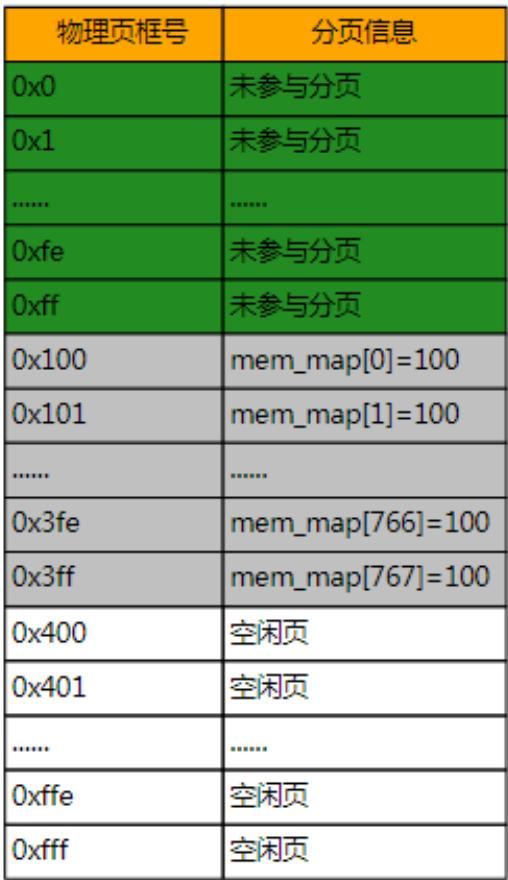


图8-1：刚刚完成初始化后的物理内存的分页信息


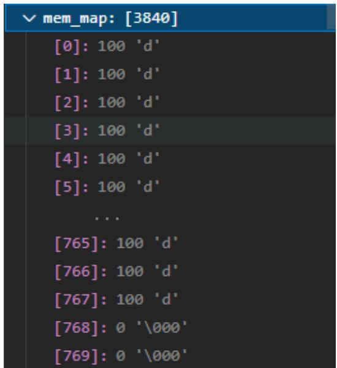


图8-2：在“WATCH”窗口中查看物理页映射数组“mem_map”


# 通过编程的方式练习分配物理页和释放物理页

读者已经通过前面的练习对Linux 0.11内核管理物理内存的方式有了一个初步的认识，还是那句话“知而不行，非真知也”，接下来，请读者按照下面的步骤通过编程的方式练习分配物理页和释放物理页，从而对物理内存的管理有一个更深刻的理解。

请读者首先在Linux 0.11内核项目中添加一个系统调用函数，该函数可以在终端设备上显示物理存储器的信息，包括物理页总数、空闲页数量和占用页数量。

1. 打开“学生包”，在本实验对应文件夹下找到mem.c文件，拖动到VSCode中释放，即可打开此文件。将其中的函数physical_mem复制到Linux 0.11内核项目下的mm/memory.c文件的末尾处，并且需

在include/linux/kernel.h中添加该函数的声明。physical_mem函数中的代码比较简单，请读者结合其中的注释自行理解。

2. 添加一个系统调用号为87的系统调用（添加系统调用的方法请参考实验四），该系统调用的内核函数int dump_physical_mem()可以写在 kernel/sys.c 文件的末尾，在此函数中直接调用 mm/memory.c文件中的physical_mem函数即可。

3. 生成项目，确保没有语法错误和警告。

4. 按F5启动调试，待Linux 0.11完全启动后，使用vi编辑器新建一个main.c文件，其源代码如下所示：

```c
define _LIBRARY_   
#include <unistd.h>   
#define NR_dump_physical_mem 87   
_syscall0(int, dump_physical_mem)   
int main()   
{ dump_physical_mem(); return 0;
```

5. 保存main.c文件并退出vi编辑器后，依次执行如下命令：

```txt
gcc main.c -o mem sync mem
```

应用程序执行后打印输出的物理存储器的信息如图8-3所示：

```txt
Page Count : 3840  
Memory Count : 3840 * 4096 = 15728640 Byte  
Free Page Count : 2968  
Used Page Count : 872
```

图8-3：物理存储器的使用情况

接下来请读者对 physical_mem 函数中的源代码进行修改，要求在输出物理内存的信息后调用一次 get_free_page 函数分配一个空闲的物理页，然后输出空闲页和占用页的数量，最后再调用一次 free_page 函数将刚刚分配的物理页进行回收，同样需要输出空闲页和占用页的数量。注意比较分配一个物理页和回收一个物理页后物理存储器的变化。要求在终端上打印输出的内容与图 8-4 一致。

```txt
Page Count : 3840  
Memory Count : 3840 * 4096 = 15728640 Byte  
Free Page Count : 2968  
Used Page Count : 872  
**********After Allocate One Page**********  
Allocate One Page : 0xFFFF0000  
Free Page Count : 2967  
Used Page Count : 873  
**********After Free One Page**********  
Free One Page : 0xFFFF0000  
Free Page Count : 2968  
Used Page Count : 872
```

图8-4：分配一个物理页和回收一个物理页后物理存储器的变化情况

当代码编写完成并运行成功后，为了将刚刚编写的文件提交到平台，需要按照下面的步骤将这些文件

从Linux 0.11操作系统中复制到软盘B，然后再复制到本地。

1. 在Linux 0.11的终端使用下面的命令将刚刚编写的文件main.c复制到软盘B中。  
mcopy main.c b:main.c

2. 关闭Bochs虚拟机。

3. 在 VSCode 左侧的“文件资源管理器”窗口顶部点击“New Folder”按钮，新建一个名称为 newapp 的文件夹。在“文件资源管理器”窗口中的 newapp 文件夹节点上点击鼠标右键，选择菜单中的“Reveal in File Explorer”，可以使用 Windows 的资源管理器打开此文件夹所在的位置，双击打开此文件夹。

4. 在 VSCode 的 “Terminal” 菜单中选择 “Run Build Task...”, 会在 VSCode 的顶部中间位置弹出一个可以执行的 Task 列表, 选择其中的 “打开 floppyb.img” 后会使用 Floppy Editor 工具打开该项目中的 floppyb.img 文件, 查看软盘镜像中的文件列表, 确保刚刚编写的文件已经成功复制到软盘镜像文件中。在文件列表中选中 main.c 文件, 并点击工具栏上的 “复制” 按钮, 然后粘贴到 Windows 的资源管理器打开的 newapp 文件夹中。

# 提交作业

实验结束后先使用 VSCode 左侧的“源代码版本控制窗口”查看文件变更详情，确认无误后再将本地项目提交到平台的个人项目中，方便教师通过平台查看读者提交的作业。

# 3.2 任务（二）：跟踪Linux应用程序中的逻辑地址、线性地址、物理地址的映射过程

# 准备实验

使用浏览器登录平台领取本次实验对应的任务，从而在平台上创建个人项目(Linux 0.11 内核项目)，然后使用 VSCode 将个人项目克隆到本地磁盘中并打开。

# 跟踪Linux应用程序中的逻辑地址、线性地址、物理地址的映射过程

在学习了Linux 0.11内核管理物理存储器的方式后，接下来重点理解一下在X86处理器进入保护模式后，处理器是如何利用分段、分页机制，将逻辑地址映射到线性地址，再将线性地址映射到物理地址的，以及Linux 0.11操作系统是如何利用这些机制实现多任务之间内存的隔离和共享的。

由于接下来的实验步骤较多，并且需要一定的技巧和耐心，所以读者需要先了解一下大概的实验流程。

首先需要读者使用Bochs虚拟机提供的Debug调试功能启动Linux 0.11内核项目，然后在Linux终端上运行一个Linux应用程序，此应用程序的main函数中主要包括了一个死循环，源代码如下：

```txt
include<stdio.h> int i  $=$  0x12345678; int main(void) { printf("The logical/virtual address of i is  $0\mathrm{x}\% 08\mathrm{x}\backslash \mathrm{n}^{\prime \prime}$  ,&i); fflush<stdlib); while(i) return 0; }
```

使用此应用程序创建的进程开始运行后，会很快进入死循环导致进程无法结束。此时读者需要使用Bochs调试器提供的暂停虚拟机的命令让应用程序暂停（一般会暂停在死循环对应的指令中），然后在Bochs提供的调试命令的帮助下，根据终端上输出的变量i的逻辑地址计算出它的线性地址，再计算出它的物理地址。最后，使用Bochs调试命令直接修改物理内存让变量i的值变为0，从而结束死循环使进程结束运行。在此实验过程中读者可以通过一个实际的例子，体验到逻辑地址到线性地址，再到物理地址的转换过程。

# 启动调试Linux内核以及Linux应用程序

在 VSCode 的“Terminal”菜单中选择“Run Build Task...”，会在 VSCode 的顶部中间位置弹出一个可以执行的 Task 列表，选择其中的“Bochs 命令调试”即可，此时会弹出两个 Bochs 窗口。标题为“Bochs for windows - Display”的窗口相当于计算机的显示器，显示操作系统的输出。标题为“Bochs for windows - Console”的窗口是 Bochs 的控制台，用来输入调试命令和输出调试信息。

启动调试后，Bochs在CPU要执行的第一条指令（即BIOS的第一条指令）处中断。此时，Display窗口没有显示任何内容，Console窗口显示将要执行的BIOS的第一条指令，并等待用户输入调试命令，如下图：

```html
[0xxxxxxxxxx] f000:fff0 <unk.ctxt> : jmp far f000:e05b ; ea5be000f0 <bochs:1>
```

图8-5：Bochs的命令窗口等待用户输入调试命令

# 调试应用程序并暂停

接下来请读者按照下面的步骤调试Linux内核以及Linux应用程序，然后使之暂停：

1. 输入命令“c”按回车，Bochs虚拟机会继续运行Linux 0.11操作系统，直到其启动完毕等待用户输入命令。

2. 在Linux 0.11中使用vi编辑器新建loop.c文件，并输入之前给出的那个包含死循环的应用程序源代码。

3. 使用GCC将loop.c编译为loop可执行文件并使用sync保存到硬盘后，运行loop，会打印输出如下信息：

```txt
The logical/virtual address of i is 0x00003004
```

图8-6: 应用程序loop 输出全局变量i的逻辑地址

只要loop应用程序的源代码不发生改变，全局变量i的逻辑地址在任何一个Bochs虚拟机上得到的都是一样的。即使在同一个虚拟机上多次运行，也是一样的。

4. 读者在这里需要先结束此次调试，并关闭Bochs虚拟机。然后重新使用Task列表中的“Bochs命令调试”启动Bochs虚拟机，待启动Linux 0.11后再运行一次loop应用程序，这样可以保证loop应用程序创建的进程PID为6，并且产生的数据与下面描述的一致。

5. 点击Bochs的命令窗口(标题为“Bochs for Windows - Console”)的头部名称位置激活窗口，按“Ctrl+c”，Bochs会暂停运行，等待用户输入调试命令。绝大多数情况下都会在loop应用程序的死循环中暂停，显示类似如下信息：

```txt
（0）[0x00faa063] 000f:00000000000000063（unk.ctxt）：cmp dword ptr ds:0x3004, 0x0000000 ; 833d043000000
```

图8-7：Bochs命令窗口在暂停运行后显示的信息

其中冒号左边的“000f”如果是“0008”，则说明是在Linux内核执行时暂停了。那么读者就要在Bochs的命令窗口中输入命令“c”后回车，然后再按“Ctrl+c”，直到其变为“000f”为止，确保是在刚刚编写的应用程序的死循环中暂停。如果显示的将要执行的下一条指令不是“cmp”，就用“n”命令单步运行几步，直到停在“cmp”指令处。

6. 使用命令“u /8”，显示从当前位置开始的8条指令的反汇编代码，如下：

```txt
10000063: < ): cmp dword ptr ds:0x3004, 0x00000000 ; 833d0430  
000000  
1000006a: < ): jz .+0x00000004 ; 7404  
1000006c: < ):jmp .+0xFFFFFF5 ; ebf5  
1000006e: < ): add byte ptr ds:[eax], al ; 0000  
10000070: < ): xor eax, eax ; 31c0  
10000072: < ):jmp .+0x00000000 ; eb00  
10000074: < ): leave ; c9  
10000075: < ): ret ; c3
```

图8-8：从当前位置开始的8条指令的反汇编代码

这些就是loop.c中从while语句开始一直到return语句的汇编代码。变量i保存在内存中的ds:0x3004这个地址，并不停地和0进行比较，直到它为0，才会跳出循环。

# 处理器通过段表（GDT和LDT）将应用程序中的逻辑地址映射为线性地址

截至目前，读者已经得到了全局变量i的逻辑地址ds:0x3004。其中，DS寄存器中存储了一个段选择符（也叫段选择子），可以通过这个段选择符在对应的段描述符表中定位一个段描述符，然后再从段描述符中获得段基址，最后让段基址与偏移0x3004相加，就可以获得全局变量i的线性地址了，如下图所示：

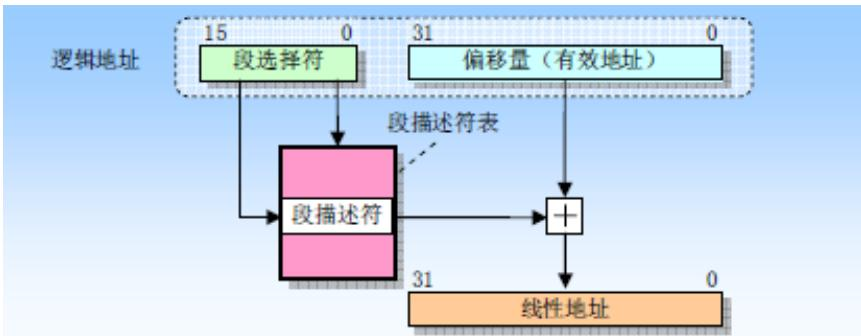


图8-9：处理器将逻辑地址转换为线性地址的过程（分段变换）


在读者自行将逻辑地址转换为线性地址之前，需要先掌握段选择符和段描述符的格式。

# 段选择符


图8-10:段选择符的格式


段选择符的大小是2个字节（16位），会被装入CS、DS、SS等段寄存器中，所以和这些段寄存器的大小是一样的。其中，RPL占用最低的2位，表示请求特权级，不参与地址映射的过程。第2位是TI标志，如果TI为0，表示段描述符在GDT（全局描述符表）中，如果TI为1，表示段描述符在LDT（局部描述符表）中。第3到15位表示段描述符在GDT或LDT中的索引。

# 段描述符

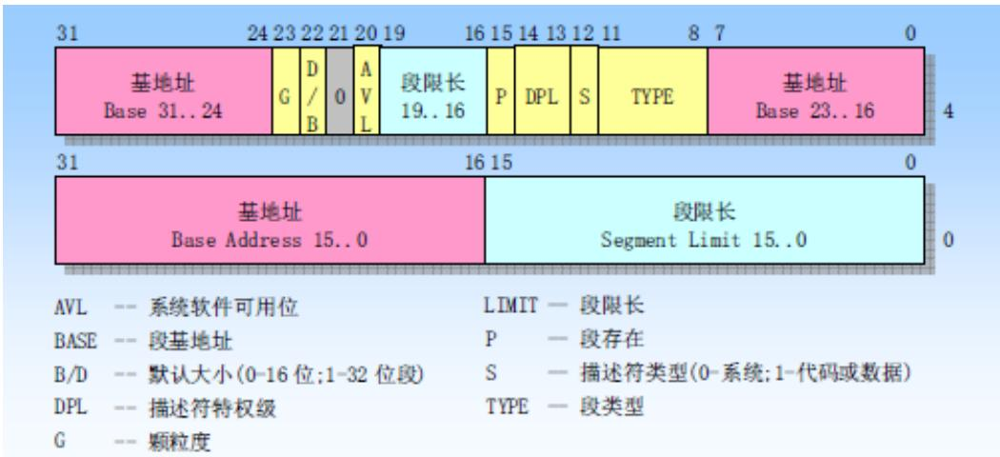


图8-11:段描述符的通用格式


段描述符是一个64位的二进制数据，主要存放了段基址和段限长等信息。其中段基址占用了32位，由于这32位是分离的，所以需要按照顺序组装起来才能得到完整的段基址；段限长占用了16位，位P(Present)用来表示段是否存在；位S用来表示段是系统段描述符（ $S = 0$ ）还是代码或数据段描述符（ $S = 1$ ）；四位TYPE用来表示段的类型，如数据段、代码段、可读、可写等；两位DPL是段的权限，和CPL、RPL对应使用；位G是段限长的粒度，G为0表示段限长以字节为单位，G为1表示段限长以4KB为单位；其他内容就不详细解释了。

读者在了解了段选择符和段描述符后，就可以按照下面的步骤进行地址变换了：

1. 在Bochs的命令窗口中输入命令“sreg”查看DS寄存器的值，如下图：

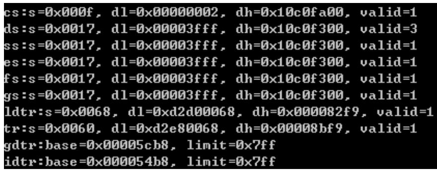


图8-12:段寄存器的值及缓冲的值


DS的值为0x0017，换算为16位的二进制为000000000010111。其中RPL的值为二进制11，十进制为3，是最低的特权级（因为在应用程序中执行）；TI的值为1，表示查找LDT表；使用粗体表示的就是索引值，二进制为10，换算为十进制为2，表示找LDT表中的第3个段描述符（从0开始编号）。

2. 由于LDT表的基址也是由一个段描述符来描述的，而且这个段描述符存储在GDT表中，其索引由1dtr寄存器确定。所以，从上图中也可以得到1dtr的值为0x0068，换算为16位的二进制为000000001101000，使用粗体表示的就是索引值，二进制为1101，换算为十进制为13，表示LDT表的描述符在GDT的索引为13（第14个描述符）。

3. GDT的起始物理地址存储在寄存器gdtr中，在上图中显示寄存器gdtr的值为0x00005cb8。所以在Bochs的命令窗口中输入命令“xp /2w 0x00005cb8+13*8”，就可以查看GDT表中索引值为13的段描述符了，如下图：


图8-13：GDT表中索引值为13的段描述符


上面两个命令得到的数值可能和这里给出的示例不一致，这是很正常的。如果读者需要确认自己得到的值是否正确，可以查看“sreg”命令输出内容中的ldtr所在行的dl和dh的值，这两个值是x86处理器为了加快地址映射的速度而缓存的段描述符，读者得到的段描述符必须和它们一致。

4. 将段描述符“0xd2d00068 0x000082f9”中的加粗部分组合为“0x00f9d2d0”，就是LDT表的物理地址了。在Bochs的命令窗口中输入命令“xp /8w 0x00f9d2d0”，可以得到LDT表中前4个段描述符的内容，如下图：

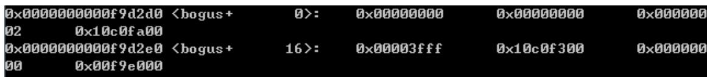


图8-14：LDT表中前4个段描述符


第3个段描述符为“0x00003fff 0x10c0f300”就是ds对应的段描述符了。在“sreg”命令输出的内容中（图8-11），ds所在行的dl和dh值应该与这个段描述符一致。

段描述符“0x00003fff 0x10c0f300”中加粗部分组合成的“0x10000000”这就是ds段在线性地址空间中的起始地址。用同样的方法也可以计算其它段的基址，都可以得到这个数。接下来使用段基址加上段内偏移就是线性地址了。所以ds:0x3004的线性地址就是  $0\mathrm{x}10000000 + 0\mathrm{x}3004 = 0\mathrm{x}10003004$  。在Bochs的命令窗口中输入命令“calc ds:0x3004”可以查看这个逻辑地址的线性地址，从而可以验证这个结果。

# 处理器通过页目录和页表将线性地址映射为物理地址

现在，读者已经得到了全局变量i的线性地址0x10003004,使用线性地址最高10位的值作为页目录中的索引可以得到一个页目录项，从此页目录项中可以得到页表的起始物理地址，再使用线性地址中间10位的值作为页表中的索引可以得到一个页表项，从此页表项中可以得到物理页的起始地址，最后使用线性地址

最低12位的值作为物理页内的偏移，就可以确定最终的物理地址了。如下图所示：

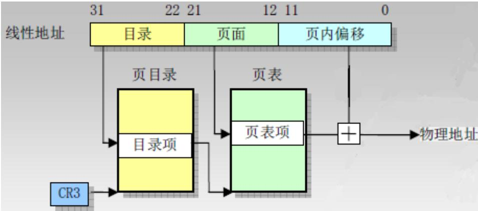


图8-15：处理器将线性地址转换为物理地址的过程（分页变换）


在读者自行将线性地址转换为物理地址之前，需要先掌握页目录和页表的格式。

# 页目录和页表

页目录和页表的格式是一样的，大小均为4KB（正好占用一个4KB大小的物理页），包含1024个页表项，每个表项有4个字节（32位）。表项中各个位的作用如下图所示：


图8-16:页目录和页表中的表项格式


每个表项的高20位保存了此表项所映射物理页的页框号，将物理页框号左移12位可以得到其对应的物理页的基址，所以每个物理页的大小也是4KB。表项中余下的12位是属性位，读者可以查找资料自行了解一下。

一个进程的线性地址空间通常由一个页目录和多个页表来描述，页目录中的表项用来指定页表的起始物理地址，页表中的表项用来指定物理页的起始地址，这样就构成了一个二级页表映射。其中，页目录的起始物理地址由x86处理器中的控制寄存器CR3指定。

读者在了解了二级页表映射的机制后，就可以按照下面的步骤进行地址变换了：

1. 首先需要算出线性地址中的页目录号、页表号和页内偏移，它们分别对应了32位线性地址的高10位+中间10位+低12位，所以0x10003004的页目录号为64，页表号为3，页内偏移为4。

2. 页目录表的起始物理地址由控制寄存器CR3指定。在Bochs的命令窗口中输入命令“creg”可以查看CR3寄存器的值，如下：

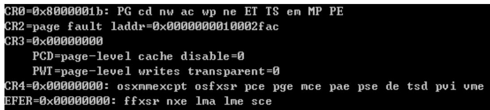


图8-17：控制寄存器的值


CR3寄存器的值为0，说明页目录的起始物理地址为0。

3. 在Bochs的命令窗口中输入命令“xp /w 0+64*4”，在页目录中查看页目录号为64的页表项，如下图（如果读者得到页目录号与这里的不一致，请读者使用自己得到的值进行后续的计算）：


图8-18:页目录号为64的页表项的值


其中027是属性位的值，请读者自己分析这些属性值的意义。页表所在物理页框号为0x00aaa，即页表的起始物理地址为0x00aaa000。

4. 在Bochs的命令窗口中输入命令“xp /w 0x00faa000+3*4”，在页表中查看页表号为3的页表项，如下图：

```html
0x0000000000faa00c <bogus+ 0>: 0x00fa7067
```

图8-19：页表号为3的页表项的值

其中0x00fa7是物理页所在的页框号，所以物理页的起始地址为0x00fa7000。将物理页的起始地址与页内偏移4加在一起得到0x00fa7004就是变量i的物理地址了。

5. 在Bochs的命令窗口中输入命令“xp /w 0x00fa7004”，查看从该物理地址开始的4个字节的值，也就是变量i的值，如下图：

```html
0x0000000000fa7004 <bogus+ 0>: 0x12345678
```

图8-20：变量i的值

可以验证这个值与程序中全局变量i的初值是一样的。

6. 在Bochs的命令窗口中输入命令“setpmem 0x00fa7004 4 0”，将从物理地址0x00fa7004开始的4个字节的值都设为0。然后再使用命令“c”让Bochs继续运行，可以看到应用程序退出了，说明变量i的值在被修改为0后结束了死循环。

之前调试了全局变量的地址映射过程，下面请读者自行调试局部变量的地址映射过程。可以将loop应用程序的源代码文件修改为如下的代码，通过物理内存修改局部变量i的值使应用程序结束。

```txt
include<stdio.h>   
int main(void)   
{ int  $\mathrm{i} = 0\mathrm{x}12345678$  printf("The logical/virtual address of i is  $0\mathrm{x}\% 08\mathrm{x}\backslash \mathrm{n}^{\prime \prime}$  ,&i); fflush(stdout); while(i) ； return0;
```

# 深入研究Linux0.11应用程序进程内存的管理方式

前面的实验内容带领读者详细了解了Linux 0.11操作系统通过配置GDT、LDT以及页目录和页表，使保护模式下的X86处理器的内存管理单元（硬件）将应用程序中的逻辑地址映射为物理地址，从而完成对内存的访问。

接下来的实验内容主要通过使用可视化功能，向读者直观、形象的展示Linux 0.11操作系统管理应用程序进程内存的方式，以及若干个重要概念。待读者对这些概念有一个初步的认识后，就可以自行完成更加深入的学习了，例如阅读相关的源代码，或者重新阅读《Linux内核完全注释》第13章的内容。

# 分段隔离

Linux 0.11操作系统利用分段机制，将不同应用程序进程所使用的相同逻辑地址映射为不同的线性地址，从而确保将不同的进程分段隔离在不同的线性地址空间，确保多个进程在并发执行时不会相互影响。例如一个进程在其线性地址空间出现了异常，就不会影响到其他的进程。请读者按照下面的实验步骤查看多个进程的线性地址空间分段隔离的情况：

1. 按F5启动调试后，使用vi loop.c命令开始编辑loop.c文件，使用下面的源代码修改loop应用程序，并编译生成可执行文件，使之在开始运行的时候就调用fork函数创建一个子进程，这样父进程和子进程就会从同样的位置继续向后并发的运行。

```c
include<stdio.h>   
int i  $=$  0x12345678;   
int main(void)   
{ fork(); printf("The logical/virtual address of i is 0x%08x\n",&i); fflush(stdout); while(i) return 0;
```

2. 使用loop命令运行可执行文件，观察打印输出的信息可以发现父进程和子进程中全局变量i的逻辑地址是相同的，说明父进程和子进程使用了完全相同的逻辑地址空间。

3. 结束调试。在kernel/fork.c文件的第171行添加一个条件断点，条件设置为“p->pid == 7”，这样当loop程序创建子进程完毕后就会命中此断点。

4. 按F5启动调试，在终端运行loop应用程序后，会命中刚刚添加的条件断点。接下来读者需要按照下面的步骤查看全局描述符表的可视化数据。

5. 首先，在VSCode的“View”菜单中选择“Debug Console”，会在VSCode的底部显示出“DEBUG CONSOLE”窗口，在该窗口底部的调试命令编辑器中输入调试命令“-exec call showgdt()”后按回车。

6. 然后，在 VSCode 的“View”菜单中选择“Command Palette...”，在 VSCode 的顶部中间位置显示命令面板，输入“Lab: New Visualizer View”命令后，VSCode会在其右侧弹出一个窗口让读者查看可视化视图。在右侧可视化视图顶部的编辑框中输入命令“#gdt”后按回车，可以看到全局描述符表的可视化数据。

注意：在使用可视化窗口查看全局描述符表之前，一定要先在“DEBUG CONSOLE”窗口底部的调试命令编辑器中执行一次调试命令“-exec call showgdt()”，其作用是让GDB调试器调用一次showgdt函数，就像在C语言程序中调用一次showgdt函数一样。函数showgdt在mm/memory.c文件中的第131行定义，其作用是将全局描述符表中的信息压缩在gd_t_buffer数组中，从而大大加快可视化视图绘制的速度。

7. 在全局描述符表的可视化数据中可以看到（注意，左侧是全局描述符表GDT，但是为了方便读者查看，在右侧同时显示了全局描述符表项映射的任务状态段TSS和局部描述符表LDT），进程6（父进程）的局部描述符LDT表中代码段描述符和数据段描述符所使用的段基址均为0x10000000，而进程7（子进程）的局部描述符LDT表中代码段描述符和数据段描述符所使用的段基址均为0x14000000，也就是说，虽然父进程和子进程使用了相同的逻辑地址（通过打印输出全局变量i的逻辑地址确定的），但是当两个进程中的逻辑地址转换为线性地址时，还需要再加上各自的段基址，这样父进程和子进程中的相同的逻辑地址就会映射到不同的线性地址空间，从而完成了分段隔离。

# 共享物理页

由于子进程与父进程运行的是同一个应用程序，所以它们运行的指令（即代码段）是相同的，Linux 0.11 操作系统通过让子进程与父进程共享物理页的方式来确保子进程与父进程运行相同的指令，而且还可以加快子进程启动的速度（启动子进程时不需要再将硬盘中的可执行文件读取到内存中），并节省使用的物理页的数量。

读者可以按照下面的步骤观察子进程和父进程共享物理页的情况

1. 仍然使用上面练习中的loop程序和条件断点。

2. 按F5启动调试，在终端运行loop应用程序后，会命中条件断点。接下来读者需要按照下面的步骤查看二级页表的可视化数据。

3. 首先，在VSCode的“View”菜单中选择“Debug Console”，会在VSCode的底部显示出“DEBUG CONSOLE”窗口，在该窗口底部的调试命令编辑器中输入调试命令“-exec call vm2(0x40)”后按回车。

4. 然后，在 VSCode 的“View”菜单中选择“Command Palette...”，会在 VSCode 的顶部中间位置显示命令面板，输入“Lab：New Visualizer View”命令后，VSCode 会在其右侧弹出一个窗口让读者查看可视化视图。在右侧可视化视图顶部的编辑框中输入命令“#vm2”后按回车，可以看到进程 6 的完整的二级页表映射关系，其中最左边的是页目录（只显示有效的页目录项），中间的是所有页目录项映射的页表（只显示下标是 0x40 的页目录项所映射的页表中的有效的页表项，其它的页表中也存在有效的页表项并映射有物理页，但是没有显示出来），最右侧的是一个页表（其页目录项的下标是 0x40）映射的所有物理页。记录下最右侧各个物理页的页框号，根据这些物理页的线性地址可以确认这些物理页是进程 6 所使用的。

注意：在使用可视化窗口查看二级页表映射关系之前，一定要先在“DEBUG CONSOLE”窗口底部的调试命令编辑器中执行一次调试命令“-exec call vm2(0xXX)”，其作用是让GDB调试器调用一次vm2函数，并将页目录项的下标（使用十六进制）作为参数传递给函数，就像在C语言程序中调用一次vm2函数一样。函数vm2在mm/memory.c文件中的第86行定义，其作用是调用vm函数将页目录表的信息压缩在dir_table_buffer数组中，然后将由参数指定的页目录项下标对应的页表的信息压缩在page_table_buffer数组中，从而大大加快可视化视图绘制的速度。

5. 使用同样的方法，在“DEBUG CONSOLE”窗口底部的调试命令编辑器中输入调试命令“-exec call vm2(0x50)”后按回车，然后在右侧可视化视图顶部的编辑框中输入命令“#vm2”后按回车，可以看到进程7的完整的二级页表映射关系，根据最右侧物理页的线性地址可以确认这些物理页是进程7所使用的。进程7使用的物理页的页框号与进程6使用的物理页的页框号是完全相同的，说明子进程与父进程共享了相同的物理页，在这些物理页中存储了loop应用程序的指令和数据。

# 写时复制(Copy on write)

读者此时可能会产生一个疑问，子进程与父进程共享存放指令的物理页没有问题，但是子进程与父进程共享存放数据（全局变量）的物理页就会出现问题了，如果进程7修改了全局变量i的值，那进程6再使用变量i时就是修改后的值了。的确，在创建子进程的时候确实让子进程与父进程共享了存放数据的物理页，但是Linux 0.11操作系统提供了称为“写时复制”的机制来解决此问题。

写时复制是一种推迟或免除复制数据的一种方法。即为了达到节约内存和加快创建进程速度的目的，fork函数会以只读方式让子进程共享父进程的物理页面。同时将父进程对这些物理页面的访问权限也设成只读（参见mm/memory.c文件中的copy_page_tables函数）。这样一来，当父进程或子进程任何一方对这些共享物理页面执行写操作时，都会产生“页面出错异常中断”（int 14），此时CPU就会跳转执行系统提供的异常处理函数do_wp_page来复制一个新的物理页，并设置可写标志，从而解决这个异常，最后CPU从异常处理过程返回后会重新执行之前导致异常的那条指令，就可以正常访问内存了。

为了验证写时复制机制，请读者仍然使用上面练习提供的方法在可视化窗口中查看PDE 0x40映射的页表下的所有物理页以及PDE 0x50映射的页表下的所有物理页，并注意页表中各个页表项的值，其中线性地址为0x10004000的物理页（进程6的全局变量i就在此物理页中）对应的页表项的R/W位的值为0，说明这个物理页是只读的。同样的，线性地址为0x14004000的物理页（进程7的全局变量i就在此物理页中）也是只读的。所以无论是父进程还是子进程在访问全局变量i时，都会产生页面异常中断，从而调用do_wp_page函数复制一个新的物理页，完成隔离父进程和子进程中用于保存数据的物理页的工作。

接下来，请读者按照下面的步骤继续调试，查看写时复制完成后的情况：

1. 在kernel/sched.c文件的第271行添加一个条件断点，条件设置为“task next->pid == 7”。

2. 按F5继续调试，会命中刚刚添加的条件断点。这次命中断点是由于处于就绪状态的子进程刚刚获得处理器，所以此时子进程还没有执行任何指令，当然也就没有访问全局变量i了，所以读者需要再次按F5继续调试，会再次命中刚刚添加的断点。

3. 此时，子进程一定是已经运行过一段时间后才命中的断点。读者使用同样的方法，在“DEBUG

CONSOLE”窗口底部的调试命令编辑器中输入调试命令“-exec call vm2(0x50)”后按回车，然后在右侧可视化视图顶部的编辑框中输入命令“#vm2”后按回车，可以看到进程7的完整的二级页表映射关系，使用类似的方法查看进程6的完整的二级页表映射关系，分别查看线性地址0x14004000和0x10004000的物理页的页框号，就会可以发现它们的物理页框号不同了，而且这两个物理页对应的页表项的R/W位已经变为1可写了。

# 按需加载(Load on demand)

当一个应用程序开始运行时，Linux 0.11操作系统并没有将应用程序可执行文件中的代码和数据一次性全部加载到内存中。所以当程序从入口点开始运行时，就会立刻导致CPU产生一个缺页异常（EIP寄存器指向的逻辑地址在二级页表映射中不存在，也就是说无法映射到一个物理地址）。此时内核的缺页异常处理程序do_no_page会根据引起缺页异常的线性地址把可执行文件中对应的代码页从文件系统中加载到物理内存页面中，并映射到进程逻辑地址对应的位置。当异常处理程序返回后，CPU就会重新执行之前导致异常的那条指令，使得程序能够得以继续执行。若在执行过程中又运行到另一页还未加载的代码，或者需要访问还未加载到内存中的数据，那么CPU同样会产生一个缺页异常中断，此时内核就又会把可执行文件中对应的页面加载到内存中。就这样，可执行文件中只有那些需要用到的代码和数据页面才会被内核加载到内存中。这种仅在实际需要时才加载页面的方法被称为按需加载(Load on demand)技术。采用按需加载技术的一个明显优点是让程序能够立刻开始运行，而无需等待多次的块设备I/O操作把整个可执行文件映像加载到内存后才开始运行。

读者可以按照下面的步骤观察按需加载的过程：

1. 结束调试，关闭虚拟机。

2. 保留在kernel/sched.c文件的第271行添加的条件断点，删除其它所有断点。

3. 按F5启动调试。在终端运行loop应用程序后会命中条件断点。

4. 在“DEBUG CONSOLE”窗口底部的调试命令编辑器中输入调试命令“-exec call vm2(0x50)”后按回车，然后在右侧可视化视图顶部的编辑框中输入命令“#vm2”后按回车，可以看到进程7的完整的二级页表映射关系，请读者记录下最右侧几个物理页所在的线性地址。这些物理页就是进程7在开始运行之前已经加载到内存中的代码页和数据页。

5. 按F5继续运行,会再次命中条件断点。由于此时进程7已经运行过一段时间了,在“DEBUG CONSOLE”窗口底部的调试命令编辑器中输入调试命令“-exec call vm2(0x50)”后按回车,然后在右侧可视化视图顶部的编辑框中输入命令“#vm2”后按回车,可以看到进程7的完整的二级页表映射关系,可以发现有新的物理页被映射到了线性地址空间中,这些物理页就是由于程序运行到了还未加载到内存中的指令,导致缺页异常,从而继续将硬盘上的数据加载到内存中。

读者如果想深入研究缺页异常中断处理程序的执行过程，可以重新启动上面的调试过程，并且在第一次命中条件断点后，在 mm/memory.c 文件的第 734 行即 do_no_page 函数的开始位置添加一个断点，按 F5 继续调试，就可以进入 do_no_page 函数开始调试了。在调试的过程中，读者可以发现调用 do_no_page 函数的次数与第二次命中条件断点后新加载的物理页的数量是一致的。

# 内核逻辑地址空间的初始化

通过前面的练习，相信读者已经对Linux 0.11操作系统对应用程序进程内存的管理方法有了一个全面、深入的理解。接下来的练习会帮助读者学习Linux 0.11操作系统内核是如何通过分段和分页来访问整个物理内存的。

在Linux 0.11操作系统初始化时，会将内核代码段和数据段的段基址设置为0，并且让所有的内核进程都使用相同的代码段和数据段（从进程0开始）。然后将所有物理内存（共16MB）使用二级页表映射到线性地址空间，并且确保内存的物理地址与线性地址一致。这样，物理地址就与逻辑地址和线性地址完全一致了，可以直接将物理地址当做逻辑地址来使用，从而降低了内核的复杂度。

读者可以按照下面的步骤查看Linux 0.11操作系统完成内存初始化后的情况：

1. Linux 0.11启动时，会首先从X86处理器的实模式进入保护模式，然后通过boot/head.s文件中的汇

编代码完成保护模式下的初始化工作，即将代码段和数据段的段基址设置为0，将所有物理内存（共16MB）使用二级页表映射到线性地址空间，并且确保内存的物理地址与线性地址一致。最后进入start函数开始进行内核的初始化工作。文件head.s中的源代码请感兴趣的读者自行学习，接下来请读者直接观察一下head.s初始化完毕后的内存情况。

2. 读者可以继续使用之前创建的Linux 0.11内核项目。先删除之前添加的所有断点，然后在init/main.c文件的第135行（start函数开始处）添加一个断点。

3. 按F5启动调试，会在刚刚添加的断点处中断执行。

4. 在“DEBUG CONSOLE”窗口底部的调试命令编辑器中输入调试命令“-exec call showgdt()”后按回车，然后在右侧可视化视图顶部的编辑框中输入命令“#gdt”后按回车，可以看到内核代码段描述符和内核数据段描述符的段基址均为0。请读者根据描述符中各个位的值，结合图8-11说明内核代码段和数据段的段界限大小，以及各个属性位的值分别为多少。

5. 选择VSCode“View”菜单中的“Run”，在左侧打开调试窗口，在此窗口中展开Registers中的Segs，查看此时CS寄存器和DS寄存器的值。读者结合图8-10可以看到CS寄存器和DS寄存器中的段选择符分别指向全局描述符表中的代码段描述符和数据段描述符，从而将代码段和数据段的基址都设置为0了。

6. 在“DEBUG CONSOLE”窗口底部的调试命令编辑器中输入调试命令“-exec call vm2(0x0)”后按回车，然后在右侧可视化视图顶部的编辑框中输入命令“#vm2”后按回车，可以看到如图8-21所示的二级页表映射。其中下标是0的页目录项映射的页表中，所有1024个页表项都映射了物理页，并且其映射的任何一个物理页的物理页框号乘以4K后的值（即物理地址）与其所在的线性地址是一致的。请读者继续使用可视化窗口查看其它三个页表中的页表项是否都映射了物理页，从而确认16MB物理内存都映射到了与物理地址相同的线性地址空间。

7. 请读者统计一下为了映射16MB的物理内存，页目录和页表一共占用了多少个物理页？占用物理页的页框号分别是多少？这几个物理页所在的线性地址又是多少？

8. 读者还需要重点观察一下页目录中各个页目录项的值，以及第一个页表中前五个页表项的值，正式因为这些项的值（在boot/head.s中就设置好了，然后才启动的分页机制），才将页目录和页表映射在线性地址空间中，并确保它们的物理地址与线性地址一致。

至此，Linux 0.11内核就可以在已经初始化好的逻辑地址空间中开始运行start函数，继续完成接下来的各项初始化工作了。但这个过程是由以下几个方面决定的，缺一不可：

- 由于Linux内核模块（Linux011.bin文件）是使用C语言编写的可执行文件，其中使用的所有地址均为逻辑地址，而且在链接内核模块时指定了其基址为0，在引导时又将Linux内核模块加载到物理地址为0的位置（请读者回忆一下实验二中的内容）。所以要求物理地址0必须映射到逻辑地址0，这也正好符合了之前介绍的内存映射过程。

- 在将内核模块加载到物理地址为0的位置后，就可以从物理地址0（对应boot/head.s文件中第24行的标号startup_11）开始执行了。由于物理页0到物理页4会在后续初始化的过程中作为页目录和页表，所以在内核模块中必须预留这些空间，否则在初始化页目录和页表时，会将内核模块中的指令覆盖。预留物理页1到物理页4的工作是由boot/head.s文件中第171-181行的代码完成的，物理页0中的代码在被页目录覆盖之前已经执行完毕，不再需要了，所以直接覆盖即可。

在Linux 0.11内核初始化完毕后，所有系统进程都使用相同的内核代码段和内核数据段，这就意味着当任何一个系统进程获得处理器时，都会将CS寄存器的值设置为  $0 \times 8$  ，将DS寄存器的值设置为  $0 \times 10$  。

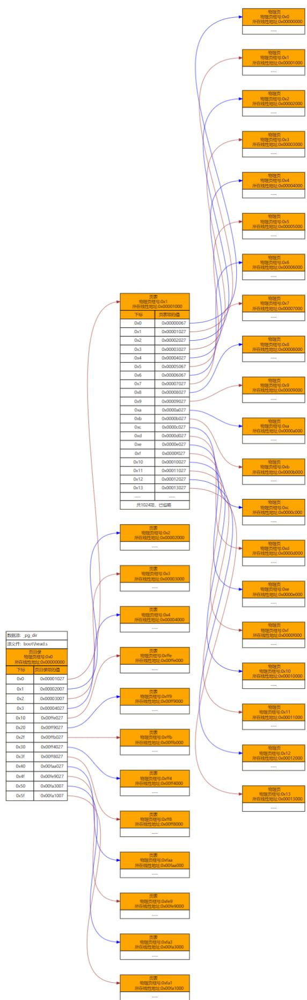


图8-21：二级页表


当代码编写完成并运行成功后，为了将刚刚编写的文件提交到平台，需要按照下面的步骤将这些文件从Linux 0.11操作系统中复制到软盘B，然后再复制到本地。

1. 在Linux 0.11的终端使用下面的命令将刚刚编写的文件loop.c复制到软盘B中。

mcopy loop.c b:loop.c

2. 关闭Bochs虚拟机。

3. 在 VSCode 左侧的“文件资源管理器”窗口顶部点击“New Folder”按钮，新建一个名称为 newapp 的文件夹。在“文件资源管理器”窗口中的 newapp 文件夹节点上点击鼠标右键，选择菜单中的“Reveal in File Explorer”，可以使用 Windows 的资源管理器打开此文件夹所在的位置，双击打开此文件夹。

4. 在 VSCode 的 “Terminal” 菜单中选择 “Run Build Task...”, 会在 VSCode 的顶部中间位置弹出一个可以执行的 Task 列表, 选择其中的 “打开 floppyb.img” 后会使用 Floppy Editor 工具打开该项目中的 floppyb.img 文件, 查看软盘镜像中的文件列表, 确保刚刚编写的文件已经成功复制到软盘镜像文件中。在文件列表中选中 loop.c 文件, 并点击工具栏上的 “复制” 按钮, 然后粘贴到 Windows 的资源管理器打开的 newapp 文件夹中。

# 提交作业

实验结束后先使用 VSCode 左侧的“源代码版本控制窗口”查看文件变更详情，确认无误后再将本地项目提交到平台的个人项目中，方便教师通过平台查看读者提交的作业。

# 3.3 任务（三）：输出应用程序进程的页目录和页表

# 准备实验

使用浏览器登录平台领取本次实验对应的任务，从而在平台上创建个人项目(Linux 0.11 内核项目)，然后使用 VSCode 将个人项目克隆到本地磁盘中并打开。

# 编写代码输出应用程序进程的页目录和页表

为了读者能够对二级页表有一个直观的、整体上的认识，前面的实验过程中主要是通过可视化窗口以图形化的方式展示二级页表。在下面的实验中，会通过编写源代码的方式使一个应用程序将当前进程的二级页表使用文本方式打印出来。读者应该仔细学习这部分源代码，尝试从编程的角度更加深入的理解二级页表的组织方式，并为后面通过共享物理页的方法实现内存共享功能打下基础。请按照下面的步骤进行实验：

1. 添加一个系统调用号为87的系统调用（添加系统调用的方法请参考实验四），该系统调用的内核函数sys_table_mapping可以写在kernel/sys.c文件的末尾。其源代码可以参见“学生包”中本实验对应文件夹下的table.c文件。

2. 在sys_table_mapping函数中调用了一个名称为fprintk的函数用于向标准输出打印信息，而没有使用printk函数，这是由于本实验需要输出的内容较多，需要输出到文件中以便查看，但是printk函数虽然可以在屏幕上进行输出，但是却不能输出到文件中，所以需要实现一个fprintk函数。该函数可以在kernel/printk.c文件中添加，其源代码参见“学生包”中本实验对应文件夹下的fprintk.c文件。还需要在include/linux/kernel.h文件中添加该函数的声明。该函数的第一个参数fd是文件描述符，其值为1时表示将输出的信息写入标准输出stdout。

3. 在sys_table_mapping函数的开始位置还调用了calc_mem函数，此函数会计算内存中空闲页面的数量以及各个页表中映射的物理页的数量并显示。在此调用此函数是为了验证sys_table_mapping函数输出的页目录和页表的数量是否正确。由于函数calc_mem中使用的是printk函数，所以还无法将输出内容保存到文件中，所以需要读者将其替换为fprintf函数。

4. 源代码修改完毕后生成项目，确保没有语法错误和警告。

5. 按F5启动调试，待Linux 0.11完全启动后，使用vi编辑器新建一个main.c文件。编辑main.c文件中的源代码如下：

```c
define _LIBRARY_   
#include <unistd.h>   
#define NR_tableMapping 87   
_syscall0(int, tablemapping)   
int main()   
{ table mapping(); return 0;
```

6. 保存main.c文件后退出vi编辑器，依次执行如下命令：

```batch
gcc main.c -o table  
sync  
table > a.txt
```

7. 通过命令 vi a.txt 打开vi编辑器查看文本内容，分析输出的结果。

有一点需要说明的是，在sys_table Mapping函数中有一行如下的代码：

```python
page_table_base = 0xFFFFFFF000 & entry
```

此行代码的作用是得到一个页表的逻辑地址，其中entry是页目录项，取其中的高20位就可以得到页表的物理地址，而之前的实验中也介绍过，页表的物理地址与其线性地址是相同的，而且在内核模式下段基址为0，所以就可以直接将页表的物理地址作为其逻辑地址了。

请读者参照图8-21验证a.txt文件中的内容。

当代码编写完成并运行成功后，为了将刚刚编写的文件提交到平台，需要按照下面的步骤将这些文件从Linux 0.11操作系统中复制到软盘B，然后再复制到本地。

1. 在Linux 0.11的终端使用下面的命令将刚刚编写的文件main.c复制到软盘B中。

```txt
mcopy main.c b:main.c
```

2. 关闭Bochs虚拟机。

3. 在 VSCode 左侧的“文件资源管理器”窗口顶部点击“New Folder”按钮，新建一个名称为 newapp 的文件夹。在“文件资源管理器”窗口中的 newapp 文件夹节点上点击鼠标右键，选择菜单中的“Reveal in File Explorer”，可以使用 Windows 的资源管理器打开此文件夹所在的位置，双击打开此文件夹。

4. 在 VSCode 的 “Terminal” 菜单中选择 “Run Build Task...”, 会在 VSCode 的顶部中间位置弹出一个可以执行的 Task 列表, 选择其中的 “打开 floppyb.img” 后会使用 Floppy Editor 工具打开该项目中的 floppyb.img 文件, 查看软盘镜像中的文件列表, 确保刚刚编写的文件已经成功复制到软盘镜像文件中。在文件列表中选中 main.c 文件, 并点击工具栏上的 “复制” 按钮, 然后粘贴到 Windows 的资源管理器打开的 newapp 文件夹中。

# 提交作业

实验结束后先使用 VSCode 左侧的“源代码版本控制窗口”查看文件变更详情，确认无误后再将本地项目提交平台的个人项目中，方便教师通过平台查看读者提交的作业。

# 3.4 任务（四）：用共享内存做缓冲区解决生产者—消费者问题

# 准备实验

使用浏览器登录平台领取本次实验对应的任务，从而在平台上创建个人项目(Linux 0.11 内核项目)，然后使用VSCode将个人项目克隆到本地磁盘中并打开。

# 用共享内存做缓冲区解决生产者一消费者问题

读者通过前面的实验内容学习了Linux 0.11管理物理内存的方式，以及使用x86处理器提供的分段功

能和二级页表功能将物理地址映射到逻辑地址的过程。在此基础上，读者可以将一个共享的物理页映射到不同的逻辑地址空间，从而实现在进程间共享内存的方法，进而使用共享内存作为缓冲区来解决生产者一消费者问题。

本实验需要读者在Linux 0.11的内核中添加shmget与shmat两个共享内存的系统调用函数。在“学生包”本实验对应的文件夹下提供了一个sem.c文件，其中包含了信号量的四个系统调用函数（与实验七中的相同），以及共享内存的两个系统调用函数所对应的内核函数sys_shmget和sys_shmat，这里只是实现了一个简化后的版本：即只能将一个物理页映射到不同进程的逻辑地址空间的末尾。请读者仔细阅读其中的源代码，进而理解下面的内容。

系统调用函数shmget的作用是新建或者打开一页共享内存，并将该共享内存的ID返回，其内核函数sys_shmget的原型定义如下：

```txt
int sys_shmget(int key, int size)
```

参数key用来指定标识共享内存的的键值，结合源代码可知key就是vector数组的下标，所以其必须是一个小于数组长度的正整数；参数size用来指定共享内存的大小，由于总是调用get_free_page函数分配一个物理页作为共享内存，所以此参数只是用来进行简单的校验。在函数的最后将物理页的基地址放入由下标key指定的数组项中，并返回物理地址作为ID。

系统调用函数shmat的作用是将由ID指定的共享内存加入到当前进程的二级页表映射中，并返回其逻辑地址，其内核函数sys_shmat的原型定义如下：

```txt
void\*sys_shmat(int shmid, const void \*shmaddr)
```

参数shmid用来指定共享内存的ID，即由shmget函数返回的ID，其实是共享页的物理地址；参数shmaddr在这里没有用到。在这个函数中主要是调用了put_page函数将物理页加入二级页表映射。put_page函数的第一个参数是物理页的基地址，第二个参数是物理页需要映射到的线性地址。为了简单，这里直接将共享的物理页映射到了应用程序的末尾，所以传入的第二个参数是current->start_code + current->brk。其中current->start_code是应用程序代码的起始线性地址，current->brk是应用程序所占内存的长度。由于sys_shmat函数需要返回共享内存的逻辑地址，而且应用程序在用户态时，其段基址与代码的起始地址相同，即current->start_code在应用程序空间的逻辑地址为0，所以current->brk就是需要返回的逻辑地址。

请读者按照下面的步骤完成本实验：

1. 将sem.c文件中的四个信号量的系统调用和两个共享内存的系统调用添加到内核中。添加系统调用的方法可以参考实验四和实验七，具体步骤这里不再详细说明。

2. 生成项目，确保没有语法错误和警告。

3. 将“学生包”本实验文件夹下的pc.c文件放入软盘B中。

4. 按 F5 启动调试。使用 mcopy 工具将软盘 B 中的 pc.c 文件复制到硬盘的当前目录。

5. 使用命令 vi pc.c 打开源代码文件，这些源代码仍然是使用文件作为生产者和消费者之间的共享缓冲区，请读者在此基础上将其修改为使用共享内存作为缓冲区。

# 提示：

- 在应用程序中定义共享内存系统调用函数的调用号和函数时，可以参考下面的代码：

```txt
define NR_shmget 91   
#define NR_shmat 92   
_syscall2(int, shmget, int, key, int, size)   
_syscall2(int, shmat, int, shmid, const void*, shmaddr)
```

- 在生产者进程和消费者进程中都需要分别调用 shmget 和 shmat 函数来得到共享内存的起始地址，可以参考下面的代码：

```txt
shmid = shmget(key, 4096);  
startaddress = shmat(shmid, NULL);
```

6. 代码修改完毕后，退出 vi 编辑器。

7. 在Linux中依次执行下面的命令，运行app:

```batch
gcc pc.c -o app sync   
app
```

如果应用程序执行的结果与实验七中的图7-1显示的结果一致，就说明读者使用共享内存作为缓冲区成功解决了生产者—消费者问题。

此应用程序执行到最后会出现错误提示“trying to free free page”，这是由于sys_shmget函数在使用get_free_page函数申请到一个物理页时，将此物理页在mem_map中记录的引用计数设置为1，而再次调用sys_shmget函数使用key从vector中获取共享的物理页时，没有增加此物理页在mem_map中的引用计数。所以，当生产者进程和消费者进程退出时，都会调用free_page函数释放此物理页，每调用一次就会将mem_map中的引用计数减1，导致一个物理页的引用计数被减为了负数，这是Linux物理页管理程序所不允许的，所以执行了mm/memory.c中free_page函数的最后一行（第310行）代码打印出错信息。请读者改进sys_shmget函数，当能够使用key从vector中获取共享的物理页时，将此物理页在mem_map中的引用计数增加1即可。

当代码编写完成并运行成功后，为了将刚刚编写的文件提交到平台，需要按照下面的步骤将这些文件从Linux 0.11操作系统中复制到软盘B，然后再复制到本地。

1. 在Linux 0.11的终端使用下面的命令将刚刚编写的文件pc.c复制到软盘B中。

```txt
mcopy pc.c b:pc.c
```

2. 关闭Bochs虚拟机。

3. 在 VSCode 左侧的“文件资源管理器”窗口顶部点击“New Folder”按钮，新建一个名称为 newapp 的文件夹。在“文件资源管理器”窗口中的 newapp 文件夹节点上点击鼠标右键，选择菜单中的“Reveal in File Explorer”，可以使用 Windows 的资源管理器打开此文件夹所在的位置，双击打开此文件夹。

4. 在 VSCode 的 “Terminal” 菜单中选择 “Run Build Task...”, 会在 VSCode 的顶部中间位置弹出一个可以执行的 Task 列表, 选择其中的 “打开 floppyb.img” 后会使用 Floppy Editor 工具打开该项目中的 floppyb.img 文件, 查看软盘镜像中的文件列表, 确保刚刚编写的文件已经成功复制到软盘镜像文件中。在文件列表中选中 pc.c 文件, 并点击工具栏上的 “复制” 按钮, 然后粘贴到 Windows 的资源管理器打开的 newapp 文件夹中。

# 提交作业

实验结束后先使用 VSCode 左侧的“源代码版本控制窗口”查看文件变更详情，确认无误后再将本地项目提交到平台的个人项目中，方便教师通过平台查看读者提交的作业。

# 四、思考与练习

1. 请读者认真体会本实验中关于将逻辑地址映射为线性地址，线性地址映射为物理地址的过程，尝试列出映射过程中最为重要的几步。

2. 在本实验第3.2节的loop程序退出后，如果读者接着再运行一次，并再次进行地址跟踪，会发现有哪些异同？尝试说明原因？

3. 使用下面的代码在Linux 0.11内核中写一个系统调用函数，并在Linux 0.11的应用程序中调用此函数，然后仿照本实验第3.2节的内容跟踪变量i的逻辑地址、线性地址、物理地址的映射过程，最后通过将物理内存中变量i的值修改为0的方式使应用程序退出。体会Linux内核地址映射过程与3.2节中Linux应用程序地址映射过程的异同。

```txt
volatile int i = 0x12345678;  
void sys_testg()
```

```txt
{   
printk("The logical/virtual address of i is 0x%08x\n", &i); while(i) ;   
}
```

注意，在定义变量i时使用“volatile”关键字目的是防止编译器对其进行优化，否则i的值会被拷贝到寄存器中，而通过Bochs调试命令修改的是内存中i的值，不是寄存器中的值，就会导致程序无法退出死循环。

4. 将上一个练习中的变量 i 修改为 sys_testg 函数内的局部变量，仍然通过将物理内存中变量 i 的值修改为 0 的方式使应用程序退出。请读者结合 Linux 0.11 内核的逻辑地址空间的内存布局，体会内核中的全局变量与局部变量在逻辑地址空间中的位置有什么不同。

5. 将本实验3.4中的Linux 0.11应用程序修改为一个生产者与多个消费者使用共享内存作为缓冲区的情况。（提示：关键是需要将多个消费者从缓冲池中取产品的游标放入共享内存中的适当位置，从而实现游标的共享。）

6. 在本实验3.4中遇到了共享的物理页被多个进程重复释放，导致操作系统报告错误并中断运行的问题，暂时是通过在申请共享的物理页时增加物理页在mem_map中的引用计数来解决的。请读者换一个思路，通过实现一个简化版本的关闭共享内存的系统调用函数shmdt来解决此问题，其函数原型可以为：void shmdt(int key, const void* startaddr)

参数key是共享内存的键值，即为共享内存数组的下标；参数startaddr是共享内存的逻辑地址。在每个生产者进程和消费者进程退出前，都必须调用此函数关闭共享内存，最终确保无论是一个生产者与一个消费者同步运行，还是一个生产者与多个消费者同步运行都不会再出现应用程序退出时操作系统报告错误的情况。

# 提示：

1）读者需要实现一个将共享的物理页从当前进程的二级页表映射中移除的内核函数，其原型可以为：void cancel Mapping(const void* linearaddr)

参数linearaddr是需要取消映射的物理页的线性地址，根据此线性地址找到对应的页表项，然后将页表项置为0即可。

2）之前的源代码中只是用全局的vector数组保存了共享内存的物理页的基址，现在需要为共享内存定义一个结构体，其中除了保存物理页的基址外，还需要保存共享内存的引用计数（可以参考信号量的引用计数），再使用此结构体定义一个全局的共享内存数组。当进程调用shmdt函数关闭共享内存时，首先将共享内存的引用计数减1，然后调用cancel_mapping函数将共享的物理页从二级页表映射中移除。由于shmdt的第二个参数startaddr是共享内存的逻辑地址，需要为其加上current->start_code转换为线性地址后，才能作为cancel_mapping函数的参数。最后，判断如果共享页的引用计数的值大于0，说明仍然有其他进程在使用此共享内存，就结束（不释放物理页）；否则，需要调用free_page函数释放物理页（只释放这一次）。

7. 假设一台使用x86处理器的物理裸机有4GB的物理内存，如果读者需要设计一个操作系统，要求在操作系统初始化的时候使用全局描述符表将代码段和数据段的段基址设定为0，段界限为4GB，然后将所有物理内存使用二级页表映射到线性地址空间，并且确保内存的物理地址与线性地址一致。请读者说明在完成初始化后，全局描述符表中有几个描述符，各个描述符的值是多少？CS、DS寄存器的值是多少？页目录的物理页框号是多少？页目录中1024个页表项的值可能是多少？第一个页表中1024个页表项的值可能是多少？页目录和页表一共占用了多少个物理页？

# 实验九 页面置换算法与动态内存分配

实验性质：验证、设计

建议学时：2学时

任务数：3个

实验难度：★★★★☆

# 一、实验目的

$\bullet$  掌握OPT、FIFO、LRU、LFU、Clock等页面置换算法；

$\bullet$  掌握可用空间表及分配方法；

$\bullet$  掌握边界标识法以及伙伴系统的内存分配方法和回收方法。

# 二、预备知识

# 页面置换算法

请求分页虚存管理的实现原理是：把作业的所有分页副本存放在磁盘中，当它被调度投入运行时，先把当前需要的页面装入内存，之后根据程序运行的需要，动态装入其他页面；当内存空间已满，而又需要装入新页面时，根据某种算法淘汰某个页面，以便装入新页面。因此，在页表中必须说明哪些页已在内存，存在什么位置；哪些页不在内存，它们的副本在磁盘中的什么位置。还可以设置页面是否被修改过，是否被访问过，是否被锁住等标志供淘汰页面算法使用。

在地址映射过程中，若页表中发现所要访问的页不在内存，则产生缺页异常，操作系统接到此信号后，就会调用缺页异常处理程序，根据页表中给出的磁盘地址，将该页面调入内存，使作业继续运行下去。如果内存中有空闲页，则分配一个页，将新调入页面装入，并修改页表中相应页表项的驻留位以及相应的内存块号；若此时内存中没有空闲页，则要淘汰某页面，若该页在此期间被修改过，还要将其写回磁盘，这个过程称为页面替换。

# 动态内存分配

在动态存储管理系统中，开始时，整个内存区是一个“空闲块”。随着作业进入系统，先后提出申请存储空间的请求，系统则依次进行分配。因此，在系统运行的初期，整个内存区基本上分隔成两大部分：低地址区包含若干占用块；高地址区是一个“空闲块”。经过一段时间以后，有的作业运行结束，它所占用的内存区在释放后变成空闲块，这就使整个内存区呈现出占用块和空闲块犬牙交错的状态。

如果又有新的作业进入系统请求分配内存，通常有两种做法：一种策略是系统继续从高地址的空闲块中进行分配，而不理会已分配给用户的内存区是否已空闲，直到分配无法进行时，系统才回收所有作业不再使用的空闲块，并且重新组织内存，将所有空闲的内存区连接在一起成为一个大的空闲块。另一种策略是作业一旦运行结束，便将它所占内存区释放成为空闲块，同时，每当新的作业请求分配内存时，系统需要巡视整个内存区中所有空闲块，并从中找出一个“合适”的空闲块分配之。由此，系统需建立一张记录所有空闲块的“可利用空间表”，此表的结构可以是“目录表”，也可以是“链表”。

根据系统运行的不同情况，可利用空间表可以有3种不同的结构形式：第一种情况是系统运行期间所有作业请求分配的存储块大小相同；第二种情况是系统运行期间作业请求分配的存储块有若干种大小的规格；第三种情况是系统在运行期间分配给作业的内存块的大小不固定，可以随请求而变。

由于可利用空间表中的结点大小不同，则在分配时有3种不同的分配策略：(1)首次拟合法；（2）最佳拟合法；（3）最差拟合法。

# 三、实验内容

在Linux 0.11内核中还没有实现虚拟内存的管理，当然也就不存在页面置换算法，如果读者直接在Linux 0.11内核中添加虚拟内存管理，或者修改Linux 0.11内核的动态内存分配方法又会比较复杂，所以读者可以先根据本实验的内容，通过编写Windows控制台应用程序的方式来模拟实现页面置换算法和动态内存分配。待读者对相关内容有一定的理解后，可以考虑完成本实验后面的思考与练习题目，加深对页面置换算法和动态内存分配的理解。

# 3.1 任务（一）：页面置换算法

# 3.1.1 准备实验

使用浏览器登录平台领取本次实验对应的任务，从而在平台上创建个人项目（Windows控制台程序），然后使用VSCode将个人项目克隆到本地磁盘中并打开。

# 3.1.2 查看最佳页面置换算法(OPT)和先进先出页面置换算法(FIFO)的执行过程

# 最佳页面置换算法

当需要换出一个页面时，淘汰那个以后不再需要的或最远的将来才会用到的页面。

# 先进先出页面置换算法

当需要换出一个页面时，淘汰那个最先调入主存的页面，或者说在主存中驻留时间最长的那一页。

仔细阅读 main.c 中的源代码和注释，查看 OPT 和 FIFO 页面置换算法是如何实现的。其中，在 main 函数中定义了一个数组 PageNumofR[] 来存放页面号引用串，定义了一个指针 *BlockofMemory 指向一块存放页面号的内存块。依次将数组 PageNumofR[] 中的页面装入内存，根据不同的页面置换算法淘汰内存中的页面。

按照下面的步骤查看 OPT 和 FIFO 的执行过程：

1. 选择 VSCode 的 “Terminal” 菜单中的 “Run Build Task...” 菜单项, 在弹出的列表中选择 “生成项目 (make)”, 可以生成应用程序项目, 确保没有语法上的错误。

2. 选择“Run”菜单中的“Run Without Debugging”菜单项运行程序（或者按快捷键 Ctrl+F5），在 VSCode 底部的“Terminal”窗口中会输出运行的结果，可以查看 OPT 和 FIFO 算法的执行过程，其中，“#”表示未引用的内存块。执行结果如图 9-1 所示。

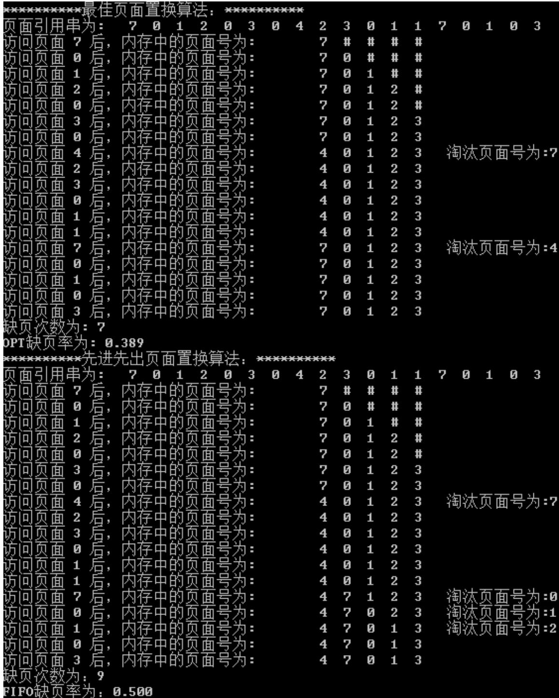


图9-1：OPT和FIFO页面置换算法的执行结果


# 3.1.3 完成最近最久未使用页面置换算法(LRU)

# 最近最久未使用页面置换算法

当需要换出一个页面时，淘汰那个在最近一段时间里较久未被访问的页面。它是根据程序执行时所具有的局部性来考虑的，即那些刚被使用过的页面可能马上还要被使用，而那些在较长时间里未被使用的页面可能不会马上被使用。

仔细阅读 main.c 中的源代码，并仿照已经实现的 OPT 和 FIFO 算法来实现最近最久未使用页面置换算法 (LRU)。正确实现 LRU 算法后的执行结果应该如下图所示。

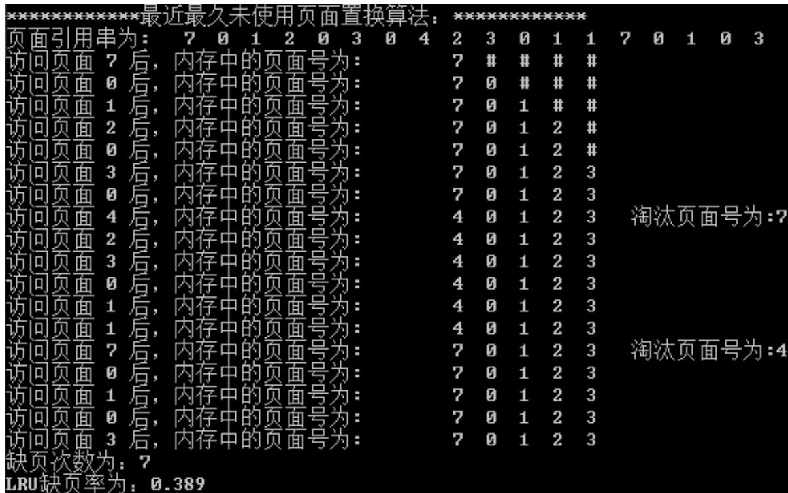


图9-2：LRU页面置换算法的执行结果


如果程序中存在逻辑错误，可以在 main.c 文件中添加断点，然后选择“Run”菜单中的“Start Debugging”菜单项启动调试（或者按快捷键 F5），通过逐语句或者逐过程调试，进一步定位逻辑错误的位置。

有兴趣的读者还可以使尝试写出最不常用页面置换算法(LFU)和页面缓冲置换算法(PBA)，以及CLOCK页面置换算法等。下面是这三种页面置换算法的实现原理。

# 最不常用页面置换算法

如果对应每个页面设置一个计数器，每当访问一页时，就使它对应的计数器加1.过一定时间后，将所有计数器全部清0.当发生缺页异常时，可选择计数值最小的对应页面淘汰，显然它是在最近一段时间里最不常用的页面。

# 页面缓冲置换算法

页面缓冲置换算法与先进先出 FIFO 算法有些相似，置换策略与 FIFO 一样，即将内存中最先进的页面置换出来。与 FIFO 不同的是，根据被置换出来的页面被放入两个链表中，分别是空闲链表和已修改链表。等下次需要访问页面时，如果在链表中有，则只需将链表中的页面调入内存即可。

# CLOCK页面置换算法

使用页表中的“引用位”，把进程已调入主存的页面链接成循环队列，用指针指向循环队列中下一个将被替换的页面，形成类似于钟表面的环形表，队列指针相当于钟表面上的表针，这就是时钟页面置换算法的得名。

# 3.1.4 提交作业

实验结束后先使用 VSCode 左侧的“源代码版本控制窗口”查看文件变更详情，确认无误后再将本地项目提交到平台的个人项目中，方便教师通过平台查看读者提交的作业。

# 3.2 任务（二）：动态内存分配－边界标识法

# 3.2.1 准备实验

使用浏览器登录平台领取本次实验对应的任务，从而在平台上创建个人项目（Windows控制台程序），然后使用VSCode将个人项目克隆到本地磁盘中并打开。

# 3.2.2 边界标识法的设计实现

边界标识法是操作系统中用以进行动态分区分配的一种存储管理方法。系统将所有的空闲块链接在一个双重循环链表结构的可利用空间表中；分配可按首次拟合进行，也可按最佳拟合进行。系统的特点在于：在每个内存区的头部和底部两个边界上分别设有标识，以标识该区域为占用块或空闲块，使得在回收用户

释放的空闲块时易于判别在物理位置上与其相邻的内存区域是否为空闲块，以便将所有地址连续的空闲存储区组合成一个尽可能大的空闲块。

# 分配算法

可以采用首次拟合法进行分配，即从表头指针所指节点起，在可利用空间表中进行查找，找到第一个容量不小于请求分配的存储量的空闲块时，即可进行分配。

# 回收算法

一旦作业释放占用块，系统需立即回收以备新的请求产生时进行再分配。为了使地址相邻的空闲块结合成一个尽可能大的节点，则首先需要检查刚释放的占用块的左、右邻居是否为空闲块。若释放块的左、右邻居均为占用块，则处理最为简单，只要将此新的空闲块作为一个结点插入到可利用空闲表中即可；若只有左邻居是空闲块，则应与左邻区合并成一个结点；若只有右邻居是空闲块，则应与右邻区合并成一个结点；若左右邻居都是空闲块，则应将3块合起来成为一个结点留在可利用空间表中。

# 编程实现

仔细阅读 main.c 中的源代码及注释，阅读时着重注意以下几点：

- 定义 ALLOC_MIN_SIZE 的目的是为了防止在多次分配以后链表中出现一些极小的、总也分配不出去的空闲块；

可利用空间表的节点结构 typedef struct Bound{ structBound \*preLink;//头部域前驱 structBound \*upLink;//尾部域，指向结点头部 inttag;//0标示空闲,1表示占用 int size;//仅仅表示可用空间，不包括头部和尾部空间 structBound \*nextLink;//头部后继指针. } \*Space;

- 定义了userSpace[]数组来存放已分配区表；

- allocBoundTag 函数是采用首次适应算法分配内存的。

- 回收内存函数 reclaimBoundTag在回收内存时要将回收的块与空闲分区中的左右邻居进行比较，在允许的情况下进行合并。

- SetColor 是设置字体的函数，可以使输出结果更加醒目。

按照下面的步骤查看边界标识法的实现过程：

1. 选择“Terminal”菜单中的“Run Build Task...”菜单项，在弹出的列表中选择“生成项目(make)”，可以生成应用程序项目，确保没有语法上的错误。

2. 选择“Run”菜单的“Run Without Debugging”菜单项运行程序(或者按快捷键F5)，在“Terminal”窗口中可以查看运行结果。其提供的功能项如下图所示：

选择功能项：<0-退出 1-分配主存 2-回收主存 3-显示主存>

图9-3：边界标识法的功能项

程序启动后会停留在此界面等待用户输入功能项序号0-3中的一个。系统会根据用户输入的序号执行相应的功能，然后继续停留在此界面等待用户的输入，直到用户按0退出应用程序。

例如，首先使用功能3查看当前内存的分配情况，然后使用功能1，输入内存长度20来分配内存，接着分配长度为30和500的内存，然后使用功能3查看内存的分配情况，如图9-4所示。如果已分配的内存达到内存的最大值时，再次分配内存时，系统会提示“无法继续分配内存”。当然还可以使用功能2来回收内存（注意：在释放内存时，首地址的输入使用十六进制）。如果要回收的内存左右有空闲区，就会与之合并，否则就作为一个结点插入到可利用空间表中，如图9-5所示。读者可在使用这些功能的同时，加深对程序的理解。

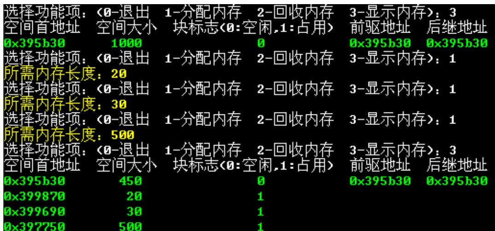


图9-4：分配内存


图9-5：回收内存


# 练习

a) 释放之前分配的大小为 500 和 30 的内存块，说明在释放这两个块时，分别属于哪种回收内存的情况。

b) 重新运行程序后尝试执行下面的操作：

1、使用功能 1 先分配空间大小为 880 的内存块，再分配空间大小为 120 的内存块，然后使用功能 3 查看内存的情况，此时已将所有的内存空间都分配完。

2、使用功能 2 回收内存，先回收空间大小为 120 的内存块，接着回收空间大小为 880 的内存块，这时会进行合并左块的操作，使用功能 3 查看内存的显示情况，可以看到内存已经正确回收。

3、重复步骤 1, 但是此次先回收空间大小为 880 的内存块, 然后回收空间大小为 120 的内存块, 这时会进行合并右块的操作, 由于在合并右块的代码中存在缺陷, 在回收空间大小为 120 的内存块时会导致程序崩溃, 请读者修改合并右块的相关代码, 使之可以正常合并右块。

c) 目前allocBoundTag函数在分配空间时，采用的是首次适应算法，请读者尝试采用循环首次适应算法和最佳适应算法分别实现边界标识法。

# 3.2.3 提交作业

实验结束后先使用 VSCode 左侧的“源代码版本控制窗口”查看文件变更详情，确认无误后再将本地项目提交到平台的个人项目中，方便教师通过平台查看读者提交的作业。

# 3.3 任务（三）：动态内存分配-伙伴系统

# 3.3.1 准备实验

使用浏览器登录平台领取本次实验对应的任务，从而在平台上创建个人项目（Windows控制台程序），然后使用VSCode将个人项目克隆到本地磁盘中并打开。

# 3.3.2 伙伴系统的设计实现

伙伴系统是操作系统中用到的另一种动态存储管理方法。它和边界标识法类似，当用户提出申请时，分配一块大小“恰当”的内存区给用户；反之，在用户释放内存区时即回收。所不同的是，在伙伴系统中，

无论是占用块或空闲块，其大小均为2的k次幂（k为某个正整数）。例如：当用户申请n个字节的内存区时，分配的占用块大小为  $2^{\mathrm{k}}$  个字节（ $2^{\mathrm{k} - 1} < \mathrm{n} \leqslant 2^{\mathrm{k}}$ ）。由此，在可利用空间表中的空闲块大小也只能是2的k次幂。

# 分配算法

当用户提出大小为  $n$  个字节的内存请求时，首先在可利用表上寻找节点大小与  $n$  相匹配的子表，若此子表非空，则将子表中任意一个结点分配之即可；若此子表为空，则需从更大的非空子表中去查找，直至找到一个空闲块，则将其中一部分分配给用户，而将剩余部分插入相应的子表中。

# 回收算法

在回收空闲块时，应首先判断其伙伴是否为空闲块，若否，则只要将释放的空闲块简单插入在相应子表中即可；若是，则需在相应子表中找到其伙伴并删除之，然后再判断合并后的空闲块的伙伴是否是空闲块。依此重复，直到归并所得空闲块的伙伴不是空闲块时，再插入到相应的子表中去。

# 编程实现

仔细查看 main.c 中的源代码及注释，并按照后面练习的要求实现回收算法。

阅读代码时请注意以下几点：

$\bullet$  伙伴系统可利用空间表的结构体

```c
typedef struct Node{ struct Node \*llink; //指向前驱节点 int bflag; //块标志，0：空闲，1：占用 int bsize; //块大小，值为2的幂次k struct Node \*rlink; //指向后继节点 }Node; 可利用空间表的头结点的结构体 typedef struct HeadNode{ int nodesize; //链表的空闲块大小 Node \*first; //链表的表头指针 }FreeList[M+1];
```

- AllocBuddy函数的功能是实现分配算法，分配空闲块以后，还需要将剩余块插入相应的子表中。

- Reclaim函数的功能是实现回收算法，在回收内存时，需要先查找其伙伴是否为空闲块。如果没有空闲块，则只要将释放的空闲块简单插入相应的子表中即可；如果有空闲块，则需在相应子表中找到其伙伴并删除之，然后继续判断合并后的空闲块的伙伴是否是空闲块。依此重复，直到所得的空闲块的伙伴不是空闲块时为止，最后插入到相应的子表中去。

该程序提供的功能项如图9-6所示。例如，选择功能1分配内存，然后输入作业所需内存长度16，执行完后再使用功能3查看内存分布情况，如图9-7。

选择功能项：<0-退出 1-分配主存 2-回收主存 3-显示主存>

图9-6：伙伴系统运行的结果

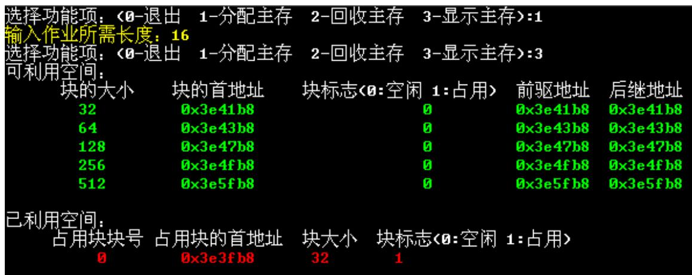


图9-7：申请内存块后的内存分布情况


# 练习

请读者编程实现伙伴系统的内存回收算法。完成算法后，可以按照下面的案例进行测试：

a) 先分配一个大小为 20 的内存块, 然后使用功能 3 可以看到刚刚分配的内存块在已利用空间中的块号为 0 , 接下来回收块号为 0 的内存块, 会导致所有的空闲块归并为一个空闲块。此时查看内存的显示情况, 如图 9-8 所示, 在可利用空间显示了一个内存块。


图9-8：回收内存块后的内存分布情况


b) 连续分配 5 次块大小为 20 的内存块，查看内存的显示情况，然后按照下面的顺序回收内存块，回收块号为 0 的内存块、回收块号为 2 的内存块、回收块号为 1 的内存块、回收块号为 3 的内存块、回收块号为 4 的内存块，并在每次回收之后查看内存的显示情况，如图 9-9 和图 9-10 所示，完成所有的内存块回收之后，可利用空间恢复为一个内存块。

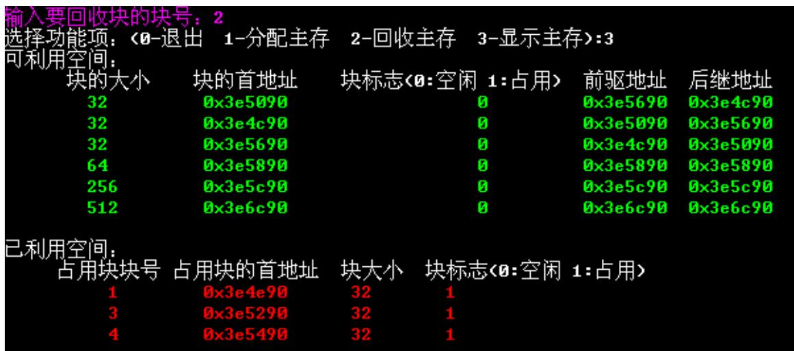


图9-9：回收块号为2的内存块后的分布情况


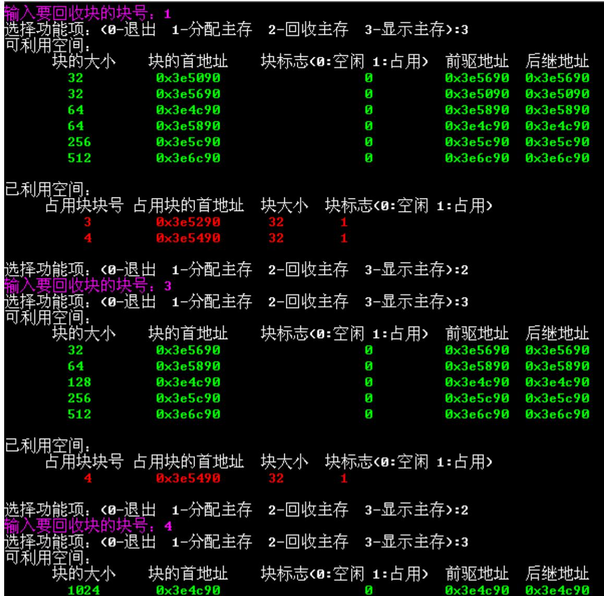


图9-10：回收块号为1、3、4的内存块后的分布情况


# 四、思考与练习

1. 当前实现的伙伴系统内存分配算法存在缺陷，如果所需内存长度为 16，根据在伙伴系统算法，无论是占用块或空闲块，其大小均为 2 的 k 次幂，16 是 2 的 4 次幂，所有分配长度为 16 的内存即可，当前实现的分配算法中分配了长度为 32 的内存，造成了内存的浪费，请读者改进伙伴系统的分配算法，当所需内存长度为 2 的 k 次幂时，直接分配相同大小的内存空间即可。

2. 在Linux 0.11内核项目中，打开lib/malloc.c文件，仔细阅读其中的源代码及注释，查看一下linux 0.11系统动态分配和回收内存的方法。其使用的方法与本实验介绍的边界标识法和伙伴关系法不同。请读者尝试分别用边界标识法和伙伴系统算法来修改malloc函数和free函数来修改系统的动态分配内存和回收内存的方法。

3. x86 平台为实现改进型的 Clock 页面置换算法提供了硬件支持，它实现了二级映射机制，它定义的页表项的格式如下：

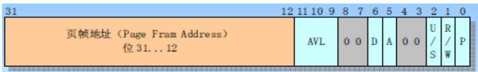


图9-11：页目录和页表中的表项的格式


其中位5是访问标志，当处理器访问页表项映射的页面时，页表表项的这个标志就会被置为1。

位6是页面修改标志，当处理器对一个页面执行写操作时，该项就会被置为1。

在Linux 0.11的内核中写一个系统调用函数来实现改进型的Clock页面置换算法的模拟。参考实验八的第3.5节，在此函数中将二级映射表打印出来，然后实现一个算法来根据页表项中的访问位和修改位计算出应该置换出的页面。在此函数中不必完全实现Clock页面置换算法，只要能判断出应该置换的页面即可。再编写一个Linux 0.11应用程序，在应用程序中调用此系统调用函数。

# 实验十 字符显示的控制

实验性质：验证

建议学时：2学时

任务数：2个

实验难度：★★★☆☆

# 一、实验目的

- 加深对操作系统设备管理基本原理的认识，掌握键盘中断、扫描码等概念；

- 掌握Linux对键盘设备和显示器终端的处理过程。

# 二、预备知识

操作系统管理的设备可以按照信息交换的单位分为字符设备（Character Device）和块设备（Block Device）。字符设备以字节为单位，而块设备以块为单位（块大小通常为512或1024字节）。终端是一种典型的字符设备，它具有多种类型，通常使用tty来简称各种类型的终端设备。tty是Teletype的缩写，Teletype是一种由Teletype公司生产的最早出现的终端设备，外观很像电传打字机。在Linux 0.11内核中使用tty_struct结构体定义终端设备，主要用来保存终端设备当前的参数设置、所属的前台进程组ID和字符ID缓冲队列等信息。结构体tty_struct在include/linux/tty.h文件的第65行定义如下：

```c
struct tty_struct {
    struct termios termios;
    int pgrp;
    int stopped;
    void (*write)(struct tty_struct *tty);
    struct tty_queue read_q;
    struct tty_queue write_q;
    struct tty_queue secondary;
};
```

其中的三个队列（典型的环形缓冲区）是本实验最关心的。读缓冲队列read_q用于临时存放从键盘或串行终端输入的原始字符序列；写缓冲队列write_q用于存放写到显示设备或串行设备去的数据；辅助队列secondary用于存放从read_q中取出的经过行规则程序处理(过滤)过的数据。

Linux 0.11内核使用tty_struct结构体定义了一个数组tty_table[]用来保存操作系统中每个终端设备的信息。通常支持三个终端，其中数组的第0项是控制台终端tty0，包括显示设备和键盘设备；接下来的两项是串行设备终端tty1和tty2。

在init/main.c文件的第228行有以下几行源代码：

(void)open(“/dev/tty0”, 0 RDWR, 0); //用读写访问方式打开设备“/dev/tty0”，

//相当于stdin标准输入设备

(void) dup(0); //复制句柄，产生句柄1号---stdout标准输出设备

(void) dup(0); //复制句柄，产生句柄2号----stderr标准出错输出设备

可以看到，在Linux 0.11应用程序中使用的标准输入stdin（值为0）、标准输出stdout（值为1）和标准错误stderr（值为2）都是终端设备tty0的句柄。

# 环形缓冲区（Ring Buffer）

终端设备tty用到的三个队列“读队列”、“辅助队列”和“写队列”都是环形缓冲区，它们使用结构体tty_queue来定义（在文件include/linux/tty.h第23行定义）。环形缓冲区本质上是一个特殊版本的先

进先出队列。在一块连续的内存中无法定义出一个真正的环形缓冲区（首尾相接），但是环形缓冲区可以通过定义头指针和尾指针，并让他们在缓冲区的范围内循环移动的方式来实现环形缓冲区。环形缓冲区的一个显著特性是：当一个元素被删除后，其余元素不需要移动其存储位置。请读者认真学习tty.h中定义的tty_queue结构体，以及后面定义的用来控制环形缓冲区操作的宏函数。

详细内容请读者阅读《Linux内核完全注释》第4.6节，第5.4节以及第10章的内容，附录2提供了ASCII码表，附录5提供了第1套键盘扫描码。

# 三、实验内容

本实验首先引导读者调试Linux 0.11内核中键盘中断服务程序的执行过程和显示字符的方式，从多个层面上帮助读者理解终端设备tty0的工作原理。然后修改Linux 0.11的键盘设备和显示设备处理代码，对键盘输入和字符显示进行非常规的控制：在Linux 0.11刚启动时，一切如常；当按一次F12后，向终端输出的所有字母和数字都会被替换为“*”字符；再按一次F12后，又恢复正常；第三次按F12后，再进行替换，依此类推。通过这个替换字符的实验，读者可以对Linux 0.11通过tty0终端对键盘设备和显示设备的管理方式有一个更直观的认识。最后，在之前实验的基础上，继续实现一个贪吃蛇游戏。

# 3.1 任务（一）：字符显示的控制

# 准备实验

使用浏览器登录平台领取本次实验对应的任务，从而在平台上创建个人项目(Linux 0.11 内核项目)，然后使用 VSCode 将个人项目克隆到本地磁盘中并打开。

# 调试键盘中断服务程序的执行过程和显示字符的方式

键盘设备是一种典型的中断驱动的设备，在kernel/chr_drv/console.c文件中的第843行定义了一个con_init函数，负责为键盘中断设置一个中断服务程序，请读者自行查找一下这个con_init函数是如何在Linux 0.11内核的初始化过程中被调用的。

每当键盘设备上的一个键被按下或者弹起时就会触发一次键盘中断，键盘中断服务程序 keyboard_interrupt 就会被调用。keyboard_interrupt 函数是一个汇编函数，源代码文件 kernel/chr_drv/keyboard.s 的第 73 行是此函数的入口点。当此函数被调用时，寄存器 EAX 中保存了键盘的扫描码。

读者可以按照下面的步骤调试键盘中断服务程序的执行过程：

1. 在kernel/chrdrv/keyboard.s文件的第89行和第109行分别添加一个断点。第89行是响应键盘中断并调用按键处理程序的位置，通常情况下，按键处理程序会将键盘扫描码转换为使用ASCII码表示的字符，然后将字符放入tty0设备的读队列（read_q）中。第109行调用do_tty_interrupt函数将tty0设备读队列（read_q）中的字符复制成规范模式字符，然后存放在tty0设备的辅助队列（secondary)中。

2. 生成项目，然后按F5启动调试。

3. 待Linux 0.11完全启动后，在Bochs的Display窗口上按键盘上的键A，就会在刚刚添加的第一个断点处中断。

4. 在VSCode中选择“View”菜单中的“Run”，在左侧打开调试窗口，在此窗口中展开Registers中的CPU，查看此时eax寄存器的值为0x1E，即为按键A的接通码。

5. 如果可视化窗口没有打开, 可以在 VSCode 的 “View” 菜单中选择 “Command Palette...”, 会在 VSCode 的顶部中间位置显示命令面板, 输入 “Lab: New Visualizer View” 命令后, VSCode会在其右侧弹出一个窗口让读者查看可视化视图。在右侧可视化视图顶部的编辑框中输入命令 “#ttyr” 后按回车, 可以看到在 “读队列” read_q 中, 还没有写入字符 “a”。在右侧可视化视图顶部的编辑框中输入命令 “#ttyss” 后按回车, 可以看到在 “辅助队列” secondary 中, 也没有写入字符 “a”。在右侧可视化视图顶部的编辑框中输入命令 “#ttyw” 后按回车, 可以看到在 “写队列” write_q 中, 写入的内容正是在Linux 0.11在启动过程中输出到屏幕（Bochs的Display窗口）的内容, 如

图10-1所示。

6. 读者也可以将全局变量“tty_table”添加到“WATCH”窗口中查看tty_table[0]中各个队列的数据，应该与可视化视图中的数据是一致的。

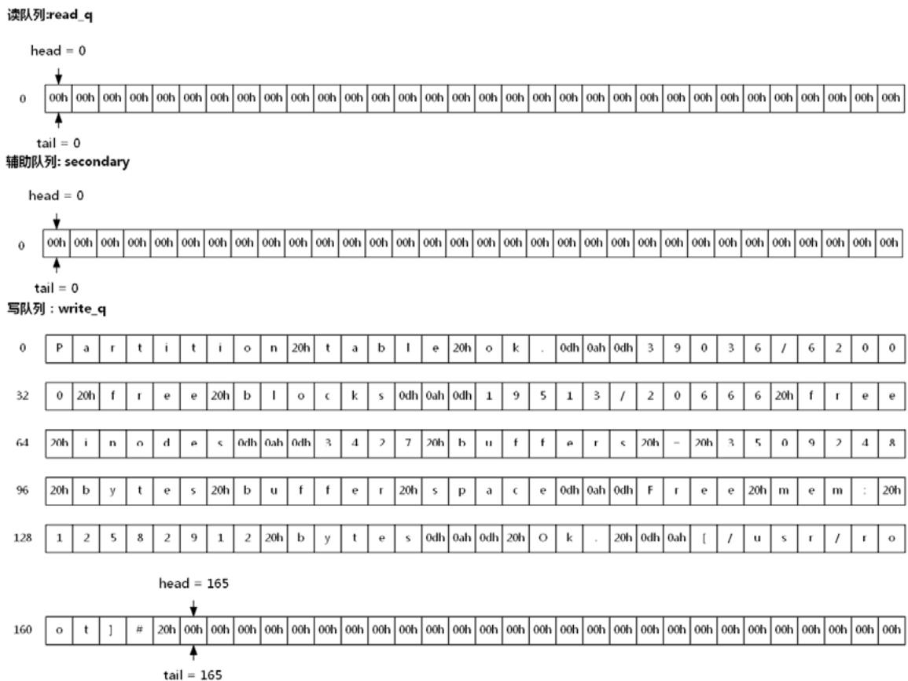


图10-1：“读队列”与“写队列”


7. 按F11单步调试，会进入由key_table表中第0x1E项所指向的键盘处理函数do_self。

8. 按F10单步调试，直到在第384行停止。第381和第383行会使用键盘扫描码0x1E作为key_map映射表的的索引值，取对应的ASCII码，并放入al寄存器中。此时在左侧的“VARIABLES”窗口，展开Registers中的CPU，查看此时eax寄存器的值为0x61，即为字符“a”的ASCII码。

9. 按F10单步调试，直到在第412行停止。此行的put_queue函数将会把al寄存器中的字符放入tty0设备的读队列（read_q）中。

10. 按F5继续调试，会在keyboard.s文件的第109行的断点处中断，准备调用do_tty_interrupt函数，此时，在右侧可视化视图顶部的编辑框中输入命令“#tty”后按回车，可以看到在“读队列”中字符“a”已经入队。

11. 按F11进入do_tty_interrupt函数。可以看到该函数只是调用了copy_to_cooked函数。此时，将鼠标移动到函数参数tty上，会显示参数tty的值为0，说明指定的是序号为0的tty设备。

12. 按F11进入copy_to_cooked函数。将变量“tty”添加到“WATCH”窗口，可以看到tty0设备的三个队列中的数据。请读者自己分析一下这些数据。

13. 按F10单步调试, 直到在第199行停止。其中第195行是从tty0的读队列队尾获取一个字符到变量c。此时, 将鼠标移动到源代码中变量c的名称上, 会显示变量c的值为97 (0x61), 即为字符 “a” 的 ASCII码。

14. 按F10单步调试, 直到在第303行停止。在此调试过程中有若干个if语句, 由于字符 “a” 统统不满足这些判断情况, 所以会直接跳过这些语句。第300行的PUTCH函数会将字符 “a” 放入到tty0的辅助队列（secondary）中, 当所有字符都被放入到tty的辅助队列中之后就会跳出循环。此时, 在

右侧可视化视图顶部的编辑框中输入命令“#ttys”后按回车，可以看到在“辅助队列”中字符“a”已经入队。最后，在第303行调用wake_up函数唤醒等待该辅助队列的进程，使其处理辅助队列中的字符。将表达式“*tty->secondaryproc_list”添加到“WATCH”窗口，可以看到阻塞在辅助队列中的进程的pid为4，同时，在右侧可视化视图顶部的编辑框中输入命令“#task”后按回车，也可以看到pid为4的进程为阻塞状态，说明其为Shell进程，可以理解为Shell进程从标准输入stdin中获取输入数据时，在用户还没有输入任何字符的情况下（辅助队列为空）导致Shell进程进入了阻塞状态，当有输入数据后就会被唤醒。

15. 继续按F10单步调试，直到在kernel/chrdrv/keyboard.s文件的第117行停止。至此，键盘中断服务程序就执行完毕了，会调用iret指令从中断服务程序返回，然后执行进程调度，让刚刚被唤醒的Shell进程继续执行。

Shell 进程被唤醒后会继续执行。虽然这里没有提供 Shell 程序的源代码，但是 Shell 程序的基本流程还是比较简单的，如下：

1）首先，Shell 进程调用 read 函数读取标准输入 stdin（也可以调用 C 标准库的 getchar 函数）。在用户还没有输入字符的情况下，Shell 进程会阻塞在 tty0 的辅助队列上。

2) 当用户从键盘输入一个字符后，tty0 的辅助队列中就有字符了（也就是之前调试的过程），此时 Shell 进程会被唤醒，read 函数在读取到用户输入的字符后就可以返回了，其本质可以理解为将 tty0 设备的辅助队列中的字符读取到 Shell 进程在用户空间的缓冲区中。

3) 然后, Shell 进程调用 write 函数写标准输出 stdout (也可以调用 C 标准库的 printf 函数, 将用户空间缓冲区中的字符输出到显示设备, 其本质可以理解为将用户空间缓冲区中的字符写入到 tty0 设备的写队列 (write_q) 中, 同时将写队列中的字符输出到显示设备。

4) 最后, Shell 进程还需要对获取到的字符进行必要的处理, 例如, 当获取到的是回车字符时, 需要将缓冲区中的内容 (可能是 “1s”) 作为一个命令来执行, 待命令执行完毕后再打印命令提示符, 然后回到步骤 1 , 继续等待用户输入。

请读者接着之前的调试过程，继续按照下面的步骤调试 Shell 进程被唤醒后从 tty0 的辅助队列读取字符，然后再将字符写入 tty0 的写队列，最终将字符输出到显示设备的过程：

1. 在/kernel/char_drv/ttyIO.c文件中tty_read函数的第358行添加一个断点。

2. 按 F5 继续运行, 会在刚刚添加的断点处中断。Shell 进程就是在执行第 357 行代码时阻塞在 tty0 的辅助队列的, 现在由于键盘中断处理程序向辅助队列中放入了数据并唤醒了 Shell 进程, 使其从第 357 行的 sleep_if_empty 函数中返回, 所以, Shell 进程就会在刚刚添加的断点处中断。将鼠标放到 tty_read 函数的第一个参数上 (第 309 行), 显示其值为 0 , 在第 321 行根据此参数的值获取到了 tty0。

3. 在左侧“CALL STACK”调用堆栈窗口双击其中的sys_read函数调用帧，可以切换到sys_read函数中（该函数就是系统调用函数read对应的内核函数）。此时，将鼠标移动到sys_read函数的第一个参数fd上，显示其值为0，说明Shell程序确实调用了read函数（或getchar函数），并且传入的文件句柄为0，也就是stdin。

4. 按F10单步调试,直到在第372行停止。可以看到第363行将辅助队列中的字符放入了变量c中,也就是之前输入的字符“a”。第372行将会把该字符放入Shell进程的用户数据段的缓冲区buf中。Shell程序就可以在用户空间处理buf中的字符了。

5. 接下来，Shell 进程会调用 write 系统调用函数（或 printf 函数）将字符输出到屏幕。所以，在 /kernel/char_drv/ttyIO.c 文件中 tty_write 函数的第 407 行添加一个断点，并删除其它所有的断点。

6. 按 F5 继续调试，会在刚刚添加的断点处中断。将鼠标放到 tty_write 函数的第一个参数上，显示其值为 0，在第 409 行根据此参数的值获取到了 tty0。

7. 在左侧“CALL STACK”调用堆栈窗口双击其中的sys_write函数调用帧，可以切换到sys_write函数中（该函数就是系统调用函数write对应的内核函数）。此时，将鼠标移动到sys_write函数的第一个参数fd上，显示其值为2，说明Shell程序确实调用了write函数，并且传入的文件句柄为2，也就是stderr。

8. 按 F10 单步调试，直到在第 448 行停止。其中，第 419 行是从用户缓冲区中读取一个字符到变量 c 中；第 444 行将变量 c 中的字符放入 tty0 的写队列 write_q 中。

9. 在右侧可视化视图顶部的编辑框中输入命令“#ttyw”后按回车，可以看到在“写队列”中字符“a”已经入队。

10. 由于 tty0 的 write 函数指针指向文件 kernel/chrdrv/console.c 中的控制台写函数 con_write。所以，按 F11 单步调试，会进入 con_write 函数并中断。

11. 按 F10 单步调试, 直到在第 616 行停止。第 615 行是从 tty0 的写队列 write_q 中取一个字符放入变量 c 中, 将鼠标移动到源代码中变量 c 的名称上, 会显示变量 c 的值为 97 即字符 “a”。

12. 按 F10 继续调试，直到第 627 行停止。第 627 行的汇编代码是将字符直接写到显示内存中的指定位置，使字符显示到屏幕上。在执行第 627 行之前，查看 Bochs 虚拟机的 Display 窗口，可以看到字符“a”还没有显示出来。再次按 F10 单步调试一次，这段汇编代码就会执行，再次查看 Bochs 虚拟机的 Display 窗口，可以看到字符“a”已经显示出来了。

13. 删除所有断点后，结束此次调试。

刚刚的调试过程是键盘按键按下的处理过程。读者可以自己尝试调试键盘按键抬起(产生断开码)的处理过程。可以在 kernel/chr_drv/keyboard.s 文件的第 89 行添加一个条件断点,条件设置为“$eax==0x9e” (0x9e 是按键 A 的断开码)。

# 字符显示的控制

通过上面的调试过程，读者应该对键盘中断处理过程有了初步了解。下面的实验是修改Linux 0.11的键盘设备和显示设备处理代码，对键盘输入和字符显示进行非常规的控制：在Linux 0.11刚启动时，一切如常；当按一次F12后，向终端输出的所有字母和数字都会被替换为“*”字符；再按一次F12后，又恢复正常；第三次按F12后，再进行替换，依此类推。

基本思路是在Linux 0.11内核中添加一个全局变量作为进行字符替换操作的标志，初始值为0，表示不进行字符替换。当用户按下F12键后，将此标志置为1，然后在将字符输出到显示设备的con_write函数中进行字符替换。当用户再次按下F12键后，将标志恢复为0。

请读者按照下面的步骤进行实验：

1. 将 kernel/chr_drv/keyboard.s 文件中的第 274 行注释掉。这样，当按下键盘上的 F12 时，系统就不会调用显示进程列表的函数了。

2. 在include/asm/system.h文件的第三行前添加一个全局变量的声明：

extern int judge;

此变量是用作判断标志。初始值为0，当F12键被按下时 judge被设置为1，F12键再次被按下时， judge又被设置为0。如此循环。

3. 在kernel/chr_drv/ttyIO.c文件的第61行添加judge的定义：

int judge = 0;

并修改copy_to_cooked函数，在第196行GETCH(tty->read_q, c);语句的后面添加如下代码：

```txt
if(c  $= =$  L')   
{ if(judge) judge  $\coloneqq 0$  else judge  $\coloneqq 1$  break;   
}
```

这样，在取到字符后，如果字符为“L”，表示F12被按下（按键F12的接通码会转换为ASCII码76，即字母“L”）。

4. 修改kernel/chr_drv/console.c文件中的con_write函数,在第615行后面添加如下代码，如果字符串是英文字母或者阿拉伯数字，就将之替换为“*”号：

```txt
if(judge)   
{ if((c  $\vDash$  'a'&&c  $<   = ^{\prime}z^{\prime}$  )| (c  $\vDash$  'A'&&c  $<   = ^{\prime}Z^{\prime}$  ) | (c  $\vDash$  '0'&&c  $<   = ^{\prime}9^{\prime}$  )) c=42;   
1
```

5. 生成项目，确保没有语法错误。

6. 然后按F5启动调试。

7. 执行ls命令，可以正常看到当前目录下的所有文件。

8. 按F12，此时再执行ls命令，可以看到，所有的英文字符和阿拉伯数字全都变成了“*”。

9. 再按F12，再执行ls命令，可以看到，一切又回归到正常。

10. 修改步骤3中的源代码, 将字母 “L” 换成其他字母 (F1-F12分别对应 ‘A’ - ‘L’), 重新调试, 试试效果。

11. 修改步骤4中的语句“c=42;”,将42换成其他ASCII码值,重新调试,再试试效果。

本实验设计的只是将英文字母与阿拉伯数字转换成了其他字符，读者可以通过修改步骤4中的源代码将任意字符（例如标点符号）替换为读者想要的字符。

# 提交作业

实验结束后先使用 VSCode 左侧的“源代码版本控制窗口”查看文件变更详情，确认无误后再将本地项目提交到平台的个人项目中，方便教师通过平台查看读者提交的作业。

# 3.2 任务（二）：实现贪吃蛇游戏

通过上面的实验，读者应该已经掌握了键盘中断响应的处理过程。接下来，请读者按照下面的步骤来实现一个具有一定可玩性的贪吃蛇游戏。

# 准备实验

使用浏览器登录平台领取本次实验对应的任务，从而在平台上创建个人项目(Linux 0.11 内核项目)，然后使用 VSCode 将个人项目克隆到本地磁盘中并打开。

# 按照下面的步骤完成实验

1、在文件include/asm/system.h的第三行添加一个全局变量的声明：

```txt
extern int fflag;
```

此变量是用作判断标志。初始值为0，表示贪吃蛇游戏未启动，当“q”键被按下时设置为1，表示贪吃蛇游戏启动。

2、在文件kernel/chr_drv/tty_io.c中的第62行添加全局变量的定义：

```txt
int fflag = 0;
```

并在第195行的后面(在copy_to_cooked函数中“GETCH(tty->read_q, c);”语句的后面)添加如下代码。其作用是当q键被按下时，将标志设置为1，启动贪吃蛇游戏。“w、s、a、d”键分别代表上下左右四个方向，分别将标志设置为2、3、4、5。

```javascript
if(c=='q') //q启动游戏
```

```txt
{ fflag  $= 1$  ： PUTCH(c, tty->secondary)； break;   
} if  $\mathrm{(c = = 'W')}$  //w上
```

```c
{  
    fflag = 2;  
    PUTCH(c, tty->secondary);  
    break;  
}  
if(c == 's')//s下  
{  
    fflag = 3;  
    PUTCH(c, tty->secondary);  
    break;  
}  
if(c == 'a')//a左  
{  
    fflag = 4;  
    PUTCH(c, tty->secondary);  
    break;  
}  
if(c == 'd')//d右  
{  
    fflag = 5;  
    PUTCH(c, tty->secondary);  
    break;
```

3、在kernel/chr_drv/console.c文件的第598行后面(con_write函数的前面)添加如下代码。函数snake_move将蛇头字符设置在显示内存中由pos指定的位置，从而显示在屏幕上。snake_stop函数中使用全局变量jiffies完成一个计时循环(jiffies可参考实验六中的说明)，从而让贪吃蛇停止一定的时间。

//将蛇头字符设置在显示内存中由pos指定的位置，从而显示在屏幕上

```txt
void snake_move()   
{ _asm("movb __attr,%%ah\n\t" "movw%%ax,%1\n\t" ::"a"(‘+),"m”\*(short \*)pos) ）;   
}
```

```txt
//让贪吃蛇停留一定的时间  
void snake_stop()  
{  
    int i;  
    for(i = jiffies + 50; jiffies <= i);  
        ;  
}
```

4、在kernel/chr_drv/console.c文件的第634行后面(con_write函数中“GETCH(tty->write_q, c);”语句的后面，第一个switch语句的前面)添加如下代码，根据标志位来启动游戏，并且让贪吃蛇

向指定的方向移动。需要说明的是，向右移动是通过一个while循环来实现不停地向右移动的。

```javascript
switch(fflag)   
{ case 0: break; case 1: //初始化 csi_J(2); //清屏  $\mathrm{x} = 0$  .  $\mathrm{y} = 0$  gotoxy(x,y); //将当前光标设置为屏幕左上角的坐标 set_cursor(); //将光标移动到屏幕左上角 case 5: //向右移动 while(fflag  $= = 5$  |fflag  $= = 1$  ） { delete_line(); //删除光标所在的行 x<video_num-columns-1?x++：x；//光标坐标向右移动一位 gotoxy(x,y); //更新光标位置 set_cursor(); //设置显示器光标的位置 snake_move(); //蛇向右移动 snake_stop(); //停留 } break;   
case 3://向下移动 while(fflag  $= = 3$  ） { delete_line(); //删除光标所在的行 y <video_num Lines-1?y++：y; //光标坐标向下移动一位 gotoxy(x,y); //更新光标位置 set_cursor(); //设置显示器光标的位置 snake_move(); //蛇向下移动 snake_stop(); //停留 } break; if(fflag != 0) { continue;
```

5、生成项目，确保没有语法错误。

6、按F5启动调试。

7、按“q”启动贪吃蛇游戏。游戏启动后，贪吃蛇从屏幕的左上角出现并自动向右移动。此时可以按“s”将贪吃蛇的移动方向改为向下。再按“d”即可将贪吃蛇的移动方向改为向右。

目前只实现了将贪吃蛇向右移动和向下移动的基础功能，请读者在充分理解之前添加的代码的基础上，为贪吃蛇游戏添加下面的功能，使其具有一定的可玩性：

a) 添加贪吃蛇向上和向左移动的功能。

b) 当蛇头“+”移动到屏幕的边缘时，就会在与之相反的边缘出现，继续同方向移动。

c) 在屏幕上的某些位置出现“#”字符，当蛇头“+”与“#”相遇后，“#”消失，并且在另外一个

位置再出现一个“#”。同时，蛇的尾部就多出一个“*”，作为蛇身，吃的“#”越多，蛇身就越长。

d) 蛇身越长，贪吃蛇移动的速度越快。

e) 当蛇头“+”撞到蛇身“*”后，结束游戏。

f) 同时出现2个贪吃蛇，实现双人对战，甚至多人对战。

# 提交作业

实验结束后先使用 VSCode 左侧的“源代码版本控制窗口”查看文件变更详情，确认无误后再将本地项目提交到平台的个人项目中，方便教师通过平台查看读者提交的作业。

# 实验十一 proc 文件系统的实现

实验性质：验证、设计

建议学时：2学时

任务数：1个

实验难度：★★★☆☆

# 一、实验目的

$\bullet$  掌握proc文件系统的实现原理。

$\bullet$  掌握文件、目录、索引节点等概念。

# 二、预备知识

最新的Linux内核通过文件系统接口实现了proc文件系统，它是一个虚拟文件系统，在Linux启动时就被挂接（mount）到了/proc目录上。proc通过虚拟文件和虚拟目录的方式提供访问系统参数的机会，所以有人称它为“了解系统信息的一个窗口”。这些虚拟的文件和目录并没有真实的存在于磁盘上，而是在内存中形成了一种对Linux内核数据的直观表示，并且随着操作系统的运行自动建立、删除和更新。虽然是虚拟的，但它们都可以通过标准的文件系统调用来访问（包括read、write函数等）。

Linux 0.11还没有实现虚拟文件系统，也就是还没有提供增加新文件系统类型的接口。所以本实验只能在现有文件系统的基础上，通过打补丁的方式模拟一个proc文件系统。Linux 0.11使用的是MINIX 1.0文件系统，这是一种典型的基于i节点(inode)的文件系统，《Linux内核完全注释》一书的第12章对它有详细描述。MINIX 1.0文件系统中的每个文件都要对应至少一个inode，而inode中记录着文件的各种属性，包括文件类型等。文件类型有普通文件、目录、字符设备文件和块设备文件等。在Linux 0.11的内核中，每种类型的文件都有不同的处理函数与之对应。所以，可以在MINIX 1.0文件系统中增加一种新的文件类型——proc文件，并在相应的处理函数内实现对proc文件系统的读写等功能。

# 三、实验内容

# 准备实验

使用浏览器登录平台领取本次实验对应的任务，从而在平台上创建个人项目(Linux 0.11 内核项目)，然后使用 VSCode 将个人项目克隆到本地磁盘中并打开。

# 实现 proc 文件系统

下面的内容会引导读者实现一个简单的proc文件系统，并在其中添加一个用于显示Linux0.11操作系统进程信息的psinfo节点。每当进程信息发生变化时，Linux0.11操作系统的内核负责向psinfo节点中写入相关的数据，然后Linux0.11的应用程序就可以从psinfo节点中读取数据了。读取数据的方式与从普通文件中读取数据的方式完全相同。

请读者按照下面的步骤进行实验：

1. 在 MINIX 1.0 文件系统中为 proc 文件增加一个新文件类型。在 include/sys/stat.h 文件的第 25 行后面添加新文件类型的宏定义，其代码如下：

define S_IFPROC 0050000

新文件类型宏定义的值应该在 0010000 到 0100000 之间，但后四位八进制数必须是 0，而且不能和已有的任意一个 S_IFXXX 相同

2. 为新文件类型添加相应的测试宏。在第37行后面添加测试宏，代码如下：

define S_ISPROC(m) ((m)&S_IFMT) == S_IFPROC)

3. psinfo 结点要通过 mknod 系统调用建立，所以要让它支持新的文件类型。在 fs/namei.c 文件中

只需修改mknod函数中的一行代码即可，即将第647行代码修改为如下：

```txt
if(S_ISBLK(mode) || S_ISCHR(mode) || S_ISPROC(mode))
```

proc 文件系统的初始化工作应该在根文件系统被挂载之后开始，包括两个步骤：建立/proc 目录和建立/proc 目录下的各个结点(本实验只建立/proc/psinfo 节点)。因为在根文件系统加载后，初始化过程已经进入用户态，就不能调用 sys_mkdir 和 sys_mknod 函数建立目录和节点了，而必须调用 mkdir 和 mknod 系统调用函数来建立目录和结点。所以，必须在初始化代码所在文件中实现 mkdir 和 mknod 两个系统调用函数的用户态接口。请读者按下面的步骤继续修改 Linux 0.11 内核的源代码：

1. 在init/main.c文件的第13行包含头文件stat.h：

```txt
include<sys/stat.h>
```

在第42行后面添加如下代码，定义mkdir和mknod两个系统调用函数：

```txt
__syscall2(int, mkdir, const char*, name, mode_t, mode)  
__syscall3(int, mknod, const char*, filename, mode_t, mode, dev_t, dev)
```

在第234行复制句柄语句的后面添加如下代码，调用mkdir函数创建/proc目录，调用mknod函数创建psinfo节点：

```javascript
mkdir("/proc",0755);  
mknod("/proc/psinfo",S_IFPROC|0444,0);
```

由于proc文件系统对用户态程序来说是只读的，所以将mkdir函数的第二个参数mode的值设为“0755”(rwxr-xr-xr)，表示只允许root用户改写此目录，其它用户只能进入和读取此目录。将mknod函数的第二个参数mode的值设为“S_IFPROC|0444”，表示这是一个proc文件，权限为0444（r--r--r--），对所有用户只读。

mknod函数的第三个参数dev用来说明结点所代表的设备编号。对于proc文件系统来说，此编号可以完全自定义。proc文件的处理函数可以通过这个编号决定文件包含的是什么信息。例如，可以把0对应psinfo，1对应meminfo，2对应cpuinfo。

2. 找到 fs/read_write.c 文件中的 sys_read 函数，此函数中有一系列的 if 判断语句，再添加一个 if 语句，代码如下：

```c
if(S_ISPROC(inode->i_mode)) return psread(inode->i-zone[0],buf,count,&file->f_pos);
```

这样，当文件类型为proc文件时，就会调用psread函数进行处理了。传递给psread函数的参数包括：

- inode->i-zone[0]，这就是之前调用mknod函数时指定的dev——设备编号。

- buf，用户空间缓冲区，就是应用程序在调用 read 函数时传入的第二个参数，用于存放从文件中读取到的数据。

- count，就是应用程序在调用 read 函数时传入的第三个参数，用于说明 buf 指向的缓冲区的大小。

- &file->f_pos, f_pos 是上一次读文件结束时“文件位置指针”的位置。这里必须传递指针，因为 psread 函数还需要根据读取到的数据量修改 f_pos 的值。

3. 由于这里调用了psread函数，所以需要在第32行添加如下代码声明此函数：

```c
extern int psread (int dev, char *buf, int count, off_t *f_pos);
```

psread函数的源代码在“学生包”本实验对应文件夹下的proc.c文件中。请读者按照下面的步骤将proc.c文件中的源代码添加到Linux0.11的内核中：

1. 在VSCode的“文件资源管理器”窗口中，右键点击“fs”文件夹节点，在弹出的快捷菜单中选择“Reveal in File Explorer”，打开项目所在文件夹。

2. 将“学生包”本实验对应文件夹下的proc.c文件拖动到步骤1中打开的fs文件夹下，修改文件名称

为procs.f.c。

3. 生成项目，确保没有语法错误。

4. 按 F5 启动调试，待 Linux 0.11 启动以后，输入命令：ls -l /proc 可以查看 /proc 目录的属性信息，如下图所示：

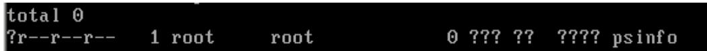


图11-1：proc文件夹内的文件属性信息


输入命令：cat /proc/psinfo 即可得到当前所有进程的信息，如下图所示：

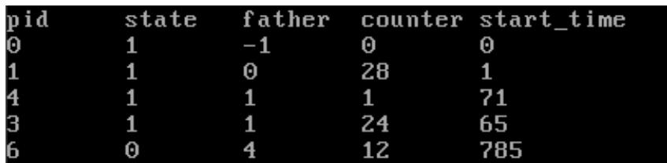


图11-2：打印输出当前所有进程的信息


# 5. 结束调试。

# 通过cat命令调试proc文件系统的工作过程

接下来的实验内容会引导读者通过cat命令打印输出proc文件系统中的内容，从而加深对proc文件系统的理解。下面的源代码展示了cat命令的实现原理（注意，这里并不是让读者自己编写cat命令，只是提供一个参考）。

```c
include<stdio.h>   
#include<unistd.h>   
#include<fcntl.h>   
int main(int argc，char\*argv[])   
{ charbuf[513]  $\equiv$  \{'\\0'}; int nread; intfd  $\equiv$  open(args[1]，O_RDONLY,0); while(nread  $\equiv$  read(fd，buf，512)) { buf[nread]  $\equiv$  '\0'; puts(buf); } return 0;
```

请读者按照下面的步骤调试 proc 文件系统的工作过程：

1. 在 fs/procfs.c 文件中 psread 函数的第一个 if 语句处（第 70 行）添加一个断点。

2. 按 F5 启动调试，待 Linux 0.11 启动后，输入命令“cat /proc/psinfo”后按回车，会在刚刚添加的断点处中断。

3. 此时，在 VSCode 左侧“调试和运行”中的 CALL STACK 窗口中可以看到 psread 函数是由 sys_read 函数调用的，而 sys_read 函数就是系统调用 read 对应的内核函数，也就是说 cat 源代码 while 语句中的 read 函数正在执行。

4. 中断位置的 if 语句的作用是：当第一次调用 psread 函数时，文件位置指针 f_pos 的值为 0，就会进入这个 if 语句将进程信息放入缓冲区 psbuffer 中。但是，如果需要再次进入 psread 函数

时，由于文件位置指针 f_pos 的值不为 0，就不再进入这个 if 语句，从而可以直接跳转到后面的 for 循环读取数据了。

5. 按 F10 单步调试到第 81 行，这个过程中调用了五次 addTitle 函数将标题添加到了 psbuffer 缓冲区中。接下来第 85 行开始的 for 循环，会遍历进程控制块数组，将有效的进程信息写入 psbuffer 缓冲区中。

6. 在 psread 函数的最后一个 for 循环语句处（第 102 行）添加一个断点。按 F5 继续执行，程序就会命中此断点。此 for 循环的目的是将 psbuffer 缓冲区内的数据逐字节的读取到用户空间中的 buf 缓冲区中。

7. 在 psread 函数最后的 return 语句处添加一个断点，按 F5 继续调试，程序会在此处中断。将鼠标移动到返回值变量 i 上可以查看此变量的值，再将鼠标移动到 psread 函数的第三个参数 count 上可以查看此变量的值，通过比较这两个值可以发现，psread 函数实际读取的字节数小于 buf 缓冲区的大小 count，也就是说 psread 函数执行一次就可以读取到所有数据了。

8. 按 F5 继续调试，程序会在第 70 行的断点处再次中断。此时查看 Bochs 虚拟机的显示窗口，已经打印输出 psinfo 节点的内容了。

9. 继续按 F10 单步调试，可以发现程序并没有进入第一个 if 语句，而且没有读取任何数据就从第 105 行的 break 语句跳出了 for 循环，最后返回了 0。

10. 按 F5 继续运行，cat 命令就结束了，也就不会再命中任何断点了。

结合上面的调试过程，可以知道在cat源代码while语句中第一次调用read函数就已经读取到了所有数据，此时由于read函数返回的nread不为0，就会第一次进入while语句的循环体中继续执行，将读取到的内容打印输出。当循环体运行完毕后，会再次执行while语句中的read函数来读取文件，也就会再次进入psread函数，但是由于第二次读取数据的数量nread是0（参考前面的第9步），循环就结束运行了。

# 简化fs/procs.c文件中的源代码

文件fs/procs.c中psread函数的源代码调用了itoa和addTitle函数将内容写入psbuffer缓冲区，造成源代码比较复杂。读者可以使用sprintf函数替换掉itoa和addTitle函数，源代码就会简单很多。但是Linux 0.11没有实现sprintf函数，读者可以参考init/main.c文件中第200行的printf函数，在fs/procs.c文件中实现一个sprintf函数。

# 提交作业

实验结束后先使用 VSCode 左侧的“源代码版本控制窗口”查看文件变更详情，确认无误后再将本地项目提交到平台的个人项目中，方便教师通过平台查看读者提交的作业。

# 四、思考与练习

1. 请读者模仿psinfo节点的实现方法，实现一个保存物理内存信息的meminfo节点，该节点保存的数据可以参考实验八打印输出的物理内存的信息。

2. 实现一个可以读取jiffies时钟滴答值的tickinfo节点。时钟滴答jiffies的说明可以参考实验六预备知识的内容。考虑到jiffies的值改变的太快了（10ms变一次），能够直接将Linux 0.11中全局变量jiffies的值转换为字符串并放入一个缓冲区中供用户读取吗？在将jiffies的值转换为字符串的过程中，其值是否有可能发生改变呢？如何解决这个问题。

3. 在读取节点psinfo的过程中，函数psread会将所有进程的信息转换为字符串并放入psbuffer缓冲区中，但是在循环遍历所有64个进程的过程中，是否会出现进程的信息发生变化的情况呢？如果会发生变化，读者是否可以参考前一个练习解决jiffies的值变化太快的方法来解决此问题。

# 实验十二 MINIX 1.0 文件系统的实现

实验性质：验证、设计

建议学时：2学时

任务数：1个

实验难度：★★★★☆

# 一、实验目的

- 通过查看MINIX1.0文件系统的硬盘信息，理解MINIX1.0的硬盘管理方式。

$\bullet$  学习MINIX1.0文件系统的实现方法。

- 改进MINIX 1.0文件系统的实现方法，加深对MINIX 1.0文件系统的理解。

# 二、预备知识

Linux 0.11操作系统启动时需要加载一个根目录，此根目录使用的是MINIX 1.0文件系统，其保存在硬盘的第一个分区中。Linux 0.11操作系统将硬盘上的两个连续的物理扇区（大小为512字节）做为一个物理盘块（大小为1024字节），而且物理盘块是从1开始计数的。硬盘上的第一个物理盘块是主引导记录块（MBR），读者已经通过实验二了解到，Linux 0.11并未使用硬盘上的主引导记录块进行引导，而是使用软盘A上的引导扇区进行引导的。在硬盘的主引导记录块中除了没有用到的引导程序外，在其包含的第一个物理扇区的尾部（引导标识0x55aa的前面）是一个64字节的分区表（典型的IBM Partition Table），其中每个分区表项占用16字节，共有4个分区表项。每个分区表项都定义了一个分区的起始物理盘块号和分区大小（占用的物理盘块数量）等信息。硬盘上的物理盘块可以按照图12-1所示进行划分。

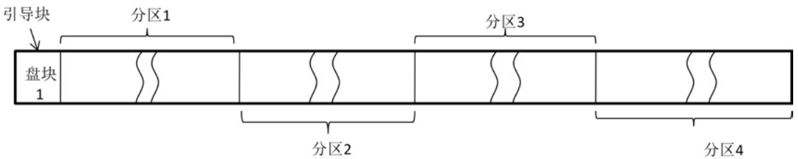


图12-1：硬盘上物理盘块的划分


Linux 0.11 使用的硬盘只包含了两个分区，在第一个分区中提供了 Linux 0.11 的根目录，并使用 MINIX 1.0 文件系统进行管理，第二个分区没有用到，内容为空。需要强调的是，在 MINIX 1.0 文件系统管理的硬盘分区中就不再使用物理盘块作为划分的单位了，而是将一个物理盘块作为一个逻辑块来使用，并且逻辑块号是从 0 开始计数的。

接下来，重点了解一下MINIX 1.0文件系统是如何管理硬盘上的第一个分区的。第一个分区包含了引导块（占用逻辑块0）、超级块（占用逻辑块1）、i节点位图（占用逻辑块2-4）、逻辑块位图（占用逻辑块5-12），以及i节点和数据区，如图12-2所示。


图12-2：MINIX1.0文件系统所管理的分区1的布局


分区1开始处的引导块同样没有被使用。其后的超级块用于存放MINIX1.0文件系统的结构信息，主

要用于说明各部分的起始逻辑块号和大小（包含的逻辑块数量）。超级块中各个字段的含义在表 12-3 中进行了说明。

<table><tr><td>字段名称</td><td>数据类型</td><td>说明</td></tr><tr><td>s_inodes</td><td>short</td><td>分区中的i节点总数。</td></tr><tr><td>s_nzones</td><td>short</td><td>分区包含的逻辑块总数。</td></tr><tr><td>s_imap_blocks</td><td>short</td><td>i节点位图占用的逻辑块数。</td></tr><tr><td>s_zmap_blocks</td><td>short</td><td>逻辑块位图占用的逻辑块数。</td></tr><tr><td>s_firstdatazone</td><td>short</td><td>数据区占用的第一个逻辑块的块号。</td></tr><tr><td>s_log_zine_size</td><td>short</td><td>log2(逻辑块包含的物理块数量)。MINIX 1.0文件系统的逻辑块包含一个物理块，所以其值为0。</td></tr><tr><td>s_max_size</td><td>long</td><td>文件最大长度，以字节为单位。</td></tr><tr><td>s_magic</td><td>short</td><td>文件系统魔数，用以指明文件系统的类型。MINIX 1.0文件系统的魔数是0x137f。</td></tr></table>


表 12-3: MINIX 1.0 的超级块的结构


在超级块的后面是占用了3个逻辑块的i节点位图，其中的每一位用于说明对应的i节点是否被使用。位的值为0时，表示其对应的i节点未被使用；位的值为1时，表示其对应的i节点已经被使用。

在i节点位图的后面是占用了8个逻辑块的逻辑块位图，其中的每一位用于说明数据区中对应的逻辑块是否被使用。除第1位(位0)未被使用外，逻辑块位图中每个位依次代表数据区中的一个逻辑块。因此，逻辑块位图的第2位（位1）代表数据区中第一个逻辑块，第3位（位2）代表数据区中的第二个逻辑块，依此类推。当数据区中的一个逻辑块被占用时，逻辑块位图中的对应位被置为1，否则被置为0。

在逻辑块位图的后面是i节点部分，其中存放着MINIX1.0文件系统中文件或目录的索引节点（简称i节点）。注意，i节点是从1开始计数的。每个文件或目录都有一个i节点，每个i节点结构中存放着对应文件或目录的相关信息，如文件宿主的id(uid)、文件所属组id(gid)、文件长度、访问修改时间以及文件数据在数据区中的位置等。i节点共包含32个字节，其结构如表12-4所示。

<table><tr><td>字段名称</td><td>数据类型</td><td>说明</td></tr><tr><td>i_mode</td><td>short</td><td>文件的类型和属性(rwx 位)</td></tr><tr><td>iuid</td><td>short</td><td>文件宿主的用户 id</td></tr><tr><td>i_size</td><td>long</td><td>文件长度(以字节为单位)</td></tr><tr><td>i_mtime</td><td>long</td><td>文件的修改时间(从1970年1月1日0时起,以秒为单位)</td></tr><tr><td>igid</td><td>char</td><td>文件宿主的 id</td></tr><tr><td>i_nlinks</td><td>char</td><td>链接数(有多少个文件目录项指向该i节点)</td></tr><tr><td>i-zone[9]</td><td>short</td><td>文件所占用的数据区中的逻辑块号数组。其中zone[0]-zone[6]是直接块号;zone[7]是一次间接块号;zone[8]是二次(双重)间接块号。</td></tr></table>

表 12-4: MINIX 1.0 文件系统的 i 节点的结构

i_mode字段用来保存文件的类型和访问权限属性。其位  $15\sim 12$  用于保存文件类型，位  $11\sim 9$  保存执行文件时设置的信息，位  $8\sim 0$  表示文件的访问权限。如图12-5所示。i-zone[]数组用于存放i节点在数据区中对应的逻辑块号。i-zone[0]到i-zone[6]用于存放文件开始的7个块号，称为直接块。例如，若文件长度小于等于7KB，则根据其i节点的i-zone[0]到i-zone[6]可以很快找到文件数据所占用的逻辑块。若文件大一些，就需要用到一次间接块i-zone[7]了，其对应的逻辑块中的数据又是一组逻辑块号，所以称之为一次间接块。对于MINIX1.0文件系统来说，i-zone[7]对应的逻辑块中可以存放512个逻辑块号，因此可以寻址512个逻辑块。若一次间接块提供的逻辑块仍然无法存储文件的全部数据，则需要使用二次间接块i-zone[8]了，其可以寻址512*512个逻辑块。参见图12-6。


图12-5：i节点属性字段内容


图12-6：i节点的逻辑块数组的功能


如果i节点对应的是一个文件，那么这个文件的内容（例如文本文件中的文本数据）就会保存在由i-zone数组指定的若干个逻辑块中。但是，如果i节点对应的是一个目录，这个目录又包含了若干个子文件或子目录，情况就会稍微复杂一些。如果i节点对应的是一个目录，则在该i节点的i-zone数组对应的逻辑块中会保存所有子文件和子目录的目录项信息。MINIX1.0文件系统的目录项长度为16字节，开始的2个字节指定了子文件或子目录对应的i节点号，接下来的14个字节用于保存子文件或子目录的名称。由于整个目录项的长度是16个字节，因此一个逻辑块可以存放  $1024 / 16 = 64$  个目录项。子文件和子目录的其他信息被保存在由i节点号指定的i节点结构中。所以，当需要访问一个文件时，需要根据文件的全路径（例如/bin/sh）从根节点找到子目录的i节点，然后再从子目录的i节点找到文件的i节点。详细内容请读者阅读《Linux内核完全注释》的第12章。

# 三、实验内容

由于在Linux 0.11的内核中访问硬盘上的MINIX 1.0文件系统的过程比较复杂，还会涉及到硬盘设备的物理特性和驱动程序代码。为了简化实验内容，这里采用模拟的方式来访问MINIX 1.0文件系统，即使用C语言编写一个Windows控制台程序，直接访问VSCode提供的硬盘镜像文件中的MINIX 1.0文件系统。感兴趣的读者可以在完成本实验后，继续阅读Linux 0.11的源代码，学习Linux 0.11操作系统是如何访问硬盘设备，以及硬盘分区中的文件系统的。

# 准备实验

使用浏览器登录平台领取本次实验对应的任务，从而在平台上创建个人项目（Windows控制台程序），然后使用VSCode将个人项目克隆到本地磁盘中并打开。

# 打印输出 MINIX 1.0 文件系统的目录树

在当前项目的源代码文件 main.c 中，实现了打印输出 MINIX 1.0 文件系统的目录树的功能，仔细阅读其中的源代码，并着重理解下面的内容：

- 在源代码文件的开始位置定义了分区表项、超级块、i节点和目录项的结构体，读者需要理解其中每个字段的意义。

- get_physical_block 函数的作用是将一个物理块的内容读取到缓冲区中。get_partitionLogical_block 函数的作用是将第一个分区中的一个逻辑块的内容读取到缓冲区中。需要注意的是，物理块号是从 1 开始计数的，而逻辑块号是从 0 开始计数的。这两个函数实现了对硬盘镜像文件物理层和逻辑层的分层访问，从而可以模拟出访问硬盘的过程。

- load_inodeBITMAP 函数将硬盘镜像文件中的整个 i 节点位图都读入到了内存中。is_inode_valid 函数根据 i 节点位图中的内容判断一个 i 节点是否有效。需要注意的是，i 节点是从 1 开始计数的。get_inode 函数根据 i 结点的 id 读取相对应的 i 结点。

- print inode 函数递归打印目录树。首先读取 i 节点位图的第一位，并找到根节点。然后判断 i 节点是否为目录，若是目录，则打印目录名(名称前加 Tab 键是为了有树的层次感)，然后递归打印其子目录和子文件；如果是常规文件则直接打印文件名。

请读者按照下面的步骤查看 MINIX 1.0 文件系统的目录树：

1. 选择 VSCode 的 “Terminal” 菜单中的 “Run Build Task...” 菜单项, 在弹出的列表中选择 “生成项目 (make)”, 在项目生成的过程中, 位于编辑器下方的 “TERMINAL” 窗口会实时显示生成的进度和结果。如果生成项目成功, 会在项目目录中生成应用程序的可执行文件 minix.exe, 并在项目目录中准备好硬盘镜像文件 harddisk.img, 在此硬盘的第一个分区中提供了使用 MINIX 1.0 文件系统管理的根目录。

注意：如果在执行程序的过程中，导致harddisk.img硬盘镜像文件破坏，可以删除项目目录中的artifact.done文件，重新生成项目，即可恢复初始的harddisk.img硬盘镜像文件。

2. 选择 VSCode 的 “Terminal” 菜单中的 “New Terminal” 菜单项, 在 VSCode 底部的 TERMIN 窗口中, 输入命令“.\\minix.exe > a.txt”后按回车, 应用程序会读取项目目录中的 harddisk.img 硬盘镜像文件, 并将打印输出的目录树重定向到文本文件 a.txt 中。

3. 在 VSCode 左侧的“文件资源管理器”窗口中双击 a.txt 文件，可以在编辑器中打开该文件，查看 MINIX 1.0 文件系统的目录树。

# 实现更多功能

1. 参考 load_inode bitmap 函数写出一个可以将硬盘镜像文件中的整个逻辑块位图都加载到内存中的函数。

2. 打印输出类似于Linux 0.11内核命令“df”的输出内容。

3. 将“/usr/root”文件夹下的“hello.c”文件的内容打印输出。

4. 将“/usr/src/linux-0.11.org”文件夹下的“memory.c”的内容打印输出。注意，此文件大于7KB，所以需要使用二次间接块才能访问所有的数据。

5. 删除“/usr/root/hello.c”文件。

6. 删除“/usr/root/shoe”文件夹。

7. 新建“/usr/root/dir”文件夹。

8. 新建“/usr/root/file.txt”文件，并设置初始大小为10KB。

# 提交作业

实验结束后先使用 VSCode 左侧的“源代码版本控制窗口”查看文件变更详情，确认无误后再将本地项目提交到平台的个人项目中，方便教师通过平台查看读者提交的作业。

# 附录1 课程设计实验题目

为了使读者对Linux 0.11内核源代码有更深入的研究，并加深对操作系统原理的理解，本附录提供了具有一定工作量和一定难度的课程设计实验题目，这些课程设计实验题目涉及到进程管理、存储器管理、文件系统、外部设备等多方面的内容，并且这些都是读者在学习完操作系统原理课程后应该重点掌握的内容。读者可以根据实际的教学需求和自身能力来选择完成一个或多个题目，相信读者在完成了以下课程设计题目后，不论是在理解操作系统原理的深度，还是在编写源代码的能力方面都会有质的提升，并对今后参加工作有很大的帮助。

读者在尝试完成下列课程设计实验题目时，一定要学会将一个大任务细分成多个小任务。这些小任务可以按照一定的顺序依次完成，从而渐进、有序的推动整个项目顺利完成。这些小任务既可以是一个能够独立工作的模块，也可以是某个技术细节的验证过程，就算会暂时破坏整个系统的功能，但是只要能够完成想要达到的验证效果，也完全可以的。读者还需要为每个细分的小任务准备一个测试方法（单元测试），用于验证任务达到了预期的目标，当然也需要为整个项目准备一个测试方法（验收测试），用于检验最终的成果。

将一个大任务细分成多个小任务的好处是多方面的，第一个好处是，一个小任务的风险通常是可控的，并且可以在较短的时间内完成（通过单元测试），此时读者可以免费获得化学物质奖励（多巴胺、肾上腺素等），产生满满的成就感，进而驱动读者不知疲倦地向最终的目标（通过验收测试）前行，反之，如果摊子铺的太开，步子迈的太大，一旦对项目的质量和风险把控不住，就会产生严重的挫败感，距离放弃就不远了；另外一个好处是，当任务结束时，即使没有通过最终的验收测试，还会有几个能够拿得出手的小任务的成果，也会有不错的收获。

# 题目一：实现多级反馈队列调度算法

目前，Linux 0.11 内核实现了基于优先级的抢先式调度和时间片轮转调度算法，可以让同一优先级中的就绪进程轮转执行。但是，如果考虑到有一个长批处理作业优先级比较高，处理完需要很长时间，这样较低优先级的短作业就不会得到执行。使用多级反馈队列调度算法可以有效解决此问题。

在采用多级反馈队列调度算法的操作系统中，调度算法的实施过程如下：

1. 首先设置多个进程就绪队列，并为各个队列赋予不同的优先级，并将就绪进程放入其优先级对应的就绪队列中。

2. 其次，各个队列中赋予进程执行时间片的大小也各不相同。在优先级愈高的队列中，每个进程的初始时间片就规定得愈小。例如，如果规定第一队列（优先级最高）的时间片为  $8\mathrm{ms}$ ，一般地说，第二队列的时间片要比第一队列的时间片长一倍，……，第  $\mathrm{N} + 1$  队列的时间片比第  $\mathrm{N}$  队列的长一倍。

3. 第三，当一个新进程进入就绪态后，首先将它放入对应优先级队列的末尾，按 FCFS 原则排队等待调度。当轮到该进程执行时，如能在已分配的时间片内完成，便可准备结束此进程；如果在分配的时间片用完时尚未完成，需要先降低该进程的优先级并增大该进程的时间片，然后调度程序将该进程转入下一个队列的末尾，再同样地按 FCFS 原则等待调度执行；如果它在该队列中运行时用完已分配的时间片后仍未完成，再依法将它转入下一队列。如此下去，当一个长作业从第一队列降到最后一个队列后，就采取按时间片轮转的方式运行，无法再继续降低优先级了。

4. 第四，仅当第一队列空闲时，调度程序才调度第二队列中的进程运行；仅当第  $1 \sim (N - 1)$  队列均为空时，才会调度第 N 队列中的进程运行。如果处理器正在第 N 队列中为某进程服务时，又有新进程进入优先权较高的队列，则此时新进程将抢占正在运行进程的处理器。

5. 第五，如果有用户交互事件（例如键盘或鼠标操作）发送到了低优先级的进程，需要提升该进程的优先级到其默认的级别，从而可以在抢占处理器后快速响应用户交互事件。

请读者按照上面的说明修改Linux0.11内核的源代码，实现多级反馈队列调度算法。这里给出一些提示信息：

- 目前Linux 0.11内核使用一个简单的线性表来管理就绪进程，这就需要读者将这个一维的线性表重构成一个二维的线性表，从而提供多个就绪队列，每个就绪队列用于放入与其优先级对应的就绪进程。

- 在实现多级就绪队列后，读者可以首先在 Linux0.11 内核中实现一个“queue”系统调用，通过在应用程序中调用该系统调用可以将多级就绪队列的信息打印输出到屏幕上，方便进行观察。

- 在实现多级反馈队列调度算法后，可以编写一个Linux应用程序，在其中有一个死循环，每次循环时都将其优先级和时间片大小输出到屏幕上，从而可以观察其优先级逐步降低的过程。

- 使用键盘事件提升进程的优先级。由于键盘事件与进程之间没有建立一个明确的会话关系，所以还需要解决使用键盘事件提升哪个进程优先级的问题。一个简单的方式是，在键盘的中断处理程序中，如果当前进程处于运行状态的话，就将其优先级提升为默认的优先级即可。

# 题目二：修改动态内存分配算法

阅读Linux0.11内核lib/malloc.c源代码文件，分析其算法步骤、数据结构和函数之间的调用关系，理解Linux0.11内核提供的内存动态分配和回收算法。然后完成以下工作：

- 设计并实现边界标识法，替换系统现有的动态分区分配算法；

$\bullet$  设计并实现伙伴算法，替换系统现有的动态分区分配算法；

编写测试程序，对不同动态分配算法的性能进行测试和比较。

# 题目三：信号量机制的实现和应用

参考本书实验七中提供的信号量机制相关代码，分析实现信号量机制各个函数功能、数据结构和函数之间的调用关系。然后完成以下工作：

- 在Linux 0.11内核中实现信号量的系统调用，然后利用信号量机制实现在多个并发程序环境下的生产者—消费者问题；

- 利用Linux 0.11内核提供的sleep_on函数和wake_up函数实现信号量的阻塞与唤醒；

- 对上述两种信号量实现方法的结果进行测试和比较。

- 使用信号量解决更多同步问题，包括读者写者问题、哲学家就餐问题等。

# 题目四：进程间共享内存的实现与应用

参考本书实验八提供的内存地址映射和内存共享相关代码，分析Linux系统的地址映射过程和共享内存原理，理解将一个共享的物理页映射到不同的逻辑地址空间，实现进程间共享内存的原理。然后完成以下工作：

- 实现用共享内存作为缓冲区解决生产者—消费者问题；

- 当共享的物理页被多个进程重复释放，将导致操作系统报告错误并终止运行，设计一个关闭共享内存的系统调用函数解决此问题。

# 题目五：页面置换算法的设计与实现

参考本书实验九的内容，阅读最佳页面置换算法和先进先出页面置换算法源代码，分析算法步骤、数据结构和函数之间的调用关系。然后完成以下工作：

- 设计并实现最近最久未使用页面置换（LRU）算法；

- 实现最不常用页面置换算法（LFT），页面缓冲置换算法（PBA）和改进型CLOCK页面置换算法（可选）；

编写测试程序，对不同页面置换算法的性能进行测试和比较。

# 题目六：在Linux0.11中实现内核级线程

目前，Linux 0.11 内核中还没有实现内核级线程，而多线程的编程在项目开发过程中会经常用到，占据着十分重要的位置。内核级线程的实现主要分为三个流派：

一个流派以Windows和Solaris为代表，线程是系统调度和管理执行体的基本单位，而进程的功能弱化为单纯的资源管理。每个进程至少有一个线程，同一个进程之内的线程通过PCB共享资源。

另一个流派以Linux和FreeBSD（移植的Linux线程库）为代表，仍然以进程为调度和资源管理的基本单位，但允许不同的进程之间共享全部虚拟地址空间。这样，共享地址空间的进程们只要再拥有自己独

立的栈，就像线程一样了。这种实现方法叫做轻量级进程（Light Weight Process）。相对第一个流派而言，它的效率比较低。

最后一个流派其实是将进程与线程完全揉合在一起，多见于嵌入式系统中。在这种方式下，所有的进程都共享同一个地址空间，这样它们每一个都相当于一个线程。

要求在Linux 0.11的进程管理基础上，按照POSIX Threads标准实现内核级线程，并编写应用程序测试多线程。要做到，同一个进程下的各个线程之间要能共享除指令执行序列、栈、寄存器以外的一切资源。相关功能通过系统调用和函数库共同完成。系统调用负责内核内的相关工作，其接口可自定义，直接实现在Linux 0.11已有的源程序文件中。函数库（命名为pthread.c和pthread.h）和应用程序链接到一起，对系统调用进行更高级别的封装，供应用程序直接调用。函数库应至少包含如下函数：

```txt
int pthread_attr_init(pthread_attr_t *attr);
```

用默认值初始化attr指向的pthread_attr_t结构。该数据是调用pthread_create()的第二个参数。参数pthread_attr_t主要定义了创建线程时需要用户提供的各种属性信息，pthread_create()根据这些信息创建线程。属性的具体内容可完全自定义。函数成功时返回0，出错时返回错误号。

```c
intPTHread_create(pthread_t \*thread, constPTHread_attr_t\*attr，void\*\*startRoutine)(void \*)，void  $^ { \text{青} }$  arg);
```

该函数用来创建一个线程。attr 是创建线程时使用的各种属性，由pthread_attr_init() 设定。当该线程被调度时会从函数 startRoutine（一段用户态代码）开始执行。arg 做为参数被传递给 start Routine。start Routine 的原型为：

```txt
void * start_routine(void *arg);
```

如果线程创建成功，返回值0，并且把线程的ID值存放在thread中；当创建不成功时会返回一个错误号：EAGAIN表示系统缺乏足够的资源来创建线程，EINVALID表示attr结构中的属性值非法。

```c
voidpthread_exit(void *value_ptr);
```

将调用该函数的线程销毁。它没有返回值，因为调用它的线程已经销毁，所以返回值没有任何地方可以“返回”。value_ptr 是传给父线程的返回值，父线程调用 pthread_join() 可得到这个值。这是线程主动终止的唯一方式。

```c
intPTHread_join(pthread_t thread,void **value_ptr);
```

将调用它的线程阻塞，一直等到 thread 结束为止。其中 thread 为被等待的线程 ID，value_ptr 会接收到被等待线程通过 pthread_exit() 设置的返回值。

# 题目七：在Linux 0.11中实现基于内核栈切换的进程切换

由于原有的Linux 0.11在完成进程切换时采用基于TSS和任务切换指令的方式，虽然简单，但是任务切换指令的执行时间却很长，在实现任务切换时大概需要200多个时钟周期。而通过堆栈实现任务切换可能要快，而且采用堆栈的切换还可以使用指令流水的并行化优化技术，同时又使得CPU的设计变得简单。所以，无论是Linux还是Windows，在完成进程/线程的上下文切换时都没有使用Intel提供的这种基于TSS的方式，而都是通过栈实现的。

基于内核栈实现进程切换的基本思路：当进程由用户态进入内核时，会引起栈切换，用户态的信息会压入到内核栈中，包括此时用户态执行的指令序列EIP。由于某种原因，该进程变为阻塞态，让出CPU,重新引起调度时，操作系统会找到新的进程的PCB，并完成该进程与新进程PCB的切换。如果将内核栈和PCB关联起来，让操作系统在进行PCB切换时，也完成内核栈的切换，那么当中断返回执行IRET指令时，弹出的就是新进程的EIP，从而跳转到新进程的用户态指令序列执行，也就完成了进程的切换。这个切换的核心是构建出内核栈的样子，要在适当的地址压入适当的返回地址，并根据内核栈的样子，编写相应的汇编代码，精细地完成内核栈的入栈和出栈操作，在适当的地方弹出正确的返回地址，以保证能顺利完成进程的切换。同时，还要完成内核栈和PCB的关联，在PCB切换时，完成内核栈的切换。

请读者按照上面的说明修改Linux0.11内核的源代码，实现基于内核栈的进程切换。这里给出一些提示信息：

- 当进程从用户态进入内核态时，CPU会自动依靠TR寄存器找到当前进程的TSS,然后根据里面ss0和

esp0 的值找到内核栈的位置，完成用户栈到内核栈的切换。TSS 是沟通用户栈和内核栈的关键桥梁，这一点在改写成基于内核栈切换的进程切换中相当重要。

- 当执行 int 0x80 这条语句时由用户态进入内核态，CPU 会自动按照 SS、ESP、EFLAGS、CS、EIP 的顺序，将这几个寄存器的值压入到内核栈中。在 system_call 中将 DS、ES、FS、EDX、ECX、EBX 入栈。在执行 schedule 前将 ret_from_sys_call 压栈。

- 当前进程的PCB是用一个全局变量current指向的。为了得到新进程的PCB,需要对schedule()函数进行修改。

- 将Linux 0.11中原有的switch_to实现去掉，写成一段基于栈切换的代码。由于要对内核进行精细的操作，所以需要用汇编代码来实现switch_to的编写，既然要用汇编实现switch_to，那么将switch_to的实现放在system_call.s中是最合适的。这个函数依次主要完成如下功能：由于是C语言调用汇编，所以需要首先在汇编中处理栈帧，即处理ebp寄存器；接下来要取出表示下一个进程PCB的参数，并和current做一个比较，如果等于current，则什么也不用做；如果不等于current，就开始进程切换，依次完成PCB的切换、TSS中的内核栈指针的重写、内核栈的切换、LDT的切换以及PC指针（即CS：EIP）的切换。

- 由于 switch_to()和 first_return_from_kernel 都是在 system_call.s 中实现的，要想在 schedule.c 和 fork.c 中调用它们，就必须在 system_call.s 中将这两个标号声明为全局的，同时在引用到它们的.c 文件中声明它们是一个外部变量。

# 题目八：MINIX文件系统

阅读Linux0.11的内核访问硬盘上的MINIX1.0文件系统的源代码，学习Linux0.11操作系统是如何访问硬盘设备，以及硬盘分区中的文件系统的，然后编写应用程序输出MINIX1.0文件系统的目录树。并在此基础上完成以下功能的实现：

- 将“/usr/root”文件夹下的“hello.c”文件的内容打印输出。

- 将“/usr/src/linux-0.11.org”文件夹下的“memory.c”的内容打印输出。注意，此文件大于7KB，所以需要使用二次间接块才能访问所有的数据。

- 删除“/usr/root/hello.c”文件。

- 删除“/usr/root/shoe”文件夹。

新建“/usr/root/dir”文件夹。

新建“/usr/root/file.txt”文件，并设置初始大小为10KB。


附录2 Linux常用命令


<table><tr><td colspan="2">命令</td><td rowspan="2">命令功能</td><td colspan="2">选项含义</td></tr><tr><td>命令名</td><td>命令形式</td><td>选项</td><td>功能</td></tr><tr><td rowspan="5">1s</td><td rowspan="5"></td><td rowspan="5">显示目录</td><td>-a</td><td>显示指定目录下的所有子目录与文件</td></tr><tr><td>-d</td><td>如果参数是目录。就只显示其名称而不显示其包含的文件</td></tr><tr><td>-R</td><td>显示指定目录的各个子目录中的文件</td></tr><tr><td>-F</td><td>列出文件名后加不同符号,以区分文件类型</td></tr><tr><td>-1</td><td>以长格式显示文件的详细信息。显示的信息依次为:文件类型与权限、链接数、文件属主、文件属组、文件大小、建立和最近修改的时间和文件名</td></tr><tr><td rowspan="2">cp</td><td rowspan="2">cp [选项] 源文件/目录1目标文件/目录2</td><td rowspan="2">文件或目录复制</td><td>-a</td><td>复制时保留文件链接和属性,且复制所有子目录及其文件</td></tr><tr><td>-r</td><td>若源文件为目录文件时,将复制该目录下所有子目录和文件。此时目标文件必须为目录名</td></tr><tr><td>mv</td><td></td><td>文件或目录移动</td><td></td><td></td></tr><tr><td rowspan="2">rm</td><td rowspan="2">rm [选项] 文件列表</td><td rowspan="2">文件或目录删除</td><td>-r</td><td>删除参数中列出的全部目录及其子目录。如果没有使用 -r 选项,则不会删除目录</td></tr><tr><td>-f</td><td>忽略不存在的文件,且不给出提示</td></tr><tr><td>mkdir</td><td></td><td>创建目录</td><td>-p</td><td>可以是一个路径名。此时若路径中的某些目录尚不存在,加此选项,系统将自动建立尚不存在的目录</td></tr><tr><td>rmdir</td><td></td><td>删除目录</td><td>-p</td><td>当子目录被完全删除时,父目录也被删除</td></tr><tr><td>pwd</td><td></td><td>显示工作目录路径</td><td></td><td></td></tr><tr><td>cd</td><td></td><td>改变工作目录</td><td></td><td></td></tr><tr><td>cat</td><td></td><td>显示文本文件的内容</td><td></td><td></td></tr><tr><td rowspan="5">chmod</td><td rowspan="5">chmod [选项] [操作符][mode]文件名</td><td rowspan="5">改变文件或目录访问权限</td><td>u</td><td>表示用户 (user)</td></tr><tr><td>g</td><td>表示同组用户 (group)</td></tr><tr><td>o</td><td>表示其他用户 (other)</td></tr><tr><td>a</td><td>表示所有用户 (all),系统的默认值</td></tr><tr><td>操作</td><td>+(添加权限)、-(取消权限)、=(赋</td></tr><tr><td rowspan="2"></td><td rowspan="2"></td><td rowspan="2"></td><td>符</td><td>予权限，并取消其他权限）</td></tr><tr><td>mode</td><td colspan="1">r(可读)、w(可写)、x(可执行)、u(与文件属主有相同的权限)、g(与文件属主同组的用户有相同的权限)、o(与其他用户有相同的权限)</td></tr><tr><td>exit</td><td></td><td>退出目前的 shell</td><td></td><td></td></tr><tr><td>export</td><td></td><td>设置或显示环境变量</td><td></td><td></td></tr><tr><td>sync</td><td></td><td>将主存缓冲区的数据写入磁盘</td><td></td><td>在Linux 0.11中，每当修改磁盘数据后，必须使用sync命令将主存缓存区的数据写入磁盘，否则关闭虚拟机时修改的数据将会丢失。</td></tr><tr><td>df</td><td></td><td>查看文件空间使用情况</td><td></td><td></td></tr><tr><td>du</td><td></td><td>显示文件或目录占用文件空间情况</td><td></td><td></td></tr><tr><td>echo</td><td></td><td>显示字符串</td><td></td><td></td></tr><tr><td>clear</td><td></td><td>清空屏幕</td><td></td><td>Linux 0.11没有实现此命令，可以使用Ctrl+L清空屏幕。</td></tr></table>

# 附录3 vi 编辑器使用方法

vi 编辑器有 3 种操作模式：命令模式、插入模式和末行模式。

命令模式：当输入 vi 命令后，会首先进入命令模式，此时输入的任何字符都被视为命令。命令模式用于控制屏幕光标移动、文本字符/字/行删除、移动复制某区段，以及进入插入模式或进入末行模式。

插入模式：在命令模式输入相应的插入命令（例如i命令）进入该模式。只有在插入模式下，才可以进行文字数据输入及添加代码，按Esc键可回到命令模式。

末行模式：在命令模式下输入某些特殊字符，如“/”、“?”和“:”，才可进入末行模式。在该模式下可存储文件或退出编辑器，也可设置环境变量。

<table><tr><td>命令类型</td><td>命令形式</td><td>说明</td></tr><tr><td>进入vi命令</td><td>vi 文件名</td><td>显示vi编辑窗口,载入指定的文件,并进入命令模式</td></tr><tr><td rowspan="4">退出vi命令(退出vi时,若在插入模式,先按Esc返回命令模式)</td><td>:q!</td><td>放弃编辑内容,退出vi</td></tr><tr><td>:wq 或 :zz</td><td>保存文件,退出vi</td></tr><tr><td>:w</td><td>保存文件,但不退出vi</td></tr><tr><td>:q</td><td>退出vi,若文件被修改过,要确认是否放弃修改的内容</td></tr><tr><td>进入末行模式(命令模式下,输入特殊字符进入末行模式)</td><td>:</td><td>进入末行命令模式</td></tr><tr><td rowspan="6">进入插入模式(命令模式下,执行下列命令均可进入插入模式)</td><td>i</td><td>插入命令</td></tr><tr><td>a</td><td>附加命令</td></tr><tr><td>o</td><td>打开命令</td></tr><tr><td>s</td><td>替换命令</td></tr><tr><td>c</td><td>修改命令</td></tr><tr><td>r</td><td>取代命令</td></tr></table>


命令模式常用命令


<table><tr><td>命令</td><td>说明</td></tr><tr><td>x</td><td>删除光标所在的字符</td></tr><tr><td>X</td><td>删除光标所在位置前面的一个字符</td></tr><tr><td>nx</td><td>删除从光标开始到光标后n-1个字符</td></tr><tr><td>dw</td><td>删除光标到下一个单词起始位置</td></tr><tr><td>ndw</td><td>删除光标起的n个字</td></tr><tr><td>dd</td><td>删除光标所在的行</td></tr><tr><td>ndd</td><td>删除包括光标所在行的n行</td></tr><tr><td>Y</td><td>复制当前行至编辑缓冲区</td></tr><tr><td>nY</td><td>复制当前行开始的n行至编辑缓冲区</td></tr><tr><td>p</td><td>将编辑缓冲区的内容粘贴到光标的后面</td></tr></table>

# 参考文献


[1] [美] William Stallings 著。操作系统——精髓与设计原理（第八版）。陈向群，陈渝等译。北京：电子工业出版社，2017


[2] [荷] Andrew S. Tanenbaum, Herbert Bos 著。现代操作系统（原书第 4 版）。陈向群，马洪兵等译。北京：机械工业出版社，2017


[3] 汤子瀛，哲凤屏，汤小丹著。计算机操作系统。西安：西安电子科技大学出版社，1996


[4] [美] Andrew S. Tanenbaum, Albert S. Woodhull 著。操作系统：设计与实现（第二版）上册。王鹏，尤晋元，朱鹏，敖青云译。北京：电子工业出版社，1998


[5] 赵炯著。Linux 内核完全剖析。北京：机械工业出版社，2006


[6] [英] Peter Abel 著。IBM PC 汇编语言程序设计（第五版）。沈美明，温冬婵译。北京：人民邮电出版社，2002


[7] 刘星等著。计算机接口技术。北京：机械工业出版社，2003


[8] 唐朔飞著。计算机组成原理。北京：高等教育出版社，2000


[9] [希腊] Diomidis Spinellis 著。代码阅读方法与实践。赵学良译。北京：清华大学出版社，2004


[10][美] 科学、工程和公共政策委员会著。怎样当一名科学家。何传启译。北京：科学出版社，1996


[11] https://cms.hit.edu.cn/course/view.php?id=44哈尔滨工业大学操作系统实验课


[12] Intel Co. INTEL 80386 Programmes's Reference Manual 1986, INTEL CORPORATION, 1987


[13] Intel Co. IA-32 Intel Architecture Software Developer's Manual Volume.3:System Programming Guide. http://www.intel.com/, 2005


[14] IEEE-CS, ACM. Computing Curricula 2001 Computer Science. 2001


[15] The NASM Development Team. NASM — The Netwide Assembler. Version 2.04 2008


[16] Bochs simulation system. http://bochs.sourceforge.net/

