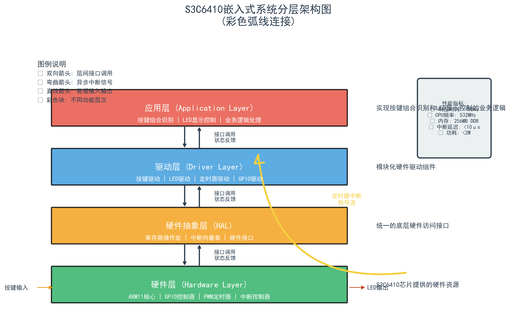
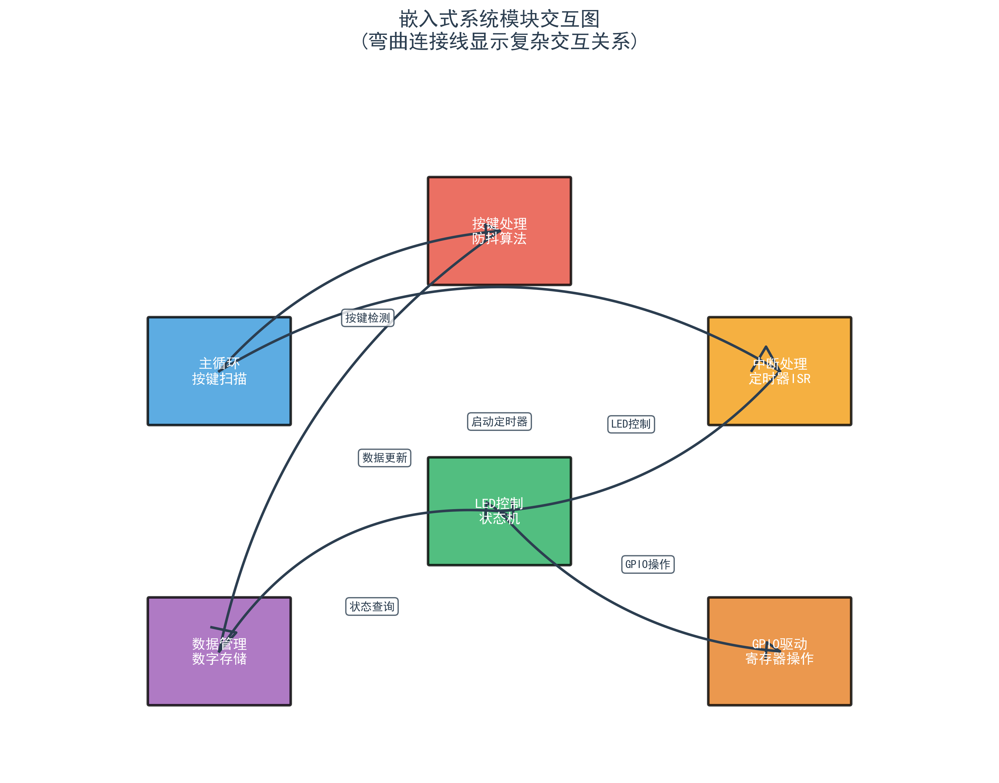
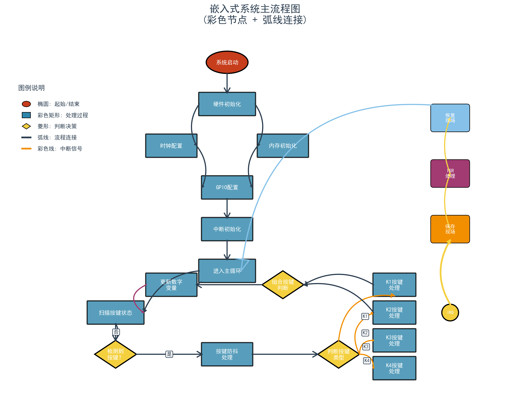
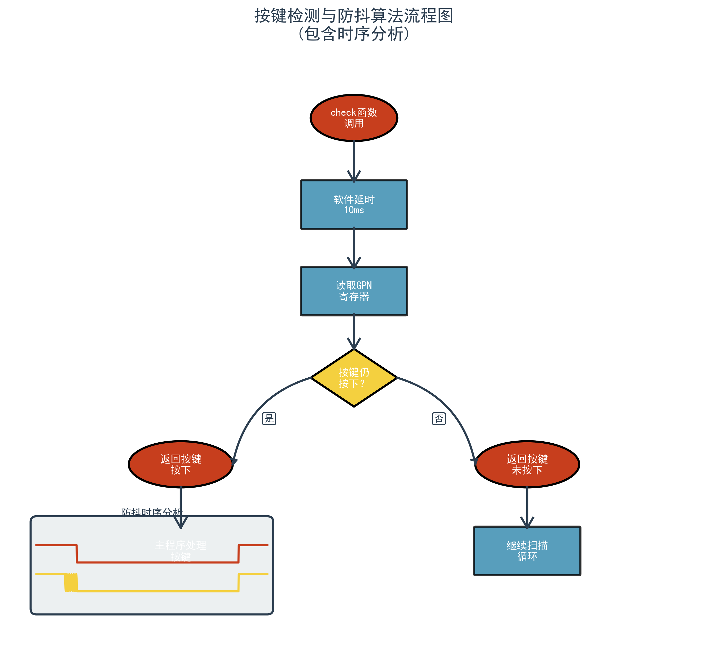
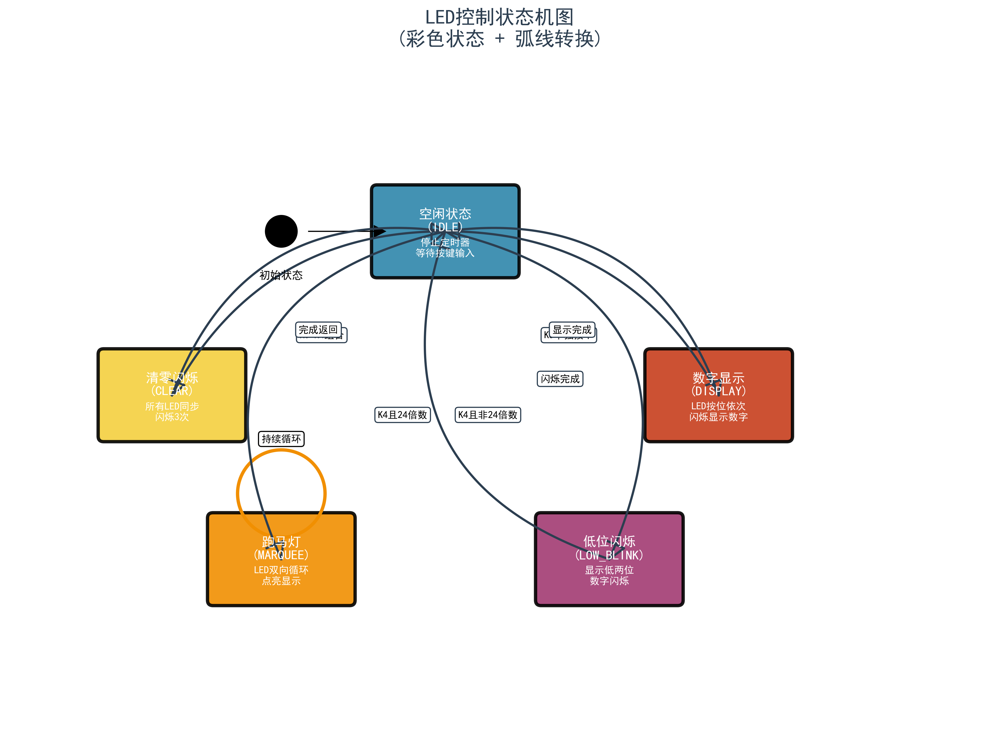
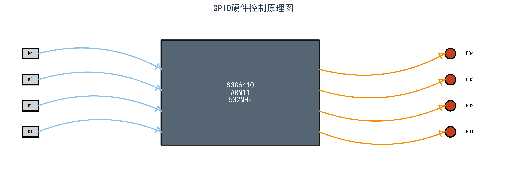

# 高级图表生成结果

生成时间: 2025-06-28 17:25:46

## 系统架构图

### 3D分层架构图

### 模块交互图  

## 流程图

### 主系统流程图

### 按键检测流程图

## 状态机图

### LED控制状态机

## 硬件交互图

### GPIO硬件控制图

---
这些图表使用Python生成，具有以下优势：
- 3D立体效果
- 弯曲连接线  
- 渐变色彩
- 专业布局
- 高分辨率输出
