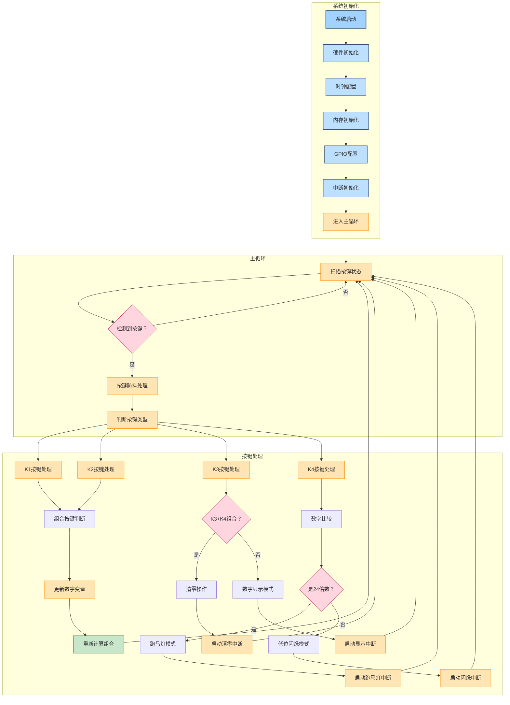
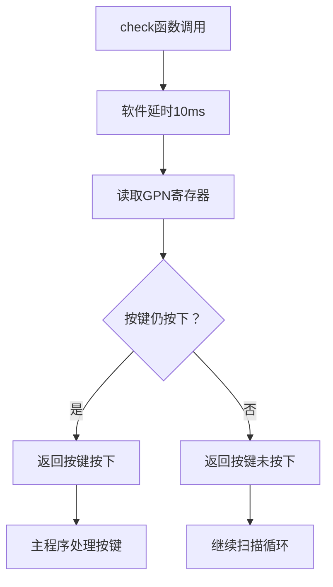
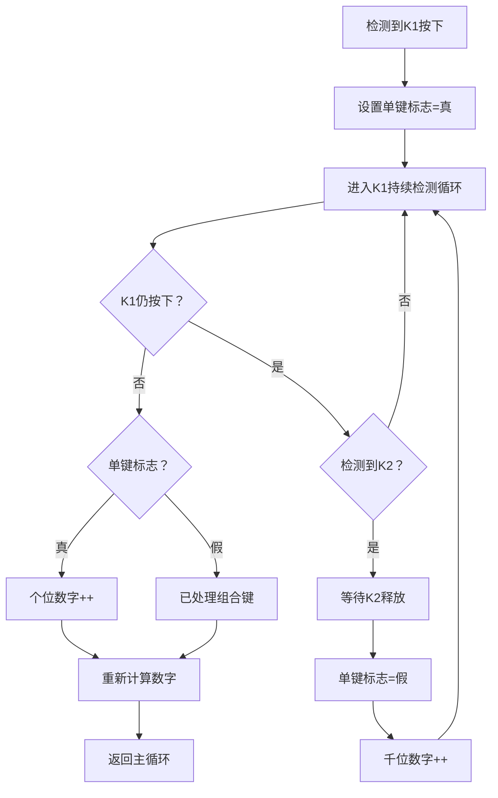
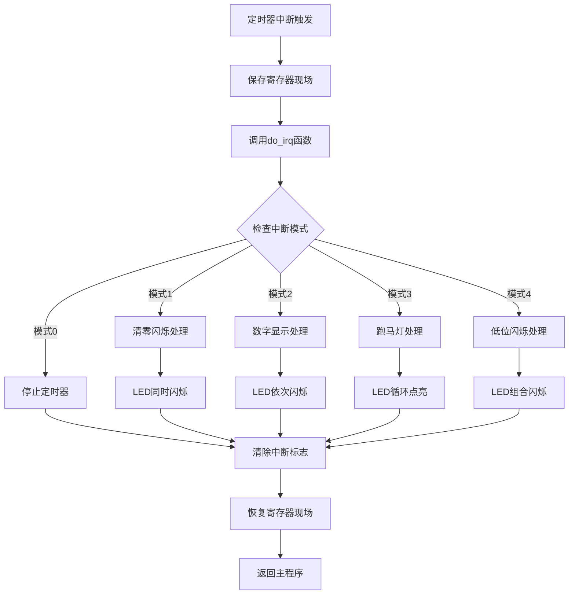
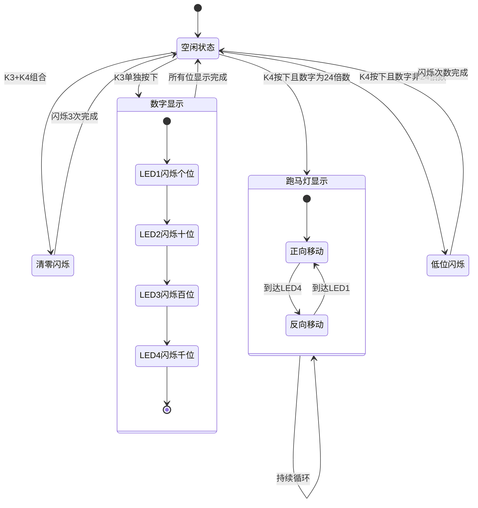
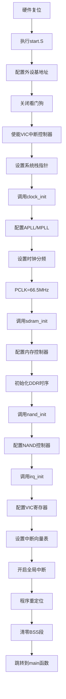
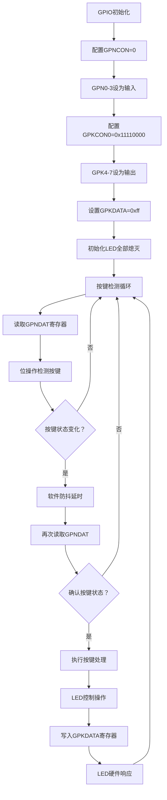
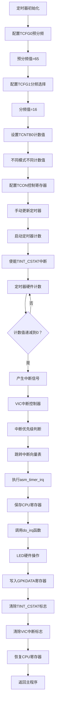
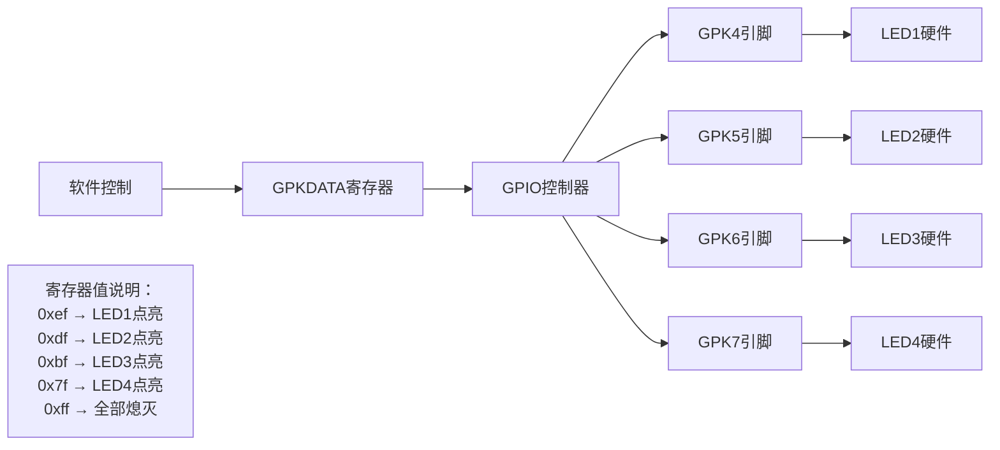

# 嵌入式系统课程设计技术报告

## 一、引言

本报告基于三星S3C6410 ARM11处理器的嵌入式系统，实现了按键组合识别与LED显示控制功能。系统采用查询式按键检测与中断驱动的LED控制相结合的设计方案，体现了典型嵌入式实时系统的设计理念和实现技术。

## 二、设计思想

### 2.1 总体设计思想

系统采用基于ARM11架构的分层设计思想，从硬件抽象到应用逻辑形成清晰的层次结构。

**2.1.1 系统架构设计**

本系统基于三星S3C6410处理器构建，采用典型的嵌入式系统分层架构：

- **硬件层**：S3C6410芯片提供ARM11核心、GPIO控制器、PWM定时器、中断控制器等硬件资源
- **硬件抽象层**：通过寄存器操作宏定义，实现对底层硬件的统一访问接口
- **驱动层**：包含按键驱动、LED驱动、定时器驱动等模块化组件
- **应用层**：实现按键组合识别和LED显示控制的业务逻辑

**2.1.2 模块划分策略**

系统按功能模块进行组织，体现了良好的软件工程实践：

- **系统初始化模块**：负责时钟配置、内存初始化、中断设置等系统级初始化
- **按键处理模块**：实现按键扫描、防抖处理、组合按键识别等功能
- **LED控制模块**：基于状态机实现多种LED显示模式的时序控制
- **定时器模块**：提供精确的时间基准，支持不同时间间隔的中断生成

**2.1.3 设计理念**

系统设计遵循以下核心理念：

- **实时性保证**：采用中断驱动架构确保系统对按键输入的快速响应
- **模块化设计**：各功能模块独立封装，便于维护和扩展
- **资源优化**：合理配置系统时钟和定时器参数，在性能和功耗间取得平衡
- **可靠性设计**：通过软件防抖、状态机管理等手段提高系统稳定性

### 2.2 具体实现思考过程

**2.2.1 需求分析与技术选型**

根据课程设计要求，系统需要实现按键组合识别和LED显示控制功能。通过需求分析，确定了以下关键技术要求：

- **按键输入要求**：需要支持K1、K2的单独按下和组合按下，要求实时性高，响应延迟小于50ms
- **数字存储要求**：需要存储四位十进制数，分别对应个位、十位、百位、千位
- **LED显示要求**：需要支持多种显示模式，包括按位闪烁、跑马灯、低位闪烁等
- **时序控制要求**：不同显示模式需要不同的时间间隔（0.5秒、1秒、2秒）

基于需求分析，选择了以下技术方案：

- **处理器选型**：三星S3C6410 ARM11处理器，主频532MHz，提供丰富的外设资源
- **按键检测方案**：查询式检测+软件防抖，确保按键响应的实时性和可靠性
- **时序控制方案**：PWM定时器中断，提供精确的时间基准
- **LED控制方案**：GPIO直接控制+状态机管理，实现复杂的显示逻辑

**2.2.2 硬件资源配置策略**

**GPIO资源分配**：
- GPN0-GPN3：连接按键K1-K4，配置为输入模式，内部上拉
- GPK4-GPK7：连接LED1-LED4，配置为输出模式，初始状态为高电平（LED熄灭）

**时钟系统配置**：
- APLL和MPLL配置为532MHz，为CPU和内存提供高频时钟
- PCLK配置为66.5MHz，为定时器和其他外设提供工作时钟
- 时钟分频比例经过精确计算，确保系统稳定运行

**中断系统配置**：
- 使能VIC（向量中断控制器），支持嵌套中断处理
- 配置定时器0中断为IRQ模式，优先级设置适当
- 建立完整的中断向量表，确保中断能够正确跳转

**2.2.3 软件架构设计过程**

**主程序循环设计**：
采用无限循环结构，持续扫描按键状态，保证系统的实时响应能力。在主循环中实现按键状态检测、组合按键判断、数字计算更新等核心功能。

**中断服务程序设计**：
基于状态机模式设计中断服务程序，支持5种不同的工作状态：
- 状态0：空闲状态，停止定时器
- 状态1：清零闪烁，所有LED同步闪烁3次
- 状态2：数字显示，LED按位依次闪烁显示对应数字
- 状态3：跑马灯显示，LED双向循环点亮
- 状态4：低位闪烁，显示低两位数字的闪烁

**数据结构设计**：
- 使用全局变量存储四位数字，便于在主程序和中断程序间共享
- 采用数组结构管理LED状态和闪烁计数，简化状态管理逻辑
- 设计状态标志变量，实现不同功能模式的切换控制

### 2.3 重要算法实现过程

**2.3.1 按键防抖算法**

按键防抖是确保按键检测可靠性的关键技术。由于机械按键在按下和释放瞬间会产生电平抖动，必须通过软件算法消除这种干扰。

**算法原理**：
```
防抖算法伪代码：
函数 check_key_with_debounce(key_id):
    延时消抖(10ms)
    如果 按键仍然按下(key_id):
        返回 真
    否则:
        返回 假

函数 按键仍然按下(key_id):
    gpio_data = 读取GPN数据寄存器
    返回 ((gpio_data & (1 << key_id)) == 0)
```

**实现细节**：
- 检测到按键电平变化后，延时10ms再次采样
- 采用位操作检测按键状态，按键按下时对应GPIO为低电平
- 通过多次确认避免误触发，提高系统可靠性

**2.3.2 组合按键识别算法**

组合按键识别是系统的核心功能，需要准确区分单独按键和组合按键操作。

**算法设计思路**：
```
组合按键识别伪代码：
函数 处理K1按键():
    单键标志 = 真
    当 K1持续按下时:
        如果 检测到K2也按下:
            等待K2释放
            单键标志 = 假
            千位数字++
    如果 单键标志为真:
        个位数字++
    重新计算数字组合

函数 处理K2按键():
    单键标志 = 真
    当 K2持续按下时:
        如果 检测到K1也按下:
            等待K1释放
            单键标志 = 假
            百位数字++
    如果 单键标志为真:
        十位数字++
    重新计算数字组合
```

**关键技术要点**：
- 使用标志变量区分单键和组合键操作
- 采用嵌套循环结构检测按键持续状态
- 通过等待机制确保组合按键的准确识别

**2.3.3 LED显示控制算法**

LED显示控制基于状态机实现，支持多种显示模式的时序控制。

**状态机设计**：
```
LED控制状态机伪代码：
函数 定时器中断服务程序():
    根据 中断模式:
        情况 0: // 空闲状态
            停止定时器
        情况 1: // 清零闪烁
            所有LED同时闪烁3次
        情况 2: // 数字显示
            LED1闪烁个位次数
            LED2闪烁十位次数
            LED3闪烁百位次数
            LED4闪烁千位次数
        情况 3: // 跑马灯显示
            LED双向循环点亮
        情况 4: // 低位闪烁
            LED闪烁低两位数字次数
    清除中断标志
```

**LED硬件控制原理**：
- GPKDATA寄存器控制LED状态，低电平点亮，高电平熄灭
- 0xef点亮LED1，0xdf点亮LED2，0xbf点亮LED3，0x7f点亮LED4
- 0xff熄灭所有LED，0x0f同时点亮多个LED

**2.3.4 定时器精确控制算法**

定时器控制是实现精确时序的关键技术，通过PWM定时器0实现不同时间间隔的中断生成。

**时钟频率计算**：
```
定时器频率计算公式：
定时器频率 = PCLK / (预分频值+1) / 分频值
          = 66.5MHz / (65+1) / 16
          = 62500Hz

定时时间计算公式：
定时时间 = 计数值 / 定时器频率

常用定时配置：
- 0.5秒定时：计数值 = 62500 × 0.5 = 31250
- 1.0秒定时：计数值 = 62500 × 1.0 = 62500  
- 2.0秒定时：计数值 = 62500 × 2.0 = 125000
```

**定时器初始化流程**：
1. 配置预分频系数TCFG0寄存器
2. 配置分频选择TCFG1寄存器
3. 设置计数初值TCNTB0和比较值TCMPB0
4. 手动更新定时器配置
5. 启动定时器并使能中断

### 2.4 其他补充内容

**2.4.1 数据结构设计**

系统采用精心设计的数据结构来管理状态信息和控制流程，体现了嵌入式系统对内存使用效率的要求。

**核心数据结构**：
```c
// 四位数字存储结构
int digit_units;      // 个位数字
int digit_tens;       // 十位数字  
int digit_hundreds;   // 百位数字
int digit_thousands;  // 千位数字

// LED控制相关数据结构
int led_status[4];       // LED当前状态数组
int blink_counter[4];    // LED闪烁次数数组
int current_led_index;   // 跑马灯当前LED索引
int marquee_direction;   // 跑马灯方向控制

// 系统状态控制
int interrupt_mode;      // 中断工作模式
int combined_value;      // 完整四位数字
```

**设计考虑**：
- 采用整型变量存储数字，便于算术运算和比较
- 使用数组结构管理多个LED的状态，简化批量操作
- 全局变量设计便于主程序和中断程序间的数据共享

**2.4.2 接口定义规范**

系统定义了清晰的模块间接口，确保各功能模块的独立性和可重用性。

**硬件抽象接口**：
```c
// GPIO操作接口
#define set_zero(addr, bit)   ((vi addr) &= (~(1 << (bit))))
#define set_one(addr, bit)    ((vi addr) |= (1 << (bit)))
#define get_bit(addr, bit)    (((vi addr) & (1 << (bit))) > 0)

// 寄存器访问接口
#define GPNDAT (*(volatile unsigned long *)0x7F008834)
#define GPKDATA (*(volatile unsigned long *)0x7F008808)
```

**功能模块接口**：
```c
// 按键检测接口
int check(int key_id);           // 带防抖的按键检测
int ifpress(int key_id);         // 直接按键状态检测

// 定时器控制接口
void timer_init(unsigned long timer_id, unsigned long prescaler_val, 
                unsigned long divider_val, unsigned long count_buffer, 
                unsigned long compare_buffer);

// 数字计算接口
void cal_num();                  // 计算完整数字组合
void ledcount_cal();             // 计算LED闪烁次数
```

**2.4.3 内存管理策略**

嵌入式系统的内存资源有限，需要采用高效的内存管理策略。

**内存布局设计**：
- **代码段**：存放程序指令，位于0x50000000起始地址
- **数据段**：存放已初始化的全局变量
- **BSS段**：存放未初始化的全局变量，系统启动时自动清零
- **栈空间**：设置为8KB，满足函数调用和局部变量需求

**内存优化技术**：
- 使用volatile关键字修饰硬件寄存器访问，防止编译器优化
- 采用位域操作减少存储空间占用
- 合理使用局部变量和全局变量，避免内存浪费

## 三、功能流程图

### 3.1 软件层面流程图

#### 3.1.1 整体流程图

系统整体运行流程体现了典型的嵌入式实时系统架构，采用主循环+中断驱动的设计模式。



#### 3.1.2 重要函数与流程图

**按键检测与防抖处理流程**



**组合按键识别流程**



**定时器中断服务流程**



**LED状态机控制流程**



### 3.2 软件与硬件层面流程图

**系统启动与硬件初始化流程**



**GPIO硬件交互控制流程**



**定时器硬件控制与中断流程**



**LED硬件驱动原理图**



## 四、结果讨论

### 4.1 设计体会

通过本次嵌入式系统课程设计的实践，对ARM架构的嵌入式系统开发有了深刻的理解和体会。

**4.1.1 实时系统设计的挑战与解决方案**

在设计过程中，最大的挑战是如何平衡系统的实时性要求和功能复杂性。按键检测要求高实时性，而LED显示需要精确的时序控制，两者之间存在资源竞争。

**解决方案**：
- 采用主循环+中断驱动的混合架构：主循环负责按键扫描保证实时响应，中断负责LED时序控制确保精确计时
- 合理设计中断优先级：定时器中断设置较高优先级，确保LED显示的时序准确性
- 优化按键检测算法：使用软件防抖减少误触发，同时保持快速响应能力

**4.1.2 硬件资源管理的重要性**

嵌入式系统的硬件资源有限，需要精心规划和合理配置。在本项目中，深刻体会到了硬件资源管理的重要性：

- **GPIO资源分配**：合理规划GPIO引脚的复用，避免资源冲突
- **时钟系统配置**：精确计算时钟分频比例，在性能和功耗间取得平衡
- **内存空间优化**：采用全局变量共享数据，减少内存占用

**4.1.3 状态机设计的优势**

在LED显示控制中采用状态机设计，体会到了这种设计模式的显著优势：

- **逻辑清晰**：各种显示模式的切换逻辑一目了然
- **易于扩展**：新增显示模式只需增加相应状态，不影响现有功能
- **调试方便**：可以清楚地跟踪系统当前所处的状态

**4.1.4 中断处理的设计原则**

通过定时器中断的实现，总结出中断处理的几个关键原则：

- **快速执行**：中断服务程序应尽可能简短，避免影响系统响应性
- **原子操作**：关键的状态更新操作要保证原子性，防止数据竞争
- **现场保护**：严格按照ARM架构要求保存和恢复寄存器状态

**4.1.5 嵌入式C语言编程技巧**

在编程实践中掌握了嵌入式C语言的特殊技巧：

- **volatile关键字的使用**：对硬件寄存器访问必须使用volatile修饰，防止编译器优化
- **位操作的重要性**：大量使用位操作进行寄存器配置，提高代码效率
- **内存对齐考虑**：在结构体设计中考虑内存对齐，优化访问效率

### 4.2 查阅手册方法

在嵌入式系统开发过程中，熟练掌握技术手册的查阅方法是至关重要的技能。通过本次项目实践，总结出了一套高效的手册查阅methodology。

**4.2.1 三星S3C6410技术手册的组织结构**

三星S3C6410手册采用模块化组织结构，主要包含以下关键章节：

- **第1-2章**：芯片概述和引脚定义，用于了解芯片整体架构和接口分布
- **第3-6章**：时钟和电源管理，包含PLL配置和时钟分频设置
- **第7-15章**：各类外设控制器详细说明，如GPIO、定时器、UART等
- **第16-20章**：内存控制器和中断系统，涵盖SDRAM和中断配置
- **附录部分**：寄存器地址映射表和电气特性参数

**4.2.2 寄存器查找的系统化方法**

**步骤1：确定功能模块**
首先根据要实现的功能确定对应的硬件模块。例如：
- 按键输入 → GPIO控制器 → 查找GPIO章节
- LED输出 → GPIO控制器 → 查找GPIO章节  
- 定时控制 → PWM定时器 → 查找Timer章节
- 系统时钟 → 时钟管理单元 → 查找Clock章节

**步骤2：定位寄存器地址**
在相应章节中查找寄存器地址映射表：
- GPIO相关：基地址0x7F008000，偏移量确定具体寄存器
- 定时器相关：基地址0x7F006000，通过偏移量访问各寄存器
- 中断相关：VIC基地址0x71200000，按功能分组的寄存器

**步骤3：理解寄存器位域定义**
详细阅读每个寄存器的位域说明：
```
以GPKCON0寄存器为例：
- 位[31:28]：GPK7功能选择（00-输入，01-输出，10-特殊功能）
- 位[27:24]：GPK6功能选择
- 位[23:20]：GPK5功能选择  
- 位[19:16]：GPK4功能选择
- 位[15:0]：保留位
```

**步骤4：参考时序图和配置示例**
手册中的时序图和配置示例是理解寄存器操作的重要参考：
- 定时器初始化时序图指导正确的配置顺序
- GPIO配置示例展示典型的寄存器设置值

**4.2.3 手册查阅的实用技巧**

**技巧1：建立寄存器地址对照表**
在开发初期建立常用寄存器的地址对照表，提高查找效率：
```c
// GPIO寄存器组
#define GPNCON    0x7F008830   // GPN配置寄存器
#define GPNDAT    0x7F008834   // GPN数据寄存器
#define GPKCON0   0x7F008800   // GPK配置寄存器
#define GPKDATA   0x7F008808   // GPK数据寄存器

// 定时器寄存器组  
#define TCFG0     0x7F006000   // 定时器配置0
#define TCFG1     0x7F006004   // 定时器配置1
#define TCON      0x7F006008   // 定时器控制
```

**技巧2：关注寄存器访问限制**
注意手册中关于寄存器访问的特殊要求：
- 某些寄存器只能字访问，不能字节访问
- 部分寄存器有写顺序要求，必须按特定顺序配置
- 个别寄存器需要在特定状态下才能修改

**技巧3：利用手册中的配置示例**
手册提供的配置示例是宝贵的参考资料：
- 时钟配置示例展示了PLL的标准设置方法
- 内存控制器示例提供了SDRAM的典型初始化序列
- 中断配置示例说明了VIC的正确设置步骤

**4.2.4 调试过程中的手册应用**

**问题定位方法**：
1. **功能异常**：检查相关寄存器的配置是否符合手册要求
2. **时序问题**：对照手册中的时序图，确认操作顺序的正确性
3. **电气特性**：查阅手册中的电气参数，确认硬件连接的合理性

**验证配置正确性**：
- 使用调试器读取寄存器值，与手册中的说明对比
- 对照手册中的状态寄存器说明，判断系统工作状态
- 参考手册提供的测试方法，验证功能实现的正确性

### 4.3 特定写法总结

通过本次嵌入式系统开发实践，总结出了一系列在类似项目中可复用的设计模式和编程技巧，这些特定写法体现了嵌入式系统开发的专业性和规范性。

**4.3.1 寄存器操作标准模式**

**模式1：安全的寄存器位操作**
```c
// 设置寄存器特定位而不影响其他位
#define SET_BIT(reg, bit)    ((reg) |= (1 << (bit)))
#define CLEAR_BIT(reg, bit)  ((reg) &= ~(1 << (bit)))
#define TOGGLE_BIT(reg, bit) ((reg) ^= (1 << (bit)))
#define GET_BIT(reg, bit)    (((reg) & (1 << (bit))) != 0)

// 多位字段操作
#define SET_FIELD(reg, mask, shift, val) \
    ((reg) = ((reg) & ~((mask) << (shift))) | (((val) & (mask)) << (shift)))
```

**适用场景**：所有需要精确控制寄存器位域的嵌入式系统开发，特别是GPIO配置、中断控制、外设初始化等场景。

**模式2：volatile指针的规范使用**
```c
// 正确的寄存器定义方式
#define REG_BASE_ADDR        0x7F008000
#define GPIO_CONFIG_REG      (*((volatile unsigned long *)(REG_BASE_ADDR + 0x00)))
#define GPIO_DATA_REG        (*((volatile unsigned long *)(REG_BASE_ADDR + 0x04)))

// 推荐的寄存器操作函数
static inline void write_reg(volatile unsigned long* reg, unsigned long value) {
    *reg = value;
}

static inline unsigned long read_reg(volatile unsigned long* reg) {
    return *reg;
}
```

**适用场景**：所有直接操作硬件寄存器的嵌入式系统，确保编译器不会对硬件访问进行不当优化。

**4.3.2 中断处理标准框架**

**模式3：中断服务程序的标准结构**
```c
// 中断服务程序模板
void timer_interrupt_handler(void) {
    // 1. 保存必要的上下文（如果需要）
    
    // 2. 快速处理中断逻辑
    switch (interrupt_state) {
        case STATE_IDLE:
            // 处理空闲状态
            break;
        case STATE_ACTIVE:
            // 处理活动状态
            break;
        default:
            // 错误处理
            break;
    }
    
    // 3. 清除中断标志（必须）
    TIMER_INT_STATUS = INT_CLEAR_FLAG;
    VIC_ADDRESS = 0x0;
    
    // 4. 更新全局状态（原子操作）
    update_system_state();
}
```

**适用场景**：所有使用中断驱动的嵌入式系统，包括定时器中断、外部中断、通信中断等。

**模式4：状态机实现的标准模式**
```c
// 状态机结构定义
typedef enum {
    STATE_INIT,
    STATE_IDLE,
    STATE_ACTIVE,
    STATE_ERROR
} system_state_t;

// 状态转换函数指针类型
typedef void (*state_handler_t)(void);

// 状态转换表
const state_handler_t state_handlers[] = {
    [STATE_INIT]   = handle_init_state,
    [STATE_IDLE]   = handle_idle_state,
    [STATE_ACTIVE] = handle_active_state,
    [STATE_ERROR]  = handle_error_state
};

// 状态机执行函数
void execute_state_machine(void) {
    if (current_state < sizeof(state_handlers)/sizeof(state_handlers[0])) {
        state_handlers[current_state]();
    }
}
```

**适用场景**：复杂的控制逻辑实现，如通信协议栈、设备驱动状态管理、用户界面控制等。

**4.3.3 按键处理专用模式**

**模式5：防抖按键检测的通用实现**
```c
// 按键状态结构
typedef struct {
    uint8_t current_state;     // 当前状态
    uint8_t previous_state;    // 前一状态
    uint16_t debounce_counter; // 防抖计数器
    uint16_t debounce_time;    // 防抖时间
} key_state_t;

// 通用按键检测函数
uint8_t detect_key_press(key_state_t* key, uint8_t raw_input) {
    if (raw_input != key->current_state) {
        key->debounce_counter = 0;
        key->current_state = raw_input;
    } else if (key->debounce_counter < key->debounce_time) {
        key->debounce_counter++;
    } else if (key->current_state != key->previous_state) {
        key->previous_state = key->current_state;
        return (key->current_state == PRESSED) ? KEY_PRESS_EVENT : KEY_RELEASE_EVENT;
    }
    return NO_EVENT;
}
```

**适用场景**：所有需要按键输入的嵌入式系统，可处理单键、组合键、长按等复杂按键逻辑。

**4.3.4 定时器管理通用模式**

**模式6：多定时器管理框架**
```c
// 软件定时器结构
typedef struct {
    uint32_t reload_value;    // 重装载值
    uint32_t current_value;   // 当前计数值
    uint8_t  active;          // 激活标志
    void (*callback)(void);   // 回调函数
} soft_timer_t;

// 定时器管理函数
void timer_tick_handler(void) {
    for (int i = 0; i < MAX_TIMERS; i++) {
        if (timers[i].active && timers[i].current_value > 0) {
            timers[i].current_value--;
            if (timers[i].current_value == 0) {
                if (timers[i].callback) {
                    timers[i].callback();
                }
                timers[i].current_value = timers[i].reload_value;
            }
        }
    }
}
```

**适用场景**：需要多个定时任务的复杂嵌入式系统，如实时操作系统、多任务控制系统等。

**4.3.5 错误处理和调试支持模式**

**模式7：嵌入式系统错误处理框架**
```c
// 错误代码定义
typedef enum {
    ERR_NONE = 0,
    ERR_INVALID_PARAM,
    ERR_HARDWARE_FAULT,
    ERR_TIMEOUT,
    ERR_RESOURCE_BUSY
} error_code_t;

// 错误处理宏
#define CHECK_ERROR(condition, error_code) \
    do { \
        if (!(condition)) { \
            handle_error(error_code, __FILE__, __LINE__); \
            return error_code; \
        } \
    } while(0)

// 调试输出宏（可编译时控制）
#ifdef DEBUG_ENABLE
    #define DEBUG_PRINT(fmt, ...) printf("[DEBUG] " fmt "\n", ##__VA_ARGS__)
#else
    #define DEBUG_PRINT(fmt, ...)
#endif
```

**适用场景**：所有需要可靠性保证的嵌入式系统，特别是工业控制、汽车电子、医疗设备等安全关键应用。

通过这些标准化的设计模式和编程技巧，可以显著提高嵌入式系统开发的效率和质量，确保代码的可维护性和可复用性。 