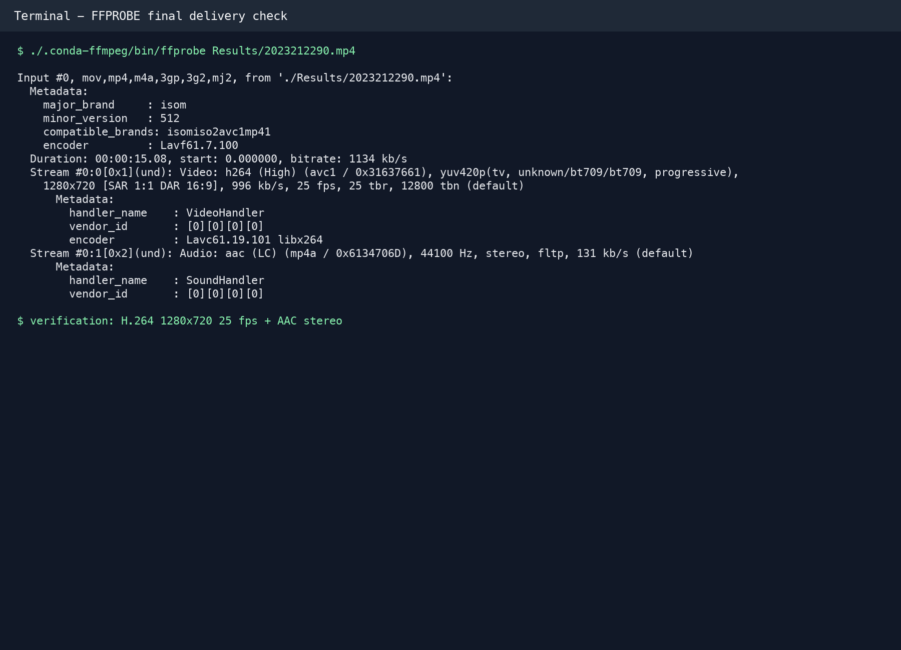

# 课程实验01：视频属性及FFMPEG开源编解码工具的使用

**班级：待填写　姓名：朱清扬　学号：2023212290**

## 实验环境与规范

实验于 2026 年 6 月 4 日在 macOS 环境完成。FFmpeg 7.1.1 安装在项目目录内独立 Conda 环境 `.conda-ffmpeg` 中，原始 `Video` 与 `Audio` 素材保持只读使用，全部中间文件、结果、证据图和日志分别写入 `Frames`、`Results`、`Evidence` 与 `Logs` 目录。实验通过 `STUDENT_ID=2023212290 FRAME_NUMBER=90 bash run_experiment.sh` 重复执行。

## 视频编码及处理操作完成情况

| 步骤 | 完成情况（Y/N） | 记录 |
| --- | :---: | --- |
| 1 视频抽帧及水印 | Y | 水印内容：`2023212290`；水印字号：34；水印颜色：白色，带 2 像素阴影；按照学号后两位选取第 90 帧。 |
| 2 单帧转视频 | Y | 水印图像大小：714,308 bytes（697.57 KiB）；3 秒视频大小：51,179 bytes（49.98 KiB）。静态画面在 H.264 帧间压缩后体积小于 PNG 图像。 |
| 3 RAW 素材处理 | Y | RAW 素材大小：42,768,000 bytes（40.79 MiB）；H.264 编码后视频大小：140,756 bytes（137.46 KiB），体积减少约 99.67%。 |
| 4 视频转码 | Y | 原 HEVC 视频大小：1,275,802 bytes（1.22 MiB）；转码后 H.264 视频大小：1,893,496 bytes（1.81 MiB）。分辨率从 792×360 放大至 1584×720，且 H.264 压缩效率低于 HEVC，因此文件增大约 48.42%。 |
| 5 视频裁切 | Y | 三段视频均从 1584×720 中心裁切为 1280×720，左右各移除 152 像素；视觉检查未见黑边，水印完整保留。 |
| 6 视频剪辑合成 | Y | 三段视频按 `R0001_720p`、`R0002_720p`、`R0003_720p` 顺序成功拼接。 |
| 7 替换背景音乐 | Y | 最终视频包含 AAC 44.1 kHz 双声道音频；FFmpeg 完整解码测试通过。 |

## 操作过程及命令

1. 按照学号后两位抽取第 90 帧并添加数字水印。水印向左放置在中心裁切安全区，确保后续裁切后内容仍然完整。

```bash
ffmpeg -i Video/0001.mp4 \
  -vf "select=eq(n\,89)" -fps_mode vfr -frames:v 1 -update 1 \
  Frames/0090.png

ffmpeg -i Frames/0090.png \
  -vf "drawtext=text='2023212290':x=w-tw-220:y=h-th-40:fontsize=34:fontcolor=white:shadowx=2:shadowy=2" \
  -frames:v 1 -update 1 Frames/0090wm.png
```


2. 将单帧水印图像转换为 3 秒、25 fps 的 H.264 视频，像素格式设为 `yuv420p` 以提高播放器兼容性。

```bash
ffmpeg -loop 1 -framerate 25 -i Frames/0090wm.png \
  -t 3 -c:v libx264 -crf 25 -pix_fmt yuv420p -an \
  Results/R0001.mp4
```

3. 将 1584×720、25 fps、`yuv420p` RAW 素材编码为 H.264。RAW 文件不包含容器和编码信息，因此命令中显式声明像素格式、分辨率和帧率。

```bash
ffmpeg -f rawvideo -pixel_format yuv420p -video_size 1584x720 -framerate 25 \
  -i Video/0002_1584x720_25.yuv \
  -c:v libx264 -crf 25 -r 25 -pix_fmt yuv420p -an \
  Results/R0002.mp4
```

RAW 素材编码后由 40.79 MiB 降至 137.46 KiB，压缩比约为 303.84:1，说明未经压缩的逐帧像素数据体积远大于采用帧内和帧间预测的 H.264 视频。

4. 将 792×360 HEVC 视频使用 Lanczos 算法放大至 1584×720，转码为 H.264 并移除原音频。

```bash
ffmpeg -i Video/0003.mp4 \
  -vf "scale=1584:720:flags=lanczos" \
  -c:v libx264 -crf 25 -r 25 -pix_fmt yuv420p -an \
  Results/R0003.mp4
```

模板中“降采样视频大小”的表述与手册操作不一致。本步骤实际将 792×360 放大为 1584×720，属于上采样；像素数量增加为原来的 4 倍，同时编码格式从 HEVC 改为 H.264，因此结果文件增大。

5. 将三段 1584×720 视频中心裁切为标准 1280×720，并统一编码参数。

```bash
ffmpeg -i Results/R0001.mp4 -vf "crop=1280:720" \
  -c:v libx264 -crf 25 -r 25 -pix_fmt yuv420p -an Results/R0001_720p.mp4

ffmpeg -i Results/R0002.mp4 -vf "crop=1280:720" \
  -c:v libx264 -crf 25 -r 25 -pix_fmt yuv420p -an Results/R0002_720p.mp4

ffmpeg -i Results/R0003.mp4 -vf "crop=1280:720" \
  -c:v libx264 -crf 25 -r 25 -pix_fmt yuv420p -an Results/R0003_720p.mp4
```


6. 使用 `list.txt` 指定顺序，将三段参数一致的 720p 视频拼接为完整视频。

```text
file R0001_720p.mp4
file R0002_720p.mp4
file R0003_720p.mp4
```

```bash
ffmpeg -f concat -safe 0 -i Results/list.txt \
  -c:v libx264 -crf 25 -r 25 -pix_fmt yuv420p -an \
  Results/R123.mp4
```

7. 循环读取背景音乐，映射拼接视频的视频流和背景音乐的音频流，生成约 15 秒最终视频。

```bash
ffmpeg -i Results/R123.mp4 -stream_loop -1 -i Audio/a0001.mp3 \
  -map 0:v:0 -map 1:a:0 -c:v copy -c:a aac -b:a 128k -t 15 \
  Results/2023212290.mp4
```

## 最终视频交付检查

使用 `ffprobe Results/2023212290.mp4` 检查最终视频。结果显示容器格式为 MP4，视频流采用 H.264 High Profile，分辨率为 1280×720，帧率为 25 fps，像素格式为 `yuv420p`；音频流采用 AAC LC，采样率为 44,100 Hz，双声道。文件大小为 2,138,702 bytes（2.04 MiB），容器记录时长约为 15.08 秒。另使用 `ffmpeg -v error -i Results/2023212290.mp4 -f null -` 进行完整解码，测试通过且无错误输出。



## 其他说明

1. 原始素材与生成结果均保留 SHA-256 校验记录，便于确认原始文件未被覆盖。
2. 图 3 使用实际 `ffprobe` 日志生成终端样式证据图，内容与 `Logs/ffprobe_final.txt` 一致。
3. 班级信息未提供，因此保留为待填写字段。
4. 本次未完成附加 DIY 实验。

## 实验报告成绩评定表

此表格用于教师评分，学生不自行填写。验收项不计得分，未提交为 0 分，过迟补交会酌情扣 1 至 3 分。

| 序号 | 评价内容 | 分值范围 | 得分 |
| :---: | --- | :---: | :---: |
| 验收 | 是否按时提交 | 不计分 |  |
| 1 | 报告格式是否规范，语言使用是否规范 | 3 分 |  |
| 2 | 视频属性记录是否正确，数据填写是否完整 | 3 分 |  |
| 3 | 实验结果是否正确，实验流程记录是否正确，视频截图是否正确 | 4 分 |  |
| 4 | 附加实验完成情况 | 额外酌情加分 |  |
| 最终得分 |  | 10 分 |  |

指导教师签章：　2026.06
