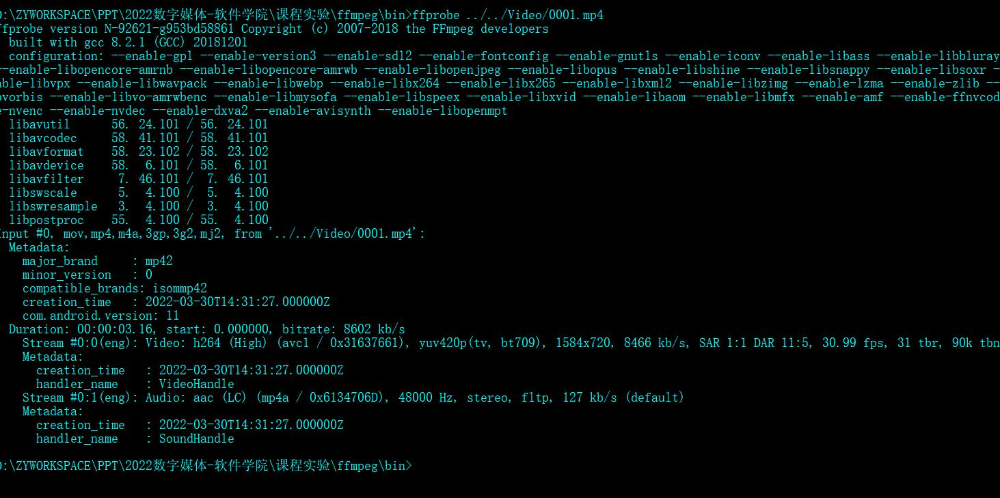

**数字媒体技术课程实验**

**视频属性及FFMPEG开源编解码工具的使用**

\***数据版权声明**：本实验视频素材来源于互联网，请尊重视频版权，全部素材仅用于课程ffmpeg工具使用实验，不要用于公开场合或进行公开传播。

\***已提供ffmpeg工具**在ffmpeg文件夹中，输入命令方式为在\./ffmpeg/bin/目录下打开cmd，在命令行输入相应的ffmpeg命令。期间如果遇到路径问题、命令错误、中文bug等方面的报错，鼓励自行搜索解决方案并记录。

**实验操作手册**

1. 在Video文件夹中找到0001\.mp4视频，采用ffmpeg抽帧，选取学号后两位对应的帧\(尾号为00或99的可任选一帧\)。随后删除其他帧，采用ffmpeg添加图像水印，水印内容为自己的学号（此处以202206222222示例）。

**抽帧参考命令示例\(刷黄的部分可以根据需要自行调整\)**

*ffmpeg \-i \.\./\.\./Video/0001\.mp4 \-vsync 0 \.\./\.\./Frames/%04d\.png*

**添加水印参考命令示例**

*ffmpeg \-i \.\./\.\./Frames/0080\.png \-vf "drawtext= text='202206222222':x=700: y=360:fontsize=34:fontcolor=white:shadowy=2" \.\./\.\./Frames/0080wm\.png*

1. 将上述图片转换为3s长度的mp4视频。分别记录单张图像及视频的文件大小。

**单帧图像转视频代码示例**

*ffmpeg \-r 25 \-f image2 \-loop 1 \-i \.\./\.\./Frames/0080wm\.png \-pix\_fmt yuv420p \-t 3 \-vcodec libx264 \.\./\.\./Results/R0001\.mp4 \-y*

1. 在Video文件夹中找到0002\_1584x720\_25\.yuv视频，采用ffmpeg将该RAW素材视频转换为H264编码格式的mp4视频。记录两个视频文件的大小，并简要比较说明。

**YUV文件转码示例**

*ffmpeg \-s 1584x720 \-i \.\./\.\./Video/0002\_1584x720\_25\.yuv \-vcodec libx264 \-crf 25 \-r 25 \.\./\.\./Results/R0002\.mp4 \-y*

1. 在Video文件夹中找到0003\.mp4视频，点击能否播放取决于你的电脑或播放器的解码库支持情况，可以使用ffplay播放该HEVC格式视频（选做）。

**ffplay播放视频命令**

*ffplay \.\./\.\./Video/0003\.mp4*

继续采用ffmpeg将该HEVC格式分辨率792x360视频0003\.mp4转换为分辨率1584x720的H\.264编码的mp4视频，移除音频。记录转码前后不同分辨率视频的文件大小，并简要比较说明。

**视频转码命令示例**

*ffmpeg \-i \.\./\.\./Video/0003\.mp4 \-vf scale=1584x720:flags=lanczos \-vcodec libx264 \-crf 25 \-r 25 \-pix\_fmt yuv420p \-an \.\./\.\./Results/R0003\.mp4 \-y*

1. 现在Results文件夹下有三个结果视频，由于手机录制的原始素材有黑边，希望裁切掉视频两边的黑边部分。采用ffmpeg分别从每个视频中切取1280x720分辨率的画面，形成新的三个符合标准720p分辨率结果视频。

**视频画面裁切命令示例**

*ffmpeg \-i \.\./\.\./Results/R0001\.mp4 \-vf crop=1280:720 \.\./\.\./Results/R0001\_720p\.mp4* 

1. 将三个标准720p分辨率的结果视频拼在一起，组成完整视频，

**视频片段拼接合并命令示例**

*ffmpeg \-f concat \-safe 0 \-i \.\./\.\./Results/list\.txt \-vcodec libx264 \-crf 35 \.\./\.\./Results/R123\.mp4*

**\# 其中 list\.txt 是合并视频的文件列表，格式如下（file 路径/视频名称）：** 

*file R0001\_720p\.mp4*

*file R0002\_720p\.mp4*

*file R0003\_720p\.mp4*

1. 给完整视频替换上新声音，得到最终结果视频，名称请用你的学号命名。

**音频替换命令示例**

*ffmpeg \-an \-i \.\./\.\./Results/R123\.mp4 \-stream\_loop \-1 \-i \.\./\.\./Audio/a0001\.mp3 \-c:v copy \-t 15 \-y \.\./\.\./Results/202206222222\.mp*

**实验报告及视频上交**

仅上交最后以学号命名的实验报告即可。[发送至邮箱2021214800@mail\.hfut\.edu\.cn](mailto:发送至邮箱yzhao@hfut.edu.cn)<u>（邮件记得署名）</u>

视频不需上交，使用ffprobe展示视频属性，截图贴在实验报告上作为视频结果。

**参考命令示例：**

*ffprobe  \.\./\.\./Results/202206222222\.mp4*

截图示例：

**附加DIY实验** \(不做不扣分，有提交则另行加分，加分后不超过满分上限\)

1. **要求：**

选择一个自己喜欢的主题，收集或录制若干视频素材，采用本次实验学习到的ffmpeg命令剪辑、编辑、添加文字等做成一个短视频。最终提交视频时长2min以内，视频不要超过20M。

1. **提交说明：**

视频命名为“*202206222222\_附加实验\.mp4*”，和正常实验报告一起提交。把mp4视频文件压缩为zip或rar压缩包，作为附件一并发送至邮箱yzhao@hfut\.edu\.cn，。

1. **附加实验得分说明：**

无论提不提交均不扣分，额外加分，但不溢出。例如本次实验满分10分，实验分8分，附加分3分，则最终得分为满分10分。给对视频编辑感兴趣或者对满分有需求的同学一个刷分机会。