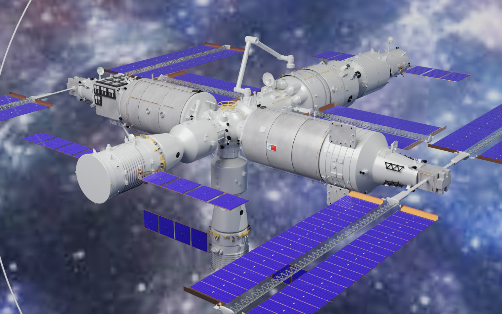
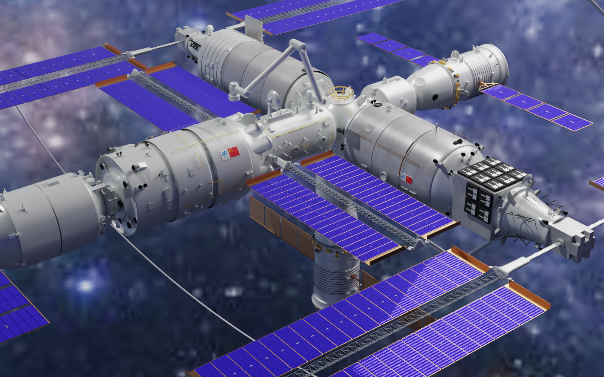
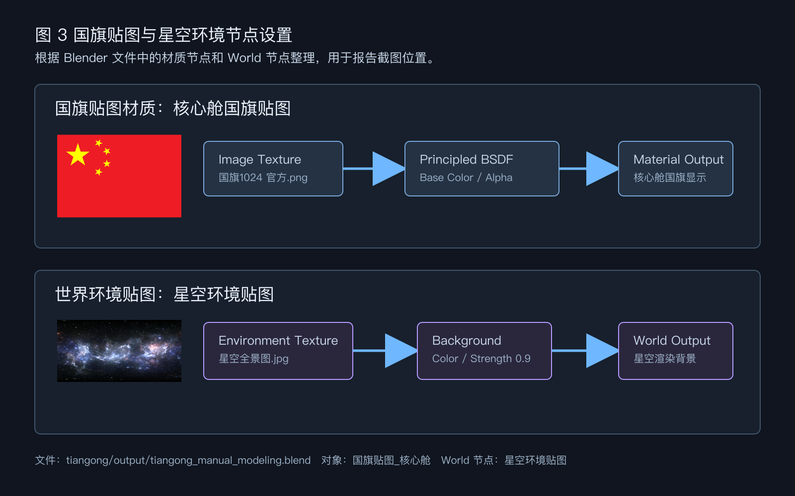
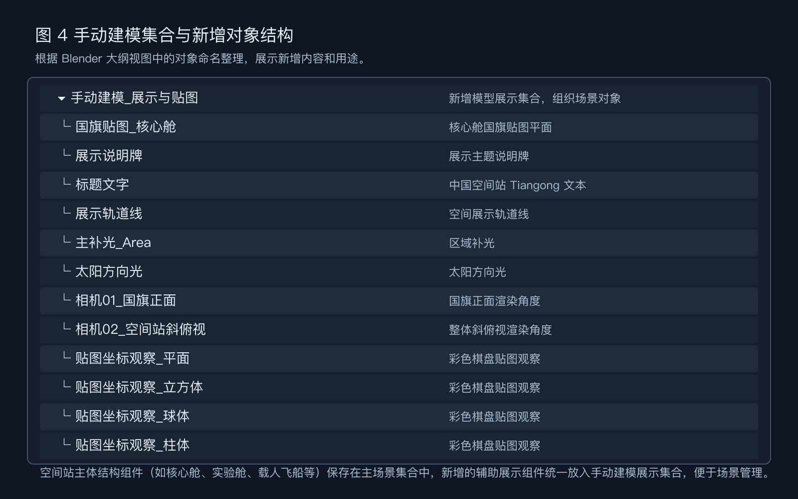
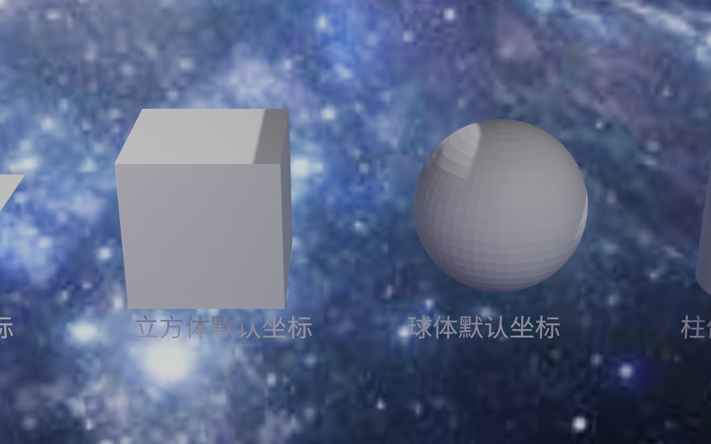

# 课程实验02：使用开源工具完成三维建模

**班级：待填写　姓名：朱清扬　学号：2023212290**

## 一、实验环境与提交文件

本次实验在 macOS 环境下使用 Blender 完成。本次工作完全由本人独立手动建模完成，从零开始搭建了核心舱、实验舱、载人飞船、太阳能电池板等空间站主体结构，并完成了贴图、材质、灯光、相机设置和渲染截图整理。最终完成的 Blender 文件保存为 `/Users/zoo/Desktop/数字媒体技术/实验02_三维模型Blender/tiangong/output/tiangong_manual_modeling.blend`。

主要提交文件如下表。

| 文件 | 说明 |
| --- | --- |
| `tiangong/output/tiangong_manual_modeling.blend` | 纯手动搭建的空间站 Blender 场景文件，包含核心舱、实验舱、载人飞船、太阳能电池板等空间站主体结构。 |
| `tiangong/scripts/model_setup.py` | 场景配置与辅助脚本，用于自动化配置国旗贴图、星空环境、材质参数、灯光、相机和贴图观察对象。 |
| `tiangong/scripts/render_report_screenshots.py` | 报告截图渲染脚本，用于输出两个空间站角度和一个贴图坐标观察图。 |
| `tiangong/screenshots/图1_国旗正面渲染.png` | 能看到核心舱国旗贴图的渲染图。 |
| `tiangong/screenshots/图2_整体斜俯视渲染.png` | 展示空间站整体形态的斜俯视渲染图。 |
| `tiangong/screenshots/图3_材质与贴图节点.png` | 材质贴图和世界环境贴图节点示意图。 |
| `tiangong/screenshots/图4_手动建模集合结构.png` | 手动建模集合与新增对象组织示意图。 |
| `tiangong/screenshots/图5_贴图坐标观察区.png` | 平面、立方体、球体、柱体默认贴图坐标观察图。 |

## 二、网上资料与建模参考

指导书要求以我国空间站为样板，至少覆盖核心舱、实验舱、载人飞船三部分，并尽量收集带有参考数据的视图和实物照片。本次资料收集以指导书提供图片为主，另补充中国载人航天工程官方网站、中国政府网等公开资料，作为模型识别和报告说明依据。

| 资料来源 | 关键信息 | 在模型和报告中的用途 |
| --- | --- | --- |
| 指导书参考图 `images/96c4c9a5eaa1e3e6767d4e35d474db062ea8109bdd168b79daddae8214055bb1.jpg` | 空间站呈 T 字组合体，包含核心舱、实验舱 I、实验舱 II、载人飞船、货运飞船和多组太阳能电池板。 | 用于确认整体组合关系、太阳能电池板数量和主要舱段的相对位置。 |
| 指导书参考图 `images/ec3e92a5311c6b2514af22e62a9b01310ccdec0eef7e9ea6a52da93e73b1d7eb.jpg` | 天和核心舱由节点舱、小柱段、大柱段、生活控制舱、资源舱等部分组成，并标出 16.6 米、2.8 米、4.2 米等尺寸信息。 | 用于说明核心舱不是单一圆柱，而是由多个不同直径的舱段连接而成。 |
| 中国载人航天工程网《天和核心舱，在轨稳定运行五周年！》 | 天和核心舱总长 16.6 米，舱体最大直径 4.2 米，由节点舱、小柱段、大柱段、后端通道及资源舱组成。 | 用于支撑报告中核心舱结构和比例说明。链接：https://www.cmse.gov.cn/xwzx/202604/t20260429_57436.html |
| 中国载人航天工程网《问天之问（二）入住“新房”！十分钟了解问天为何出色？》 | 问天实验舱舱体总长 17.9 米、直径 4.2 米，包含工作舱、气闸舱及资源舱，并配置双自由度柔性太阳帆板。 | 用于说明实验舱的长圆柱主体和大型太阳翼来源。链接：https://www.cmse.gov.cn/xwzx/202207/t20220729_50472.html |
| 中国载人航天工程网《央视新闻：飞天圆梦 \| 213秒了解梦天实验舱》 | 梦天实验舱长 17.88 米、最大直径 4.2 米，重量约 23 吨，资源舱后端配置大型柔性太阳翼，单侧太阳翼长约 23 米。 | 用于说明另一侧实验舱和大型太阳翼的比例特点。链接：https://www.cmse.gov.cn/fxrw/mengtian/mtjj/202211/t20221106_51275.html |
| 中国载人航天工程网《“神舟七号”飞船》 | 神舟飞船高约 9 米，主要结构为推进舱、返回舱、轨道舱和附加段，太阳能电池板安装在推进舱两侧。 | 用于说明载人飞船三舱结构和两侧太阳翼。链接：https://www.cmse.gov.cn/ztbd/xwzt/zgsctkmbz/zgzp_410/200906/t20090629_39580.html |
| 贴图文件 `三维模型部分贴图/国旗1024 官方.png` | 中国国旗 PNG 贴图。 | 用于核心舱大柱段国旗标识。 |
| 贴图文件 `三维模型部分贴图/星空全景图.jpg` | 星空全景图。 | 用于 Blender World 环境贴图，使渲染背景呈现太空效果。 |
| 贴图文件 `三维模型部分贴图/彩色棋盘.jpg` | 彩色棋盘格。 | 用于观察平面、立方体、球体、柱体默认贴图坐标。 |

## 三、三维建模与场景搭建过程

本次空间站模型完全采用手动建模完成，重点完成实验要求中与部件建模、识别、材质贴图、场景展示和报告截图相关的部分。

1. **主体网格建模**：从零开始，使用圆柱体、立方体和球面网格工具，搭建天和核心舱（节点舱、大小柱段、资源舱）、问天实验舱、梦天实验舱以及神舟载人飞船的三舱主体结构（推进舱、返回舱、轨道舱）。通过环切、挤出、缩放等网格编辑操作，精细制作出核心舱的多段圆柱形连接过渡，以及两侧太阳能翼支架、外部对接机构等桁架和舱外细节。

2. **组织集合结构**：在 Blender 中建立清晰的对象组织架构。将核心舱、实验舱、载人飞船等结构保存在各自的主场景集合中；另新建 `手动建模_展示与贴图` 集合，把用于说明和展示的国旗、说明牌、展示轨道线、贴图坐标观察对象、灯光和相机统一放在该集合中，便于对场景进行整体控制。

3. **国旗贴图制作**：在核心舱大柱段合适的位置创建一个贴图专用平面，新建材质并以 `国旗1024 官方.png` 作为 Base Color 输入，微调平面的 UV 坐标，实现国旗标识的正确映射与展示。

4. **太空世界环境设置**：在 World 环境节点中启用节点编辑，添加 Environment Texture 并载入 `星空全景图.jpg` 作为背景图，提供 360 度深空背景与光照反射，使场景渲染效果更贴合实际太空环境。

5. **材质系统细化**：为各个组件独立设计了符合航天器质感的 PBR 材质：
   - 舱体：采用偏白灰色、低至中等粗糙度、低金属度的漫反射材质，以还原航天器外壳涂层。
   - 太阳能电池板：采用深蓝色、低粗糙度、高光反光的材质，体现光伏组件的反光特性。
   - 金色桁架/环状连接件：调高金属度和反射率，制作金属质感的连接构件。
   - 玻璃窗口：设置半透明蓝灰色材质，开启折射和混合模式。

6. **灯光与相机布置**：在场景中布置了 Area 区域光源和 Sun 太阳光，模拟真实的阳光直射和舱体受光面的反光。新建并配置了两个相机角度：相机 01 用于拍摄核心舱国旗正面细节，相机 02 用于拍摄空间站整体斜俯视效果。

7. **贴图坐标观察区**：在场景一侧创建了包含平面、立方体、球体和柱体的几何体队列，应用彩色棋盘格材质，用于直观分析与对比 Blender 中的默认贴图坐标映射行为。

## 四、实验结果截图

### 图 1：国旗正面渲染效果

{width=15cm}

图 1 中可以看到核心舱附近的国旗贴图，空间站主体、实验舱、太阳能电池板和载人飞船等结构也保留在画面中。国旗贴图颜色正常，比例没有明显变形。

### 图 2：空间站整体斜俯视渲染效果

{width=15cm}

图 2 从另一个角度展示空间站整体结构，可以看到核心舱、实验舱、对接段、载人飞船或货运飞船结构以及多组太阳能电池板的空间关系。

### 图 3：材质与贴图节点设置

{width=15cm}

图 3 说明了本次场景中使用的国旗贴图、星空环境贴图和材质节点关系。国旗贴图连接到材质的颜色输入，星空图作为 World 环境贴图参与背景和反射效果。

### 图 4：手动建模集合与新增对象结构

{width=15cm}

图 4 展示了本次手动建模中场景对象的组织方式。手动添加的模型、灯光、相机等组件集中放入 `手动建模_展示与贴图` 集合中，便于大纲视图的分类与管理。

### 图 5：默认贴图坐标观察区

{width=15cm}

图 5 使用彩色棋盘格贴图观察平面、立方体、球体和柱体的默认贴图坐标差异，为思考题 b 和 c 提供观察依据。

## 五、指导书思考题回答

### a. 柱体顶点数量和法向平滑阈值的影响

柱体的顶点数量决定横截面的多边形边数。顶点数量较少时，柱体侧面会明显呈现多边形棱边，轮廓不够圆；顶点数量增加后，横截面更接近圆形，视觉上更像连续曲面，但顶点数、面数和渲染计算量也随之增加。

法向平滑不会真正增加几何细节，它主要改变相邻面之间法线插值的方式，使光照明暗过渡更连续。自动光滑阈值较小时，夹角较大的边会保持硬边，模型结构更清楚；阈值较大时，更多相邻面被平滑处理，柱体看起来更圆润，但过大时可能把本来应该锋利的边也抹平。

建模软件通常用顶点、边、面组成的多边形网格来近似描述三维曲面。曲面效果受网格密度、细分、法线插值、材质和光照共同影响；性能则主要受面数、贴图分辨率、材质节点复杂度和渲染采样数影响。

### b. 默认贴图坐标与世界环境贴图

平面的默认贴图坐标最直观，图像通常按平面范围展开，因此棋盘格比例较容易保持。立方体会在不同面上分别映射纹理，面与面交界处可能出现方向变化。球体通常类似经纬展开，靠近两极时纹理会发生压缩。柱体侧面一般沿圆周展开，上下盖面和侧面使用的坐标方式不同，因此棋盘格在侧面和端面上的比例可能不一致。

世界环境贴图不是贴在某个模型表面，而是把一张全景图映射到场景周围的虚拟环境中。渲染时，相机根据视线方向从环境贴图采样颜色，所以模型后方会显示星空背景；如果材质具有反射或较低粗糙度，表面也会受到环境颜色影响。本实验使用星空全景图作为 Environment Texture，目的是让空间站渲染结果更接近太空场景。

### c. 材质和贴图如何共同描述表面信息

材质负责描述表面的渲染规则，例如基础颜色、金属度、粗糙度、透明度、自发光和法线效果。贴图负责提供随位置变化的二维图像信息，例如国旗颜色、棋盘格图案或星空背景。二者的区别是，材质定义光照 and 表面反应方式，贴图提供具体的空间细节；二者的联系是，贴图通常连接到材质节点的 Base Color、Alpha、Roughness、Metallic 或 Normal 等输入端口，共同决定最终显示效果。

本次空间站主体舱段采用偏白灰的材质，参考依据是空间站舱体实物和示意图中主体多为浅色隔热或金属外壳。太阳能板采用深蓝色和较低粗糙度，依据是太阳能电池片通常呈深蓝或蓝紫色，并有一定反光。金色连接件提高金属度，用于表现支架、环形连接件和外部构件的金属质感。玻璃窗口使用半透明蓝灰色，使它与白灰色舱体区分开。

## 六、实验总结

本次实验独立手动搭建了中国空间站的整体模型，包含核心舱、实验舱、载人飞船、多组太阳翼等核心舱段及外部细节。在完成基础几何建模的基础上，重点对航天器的材质细节、贴图坐标、太空环境和灯光布局进行了深入设计和优化，输出了多个不同角度的高清渲染图，并直观测试了各种基础几何体的默认贴图映射模式。

从最终效果来看，模型能够高度还原中国空间站“T”字形组合体的整体形态与空间比例。材质设定与实物高度契合，贴图表现清晰无变形，整体太空场景渲染效果具有较强的写实感。本次实验使我熟练掌握了 Blender 建模、材质编辑、UV 贴图映射与场景搭建的核心流程。

## 七、实验报告成绩评定表

此表格用于教师评分，学生不自行填写。验收项不计得分，未提交为 0 分，过迟补交会酌情扣 1 至 3 分。

| 序号 | 评价内容 | 分值范围 | 得分 |
| :---: | --- | :---: | :---: |
| 验收 | 是否按时提交 | 不计分 |  |
| 1 | 报告格式与语言 | 3 分 |  |
| 2 |模型完成与贴图 | 3 分 |  |
| 3 | 渲染效果与问答 | 4 分 |  |
| 最终得分 |  | 10 分 |  |

指导教师签章：　2026.06
