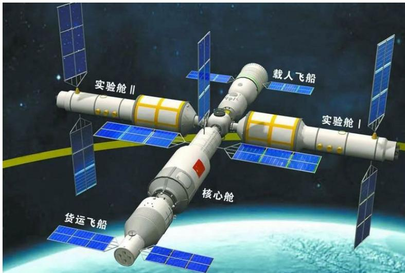
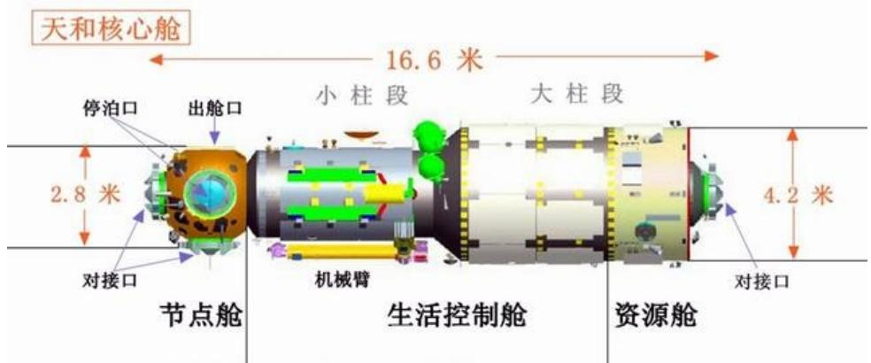
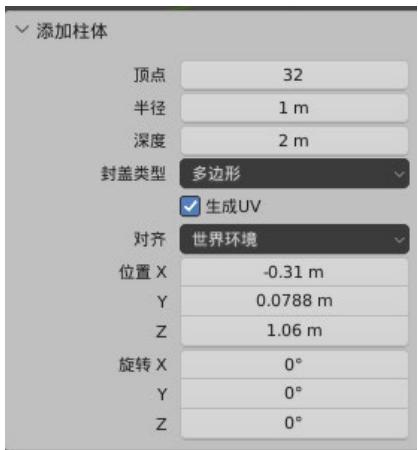
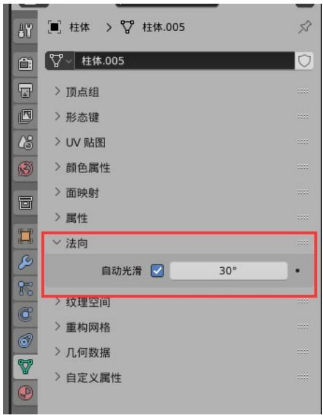
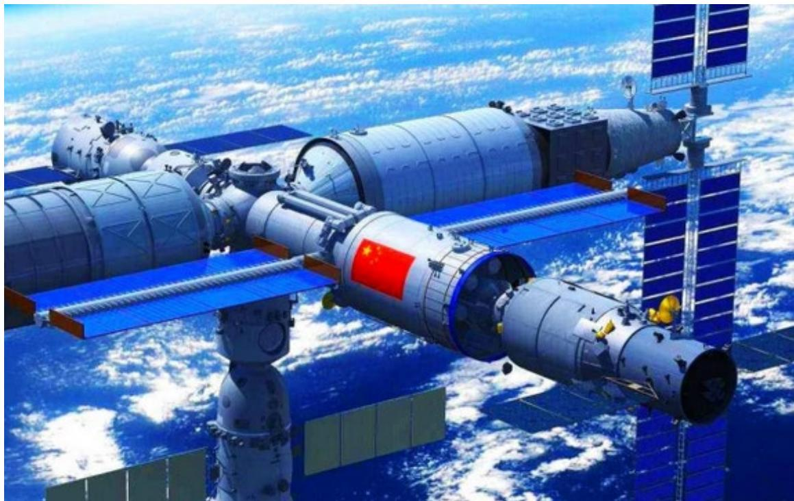
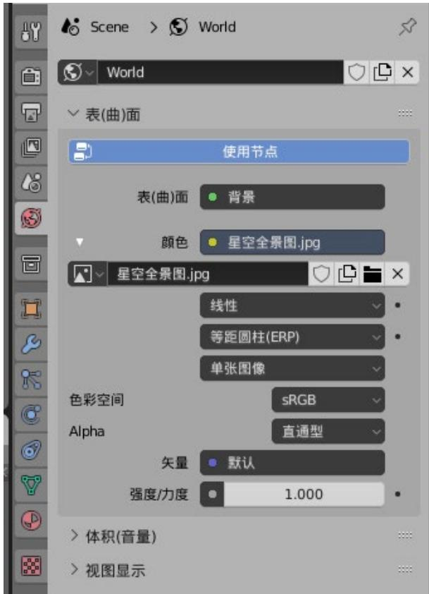
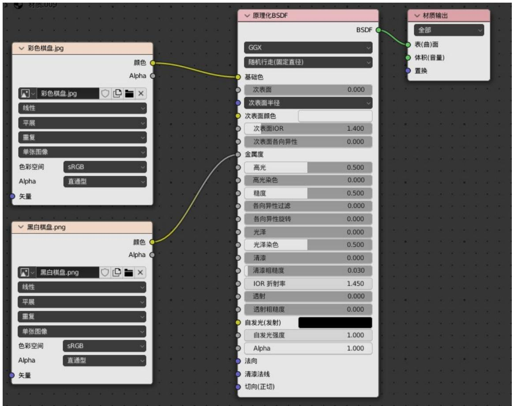

## 第二部分：Blender 三维建模

## 实验准备：

Blender 下载与安装。从 https://www.blender.org/下载和安装对应操作系 统里最新版本的blender，打开并熟悉基本的视口操作和按钮功能。 

（推荐一个入门视频：【blender】blender3.1 新手 0 基础入门【全集】，全中文教程，中 文软件，(普通话+全流程+案例+学习)持续跟新中_哔哩哔哩_bilibili） 

## 实验目标：

1. 熟悉blender安装和基本操作； 

2. 收集素材，通过基本几何体和网格编辑，对空间站组件进行建模； 

3. 设置材质、贴图，了解其如何共同描述模型表面信息； 

4. 组装空间站的各种形态。 

## 实验步骤：

## 1. 素材收集

以我国空间站为样板，收集素材图片，你至少需要覆盖：核心舱、实验舱、 载人飞船三部分。 

尽量收集有一定参考数据的正交投影视图，作为建模参考（不需要数据十分 精确）。同时获得实物照片，用于分析材质 

## 2. 部件化建模：

通过 球体、圆柱、胶囊等带曲面的物体制作各个舱体段； 

通过多种基本几何体对模型进行组合，增加一些模型细节如对接口、凸起部 件等等； 

通过平面对太阳能板进行建模； 

此阶段可自行选择使用挤出、细分、倒角、布尔以至雕刻等功能进行轮廓编 辑，但每种功能点到为止。 

思考a：建模中需要大量曲面，创建一个柱体，调整初始化顶点参数，观察结果 

针对已创建的圆柱体，进入右侧“物体数据属性”页，在法向项目中点击自 动光滑，而后在物体右键菜单中将着色方式改为“平滑着色”，此后修改“法 向”属性中的自动光滑角度阈值，观察结果。 

## 3. 材质与贴图

为你创建的所有部件创建材质，尝试调整其下相关参数，使得你的模型基本 颜色符合相关材料。 

选择合适的贴图方式，通过编辑贴图文件或者 UV 坐标，将给定的国旗贴到 空间站的对应位置上（核心舱大柱段），确保国旗显示颜色和比例正常。 

将包中的“星空全景图.jpg”设置为世界环境贴图（如果你可以找到更好的 贴图，可自行寻找）。 

思考 b：将包内文件黑白或彩色棋盘格作为贴图，贴到平面、立方体、球体、 圆柱上，查看这三种基本几何体默认的贴图坐标。 

思考 c：通过改变材质参数，分析其作用，而后导入包中的彩色棋盘格和黑 白棋盘格，在 shading 界面，尝试将其颜色值连接到材质的某一个值上，观察其 对材质渲染效果的影响。 

## 4. 集合、装配与导入导出

将所建模型组合为如下集合：核心舱（含节点仓）、实验舱、载人飞船。通过 对整个集合进行平移、旋转操作，通过多种方式将空间站组合在一起。 

编辑相机位置，在至少两个角度（其中一个能正面看到国旗），渲染结果图。 

保存当前文件，备下一次实验使用。 

## 《三维建模》实验报告

1. 完成至少包含核心舱（含节点仓）、实验舱、载人飞船的建模。包含舱体和相 应的太阳能电池板。除国旗和星空环境必须使用贴图展示外，其他表面可自 选是否使用贴图。其中展示至少 2 个角度空间站的渲染结果（其中一个能正 面看到国旗）。 

2. 提供你用于空间站建模的参考图片和自选贴图，说明你从这些图片中提取了 哪些建模所需的信息。 

3. 回答指导书中的思考题: 

a) 柱体顶点数量和法向平滑阈值的改变导致的结果，分析建模软件中用什 么方式描述三维曲面，他的性能和效果受到什么影响？ 

b) 根据平面、立方体、球体、柱体的默认贴图坐标，根据我们提供的星空 贴图及其应用结果，试分析世界环境贴图是如何实现的。 

c) 材质和贴图是如何共同描述物体表面信息的，其关联与区别如何？你设 置的空间站主体材质参数如何？有何根据？ 