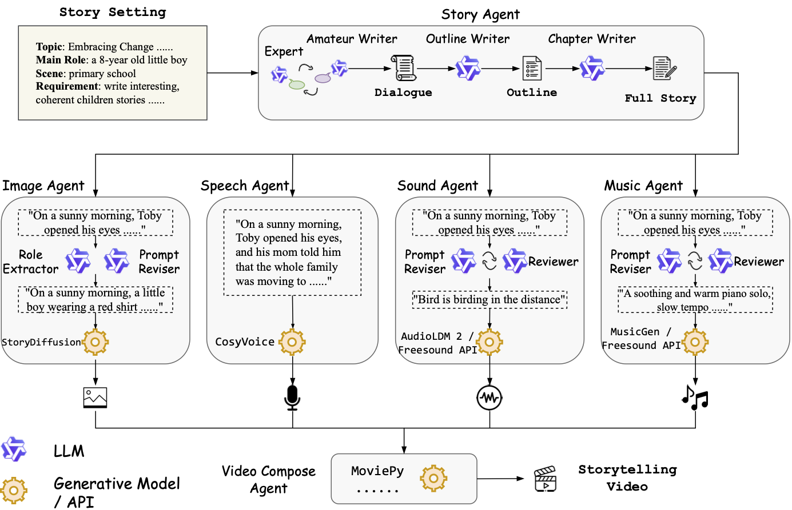

# 2026年《数字媒体技术》课程调研报告

## 从文本到短片：多智能体协同在 AI 视频生成与数字媒体创作流程中的应用调研

| 项目 | 信息 |
|:---:|:---|
| 班级 | 计科 23-3 班 |
| 成员 1 | 朱清扬，2023212290 |
| 成员 2 | 李奕霖，2023215332 |
| 日期 | 2026.06.13 |

# 调研报告摘要

本文围绕 AI 视频创作由单模型生成向多智能体协同流程演进的趋势展开调研，综合分析 Sora、Google Flow、Adobe Firefly 等产品，StoryAgent、VideoDiff、VBench 等研究，以及 ComfyUI、MM-StoryAgent 等开源项目。调研发现，行业竞争重点正由单段视频画质转向分镜控制、角色一致性、音画协同、时间线编辑、模型路由和质量反馈。多智能体系统可将需求理解、编剧、分镜、素材管理、生成、声音、剪辑与审校分配给不同角色，并由人类负责目标、审美和最终决策。其主要瓶颈仍包括长时序一致性、控制复杂度、自动评价、成本、版权与溯源。

本调研团队由朱清扬（2023212290）与李奕霖（2023215332）组成。朱清扬担任队长，主导选题设计、资料检索方案、产品与论文分析、整体结构规划、主要章节撰写、图表整理和终稿统筹；李奕霖参与资料筛选与交叉核对，协助整理国内外案例、开源项目和参考文献，并对报告语言与格式进行复核。

**关键词：** AI 视频生成；多智能体系统；数字媒体创作；工作流；人机协同

**调研团队成员电子签名：**

| 朱清扬 | 李奕霖 |
|:---:|:---:|
| {width=1.6in} | {width=1.6in} |

# 调研报告正文

## 引言与问题界定

数字媒体产业正在把视频推到内容生产的中心位置。Deloitte 在 2025 年《Digital Media Trends》中指出，视频娱乐已经被社交平台、创作者、UGC 与推荐/广告模型重塑；IAB/PwC 的 2024 年互联网广告收入报告则显示，美国数字广告收入已达到 2590 亿美元，品牌预算持续向高效率、可规模化的视频内容迁移。与此同时，虚拟制作与预演工具快速进入影视工业流程：Google 的 Veo 3 已被 Canal+ 用于拍摄前预演，Epic 也持续围绕 Unreal 的虚拟制作能力在 NAB 与 Unreal Fest 等场景推进生产应用。换言之，短视频、广告、预演、数字人和游戏/交互内容的多重需求，共同把“AI 视频”从演示能力变成了数字媒体技术中的关键基础设施议题。

但“从文本到短片”之所以比“文生图”或“文生一个视频片段”复杂得多，在于它是一个**层级化叙事任务**，而不是一次性视觉合成任务。它至少同时包含情节结构、人物与场景的一致性、镜头语言、时序连续性、音画同步、节奏设计、字幕与配乐、风格统一、版权/安全审查以及面向平台反馈的再编辑等环节。VBench 将视频生成质量拆成 16 个细粒度维度，包括主体一致性、背景一致性、时间平滑、空间关系等；VBench-2.0 又进一步把评测推进到 human fidelity、controllability、physics、commonsense 等维度。这说明行业和学术界都已承认：视频质量不是单一分数，而是一个需要多阶段管理的系统问题。

因此，本文把“单模型创作”与“流程化创作”区分为两种范式。前者强调一个强大的生成模型直接从 prompt 产出片段；后者则更像一条数字媒体生产线，核心环节包括 brief 理解、创意策划、剧本/分场、分镜、参考资产管理、镜头生成、音频与字幕生成、剪辑与版本比较、评估与审校，再到发布后的反馈闭环。Google Flow、Adobe Firefly、Luma Agents、StoryAgent、MovieAgent、VideoDiff、VideOrigami 等系统都已把“共享上下文”“版本比较”“分镜中间表示”“角色分工”或“跨工具编排”放到显著位置，这正是本文判断 AI 视频创作正在转向多智能体工作流的重要依据。

## 产业背景与产品演进

生成式视频的产品演进表明，行业关注点已经从“能否由文字生成一个短片段”转向“能否围绕多个镜头持续创作”。OpenAI 在 Sora 的产品界面中引入 storyboard、extend、remix 与 blend 等功能，使用户能够以分镜和已有素材为中间控制手段。Google 在 2025 年推出 Flow，将 Veo、Imagen 与 Gemini 组织为面向电影化创作的工具，并提供 Camera Controls、Scenebuilder 与 Asset Management。两者都说明，视频生成产品正在主动补齐镜头规划、素材管理和连续编辑能力。

Google Flow 对“ingredients”的设计尤其具有代表性。创作者可以把角色、物体和风格参考作为可复用资产，再在不同镜头中调用；Frames to Video 则允许指定起止画面，为镜头衔接提供更精确的控制。它并没有把提示词视为唯一输入，而是把参考资产、镜头状态和项目上下文共同纳入生成过程。这种产品结构与传统影视制作中的角色设定、场景设定和镜头表具有明显对应关系。

{width=5.6in}

**图1. Google Flow 将生成模型组织为面向镜头与场景的创作工具**

Adobe 的路线更强调生成与既有后期流程的结合。Firefly Video 支持文本生成视频、图像生成视频、相机角度控制以及首尾帧约束；Premiere Pro 中的 Generative Extend 则把生成能力直接放入时间线，用于补足画面或音频长度。Adobe 还在 Firefly 中整合自有模型和合作伙伴模型，使创作者能够在同一工作环境中完成构思、生成、编辑与交付。其价值不只是模型数量增加，而是降低多模型切换、素材搬运和版本管理的成本。

{width=5.6in}

**图2. Adobe Firefly Video 面向生成、编辑与后期衔接的一体化界面**

Runway、Luma 以及国内的可灵、Seedance、Wan 等产品也持续强化参考图驱动、角色一致性、视频编辑、镜头延展和音画协同。不同厂商的技术路线并不相同，但产品功能正在趋向同一目标：把一次性生成改造成可反复调整的镜头生产环节。由此可见，未来竞争不仅取决于基础模型的画质，还取决于系统能否管理角色、场景、音频、版本、成本和质量反馈。

综合上述产品，可以把产业趋势归纳为四点：视频生成由无声片段走向音画协同；控制方式由单一提示词扩展到分镜、参考图、首尾帧、相机参数和时间线；产品由单模型入口走向多模型创作平台；评价重点由“第一眼是否惊艳”转向“能否复用、修改、审校并进入真实生产流程”。这些变化共同构成多智能体与流程化创作兴起的产业基础。

**表1. 典型 AI 视频产品的流程化能力比较**

| 产品或系统 | 主要控制方式 | 对工作流的意义 |
|:---:|:---|:---|
| Sora | Storyboard、扩展、混合、重制 | 用分镜和既有素材控制生成过程 |
| Google Flow | Ingredients、相机控制、Scenebuilder | 管理跨镜头角色、物体与场景 |
| Adobe Firefly | 首尾帧、相机参数、时间线与模型选择 | 连接构思、生成、后期和交付 |
| Runway / Luma | 视频编辑、运动迁移、版本迭代 | 强化镜头修改与多版本比较 |
| 可灵 / Seedance / Wan | 参考图、多镜头、音画协同、视频编辑 | 面向短视频与本土创作场景完善生产能力 |

## 学术研究与方法证据

从学术演进来看，视频生成首先经历的是“基础模型”阶段。Ho 等人的 *Video Diffusion Models* 把视频扩散模型确立为重要方向；Google 的 *Lumiere* 通过 Space-Time U-Net 一次性生成整段时间轴，强调真实而连贯的运动；OpenAI 的 *Video generation models as world simulators* 则把视频模型直接上升到“世界模拟”层面；随后，CogVideoX 与 HunyuanVideo 分别从 3D VAE、Expert Transformer、联合图像-视频训练、13B 级开放模型等路线继续提升长时序与文本对齐能力。这个阶段的主要贡献，是把“能不能生成看起来像视频的东西”推进到了“能不能生成更长、更清晰、更可对齐的视频”。但这仍然主要是**模型中心**的进步。

随后，研究重心快速转向**控制、编辑与时序结构**。ICCV 2023 的 *Tune-A-Video* 证明预训练图像扩散模型可以通过一次调优延伸到视频生成；SIGGRAPH 2024 的 *Direct-a-Video* 允许用户分别指定多物体运动与相机运动；*MM-Diffusion* 把音频与视频联合生成正式纳入扩散建模；CVPR 2025 的 *StreamingT2V* 明确处理“如何把短视频模型扩展到 2 分钟以上平滑长视频”的问题；CVPR 2025 的 *MinT* 进一步把多事件视频中的时间戳控制能力作为核心贡献。若把这些工作放在一起看，可以发现研究议题已经从“视觉保真度”扩展为“镜头可控性、事件调度、长视频连续性、音画协同”：也就是越来越接近真实创作流程中的导演问题，而不是单纯的生成问题。

更能直接支撑本文核心判断的，是把“分镜/流程/角色协同”作为中间层的研究。*StoryAgent* 把 customized storytelling video generation 分解为故事设计、storyboard generation、video creation、agent coordination 和 result evaluation 等专门 agent；*MovieAgent* 则明确让多个 LLM agent 扮演导演、编剧、分镜师和场记/场景管理者，用 hierarchical CoT 自动结构化 scene、shot 和 cinematography，并追求角色一致性、稳定音频与字幕同步。换言之，这一方向已经不再把“视频生成”视为单模型的一步推断，而是把它视为一个可被角色化、阶段化、结构化分解的生产过程。这正是多智能体范式进入视频创作研究核心的直接证据。

人机协同研究进一步说明，仅靠自然语言 prompt 不足以支持高质量视频创作。CHI 2025 的 *VideoDiff* 让创作者在 rough cut、B-roll 插入和文本特效等步骤中同时比较多种 AI 建议；*VideOrigami* 明确指出，有效的人机共创需要的不只是 prompt 和结果，而是能支撑 inspection、control、planning、iteration 的组合式结构；*Intent Tagging* 则强调微提示与非线性工作流，使用户能够更细粒度地表达并修正意图。Adobe Research 对 CHI 2025 成果的总结也直接提出：真正的 co-creation 需要的是贯穿整个创意过程的人机协同环境，而不是一次性问答式交互。对于“从文本到短片”而言，这些发现非常关键，因为短片本质上就是一种多轮迭代、跨阶段决策、版本比较极其频繁的媒介生产任务。

评价研究则把“流程问题”进一步制度化了。VBench 把视频质量拆成多维指标；VBench-2.0 强调 intrinsic faithfulness，并加入 physics 和 commonsense；DEVIL 提出 dynamics 维度下的独立评测，报告其与人工评分的高相关；而 *VideoGen-Eval* 更直接采用 agent-based evaluation，把 LLM 内容结构化、MLLM 判断与针对时间密集维度的 patch tools 组合起来。这说明一个越来越明确的现实：如果视频创作本身是多步骤、多目标的，那么评估体系也必须是多角色、多算子、可扩展的；单一指标已经无法支撑真实创作流水线内的自动 QA。

## 开源生态与工业佐证

开源生态可以检验一种技术是否具备可组合、可复现和可扩展的基础。ComfyUI 的节点式界面允许用户把文本编码、图像参考、视频模型、结构控制、插帧、放大和导出等环节连接成图形化流程。其意义在于，创作者不必把全部能力寄托于一个模型，而可以根据镜头需求替换节点、保存流程并复用参数。AnimateDiff、CogVideoX、HunyuanVideo、Wan 等项目对 ComfyUI 或 Diffusers 的适配，又进一步增强了这种模块化趋势。

多智能体开源项目则从另一侧补足流程组织能力。CrewAI、AutoGen 等通用框架提供角色、任务、工具和流程控制机制；MM-StoryAgent 等垂直项目把故事写作、图像、语音、音效、音乐与视频合成组织为多阶段管线。它们说明，多智能体视频系统并不一定需要从零训练一个巨型模型，而可以通过明确的数据接口和调度机制，把语言模型、生成模型、传统算法与人工审核组合起来。

{width=5.8in}

**图3. MM-StoryAgent 将文本、图像、语音、音效和音乐智能体组织为视频生产管线**

当然，开源项目的关注度并不等同于工业成熟度。节点依赖、显存需求、模型许可证、版本兼容和生成稳定性仍会提高部署门槛。但从技术形态看，真正活跃的方向已经不仅是“训练更大的视频模型”，还包括“构建更可靠的编排层”。这与商业产品从单点生成走向项目化创作的趋势形成相互印证。

## 多智能体创作流程重构

如果把传统短片或影视制作流程抽象出来，大致会经历 brief 理解、创意策划、剧本/分场、分镜与镜头表、角色与场景设定、素材制作、拍摄/生成、后期剪辑、声音与字幕、审片修改、发布与反馈等环节。对于“从文本到短片”的 AI 流程而言，这些步骤并没有消失，只是每一步都可能被一个或多个 Agent 部分接管。StoryAgent 和 MovieAgent 已经分别把故事设计、storyboard、video creation、结果评估，以及导演、编剧、分镜师、场景管理等角色显式写入系统结构；Google Flow 的 ingredients、Scenebuilder 与 Asset Management，Adobe 的 AI Assistant 与时间线编辑器，也都在产品层面把这种分工实体化。

在本文看来，一个较合理的多智能体创作链路可以被概括为：**需求理解 Agent** 负责把用户 brief 转成题材、平台、受众与风格约束；**编剧 Agent** 负责分场与对白；**导演/分镜 Agent** 负责镜头表、机位、景别、运镜与镜头衔接；**角色与场景圣经 Agent** 维护人物外观、服饰、场景、道具、风格 reference 的持久记忆；**生成执行 Agent** 则根据具体 shot 选择合适的模型与参数，决定用 T2V、I2V、V2V、motion transfer 还是编辑式生成；**声音 Agent** 负责台词、音效、配乐与音画同步；**剪辑 Agent** 负责版本筛选、节奏调整、字幕和封面；**评估/审校 Agent** 用 VBench、DEVIL、VideoGen-Eval 一类方法做自动 QA，同时检查版权、安全与水印；最后由**人类导演/编辑**进行高层决策与审美把关。这个框架并不是纯粹想象，它基本上是把已有论文与产品中的结构进行一次归纳。

相较于单一大模型，这种多智能体系统的优势主要有五点。第一，**任务分解更符合媒介生产规律**：长视频叙事天然是层级化目标，分场、分镜、生成和审校不应混在同一步推断里。第二，**上下文共享更容易被结构化管理**：角色圣经、场景 reference、镜头表和版本记录都可以成为共享内存，而不是塞进一次 prompt。第三，**模型选路更灵活**：同一条片子里，不同 shot 可能适合不同模型，Adobe 的多模型 Firefly 与开源 ComfyUI/Wan 生态已经证明“路由”会越来越重要。第四，**质量控制更自然**：评估 Agent 可以在生成后自动发现角色漂移、物理失真或音画不同步，再回流给上游 agent。第五，**人机协同比一次性生成更可控**：VideoDiff、VideOrigami 和 Intent Tagging 都表明，创作者需要比较版本、表达局部意图、逐步修订，而不是把全部创作交给黑箱。

也正因如此，本文并不认为“多智能体 = 创作者被替代”。更合理的理解是：AI 系统正在接管**可结构化、可模板化、可自动检查**的部分，而人类把控选题、审美、文化语境、品牌语气、伦理边界和最终裁决。对于数字媒体技术课程而言，这意味着研究重点应从“哪个模型更会生成”扩展到“怎样设计一个可用、可控、可协作、可追溯的 AI 原生创作系统”。

## 关键挑战与未来趋势

首先，长时序一致性仍是最核心的技术难题。人物外观、服饰、场景布局和物体状态需要跨镜头保持稳定，而现有系统往往通过多个短片段拼接完整短片。镜头越多，上游设定的微小偏差越容易被放大。因此，多智能体流程必须维护角色与场景资料，并把一致性检查作为持续任务，而不能只在最终导出时检查。

其次，镜头控制与创意保真之间存在张力。参考图、首尾帧、相机参数和时间标签提高了可控性，却也增加了操作复杂度。系统需要把创作者的自然语言意图转换为可执行的镜头参数，并在结果偏离时解释偏差来源。导演或分镜智能体的价值正在于建立“创意描述—镜头结构—模型参数”之间的映射，而不是简单扩写提示词。

第三，音画同步、成本调度和质量评估正在成为同等重要的工程问题。完整短片不仅需要画面，还需要对白、配音、环境声、音乐、字幕和节奏。不同模型的计费方式、生成速度和擅长场景不同，系统必须根据镜头重要程度选择模型与重试次数。VBench、VBench-2.0、DEVIL 和 VideoGen-Eval 等工作表明，自动评价也需要覆盖主体一致性、时间平滑、动态程度、物理合理性和文本对齐等多个维度。

第四，版权、安全和内容溯源必须进入工作流本身。参考素材是否具有使用权、生成内容是否模仿特定作者、人物肖像是否获得授权、输出是否保留 Content Credentials 或 C2PA 信息，都不能只依赖最终人工检查。较合理的做法是设置专门的审校智能体，对素材来源、提示词、模型版本、生成参数和修改记录进行留痕，并由人类完成最终确认。

基于上述问题，未来 AI 视频创作可能呈现五种趋势：创作交互从提示词工程转向智能体协作；生成对象从单片段转向以场景和镜头表为中间表示的短片工程；平台从单模型入口转向多模型路由；评价从单一视觉分数转向多维自动检查与人工审片结合；人的角色从逐项制作素材，逐步转向定义目标、维护审美边界、处理例外并作最终裁决。多智能体不会自动消除创作难度，但有望把复杂流程变得更可管理。

## 结论

本次调研表明，AI 视频创作正在从单模型、单片段的生成方式，转向由模型、工具、数据资产、编辑界面和多智能体共同组成的生产流程。Sora、Google Flow、Adobe Firefly 等产品把分镜、参考资产、相机控制和时间线纳入生成界面；StoryAgent、MM-StoryAgent、VideoDiff 等研究把任务分解、人机协同和质量评价纳入系统设计；ComfyUI 等开源工具则提供了可组合的模型编排基础。三方面证据共同说明，决定系统实用性的关键已经不只是画质，还包括一致性、可控性、可编辑性、可追溯性与协作效率。

对于数字媒体技术学习者而言，这一变化意味着能力结构也需要调整。除了理解扩散模型和视频生成原理，还应掌握分镜表达、素材规范、工作流设计、模型选路、自动评价、版权审查和人机交互。未来更有价值的实践，不是追求“一句话生成完整影片”的表面自动化，而是设计一条能够保留创意主导权、允许局部修改、支持质量反馈并可稳定复用的 AI 原生内容生产线。

# 参考文献

1. Brooks T, Peebles B, Holmes C, et al. Video generation models as world simulators[EB/OL]. OpenAI, 2024. https://openai.com/index/video-generation-models-as-world-simulators/
2. OpenAI. Sora is here[EB/OL]. 2024-12-09. https://openai.com/index/sora-is-here/
3. Google. Meet Flow: AI-powered filmmaking with Veo 3[EB/OL]. 2025-05-20. https://blog.google/innovation-and-ai/products/google-flow-veo-ai-filmmaking-tool/
4. Adobe. Adobe Expands Generative AI Offerings Delivering New Firefly App[EB/OL]. 2025-02-12. https://news.adobe.com/news/2025/02/firefly-web-app-commercially-safe
5. Adobe. New AI Innovation in Adobe Premiere Pro[EB/OL]. 2025-04-02. https://news.adobe.com/news/2025/04/new-ai-innovation-in-industry
6. Ho J, Salimans T, Gritsenko A, et al. Video Diffusion Models[C]. NeurIPS, 2022.
7. Bar-Tal O, Chefer H, Tov O, et al. Lumiere: A Space-Time Diffusion Model for Video Generation[EB/OL]. arXiv:2401.12945, 2024.
8. Wu J Z, Ge Y, Wang X, et al. Tune-A-Video: One-Shot Tuning of Image Diffusion Models for Text-to-Video Generation[C]. ICCV, 2023.
9. Yang S, Gao R, Wang H, et al. Direct-a-Video: Customized Video Generation with User-Directed Camera and Motion[C]. SIGGRAPH, 2024.
10. Hu P, Jiang J, Chen J, et al. StoryAgent: Customized Storytelling Video Generation via Multi-Agent Collaboration[EB/OL]. arXiv:2411.04925, 2024.
11. Xu X, Mei J, Li C, et al. MM-StoryAgent: Immersive Narrated Storybook Video Generation with a Multi-Agent Paradigm across Text, Image and Audio[EB/OL]. arXiv:2503.05242, 2025.
12. Huh M, Li D, et al. VideoDiff: Human-AI Video Co-Creation with Alternatives[C]. CHI, 2025.
13. Huang Z, Zhang Y, et al. VBench: Comprehensive Benchmark Suite for Video Generative Models[C]. CVPR, 2024.
14. Zheng D, Zhang Y, et al. VBench-2.0: Advancing Video Generation Benchmark for Intrinsic Faithfulness[EB/OL]. arXiv, 2025.
15. Yang Y, Fan K, et al. VideoGen-Eval: Agent-based System for Video Generation Evaluation[EB/OL]. arXiv, 2025.
16. Comfy-Org. ComfyUI[EB/OL]. https://github.com/Comfy-Org/ComfyUI
17. X-PLUG. MM-StoryAgent[EB/OL]. https://github.com/X-PLUG/MM_StoryAgent
18. Wan-Video. Wan2.1[EB/OL]. https://github.com/Wan-Video/Wan2.1

# 调研报告成绩评定表

此表格用于教师评分，学生不自行填写。验收项不计得分，未提交为 0 分，迟交按课程要求扣分。

| 序号 | 评价内容 | 分值范围 | 得分 |
|:---:|:---|:---:|:---:|
| 验收 | 是否按时提交 | - |  |
| 1 | 报告格式是否规范，语言使用是否规范，行文是否流畅。 | 1-5 |  |
| 2 | 调研内容是否详实、描述是否恰当；是否图文并茂、逻辑清晰、条理清楚。 | 1-5 |  |
| 3 | 调研分工是否清楚；素材是否经过凝练、归纳、整理与再加工；是否提出自己的分析与见解。 | 1-5 |  |
| 最终得分 |  | 3-15 |  |

指导教师签章：____________________    日期：____________________
