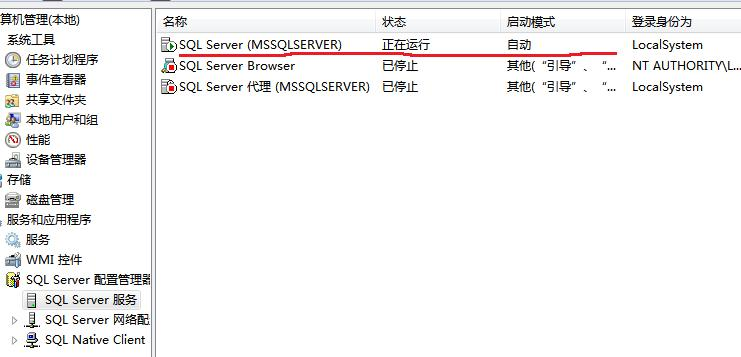
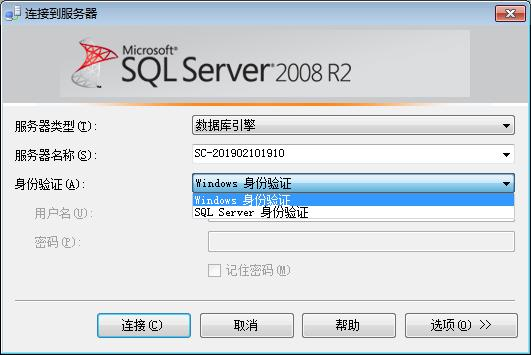
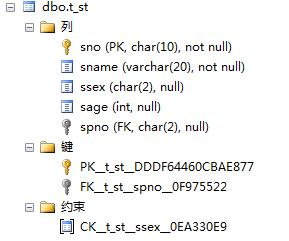
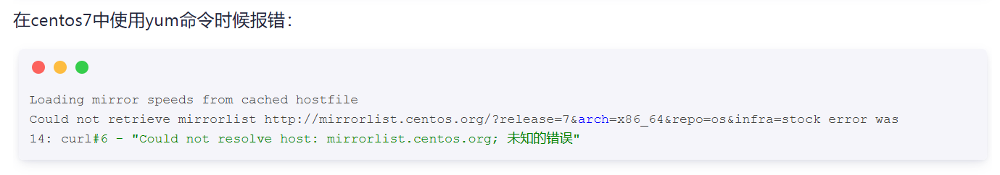
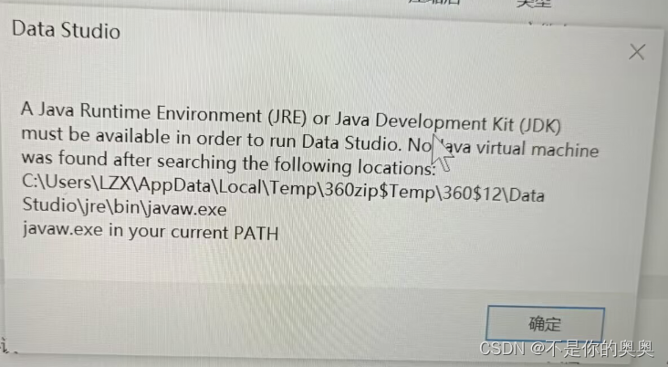

# **实验一 数据库的创建和删除**

**一.  实验目的：**

1. 了解SQL Server 2008数据库管理系统的操作环境；

2. 学习SQL Server Management Studio管理平台的使用；

3. 理解SQL Server数据库服务器用户登录的特点与过程；

4. 掌握使用SQL 语句创建和删除数据库。

**二.  实验准备**

1. 确认SQL Server2008已经安装，且相关服务已经启动，如下图：

2. 理解登录SQL Server服务器的两种方式。

3. 在D: 盘（其他盘亦可）创建一个用于存放数据库文件的文件夹“MYDB”；

4. 了解创建和删除数据库的SQL语句。

**三.  实验要求**

1. 学会SQL Server Management Studio中利用查询窗口进行交互式SQL语句的编写与执行方法。

2. 用SQL语句创建第一个属于你自己的数据库EDUC。

1. 注意实验过程的截图与保存，供撰写实验报告使用。

**四.  实验内容**

1. 使用SQL语句创建数据库EDUC。

数据库的参数要求：

数据库名称：EDUC

数据库存储路径：将数据库文件存储在D:\MYDB\ 文件夹中。

其他参数要求：

数据文件的初始大小：10M   最大：60M  按5%的比例自动增长。

日志文件的初始大小：4M   最大：10M  增量为1M。

2. 创建另一个数据库TestDB，参数与EDUC相同。

3. 用SQL语句删除数据库TestDB。

4. 将EDUC数据库设置为当前数据库。

# **实验二 使用SQL语句创建和删除基本表**

**一．实验目的**

1．了解SQL Server的基本数据类型。

2．学会使用Create table语句创建基本表。

**二．实验要求**

1. SQL Server Management Studio的查询窗口中，使用SQL语句完成基本表的创建、修改、删除。

2. 实现基本表定义中有关完整性约束的要求。

3. 修改基本表的结构。

4. 删除基本表。

5. 注意操作结果的截图与保存，供撰写实验报告使用。

**三．实验准备**

1.  确定数据库包含的各表的结构，了解SQL Server的常用数据类型

2．掌握SQL Server平台Create table、Alter table、Drop table 语句的具体用法。

**四. 实验内容**

（一）根据设计要求，用Create table语句定义基本表

设有简单教学管理的6个关系模式如下：

系(系编号，系名称、系主任、联系电话、地址)

专业(专业编号、专业名称、所属系)

教师(教师编号、姓名、所在系、电话、电子信箱)

学生(学号、姓名、性别、出生日期、所学专业)

课程(课程号、课程名、学分、先修课)

学生选课(学号、课程号、成绩)

要求：在数据库EDUC中，创建对应的6个基本表，基本表的名称和属性名称由同学自行确定。

基本表的数据结构及完整性要求：

1.  系 (系编号，系名称、系主任、联系电话、地址)

系编号：字符型（定长），长度为4，主码

系名称：字符型（变长），长度20，非空

系主任：字符型（定长），长度为10

联系电话：字符型（变长），长度20

地址：字符型（变长），长度40

2. 专业 (专业编号、专业名称、所属系)

专业编号：字符型（定长），长度为2，主码

专业名称：字符型（变长），长度40，非空

所属系：字符型（定长），长度为4，外码

3. 教师 (教师编号、姓名、所在系、电话、电子信箱)

教师编号：字符型（定长），长度为10，主码

姓名：字符型（定长），长度10，非空

所在系：字符型（定长），长度为4，外码

电话：字符型（变长），长度20

电子信箱：字符型（变长），长度30

4. 学生 (学号、姓名、性别、出生日期、所学专业)

学号：字符型（定长），长度为10，主码

姓名：字符型（变长），长度20，非空，唯一

性别：字符型（定长），长度为2，性别只能为‘男‘ 或‘女’

出生日期：日期型（datetime）

所学专业：字符型（定长），长度为2，外码

5. 课程 (课程号、课程名、学分、先修课)

课程号：字符型（定长），长度为4，主码

课程名：字符型（变长），长度30

学分：数值型（长度为2，含1位小数）

先修课：字符型（定长），长度为4，外码

6. 学生选课 (学号、课程号、成绩)

学号：字符型（定长），长度为10，外码

课程号：字符型（定长），长度为4，外码

成绩：数值型（长度为4，含1位小数），成绩必须在：0～100分之间。

本表的主码为：（学号，课程号）。

**（二）** 用 Alter table 语句修改基本表的结构，以及完整性约束条件

**操作要求：**

1. 为学生表增加属性：班级：字符型（变长），长度20。

2. 删除学生表中的班级属性。

3. 删除学生表中对学生姓名的唯一值限制。

（三）用Drop table 语句删除基本表

1. 创建一个新的基本表

2. 删除该表。

**五．实验步骤**

1. 创建基本表

在SQL Server Management Studio的查询窗口中，将EDUC设置为当前数据库，依次定义上述6个基本表。

**检验结果：** 在对象窗口中展开所定义的基本表，检查属性列、键和约束，是否满足设计要求？格式如下：

1. 修改表结构

按照要求，完成表结构及完整性约束条件的修改。

检查修改结果。

1. 删除基本表

按照要求，完成新建和删除基本表的任务。

# **实验三 创建和删除索引**

**一. 实验目的**

1.了解索引的类型和作用。

2.学会用SQL语句对表创建和删除索引

**二. 实验准备**

1. 成功创建了数据库EDUC中各表

2. 了解创建和删除索引的方法。

**三. 实验要求**

1. 了解索引类型并比较各类索引的不同之处。

2. 完成索引的创建和删除。

3. 注意操作结果的截图与保存，供撰写实验报告使用。

**四. 实验内容** 

1. 用SQL语句分别建立以下索引

（1）应用场景：在教务管理系统中，经常需要通过学生的项目查询学生的基本信息，学生人数大概在10000～20000人，为了提高这类查询的效率，需要为学生表的学生姓名创建一个普通降序索引，索引名称为：Stusname。

用SQL语句完成上述任务。

（2）应用场景：在应用中，学生表与专业表经常会一起使用，比如在查询学生信息时会同时需要了解学生所学的专业信息。故这两个表经常需要进行连接，为了提高连接效率，需要为学生表的专业编号创建一个普通升序索引，索引名称为：Stuspno。

用SQL语句完成上述任务。

（3）应用场景：学生选课表SC是EDUC数据库中数据量最大的表，数据的变化也最频繁，实际应用中数据操作的条件以：Where Sno=’20200001’ and Cno=’c101’的形式居多，为了提高查询效率，需要为SC表的学号和课程号创建一个组合索引，其中学号为升序, 课程号为降序。索引名称为：SCsno\_cno。

用SQL语句完成上述任务。

（4）应用场景：学校教学管理规定，不同的课程使用不同的课程编号，且课程名称也应该把它，为此在创建基本表时已经为课程表的课程名定义了一个完整性约束规则：课程名必须唯一，若系统自动创建的唯一索引消失了，需要重新为课程名创建一个唯一索引，索引名为：Unicname。

用SQL语句完成上述任务。

2. 用SQL语句删除索引Stuspno。

**五． 实验步骤**

# **实验四 数据库的分离和附加**

**一. 实验目的**

理解数据库为何要进行分离和附加？掌握数据库的分离和附加的具体操作方法。

**二. 实验准备**

准备一个U盘，用来保存所创建的EDUC数据库的相关文件、实验过程中使用的SQL语句、以及抓取的所有图片。

**三. 实验要求**

1．将创建的数据库EDUC进行分离并拷贝到U盘。

2．注意操作结果的截图与保存，供撰写实验报告使用。

**四. 实验内容**

1. 数据库的分离

当SQL Server服务器运行时，该服务器上所有的数据库自动处于运行状态，而运行中的数据库文件是无法进行数据库文件的拷贝的。实验任务完成后，往往需要将数据库文件，以及在实验过程中产生的各种资料拷贝到U盘保存起来。

本实验的目的就是将需要拷贝的数据库（如EDUC）从数据库服务器上分离出来，使其处于非运行状态，从而可以正常进行数据库文件的拷贝。

2. 数据库附加

数据库附加是为了将某个数据库的文件附加在数据库服务器上，使其处于运行状态。比如：学生在上一次实验结束后，通过数据库分离，将数据库的文件拷贝在自己的U盘上，下一次实验时对U盘上的数据库文件进行附加，该数据库中原有的数据对象及数据可以正常使用。

**五． 实验步骤**

# **实验五 在openGauss数据库上重复实验（附加题）**

**一．实验目的**

1.了解openGauss数据库管理系统的操作环境。

2.掌握使用openGauss SQL语句创建、删除数据库及基本表。

3.学会使用openGauss创建和删除索引。

4.理解openGauss数据库的分离和附加操作。

**二．实验准备**

1.首先下载虚拟机VMWare Workstation Pro 17

2.使用 VMWare Workstation Pro 17 来安装 CentOS 7

参考安装教程：[https://blog.csdn.net/qq\_45311805/article/details/140011623](https://blog.csdn.net/qq_45311805/article/details/140011623)

3.CentOs 7 装OpenGauss 参考安装教程：

链接:https://pan.baidu.com/s/1YYAKqywR95yFyWqtF8LQoQ?pwd=8853  提取码:8853

Ps：常见问题：

1.

解决办法可参考：[https://www.cnblogs.com/kohler21/p/18331060](https://www.cnblogs.com/kohler21/p/18331060)

2．DataStudio打不开，报错：

解决办法可参考：[https://blog.csdn.net/m0\_54149707/article/details/127674260](https://blog.csdn.net/m0_54149707/article/details/127674260)

- **实验要求**

1.确保 SQL 语句的语法符合 openGauss 的规范。

2.注意操作结果的截图与保存，供撰写实验报告使用。

3.遇到问题时，参考 openGauss 的官方文档或相关教程进行解决。

4.对比 openGauss 和 SQL Server 在操作上的异同点。

5.对实验中遇到的问题进行分析和总结，对 openGauss 数据库的使用体验和理解。

**四.  实验内容**

1. 创建数据库EDUC。

2. 创建另一个数据库TestDB。

3. 用SQL语句删除数据库TestDB。

4. 打开 DataStudio 并连接到 EDUC 数据库。

5.在DataStudio中重复上述实验二，三。