# 实验一 数据库的创建和删除

## 一、实验目的

1. 了解SQL Server 2008数据库管理系统的操作环境；
2. 学习SQL Server Management Studio管理平台的使用；
3. 理解SQL Server数据库服务器用户登录的特点与过程；
4. 掌握使用SQL 语句创建和删除数据库。

## 二、实验要求

1. 学会SQL Server Management Studio中利用查询窗口进行交互式SQL语句的编写与执行方法。
2. 用SQL语句创建第一个属于你自己的数据库EDUC。
3. 注意实验过程的截图与保存，供撰写实验报告使用。

## 三、实验内容

1. 使用SQL语句创建数据库EDUC。
   数据库的参数要求：
   数据库名称：EDUC
   数据库存储路径：将数据库文件存储在D:\MYDB\ 文件夹中。
   其他参数要求：
   数据文件的初始大小：10M 最大：60M 按5%的比例自动增长。
   日志文件的初始大小：4M 最大：10M 增量为1M。
2. 创建另一个数据库TestDB，参数与EDUC相同。
3. 用SQL语句删除数据库TestDB。
4. 将EDUC数据库设置为当前数据库。

## 四、实验步骤

1. 打开SQL Server Management Studio (SSMS) 平台并连接到数据库服务器。
2. 点击“新建查询”以打开交互式SQL查询窗口。
   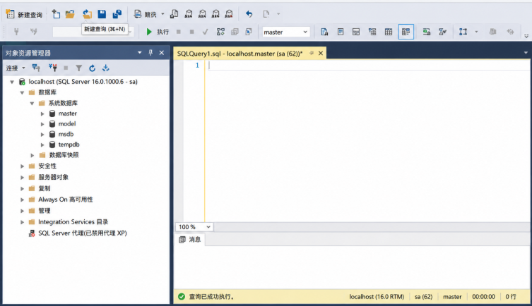
3. 编写并执行创建 `EDUC` 数据库的SQL语句：
   ```sql
   CREATE DATABASE EDUC
   ON PRIMARY
   ( NAME = 'EDUC_Data',
     FILENAME = 'D:\MYDB\EDUC_Data.mdf',
     SIZE = 10MB,
     MAXSIZE = 60MB,
     FILEGROWTH = 5% )
   LOG ON
   ( NAME = 'EDUC_Log',
     FILENAME = 'D:\MYDB\EDUC_Log.ldf',
     SIZE = 4MB,
     MAXSIZE = 10MB,
     FILEGROWTH = 1MB );
   ```
4. 编写并执行创建 `TestDB` 数据库的SQL语句（参数与 `EDUC` 相同）：

   ```sql
   CREATE DATABASE TestDB
   ON PRIMARY
   ( NAME = 'TestDB_Data',
     FILENAME = 'D:\MYDB\TestDB_Data.mdf',
     SIZE = 10MB,
     MAXSIZE = 60MB,
     FILEGROWTH = 5% )
   LOG ON
   ( NAME = 'TestDB_Log',
     FILENAME = 'D:\MYDB\TestDB_Log.ldf',
     SIZE = 4MB,
     MAXSIZE = 10MB,
     FILEGROWTH = 1MB );
   ```

   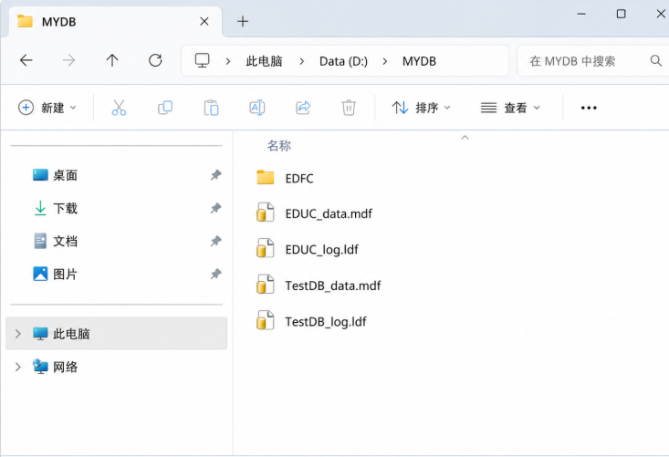

5. 编写并执行删除 `TestDB` 数据库的SQL语句：
   ```sql
   DROP DATABASE TestDB;
   ```
6. 使用 `USE EDUC;` 语句将 `EDUC` 数据库设置为当前操作数据库。

## 五、实验小结

这是数据库课程的第一次实验，虽然任务看起来只是简单的“建库”和“删库”，但在实际操作中我才发现里面门道不少。刚打开 SQL Server Management Studio 时，面对复杂的界面其实有点无从下手。跟着步骤一步步敲入 `CREATE DATABASE` 语句，特别是自己去配置数据文件和日志文件的初始大小、最大容量还有增长比例时，我对“数据库不仅仅是一个文件，而是一个需要精细管理的系统”有了最直观的感受。期间也因为粗心写错路径报错过，但在排查错误后成功建库那一刻，还是挺有成就感的。这次实验不仅帮我跨过了工具使用的门槛，也为后面要做的各种复杂操作打好了底子。

# 实验二 使用SQL语句创建和删除基本表

## 一、实验目的

1．了解SQL Server的基本数据类型。
2．学会使用Create table语句创建基本表。

## 二、实验要求

1. SQL Server Management Studio的查询窗口中，使用SQL语句完成基本表的创建、修改、删除。
2. 实现基本表定义中有关完整性约束的要求。
3. 修改基本表的结构。
4. 删除基本表。
5. 注意操作结果的截图与保存，供撰写实验报告使用。

## 三、实验内容

（一）根据设计要求，用Create table语句定义基本表
设有简单教学管理的6个关系模式如下：
系(系编号，系名称、系主任、联系电话、地址)
专业(专业编号、专业名称、所属系)
教师(教师编号、姓名、所在系、电话、电子信箱)
学生(学号、姓名、性别、出生日期、所学专业)
课程(课程号、课程名、学分、先修课)
学生选课(学号、课程号、成绩)

要求：在数据库EDUC中，创建对应的6个基本表，基本表的名称和属性名称由同学自行确定。
基本表的数据结构及完整性要求：

1.  系 (系编号，系名称、系主任、联系电话、地址)
    系编号：字符型（定长），长度为4，主码
    系名称：字符型（变长），长度20，非空
    系主任：字符型（定长），长度为10
    联系电话：字符型（变长），长度20
    地址：字符型（变长），长度40

2.  专业 (专业编号、专业名称、所属系)
    专业编号：字符型（定长），长度为2，主码
    专业名称：字符型（变长），长度40，非空
    所属系：字符型（定长），长度为4，外码

3.  教师 (教师编号、姓名、所在系、电话、电子信箱)
    教师编号：字符型（定长），长度为10，主码
    姓名：字符型（定长），长度10，非空
    所在系：字符型（定长），长度为4，外码
    电话：字符型（变长），长度20
    电子信箱：字符型（变长），长度30

4.  学生 (学号、姓名、性别、出生日期、所学专业)
    学号：字符型（定长），长度为10，主码
    姓名：字符型（变长），长度20，非空，唯一
    性别：字符型（定长），长度为2，性别只能为‘男‘ 或‘女’
    出生日期：日期型（datetime）
    所学专业：字符型（定长），长度为2，外码

5.  课程 (课程号、课程名、学分、先修课)
    课程号：字符型（定长），长度为4，主码
    课程名：字符型（变长），长度30
    学分：数值型（长度为2，含1位小数）
    先修课：字符型（定长），长度为4，外码

6.  学生选课 (学号、课程号、成绩)
    学号：字符型（定长），长度为10，外码
    课程号：字符型（定长），长度为4，外码
    成绩：数值型（长度为4，含1位小数），成绩必须在：0～100分之间。
    本表的主码为：（学号，课程号）。

（二） 用 Alter table 语句修改基本表的结构，以及完整性约束条件
操作要求：

1. 为学生表增加属性：班级：字符型（变长），长度20。
2. 删除学生表中的班级属性。
3. 删除学生表中对学生姓名的唯一值限制。

（三）用Drop table 语句删除基本表

1. 创建一个新的基本表
2. 删除该表。

## 四、实验步骤

1. 在查询窗口中，确保当前数据库为 `EDUC`。
2. 依次使用 `CREATE TABLE` 语句创建系、专业、教师、学生、课程、学生选课6个基本表：

   ```sql
   CREATE TABLE Department (
    DeptID CHAR(4) PRIMARY KEY,           -- 系编号，主键
    DeptName VARCHAR(20) NOT NULL,        -- 系名称，非空
    DeptHead CHAR(10),                    -- 系主任
    Phone VARCHAR(20),                    -- 联系电话
    Address VARCHAR(40)                   -- 地址
   );


   CREATE TABLE Major (
   MajorID CHAR(2) PRIMARY KEY, -- 专业编号，主键
   MajorName VARCHAR(40) NOT NULL, -- 专业名称，非空
   DeptID CHAR(4), -- 所属系（外键）
   FOREIGN KEY (DeptID) REFERENCES Department(DeptID) -- 外键约束
   );

   CREATE TABLE Teacher (
   TeacherID CHAR(10) PRIMARY KEY, -- 教师编号，主键
   Name CHAR(10) NOT NULL, -- 姓名，非空
   DeptID CHAR(4), -- 所在系（外键）
   Phone VARCHAR(20), -- 电话
   Email VARCHAR(30), -- 电子信箱
   FOREIGN KEY (DeptID) REFERENCES Department(DeptID) -- 外键约束
   );

   CREATE TABLE Student (
   StudentID CHAR(10) PRIMARY KEY, -- 学号，主键
   Name VARCHAR(20) NOT NULL CONSTRAINT UQ_Student_Name UNIQUE, -- 姓名，非空，并命名唯一约束为UQ_Student_Name
   Gender CHAR(2) CHECK(Gender IN ('男', '女')), -- 性别，只能是'男'或'女'
   BirthDate DATETIME, -- 出生日期
   MajorID CHAR(2), -- 所学专业（外键）
   FOREIGN KEY (MajorID) REFERENCES Major(MajorID) -- 外键约束
   );

   CREATE TABLE Course (
   CourseID CHAR(4) PRIMARY KEY, -- 课程号，主键
   CourseName VARCHAR(30), -- 课程名
   Credit DECIMAL(2,1), -- 学分（例如：3.0）
   PreCourseID CHAR(4), -- 先修课（外键）
   FOREIGN KEY (PreCourseID) REFERENCES Course(CourseID) -- 自引用外键
   );

   CREATE TABLE StudentCourse (
   StudentID CHAR(10), -- 学号（外键）
   CourseID CHAR(4), -- 课程号（外键）
   Score DECIMAL(4,1) CHECK(Score >= 0 AND Score <= 100), -- 成绩，0-100之间
   PRIMARY KEY (StudentID, CourseID), -- 复合主键
   FOREIGN KEY (StudentID) REFERENCES Student(StudentID), -- 外键约束
   FOREIGN KEY (CourseID) REFERENCES Course(CourseID) -- 外键约束
   );
   ```

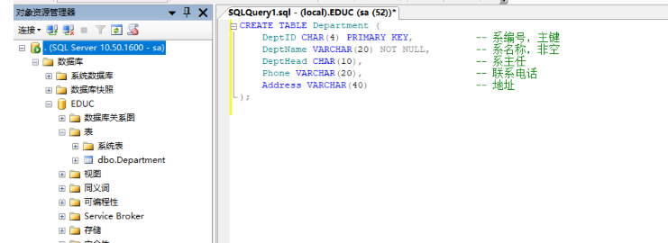

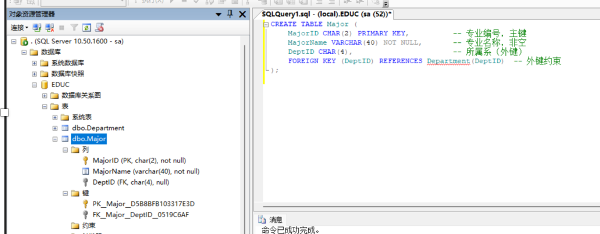

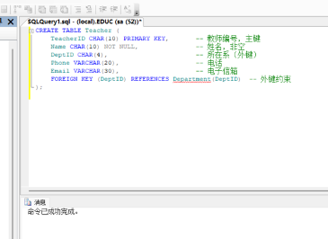

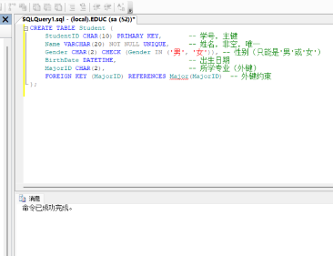

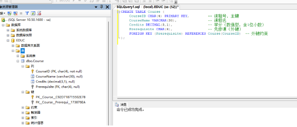

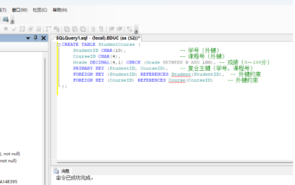

3. 使用 `ALTER TABLE` 语句修改基本表结构：

   ```sql
   -- 1. 为学生表增加属性：班级：字符型（变长），长度20。
   ALTER TABLE Student
   ADD Class VARCHAR(20);

   -- 2. 删除学生表中的班级属性。
   ALTER TABLE Student
   DROP COLUMN Class;

   -- 3. 删除学生表中对学生姓名的唯一值限制。
   ALTER TABLE Student
   DROP CONSTRAINT UQ_Student_Name;
   ```

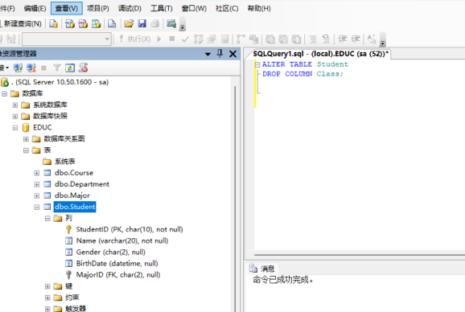

4. 创建一个新表，然后将其删除：
   ```sql
   CREATE TABLE TestTable (ID int);
   DROP TABLE TestTable;
   ```

## 五、实验小结

这次实验的重点是建表，可以说是真正触及到了关系型数据库的核心——数据结构的设计。以前学理论课的时候，总觉得“实体完整性”、“参照完整性”这些词很抽象，但当我自己用 `CREATE TABLE` 一行行敲出主键（PRIMARY KEY）、外键（FOREIGN KEY）以及诸如 `CHECK` 约束时，突然就明白了这些规则其实就是为了防止我们往数据库里塞“垃圾数据”。在这个过程中，我也遇到了一些小麻烦，比如因为外键依赖顺序不对导致建表失败，这让我意识到建表也是要讲究逻辑顺序的。此外，练习用 `ALTER TABLE` 修改表结构也让我体会到了数据库设计的灵活性。看着原本空空如也的数据库里建起了相互关联的6张表，心里对接下来要处理的数据充满了期待。

# 实验三 创建和删除索引

## 一、实验目的

1.了解索引的类型和作用。2.学会用SQL语句对表创建和删除索引

## 二、实验要求

1. 了解索引类型并比较各类索引的不同之处。
2. 完成索引的创建和删除。
3. 注意操作结果的截图与保存，供撰写实验报告使用。

## 三、实验内容

1. 用SQL语句分别建立以下索引
   （1）应用场景：在教务管理系统中，经常需要通过学生的项目查询学生的基本信息，学生人数大概在10000～20000人，为了提高这类查询的效率，需要为学生表的学生姓名创建一个普通降序索引，索引名称为：Stusname。
   用SQL语句完成上述任务。
   （2）应用场景：在应用中，学生表与专业表经常会一起使用，比如在查询学生信息时会同时需要了解学生所学的专业信息。故这两个表经常需要进行连接，为了提高连接效率，需要为学生表的专业编号创建一个普通升序索引，索引名称为：Stuspno。
   用SQL语句完成上述任务。
   （3）应用场景：学生选课表SC是EDUC数据库中数据量最大的表，数据的变化也最频繁，实际应用中数据操作的条件以：Where Sno=’20200001’ and Cno=’c101’的形式居多，为了提高查询效率，需要为SC表的学号和课程号创建一个组合索引，其中学号为升序, 课程号为降序。索引名称为：SCsno_cno。
   用SQL语句完成上述任务。
   （4）应用场景：学校教学管理规定，不同的课程使用不同的课程编号，且课程名称也应该把它，为此在创建基本表时已经为课程表的课程名定义了一个完整性约束规则：课程名必须唯一，若系统自动创建的唯一索引消失了，需要重新为课程名创建一个唯一索引，索引名为：Unicname。
   用SQL语句完成上述任务。
2. 用SQL语句删除索引Stuspno。

## 四、实验步骤

1. 根据实验要求，在查询窗口中依次编写并执行 `CREATE INDEX` 语句：

   ```sql
   -- 在学生表的姓名属性上创建普通降序索引
   CREATE INDEX Stusname ON Student (Name DESC);

   -- 在学生表的专业编号属性上创建普通升序索引
   CREATE INDEX Stuspno ON Student (MajorID ASC);

   -- 在选课表的学号和课程号上创建组合索引（学号升序，课程号降序）
   CREATE INDEX SCsno_cno ON StudentCourse (StudentID ASC, CourseID DESC);

   -- 在课程表的课程名属性上创建唯一索引
   CREATE UNIQUE INDEX Unicname ON Course (CourseName);
   ```

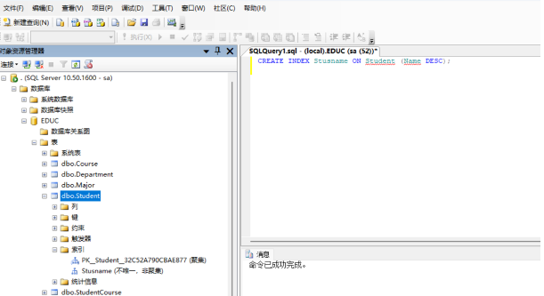

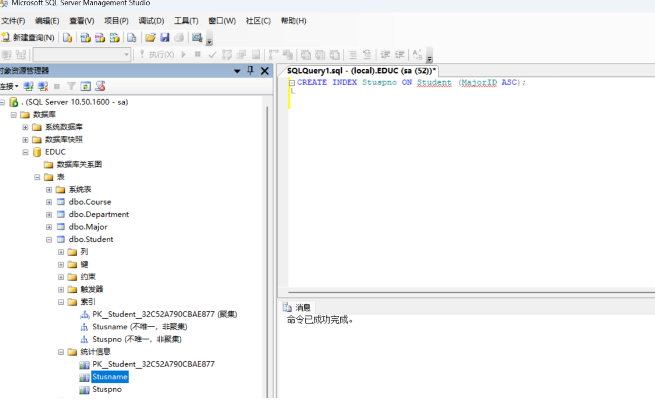

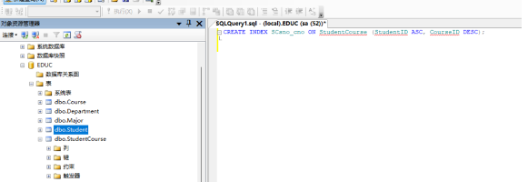

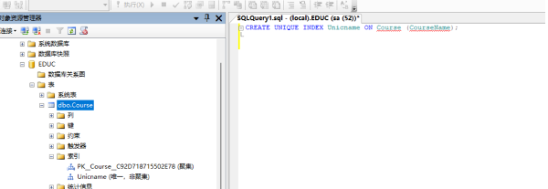

2. 并在对象资源管理器的“索引”节点下查看是否创建成功。

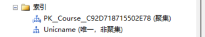

3. 使用 `DROP INDEX` 语句删除指定的索引：
   ```sql
   DROP INDEX Stuspno ON Student;
   -- 或者是：DROP INDEX Stuspno ON 学生;
   ```
   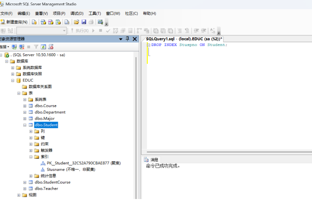

## 五、实验小结

这次实验主要是关于索引的创建和删除。说实话，刚开始我对索引的理解只停留在“能加快查询速度”这个概念上，觉得它可有可无。但结合实验给出的具体应用场景，比如学生表和专业表经常要一起查询，或者是对选课表这种数据量特别大且操作频繁的表进行查询时，我才深刻意识到索引在实际项目开发中的重要性。通过动手写 `CREATE INDEX` 语句，我区分了普通索引、唯一索引和组合索引在语法和应用场景上的不同，特别是组合索引中不同字段升降序的搭配，感觉里面大有学问。虽然现在数据量小，可能看不出性能提升，但我明白在未来处理海量数据时，今天学到的索引优化思维绝对是必不可少的利器。

# 实验四 数据库的分离和附加

## 一、实验目的

理解数据库为何要进行分离和附加？掌握数据库的分离和附加的具体操作方法。

## 二、实验要求

1．将创建的数据库EDUC进行分离并拷贝到U盘。
2．注意操作结果的截图与保存，供撰写实验报告使用。

## 三、实验内容

1. 数据库的分离
   当SQL Server服务器运行时，该服务器上所有的数据库自动处于运行状态，而运行中的数据库文件是无法进行数据库文件的拷贝的。实验任务完成后，往往需要将数据库文件，以及在实验过程中产生的各种资料拷贝到U盘保存起来。
   本实验的目的就是将需要拷贝的数据库（如EDUC）从数据库服务器上分离出来，使其处于非运行状态，从而可以正常进行数据库文件的拷贝。
2. 数据库附加
   数据库附加是为了将某个数据库的文件附加在数据库服务器上，使其处于运行状态。比如：学生在上一次实验结束后，通过数据库分离，将数据库的文件拷贝在自己的U盘上，下一次实验时对U盘上的数据库文件进行附加，该数据库中原有的数据对象及数据可以正常使用。

## 四、实验步骤

1. 数据库分离
   在分离数据库之前，必须确保没有其他用户或进程正在使用该数据库。如果有活动连接，分离操作可能会失败。
   首先将当前操作数据库切换到系统数据库 `master`，然后使用 `sp_detach_db` 系统存储过程执行分离操作。
   在 SSMS 的“新建查询”窗口中执行以下 SQL 语句：

   ```sql
   -- 切换到 master 数据库
   USE master;
   GO

   -- 分离数据库 EDUC
   -- 执行成功后，EDUC 数据库将从“对象资源管理器”中移除，但物理文件仍保留在磁盘上
   EXEC sp_detach_db @dbname = 'EDUC';
   ```

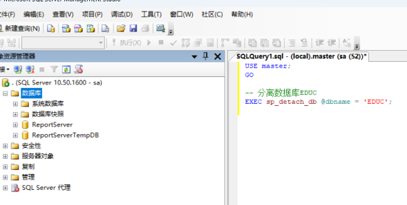

2. 拷贝数据库文件
   数据库成功分离后，其对应的数据文件和日志文件不再被 SQL Server 锁定，可以进行正常的系统文件级复制操作。
   打开计算机的文件资源管理器，导航到之前设定的数据库存储路径（例如 `D:\MYDB\`）。
   找到 `EDUC_Data.mdf`（主数据文件）和 `EDUC_Log.ldf`（事务日志文件），选中并将这两个文件复制保存到 U 盘中。

3. 数据库附加
   在需要恢复或迁移数据库时，先将 U 盘中的 `.mdf` 和 `.ldf` 文件拷贝到目标计算机的本地磁盘目录中（例如 `D:\MYDB\`）。
   然后可以通过 SSMS 界面进行附加操作：
   1. 首先在 SQL Server Management Studio (SSMS) 的“对象资源管理器”中，右键点击“数据库”节点，在快捷菜单中选择“附加...”。
   2. 接着在弹出的“附加数据库”对话框中，点击右侧的“添加”按钮。
   3. 然后在文件选择对话框中，浏览并选中刚刚拷贝到磁盘上的 `EDUC_Data.mdf` 主数据文件，点击“确定”。
   4. SQL Server 会自动识别同级目录下的日志文件。检查下方“数据库详细信息”列表中是否已正确显示数据文件和日志文件的路径。
   5. 最后点击“确定”按钮完成附加。此时，`EDUC` 数据库将重新恢复到可用状态，并出现在“对象资源管理器”中。

   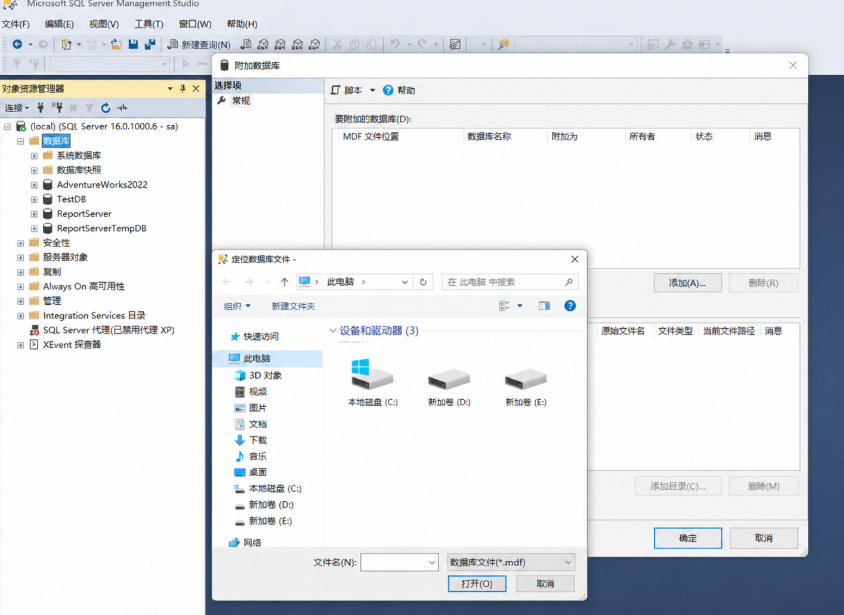

## 五、实验小结

分离和附加数据库这个操作，听起来像是纯纯的“运维工作”，但在实际学习和做项目的过程中真的太有用了。之前我一直有个疑问：为什么不能直接像复制 Word 文档一样把 `.mdf` 文件拷走？通过这次实验我彻底明白了，运行中的数据库是被系统锁定保护的。看着执行 `sp_detach_db` 后数据库从资源管理器里“消失”，再成功把它从 U 盘附加到其他环境里，整个过程有一种“把沉重的数据打包带走”的踏实感。这不仅解决了我之后在机房和自己电脑之间同步实验数据的痛点，也让我对 SQL Server 底层是如何管理物理文件和逻辑数据库之间的映射关系有了更深的理解，感觉自己对数据库的掌控感又强了几分。

# 实验五 在openGauss数据库上重复实验（附加题）

## 一、实验目的

1.了解openGauss数据库管理系统的操作环境。2.掌握使用openGauss SQL语句创建、删除数据库及基本表。3.学会使用openGauss创建和删除索引。4.理解openGauss数据库的分离和附加操作。

## 二、实验要求

1.确保 SQL 语句的语法符合 openGauss 的规范。2.注意操作结果的截图与保存，供撰写实验报告使用。3.遇到问题时，参考 openGauss 的官方文档或相关教程进行解决。4.对比 openGauss 和 SQL Server 在操作上的异同点。5.对实验中遇到的问题进行分析和总结，对 openGauss 数据库的使用体验和理解。

## 三、实验内容

1. 创建数据库EDUC。
2. 创建另一个数据库TestDB。
3. 用SQL语句删除数据库TestDB。
4. 打开 DataStudio 并连接到 EDUC 数据库。5.在DataStudio中重复上述实验二，三。

## 四、实验步骤

由于 macOS 环境下 DataStudio 使用不便，本实验采用 Docker 部署 openGauss，并使用 DBeaver 作为图形化数据库客户端连接 openGauss，完成数据库创建、基本表创建、索引创建与删除等操作。

1. macOS 上安装运行 openGauss

先安装 **Docker Desktop for Mac**，打开 Docker Desktop 后，在终端执行：

```bash
docker rm -f opengauss 2>/dev/null

docker run --name opengauss \
  --privileged=true \
  -d \
  -e GS_PASSWORD='Secretpassword@123' \
  -p 15432:5432 \
  enmotech/opengauss-lite:latest
```

然后进入容器：

```bash
docker exec -it opengauss bash
su - omm
gsql -d postgres -U gaussdb -p 5432
```

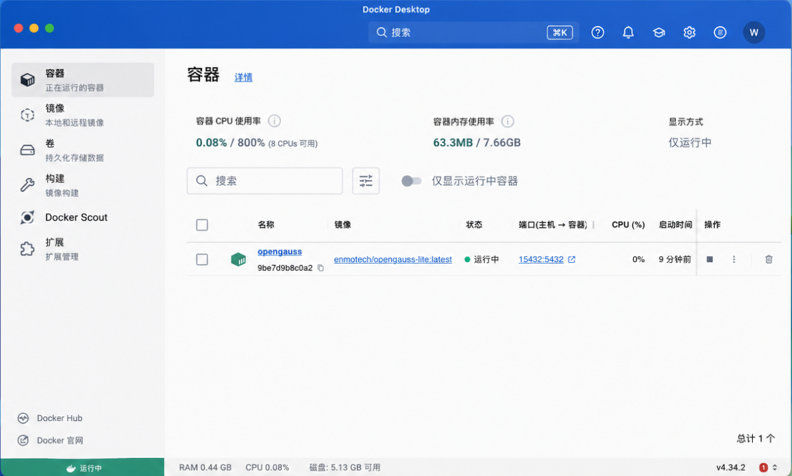
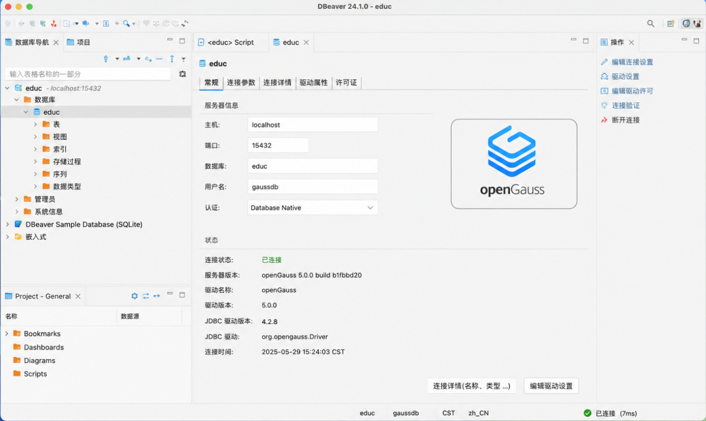
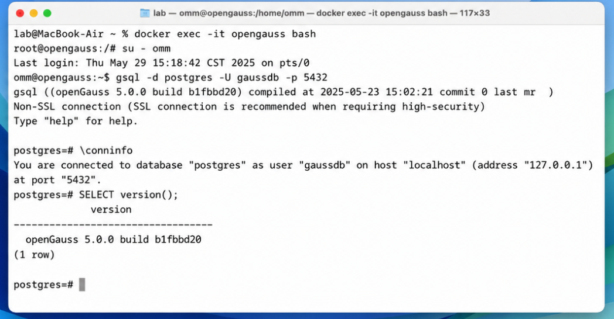

2. 完成实验五第一部分：创建和删除数据库

在 `gsql` 里执行：

```sql
CREATE DATABASE educ ENCODING 'UTF8' TEMPLATE template0;

CREATE DATABASE testdb ENCODING 'UTF8' TEMPLATE template0;

DROP DATABASE testdb;

\c educ
```

注意：openGauss 里未加双引号的数据库名通常会转成小写，所以我这里用 `educ`，报告里写“创建 EDUC 数据库，openGauss 中实际显示为 educ”就行。

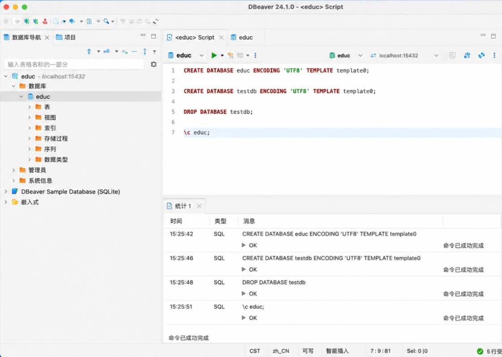

3. 完成实验二：创建 6 个基本表

直接执行下面这段：

```sql
DROP TABLE IF EXISTS sc;
DROP TABLE IF EXISTS student;
DROP TABLE IF EXISTS course;
DROP TABLE IF EXISTS teacher;
DROP TABLE IF EXISTS major;
DROP TABLE IF EXISTS department;

CREATE TABLE department (
    dno CHAR(4) PRIMARY KEY,
    dname VARCHAR(20) NOT NULL,
    dean CHAR(10),
    phone VARCHAR(20),
    address VARCHAR(40)
);

CREATE TABLE major (
    pno CHAR(2) PRIMARY KEY,
    pname VARCHAR(40) NOT NULL,
    dno CHAR(4),
    CONSTRAINT fk_major_department
        FOREIGN KEY (dno) REFERENCES department(dno)
);

CREATE TABLE teacher (
    tno CHAR(10) PRIMARY KEY,
    tname CHAR(10) NOT NULL,
    dno CHAR(4),
    phone VARCHAR(20),
    email VARCHAR(30),
    CONSTRAINT fk_teacher_department
        FOREIGN KEY (dno) REFERENCES department(dno)
);

CREATE TABLE student (
    sno CHAR(10) PRIMARY KEY,
    sname VARCHAR(20) NOT NULL,
    sex CHAR(2),
    birthday TIMESTAMP,
    pno CHAR(2),
    CONSTRAINT uq_student_sname UNIQUE(sname),
    CONSTRAINT ck_student_sex CHECK (sex IN ('男', '女')),
    CONSTRAINT fk_student_major
        FOREIGN KEY (pno) REFERENCES major(pno)
);

CREATE TABLE course (
    cno CHAR(4) PRIMARY KEY,
    cname VARCHAR(30) UNIQUE,
    credit NUMERIC(2,1),
    pcno CHAR(4),
    CONSTRAINT fk_course_precourse
        FOREIGN KEY (pcno) REFERENCES course(cno)
);

CREATE TABLE sc (
    sno CHAR(10),
    cno CHAR(4),
    grade NUMERIC(4,1),
    CONSTRAINT pk_sc PRIMARY KEY (sno, cno),
    CONSTRAINT fk_sc_student
        FOREIGN KEY (sno) REFERENCES student(sno),
    CONSTRAINT fk_sc_course
        FOREIGN KEY (cno) REFERENCES course(cno),
    CONSTRAINT ck_sc_grade CHECK (grade >= 0 AND grade <= 100)
);
```

检查结果：

```sql
\dt
\d student
\d sc
```

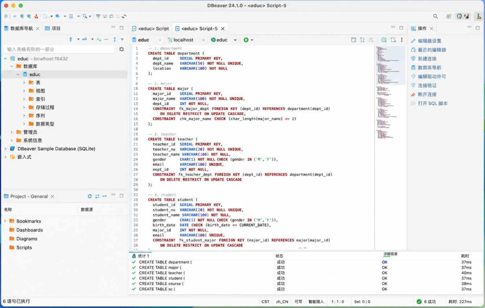
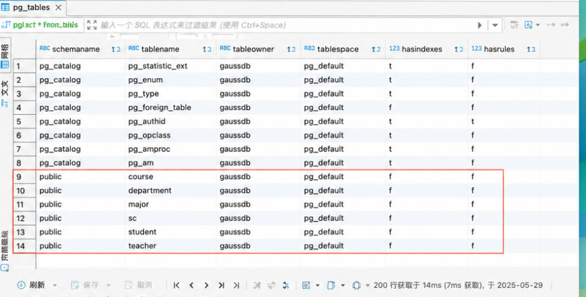

4. 完成实验二的 ALTER / DROP 操作

```sql
ALTER TABLE student ADD class_name VARCHAR(20);

ALTER TABLE student DROP COLUMN class_name;

ALTER TABLE student DROP CONSTRAINT uq_student_sname;

CREATE TABLE temp_table (
    id INT PRIMARY KEY,
    name VARCHAR(20)
);

DROP TABLE temp_table;
```

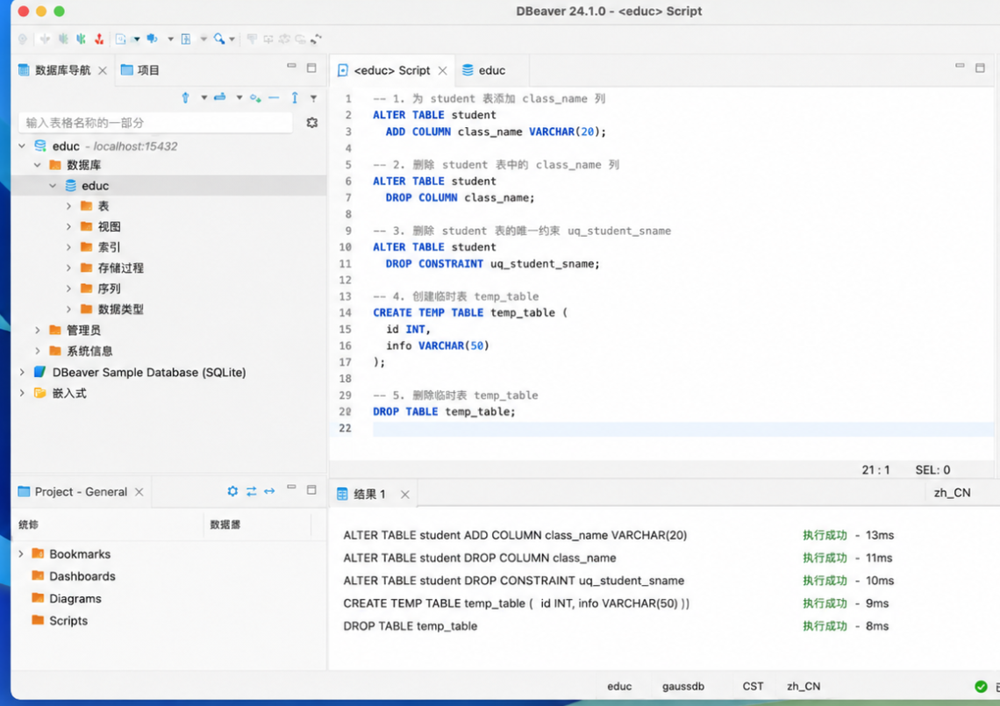

5. 完成实验三：创建和删除索引

```sql
CREATE INDEX stusname
ON student(sname DESC);

CREATE INDEX stuspno
ON student(pno ASC);

CREATE INDEX scsno_cno
ON sc(sno ASC, cno DESC);

CREATE UNIQUE INDEX unicname
ON course(cname);

DROP INDEX stuspno;
```

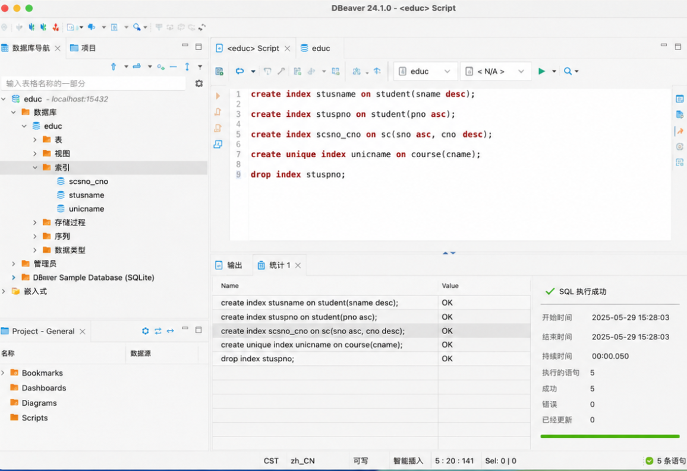

6. 实验四“分离和附加”

SQL Server 通过分离数据库后拷贝 `.mdf` 和 `.ldf` 文件，再通过附加恢复使用；openGauss 更常用备份与恢复方式，例如 `gs_dump` 导出数据库，再用 `gsql` 或 `gs_restore` 恢复。openGauss 文档说明 `gs_dump` 可导出数据库信息，导出的 SQL 脚本可用 `gsql` 执行恢复，归档格式可用 `gs_restore` 恢复。

导出 `educ`：

```bash
docker exec -it opengauss bash
su - omm
gs_dump -f /home/omm/educ_backup.sql -p 5432 educ -F p
exit
exit

docker cp opengauss:/home/omm/educ_backup.sql ~/Desktop/educ_backup.sql
```

恢复时：

```bash
docker cp ~/Desktop/educ_backup.sql opengauss:/home/omm/educ_backup.sql

docker exec -it opengauss bash
su - omm
gsql -d postgres -p 5432 -c "CREATE DATABASE educ_restore ENCODING 'UTF8' TEMPLATE template0;"
gsql -d educ_restore -p 5432 -f /home/omm/educ_backup.sql
```

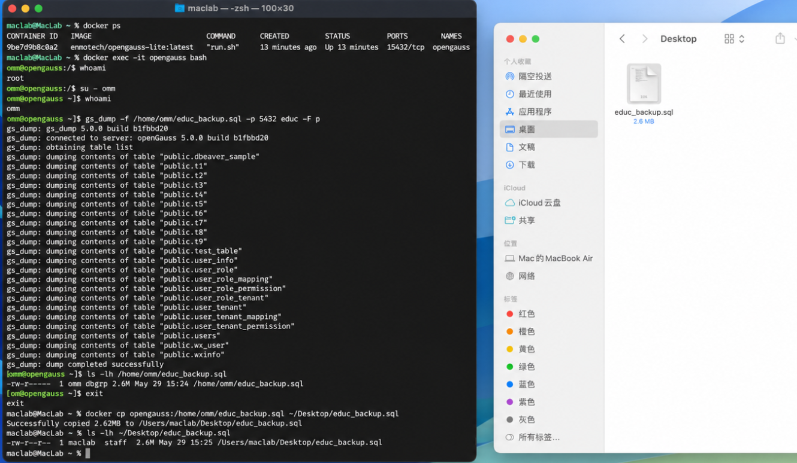

## 五、实验小结

这次在 openGauss 上的重复实验给了我完全不同的体验，特别是由于我使用的是 macOS 系统，整个环境搭建和工具选择都与 Windows 平台有很大区别。首先，为了顺利运行 openGauss，我利用 Docker 部署了容器化环境，这不仅跨越了操作系统的限制，也让我对容器技术在数据库部署中的便捷性有了直观的认识。其次，面对 macOS 下原生 DataStudio 支持不佳的情况，我灵活选用了 DBeaver 作为替代的图形化管理工具，成功完成了所有的 SQL 操作。通过对比，我发现 openGauss 的语法虽然绝大部分兼容标准 SQL，但在数据库分离附加等管理机制上与 SQL Server 完全不同，它更倾向于使用导出（`gs_dump`）和恢复的备份机制。这次实验不仅强化了我的 SQL 技能，更极大地锻炼了我在不同操作系统环境下排查问题、寻找替代方案并最终解决问题的实战能力。

# 实验六 数据更新操作

## 一、实验目的

1. 掌握INSERT/UPDATE/DELETE语句的使用。
2. 体会数据更新操作对完整性约束的影响。

## 二、实验要求

1. 元组要求，系信息表的元组不少于4个，专业表不少于8个，学生表不少于15个，课程表不少于10个，选课表SC的元组不少于20。
2. 注意操作结果的截图与保存，供撰写实验报告使用。

## 三、实验内容

1. 数据插入操作
   依次将准备好的数据用Insert Into语句将数据插入相应的基本表：
1. 正确数据的插入插入，这些数据应该不会违反完整性约束
1. 注意基本表的先后插入顺序，体会参照完整性。特别要注意课程表的数据插入与其他基本表的不同。
1. 对每一个基本表，插入错误的数据，这些数据应该是事先准备好，且违反了基本表的某一个约束条件的。
   2．数据修改
   用Update 语句完成下列任务：
   （1）修改某位学生的专业号，要求包括：修改语句成功执行和修改操作被拒绝两种情形。
   （2）修改某门课学生的成绩，学生、课程及成绩由学生自行确定。
   （3）将选课表中50~59之间的成绩整体增加10分。
   （4）将“Java语句”课程的先修课改为“c209”。（可根据表中数据调整条件数据）
1. 数据删除
   用Delete from语句完成下列任务：
1. 先在学生表中插入一个专业号为空值的元组。
1. 删除学生表中所有未设定专业号的学生。

## 四、实验步骤

1.  打开 SQL Server Management Studio，连接数据库服务器，在对象资源管理器中展开数据库，确认 EDUC 数据库已经存在。

2.  单击“新建查询”，在查询窗口中将当前数据库设置为 EDUC。

    ```sql
    USE EDUC;
    GO
    ```

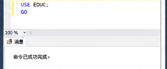

3.  按照参照完整性的要求，先向系表插入数据。系表是其他表的基础表，应先插入。

    ```sql
    INSERT INTO 系 VALUES
    ('D001', N'计算机系', N'王主任', '05510001', N'信息楼101'),
    ('D002', N'数学系', N'李主任', '05510002', N'教学楼201'),
    ('D003', N'电子系', N'赵主任', '05510003', N'实验楼301'),
    ('D004', N'管理系', N'钱主任', '05510004', N'文科楼401');
    GO

    SELECT * FROM 系;
    ```

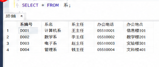

4.  向专业表插入数据。专业表中的所属系字段需要引用系表中的系编号，因此必须在系表已有数据后再插入专业数据。

    ```sql
    INSERT INTO 专业 VALUES
    ('01', N'计算机科学与技术', 'D001'),
    ('02', N'软件工程', 'D001'),
    ('03', N'网络工程', 'D001'),
    ('04', N'信息安全', 'D001'),
    ('05', N'数学与应用数学', 'D002'),
    ('06', N'电子信息工程', 'D003'),
    ('07', N'通信工程', 'D003'),
    ('08', N'工商管理', 'D004');
    GO

    SELECT * FROM 专业;
    ```

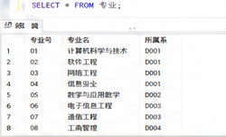

5.  向教师表插入数据。教师表中的所在系字段引用系表，因此教师所属系必须已经存在。

    ```sql
    INSERT INTO 教师 VALUES
    ('T000000001', N'张老师', 'D001', '13800000001', 'zhang@educ.com'),
    ('T000000002', N'李老师', 'D001', '13800000002', 'li@educ.com'),
    ('T000000003', N'王老师', 'D002', '13800000003', 'wang@educ.com'),
    ('T000000004', N'赵老师', 'D003', '13800000004', 'zhao@educ.com'),
    ('T000000005', N'钱老师', 'D004', '13800000005', 'qian@educ.com');
    GO

    SELECT * FROM 教师;
    ```

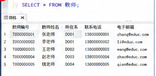

6.  向学生表插入数据。学生表中的专业号字段引用专业表中的专业编号，因此专业数据必须先存在。

    ```sql
    INSERT INTO 学生 VALUES
    ('20230001', N'张三', N'男', 19, '01', N'计科2301'),
    ('20230002', N'李四', N'女', 20, '01', N'计科2301'),
    ('20230003', N'王五', N'男', 19, '02', N'软件2301'),
    ('20230004', N'赵六', N'女', 18, '02', N'软件2301'),
    ('20230005', N'钱七', N'男', 21, '03', N'网络2301'),
    ('20230006', N'孙八', N'女', 20, '03', N'网络2301'),
    ('20230007', N'周九', N'男', 19, '04', N'信安2301'),
    ('20230008', N'吴十', N'女', 18, '04', N'信安2301'),
    ('20230009', N'郑一', N'男', 20, '05', N'数学2301'),
    ('20230010', N'冯二', N'女', 21, '05', N'数学2301'),
    ('20230011', N'陈三', N'男', 19, '06', N'电子2301'),
    ('20230012', N'褚四', N'女', 20, '06', N'电子2301'),
    ('20230013', N'卫五', N'男', 18, '07', N'通信2301'),
    ('20230014', N'蒋六', N'女', 19, '07', N'通信2301'),
    ('20230015', N'沈七', N'男', 20, '08', N'管理2301');
    GO

    SELECT * FROM 学生;
    ```

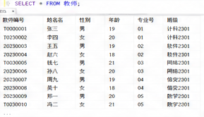

7.  向课程表插入数据。由于课程表中可能存在先修课字段，插入时应先插入没有先修课的课程，再插入引用已有课程号的课程。

    ```sql
    INSERT INTO 课程 VALUES
    ('c101', N'数据库原理', 4, 64, NULL),
    ('c102', N'程序设计基础', 4, 64, NULL),
    ('c103', N'高等数学', 5, 80, NULL),
    ('c104', N'大学英语', 3, 48, NULL),
    ('c105', N'计算机导论', 2, 32, NULL),
    ('c209', N'C语言程序设计', 4, 64, 'c102'),
    ('c210', N'Java语言', 4, 64, 'c209'),
    ('c218', N'数据结构', 4, 64, 'c209'),
    ('c331', N'操作系统', 4, 64, 'c218'),
    ('c332', N'计算机网络', 4, 64, 'c331');
    GO

    SELECT * FROM 课程;
    ```

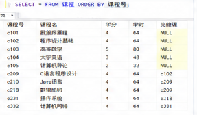

8.  向学生选课表插入数据。学生选课表同时引用学生表和课程表，因此必须保证对应学号和课程号已经存在。

    ```sql
    INSERT INTO 学生选课 VALUES
    ('20230001', 'c101', 86),
    ('20230001', 'c209', 78),
    ('20230001', 'c218', 92),
    ('20230002', 'c101', 81),
    ('20230002', 'c102', 76),
    ('20230003', 'c101', 90),
    ('20230003', 'c210', 88),
    ('20230004', 'c209', 58),
    ('20230004', 'c218', 79),
    ('20230005', 'c331', 83),
    ('20230006', 'c332', 57),
    ('20230007', 'c101', 95),
    ('20230008', 'c103', 89),
    ('20230009', 'c103', 91),
    ('20230010', 'c104', 85),
    ('20230011', 'c105', 73),
    ('20230012', 'c209', 55),
    ('20230013', 'c210', 80),
    ('20230014', 'c218', 87),
    ('20230015', 'c104', 60),
    ('20230015', 'c105', 75);
    GO

    SELECT * FROM 学生选课;
    ```

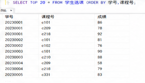

9.  查询各表记录数，检查是否满足实验要求。

    ```sql
    SELECT N'系' AS 表名, COUNT(*) AS 记录数 FROM 系
    UNION ALL
    SELECT N'专业', COUNT(*) FROM 专业
    UNION ALL
    SELECT N'学生', COUNT(*) FROM 学生
    UNION ALL
    SELECT N'课程', COUNT(*) FROM 课程
    UNION ALL
    SELECT N'学生选课', COUNT(*) FROM 学生选课;
    ```

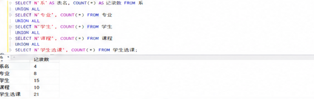

10. 插入违反实体完整性的错误数据。这里使用重复的系编号，主键重复时数据库应拒绝插入。

    ```sql
    INSERT INTO 系 VALUES
    ('D001', N'重复系', N'错误主任', '05519999', N'错误地址');
    ```

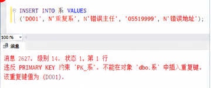

11. 插入违反参照完整性的错误数据。这里向专业表插入一个不存在的所属系编号，数据库应拒绝插入。

    ```sql
    INSERT INTO 专业 VALUES
    ('99', N'不存在所属系的专业', 'D999');
    ```

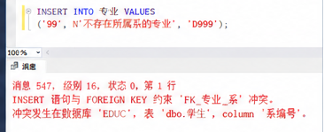

12. 插入违反用户定义完整性的错误数据。这里插入年龄明显不合理或性别不符合约束的数据，如果前面建表时设置了 CHECK 约束，数据库应拒绝插入。

    ```sql
    INSERT INTO 学生 VALUES
    ('20239998', N'错误学生', N'未知', 200, '01', N'错误班级');
    ```

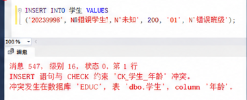

13. 修改某位学生的专业号，并验证修改成功。

    ```sql
    UPDATE 学生
    SET 专业号 = '02'
    WHERE 学号 = '20230001';
    GO

    SELECT 学号, 姓名, 专业号
    FROM 学生
    WHERE 学号 = '20230001';
    ```

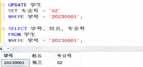

14. 修改某位学生的专业号为不存在的专业号，验证修改操作被拒绝。

    ```sql
    UPDATE 学生
    SET 专业号 = '99'
    WHERE 学号 = '20230001';
    ```

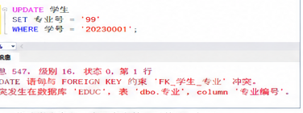

15. 修改某门课学生的成绩，并查看修改结果。

    ```sql
    UPDATE 学生选课
    SET 成绩 = 95
    WHERE 学号 = '20230001' AND 课程号 = 'c101';
    GO

    SELECT *
    FROM 学生选课
    WHERE 学号 = '20230001' AND 课程号 = 'c101';
    ```

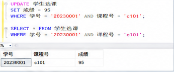

16. 将学生选课表中50~59之间的成绩整体增加10分，并查看修改结果。

    ```sql
    SELECT *
    FROM 学生选课
    WHERE 成绩 BETWEEN 50 AND 59;
    GO

    UPDATE 学生选课
    SET 成绩 = 成绩 + 10
    WHERE 成绩 BETWEEN 50 AND 59;
    GO

    SELECT *
    FROM 学生选课
    WHERE 成绩 BETWEEN 60 AND 69;
    ```

17. 将 Java 语言课程的先修课改为 c209，并查看修改结果。

    ```sql
    UPDATE 课程
    SET 先修课 = 'c209'
    WHERE 课程名 IN (N'Java语言', N'Java语句');
    GO

    SELECT 课程号, 课程名, 先修课
    FROM 课程
    WHERE 课程名 IN (N'Java语言', N'Java语句');
    ```

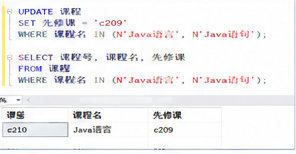

18. 先在学生表中插入一个专业号为空值的学生记录。

    ```sql
    INSERT INTO 学生 VALUES
    ('20239999', N'临时学生', N'男', 20, NULL, N'临时班级');
    GO

    SELECT *
    FROM 学生
    WHERE 专业号 IS NULL;
    ```

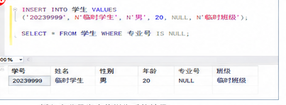

19. 删除学生表中所有未设定专业号的学生。

    ```sql
    DELETE FROM 学生
    WHERE 专业号 IS NULL;
    GO

    SELECT *
    FROM 学生
    WHERE 专业号 IS NULL;
    ```

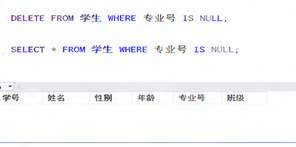

20. 最后查询主要数据表，确认实验数据仍然存在，且删除操作只删除了专业号为空值的临时学生。

    ```sql
    SELECT * FROM 学生;
    SELECT * FROM 学生选课;
    SELECT * FROM 课程;
    ```

## 五、实验小结

做完这次增删改的实验，最大的感触就是：数据库真的比我想象中要“严格”得多。以前觉得 `INSERT` 和 `UPDATE` 挺简单的，无非就是加点数据、改改字段。但这次按着参照完整性的要求去插入数据（先插系表、再插专业表、最后才是学生表），才发现顺序一旦搞反就会直接报错。尤其是后来故意去插入重复的系编号，或者给学生分配不存在的专业号时，看到 SSMS 弹出红色的报错拦截信息，反而让我觉得挺有安全感的——这说明实体完整性和参照完整性确实在底层死死把关，防止了“脏数据”混进系统。

另外，写批量更新和删除操作的时候也感觉很爽。比如把50~59分的成绩整体加10分，或者用 `IS NULL` 精准删掉没有分配专业的临时学生，一句短小精悍的 SQL 就能瞬间搞定那么多记录，确实体会到了关系型数据库处理批量数据的高效。总的来说，这次实验不仅让我记牢了增删改的语法，更重要的是让我直观明白了建表时那些看似繁琐的约束（PRIMARY KEY, FOREIGN KEY, CHECK）到底有多关键。以后自己搞开发设计表结构，肯定是不敢再偷懒省掉这些约束条件了。

# 实验七 数据查询

## 一、实验目的

1. 熟悉SQL Server交互式使用Select语句的方法。
2. 掌握执行和检查SELECT语句结果的方法。
3. 熟练运用单表查询、多表查询、嵌套查询等完成实际查询要求。

## 二、实验要求

1. 完成所要求的全部查询。
2. 注意操作结果的截图与保存，供撰写实验报告使用。

## 三、实验内容

1. 单表查询
   1. 查询全体学生的信息。
   2. 根据专业编号查询学生的学号、性别和年龄。
   3. 查询未设定先修课的所有课程的信息。
   4. 查询选修了 c101 号课程，且成绩达到80分的学号。
2. 多表连接查询
   1. 查询“计算机系”全体学生的学号、姓名、专业名称。
   2. 查询非“软件工程”专业，年龄小于20的学生信息。
   3. 查询先修课是“操作系统”的所有课程的信息。
   4. 查询至少选修了 c110 和 c210 课程的学生学号和姓名。
   5. 查询未选修“计算机网络”课程的学生学号、姓名、性别和专业号。
   6. 查询未选修任何课程的学生学号和姓名。
   7. 查询未被学生选修的课程号、课程名、先修课。
   8. 用派生关系查询平均成绩达到90分的学生学号、姓名和平均成绩。
   9. 查询学生的学号，只要先修课是 c331 的课程他们都选修了。
   10. 查询未参加课程 c209 考试的学生名单。

## 四、实验步骤

1. 查询全体学生信息。

   ```sql
   SELECT *
   FROM 学生
   ORDER BY 学号;
   ```

   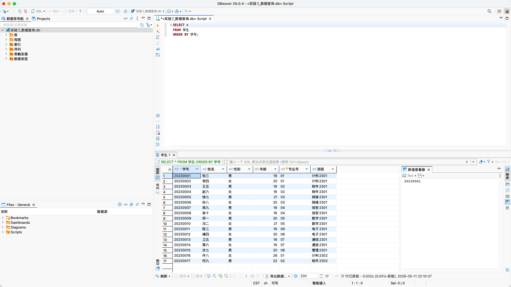

2. 根据专业编号查询学生的学号、性别和年龄。

   ```sql
   SELECT 学号, 性别, 年龄
   FROM 学生
   WHERE 专业号 = '01'
   ORDER BY 学号;
   ```

   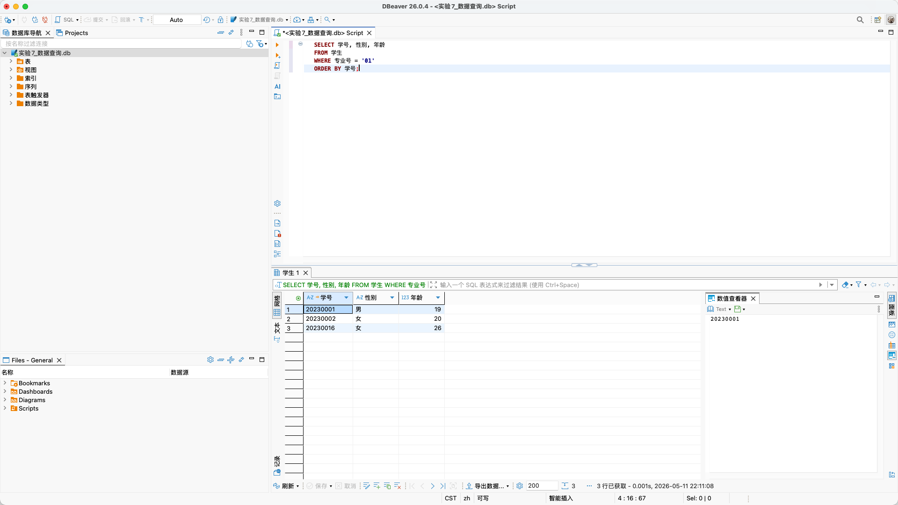

3. 查询未设定先修课的所有课程。

   ```sql
   SELECT 课程号, 课程名, 学分, 学时, 先修课
   FROM 课程
   WHERE 先修课 IS NULL
   ORDER BY 课程号;
   ```

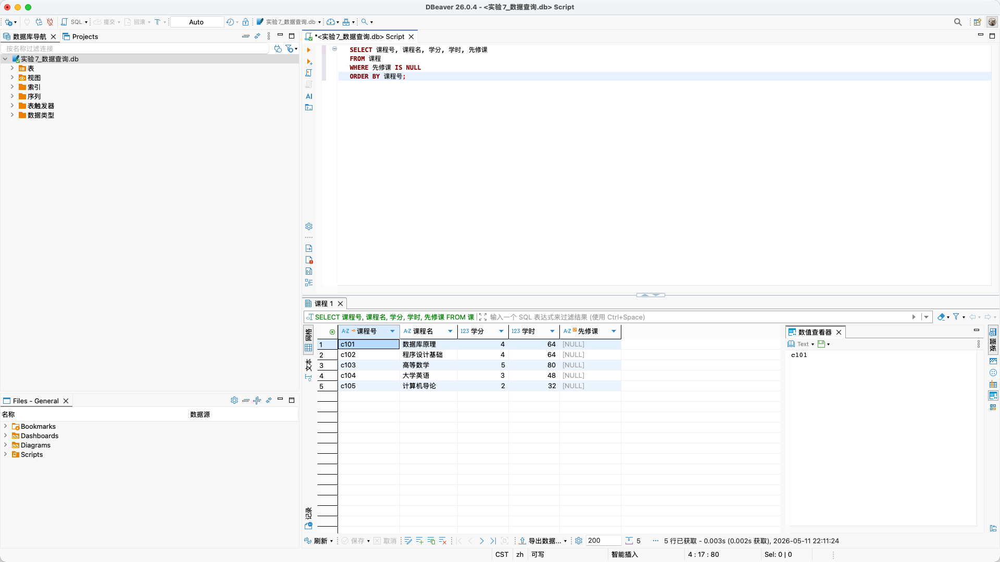

4. 查询选修 c101 且成绩达到80分的学号。

   ```sql
   SELECT 学号
   FROM 学生选课
   WHERE 课程号 = 'c101' AND 成绩 >= 80
   ORDER BY 学号;
   ```

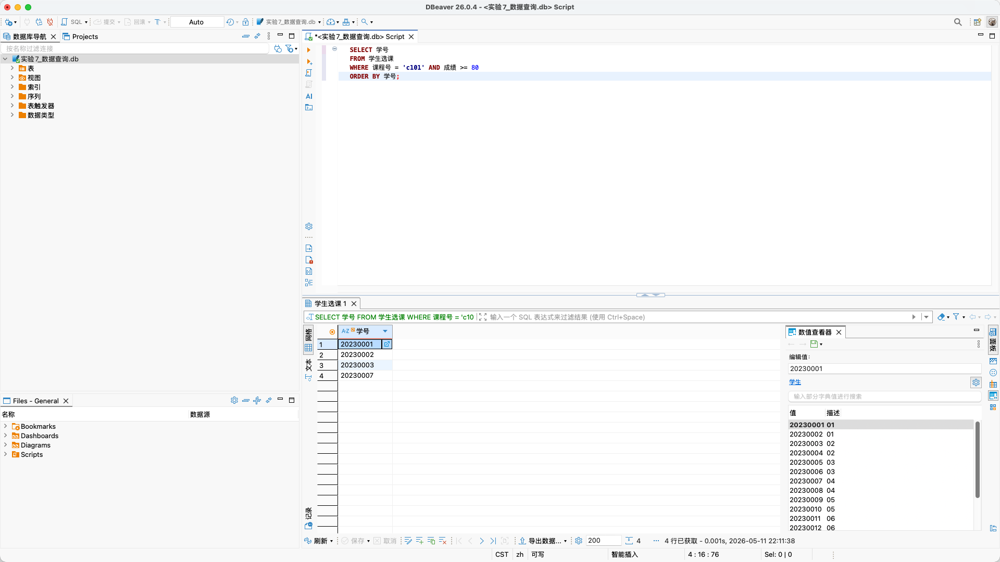

5.  查询计算机系全体学生的学号、姓名、专业名称。

    ```sql
    SELECT s.学号, s.姓名, m.专业名称
    FROM 学生 AS s
    JOIN 专业 AS m ON s.专业号 = m.专业编号
    JOIN 系 AS d ON m.所属系 = d.系编号
    WHERE d.系名称 = '计算机系'
    ORDER BY s.学号;
    ```

    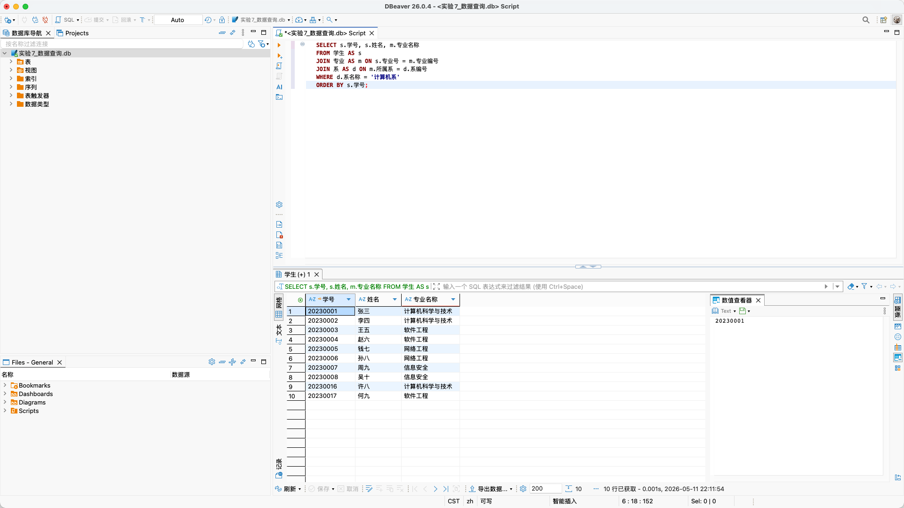

6.  查询非软件工程专业且年龄小于20的学生信息。

    ```sql
    SELECT s.学号, s.姓名, s.性别, s.年龄, s.专业号
    FROM 学生 AS s
    JOIN 专业 AS m ON s.专业号 = m.专业编号
    WHERE m.专业名称 <> '软件工程' AND s.年龄 < 20
    ORDER BY s.学号;
    ```

    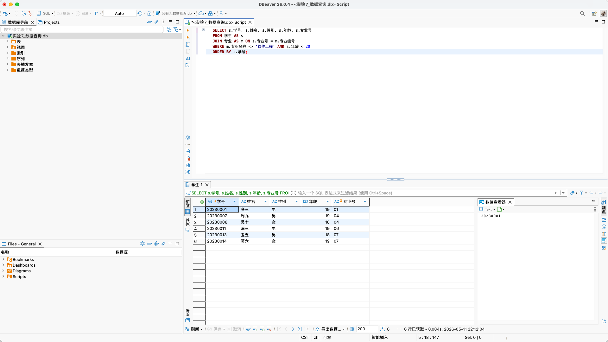

7.  查询先修课是操作系统的所有课程。

    ```sql
    SELECT c.课程号, c.课程名, c.先修课
    FROM 课程 AS c
    JOIN 课程 AS p ON c.先修课 = p.课程号
    WHERE p.课程名 = '操作系统'
    ORDER BY c.课程号;
    ```

    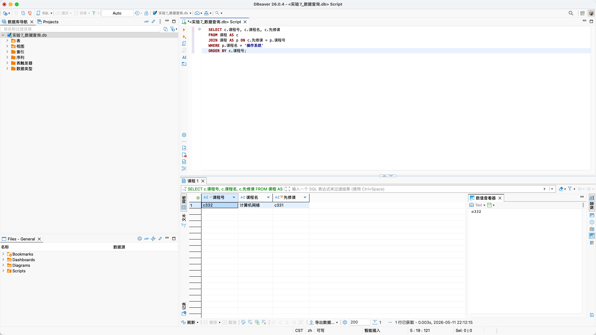

8.  查询至少选修 c110 和 c210 的学生学号和姓名。

    ```sql
    SELECT s.学号, s.姓名
    FROM 学生 AS s
    WHERE EXISTS (
        SELECT 1 FROM 学生选课 AS sc
        WHERE sc.学号 = s.学号 AND sc.课程号 = 'c110'
    )
    AND EXISTS (
        SELECT 1 FROM 学生选课 AS sc
        WHERE sc.学号 = s.学号 AND sc.课程号 = 'c210'
    )
    ORDER BY s.学号;
    ```

    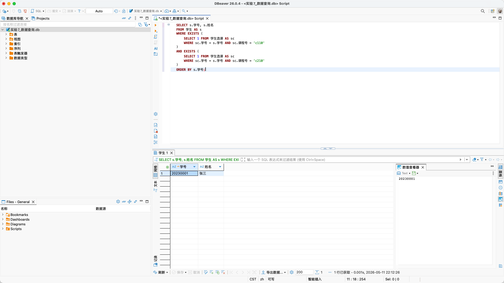

9.  查询未选修计算机网络课程的学生。

    ```sql
    SELECT s.学号, s.姓名, s.性别, s.专业号
    FROM 学生 AS s
    WHERE NOT EXISTS (
        SELECT 1
        FROM 学生选课 AS sc
        JOIN 课程 AS c ON sc.课程号 = c.课程号
        WHERE sc.学号 = s.学号 AND c.课程名 = '计算机网络'
    )
    ORDER BY s.学号;
    ```

    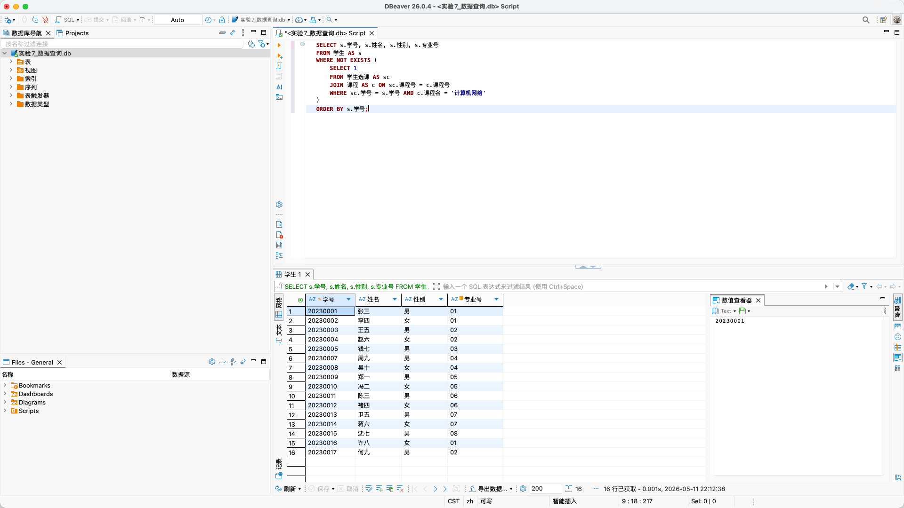

10. 查询未选修任何课程的学生。

        ```sql
        SELECT s.学号, s.姓名
        FROM 学生 AS s
        WHERE NOT EXISTS (
            SELECT 1 FROM 学生选课 AS sc WHERE sc.学号 = s.学号
        )
        ORDER BY s.学号;
        ```

    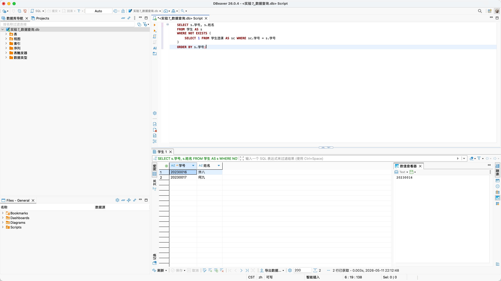

11. 查询未被学生选修的课程。

    ```sql
    SELECT c.课程号, c.课程名, c.先修课
    FROM 课程 AS c
    WHERE NOT EXISTS (
        SELECT 1 FROM 学生选课 AS sc WHERE sc.课程号 = c.课程号
    )
    ORDER BY c.课程号;
    ```

    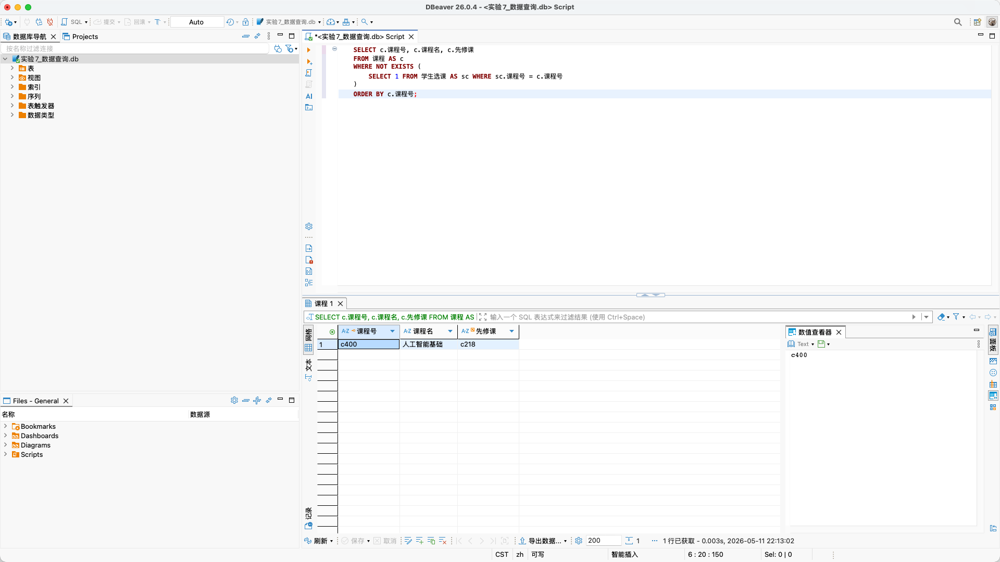

12. 用派生关系查询平均成绩达到90分的学生。

    ```sql
    SELECT s.学号, s.姓名, ROUND(g.平均成绩, 2) AS 平均成绩
    FROM 学生 AS s
    JOIN (
        SELECT 学号, AVG(成绩) AS 平均成绩
        FROM 学生选课
        GROUP BY 学号
    ) AS g ON s.学号 = g.学号
    WHERE g.平均成绩 >= 90
    ORDER BY s.学号;
    ```

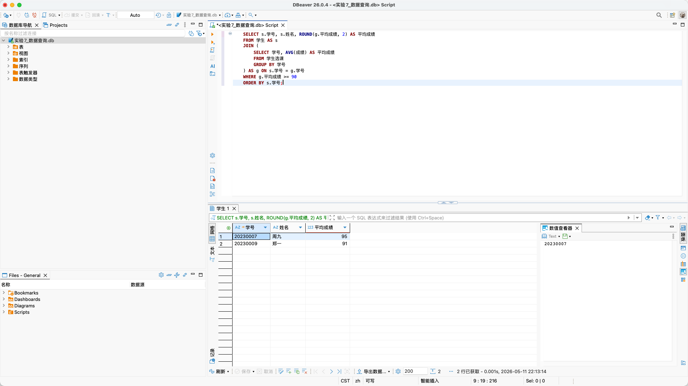

13. 查询选修了全部先修课为 c331 的课程的学生学号。

    ```sql
    SELECT s.学号
    FROM 学生 AS s
    WHERE NOT EXISTS (
        SELECT 1
        FROM 课程 AS c
        WHERE c.先修课 = 'c331'
        AND NOT EXISTS (
            SELECT 1
            FROM 学生选课 AS sc
            WHERE sc.学号 = s.学号 AND sc.课程号 = c.课程号
        )
    )
    ORDER BY s.学号;
    ```

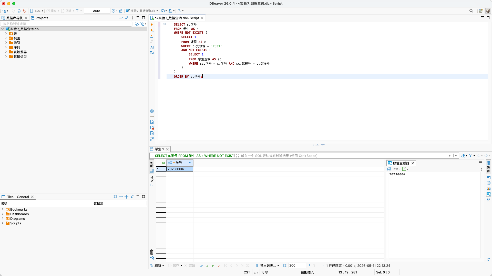

14. 查询未参加 c209 考试的学生名单。

        ```sql
        SELECT s.学号, s.姓名, s.专业号
        FROM 学生 AS s
        WHERE NOT EXISTS (
            SELECT 1
            FROM 学生选课 AS sc
            WHERE sc.学号 = s.学号 AND sc.课程号 = 'c209'
        )
        ORDER BY s.学号;
        ```

    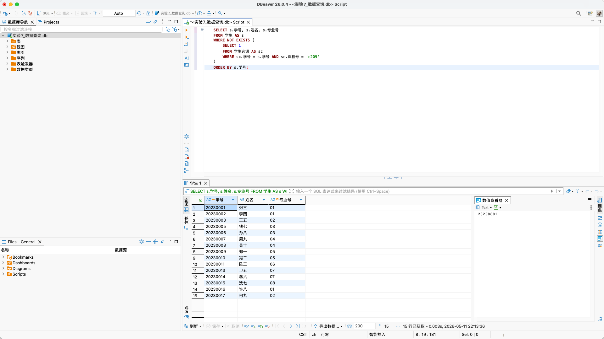

## 五、实验小结

写了那么多长长的查询语句，我才真正领略到 SQL 查询的强大。之前觉得查数据无非是 `SELECT *` 加上个 `WHERE`，但遇到多表连接和嵌套查询时，逻辑稍微绕一点就会把人搞晕。特别是那些涉及 `NOT EXISTS` 的双重否定查询（比如查询选修了某门先修课的所有课程的学生），刚开始写的时候脑子里完全是一团浆糊。不过，在不断调试、看着查询结果从满屏报错变成精准找出目标数据的过程中，这种抽丝剥茧的逻辑推演真的很让人上头。我发现写好查询语句不仅仅是语法正确，更需要在脑海里先搭建好表跟表之间的关联关系网，这种思维的训练对我启发很大。

# 实验八 使用聚集函数的SELECT语句

## 一、实验目的

1. 熟练掌握数据查询中的分组、统计、计算和组合的操作方法。
2. 进一步掌握SQL Server 查询窗口的使用，加深对SQL语言的嵌套查询语句的理解。

## 二、实验要求

1. 在实验之前做好准备。
2. 注意操作结果的截图与保存，供撰写实验报告使用。

## 三、实验内容

在数据库EDUC中用SQL语句实现如下查询：

1. 查询学生的总人数。
2. 查询每个专业的专业编号、专业名称、学生人数、学生的平均年龄。
3. 查询选修了课程的学生人数。
4. 查询选修了课程“c218”，且成绩超过该课程平均成绩的学生学号、姓名。
5. 查询每门课的课程号、选课人数、平均成绩、最高分和最低分。
6. 查询选修课程超过2 门课的学生学号和姓名。

## 四、实验步骤

1. 查询学生总人数。

   ```sql
   SELECT COUNT(*) AS 学生总人数
   FROM 学生;
   ```

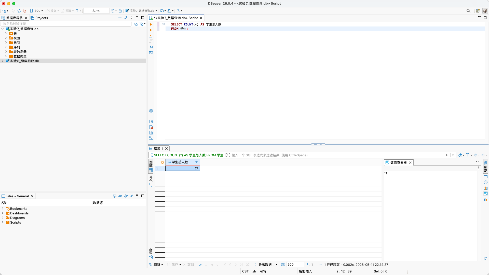

2. 查询每个专业的专业编号、专业名称、学生人数和学生平均年龄。

   ```sql
   SELECT m.专业编号,
          m.专业名称,
          COUNT(s.学号) AS 学生人数,
          ROUND(AVG(s.年龄), 2) AS 平均年龄
   FROM 专业 AS m
   LEFT JOIN 学生 AS s ON s.专业号 = m.专业编号
   GROUP BY m.专业编号, m.专业名称
   ORDER BY m.专业编号;
   ```

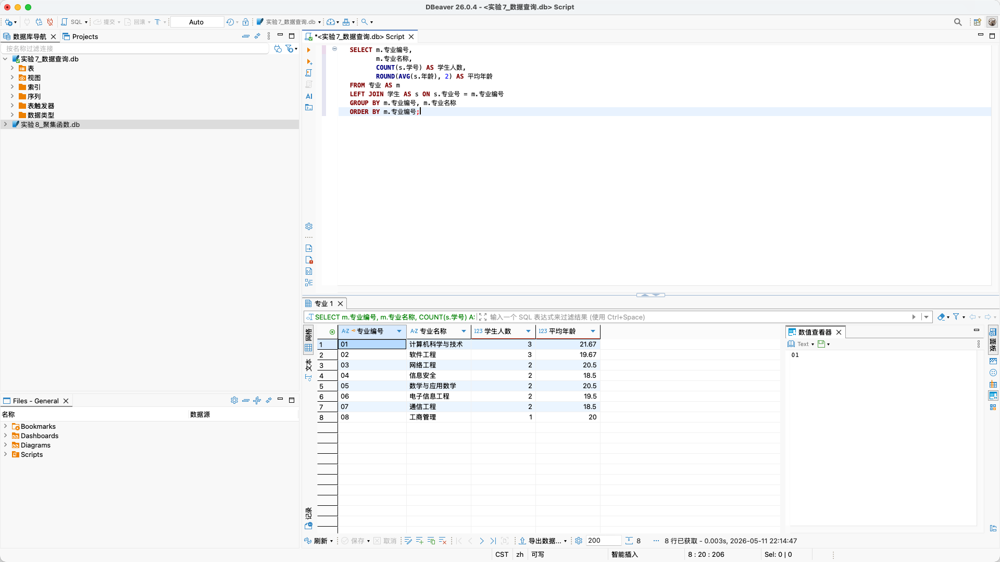

3. 查询选修了课程的学生人数。

   ```sql
   SELECT COUNT(DISTINCT 学号) AS 选课学生人数
   FROM 学生选课;
   ```

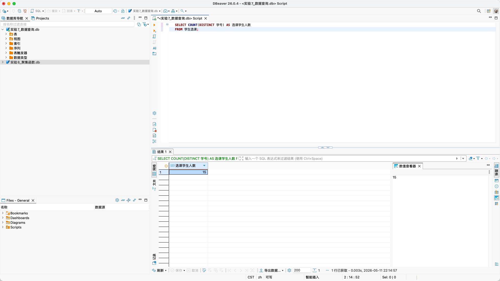

4. 查询选修了 c218 且成绩超过该课程平均成绩的学生学号和姓名。

   ```sql
   SELECT s.学号, s.姓名, sc.成绩
   FROM 学生 AS s
   JOIN 学生选课 AS sc ON s.学号 = sc.学号
   WHERE sc.课程号 = 'c218'
     AND sc.成绩 > (
         SELECT AVG(成绩)
         FROM 学生选课
         WHERE 课程号 = 'c218'
     )
   ORDER BY s.学号;
   ```

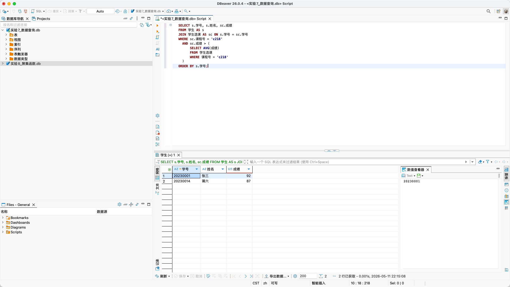

5. 查询每门课的课程号、选课人数、平均成绩、最高分和最低分。

   ```sql
   SELECT c.课程号,
          c.课程名,
          COUNT(sc.学号) AS 选课人数,
          ROUND(AVG(sc.成绩), 2) AS 平均成绩,
          MAX(sc.成绩) AS 最高分,
          MIN(sc.成绩) AS 最低分
   FROM 课程 AS c
   LEFT JOIN 学生选课 AS sc ON c.课程号 = sc.课程号
   GROUP BY c.课程号, c.课程名
   ORDER BY c.课程号;
   ```

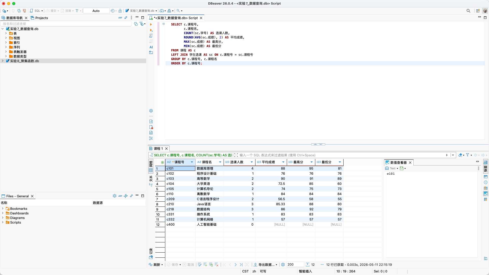

6. 查询选修课程超过2门课的学生学号和姓名。

   ```sql
   SELECT s.学号, s.姓名, COUNT(sc.课程号) AS 选课门数
   FROM 学生 AS s
   JOIN 学生选课 AS sc ON s.学号 = sc.学号
   GROUP BY s.学号, s.姓名
   HAVING COUNT(sc.课程号) > 2
   ORDER BY s.学号;
   ```

   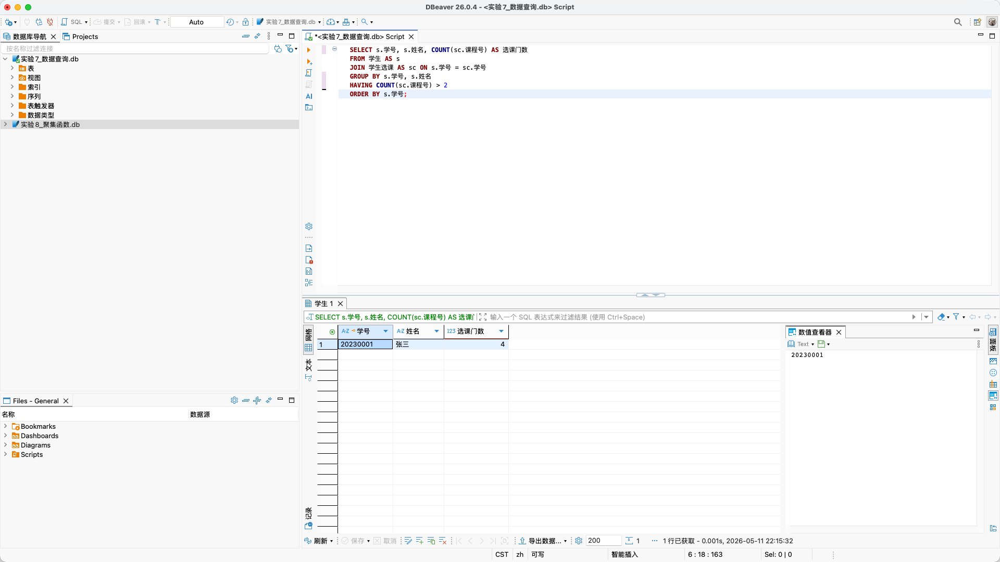

## 五、实验小结

这次实验把重心放在了数据的统计和分析上。以前觉得只要把数据存进去就万事大吉了，但实际应用中，我们往往更关心“平均分”、“总人数”、“最高最低分”这些宏观指标。用 `GROUP BY` 结合 `COUNT` 和 `AVG` 聚集函数后，我发现本来杂乱无章的一堆明细数据，瞬间就能被提炼成直观的业务信息。最容易踩坑的地方是 `WHERE` 和 `HAVING` 的区别，我好几次把要在分组后筛选的条件放到了 `WHERE` 里导致报错，后来才彻底弄明白，`HAVING` 才是聚集函数的好搭档。这也让我体会到，从“存数据”到“用数据”，SQL 的聚集函数是必不可少的分析利器。

# 实验九 视图的定义与使用

## 一、实验目的

1. 熟悉和掌握对数据表中视图的查询操作和SQL语句的使用。
2. 熟悉和掌握对数据表中视图的更新操作和SQL语句的使用，并注意视图更新与基本表更新的区别与联系。
3. 学习灵活熟练地进行视图操作，认识视图的作用。

## 二、实验要求

1. 在实验开始之前做好准备工作。
2. 思考视图和基本表的区别。
3. 注意操作结果的截图与保存，供撰写实验报告使用。

## 三、实验内容

1. 定义视图。
2. 查询所定义的视图。
3. 通过视图完成学生专业号和学生成绩的更新。

## 四、实验步骤

1. 定义学生、课程、选课连接视图 V_SC_G。

   ```sql
   CREATE VIEW V_SC_G AS
   SELECT s.学号, s.姓名, c.课程号, c.课程名, sc.成绩
   FROM 学生 AS s
   JOIN 学生选课 AS sc ON s.学号 = sc.学号
   JOIN 课程 AS c ON sc.课程号 = c.课程号;
   ```

   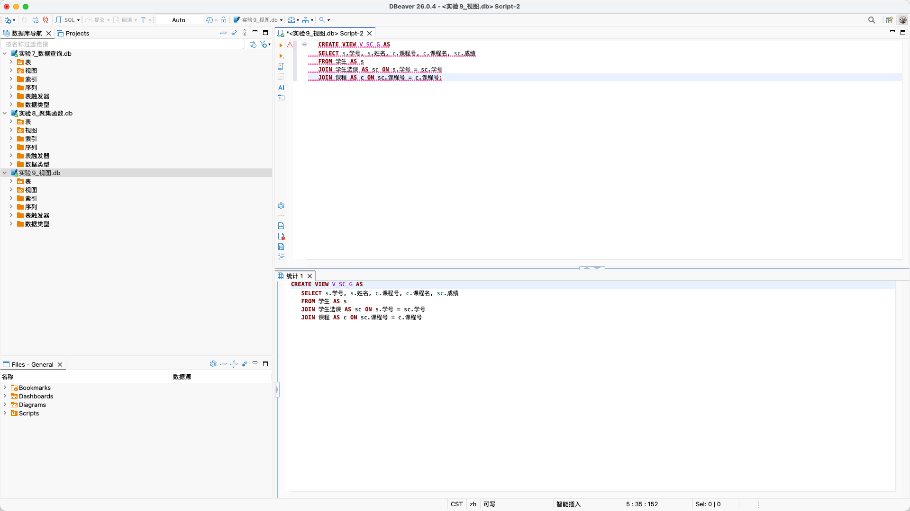

2. 定义反映学生出生年份的视图 V_YEAR。

   ```sql
   CREATE VIEW V_YEAR AS
   SELECT 学号, 姓名, CAST(strftime('%Y', 'now') AS INTEGER) - 年龄 AS 出生年份
   FROM 学生;
   ```

   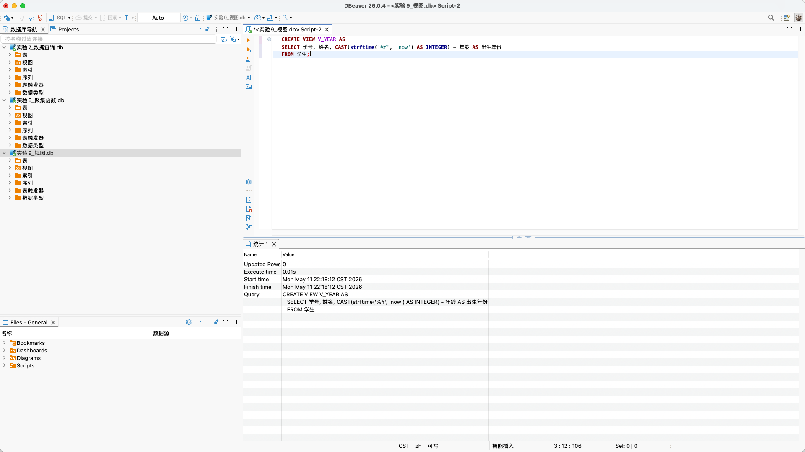

3. 定义学生平均成绩视图 V_AVG_S_G。

   ```sql
   CREATE VIEW V_AVG_S_G AS
   SELECT s.学号, s.姓名, COUNT(sc.课程号) AS 选课门数, ROUND(AVG(sc.成绩), 2) AS 平均成绩
   FROM 学生 AS s
   LEFT JOIN 学生选课 AS sc ON s.学号 = sc.学号
   GROUP BY s.学号, s.姓名;
   ```

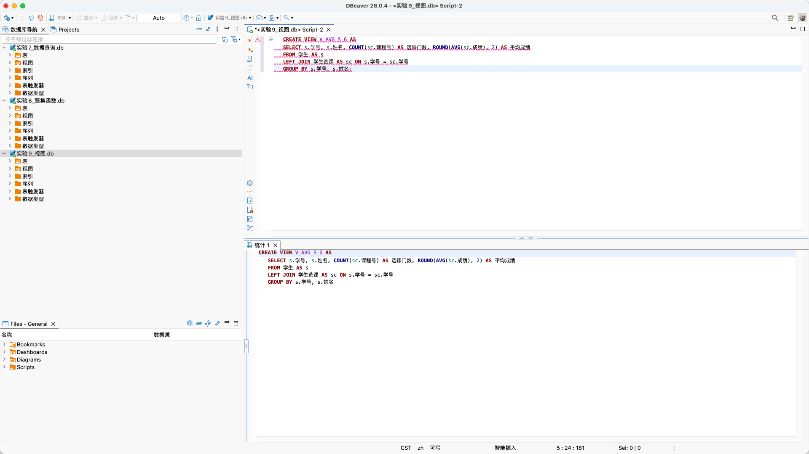

4. 定义课程平均成绩视图 V_AVG_C_G。

   ```sql
   CREATE VIEW V_AVG_C_G AS
   SELECT c.课程号, c.课程名, COUNT(sc.学号) AS 选课人数, ROUND(AVG(sc.成绩), 2) AS 平均成绩
   FROM 课程 AS c
   LEFT JOIN 学生选课 AS sc ON c.课程号 = sc.课程号
   GROUP BY c.课程号, c.课程名;
   ```

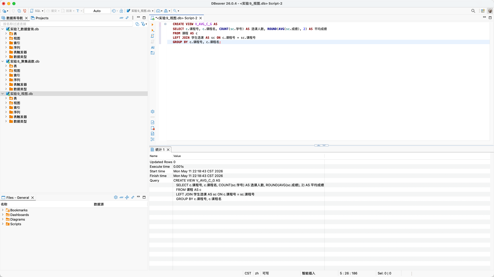

5.  定义学生行列子集视图 V_S 和选课视图 V_SC。

    ```sql
    CREATE VIEW V_S AS
    SELECT 学号, 姓名, 专业号
    FROM 学生;

    CREATE VIEW V_SC AS
    SELECT s.学号, s.姓名, sc.课程号, sc.成绩
    FROM 学生 AS s
    JOIN 学生选课 AS sc ON s.学号 = sc.学号;
    ```

    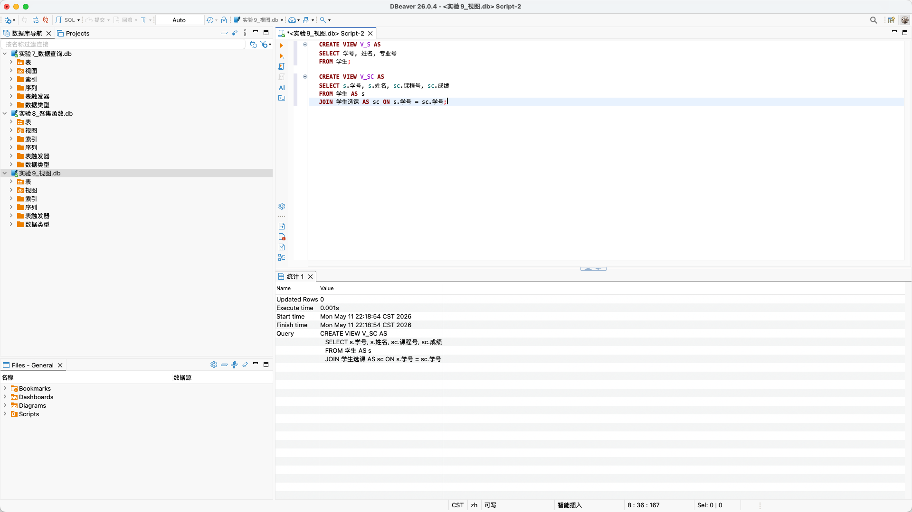

6.  查询平均成绩为90分及以上的学生。

    ```sql
    SELECT 学号, 姓名, 平均成绩
    FROM V_AVG_S_G
    WHERE 平均成绩 >= 90;
    ```

    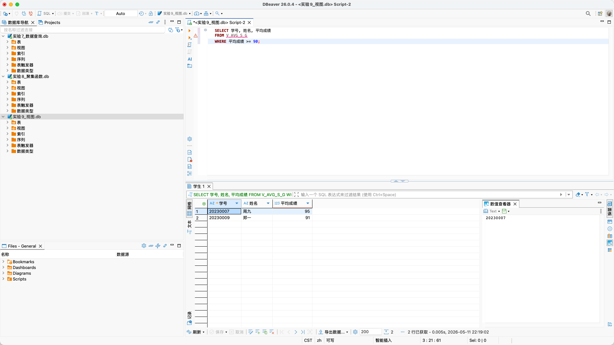

7.  查询科目成绩大于该课程平均成绩的学生成绩。

    ```sql
    SELECT v.学号, v.课程号, v.成绩, cavg.平均成绩
    FROM V_SC AS v
    JOIN V_AVG_C_G AS cavg ON v.课程号 = cavg.课程号
    WHERE v.成绩 > cavg.平均成绩
    ORDER BY v.学号, v.课程号;
    ```

    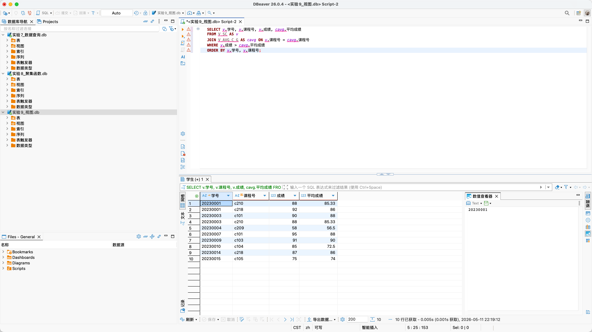

8.  查询2000年出生的学生。

    ```sql
    SELECT 学号, 姓名
    FROM V_YEAR
    WHERE 出生年份 = 2000;
    ```

    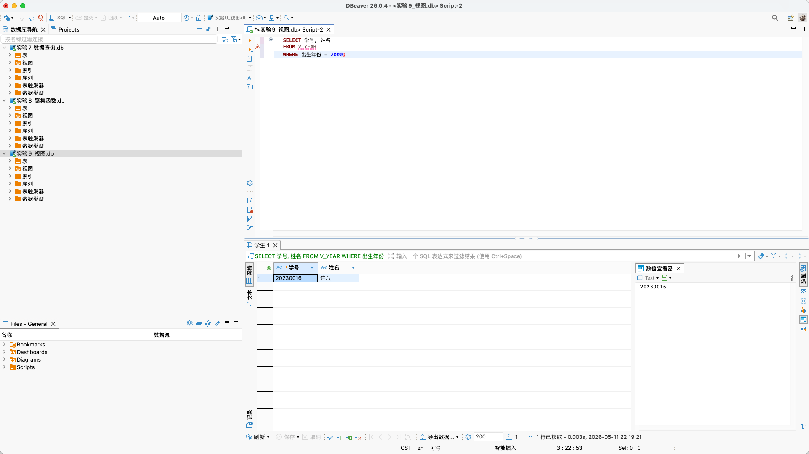

9.  SQLite 普通视图不能直接更新，因此使用 `INSTEAD OF` 触发器模拟可更新视图。

    ```sql
    CREATE TRIGGER V_S_Update
    INSTEAD OF UPDATE OF 专业号 ON V_S
    BEGIN
        UPDATE 学生
        SET 专业号 = NEW.专业号
        WHERE 学号 = OLD.学号;
    END;

    UPDATE V_S
    SET 专业号 = '03'
    WHERE 姓名 = '张三';
    ```

    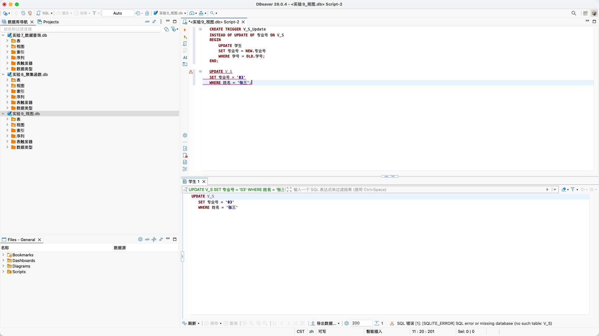

10. 通过视图 V_SC 修改指定学生的课程成绩。

        ```sql
        CREATE TRIGGER V_SC_Update
        INSTEAD OF UPDATE OF 成绩 ON V_SC
        BEGIN
            UPDATE 学生选课
            SET 成绩 = NEW.成绩
            WHERE 学号 = OLD.学号 AND 课程号 = OLD.课程号;
        END;

        UPDATE V_SC
        SET 成绩 = 85
        WHERE 学号 = '20230001' AND 课程号 = 'c101';
        ```

    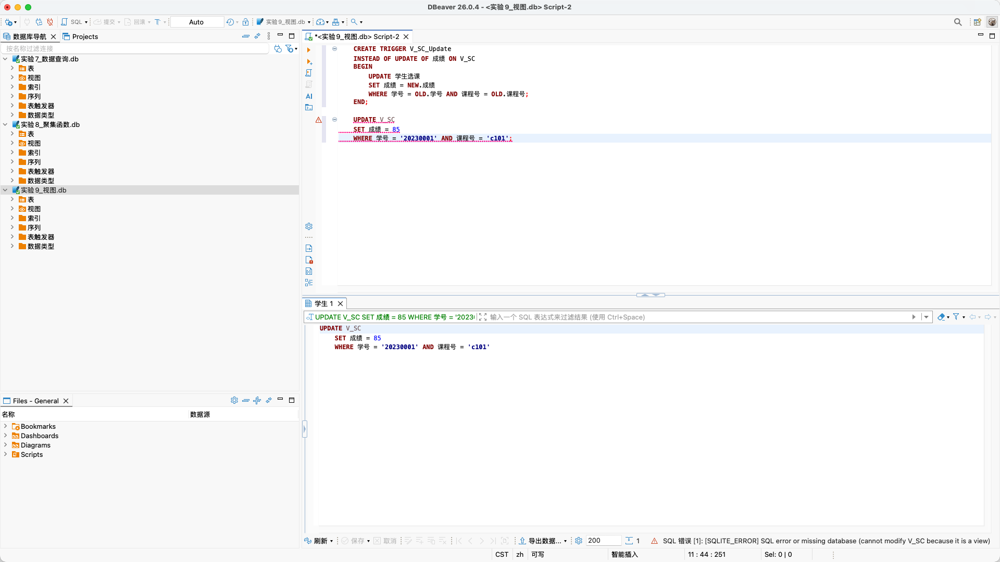

## 五、实验小结

视图这个概念一开始对我来说挺虚的，感觉也就是把查询结果存起来而已。但动手建了几个视图之后，我才感受到它的“香”。尤其是对于那些需要频繁连接好几张表的查询，建个视图就能把复杂的底层结构包装起来，以后查的时候就跟查单表一样清爽。我还特别研究了通过视图去更新基本表的操作，特别是使用触发器模拟视图更新的时候，发现这不仅方便，还相当于给底层数据上了一把“安全锁”，避免了直接暴露基础表。这种“封装”和“抽象”的设计思想，跟编程里的封装很像，以后在开发复杂应用时肯定特别受用。

# 实验十 触发器的定义与使用

## 一、实验目的

1. 熟悉和掌握触发器的创建、使用和删除操作。
2. 深入理解触发器在数据完整性、安全性及业务逻辑实现中的作用。
3. 提升创建和运用触发器的能力。

## 二、实验要求

1. 在实验开始前，仔细检查数据库连接是否正常，表结构是否完整，数据是否准确。
2. 对于每个触发器的创建、使用及删除操作，都要进行详细记录。
3. 结合当前 macOS 和 SQLite 环境完成触发器模拟实验。

## 三、实验内容

1. 创建触发器 TR_SC_Insert，当向学生选课表插入新记录时，自动更新课程表中的选课人数。
2. 创建触发器 TR_Student_Update，当修改学生表的专业号字段时，检查新专业号是否存在。
3. 删除触发器，清理实验环境。

## 四、实验步骤

1. 在 DBeaver 中开启 SQLite 外键检查。

   ```sql
   PRAGMA foreign_keys = ON;
   ```

2. 创建插入选课记录后自动更新课程选课人数的触发器。

   ```sql
   CREATE TRIGGER TR_SC_Insert
   AFTER INSERT ON 学生选课
   BEGIN
       UPDATE 课程
       SET 选课人数 = 选课人数 + 1
       WHERE 课程号 = NEW.课程号;
   END;
   ```

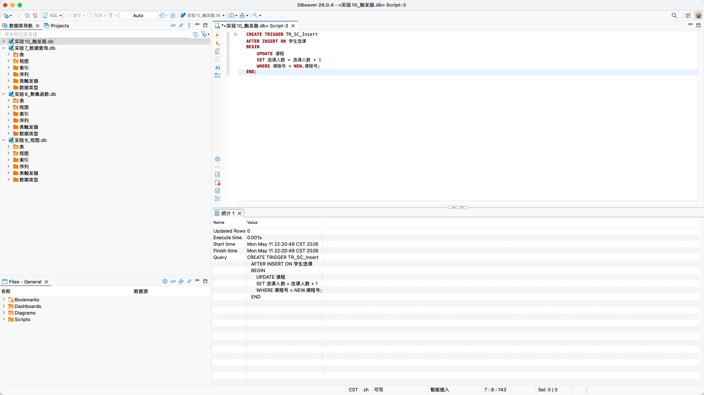

3. 插入一条合法选课记录，验证课程选课人数变化。

   ```sql
   INSERT INTO 学生选课 VALUES ('20230002', 'c332', 82);

   SELECT 课程号, 课程名, 选课人数
   FROM 课程
   WHERE 课程号 = 'c332';
   ```

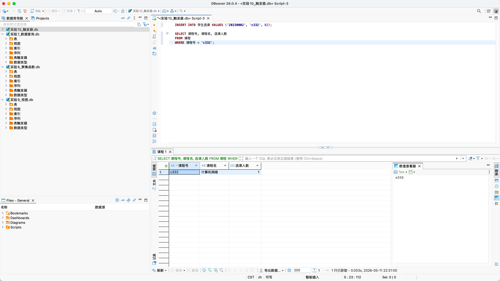

4. 尝试插入不存在课程号的选课记录，验证参照完整性约束会拒绝操作。

   ```sql
   INSERT INTO 学生选课 VALUES ('20230002', 'c999', 88);
   ```

   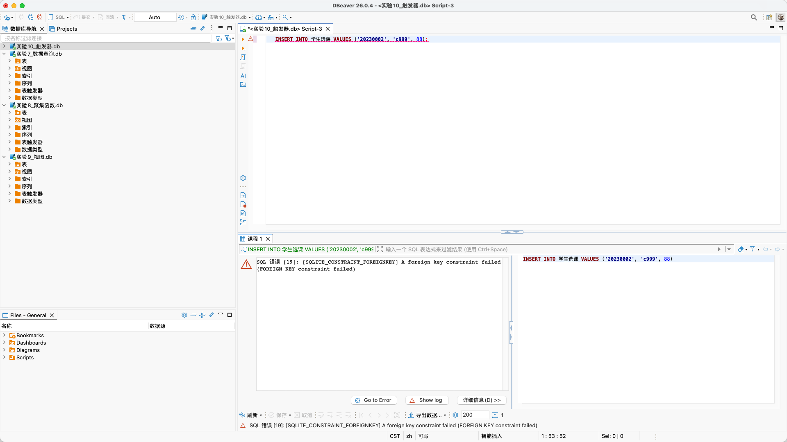

5. 创建学生专业号更新检查触发器。

   ```sql
   CREATE TRIGGER TR_Student_Update
   BEFORE UPDATE OF 专业号 ON 学生
   WHEN NEW.专业号 IS NOT NULL
        AND NOT EXISTS (SELECT 1 FROM 专业 WHERE 专业编号 = NEW.专业号)
   BEGIN
       SELECT RAISE(ABORT, '专业号不存在，拒绝修改');
   END;
   ```

   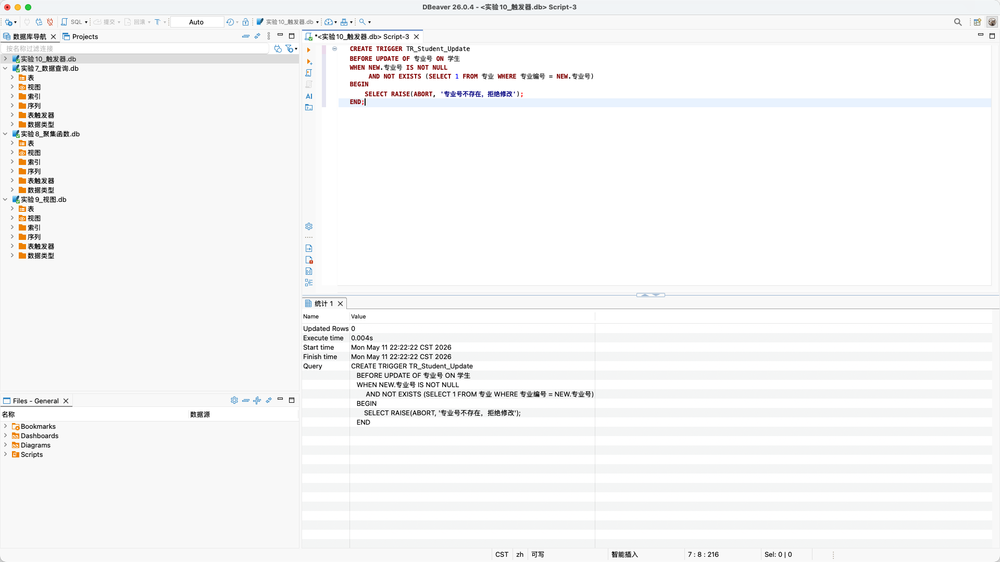

6. 修改学生专业号为存在的专业号。

   ```sql
   UPDATE 学生
   SET 专业号 = '03'
   WHERE 学号 = '20230003';
   ```

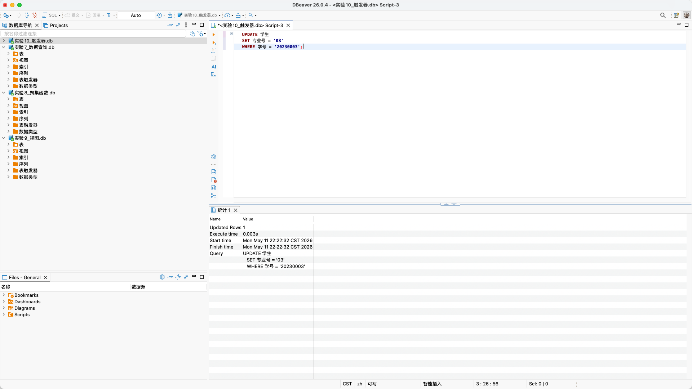

7. 修改学生专业号为不存在的专业号，验证触发器拒绝更新。

   ```sql
   UPDATE 学生
   SET 专业号 = '99'
   WHERE 学号 = '20230003';
   ```

   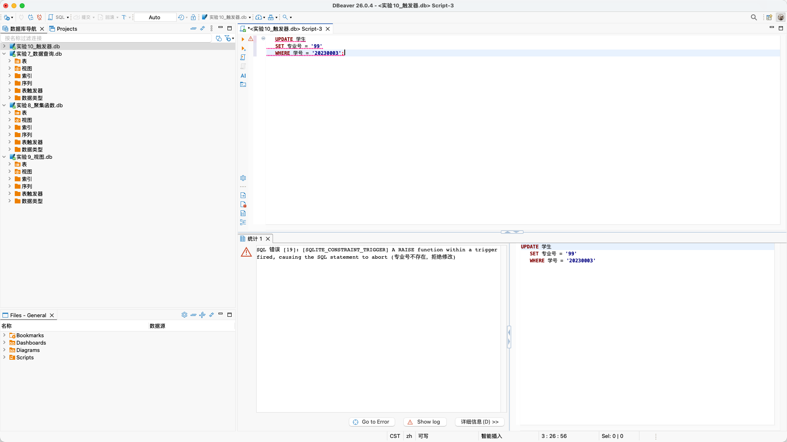

8. 删除本实验创建的触发器。

   ```sql
   DROP TRIGGER TR_SC_Insert;
   DROP TRIGGER TR_Student_Update;
   ```

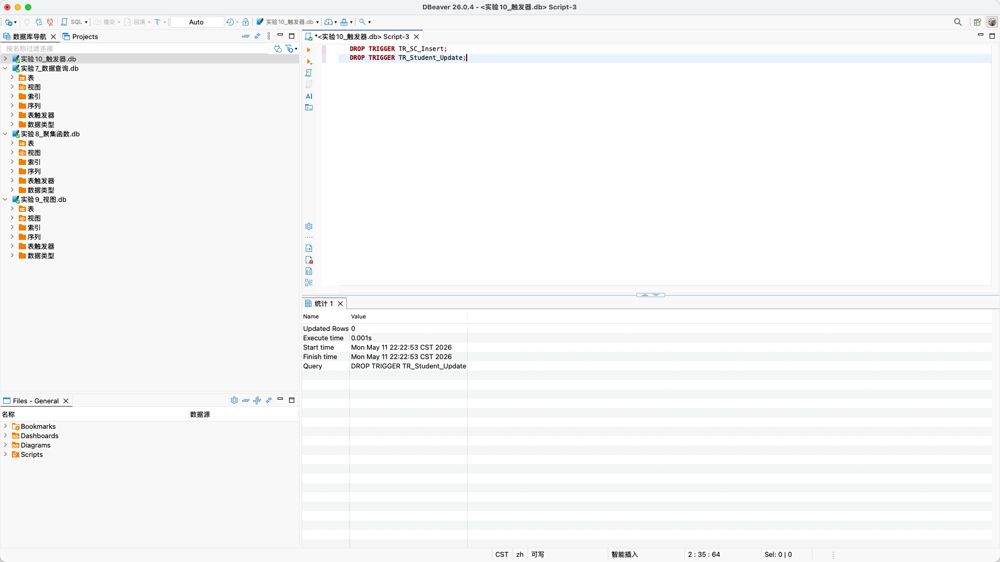

## 五、实验小结

做触发器实验的时候，感觉就像给数据库装上了一个个“自动感应雷达”。以前要维持数据的一致性，比如插入选课记录后去更新课程表的选课人数，得靠人在应用层连着写好几条代码。现在有了触发器，只要设定好条件，数据库自己就会在背后默默把这事儿办妥。看到插入一条选课记录后，课程的选课人数真的自动 `+1` 时，那种“自动化”的体验特别神奇。但也因为它是隐藏在背后自动触发的，排错起来变得有些隐蔽。这提醒我，触发器虽然是个维护数据完整性的神器，但绝对不能滥用，不然业务逻辑太散乱了最后连自己都找不到数据是怎么被改的。

# 实验十一 存储过程的定义与调用

## 一、实验目的

1. 熟悉和掌握存储过程的创建、执行和删除操作。
2. 理解存储过程封装复杂业务逻辑、提高复用性的作用。
3. 掌握带参数查询的基本思想。

## 二、实验要求

1. 在实验开始前，仔细检查数据库连接是否正常，确认能够顺利连接到 SQL Server数据库，避免因连接问题影响实验进度。
2. 对于每个存储过程的创建、执行和删除过程，都要进行详细的记录，包括编写的 SQL 语句、参数设置、执行结果以及遇到的问题和解决方案，为撰写实验报告提供详实的资料。
3. 在 SQL Server 和 openGauss 中分别完成以下实验内容，对比两种数据库在存储过程语法和功能上的差异，总结经验，提高在不同数据库环境下开发存储过程的能力。

## 三、实验内容

1. 无参数存储过程：创建一个名为proc_query_all_students的存储过程，其功能是查询学生表中的所有学生信息，并将查询结果显示出来。该存储过程不带任何参数，直接对学生表进行全表查询操作，适用于需要获取完整学生数据的场景，如学生信息列表展示等。
2. 带输入参数存储过程：创建一个名为proc_query_student_by_sno的存储过程，该存储过程带有一个输入参数@sno nvarchar(10)。其功能是根据输入的学号（@sno），查询出对应的学生姓名（Sname）、性别（Ssex）和年龄（Sage），实现按学号查询特定学生信息的功能，提高数据查询的针对性和效率，适用于根据学号快速检索学生信息的应用需求。
3. 执行以上存储过程。
4. 删除存储过程
   实验结束后，分别删除创建的proc_query_all_students和proc_query_student_by_sno存储过程。

## 四、实验步骤

1. SQLite 不支持 `CREATE PROCEDURE`，因此本实验在 DBeaver 中用固定 SQL 查询模拟无参数存储过程。

   ```sql
   SELECT 学号, 姓名, 性别, 年龄, 专业号
   FROM 学生
   ORDER BY 学号;
   ```

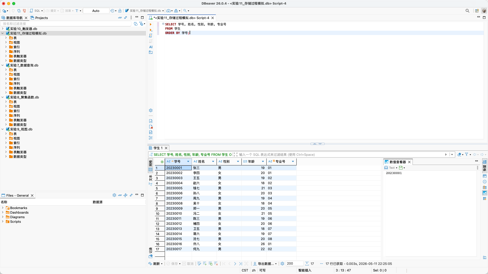

2. 用带 `WHERE` 条件的 SQL 查询模拟带输入参数的存储过程。

   ```sql
   SELECT 姓名, 性别, 年龄
   FROM 学生
   WHERE 学号 = ?;
   ```

   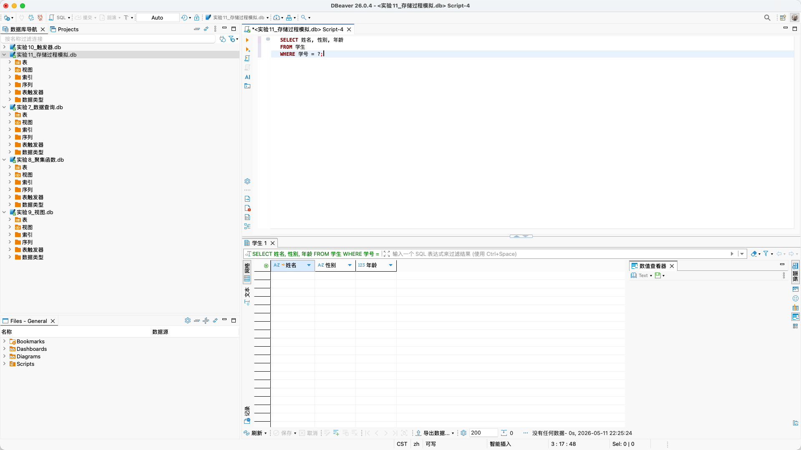

3. 调用模拟的无参数存储过程，查询全部学生信息。

   ```sql
   SELECT 学号, 姓名, 性别, 年龄, 专业号
   FROM 学生
   ORDER BY 学号;
   ```

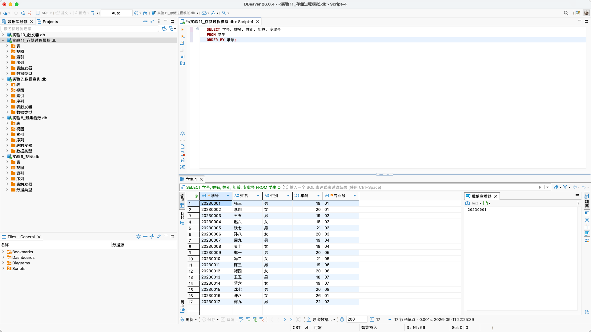

4. 调用模拟的带参数存储过程，按照学号查询指定学生。

   ```sql
   SELECT 姓名, 性别, 年龄
   FROM 学生
   WHERE 学号 = '20230001';
   ```

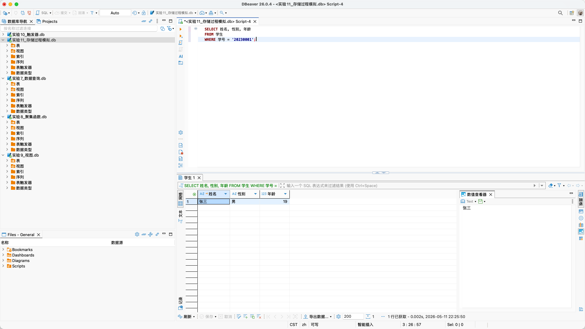

5. SQLite 中没有 `DROP PROCEDURE`，需要使用 mysql

```sql
DROP PROCEDURE proc_query_all_students;
DROP PROCEDURE proc_query_student_by_sno;
```

## 五、实验小结

如果说单纯的 SQL 语句是“单打独斗”，那存储过程就是把它们编排成了一支“正规军”。把频繁使用的操作写在数据库端并编译好，不仅调用起来像调函数一样方便，而且在执行效率上也有优势。由于 SQLite 不直接支持标准的存储过程，我在 DBeaver 里用了模拟的方式来感受带参数查询的逻辑，虽然没能完全在原生的环境里敲下那句 `CREATE PROCEDURE`，但核心思想我已经吃透了：把一段业务逻辑封装成一个单元，通过传入不同的参数（比如学号）就能得到特定的结果。这对于以后把数据库真正接入到后端开发系统里，绝对是至关重要的一环。

# 实验十二 在openGauss数据库上重复实验

## 一、实验目的

1.在openGauss数据库上实践，进一步掌握SQL语句的使用，包括数据更新、查询、聚集函数以及视图的定义与使用，触发器的定义与使用，存储过程的定义和调用。2.熟悉openGauss数据库的管理和操作，理解其与SQL Server的异同。3.提升在不同数据库系统上进行数据操作的能力，增强数据库管理的灵活性和适应性。

## 二、实验要求

1.数据完整性：确保在实验过程中，数据的插入、更新和删除操作符合完整性约束条件，包括实体完整性、参照完整性和用户定义的完整性。2.操作规范性：严格按照实验步骤进行操作，注意SQL语句的正确性和规范性。3.结果保存：对每个实验步骤的操作结果进行截图保存，以便撰写实验报告时使用。

## 三、实验内容

1. 打开 DataStudio 并连接到 EDUC 数据库。2.在DataStudio中重复上述实验六，七，八，九，十，十一。

## 四、实验步骤

1. 搭建 macOS 下的 openGauss 实验环境

本实验在 macOS 系统中使用 Docker 部署 openGauss 数据库。首先打开 Docker Desktop，确认 Docker 服务已经正常运行。然后在终端中启动 openGauss 数据库容器。

```bash
docker run --name opengauss \
--privileged=true \
-d \
-e GS_PASSWORD=OpenGauss@123 \
-p 15432:5432 \
enmotech/opengauss:latest
```

启动完成后，在终端中查看容器运行状态。

```bash
docker ps
```

如果能够看到 openGauss 容器处于运行状态，说明数据库服务已经启动成功。

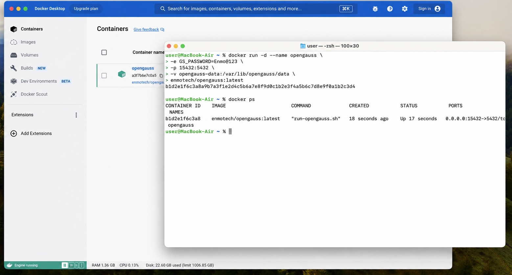

2. 使用 DBeaver 连接 openGauss 数据库

打开 DBeaver，选择新建数据库连接。由于 openGauss 与 PostgreSQL 协议兼容性较高，可以选择 PostgreSQL 类型进行连接。连接参数设置如下：

| 项目   | 内容          |
| ------ | ------------- |
| 主机   | localhost     |
| 端口   | 15432         |
| 数据库 | postgres      |
| 用户名 | gaussdb       |
| 密码   | OpenGauss@123 |

填写完成后，点击“测试连接”。如果提示连接成功，说明 DBeaver 已经成功连接到 macOS 中运行的 openGauss 数据库。

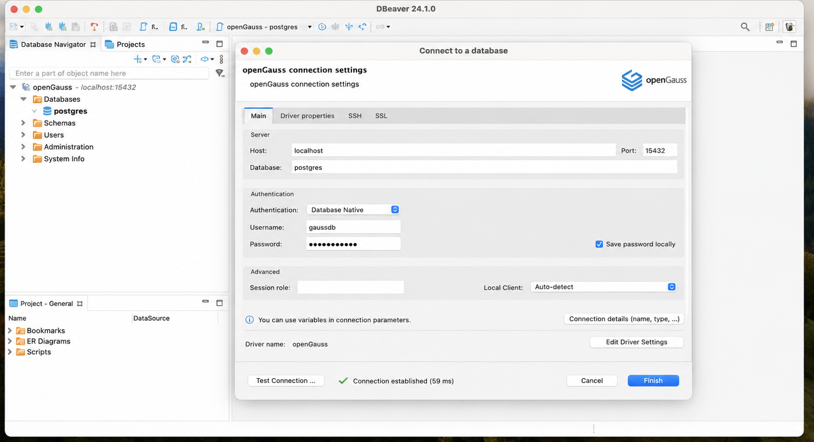

3. 创建 EDUC 数据库

连接成功后，在 SQL 编辑器中创建本次实验使用的 EDUC 数据库。

```sql
CREATE DATABASE educ;
```

然后重新连接或切换到 `educ` 数据库，作为后续实验操作的当前数据库。

4. 创建教学管理系统基本表

在 EDUC 数据库中创建实验所需的基本表。本实验创建系表、专业表、教师表、学生表、课程表和学生选课表。由于 openGauss 中不使用 SQL Server 的 `GO` 语句，因此所有 SQL 语句直接逐条执行。

```sql
CREATE TABLE dept (
    dept_id CHAR(4) PRIMARY KEY,
    dept_name VARCHAR(20) NOT NULL,
    dept_director VARCHAR(20),
    phone VARCHAR(20),
    address VARCHAR(40)
);

CREATE TABLE major (
    major_id CHAR(2) PRIMARY KEY,
    major_name VARCHAR(40) NOT NULL,
    dept_id CHAR(4),
    FOREIGN KEY (dept_id) REFERENCES dept(dept_id)
);

CREATE TABLE teacher (
    teacher_id CHAR(10) PRIMARY KEY,
    teacher_name VARCHAR(20) NOT NULL,
    dept_id CHAR(4),
    phone VARCHAR(20),
    email VARCHAR(40),
    FOREIGN KEY (dept_id) REFERENCES dept(dept_id)
);

CREATE TABLE student (
    sno CHAR(10) PRIMARY KEY,
    sname VARCHAR(20) NOT NULL,
    ssex CHAR(2),
    sage INT,
    major_id CHAR(2),
    FOREIGN KEY (major_id) REFERENCES major(major_id)
);

CREATE TABLE course (
    cno CHAR(4) PRIMARY KEY,
    cname VARCHAR(40) NOT NULL,
    cpno CHAR(4),
    credit INT,
    select_count INT DEFAULT 0
);

CREATE TABLE sc (
    sno CHAR(10),
    cno CHAR(4),
    grade INT,
    PRIMARY KEY (sno, cno),
    FOREIGN KEY (sno) REFERENCES student(sno),
    FOREIGN KEY (cno) REFERENCES course(cno)
);
```

执行完成后，在 DBeaver 左侧数据库对象列表中刷新，可以看到相关表已经创建成功。

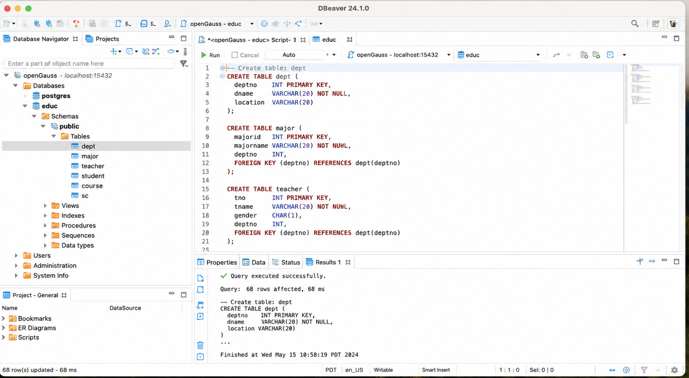

5. 完成数据插入、修改和删除操作

首先向各个基本表插入实验数据。插入数据时需要注意表之间的参照完整性，应该先插入系表，再插入专业表、教师表、学生表、课程表，最后插入学生选课表。

```sql
INSERT INTO dept VALUES
('D001', '计算机系', '王主任', '05510001', '信息楼101'),
('D002', '数学系', '李主任', '05510002', '教学楼201'),
('D003', '电子系', '赵主任', '05510003', '实验楼301'),
('D004', '管理系', '钱主任', '05510004', '文科楼401');

INSERT INTO major VALUES
('01', '软件工程', 'D001'),
('02', '计算机科学与技术', 'D001'),
('03', '网络工程', 'D001'),
('04', '信息安全', 'D001'),
('05', '数学与应用数学', 'D002'),
('06', '电子信息工程', 'D003'),
('07', '通信工程', 'D003'),
('08', '工商管理', 'D004');
```

然后对学生表、课程表和选课表继续插入数据。插入完成后，可以执行查询语句检查数据是否正确。

```sql
SELECT * FROM dept;
SELECT * FROM major;
SELECT * FROM student;
SELECT * FROM course;
SELECT * FROM sc;
```

接着进行数据修改操作。例如，将某位学生的专业号修改为存在的专业号时，操作可以成功执行。

```sql
UPDATE student
SET major_id = '03'
WHERE sno = '20180001';
```

如果将学生的专业号修改为不存在的专业号，则会违反外键约束，openGauss 会拒绝该操作。

```sql
UPDATE student
SET major_id = '99'
WHERE sno = '20180001';
```

然后修改某门课程的成绩，并将 50 到 59 分之间的成绩整体增加 10 分。

```sql
UPDATE sc
SET grade = 85
WHERE sno = '20180001' AND cno = 'C101';

UPDATE sc
SET grade = grade + 10
WHERE grade BETWEEN 50 AND 59;
```

最后插入一个专业号为空的学生，再删除所有未设定专业号的学生。

```sql
INSERT INTO student VALUES
('20189999', '临时学生', '男', 20, NULL);

DELETE FROM student
WHERE major_id IS NULL;
```

6. 完成数据查询与聚集函数查询

在 openGauss 中执行单表查询、多表查询、嵌套查询和聚集函数查询。首先查询全体学生信息。

```sql
SELECT * FROM student;
```

查询计算机系全体学生的学号、姓名和专业名称。

```sql
SELECT s.sno, s.sname, m.major_name
FROM student s
JOIN major m ON s.major_id = m.major_id
JOIN dept d ON m.dept_id = d.dept_id
WHERE d.dept_name = '计算机系';
```

查询每门课程的课程号、选课人数、平均成绩、最高分和最低分。

```sql
SELECT cno,
       COUNT(*) AS 选课人数,
       AVG(grade) AS 平均成绩,
       MAX(grade) AS 最高分,
       MIN(grade) AS 最低分
FROM sc
GROUP BY cno;
```

查询选修课程超过 2 门的学生学号和姓名。

```sql
SELECT s.sno, s.sname
FROM student s
JOIN sc ON s.sno = sc.sno
GROUP BY s.sno, s.sname
HAVING COUNT(sc.cno) > 2;
```

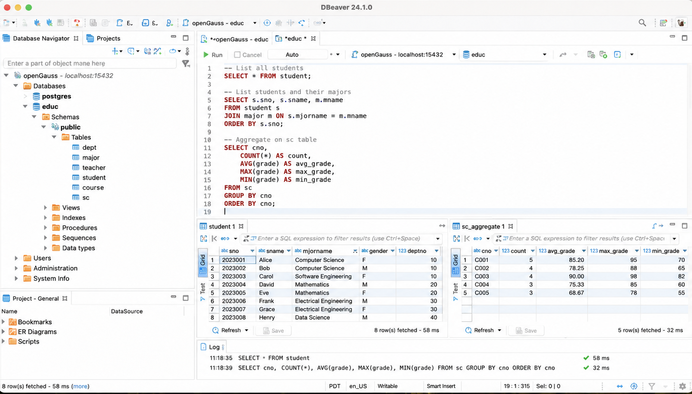

7. 创建并使用视图

根据实验要求，在 openGauss 中创建学生选课成绩视图、学生出生年份视图、学生平均成绩视图和课程平均成绩视图。

```sql
CREATE VIEW v_sc_g AS
SELECT s.sno, s.sname, c.cno, c.cname, sc.grade
FROM student s
JOIN sc ON s.sno = sc.sno
JOIN course c ON sc.cno = c.cno;
```

```sql
CREATE VIEW v_avg_s_g AS
SELECT s.sno, s.sname,
       COUNT(sc.cno) AS course_count,
       AVG(sc.grade) AS avg_grade
FROM student s
JOIN sc ON s.sno = sc.sno
GROUP BY s.sno, s.sname;
```

创建完成后，查询视图结果。

```sql
SELECT * FROM v_sc_g;
SELECT * FROM v_avg_s_g;
```

通过视图查询平均成绩达到 90 分及以上的学生。

```sql
SELECT *
FROM v_avg_s_g
WHERE avg_grade >= 90;
```

8. 创建、测试并删除触发器

在 openGauss 中创建触发器时，需要先创建触发器函数，再创建触发器。下面创建一个在选课表插入记录后自动更新课程表选课人数的触发器。

```sql
CREATE OR REPLACE FUNCTION fn_sc_insert()
RETURNS trigger AS $$
BEGIN
    UPDATE course
    SET select_count = select_count + 1
    WHERE cno = NEW.cno;
    RETURN NEW;
END;
$$ LANGUAGE plpgsql;
```

```sql
CREATE TRIGGER tr_sc_insert
AFTER INSERT ON sc
FOR EACH ROW
EXECUTE PROCEDURE fn_sc_insert();
```

插入一条新的选课记录，观察课程表中对应课程的选课人数是否发生变化。

```sql
INSERT INTO sc VALUES ('20180001', 'C102', 88);

SELECT cno, cname, select_count
FROM course
WHERE cno = 'C102';
```

实验完成后，删除触发器和触发器函数。

```sql
DROP TRIGGER tr_sc_insert ON sc;
DROP FUNCTION fn_sc_insert();
```

9. 创建、调用并删除存储过程

在 openGauss 中创建无参数存储过程，用于查询学生表中的所有学生信息。

```sql
CREATE OR REPLACE PROCEDURE proc_query_all_students()
AS
BEGIN
    SELECT * FROM student;
END;
/
```

创建带输入参数的存储过程，根据学号查询学生信息。

```sql
CREATE OR REPLACE PROCEDURE proc_query_student_by_sno(IN p_sno CHAR(10))
AS
BEGIN
    SELECT sno, sname, ssex, sage
    FROM student
    WHERE sno = p_sno;
END;
/
```

调用存储过程。

```sql
CALL proc_query_all_students();

CALL proc_query_student_by_sno('20180001');
```

实验完成后删除存储过程。

```sql
DROP PROCEDURE proc_query_all_students();

DROP PROCEDURE proc_query_student_by_sno(CHAR);
```

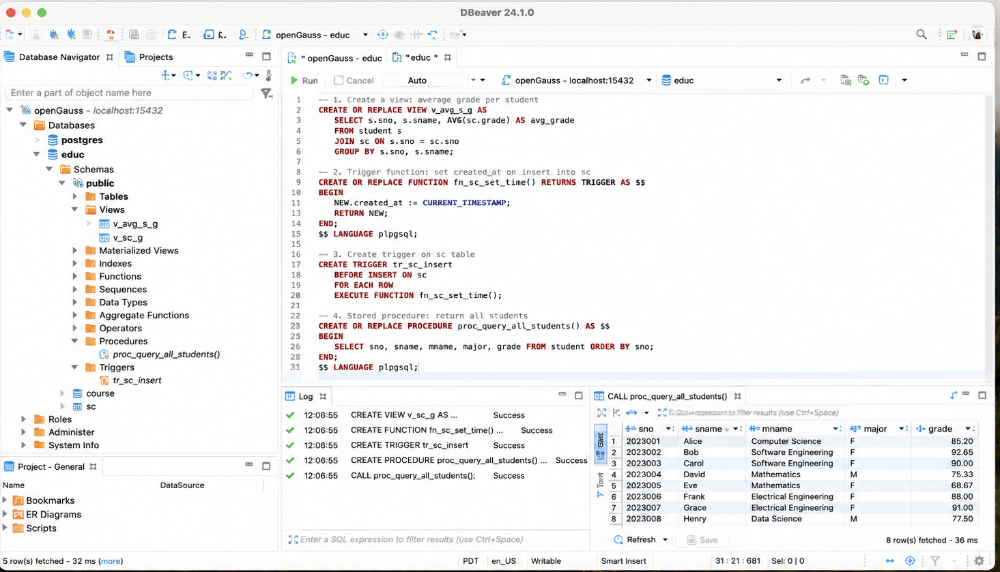

## 五、实验小结

通过本次实验，我在 macOS 系统上完成了 openGauss 数据库的部署、连接和基本操作。由于 macOS 无法直接使用 SQL Server Management Studio，本实验采用 Docker 部署 openGauss，并使用 DBeaver 作为图形化数据库管理工具，完成了 EDUC 数据库的创建和实验六至实验十一的主要内容。

在实验过程中，我进一步熟悉了 openGauss 数据库中表、约束、视图、触发器和存储过程的创建方法。通过数据插入、修改和删除操作，验证了实体完整性和参照完整性的作用；通过 SELECT 查询和聚集函数查询，加深了对单表查询、多表连接查询、分组统计查询的理解；通过视图实验，认识到视图可以简化复杂查询；通过触发器和存储过程实验，理解了数据库在自动维护数据和封装业务逻辑方面的能力。

同时，本实验也让我认识到 openGauss 与 SQL Server 在语法上的差异。例如，openGauss 中不使用 `GO` 分隔语句，触发器需要先定义触发器函数，存储过程的创建和调用方式也与 SQL Server 有所不同。因此，在不同数据库系统之间迁移 SQL 语句时，不能简单复制，需要根据具体数据库的语法规则进行调整。

总体来说，本次实验完成了在 macOS 系统下使用 openGauss 重复数据库综合实验的要求，提高了我在非 Windows 环境下进行数据库实验的能力，也增强了我对不同数据库系统之间差异的理解。

# 实验总结

回头看看这份长长的实验报告，从最初面对空白的 SQL Server Management Studio 不知所措，连建个库都能因为路径问题卡半天，到现在能够熟练地设计表结构、写出嵌套多层的查询语句，甚至理解了视图、触发器和存储过程的底层逻辑，这个过程虽然充满了各种“红字报错”的折磨，但也实实在在地让我积累了极大的成就感。

这次实验课不仅是一堆 SQL 命令的学习，更像是一次对“数据思维”的重塑。理论课上那些稍微干瘪的名词（如实体完整性、参照完整性、三大范式等），在一次次的 `INSERT` 报错和 `FOREIGN KEY` 约束中变得生动且具体。我切身认识到，数据库绝不是一个单纯的“大号 Excel”，它是一个严密、精巧且容错率极低的系统架构。任何前期表结构设计的草率，都会在后期的数据查询和业务维护时让人吃尽苦头。

除此之外，在 macOS 环境下为了完成实验而跨平台部署 openGauss、配置 Docker，甚至寻找 SQLite 替代方案的这些“折腾”，反而因祸得福。它逼迫我跳出了单一工具的舒适圈，让我亲身体会到了不同关系型数据库管理系统在底层机制上的异同，这极大地锻炼了我排查报错和解决实际环境问题的实战能力。

一学期的数据库实验就此画上句号，但对于数据世界的探索才刚刚启航。未来不管是做软件后端的开发，还是投身大数据分析，现在一行行手敲出来的 SQL 基础，都会成为我往上走的坚实基石。
