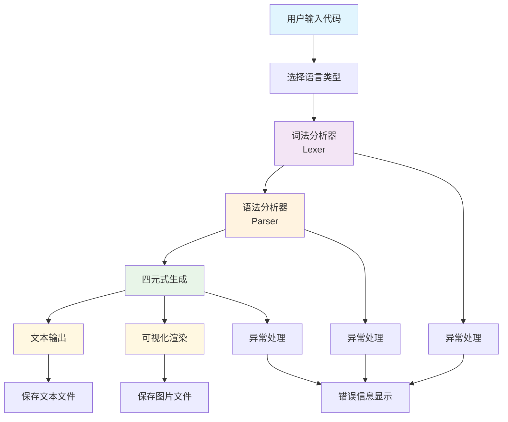
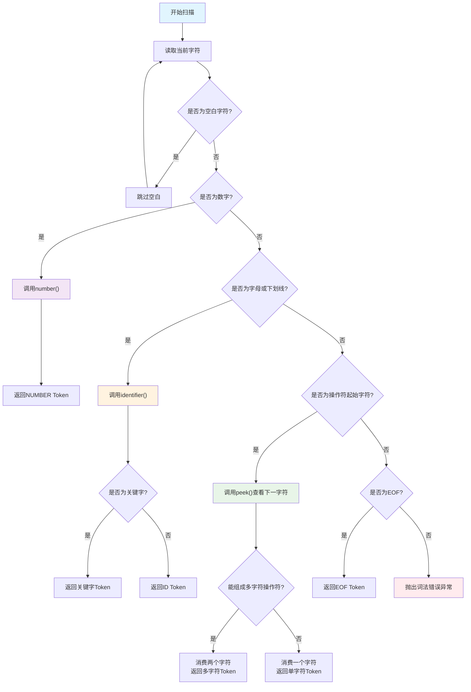
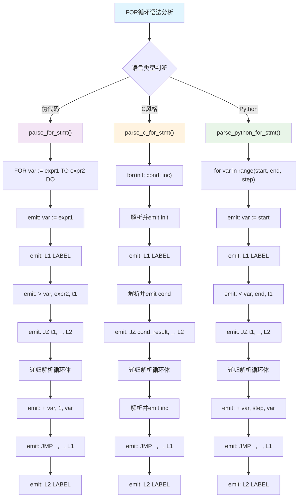
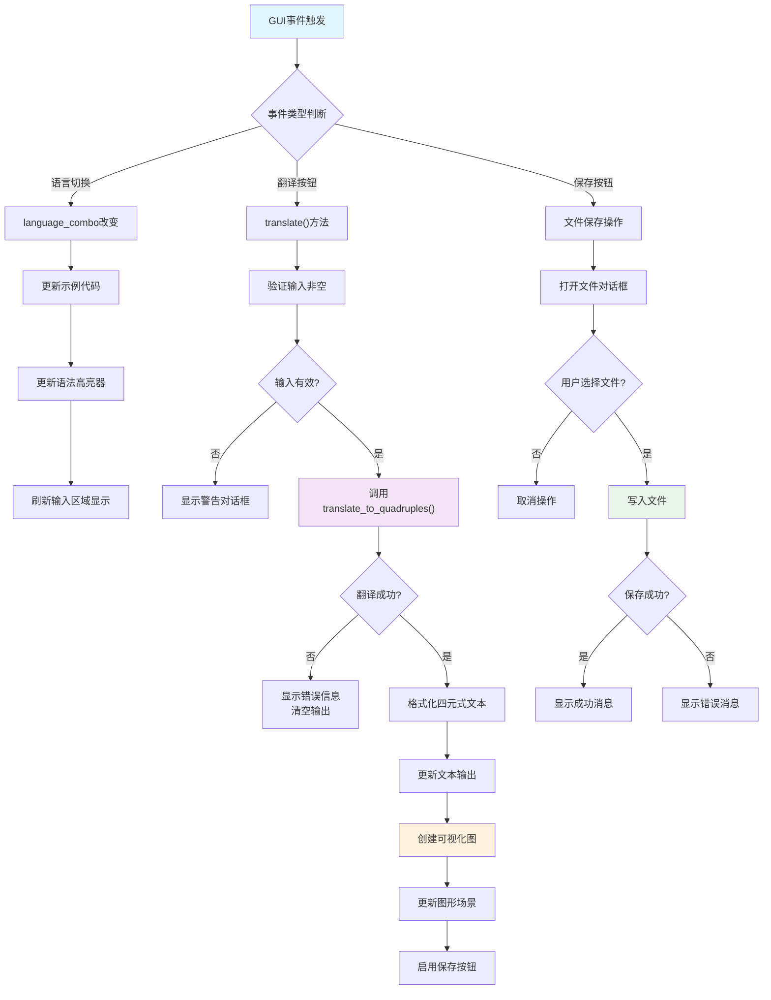

编译原理课程设计报告


# 1. 设计目的及设计要求

## 1.1 设计目的
将FOR语句转换成四元式的程序实现

## 1.2 设计要求
设计一个语法制导翻译器，将FOR语句翻译成四元式。要求：先确定一个定义FOR语句的文法，为其设计一个语法分析程序，为每条产生式配备一个语义子程序，按照一遍扫描的语法制导翻译方法，实现翻译程序。对用户输入的任意一个正确的 FOR 语句，程序将其转换成四元式输出(可按一定格式输出到指定文件中)。

# 2. 开发环境描述

本项目开发环境：VSCode + Python 3.x + PyQt5

# 3. 设计内容、主要算法描述

## 3.1 设计内容描述

本次实验旨在设计并实现一个能够将特定高级语言中的 FOR 循环语句翻译成中间代码（四元式）的翻译器。该翻译器需要支持三种不同风格的 FOR 循环语法：

### 3.1.1 支持的语言风格
1. 伪代码风格: `FOR <var> := <start_expr> TO <end_expr> DO <statement_list> ENDFOR`
2. C语言风格: `for (<init>; <condition>; <increment>) { <statement_list> }`
3. Python风格: `for <var> in range(<start_expr>, <end_expr>, [<step_expr>]): <statement_list>`

### 3.1.2 系统功能需求
1. 提供图形用户界面（GUI）以方便用户输入源代码、选择语言风格并查看结果
2. 对用户输入的源代码进行词法分析和语法分析
3. 根据选定的语言风格，将 FOR 循环结构及其内部的语句（目前主要支持赋值语句和嵌套 FOR 循环）翻译成一系列四元式
4. 在 GUI 中以文本形式展示生成的四元式列表
5. 在 GUI 中以图形化方式展示四元式的控制流图，使逻辑关系更清晰
6. 提供将文本四元式和可视化图形保存到文件的功能
7. 提供语法高亮功能，提高代码可读性
8. 提供加载示例代码的功能

## 3.2 主要算法描述

整个系统由两部分组成：图形用户界面（main_ui.py）和核心翻译逻辑（translator.py）。

### 3.2.1 核心翻译逻辑 (translator.py)

核心翻译逻辑采用经典的编译器前端处理流程：词法分析 → 语法分析 → 中间代码生成。

#### 3.2.1.1 词法分析 (Lexer)

##### 3.2.1.1.1 设计目标与架构
词法分析器负责将源代码字符串分解成词法单元（Token）序列，支持三种语言风格的动态切换。核心挑战在于准确识别多字符操作符并处理不同语言的大小写敏感性。

##### 3.2.1.1.2 核心数据结构设计
- **Token类**：封装词法单元的类型（type）和值（value）
- **TokenType枚举**：定义50+种词法单元类型，包括三种语言的所有关键字和操作符
- **Lexer类状态维护**：
  - text: 经过预处理的源代码字符串
  - pos: 当前扫描位置指针
  - current_char: 当前字符，None表示EOF
  - keywords: 根据language_type动态初始化的关键字映射表

##### 3.2.1.1.3 文本预处理算法
根据语言特性进行智能预处理：
- **伪代码**：`' '.join(text.split())`完全规范化空白
- **C风格**：`re.sub(r'\s+', ' ', text)`保留结构性空格
- **Python风格**：保持原始缩进，因为缩进在Python中具有语法意义

##### 3.2.1.1.4 多字符操作符识别算法（核心创新）
采用基于peek()的前瞻识别机制解决操作符歧义：
```python
# 核心算法伪代码
if current_char == ':':
    if peek() == '=':  # 检测 :=
        advance(); advance()  # 消费两个字符
        return Token(ASSIGN, ':=')
    else:
        advance()  # 只消费一个字符
        return Token(COLON, ':')
```

支持的多字符操作符：`:=`, `++`, `--`, `<=`, `>=`, `==`, `!=`, `+=`, `-=`, `*=`, `/=`

关键技术点：
- peek()方法：安全前瞻查看，不移动pos指针，包含边界检查
- 优先匹配：长操作符优先于短操作符，避免误识别
- 状态保护：操作符识别失败时不影响扫描器状态

##### 3.2.1.1.5 标识符与关键字识别算法
动态关键字识别机制支持多语言大小写处理：
```python
# 标识符构建算法
while current_char.isalnum() or current_char == '_':
    result += current_char
    advance()

# 语言相关的关键字查找
if language_type == PSEUDO:
    token = keywords.get(result.upper())  # 大小写不敏感
else:
    token = keywords.get(result)  # C和Python大小写敏感
```

##### 3.2.1.1.6 数字识别与状态控制
- number()方法：连续读取数字字符，自动类型转换
- skip_whitespace()方法：智能跳过空白，保留语义相关换行
- advance()方法：安全指针移动，内置EOF边界检查
- get_next_token()主循环：字符分类分派机制

#### 3.2.1.2 语法分析与四元式生成 (Parser)

##### 3.2.1.2.1 设计架构与核心挑战
Parser类采用递归下降语法分析，同时集成四元式生成。主要挑战包括：处理三种不同的FOR循环语法、表达式优先级处理、循环控制流的四元式转换。

##### 3.2.1.2.2 四元式数据结构设计
Quadruple类采用`__slots__`优化内存，包含四个字段：
- op: 操作符（赋值、算术、跳转、标签等）
- arg1, arg2: 操作数（变量名、常量、临时变量）
- result: 结果存储位置（变量名、临时变量、标签名）

##### 3.2.1.2.3 临时变量与标签管理
- new_temp(): 生成唯一临时变量（t1, t2, ...）
- new_label(): 生成唯一标签（L1, L2, ...）
- emit(): 四元式生成与存储

##### 3.2.1.2.4 递归下降解析核心算法
```
表达式解析层次结构：
parse_expr()    → 处理加减运算（左结合）
    ↓
parse_term()    → 处理乘除运算（左结合）
    ↓
parse_factor()  → 处理基本因子（数字、变量、括号、一元运算）
```

##### 3.2.1.2.5 FOR循环语义转换算法
三种FOR循环统一转换为标签-跳转四元式序列：
```
通用FOR循环四元式模式：
1. 初始化：var := start_value
2. L1: 条件检查标签
3. 条件计算：op var, end_value, temp
4. 条件跳转：JZ temp, _, L2
5. 循环体四元式序列
6. 增量更新：+ var, step, var
7. 无条件跳转：JMP _, _, L1
8. L2: 循环结束标签
```

##### 3.2.1.2.6 错误恢复与异常处理
- eat()方法：Token匹配检查，失败时抛出详细错误信息
- 语法错误定位：提供当前Token和期望Token信息
- 解析状态保护：确保错误不会导致解析器状态混乱

### 3.2.2 错误处理机制

系统实现了多层次的错误处理机制，确保用户友好的错误反馈和系统稳定性。

#### 3.2.2.1 词法层错误处理
- 非法字符检测：识别不属于任何Token类型的字符
- 位置信息提供：`"Lexer error: Invalid character 'X' at position Y"`
- 边界保护：防止pos指针越界和current_char访问错误

#### 3.2.2.2 语法层错误处理
- Token不匹配检测：eat()方法中的类型检查
- 期望vs实际对比：`"Expected token FOR, but got ID"`
- 递归解析保护：防止无限递归和栈溢出

#### 3.2.2.3 GUI层错误处理
- 输入验证：检查用户输入是否为空
- 异常捕获：使用try-catch包装翻译过程
- 用户反馈：通过QMessageBox和状态栏显示错误信息
- 状态清理：错误时清空输出并禁用保存按钮

#### 3.2.2.4 文件操作错误处理
- 保存失败检测：文件写入权限和路径有效性检查
- 编码处理：使用UTF-8编码确保中文字符正确保存
- 资源清理：确保文件句柄正确关闭

### 3.2.3 GUI实现原理与事件驱动机制

基于PyQt5的图形用户界面采用事件驱动架构，实现了复杂的用户交互和状态管理。

#### 3.2.3.1 组件层次架构设计
```
TranslatorApp (QMainWindow)
├── 标题区域 (QLabel)
├── 配置组 (QGroupBox)
│   ├── 语言选择 (QComboBox)
│   └── 示例选择 (QComboBox)
├── 输入输出分割器 (QSplitter)
│   ├── 输入区域 (QTextEdit + ForLoopHighlighter)
│   └── 输出选项卡 (QTabWidget)
│       ├── 文本输出 (QTextEdit)
│       └── 可视化图 (QGraphicsView + QGraphicsScene)
└── 按钮区域 (QHBoxLayout)
```

#### 3.2.3.2 事件驱动状态管理
- 语言切换事件：update_example_code() + 语法高亮更新
- 翻译事件：translate()方法触发完整的翻译流程
- 保存事件：文件对话框 + 异常处理
- 清空事件：状态重置 + UI刷新

#### 3.2.3.3 语法高亮实现原理
ForLoopHighlighter继承QSyntaxHighlighter，实现实时语法着色：
```python
# 高亮算法核心
def highlightBlock(self, text):
    for keyword in keywords:
        # 使用正则表达式匹配关键字
        for match in re.finditer(keyword_pattern, text):
            self.setFormat(match.start(), match.end() - match.start(), 
                         self.keyword_format)
```

支持三种语言模式的动态切换：
- 关键字高亮：不同颜色区分Token类型
- 操作符高亮：视觉区分语法结构
- 数字高亮：提高代码可读性

#### 3.2.3.4 状态同步与数据流管理
- 语言类型同步：UI选择 → 高亮器 → 翻译器
- 数据传递：输入文本 → 翻译结果 → 可视化图
- 状态反馈：进度显示 → 结果状态 → 按钮启用/禁用

### 3.2.4 可视化算法与图形渲染

QuadrupleVisualizer实现了四元式的图形化展示，采用自定义绘制算法生成控制流图。

#### 3.2.4.1 几何布局算法
calculate_layout()实现垂直布局策略：
```python
# 布局算法伪代码
for i, quad in enumerate(quadruples):
    x = margin + node_width/2  # 固定x坐标
    y = margin + i * (node_height + vertical_spacing)
    nodes.append(NodeInfo(x, y, quad))
```

#### 3.2.4.2 节点绘制算法
根据四元式类型选择不同的视觉样式：
- 赋值操作：紫色圆角矩形
- 条件跳转：蓝色菱形
- 标签：绿色圆角矩形
- 算术运算：橙色圆角矩形
- 无条件跳转：灰色矩形

#### 3.2.4.3 边线绘制与控制流表示
- 顺序流：直线箭头连接相邻节点
- 跳转流：虚线曲线连接跳转源和目标
- 回边识别：检测跳转目标索引小于源索引的情况
- 曲线算法：使用QPainterPath.cubicTo()绘制平滑曲线

#### 3.2.4.4 交互功能实现
- 视图缩放：QGraphicsView的fitInView()自适应
- 鼠标交互：支持拖拽和滚轮缩放
- 动态更新：场景清空 + 重新绘制

### 3.2.5 系统集成与模块协调

整个系统通过精心设计的接口实现模块间的松耦合协作。

#### 3.2.5.1 核心接口设计
- translate_to_quadruples(): 翻译器主入口函数
- LanguageType枚举：语言类型统一标识
- 异常接口：统一的错误信息格式

#### 3.2.5.2 数据流控制
用户输入 → 词法分析 → 语法分析 → 四元式生成 → 文本显示 + 图形可视化

#### 3.2.5.3 状态管理策略
- 组件状态独立：各模块维护自身状态
- 事件驱动更新：UI事件触发状态同步
- 错误隔离：局部错误不影响整体系统稳定性

## 3.3 关键算法流程图

### 3.3.1 整体系统架构流程图



### 3.3.2 词法分析器状态转换流程图



### 3.3.3 FOR循环语法分析与四元式生成流程图



### 3.3.4 GUI事件处理流程图



# 4. 设计的输入和输出形式

## 4.1 输入形式

### 4.1.1 输入内容
符合所选语言风格（伪代码、C语言、Python）的 FOR 循环语句。可以包含简单的赋值语句 (变量 := 表达式 或 变量 = 表达式) 作为循环体内容。支持嵌套的 FOR 循环。表达式部分支持整数、变量、加减乘除运算符 (+, -, *, /) 以及括号 ()。

### 4.1.2 输入格式
用户通过图形界面的"输入 FOR 语句"文本编辑框 (QTextEdit) 输入源代码文本。同时，用户需要在"配置选项"区域通过下拉框 (QComboBox) 选择对应的"语言风格"。

## 4.2 输出形式

### 4.2.1 输出内容
1. 翻译后得到的四元式序列。每个四元式代表一个基本操作。
2. 基于四元式序列生成的可视化控制流图。

### 4.2.2 输出格式

#### 4.2.2.1 文本输出
在 GUI 的"生成的四元式"区域的"四元式输出"选项卡中显示。每一行代表一个四元式，格式通常为：
```
序号: (操作符, 参数1, 参数2, 结果)
```
其中，_ 表示该字段未使用。对于标签和跳转指令，结果字段通常是目标标签名或跳转到的指令序号。

#### 4.2.2.2 图形化输出
在 GUI 的"生成的四元式"区域的"可视化图"选项卡中显示。
1. 每个四元式表示为一个节点。节点形状和颜色根据操作符类型区分（如赋值用紫色圆角矩形，条件跳转用蓝色菱形，标签用绿色圆角矩形，算术运算用橙色圆角矩形）。
2. 节点之间用带箭头的边连接，表示控制流。
3. 顺序执行的指令之间用实线箭头连接。
4. 跳转指令（条件跳转 JZ, J>, J< 等，无条件跳转 JMP）用虚线箭头连接，指向目标标签对应的节点。回边（如循环末尾跳回循环开始）通常用不同样式或弯曲的虚线表示。

#### 4.2.2.3 文件输出
1. 用户可以点击"保存四元式"按钮，将文本输出区域的内容保存为 .txt 格式的文本文件。
2. 用户可以点击"保存可视化图"按钮，将图形化输出区域的图像保存为 .png 或 .jpg 格式的图片文件。

# 5. 程序运行（测试、模拟）的结果

（此处为运行结果截图展示区域）

# 6. 总结（体会）

## 6.1 调试过程中遇到的问题及解决措施

### 6.1.1 词法分析错误 - 操作符识别混乱
**现象**：初期词法分析器对于多字符操作符（如 :=, <=, ++）与单字符操作符（: , <, +）容易混淆。例如，输入 i := 1 时，可能先识别出 :，然后报错。

**措施**：在 Lexer 的 get_next_token 方法中，对于可能构成多字符操作符的起始字符（如 :、<、>、+、- 等），使用 peek() 方法向前查看下一个字符。如果下一个字符能组成合法的多字符操作符，则完整地识别并消耗它；否则，只识别当前的单字符操作符。调整了判断条件的顺序，优先匹配更长的操作符。

### 6.1.2 语法分析错误 - 循环条件跳转逻辑错误
**现象**：生成的四元式中，循环结束的条件跳转指令（如 JZ）的目标标签错误，或者判断条件的操作符用反（例如 > 误用为 <），导致循环无法正常进入、过早退出或无限循环。尤其在处理 C 风格的 for (i=1; i<10; i++) 时，条件 i<10 对应的跳转应该是当 i<10 为假（即 i >= 10）时跳出。

**措施**：仔细梳理了每种 FOR 循环风格的语义，明确了循环的进入、持续和退出条件。对于 C 风格的 < 条件，生成四元式时需要判断 < 比较结果，如果结果为假（0），则执行跳转 JZ 到循环结束标签 L2。重新检查了 emit 跳转指令时的逻辑，确保 JZ (Jump if Zero/False) 和 JMP (Unconditional Jump) 使用正确，并且目标标签 (L1, L2) 生成和使用配对正确。增加了调试打印语句，跟踪标签的生成和跳转指令的发射。

### 6.1.3 表达式解析错误 - 优先级与括号处理
**现象**：在处理循环边界或循环体内的复杂表达式（如 FOR i := a + b * 2 TO n / 2 + 5 DO ...）时，生成的算术运算四元式顺序错误，未能正确处理乘除优先于加减的规则，或未能正确处理括号内的子表达式。

**措施**：严格按照递归下降方法实现了 parse_expr（处理加减）、parse_term（处理乘除）、parse_factor（处理括号、变量、数字、一元符号）的经典结构。parse_expr 调用 parse_term，parse_term 调用 parse_factor，自然地保证了运算优先级。在 parse_factor 中，遇到左括号 ( 时，递归调用 parse_expr 来解析括号内的子表达式，遇到右括号 ) 时结束递归。为每个中间运算结果生成临时变量，确保运算顺序正确。

### 6.1.4 可视化图布局混乱与更新问题
**现象**：生成的可视化图中节点严重重叠，边线交叉混乱，难以阅读。或者在多次点击"翻译"按钮后，旧的图形没有清除，新的图形与旧的叠加在一起。视图缩放后可能无法完整显示整个图形。

**措施**：
1. **布局**：在 QuadrupleVisualizer 中实现了一个简单的垂直布局算法 (calculate_layout)，为每个节点分配固定的 x 坐标和递增的 y 坐标，并设置了合适的垂直和水平间距 (vertical_spacing, horizontal_spacing)。对于跳转边，特别是回边，使用了 cubicTo 绘制曲线，减少直线交叉。
2. **更新**：在 TranslatorApp 的 translate 方法中，每次成功翻译后，在将新的 QuadrupleVisualizer 添加到 QGraphicsScene 之前，先调用 self.graphics_scene.clear() 清空场景中所有旧的图形项。
3. **视图**：使用 self.graphics_view.fitInView(self.graphics_scene.itemsBoundingRect(), Qt.KeepAspectRatio) 在每次更新后自动调整视图缩放，使其能基本容纳整个图形。同时提供了手动缩放（Zoom In/Out）和重置视图的功能。

## 6.2 待改进之处

### 6.2.1 错误处理机制
目前的错误处理还比较简单，主要是在遇到语法错误时直接抛出异常并停止。更健壮的编译器应该能进行一定的错误恢复，尝试继续解析以发现更多错误。

### 6.2.2 可视化布局算法
可视化布局算法还比较初级（纯垂直），对于复杂的嵌套循环或包含较多跳转的逻辑，布局效果可能仍不够理想，可以引入更复杂的图布局算法（如力导向、分层布局等）。

### 6.2.3 语言支持扩展
对 Python 风格的 for ... in range(...)，目前实现假定 range 内是简单的表达式，未处理更复杂的迭代器或列表遍历。

### 6.2.4 性能优化
性能方面，对于非常大的输入代码，目前的实现可能效率不高，但对于教学和实验目的已足够。

## 6.3 学习与体会

这次编译原理课程设计让我经历了一个完整的编译器开发过程，从理论到实践的转换过程中遇到了许多预想不到的技术挑战。

### 6.3.1 理论与实践的差距体验
刚开始的时候，我以为词法分析就是简单的字符串匹配，没想到光是处理多字符操作符就让我卡了好几天。比如在处理`:=`和`:`的区分时，我最初的实现总是会先识别`:`，然后在遇到`=`时就报错了。后来研究了好久才明白需要用peek()方法向前查看，这种"前瞻"的思想在课本上看起来很简单，但真正实现时才发现需要考虑边界检查、状态保护等很多细节。

### 6.3.2 调试过程的深刻印象
最让我印象深刻的是调试C风格FOR循环的条件跳转逻辑。当时生成的四元式看起来都对，但是实际测试时循环要么进不去，要么变成了无限循环。我花了整整一个晚上才发现问题出在条件判断的逻辑反了——`i < 10`的条件应该是当结果为假时跳出循环，但我写成了当结果为真时跳出。这个错误让我深刻理解了四元式中条件跳转的语义，也体会到了编译器开发中"逻辑正确性"的重要性。

### 6.3.3 GUI开发的意外收获
原本以为GUI只是一个展示界面，没想到在实现语法高亮功能时又学到了很多。QSyntaxHighlighter的实时高亮机制让我理解了事件驱动编程的精髓，特别是在处理三种语言模式切换时，需要动态更新高亮规则，这涉及到状态管理和组件协调的问题。当看到输入的代码能够实时变色，不同的关键字用不同颜色标识时，那种成就感是无法言喻的。

### 6.3.4 可视化功能的技术挑战
四元式的图形化展示是我最费心思的部分。最开始用的简单布局算法导致节点重叠严重，跳转线相互交叉，完全看不清楚。后来我重新设计了布局算法，用垂直排列的方式，并且为跳转边使用了贝塞尔曲线来避免交叉。当看到生成的控制流图能够清晰地展示循环结构时，我真正体会到了"一图胜千言"的道理。

### 6.3.5 错误处理机制的重要性
在实际使用过程中我发现，一个没有良好错误处理的程序是不可用的。用户输入千奇百怪，任何一个异常都可能导致程序崩溃。我后来花了很多时间完善异常处理机制，从词法分析的字符错误，到语法分析的Token不匹配，再到GUI层面的用户输入验证，每一层都需要妥善处理。这让我理解了软件工程中"健壮性"设计的重要性。

### 6.3.6 对编译原理的新认识
以前学理论时觉得编译原理就是一堆抽象的概念和算法，通过这次实践我才真正明白编译器是如何将人类可读的代码转换成机器可执行的指令的。从FOR循环到四元式的转换过程，本质上就是将高级的控制结构降解为原始的跳转指令，这种"降维"的思想在很多计算机科学领域都有应用。

### 6.3.7 项目管理的经验教训
这次项目让我学会了如何分解复杂任务。一开始我想一口气把所有功能都实现，结果就是到处出错，进度缓慢。后来我改变策略，先实现基本的词法分析，再做语法分析，然后逐步添加GUI和可视化功能，这种渐进式的开发方法大大提高了效率。

### 6.3.8 技术栈的扩展
这次项目让我第一次深入使用PyQt5，从简单的窗口布局到复杂的图形绘制，从事件处理到状态管理，这些GUI编程的经验对我来说都是全新的。特别是自定义绘图功能，使用QPainter绘制节点和连线，让我对计算机图形学也有了初步的认识。

总的来说，这次课程设计不仅让我掌握了编译原理的核心概念，更重要的是培养了我系统性解决复杂问题的能力。从需求分析到架构设计，从算法实现到用户界面，从单元测试到错误处理，这是一个完整的软件开发流程。虽然过程很辛苦，经常调试到深夜，但看到最终完成的翻译器能够正确处理各种FOR循环语句并生成美观的可视化图时，那种成就感让我觉得所有的努力都是值得的。

