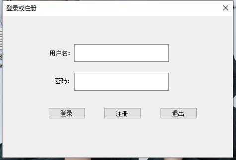

**《网络与信息安全技术》实验报告**

实验名称: <u>\_**\_加解密系统设计****\_\_\_\_******</u>

学年学期: <u>**2025**</u>\~<u>**2026\_</u>学年 第<u>**二\_</u>学期

专 业：<u>**\_**计算机科学与技术23-X班\_\_\_</u>

学 号：<u>**\_\_\_\_**2023\*\*\*\*\*\*******\_******</u>

姓 名：<u>****\_\_****\*\*\*\*********\_********</u>

指导教师：<u>**\_\_\_\_**苏兆品********\_********</u>

2026年5月30日

# **一、实验目的**

让学生熟练掌握加解密系统设计与开发：

1. 对敏感数据的加密方法，实现对文本、文件、图像、声音、视频的加、解密。

2. 了解加密算法的评价机制。

3. 学会攥写实验报告。

# **二、实验内容与要求**

基于AES、RSA、SM4、ZUC四种密码算法中的三种实现加解密系统，可以对文本、文件、图像、声音、视频进行加、解密，并分析加解密性能。

# **三、设计思路（介绍系统总体设计、模块设计、算法设计等，体现设计思想）**

**3.1 总体设计**

**3.2 模块设计**

**3.3 算法设计**

# **四、具体实现（如何用代码实现关键模块和算法，代码只需按要求贴出关键函数即可，代码执行结果需要抓图演示，每个图上必须要有学号，并给图片加上序号和标题，参考图1。）**

  
图1 登录界面

# **五、系统测试与分析（系统执行结果需要抓图演示加解密前后的对比，并对密钥空间、密钥敏感性、加密速度等指标进行测试和对比分析，每个图上必须要有学号，并给图片加上序号和标题，参考图1。）**

# **六、附加功能（如没有可不填）**

# 七、成绩评定

<table><tr><td>
序号
</td><td>
评价内容
</td><td>
权重（%）
</td><td>
得分
</td></tr><tr><td>
1
</td><td>
成果验收：代码是否有语法错误、执行结果是否正确。
</td><td>
50
</td><td></td></tr><tr><td>
2
</td><td>
实验报告的格式规范程度。
</td><td>
50
</td><td></td></tr><tr><td>
合计得分
</td><td colspan="3"></td></tr><tr><td>
教师签名
</td><td colspan="3">
苏兆品
</td></tr></table>
