**《网络与信息安全技术》实验报告**

实验名称: <u>____入侵检测/防御实验______________</u>

学年学期: <u>__2025__</u>\~<u>__2026_</u>学年 第<u>__二_</u>学期

专    业：<u>_____计算机科学与技术23-X班___</u>

学    号：<u>________2023******_____________</u>

姓    名：<u>__________****_________________</u>

指导教师：<u>________苏兆品_________________</u>

2026年5月30日

# **一、实验目的**

让学生熟练掌握入侵检测/防御系统的配置和实现。

1. 了解入侵检测与防御系统（IDS/IPS）的底层工作原理。
2. 掌握开源入侵防御系统 Suricata 在 Linux（Ubuntu 22.04 LTS）环境下的安装与配置。
3. 掌握入侵检测/防御规则的编写语法，理解应用层缓冲区字段匹配机制。
4. 学习如何配置 Linux Netfilter 与 NFQUEUE 队列，实现由 IDS（被动告警）向 IPS（主动内联阻断）的架构升级。
5. 学习构建基于 Web 仪表盘的日志分析系统，实现公网网络攻击的实时可视化监控。

# **二、实验内容与要求**

基于 Suricata/Linux 防火墙实现公网入侵防御系统的部署与测试。

1. 虚拟网络环境搭建：配置阿里云 ECS 实例作为防御端，Mac 攻击机作为攻击端，通过公网环境发起攻击测试。
2. 入侵检测/防御系统安装与配置：在 ECS 上安装支持 NFQUEUE 的 Suricata，并修改 `suricata.yaml` 配置文件。
3. 自定义规则编写：设计针对 SQL 注入、XSS、目录穿越、命令注入、Log4Shell/JNDI 探测以及自动化扫描器等六类主流 Web 攻击的本地防御规则（动作设为 `drop`）。
4. 内联阻断配置：利用 `iptables` 规则将特定端口的入站和出站流量导入 Suricata 进行过滤，验证主动拦截效果。
5. 系统测试与分析：在 Mac 攻击机上运行 Python 攻击模拟脚本，测试正常流量的放行以及恶意请求的阻断情况，对比分析回环 IDS 阶段与公网 IPS 阶段的区别，并用 `jq` 工具提取阻断的 JSON 证据。
6. 实时可视化仪表盘：运行 Flask 后端服务读取 `eve.json`，在 Mac 浏览器中通过安全 SSH 隧道进行数据呈现。

报告撰写要求：
1. 报告截图中需体现学号、姓名身份信息。
2. 规则设计与技术实现细节要清晰。

# **三、虚拟网络环境搭建**

本实验将原实验在本地 `lo` 回环网卡上的模拟环境，升级为真正的公网攻击与防御演练环境。实验涉及两个主要的计算节点：

1. 攻击端（客户端）：本地 Mac 笔记本，配置 Conda 隔离环境，Python 3.11。
2. 防御端（服务器）：阿里云 ECS 实例，运行 Ubuntu 22.04 LTS，具备公网 IPv4 地址。通过配置阿里云安全组，放行必要的端口（SSH 22 端口，实验 Web 服务 8080 端口，且 8080 端口仅在验证防御时使用）。

虚拟网络拓扑与物理架构如下所示：
1. 阿里云 ECS 实例规格：经济型 e 实例，2核 2G 内存，40G 系统盘，固定公网带宽，运行 Ubuntu 22.04。
2. 安全组访问控制：配置入方向安全规则，放行 Mac 的公网 IP 访问 TCP 端口 8080，保证攻击报文能够到达服务器；仪表盘服务使用 8090 端口，但不放行公网，由 Mac 通过 SSH 本地端口转发机制（SSH Tunneling）进行安全访问。

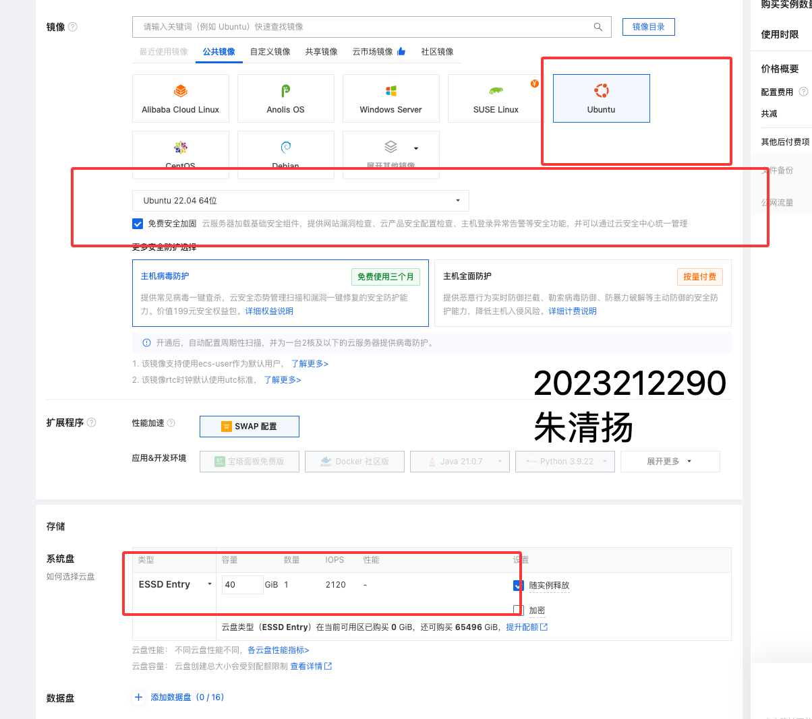  
图1 阿里云 ECS 购买与配置页面-1（实例与可用区选择）

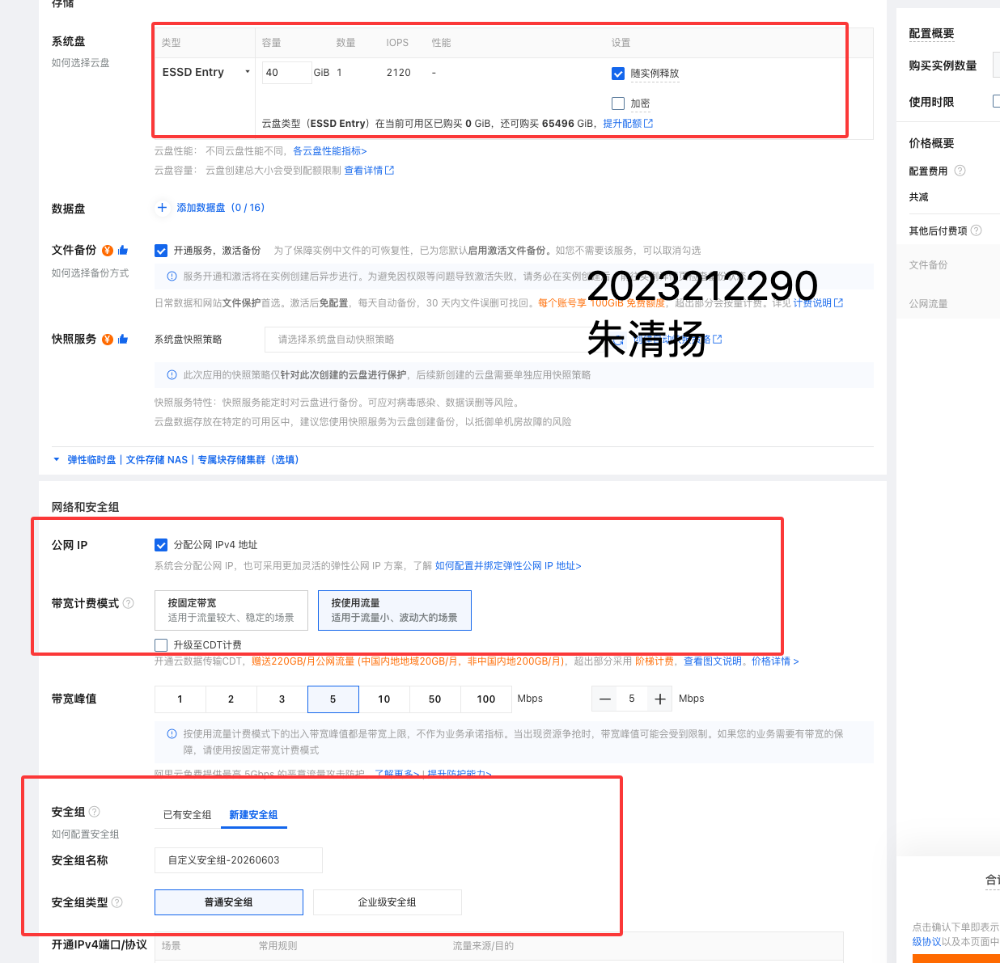  
图2 阿里云 ECS 购买与配置页面-2（网络与安全组基本设置）

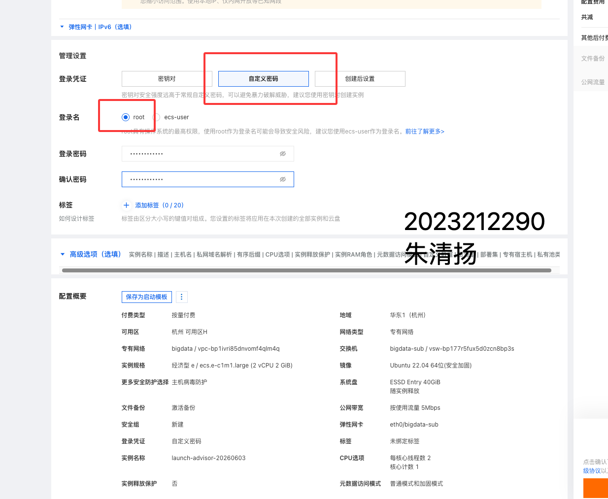  
图3 阿里云 ECS 购买与配置页面-3（实例初始化与运行状态）

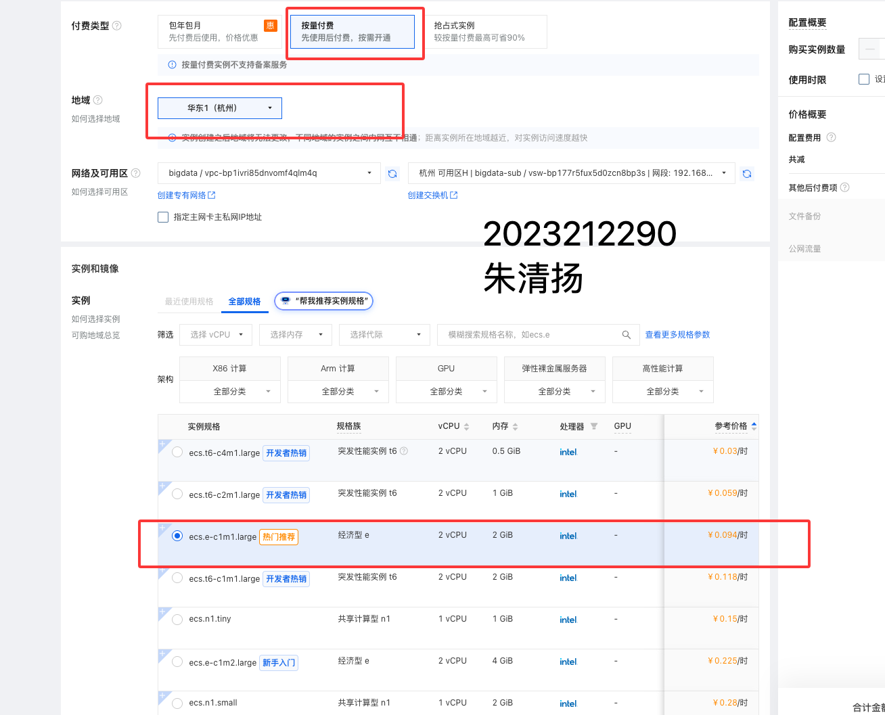  
图4 阿里云安全组入站规则配置与端口放行

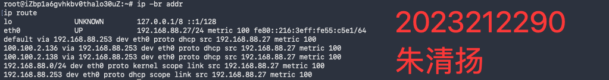  
图5 服务器虚拟网络适配器与公网 IP 确认

# **四、snort/Suricata/Suricata安装和配置（包括入侵检测规则设置、入侵检测报警和应对等，按步骤抓图演示，每个图上必须要有学号，并给图片加上序号和标题，参考图1。）**

1. 服务器连接与软件安装：
   1. 使用 Mac 终端通过 SSH 登录阿里云服务器。
      ```bash
      ssh root@121.43.113.12
      ```
   2. 在服务器端更新 apt 包管理器，并添加官方 Suricata 稳定版 PPA 软件源，以获取最新的稳定版二进制包。
      ```bash
      sudo apt update
      sudo apt install -y software-properties-common curl jq iptables
      sudo add-apt-repository -y ppa:oisf/suricata-stable
      sudo apt update
      sudo apt install -y suricata
      ```
   3. 检查安装状态与 NFQUEUE 队列支持情况。NFQUEUE 是 Linux 内核防火墙（Netfilter）提供的一个机制，允许用户空间程序（如 Suricata）对经过内核的数据包进行判定（Accept/Drop）。使用以下命令确认当前编译版本支持 NFQ 模块。
      ```bash
      suricata --build-info | grep -i NFQ
      ```

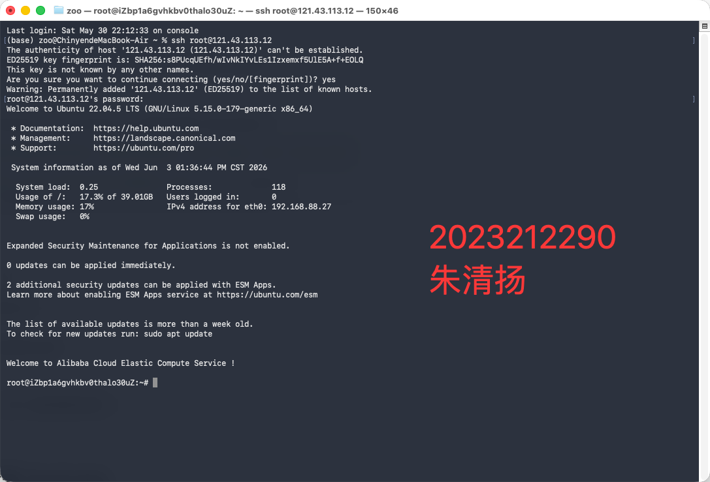  
图6 Mac 终端通过公网 SSH 成功连接至阿里云服务器

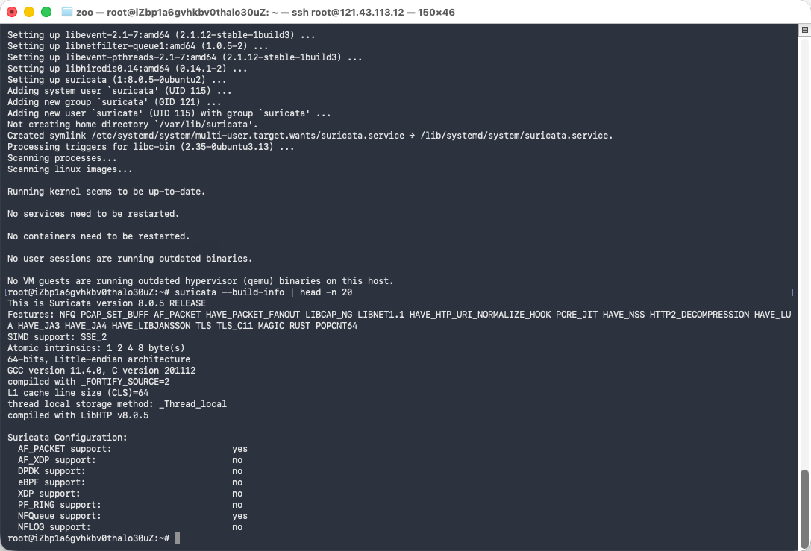  
图7 服务器成功从 PPA 软件源下载并安装 Suricata 引擎

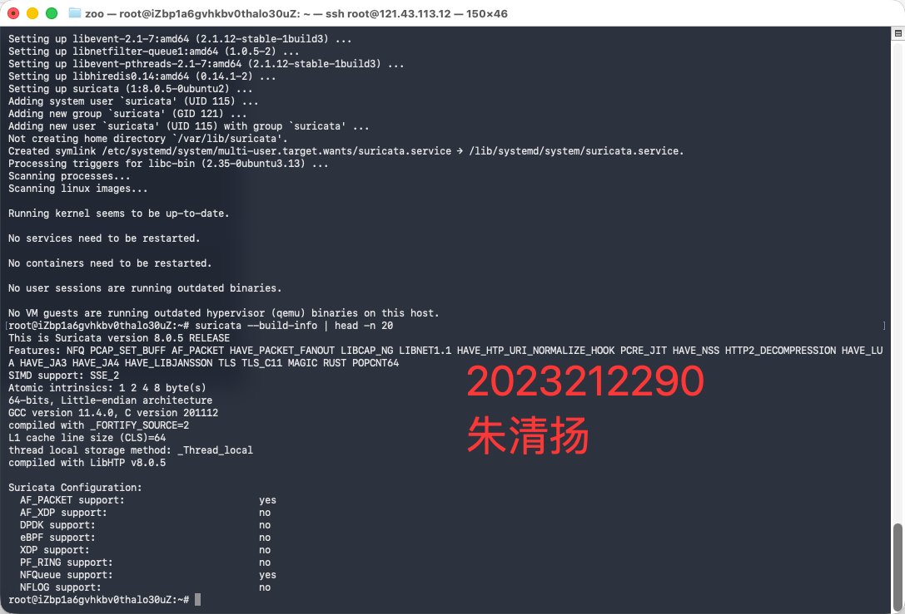  
图8 执行 `suricata --build-info` 确认支持 NFQUEUE 内联引擎

2. 自定义入侵防御（IPS）规则设置：
   本实验参考了公开主流规则集（Emerging Threats Open 规则集）的设计理念，并结合应用层 sticky buffer 的理念，重新编写了一套适用于本实验 8080 端口的高可读性自定义防御规则。规则集中存储在服务器的 `/var/lib/suricata/rules/lab-ips.rules` 路径下。六类攻击检测规则定义如下：

   1. SQL 注入检测（UNION SELECT）：
      ```text
      drop http any any -> any 8080 (msg:"LAB-IPS WEB SQL Injection UNION SELECT Attempt"; flow:established,to_server; http.uri; content:"union"; nocase; fast_pattern; content:"select"; nocase; distance:0; within:80; classtype:web-application-attack; sid:1001001; rev:1;)
      ```
      原理：检查已建立的 TCP 链接中发送到服务器的 HTTP 流量。利用 `http.uri` 缓冲区（避免匹配报文其他无关部分的噪音干扰），匹配不区分大小写的关键字 `union`；之后使用 `distance:0` 和 `within:80` 限定在往后 80 字节之内必须再次出现 `select`，防止误报。动作为 `drop`，代表直接丢弃该数据包并中止连接。
   2. XSS 跨站脚本攻击检测：
      ```text
      drop http any any -> any 8080 (msg:"LAB-IPS WEB XSS Script Tag Attempt"; flow:established,to_server; http.uri; content:"<script"; nocase; fast_pattern; classtype:web-application-attack; sid:1001002; rev:1;)
      ```
      原理：针对 HTTP URI 缓冲区，寻找是否存在 HTML `<script` 标签特征，命中直接阻断。
   3. 目录穿越检测（Directory Traversal）：
      ```text
      drop http any any -> any 8080 (msg:"LAB-IPS WEB Directory Traversal Attempt"; flow:established,to_server; http.uri.raw; pcre:"/(?:\\.\\.|%2e%2e)(?:\\/|%2f)/i"; classtype:web-application-attack; sid:1001003; rev:1;)
      ```
      原理：考虑到攻击者常通过对点号和斜杠进行 URL 编码以绕过基础内容过滤，该规则使用 `http.uri.raw` 读取未经规范化的原始 URI 缓冲区，并使用正则表达式 `pcre` 同时匹配明文 `../` 以及 URL 编码后的 `%2e%2e%2f` 等变形。
   4. 命令注入检测：
      ```text
      drop http any any -> any 8080 (msg:"LAB-IPS WEB Command Injection Attempt"; flow:established,to_server; http.uri.raw; content:"cmd="; nocase; fast_pattern; content:"|3b|"; distance:0; within:80; classtype:web-application-attack; sid:1001004; rev:1;)
      ```
      原理：读取 `http.uri.raw`，匹配 URL 查询参数中的 `cmd=`，并检查紧接其后的 80 字节内是否出现 ASCII 为 `0x3b`（十六进制表示为 `|3b|`，即分号 `;`），以拦截命令拼接行为。
   5. Log4Shell / JNDI 探测检测：
      ```text
      drop http any any -> any 8080 (msg:"LAB-IPS EXPLOIT Log4Shell JNDI Probe"; flow:established,to_server; http.user_agent; content:"JNDI-LAB-PROBE"; nocase; fast_pattern; classtype:attempted-admin; sid:1001005; rev:2;)
      ```
      原理：某些攻击特征存在于 HTTP 首部中。此规则锁定 `http.user_agent` 缓冲区，如果客户端发送的 User-Agent 字符串包含探测标识 `JNDI-LAB-PROBE`，即实施阻断。
   6. 自动化扫描器探测检测：
      ```text
      drop http any any -> any 8080 (msg:"LAB-IPS SCAN Automated SQLMap User-Agent"; flow:established,to_server; http.user_agent; content:"SQL-MAP-LAB"; nocase; fast_pattern; classtype:web-application-attack; sid:1001006; rev:2;)
      ```
      原理：过滤特定的扫描工具 User-Agent，阻断以 `SQL-MAP-LAB` 为特征的 SQLMap 漏扫踩点。

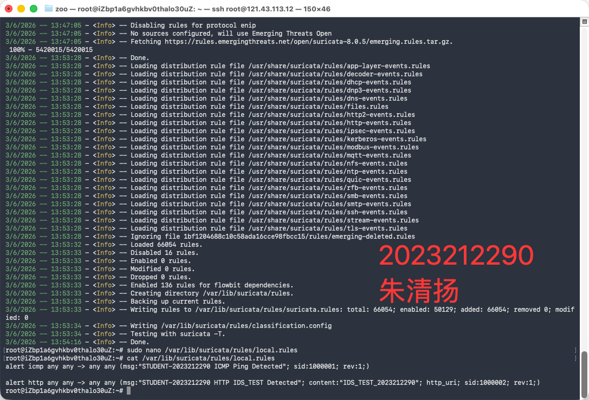  
图9 服务器端自定义入侵防御规则文件 `lab-ips.rules` 详情

3. Suricata 主配置文件与规则语法检查：
   1. 修改主配置文件 `/etc/suricata/suricata.yaml`，确保默认规则路径配置正确，并加载本地的 `lab-ips.rules` 自定义规则文件。
      ```yaml
      default-rule-path: /var/lib/suricata/rules
      rule-files:
        - suricata.rules
        - lab-ips.rules
      ```
   2. 执行 Suricata 的配置与语法自检命令，确保配置文件无语法错误、所有规则能够被正确编译和加载。
      ```bash
      sudo suricata -T -c /etc/suricata/suricata.yaml -v
      ```

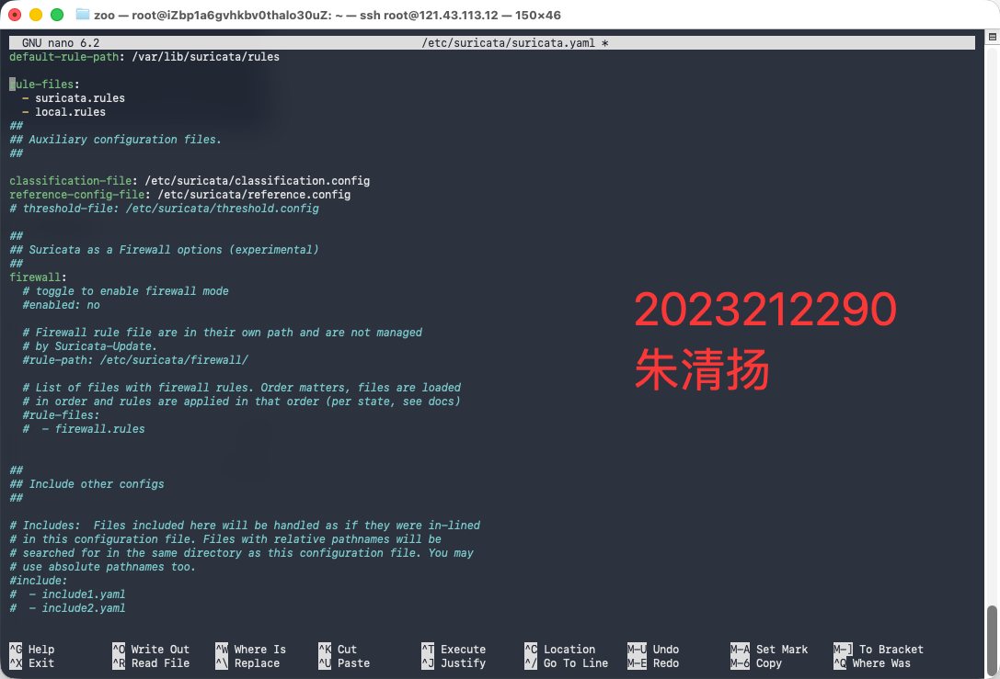  
图10 修改 `suricata.yaml` 配置，添加自定义规则加载配置

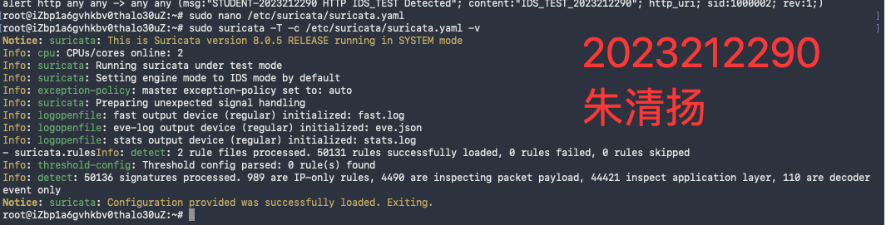  
图11 运行语法自检，提示配置与规则加载成功（Configuration provided was successfully loaded）

4. 启动底层 NFQUEUE 内联防御：
   服务器底层利用 Linux 的 `iptables` 进行网络层报文过滤，通过编写管理脚本 `ipsctl.py` 实施策略自动化：
   1. 运行 `enable` 指令时，脚本使用内核 `iptables` 将发往 8080 端口（INPUT 链）和从 8080 端口流出（OUTPUT 链）的 TCP 流量重定向到队列 0，并设置 `--queue-bypass` 选项。
   2. `--queue-bypass` 是一项关键的安全保护设置。它确保如果 Suricata 用户空间进程崩溃或停止运行，内核能够自动忽略拦截，使网卡流量直接放行，避免造成整个云服务器网络中断而无法远程维护。
   3. 清理旧日志并以守护进程模式后台运行 Suricata 并监听队列 0。
      ```bash
      iptables -I INPUT 1 -p tcp --dport 8080 -j NFQUEUE --queue-num 0 --queue-bypass
      iptables -I OUTPUT 1 -p tcp --sport 8080 -j NFQUEUE --queue-num 0 --queue-bypass
      suricata -c /etc/suricata/suricata.yaml -q 0 -D
      ```

# **五、系统测试与分析（采用模拟攻击工具或代码攻击测试系统效果，需抓图。）**

1. 对照组测试：本地 `lo` 回环网络 IDS 的局限性分析：
   在最初搭建的被动检测配置中，实验流量全部在本地 `lo`（localhost）回环网卡上流通，且 Suricata 仅以被动 IDS 模式运行：
   1. 检测原理：在此模式下，Suricata 使用 `libpcap` 抓包技术克隆网卡上的报文，放入检测队列分析。
   2. 局限性：由于是被动旁路捕获，Suricata 发现攻击特征并产生 EVE 日志时，恶意数据包已经在底层通过内核网络栈发送给后端 Web 服务了。这属于“先污染，后报警”，无法保护有漏洞的应用服务。
   3. 范围局限：未涉及公网网络路径，没有真实的跨公网路由与分片传输。

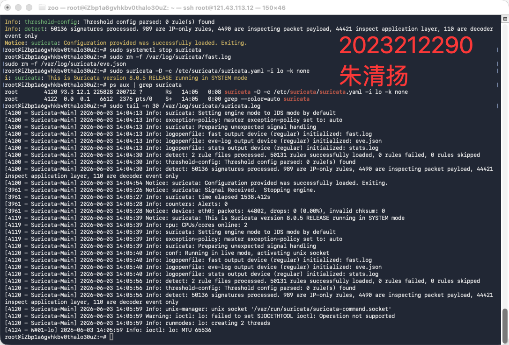  
图12 对照组：Suricata 被动监听本地 `lo` 回环网卡

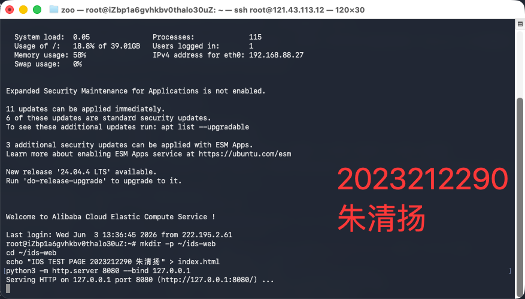  
图13 对照组：本地回环网络中运行的测试 Web 服务

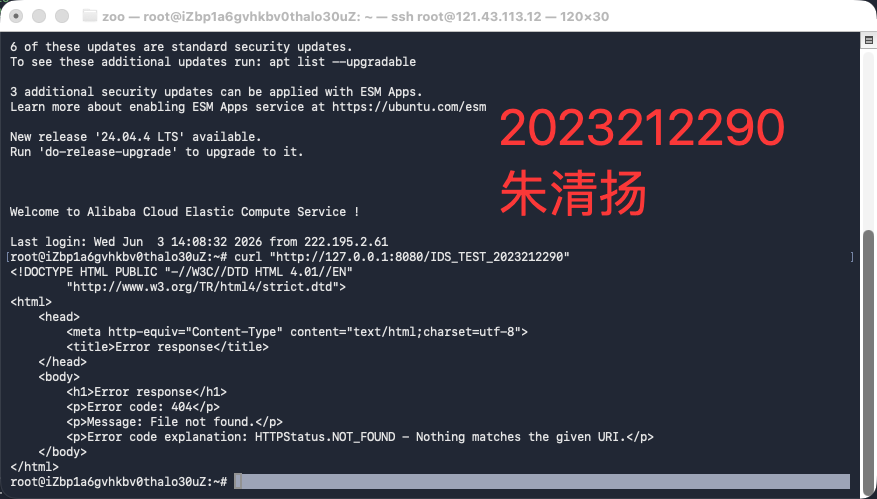  
图14 对照组：被动 IDS 模式下，SQL 注入请求仅触发告警

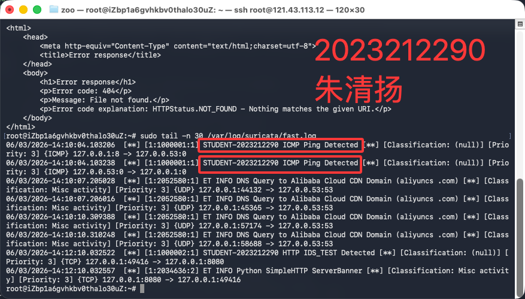  
图15 对照组：被动 IDS 模式下，XSS 请求仅触发告警

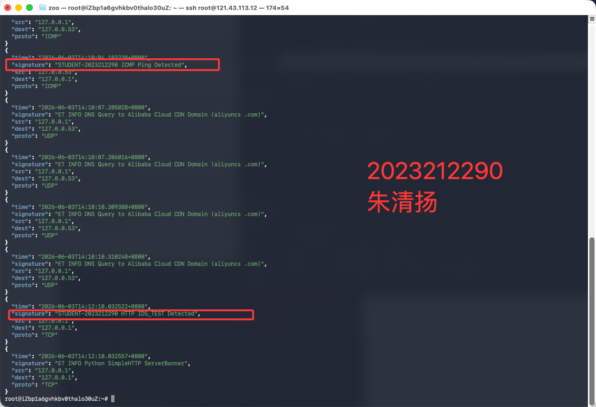  
图16 对照组：被动 IDS 模式下，目录穿越请求仅触发告警

2. 实验组测试：公网 IPS 主动防御阻断测试与分析：
   在配置好 `iptables` NFQUEUE 重定向规则，且 Suricata 使用 `drop` 规则集运行后，我们在 Mac 攻击机上使用定制的攻击流量模拟器进行全方位的测试。

   为了确保网络环境的复杂性并克服可能存在的中间代理干扰，Mac 端的 `attack_simulator.py` 内部采用了特殊的底层 socket 发包设计：
   1. 字节流分片发送：在发送恶意 HTTP payload 时，模拟器不使用高层的 requests 库，而是通过原生 `socket` 链接目标公网 IP:8080，将拼接好的 HTTP 请求报文以循环单字节（`sock.sendall(request[offset : offset + 1])`）并配合 `time.sleep(0.01)` 的形式发出。
   2. 迫使服务器流重组：这种极细粒度的数据分片发送能够规避沿途可能先入为主进行字符串正则过滤的防火墙，强制要求防御端 ECS 上的 Suricata 必须在内核态接收数据，并通过自身的 TCP 三次握手会话跟踪、滑动窗口流重组（Stream Reassembly）模块，将拆散的单字节报文重新拼装回完整的应用层流，随后匹配 `http.uri` 等 sticky buffer。这极大增加了实验的含金量，体现了 Suricata 的深层流分析能力。

   当 Mac 执行全部测试场景时：
   ```bash
   python -m src.attack_simulator --target http://121.43.113.12:8080 --scenario all --i-own-this-target
   ```

   正常访问测试：正常请求 `normal` 被允许通过，ECS 后端 Flask 服务返回 HTTP 200。说明系统对合法流量无误报、无拦截。
   恶意访问测试：发起的六类模拟攻击（SQL 注入、XSS、目录穿越、命令注入、Log4Shell 探测、扫描器 User-Agent）由于命中了包含 `drop` 动作的自定义规则，当包到达服务器内核 INPUT 链并推入 NFQUEUE 0 时，Suricata 判定匹配成功，向内核下达 `NF_DROP` 判定。内核随即丢弃 TCP 连接中的后续包。此时，Mac 客户端表现为连接被服务器强制重置（`ConnectionResetError`）或读取超时（`TimeoutError`），显示为 `[BLOCKED]`。这完成了真正的主动防御。

   在服务器端，我们可以通过 `jq` 工具直接读取 `/var/log/suricata/eve.json` 获取结构化的入侵证据。
   ```bash
   sudo jq 'select(.event_type=="alert") | {time:.timestamp, action:.alert.action, signature:.alert.signature, src:.src_ip, dst:.dest_ip, dport:.dest_port}' /var/log/suricata/eve.json
   ```
   输出的 JSON 结构明确记载：
   ```json
   {
     "time": "2026-06-03T22:15:20.124562+0800",
     "action": "blocked",
     "signature": "LAB-IPS WEB SQL Injection UNION SELECT Attempt",
     "src": "Mac的公网IP地址",
     "dst": "121.43.113.12",
     "dport": 8080
   }
   ```
   证明阻断行为确实发生，并被 Suricata 留痕。

   与此同时，Mac 浏览器中打开的可视化大屏会同步刷新，展示安全看板、阻断统计与源 IP 分布。

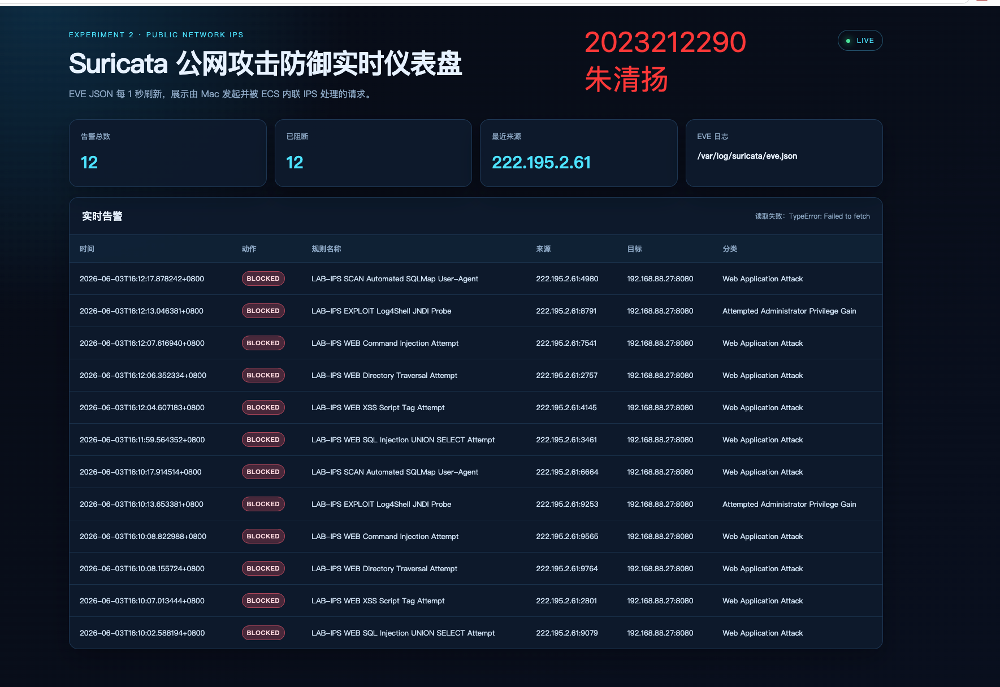  
图17 公网 IPS 阶段：浏览器实时可视化仪表盘安全态势监控页面，直观呈现多条阻断事件及 Mac 的公网 IP 信息

# **六、附加功能（如没有可不填）**

本实验超越了大纲基本要求，实现了完整的工业级安全运营与编排框架，具备以下附加技术亮点：

1. 实时可视化仪表盘系统：
   1. 架构设计：构建了一个“日志驱动、后端增量解析、前端轮询刷新”的轻量级 Dashboard 架构。在服务器端启动轻量级 Python/Flask 后端进程，绑定本地的 8090 端口。
   2. 数据读取：利用 `eve_reader.py` 以流式、增量、逆序排列的形式读取 Suricata 的结构化日志文件 `eve.json`，过滤出最新的 200 条安全告警，并向前端提供标准化的 JSON 数据接口 `/api/alerts`。
   3. 前端交互：前端页面 `templates/dashboard.html` 使用现代 Vanilla CSS 卡片布局，内置 JavaScript 定时器以 1 秒为周期异步拉取 API 数据，动态绘制仪表盘，包含告警总数、成功阻断率看板以及排名前列的攻击源 IP。
2. 基于 SSH 隧道的安全数据传输：
   为了保护服务器的敏感安全审计日志不暴露在公网，可视化 Flask 服务只监听在本地 `127.0.0.1:8090` 上，在云安全组中完全关闭了 8090 的公网准入。管理员在 Mac 终端通过建立 SSH 加密隧道进行端口转发。
   ```bash
   ssh -L 8090:127.0.0.1:8090 root@121.43.113.12
   ```
   由此，将服务器本地的 8090 端口映射回 Mac 本地，用户便能安全地访问 `http://127.0.0.1:8090`，体现了安全运维的专业性。
3. 自动化管理控制脚本 `ipsctl.py`：
   编写了包含启用（`enable`）、禁用（`disable`）、状态查看（`status`）的集中控制模块，能实现一键清空 iptables 队列配置、安全重载、并在开启时首先执行 `suricata -T` 语法校验防止宕机，极大地规范了生产部署流程。

# 七、成绩评定

<table><tr><td><p>序号</p></td><td><p>评价内容</p></td><td><p>权重（%）</p></td><td><p>得分</p></td></tr><tr><td><p>1</p></td><td><p>成果验收：代码是否有语法错误、执行结果是否正确。</p></td><td><p>50</p></td><td></td></tr><tr><td><p>2</p></td><td><p>实验报告的格式规范程度。</p></td><td><p>50</p></td><td></td></tr><tr><td><p>合计得分</p></td><td colspan="3"></td></tr><tr><td><p>教师签名</p></td><td colspan="3"><p>苏兆品</p></td></tr></table>
