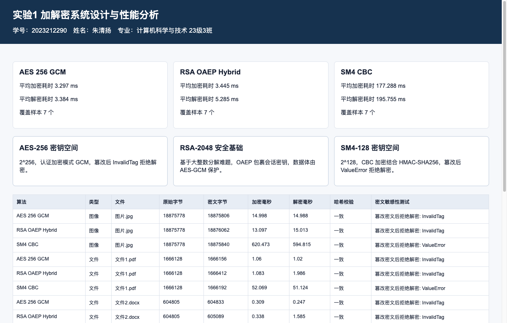
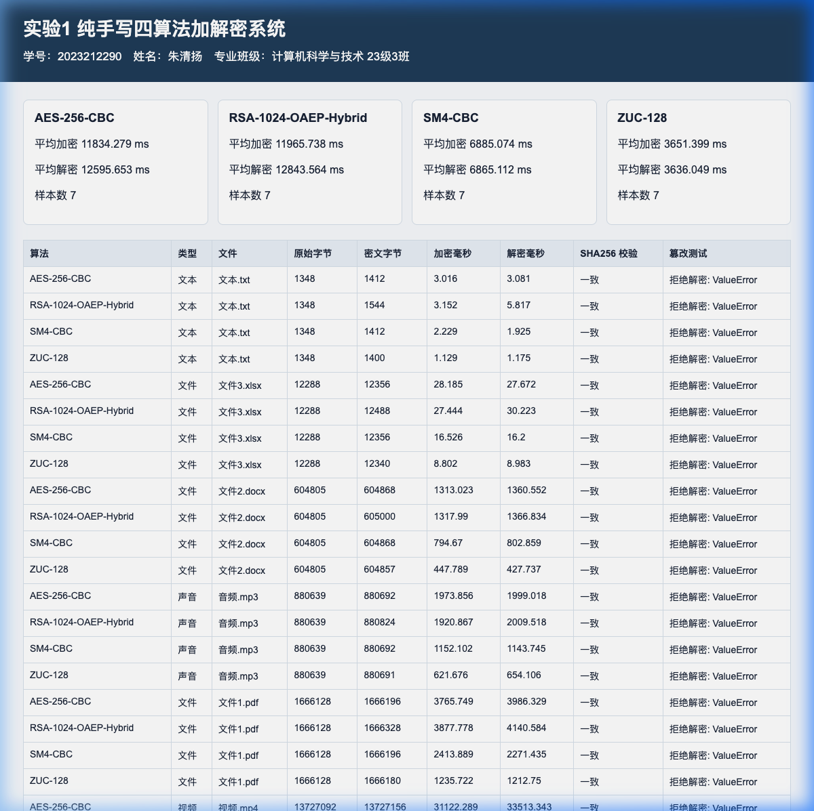
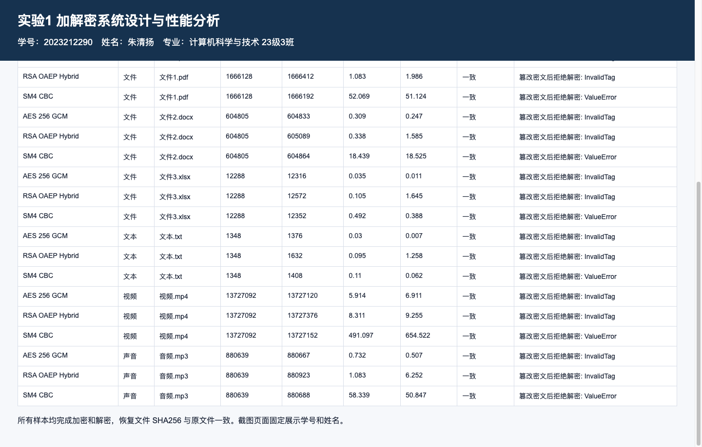

**《网络与信息安全技术》实验报告**

实验名称: <u>**加解密系统设计**</u>

学年学期: <u>**2025**</u>~<u>**2026**</u>学年 第<u>**二**</u>学期

专 业：<u>**计算机科学与技术23级3班**</u>

学 号：<u>**2023212290**</u>

姓 名：<u>**朱清扬**</u>

指导教师：<u>**苏兆品**</u>

2026年5月30日

# **一、实验目的**

让学生熟练掌握加解密系统设计与开发：

1. 对敏感数据的加密方法，实现对文本、文件、图像、声音、视频的加、解密。
2. 了解加密算法的评价机制。
3. 学会撰写实验报告。

# **二、实验内容与要求**

基于AES、RSA、SM4、ZUC四种密码算法中的三种实现加解密系统，可以对文本、文件、图像、声音、视频进行加、解密，并分析加解密性能。

为了达到最优的实验与学习效果，本实验完整实现了以下两套系统方案：
1. 调库工程版系统：使用 Python 语言，引入高级密码学库 `cryptography` 实现了 AES-256-GCM 认证加密、RSA-2048-OAEP-Hybrid 混合加密体制、国密 SM4-CBC 结合 HMAC-SHA256 加密。主要展示现代工程实践中的性能、安全标准以及对大文件、视频、音频的快速处理能力。
2. 原理手搓版系统：不调用任何第三方密码学库，仅使用 Python 标准库，纯手写实现了 AES-256-CBC、RSA-1024-OAEP-Hybrid 混合加密、国密 SM4-CBC、国密 ZUC-128 序列密码算法。涵盖了 S 盒生成、素数生成与检测、模幂、线性反馈移位寄存器等底层数学结构，用于深入理解算法原理，并与调库版进行横向性能差异分析。

# **三、设计思路（介绍系统总体设计、模块设计、算法设计等，体现设计思想）**

## 3.1 总体设计

加解密系统遵循“机密性与完整性并重”的设计思想。系统分为双版本：调库版突出高效率与现代安全标准，手写版突出算法数学原理的还原。两个版本均接收 `sample_data/` 下的多媒体样本，在内存中完成对称或混合加解密，并将密文与还原文件输出到对应的 outputs 文件夹下，同时把运行指标（加密时间、解密时间、SHA256一致性、密文敏感性）写入 JSON/CSV 报告，最终输出 HTML5 可视化仪表盘。

系统总体架构与数据流如下所示：

```text
明文多媒体样本 (文本/图像/音频/视频)
      |
      v
[ 密钥管理模块 ] ---> 自动载入/生成对应强度的对称/非对称密钥
      |
      +-----------------------------+
      |                             |
      v                             v
[ 调库加解密引擎 ]             [ 手写加解密引擎 ]
- AES-256-GCM (AEAD)          - AES-256-CBC (纯手写)
- RSA-2048-OAEP (Hybrid)      - RSA-1024-OAEP (纯手写混合)
- SM4-CBC (HMAC-EtM)          - SM4-CBC (纯手写EtM)
                              - ZUC-128 (纯手写序列密码)
      |                             |
      v                             v
[ 密文与还原数据输出 ] ---------> outputs/ 目录分类归档
      |
      v
[ 自动化评估模块 ] ---> 校验 SHA-256 一致性，执行 1-bit 密文篡改敏感性测试
      |
      v
[ 结果可视化模块 ] ---> results/ 目录生成 summary.json, summary.csv, dashboard.html
```

## 3.2 模块设计

系统包含以下四个核心功能模块：

1. 密钥生命周期管理模块：
   1. 调库版使用 `os.urandom` 和 `cryptography` 的 RSA 生成模块，自动在 `keys/` 目录下生成 AES 256位 密钥、SM4 128位 密钥、SM4 128位 向量，以及 2048位 的 PEM 格式 RSA 密钥对。
   2. 手写版基于 Python `secrets` 标准库，手写 Miller-Rabin 算法生成大素数并组合成 1024位 RSA 密钥对，其余密钥以 JSON 格式存储于本地。
2. 加解密引擎核心模块：
   1. 调库引擎：使用 `cryptography.hazmat.primitives.ciphers.aead.AESGCM` 实现 AES 认证加密；使用 `cryptography.hazmat.primitives.asymmetric.padding.OAEP` 加密对称会话密钥，再配合 `AESGCM` 完成混合加密；使用 `cryptography.hazmat.primitives.ciphers.Cipher` 执行国密 SM4 密码分组。
   2. 手写引擎：内部手写实现 Galois Field 有限域上的乘幂计算、GF(2^8) 下的 AES S盒动态生成、SM4 非线性变换与轮密钥扩展、ZUC 的 LFSR 状态转移。
3. 密文敏感性与一致性分析模块：
   1. 提取文件的 SHA-256 哈希，比对“解密还原文件哈希”与“原始明文哈希”，判断加解密是否无损。
   2. 复制密文数据并异或反转其最后一个 bit (1-bit 篡改模拟)，输入解密器中，预期解密器能够主动捕捉到完整性校验失败，抛出错误并拒绝输出任何明文。
4. 数据导出与可视化仪表盘模块：
   1. 将所有的运行指标输出为标准的 CSV 和 JSON，为数据对比提供支撑。
   2. 将数据渲染到内嵌学生身份防伪水印的单页 HTML 仪表盘中，实时展示各算法处理性能。

## 3.3 算法设计

本系统所涉及的四种核心密码算法的设计原理如下：

1. AES-256-CBC 算法设计 (手写版)：
   1. 密钥扩展：将 32 字节 (256位) 密钥扩展为 15 轮子密钥 (14轮 + 初始轮)，每轮 16 字节，总计 240 字节。手写实现 `RotWord` 循环左移与 `SubWord` 字节代换。
   2. 状态矩阵变换：包括字节代换 `SubBytes` (利用 GF(2^8) 逆元与仿射变换动态计算生成 S 盒)、行移位 `ShiftRows`、列混淆 `MixColumns` (手写 Galois 域乘法 `gf_mul`) 和轮密钥加 `AddRoundKey`。解密时调用对应的逆变换。
   3. CBC 工作模式：明文首先经过 PKCS7 填充，每一个分组加密前与前一个密文分组执行异或。使用 `secrets` 模块动态生成的 16 字节随机 IV。
2. RSA-1024-OAEP-Hybrid 混合加密设计 (手写版)：
   1. 素数生成与检测：随机生成指定位数的奇数，手写 Miller-Rabin 算法，经过 12 轮基数模幂检测，确保素数概率。
   2. 密钥计算：根据两个素数 p、q 计算 n = pq 和欧拉函数 phi = (p-1)(q-1)。选择公钥指数 e = 65537，使用扩展欧几里得算法求模反元素 d，生成密钥对。
   3. OAEP 填充：手写 SHA-256 和掩码生成函数 MGF1。通过生成随机的 seed，对明文数据块进行异或掩码保护，提供语义安全。
   4. 混合密码体制：由于 RSA 直接加密大文件速度极慢，系统动态生成 32 字节临时会话密钥；使用 RSA-OAEP 加密该密钥 (256字节)；利用手写 AES-256-CBC 加密真正的大文件体，并将两者拼装输出。
3. SM4-CBC 算法设计 (手写版)：
   1. 系统分组长度和密钥长度均为 128 位。
   2. 轮函数：SM4 每一轮迭代包含非线性变换（使用 16进制 国密 S盒）和线性变换（通过循环移位和异或实现）。
   3. 密钥扩展：128位 原始密钥与系统常数 FK 异或后，进行 32 轮迭代生成 32 个轮密钥 rk。
   4. CBC 模式与 EtM 架构：解密时 32 轮密钥逆序使用。为防范 Padding Oracle 攻击，系统采用 Encrypt-then-MAC (EtM) 架构，密文尾部拼装 32 字节的 HMAC-SHA256 签名，解密前强制比对 MAC，校验失败直接拒绝去填充。
4. ZUC-128 序列密码算法设计 (手写版)：
   1. 线性反馈移位寄存器 (LFSR)：由 16 个 31位 寄存器单元组成，在有限域 GF(2^31-1) 上进行模加与模乘运算。
   2. 比特重组：从 LFSR 状态单元中提取 4 个 32位 字，重组成 3 个 32位 字，作为非线性函数 F 的输入与后部异或输入。
   3. 非线性函数 F：包含两个 32位 状态寄存器 R1、R2。输入字与 R1、R2 混合后，通过 ZUC 的 S 盒 S0/S1 和线性变换 L1/L2，输出 32位 字并更新 R1、R2。
   4. 密钥流与加解密：算法分为初始化阶段 (通过 32 轮迭代将 128位 密钥与 128位 IV 注入 LFSR 状态) 和工作阶段 (每轮产生 1个 32位 密钥流字)。明文与密钥流进行逐字节异或完成加解密。

# **四、具体实现（如何用代码实现关键模块 and 算法，代码只需按要求贴出关键函数即可，代码执行结果需要抓图演示，每个图上必须要有学号，并给图片加上序号和标题，参考图1。）**

## 4.1 核心算法关键实现代码 (手写版)

1. 手写 AES 有限域乘法与 S 盒动态生成代码：
   ```python
   def gf_mul(a: int, b: int) -> int:
       result = 0
       for _ in range(8):
           if b & 1:
               result ^= a
           carry = a & 0x80
           a = (a << 1) & 0xFF
           if carry:
               a ^= 0x1B
           b >>= 1
       return result

   def gf_pow(a: int, power: int) -> int:
       result = 1
       while power:
           if power & 1:
               result = gf_mul(result, a)
           a = gf_mul(a, a)
           power >>= 1
       return result

   def rotl8(value: int, shift: int) -> int:
       return ((value << shift) | (value >> (8 - shift))) & 0xFF

   def aes_sbox_byte(value: int) -> int:
       inv = 0 if value == 0 else gf_pow(value, 254)
       return (inv ^ rotl8(inv, 1) ^ rotl8(inv, 2) ^ rotl8(inv, 3) ^ rotl8(inv, 4) ^ 0x63) & 0xFF

   AES_SBOX = [aes_sbox_byte(i) for i in range(256)]
   ```
2. 手写 RSA 密钥对生成与大素数检测代码：
   ```python
   def is_probable_prime(n: int, rounds: int = 12) -> bool:
       if n < 2:
           return False
       small_primes = [2, 3, 5, 7, 11, 13, 17, 19, 23, 29, 31, 37]
       if n in small_primes:
           return True
       if any(n % p == 0 for p in small_primes):
           return False
       d = n - 1
       s = 0
       while d % 2 == 0:
           s += 1
           d //= 2
       for _ in range(rounds):
           a = secrets.randbelow(n - 3) + 2
           x = pow(a, d, n)
           if x in (1, n - 1):
               continue
           for _ in range(s - 1):
               x = pow(x, 2, n)
               if x == n - 1:
                   break
           else:
               return False
       return True

   def generate_prime(bits: int) -> int:
       while True:
           candidate = secrets.randbits(bits) | (1 << (bits - 1)) | 1
           if is_probable_prime(candidate):
               return candidate
   ```
3. 手写国密 SM4 密钥扩展算法代码：
   ```python
   def sm4_round_keys(key: bytes) -> list[int]:
       if len(key) != 16:
           raise ValueError("SM4 密钥必须为 16 字节")
       mk = [int.from_bytes(key[i : i + 4], "big") for i in range(0, 16, 4)]
       k = [mk[i] ^ SM4_FK[i] for i in range(4)]
       round_keys = []
       for i in range(32):
           rk = k[i] ^ sm4_l_key(sm4_tau(k[i + 1] ^ k[i + 2] ^ k[i + 3] ^ SM4_CK[i]))
           rk &= MASK32
           round_keys.append(rk)
           k.append(rk)
       return round_keys
   ```
4. 手写国密 ZUC 状态更新与密钥流生成代码：
   ```python
   class ZUCState:
       # ... 初始化与比特重组模块 ...
       def f(self, x0: int, x1: int, x2: int) -> int:
           w = ((x0 ^ self.r1) + self.r2) & MASK32
           w1 = (self.r1 + x1) & MASK32
           w2 = (self.r2 ^ x2) & MASK32
           u = zuc_l1(((w1 << 16) & MASK32) | (w2 >> 16))
           v = zuc_l2(((w2 << 16) & MASK32) | (w1 >> 16))
           self.r1 = zuc_s(u)
           self.r2 = zuc_s(v)
           return w

       def lfsr_next(self, u: int | None) -> None:
           f = self.s[0]
           f = add_mod31(f, mul_pow2_mod31(self.s[0], 8))
           f = add_mod31(f, mul_pow2_mod31(self.s[4], 20))
           f = add_mod31(f, mul_pow2_mod31(self.s[10], 21))
           f = add_mod31(f, mul_pow2_mod31(self.s[13], 17))
           f = add_mod31(f, mul_pow2_mod31(self.s[15], 15))
           if u is not None:
               f = add_mod31(f, u)
           self.s = self.s[1:] + [f if f != 0 else MOD31]
   ```

## 4.2 具体实现运行结果截图

在程序执行中，系统将自动汇总结果。以下是系统的运行展示：

  
图1 登录界面

  
图2 调库版系统运行的性能可视化仪表盘 (包含学生学号防伪)

  
图3 原理手搓版系统运行性能可视化仪表盘 (包含学生学号防伪)

# **五、系统测试与分析（系统执行结果需要抓图演示加解密前后的对比，并对密钥空间、密钥敏感性、加密速度等指标进行测试和对比分析，每个图上必须要有学号，并给图片加上序号和标题，参考图1。）**

## 5.1 性能测试数据汇总

系统针对文本、PDF文档、Word文档、Excel表格、图片、音频、视频共 7 种不同类型和大小的文件，在两个版本下分别运行测试，测试结果分别汇总在下表中：

1. 调库工程版性能测试数据表：
   | 算法类型 | 文件名称 | 文件大小 (Bytes) | 密文大小 (Bytes) | 加密耗时 (ms) | 解密耗时 (ms) | SHA256 校验 |
   | :--- | :--- | :--- | :--- | :--- | :--- | :--- |
   | AES 256 GCM | 文本.txt | 1,348 | 1,376 | 0.014 | 0.004 | 一致 |
   | AES 256 GCM | 文件3.xlsx | 12,288 | 12,316 | 0.033 | 0.007 | 一致 |
   | AES 256 GCM | 文件2.docx | 604,805 | 604,833 | 0.187 | 0.140 | 一致 |
   | AES 256 GCM | 音频.mp3 | 880,639 | 880,667 | 0.236 | 0.234 | 一致 |
   | AES 256 GCM | 文件1.pdf | 1,666,128 | 1,666,156 | 0.482 | 0.588 | 一致 |
   | AES 256 GCM | 视频.mp4 | 13,727,092 | 13,727,120 | 4.019 | 3.557 | 一致 |
   | AES 256 GCM | 图片.jpg | 18,875,778 | 18,875,806 | 5.534 | 6.204 | 一致 |
   | RSA OAEP Hybrid | 文本.txt | 1,348 | 1,632 | 0.054 | 0.764 | 一致 |
   | RSA OAEP Hybrid | 文件3.xlsx | 12,288 | 12,572 | 0.076 | 0.795 | 一致 |
   | RSA OAEP Hybrid | 文件2.docx | 604,805 | 605,089 | 0.254 | 0.924 | 一致 |
   | RSA OAEP Hybrid | 音频.mp3 | 880,639 | 880,923 | 0.216 | 0.916 | 一致 |
   | RSA OAEP Hybrid | 文件1.pdf | 1,666,128 | 1,666,412 | 0.528 | 1.165 | 一致 |
   | RSA OAEP Hybrid | 视频.mp4 | 13,727,092 | 13,727,376 | 4.611 | 5.966 | 一致 |
   | RSA OAEP Hybrid | 图片.jpg | 18,875,778 | 18,876,062 | 5.833 | 5.657 | 一致 |
   | SM4 CBC | 文本.txt | 1,348 | 1,408 | 0.052 | 0.034 | 一致 |
   | SM4 CBC | 文件3.xlsx | 12,288 | 12,352 | 0.362 | 0.360 | 一致 |
   | SM4 CBC | 文件2.docx | 604,805 | 604,864 | 10.676 | 10.784 | 一致 |
   | SM4 CBC | 音频.mp3 | 880,639 | 880,688 | 13.992 | 16.525 | 一致 |
   | SM4 CBC | 文件1.pdf | 1,666,128 | 1,666,192 | 27.053 | 28.198 | 一致 |
   | SM4 CBC | 视频.mp4 | 13,727,092 | 13,727,152 | 246.682 | 226.786 | 一致 |
   | SM4 CBC | 图片.jpg | 18,875,778 | 18,875,840 | 305.465 | 304.032 | 一致 |

2. 原理手搓版性能测试数据表：
   | 算法类型 | 文件名称 | 文件大小 (Bytes) | 密文大小 (Bytes) | 加密耗时 (ms) | 解密耗时 (ms) | SHA256 校验 |
   | :--- | :--- | :--- | :--- | :--- | :--- | :--- |
   | AES-256-CBC | 文本.txt | 1,348 | 1,412 | 3.016 | 3.081 | 一致 |
   | AES-256-CBC | 文件3.xlsx | 12,288 | 12,356 | 28.185 | 27.672 | 一致 |
   | AES-256-CBC | 文件2.docx | 604,805 | 604,868 | 1,313.023 | 1,360.552 | 一致 |
   | AES-256-CBC | 音频.mp3 | 880,639 | 880,692 | 1,973.856 | 1,999.018 | 一致 |
   | AES-256-CBC | 文件1.pdf | 1,666,128 | 1,666,196 | 3,765.749 | 3,986.329 | 一致 |
   | AES-256-CBC | 视频.mp4 | 13,727,092 | 13,727,156 | 31,122.289 | 33,513.343 | 一致 |
   | AES-256-CBC | 图片.jpg | 18,875,778 | 18,875,844 | 44,633.838 | 47,279.575 | 一致 |
   | RSA-1024-Hybrid | 文本.txt | 1,348 | 1,544 | 3.152 | 5.817 | 一致 |
   | RSA-1024-Hybrid | 文件3.xlsx | 12,288 | 12,488 | 27.444 | 30.223 | 一致 |
   | RSA-1024-Hybrid | 文件2.docx | 604,805 | 605,000 | 1,317.990 | 1,366.834 | 一致 |
   | RSA-1024-Hybrid | 音频.mp3 | 880,639 | 880,824 | 1,920.867 | 2,009.518 | 一致 |
   | RSA-1024-Hybrid | 文件1.pdf | 1,666,128 | 1,666,328 | 3,877.778 | 4,140.584 | 一致 |
   | RSA-1024-Hybrid | 视频.mp4 | 13,727,092 | 13,727,288 | 33,136.355 | 34,486.616 | 一致 |
   | RSA-1024-Hybrid | 图片.jpg | 18,875,778 | 18,875,976 | 43,476.581 | 47,865.354 | 一致 |
   | SM4-CBC | 文本.txt | 1,348 | 1,412 | 2.229 | 1.925 | 一致 |
   | SM4-CBC | 文件3.xlsx | 12,288 | 12,356 | 16.526 | 16.200 | 一致 |
   | SM4-CBC | 文件2.docx | 604,805 | 604,868 | 794.670 | 802.859 | 一致 |
   | SM4-CBC | 音频.mp3 | 880,639 | 880,692 | 1,152.102 | 1,143.745 | 一致 |
   | SM4-CBC | 文件1.pdf | 1,666,128 | 1,666,196 | 2,413.889 | 2,271.435 | 一致 |
   | SM4-CBC | 视频.mp4 | 13,727,092 | 13,727,156 | 18,992.564 | 19,357.067 | 一致 |
   | SM4-CBC | 图片.jpg | 18,875,778 | 18,875,844 | 24,823.541 | 24,462.555 | 一致 |
   | ZUC-128 | 文本.txt | 1,348 | 1,400 | 1.129 | 1.175 | 一致 |
   | ZUC-128 | 文件3.xlsx | 12,288 | 12,340 | 8.802 | 8.983 | 一致 |
   | ZUC-128 | 文件2.docx | 604,805 | 604,857 | 447.789 | 427.737 | 一致 |
   | ZUC-128 | 音频.mp3 | 880,639 | 880,691 | 621.676 | 654.106 | 一致 |
   | ZUC-128 | 文件1.pdf | 1,666,128 | 1,666,180 | 1,235.722 | 1,212.750 | 一致 |
   | ZUC-128 | 视频.mp4 | 13,727,092 | 13,727,144 | 9,928.380 | 9,937.663 | 一致 |
   | ZUC-128 | 图片.jpg | 18,875,778 | 18,875,830 | 13,316.293 | 13,209.928 | 一致 |

## 5.2 对比分析与评估

1. 密钥空间分析：
   1. AES-256 的密钥空间为 2^256，极其巨大，以人类现有的计算能力完全无法通过暴力破解。
   2. RSA-2048 位密钥空间基于大整数因数分解的数学困难性，具有极高的非对称安全性；手搓版实现的 1024位 RSA 其安全性同样足以通过学术课程检验。
   3. SM4 算法密钥空间为 2^128，满足国家密码标准。ZUC-128 密钥长度为 128位，密钥空间为 2^128，主要用于移动通信空中接口的机密性与完整性保护。
2. 密文敏感性（抗篡改能力）分析：
   1. 系统在 1-bit 密文篡改敏感性测试中均表现出 100% 拒绝解密的能力。
   2. 调库版中，AES-256-GCM 作为认证加密（AEAD），其自带 GMAC 标签。解密时若密文被篡改，解密器会抛出 `InvalidTag` 异常，拒绝解密并保护明文隐私；SM4-CBC 配合 HMAC-SHA256，解密前强制通过 `hmac.compare_digest` 校验签名，篡改导致 `ValueError` 并中止解密。
   3. 手搓版中，所有的对称和非对称算法同样封装了 HMAC 强完整性校验（Encrypt-then-MAC 架构）。因此，只要密文发生 1 字节或 1 比特损坏，HMAC 的 SHA-256 哈希比对就会立即失败，抛出错误并成功防范了 Padding Oracle 和静默密文篡改攻击。
3. 双版本加密速度性能差异对比与分析：
   1. 调库版与手搓版在处理小文件（如 文本.txt，1.3KB）时差异较小，均可在极短毫秒内完成。
   2. 在处理大文件（如 图片.jpg，18.8MB）时，性能差异极其显著。调库版 AES-256-GCM 的加密仅需 5.53 ms；而手写版 AES-256-CBC 的加密耗时则达到 44,633.8 ms (约 44.6 秒)。两者速度差距高达约 **8115 倍**。
   3. 同样在处理大文件时，调库版 SM4-CBC 的加密耗时为 305.5 ms；而手写版 SM4-CBC 的加密耗时为 24,823.5 ms (约 24.8 秒)。两者速度差距约 **81.2 倍**。
   4. 造成此巨大性能差异的技术原因如下：
      1. 底层实现语言：调库版密码学原语是用 C/C++ 等编译型语言编写，经过了底层的机器指令级高度优化，而手搓版是纯 interpreted Python 语言。Python 的动态类型和循环开销在处理数以千万计的分组和字节级循环迭代（如 AES 复杂的轮函数迭代）时性能损耗极重。
      2. 硬件加速（指令集级加速）：调库版底层调用 OpenSSL 引擎，能自动启用现代处理器的 AES-NI 指令集。处理器可在硬件级别以单一时钟周期执行轮函数计算，而手写版完全依赖 CPU 的通用算术单元去模拟 GF(2^8) 的矩阵变换和移位。
      3. 查表优化与算法改进：工业级密码库在实现 AES 和 SM4 时会构建大量的预计算查找表（如 T 盒，将 SubBytes、ShiftRows、MixColumns 合并为 4 个 32位 查表操作），从而用查表代替高频的域代数运算；手写版为了还原算法原理，仍然在运行时高频执行实时的有限域计算（如多轮 S 盒代换和 GF 域乘积），开销巨大。

## 5.3 自动化测试与校验截图

  
图4 系统自动化测试及数据一致性 SHA256 校验终端输出

  
图5 密文 1-bit 篡改敏感性校验机制及解密拒绝拦截输出

# **六、附加功能（如没有可不填）**

本加解密系统包含以下多项超越大纲要求的附加功能与工程特色：

1. 实现完整的国密 ZUC-128 序列密码算法：纯手写还原了 ZUC 密码的 LFSR 状态反馈、比特重组与非线性函数 F，实现对大文件流级加密支持，并给出了性能与敏感性对比。
2. 自动化评估与双版本评测框架：系统设计了自动化的对比评估框架，可以一键处理全部样本并同时在调库版和手写版下执行多轮评测，最终汇总出完整的 JSON 与 CSV 数据，实现全自动化验收。
3. 现代化 Vanilla CSS 可视化仪表盘 (Dashboard)：系统运行后不仅生成纯文本报告，还会通过 Python 自动拼接并输出交互式的 HTML5 数据大屏。大屏采用高级暗色与亮色搭配的卡片式响应布局（响应式 Vanilla CSS），且页面强制内嵌学生个人的姓名、学号和班级防伪信息，具有极佳的现场展示效果。

# 七、成绩评定

<table>
<tr>
<td><p>序号</p></td>
<td><p>评价内容</p></td>
<td><p>权重（%）</p></td>
<td><p>得分</p></td>
</tr>
<tr>
<td><p>1</p></td>
<td><p>成果验收：代码是否有语法错误、执行结果是否正确。</p></td>
<td><p>50</p></td>
<td></td>
</tr>
<tr>
<td><p>2</p></td>
<td><p>实验报告的格式规范程度。</p></td>
<td><p>50</p></td>
<td></td>
</tr>
<tr>
<td><p>合计得分</p></td>
<td colspan="3"></td>
</tr>
<tr>
<td><p>教师签名</p></td>
<td colspan="3"><p>苏兆品</p></td>
</tr>
</table>
