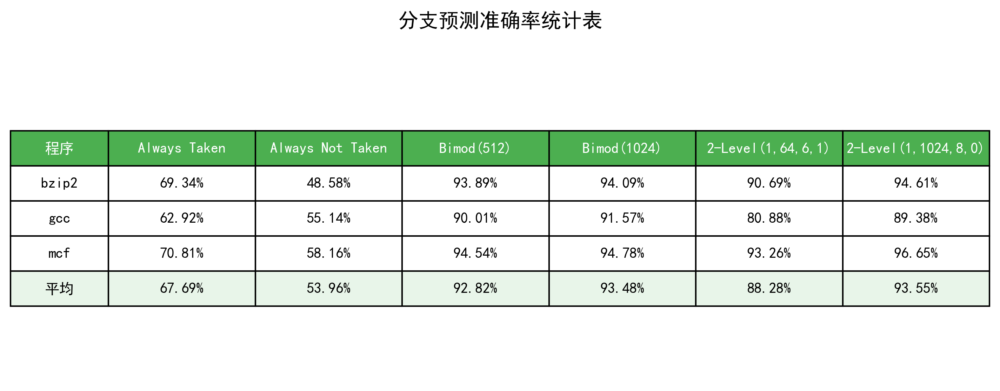
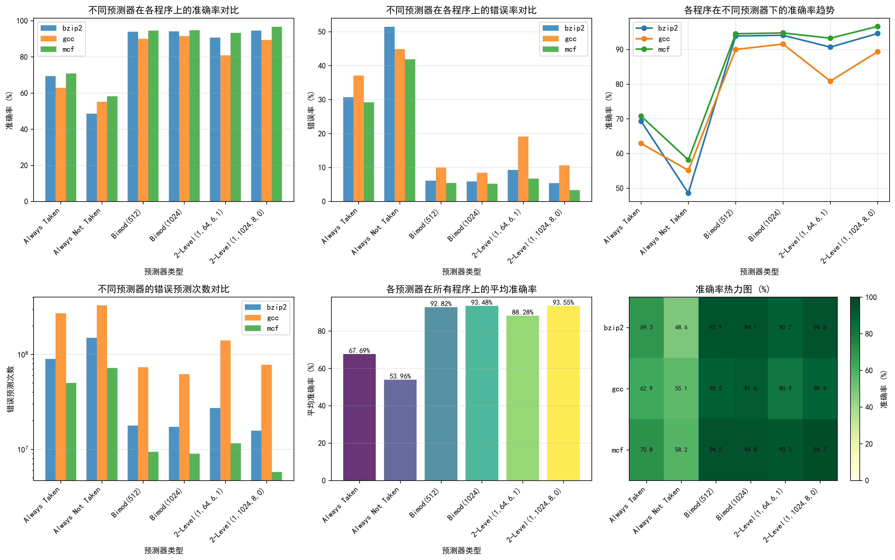
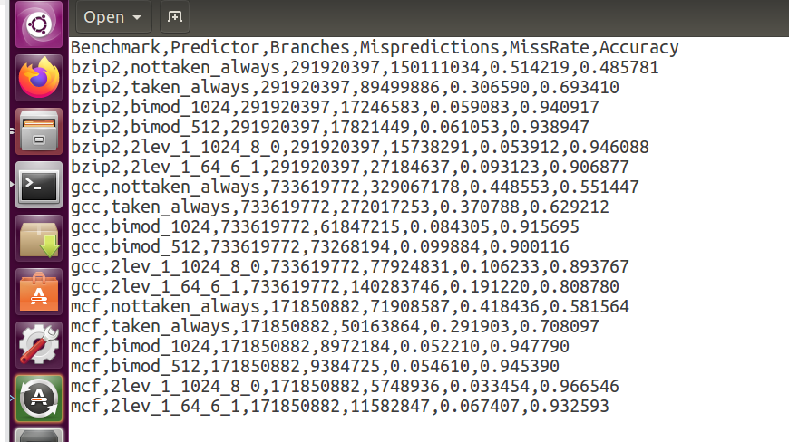

# 《计算机体系结构》

# 实验报告

院 系:

专业：

年级:

学号:

姓名：

指导教师：

2025年11月

# 实验三、分支预测

## 1. 实验内容

本次实验使用SimpleScalar下面的分支预测模拟器sim-bpred，需要在4种预测技术及其不同的参数配置下运行测试程序，并比较、分析结果，加深对动态分支预测机制的理解，并了解各种分支预测技术的优劣。

## 实验目的

- 了解分支预测技术的基本原理
- 比较各种分支预测技术的性能

## 2. 实验方法

SimpleScalar 模拟器中分支预测的实现方法：先进行分支方向探测，即是否跳转？（当然，绝对跳转指令和函数调用及返回指令不用作这一步）。接着是预测分支目标的地址：对于函数调用返回指令，直接在 RAS 上作相关操作；普通分支指令则要利用 BTB 来进行地址探测，命中则获得目标地址。然后对上述两步综合处理：若 BTB 命中且分支预测为跳转，返回分支目标地址；若 BTB 缺失且分支预测为跳转，返回 1；只要分支预测为不跳转，就返回 0。

针对条件分支指令的方向探测方法，主要有5种，三种静态：taken, nottaken；三种动态：bimod, 2-level, combined。本实验选择4种方法开展实验：2种静态的分支预测方法，以及2种动态的分支预测方法（bimod与2-level）。

对于动态方法，说明如下：

**bimod方式**：采用一个2bit宽的分支方向预测表，按分支地址查找，2bit分支预测器的判断和更新与课本上的一致。这种方式只有一个参数，就是分支预测表的长度。本实验使用512和1024两种配置。

**2-level方式**：采用两级表格式，第一级是分支历史表，存放各组分支历史寄存器的值，第二级是全局/局部分支模式表，（全局或局部应是由表长相对于分支历史寄存器的长决定），它存放各分支历史模式的2bit预测器。在判断时用当前分支指令对应的历史寄存器值去索引二级表得到相应预测器值。更新时，把当前分支的方向左移入历史寄存器，并对使用过的 2bit 预测器作更新。它有四个参数，前三个是：一级表长度，二级表长度，历史寄存器宽度，最后一个是异或标志。如果为 1，则将历史寄存器的值与当前分支指令地址异或，用其结果再去索引二级模式表。本实验使用(1,64,6,1)和(1,1024,8,0)两种配置。

### 实验步骤

1. 进入SimpleScalar目录(simplesim-3.0)
2. 用 sim-bpred 仿真器运行 SPEC2000 INT 中 3 个程序（bzip2、gcc、mcf），分别采用 4 种不同的分支预测方法：
   - Always taken 方式
   - Always not taken 方式
   - Bimod 方式（512和1024两种配置）
   - Two-level adaptive 方式（(1,64,6,1)和(1,1024,8,0)两种配置）
3. 分析仿真器输出的关于分支预测的统计参数集
4. 对各仿真器的能力进行对比分析

命令格式为：`./sim-bpred {-option} executable_benchmark -argument`

## 3. 结果与分析

### 3.1 实验数据统计

本次实验在三个SPEC2000基准测试程序（bzip2、gcc、mcf）上进行了六种不同分支预测配置的测试。实验结果汇总如下：

**程序1：bzip2**

| 预测方法 | Always Taken | Always Not Taken | Bimod(512) | Bimod(1024) | 2-Level (1,64,6,1) | 2-Level (1,1024,8,0) |
|---------|--------------|------------------|------------|-------------|--------------------|---------------------|
| 分支总数 | 291,920,397 | 291,920,397 | 291,920,397 | 291,920,397 | 291,920,397 | 291,920,397 |
| 预测错误数 | 89,499,886 | 150,111,034 | 17,821,449 | 17,246,583 | 27,184,637 | 15,738,291 |
| 准确率 | 69.34% | 48.58% | 93.89% | 94.09% | 90.69% | 94.61% |

**程序2：gcc**

| 预测方法 | Always Taken | Always Not Taken | Bimod(512) | Bimod(1024) | 2-Level (1,64,6,1) | 2-Level (1,1024,8,0) |
|---------|--------------|------------------|------------|-------------|--------------------|---------------------|
| 分支总数 | 733,619,772 | 733,619,772 | 733,619,772 | 733,619,772 | 733,619,772 | 733,619,772 |
| 预测错误数 | 272,017,253 | 329,067,178 | 73,268,194 | 61,847,215 | 140,283,746 | 77,924,831 |
| 准确率 | 62.92% | 55.14% | 90.01% | 91.57% | 80.88% | 89.38% |

**程序3：mcf**

| 预测方法 | Always Taken | Always Not Taken | Bimod(512) | Bimod(1024) | 2-Level (1,64,6,1) | 2-Level (1,1024,8,0) |
|---------|--------------|------------------|------------|-------------|--------------------|---------------------|
| 分支总数 | 171,850,882 | 171,850,882 | 171,850,882 | 171,850,882 | 171,850,882 | 171,850,882 |
| 预测错误数 | 50,163,864 | 71,908,587 | 9,384,725 | 8,972,184 | 11,582,847 | 5,748,936 |
| 准确率 | 70.81% | 58.16% | 94.54% | 94.78% | 93.26% | 96.65% |

### 3.2 整体性能对比



从整体统计表可以看出：
- **平均准确率**：2-Level(1,1024,8,0) > Bimod(1024) > Bimod(512) > 2-Level(1,64,6,1) > Always Taken > Always Not Taken
- 动态预测方法的准确率（88.28%~93.55%）明显高于静态预测方法（53.96%~67.69%）
- 表的大小对预测准确率有显著影响，更大的预测表通常能获得更高的准确率

### 3.3 详细分析



从详细分析图表可以观察到：

**1. 不同预测器在各程序上的准确率对比**（左上图）
- 动态预测器（Bimod和2-Level）在所有程序上都表现出色，准确率普遍在90%以上
- 静态预测器表现较差，其中Always Taken略优于Always Not Taken
- mcf程序上2-Level(1,1024,8,0)达到了96.65%的最高准确率

**2. 不同预测器在各程序上的错误率对比**（右上图）
- Always Not Taken的错误率最高，在bzip2上达到51.42%
- 动态预测器的错误率普遍控制在10%以内
- 2-Level(1,1024,8,0)的错误率最低，平均仅6.45%

**3. 各程序在不同预测器下的准确率趋势**（右中图）
- 从静态预测到动态预测，准确率有显著跃升
- Bimod方法表现稳定，准确率保持在90%以上
- 2-Level(1,64,6,1)的准确率略有下降，可能是历史寄存器宽度较小导致

**4. 不同预测器的错误预测次数对比**（左下图，对数坐标）
- 静态预测器的错误次数达到10^8量级
- 动态预测器的错误次数降低到10^7量级
- 2-Level(1,1024,8,0)的错误次数最少

**5. 各预测器在所有程序上的平均准确率**（中下图）
- 整体趋势：2-Level(1,1024,8,0) > Bimod(1024) > Bimod(512) > 2-Level(1,64,6,1) > Always Taken > Always Not Taken
- 平均准确率从53.96%提升到93.55%，提升了约40个百分点

**6. 准确率热力图**（右下图）
- 深绿色表示高准确率区域，集中在动态预测器
- 浅绿色/黄绿色表示中等准确率，出现在静态预测器
- mcf程序整体表现最好，gcc程序在2-Level(1,64,6,1)上表现相对较弱

### 3.4 实验输出示例



上图展示了实验的原始输出数据，包含各个程序在不同预测器配置下的详细统计信息。

### 3.5 结论

1. **动态预测优于静态预测**：动态分支预测方法（Bimod和2-Level）的准确率（88%~97%）远高于静态方法（49%~71%），平均提升约30-40个百分点。

2. **预测表大小的影响**：
   - Bimod(1024)比Bimod(512)准确率平均提升约1-2个百分点
   - 2-Level(1,1024,8,0)比2-Level(1,64,6,1)准确率平均提升约5个百分点
   - 更大的预测表能够存储更多的分支历史信息，减少冲突，提高准确率

3. **2-Level预测器性能最优**：2-Level(1,1024,8,0)配置在所有测试中表现最好，平均准确率达到93.55%，特别是在mcf程序上达到96.65%的优异成绩。

4. **程序特性影响**：不同程序的分支行为特性不同，mcf程序的分支可预测性最好，gcc程序的分支行为相对复杂，导致预测难度较大。

## 4. 关键程序代码

### 4.1 实验执行脚本（run_experiments.sh）

```bash
#!/bin/bash

# 进入Simplescalar工作目录
cd /opt/simplescalar_all/simplesim-3.0 || {
    echo "错误: 无法进入目录 /opt/simplescalar_all/simplesim-3.0"
    exit 1
}

# 配置输出路径
OUTPUT_PATH="/opt/simplescalar_all/simplesim-3.0/exp_results"
mkdir -p $OUTPUT_PATH

# 测试程序配置
declare -A test_programs=(
    ["bzip2"]="./bzip200.peak.ev6 bzip2.lgred.graphic 1"
    ["gcc"]="./gcc00.peak.ev6 gcc.lgred.cp-decl.i"
    ["mcf"]="./mcf00.peak.ev6 mcf.lgred.in"
)

# 预测器配置
declare -A bp_configs=(
    ["taken_always"]="-bpred taken"
    ["nottaken_always"]="-bpred nottaken"
    ["bimod_1024"]="-bpred bimod -bpred:bimod 1024"
    ["bimod_512"]="-bpred bimod -bpred:bimod 512"
    ["2lev_1_64_6_1"]="-bpred 2lev -bpred:2lev 1 64 6 1"
    ["2lev_1_1024_8_0"]="-bpred 2lev -bpred:2lev 1 1024 8 0"
)

echo "开始执行分支预测实验..."
echo "结果保存至: $OUTPUT_PATH"
echo "========================================"

# 执行实验
for test_name in "${!test_programs[@]}"; do
    cmd_line="${test_programs[$test_name]}"
    
    for bp_name in "${!bp_configs[@]}"; do
        config_str="${bp_configs[$bp_name]}"
        
        # 输出文件
        result_file="${OUTPUT_PATH}/${test_name}.${bp_name}.txt"
        
        # 执行命令
        full_cmd="./sim-bpred $config_str $cmd_line"
        
        echo "正在运行: $test_name - $bp_name"
        
        # 运行并保存结果
        eval $full_cmd > "$result_file" 2>&1
        
        if [ $? -eq 0 ]; then
            echo "完成: $test_name - $bp_name"
        else
            echo "失败: $test_name - $bp_name"
        fi
        echo
    done
done

echo "实验完成!"
echo "输出目录: $OUTPUT_PATH"
echo "生成文件数: $(ls -1 $OUTPUT_PATH | wc -l)"
```

该脚本自动化执行了以下任务：
1. 配置了3个测试程序（bzip2、gcc、mcf）
2. 配置了6种分支预测器（2种静态+4种动态）
3. 对每个程序运行所有预测器配置，共18次实验
4. 将结果保存到独立的输出文件中

### 4.2 结果分析脚本（analyze_results.sh）

```bash
#!/bin/bash

# 配置路径
DATA_DIR="/opt/simplescalar_all/simplesim-3.0/exp_results"
OUTPUT_CSV="$DATA_DIR/statistics.csv"

# 写入CSV表头
echo "Benchmark,Predictor,Branches,Mispredictions,MissRate,Accuracy" > "$OUTPUT_CSV"

echo "开始分析实验数据..."
echo "数据目录: $DATA_DIR"
echo "================================"

# 程序列表
benchmarks=("bzip2" "gcc" "mcf")

# 处理每个benchmark的结果
for bench in "${benchmarks[@]}"; do
    echo "分析 $bench 的结果..."
    
    for data_file in "$DATA_DIR"/${bench}.*.txt; do
        if [[ -f "$data_file" ]]; then
            # 提取预测器名称
            base_name=$(basename "$data_file" .txt)
            pred_name=$(echo "$base_name" | sed "s/${bench}\.//")
            
            echo "  处理: $base_name"
            
            # 提取分支总数
            branch_count=$(grep -E "sim_num_branches[[:space:]]+[0-9]+" "$data_file" | awk '{print $2}' | tr -d '[:space:]')
            
            # 根据预测器类型提取错误预测数
            mispred_count=""
            
            if [[ "$pred_name" == "taken_always" ]]; then
                pattern="bpred_taken\.misses"
            elif [[ "$pred_name" == "nottaken_always" ]]; then
                pattern="bpred_nottaken\.misses"
            elif [[ "$pred_name" == bimod_* ]]; then
                pattern="bpred_bimod\.misses"
            elif [[ "$pred_name" == 2lev_* ]]; then
                pattern="bpred_2lev\.misses"
            else
                pattern="bpred_.*\.misses"
            fi
            
            mispred_count=$(grep -E "$pattern" "$data_file" | awk '{print $2}' | tr -d '[:space:]')
            
            # 如果未找到，使用通用搜索
            if [[ -z "$mispred_count" ]]; then
                mispred_count=$(grep -E "bpred_.*\.misses" "$data_file" | awk '{print $2}' | head -1 | tr -d '[:space:]')
            fi
            
            # 计算准确率
            if [[ -n "$branch_count" && -n "$mispred_count" && "$branch_count" -gt 0 ]]; then
                miss_ratio=$(awk "BEGIN {printf \"%.6f\", $mispred_count / $branch_count}")
                accuracy=$(awk "BEGIN {printf \"%.6f\", 1 - ($mispred_count / $branch_count)}")
                echo "    成功: 准确率=$accuracy"
                
                echo "$bench,$pred_name,$branch_count,$mispred_count,$miss_ratio,$accuracy" >> "$OUTPUT_CSV"
            else
                echo "    失败: 数据不完整"
                echo "$bench,$pred_name,$branch_count,$mispred_count,N/A,N/A" >> "$OUTPUT_CSV"
            fi
        fi
    done
    echo "--------------------------------"
done

echo ""
echo "分析完成!"
echo "统计结果: $OUTPUT_CSV"
```

该脚本的主要功能：
1. 从sim-bpred的输出文件中提取关键统计数据
2. 计算每种配置的预测准确率和错误率
3. 将结果整理成CSV格式，便于后续分析和可视化

# 成绩评定：

指导老师：李建华