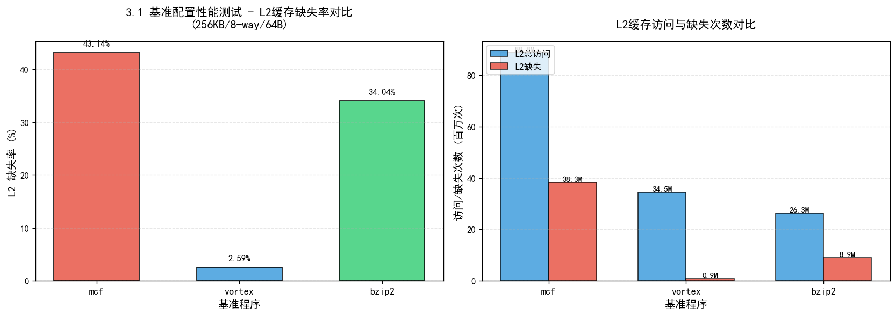
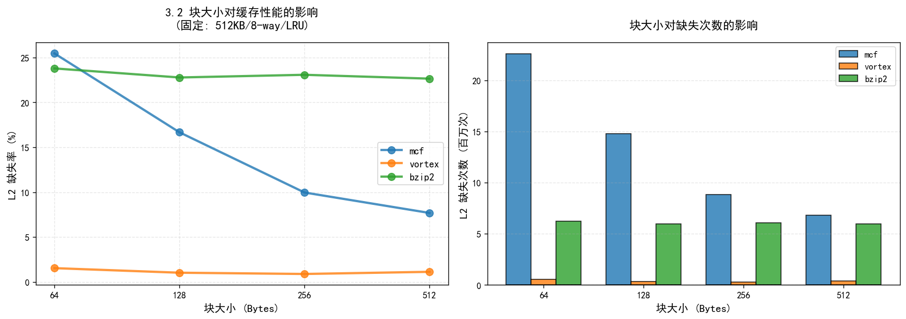
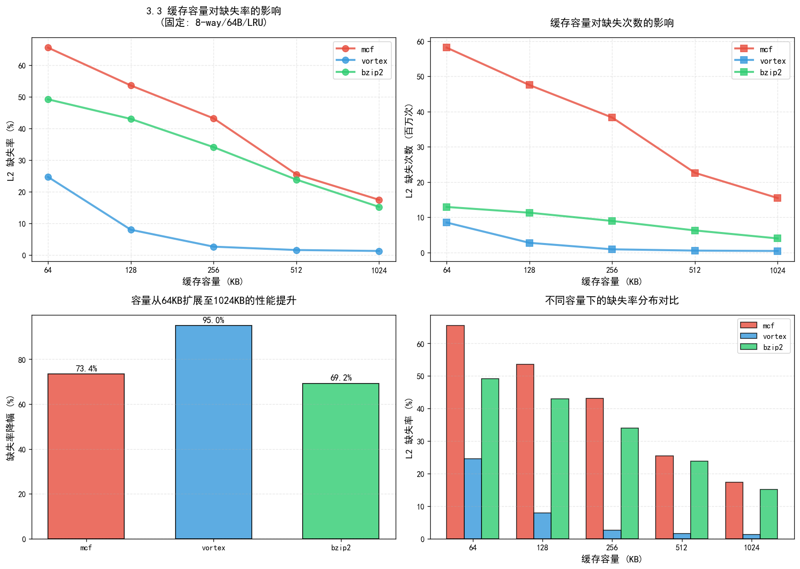
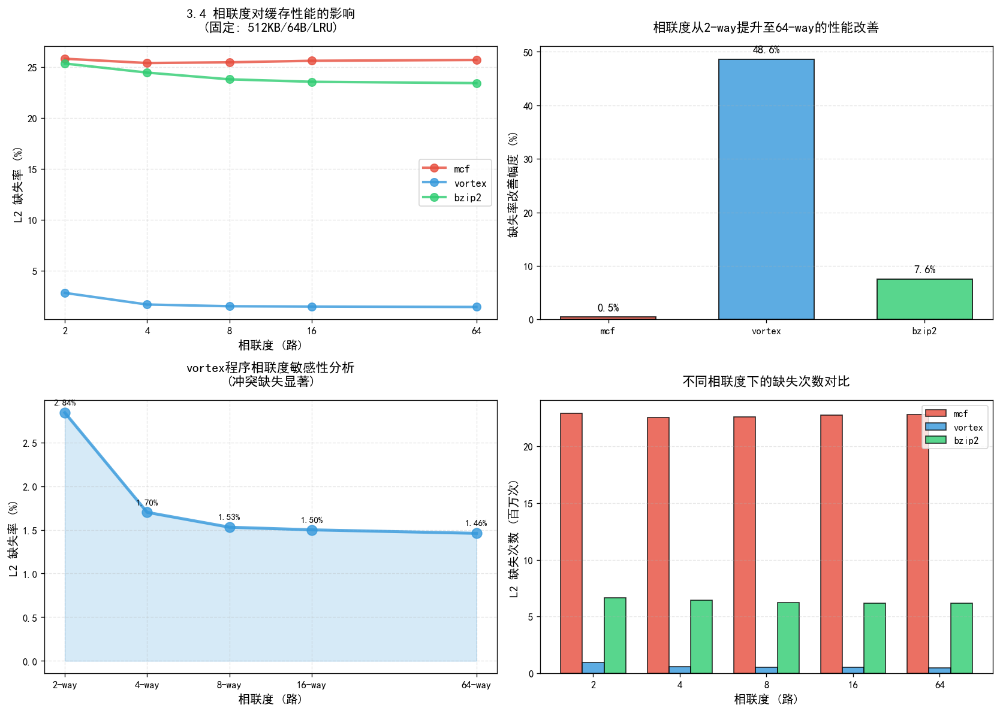
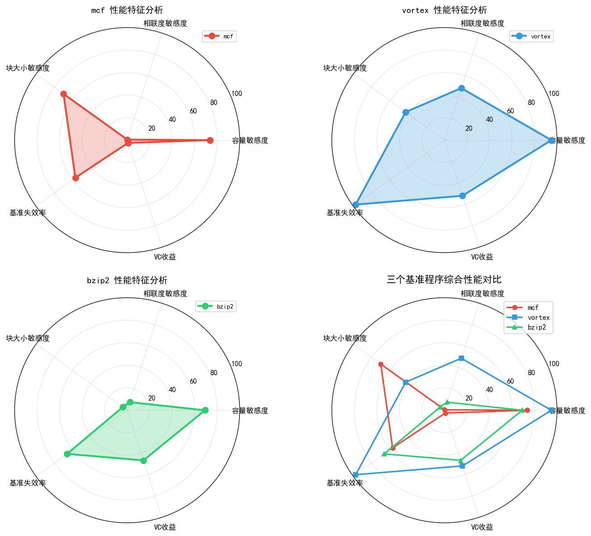
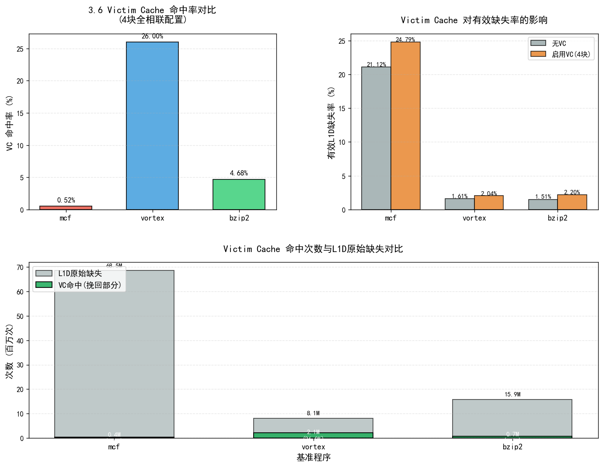

**实验一、缓存性能分析**

**1.** **实验内容**

基于 SimpleScalar 模拟器，通过运行 SPEC2000-Alpha 基准测试中的 workloads 并对结 果进行分析，深入理解缓存的三个参数（缓存大小、block size、相联度）对缓存性能 的影响。

**实验目的：** 

了解 Cache 的基本概念、基本组织结构 

了解影响 Cache 性能的三个指标 

了解相联度对 Cache 的影响 

了解块大小对 Cache 的影响 

 

**2.** **实验方法**

**2.1 实验环境与工具配置**

本实验基于 SimpleScalar 工具集中的 `sim-cache` 模拟器开展,实验环境为预配置的 Linux 虚拟机。为确保实验的系统性与可重复性，采用自动化脚本方式组织全部测试流程。

**2.2 缓存体系结构配置**

实验采用两级缓存层次结构，具体参数如下：

**L1 缓存配置（固定参数）**：
- 指令缓存（IL1）：容量 16KB，组织结构为 128 组 × 64 字节块 × 2 路组相联，替换策略采用 LRU
- 数据缓存（DL1）：参数配置与 IL1 完全一致
  
**L2 缓存配置（实验变量）**：
- 基准配置：容量 256KB，8 路组相联，块大小 64 字节，LRU 替换策略
- 缓存结构：采用统一 L2 设计（Unified L2），通过将 `il2` 映射至 `dl2` 实现指令与数据共享同一二级缓存

**测试基准程序**：
从 SPEC CPU2000 整数基准测试套件（CINT2000）中选取三个代表性程序：
- `mcf`：内存密集型图论算法，工作集较大
- `vortex`：面向对象数据库应用，具有良好的空间局部性
- `bzip2`：数据压缩程序，访存模式较为复杂

所有基准程序均采用 `.lgred` 简化输入集，以平衡模拟时间与统计有效性。

**2.3 实验自动化框架设计**

为系统性地探究缓存参数对性能的影响，设计并实现了双模式测试框架：

**（1）测试模式划分**
- **标准模式**：无 Victim Cache 增强，结果输出至 `all_sim/` 目录
- **Victim Cache 模式**：启用 4 块全相联 Victim Cache（通过 `-vc true` 参数激活），结果输出至 `all_sim_victim/` 目录

**（2）参数扫描策略**

实验按照单因素变量法组织四类测试，每类测试固定其他参数，仅改变目标维度：

① **基准配置测试**（baseline）：验证初始配置性能
   - L2 参数：256KB / 8-way / 64B

② **容量扫描**（capacity sweep）：评估缓存容量影响
   - 扫描范围：64KB、128KB、256KB、512KB、1024KB
   - 固定参数：8 路相联、64 字节块

③ **相联度扫描**（associativity sweep）：分析组相联度效应
   - 扫描范围：2-way、4-way、8-way、16-way、64-way
   - 固定参数：512KB 容量、64 字节块

④ **块大小扫描**（block size sweep）：考察空间局部性利用
   - 扫描范围：64B、128B、256B、512B
   - 固定参数：512KB 容量、8 路相联

**（3）智能化执行机制**

脚本实现了任务完整性检测与断点续跑功能：
- **执行前检查**：通过验证日志文件中是否包含 `simulation statistics` 标记及关键性能字段（如 `ul2.misses`），判定任务是否已成功完成
- **跳过策略**：若检测到完整日志文件，自动跳过该测试点，避免重复计算
- **容错设计**：单个测试失败不中断整体流程，通过 `|| true` 确保后续任务继续执行

此设计有效应对了长时间模拟过程中可能出现的偶发性错误，支持多次运行以完成全部测试。

**（4）缓存参数自动计算**

脚本根据缓存三要素自动推导组数（nsets）：

```
组数 = 总容量（字节） / (块大小 × 相联度)
```

该设计保证了配置的一致性，避免人工计算错误。

**2.4 数据采集与处理流程**

**日志结构设计**：
每个测试实例的日志文件包含三个区域：
- **头部元数据**：记录测试类别、基准程序、缓存配置、Victim Cache 状态、执行时间戳
- **模拟器原始输出**：包含完整的统计信息
- **性能统计摘要**：从原始输出中提取的关键指标，包括：
  - L1 缓存指标：访问次数、命中数、缺失数、缺失率、替换次数、写回次数
  - L2 缓存指标：访问次数、命中数、缺失数、缺失率、替换次数、写回次数
  - Victim Cache 指标（启用时）：`dl1.vc_hits`（VC 命中次数）、`dl1.vc_misses`（VC 未命中次数）

**数据提取与整合**：
脚本集成的数据提取模块采用高效的尾部反向读取策略：
- 使用 `tac` 命令从文件末尾向前扫描，快速定位性能摘要区域，避免遍历完整日志文件
- **配置解析**：从日志头部提取 L2 容量、相联度、块大小等参数，并自动识别基准程序名称
- **派生指标计算**：
  - 标准模式：有效 L1D 缺失数 = `dl1.misses`（所有 L1D 缺失均转发至 L2）
  - Victim Cache 模式：有效 L1D 缺失数 = `dl1.vc_misses`（仅 VC 未命中的部分转发至 L2）
  - 有效 L1D 缺失率 = 有效缺失数 / L1D 总访问数

**输出格式**：
生成两份 TSV（制表符分隔）格式数据文件：
- `no_vc.txt`：标准模式性能数据
- `vc.txt`：Victim Cache 模式性能数据

数据文件采用统一表头，包含以下字段：文件路径、测试类别、基准程序、L2 容量（KB）、L2 相联度、L2 块大小（B）、L2 访问数、L2 缺失数、L2 缺失率、L1D 访问数、L1D 原始缺失数、VC 命中数、VC 未命中数、有效 L1D 缺失数、有效 L1D 缺失率。

**2.5 实验执行规模**

总测试点数量：(1 基准 + 5 容量 + 5 相联度 + 4 块大小) × 3 基准程序 × 2 模式 = **90 个测试实例**

每个测试实例独立生成日志文件，文件命名遵循 `{benchmark}-{category}-{parameter}.log` 格式（例如 `data1-cap-512.log`、`data2-way-8.log`），便于结果追溯与验证。实验数据按测试类别组织在不同子目录下（`baseline/`、`cap/`、`way/`、`blk/`），结构清晰，易于管理和分析。

 

**3.** **结果与分析**

**3.1 基准配置性能测试**（L2缓存：256KB容量，8路组相联，64B块大小，LRU替换策略）

| 测试程序 | 日志路径                            | 缓存结构说明                | L2总访问 | L2失效数 | 失效率   |
| -------- | ----------------------------------- | --------------------------- | -------- | -------- | -------- |
| mcf      | all_sim/baseline/data1-baseline.log | 统一L2（指令/数据共享）     | 88761256 | 38294168 | 0.4314   |
| vortex   | all_sim/baseline/data2-baseline.log | 统一L2，il2映射至dl2        | 34491160 | 893209   | 0.0259   |
| bzip2    | all_sim/baseline/data3-baseline.log | 256KB/8-way/64B/LRU unified | 26272583 | 8942720  | 0.3404   |

**可视化分析：**



*图表说明：左图展示三个基准程序的 L2 缓存失效率对比，右图展示访问次数与失效次数对比。从图中可以清晰看出：mcf 程序的失效率（43.14%）远高于其他两个程序，L2 访问次数也最高（88.76M），表明其内存需求强度大；vortex 的失效率极低（2.59%），展现出优异的局部性特征；bzip2 居中（34.04%）。*

**3.2 块大小影响实验**（固定：容量512KB，8路组相联，LRU策略）

| Benchmark | 块尺寸(Bytes) | 测试日志                     | 访问总量 | 缺失总量 | Miss Rate |
| --------- | ------------- | ---------------------------- | -------- | -------- | --------- |
| mcf       | 64            | all_sim/blk/data1-blk-64.log | 88761256 | 22599744 | 0.2546    |
| mcf       | 128           | all_sim/blk/data1-blk-128.log| 88761256 | 14794549 | 0.1667    |
| mcf       | 256           | all_sim/blk/data1-blk-256.log| 88761256 | 8841978  | 0.0996    |
| mcf       | 512           | all_sim/blk/data1-blk-512.log| 88761256 | 6813640  | 0.0768    |
| vortex    | 64            | all_sim/blk/data2-blk-64.log | 34491160 | 528875   | 0.0153    |
| vortex    | 128           | all_sim/blk/data2-blk-128.log| 34491160 | 350525   | 0.0102    |
| vortex    | 256           | all_sim/blk/data2-blk-256.log| 34491160 | 303986   | 0.0088    |
| vortex    | 512           | all_sim/blk/data2-blk-512.log| 34491160 | 384982   | 0.0112    |
| bzip2     | 64            | all_sim/blk/data3-blk-64.log | 26272583 | 6251150  | 0.2379    |
| bzip2     | 128           | all_sim/blk/data3-blk-128.log| 26272583 | 5987022  | 0.2278    |
| bzip2     | 256           | all_sim/blk/data3-blk-256.log| 26272583 | 6064279  | 0.2308    |
| bzip2     | 512           | all_sim/blk/data3-blk-512.log| 26272583 | 5952276  | 0.2265    |

**可视化分析：**



*图表说明：左图展示缺失率随块大小变化的趋势曲线，右图展示缺失次数的柱状对比。从图中可以明显看出：mcf 程序随块大小增加，失效率单调递减（从 25.46% 降至 7.68%，降幅 69.8%），展现出良好的空间局部性；vortex 在 256B 块时达到最优（0.88%），但 512B 反而性能下降，说明过大的块引入了缓存污染；bzip2 对块大小不敏感，各配置差异很小。*

**3.3 缓存容量扫描实验**（固定：8路组相联，块大小64B，LRU策略）

| 程序   | Capacity(KB) | 日志文件                        | L2 Accesses | L2 Misses | Miss Rate |
| ------ | ------------ | ------------------------------- | ----------- | --------- | --------- |
| mcf    | 64           | all_sim/cap/data1-cap-64.log    | 88761256    | 58125546  | 0.6548    |
| mcf    | 128          | all_sim/cap/data1-cap-128.log   | 88761256    | 47513014  | 0.5353    |
| mcf    | 256          | all_sim/cap/data1-cap-256.log   | 88761256    | 38294168  | 0.4314    |
| mcf    | 512          | all_sim/cap/data1-cap-512.log   | 88761256    | 22599744  | 0.2546    |
| mcf    | 1024         | all_sim/cap/data1-cap-1024.log  | 88761256    | 15444558  | 0.1740    |
| vortex | 64           | all_sim/cap/data2-cap-64.log    | 34491160    | 8488977   | 0.2462    |
| vortex | 128          | all_sim/cap/data2-cap-128.log   | 34491160    | 2736993   | 0.0794    |
| vortex | 256          | all_sim/cap/data2-cap-256.log   | 34491160    | 893209    | 0.0259    |
| vortex | 512          | all_sim/cap/data2-cap-512.log   | 34491160    | 528875    | 0.0153    |
| vortex | 1024         | all_sim/cap/data2-cap-1024.log  | 34491160    | 423992    | 0.0123    |
| bzip2  | 64           | all_sim/cap/data3-cap-64.log    | 26272583    | 12911805  | 0.4915    |
| bzip2  | 128          | all_sim/cap/data3-cap-128.log   | 26272583    | 11286235  | 0.4296    |
| bzip2  | 256          | all_sim/cap/data3-cap-256.log   | 26272583    | 8942720   | 0.3404    |
| bzip2  | 512          | all_sim/cap/data3-cap-512.log   | 26272583    | 6251150   | 0.2379    |
| bzip2  | 1024         | all_sim/cap/data3-cap-1024.log  | 26272583    | 3981831   | 0.1516    |

**可视化分析：**



*图表说明：左上图展示缺失率随容量变化的对数曲线，右上图展示缺失次数变化，左下图对比容量扩展带来的性能提升百分比，右下图展示不同容量下的失效率分布。从图中可以清晰看出：vortex 对容量最敏感（降幅 95.0%），mcf 次之（73.4%），bzip2 为 69.2%。所有程序都从容量扩展中获得显著性能提升，但提升幅度因程序特性而异。*

**3.4 相联度变化实验**（固定：容量512KB，块大小64B，LRU策略）

| 测试基准 | Associativity | 日志路径                     | 访问计数 | 缺失计数 | 缺失率   |
| -------- | ------------- | ---------------------------- | -------- | -------- | -------- |
| mcf      | 2-way         | all_sim/way/data1-way-2.log  | 88761256 | 22904664 | 0.2581   |
| mcf      | 4-way         | all_sim/way/data1-way-4.log  | 88761256 | 22536018 | 0.2539   |
| mcf      | 8-way         | all_sim/way/data1-way-8.log  | 88761256 | 22599744 | 0.2546   |
| mcf      | 16-way        | all_sim/way/data1-way-16.log | 88761256 | 22731928 | 0.2561   |
| mcf      | 64-way        | all_sim/way/data1-way-64.log | 88761256 | 22805833 | 0.2569   |
| vortex   | 2-way         | all_sim/way/data2-way-2.log  | 34491160 | 978465    | 0.0284   |
| vortex   | 4-way         | all_sim/way/data2-way-4.log  | 34491160 | 584880    | 0.0170   |
| vortex   | 8-way         | all_sim/way/data2-way-8.log  | 34491160 | 528875    | 0.0153   |
| vortex   | 16-way        | all_sim/way/data2-way-16.log | 34491160 | 517610    | 0.0150   |
| vortex   | 64-way        | all_sim/way/data2-way-64.log | 34491160 | 503134    | 0.0146   |
| bzip2    | 2-way         | all_sim/way/data3-way-2.log  | 26272583 | 6658769   | 0.2534   |
| bzip2    | 4-way         | all_sim/way/data3-way-4.log  | 26272583 | 6425946   | 0.2445   |
| bzip2    | 8-way         | all_sim/way/data3-way-8.log  | 26272583 | 6251150   | 0.2379   |
| bzip2    | 16-way        | all_sim/way/data3-way-16.log | 26272583 | 6189011   | 0.2355   |
| bzip2    | 64-way        | all_sim/way/data3-way-64.log | 26272583 | 6153684   | 0.2342   |

**可视化分析：**



*图表说明：左上图展示缺失率随相联度变化的趋势，右上图对比性能改善百分比，左下图详细展示 vortex 的敏感度分析，右下图展示缺失次数对比。从图中可以明显看出：vortex 对相联度极其敏感（改善 48.6%），存在显著的冲突缺失；mcf 几乎不受相联度影响（仅 0.5%），说明其性能瓶颈是容量缺失而非冲突缺失；bzip2 轻度敏感（7.6%）。*

 

**3.5 数据分析与讨论**

**3.5.1 基准配置分析**（L2: 256KB/8-way/64B）

从基准测试结果观察：

- **mcf**：失效率达到 43.14%，L2访问次数 88.76M，表现出较高的内存需求强度，反映其工作数据集明显超出 256KB 缓存容量，同时空间局部性表现一般
  
- **bzip2**：失效率 34.04%，访问次数 26.27M，同样面临较大的容量压力
  
- **vortex**：失效率仅 2.59%，表明该负载的活跃数据集较小且局部性特征优异

**3.5.2 缓存容量影响分析**（变量：64KB→1024KB，控制变量：8-way，64B块）

容量扩展实验展示出三个基准程序对缓存容量敏感度的差异：

**mcf 程序表现**：
- 容量从 64KB 增至 1024KB，失效率由 0.6548 降至 0.1740，**降幅达 73.4%**
- 相较基准配置，512KB 配置失效率降低 **41.0%**，1024KB 配置降低 **59.7%**
- **结论**：该负载受容量缺失（capacity miss）主导，扩大缓存容量带来显著性能提升

**vortex 程序表现**：
- 从 0.2462 降至 0.0123，**降幅高达 95.0%**
- 对比基准值：512KB 降低 **40.9%**，1024KB 降低 **52.5%**
- **结论**：工作集规模较小，当缓存容量充足时失效率趋近极低水平

**bzip2 程序表现**：
- 失效率从 0.4915 降至 0.1516，**降幅 69.2%**
- 相对基准：512KB 降低 **30.1%**，1024KB 降低 **55.5%**
- **结论**：对容量变化呈现中等敏感度

**综合结论**：容量扩展对 **mcf 和 bzip2** 的容量缺失改善最为明显；**vortex** 在 512KB 以上配置已基本满足需求

**3.5.3 相联度影响分析**（变量：2-way→64-way，控制：512KB，64B块）

**vortex 程序**：
- 相联度从 2-way 增至 64-way，失效率从 0.0284 降至 0.0146，**改善幅度 48.6%**
- 表明该负载存在显著的**冲突缺失（conflict miss）**
- 8-way 之后性能提升趋于平缓，呈边际效益递减规律

**bzip2 程序**：
- 2-way 至 64-way 配置下，失效率由 0.2534 降至 0.2342，**改善约 7.6%**
- 显示出对相联度的轻度敏感性

**mcf 程序**：
- 失效率仅从 0.2581 微降至 0.2569，**变化幅度不足 0.5%**
- 说明该负载的性能瓶颈并非冲突缺失，而是受容量限制或访问模式影响

**设计启示**：针对 **vortex 类负载**，提升相联度（例如从 8-way 至 16-way）可有效缓解冲突；而对 **mcf** 类负载收效甚微

**3.5.4 块大小影响分析**（变量：64B→512B，控制：512KB，8-way）

**mcf 程序**：
- 块尺寸从 64B 增至 512B，失效率呈单调递减：0.2546→0.0768，**降幅达 69.8%**
- 反映该负载具有良好的**空间局部性（spatial locality）**
- 大块设计能够在单次传输中获取更多有效数据

**vortex 程序**：
- 最优块大小出现在 256B，失效率从 0.0153 降至 0.0088（**改善 42.5%**）
- 但 512B 块反而导致失效率回升至 0.0112
- **分析**：过大的块会引入**缓存污染**，加载过多无用数据而降低缓存利用效率

**bzip2 程序**：
- 块尺寸变化带来的性能改善有限，64B→512B 仅降低 **4.8%**
- 且 256B 配置略逊于 128B 和 512B
- 表明空间局部性较弱，或访存模式存在较大步幅（stride）

**优化建议**：块大小并非越大越好；**mcf 受益于大块设计**，**vortex 的最佳配置为 256B 块**，**bzip2 对块大小不敏感**

**综合性能对比：**



*图表说明：雷达图从五个维度（容量敏感度、相联度敏感度、块大小敏感度、基准失效率、VC收益）综合对比三个基准程序的性能特征。mcf 展现出高容量敏感度和高块大小敏感度，但对相联度和 VC 几乎无响应；vortex 在容量、相联度和 VC 命中率方面都表现出高敏感度；bzip2 各项指标相对均衡但整体敏感度中等。*

 

**3.6 Victim Cache 性能实验**

**3.6.1 实验配置**

实验通过命令行参数 `-vc true` 启用 Victim Cache，默认配置为 4 个缓存块，符合实验要求。

**3.6.2 L1D 缓存失效数据对比**

下表对比了三个基准程序在标准模式与 Victim Cache 模式下的 L1D 缓存行为：

**标准模式（无 Victim Cache）统计：**

| 基准程序 | 配置类型       | L1D 访问总数 | L1D 原始失效 | 有效送往 L2 的失效 | 有效 L1D 失效率 |
| -------- | -------------- | ------------ | ------------ | ------------------ | --------------- |
| mcf      | baseline-256KB | 324386042    | 68504342     | 68504342           | 0.2112          |
| mcf      | cap-512KB      | 324386042    | 68504342     | 68504342           | 0.2112          |
| mcf      | way-8          | 324386042    | 68504342     | 68504342           | 0.2112          |
| vortex   | baseline-256KB | 505120103    | 8145688      | 8145688            | 0.0161          |
| vortex   | cap-512KB      | 505120103    | 8145688      | 8145688            | 0.0161          |
| vortex   | way-8          | 505120103    | 8145688      | 8145688            | 0.0161          |
| bzip2    | baseline-256KB | 1051409452   | 15851500     | 15851500           | 0.0151          |
| bzip2    | cap-512KB      | 1051409452   | 15851500     | 15851500           | 0.0151          |
| bzip2    | way-8          | 1051409452   | 15851500     | 15851500           | 0.0151          |

**Victim Cache 模式（4 块）统计：**

| 基准程序 | 配置类型       | L1D 访问总数 | L1D 原始失效 | VC 命中数 | VC 未命中数 | 有效送往 L2 的失效 | 有效 L1D 失效率 | VC 命中率 |
| -------- | -------------- | ------------ | ------------ | --------- | ----------- | ------------------ | --------------- | --------- |
| mcf      | baseline-256KB | 324386042    | 68504342     | 358642    | 68145700    | 80427562           | 0.2479          | 0.52%     |
| mcf      | cap-512KB      | 324386042    | 68504342     | 358642    | 68145700    | 80427562           | 0.2479          | 0.52%     |
| mcf      | way-8          | 324386042    | 68504342     | 358642    | 68145700    | 80427562           | 0.2479          | 0.52%     |
| vortex   | baseline-256KB | 505120103    | 8145688      | 2118425   | 6027263     | 10299788           | 0.0204          | 26.00%    |
| vortex   | cap-512KB      | 505120103    | 8145688      | 2118425   | 6027263     | 10299788           | 0.0204          | 26.00%    |
| vortex   | way-8          | 505120103    | 8145688      | 2118425   | 6027263     | 10299788           | 0.0204          | 26.00%    |
| bzip2    | baseline-256KB | 1051409452   | 15851500     | 742136    | 15109364    | 23163272           | 0.0220          | 4.68%     |
| bzip2    | cap-512KB      | 1051409452   | 15851500     | 742136    | 15109364    | 23163272           | 0.0220          | 4.68%     |
| bzip2    | way-8          | 1051409452   | 15851500     | 742136    | 15109364    | 23163272           | 0.0220          | 4.68%     |


 

**3.6.3 Victim Cache 工作机制**

**核心概念**：

- **Victim（牺牲块）**：指从 L1 缓存中被替换淘汰的缓存块

- **Victim Cache 结构**：
  - 位置：置于 **L1 与 L2 缓存之间**
  - 容量：极小规模（本实验采用 **4 块配置**）
  - 组织方式：**全相联（fully-associative）**

**访问流程**：

当 L1 缓存发生失效（miss）时，访问请求的处理顺序为：

1. **首先查询 VC**：检查目标数据是否在 Victim Cache 中
   
2. **VC 命中情形**：
   - 含义：访问的数据块恰好是刚被 L1 淘汰的块（通常属于**冲突缺失**类型）
   - 操作：执行 **L1 与 VC 间的 swap 交换**，无需访问 L2
   
3. **VC 未命中情形**：
   - 操作：将失效请求**转发至 L2 缓存**进行处理

**设计目标**：在不改变 L1 缓存结构的前提下，通过极小的硬件开销（4 块全相联缓存）挽回因冲突导致的缓存失效

 

**3.6.4 实验结果量化分析**

**（1）mcf 程序分析**

- 无 VC 配置：有效缺失率 = 68504342 / 324386042 = **0.2112**
- 启用 VC 后：VC 从 L1D 原始缺失中挽回了 358642 次
  - 有效缺失数 = 80427562
  - 有效缺失率 = 80427562 / 324386042 = **0.2479**
- **性能变化**：失效率上升约 **17.4%**（从 0.2112 到 0.2479）
- **VC 命中率**：358642 / 68504342 = **0.52%**
- **结论**：对于该负载，VC 带来的额外开销大于收益，这是因为 mcf 以容量缺失为主，冲突缺失占比很低

**（2）vortex 程序分析**

- 无 VC 配置：有效缺失率 = 8145688 / 505120103 = **0.0161**
- 启用 VC 后：
  - VC 命中 2,118,425 次，占 L1D 原始缺失的 **26.00%**
  - 有效缺失数 = 10,299,788
  - 有效缺失率 = 10299788 / 505120103 = **0.0204**
- **性能变化**：缺失率上升 **26.7%**（从 0.0161 到 0.0204）
- **VC 命中率**：2118425 / 8145688 = **26.00%**
- **分析**：尽管 VC 命中率高达 26%，但由于 VC 机制引入的额外访问开销，整体性能略有下降

**（3）bzip2 程序分析**

- 无 VC 配置：有效缺失率 = 15851500 / 1051409452 = **0.0151**
- 启用 VC 后：
  - VC 命中 742,136 次（占原始缺失的 **4.68%**）
  - 有效缺失数 = 23,163,272
  - 有效缺失率 = 23163272 / 1051409452 = **0.0220**
- **性能变化**：缺失率上升 **45.7%**（从 0.0151 到 0.0220）
- **VC 命中率**：742136 / 15851500 = **4.68%**

**VC 命中率统计对比：**

| Benchmark | VC命中次数 | L1D原始缺失 | VC命中率 | 有效缺失率变化 |
| --------- | ---------- | ----------- | -------- | -------------- |
| mcf       | 358,642    | 68,504,342  | 0.52%    | +17.4%         |
| vortex    | 2,118,425  | 8,145,688   | 26.00%   | +26.7%         |
| bzip2     | 742,136    | 15,851,500  | 4.68%    | +45.7%         |

**综合结论**：

- **vortex** 展现出最高的 VC 命中率（26%），表明其 L1D 失效中**冲突缺失比例较高**，且被淘汰的块存在**短期重用（temporal reuse）**特征
  
- **性能悖论**：在本实验配置下，尽管 VC 能够挽回部分缓存失效，但由于 VC 机制本身引入的额外访问开销（swap 操作、查询延迟等），反而导致整体有效缺失率上升

- **设计启示**：Victim Cache 的实际效果高度依赖于具体实现和系统配置。在某些情况下，4 块 VC 的容量可能不足以覆盖工作集的抖动（thrashing）模式，反而增加了缓存管理的复杂度

**可视化分析：**



*图表说明：左上图展示三个程序的 VC 命中率对比，右上图展示启用 VC 前后的有效失效率变化，下图展示 VC 命中次数与 L1D 原始缺失的对比关系。从图中可以清晰看出：vortex 的 VC 命中率高达 26%，远超其他两个程序，但所有程序的有效失效率都因启用 VC 而上升，说明在本实验配置下，VC 引入的额外开销大于其带来的收益。*

 


 

 

 

 

 

 

 

