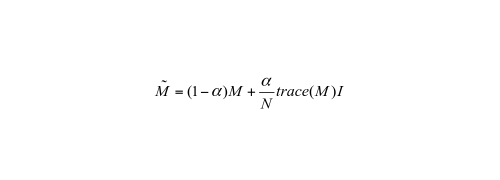
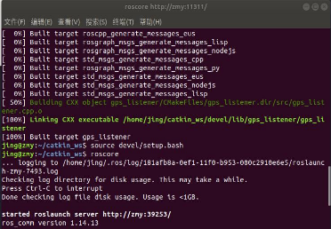
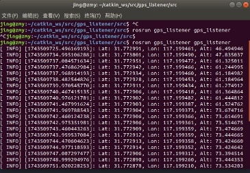

# 智能无人飞行器设计报告

<table>
<colgroup>
<col style="width: 36%" />
<col style="width: 63%" />
</colgroup>
<thead>
<tr>
<th>学院</th>
<th style="text-align: left;"><u>计算机与信息学院</u></th>
</tr>
</thead>
<tbody>
<tr>
<td>专 业 班 级</td>
<td style="text-align: left;"><u>物联网 xx级-x班</u></td>
</tr>
<tr>
<td>学生姓名及学号</td>
<td style="text-align: left;"><u>Xxx xxxxxxxx</u></td>
</tr>
<tr>
<td>指导教师</td>
<td style="text-align: left;"></td>
</tr>
<tr>
<td>课题名称</td>
<td style="text-align: left;"></td>
</tr>
<tr>
<td colspan="2">20xx年xx月xx日</td>
</tr>
</tbody>
</table>

## 1. 课题概述

（正文小四、宋体，行间距1.25倍行距。）课题背景、本课题来源、目的及意义。（1到2页纸，可以加二级标题，1.1 xxx 1.2 xxxx 等等）

## 2. 课题任务

描述课题的任务，即课题研究开发的具体内容，含要实现的功能以及要达到的技术指标和经济指标。（1到2页纸，可以加二级标题，2.1 xxx 2.2 xxx 等等）

## 3. 技术方案及关键问题

技术方案及开发平台对比论证，简述拟采用的方法、步骤和开发平台，以及其中的关键问题是什么，并给出解决关键问题的思路和方法。（2到4页纸，可以加二级标题，3.1 xxx 3.2 xxx 等等）

## 4. 设计实现及测试

具体实现过程，包括设计开发的基础知识、基本原理、基本理论；设计实现分为哪几个步骤；硬件接线及调试原理介绍、算法结构和原理介绍；实验平台、实验过程及实验结果；实验结果的分析、对比，一定要有分析、对比。

（此部分为重点阐述内容，10到20页纸，可以加二级标题，4.1 xxx 4.2 xxx 等等。注意，一定要阐述清楚，站在读者的角度去写，要先总后分，先给思路，再具体展开。能让大二的学生能看懂，看了以后能按照你的方法做出来。正文里面**要将自己填充部分的代码附上**，**并附上该代码运行结果的终端结果和调试中飞机对应效果，该部分为重点考察项**。某些重要函数的功能、参数可以在正文中说明。）

需要在正文或者附录中给出相应的公式、表格、框图、电路原理图、程序流程图、成果截图（截图中必须有自己的学号，不能使用指导书中附带的截图，更不能用别人的截图）等。

相关公式、图、表格的格式如下：

（1）公式要用公式编辑器编辑，居中排版，公式序号行右对齐。第二章第一个公式举例如下：

 （2.1）

（公式居中，公式序号2.1 要右对齐）

（2）图居中，大小合适，排列紧凑，要有图序号及图题，图号及图题在图下方，图号及图题及图中文字的字体比正文字体小一号。子图也要有序号。第三节第2个图举例如下：

(a)xxx (b)xxx

图4.1实验终端运行截图示例

（图布局合理，居中，大小合适。图号、图题在图的正下方。图号、图题及图中文字的字体大小比正文字体要小1号）

（3）表格也要居中，大小合适，栏目大小紧凑，布局合理，要有表序号及表题，表号及表题在表的正上方。表号及表题及表中文字的字体比正文字体要小1号。第三节第4个表举例如下：

表4.2 YOLO5模型训练准确率

<table style="width:35%;">
<colgroup>
<col style="width: 13%" />
<col style="width: 10%" />
<col style="width: 10%" />
</colgroup>
<thead>
<tr>
<th style="text-align: center;">Methods</th>
<th style="text-align: center;"></th>
<th style="text-align: center;">Accuracy</th>
</tr>
</thead>
<tbody>
<tr>
<td>
xxxxx[9]

Ours
</td>
<td style="text-align: center;"></td>
<td style="text-align: center;">
94

<em>96</em>
</td>
</tr>
</tbody>
</table>

## 5. 课程设计总结

任务完成情况，创新点以及不足之处，改进的思路（1-2页即可，不要图、表）

## 6. 参考文献

正规出版的书籍、期刊论文和学术会议论文可以作为参考文献。文献要在文中引用处正确标注\[10\]（\[序号\]上标）。（5篇以上）

1)  期刊论文格式

> \[序号\] 作者.论文名称\[J\].期刊名称，出版年份，卷号（期号），页码范围.举例如下
>
> \[1\] 范彩霞, 朱虹, 蔺广逢, 等. 多特征融合的人体目标再识别\[J\]. 中国图象图形学报, 2013, 18(6): 711-717.

（2）会议论文格式

> \[序号\] 作者.论文名称\[C\].会议名称，会议年份，页码范围.举例如下
>
> \[2\] Kostinger M., Hirzer M., Wohlhart P. Large scale metric learning from equivalence constraints\[C\]. IEEE Conference on Computer Vision and Pattern Recognition, 2012: 2288-2295.

（3）书籍文献格式

> \[序号\] 作者.书籍名称\[M\]. 出版地：出版社，出版年份，页码范围.举例如下：
>
> \[13\] 黄卫华，方康玲. [模糊控制系统及应用](http://210.45.242.5:8080/opac/openlink.php?title=%E6%A8%A1%E7%B3%8A%E6%8E%A7%E5%88%B6%E7%B3%BB%E7%BB%9F%E5%8F%8A%E5%BA%94%E7%94%A8) \[M\]. 北京:电子工业出版社,2012：1-173.
