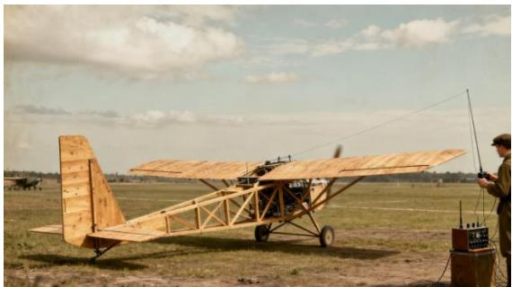
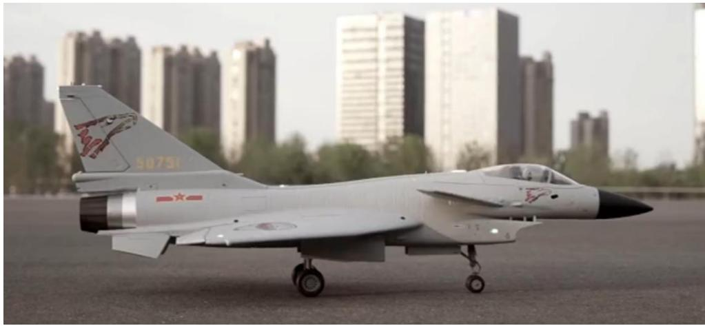
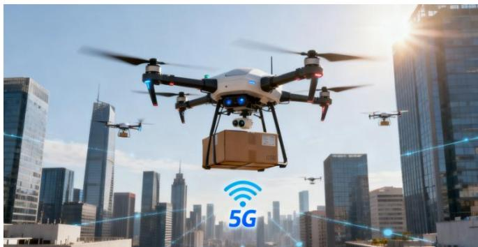

## 1.2.发展历程

## （1）萌芽阶段（20 世纪初 - 20 世纪 80年代）：军事雏形期

智能无人机的发展可追溯至20世纪初期，其最初形态主要服务于军事需求。如图1.1所示，1917年英国研制的“喉”式无人机被认为是现代无人机技术的雏形，主要用于靶机与简易侦察任务。此阶段的无人机高度依赖无线电遥控，缺乏环境感知与自主决策能力，其飞行稳定性和可靠性受限于当时的材料工艺、控制理论及电子技术水平。

20世纪50-70年代，随着自动控制理论和航空电子技术的发展，美国相继研制出“火蜂”等无人机系统，初步引入预设航迹和简单自动驾驶功能，但其传感器精度低、信息处理能力有限，仍难以适应复杂飞行环境。总体而言，该阶段无人机技术尚处于探索与验证阶段，系统智能化水平较低，应用范围几乎完全局限于军事领域，为后续技术突破奠定了基础。

natural_image

Exterior view of a wooden biplane on a grassy field with a person operating equipment (no visible text or symbols)

图 1.1 英国“喉”式无人机

## （2）发展阶段（20 世纪 90 年代 - 21 世纪 10 年代）：技术突破与民用拓展

进入20世纪90年代后，全球导航卫星系统（GPS）、微机电系统（MEMS）传感器以及嵌入式计算平台的成熟，为无人机的小型化、低成本化和功能集成提供了关键支撑。无人机开始从单一军事用途向民用领域拓展，农业监测、航拍测绘等应用逐渐出现。21世纪以来，消费级无人机市场迅速兴起，2010 年前后以大疆 Phantom 系列为代表的产品降低了操作门槛，推动无人机技术的普及。该阶段标志着无人机从“专用装备”向“通用平台”转变，智能化水平显著提升，但自主决策仍以规则和人工干预为主。如图1.2所示，合肥工业大学北斗导航实验室自主研发的“小十”实现了长航时飞行与侦察打击一体化，显著提升了任务执行能力，推动无人机向多功能化方向发展。

natural_image

Model of a military jet on a tarmac with city buildings in the background (no visible text or symbols)

图 1.2 合肥工业大学自研“小十”

## （3）成熟阶段（21 世纪 20 年代至今）：智能升级与全域应用

近年来，人工智能、深度学习、5G 通信和边缘计算等新一代信息技术的快速发展，使智能无人机进入全面智能化阶段。如图1.3所示，无人机不再仅依赖预设指令执行任务，而是具备多源信息融合、环境理解与自主决策能力，能够在复杂动态环境中实现自主飞行与任务调整。 在应用层面，智能无人机已广泛服务于物流配送、应急救援、城市治理、电力巡检等领域，多机协同与集群控制技术逐步成熟，可实现任务分工与协同作业。同时，低空通信网络和卫星通信的发展显著提升了远程控制与数据传输能力。总体来看，该阶段的智能无人机呈现出高度智能化、系统协同化和应用场景多元化的特征，成为新型空天信息体系和智慧社会建设的重要组成部分。

natural_image

Drones flying over a city skyline with 5G network icon overlay (no text or symbols on drones or cityscape)

图 1.3 现代智能无人机