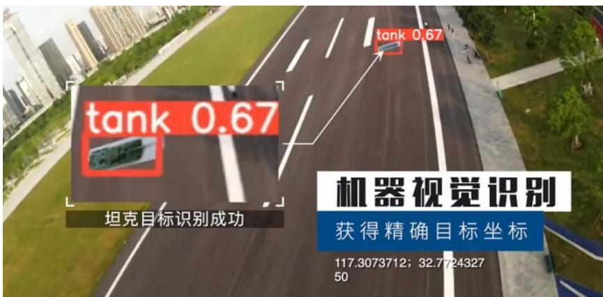
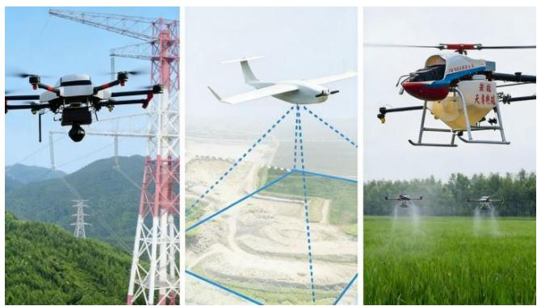
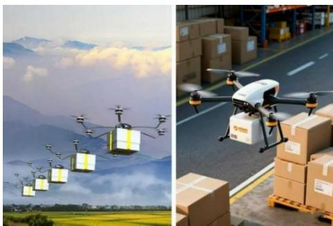
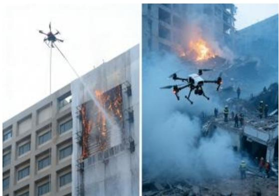
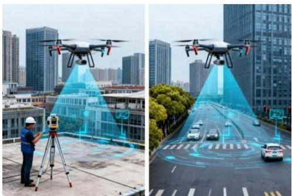
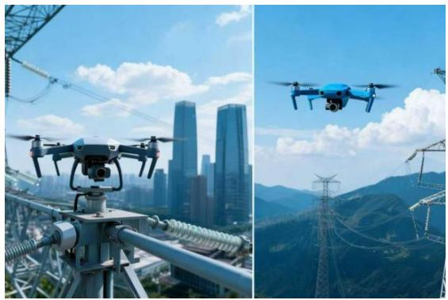

## 1.4.主要应用领域

## （1）军事领域

侦察监视：高空长航时无人机获取战场情报，如图1.4所示，“小十”完成坦克识别任务。目标打击：攻击型无人机（“死神”“翼龙”“彩虹”）实现精准打击，作战成本低。通信中继：复杂地形搭建临时通信链路。电子对抗：干扰敌方雷达与通信系统。

text_image

tank 0.67
坦克目标识别成功
tank 0.67
机器视觉识别
获得精确目标坐标
117.3073712; 32.7724327
50

图 1.4 合肥工业大学“小十”无人机完成投弹目标锁定

## （2）民用领域

农业领域：如图1.5所示，植保作业：效率为人工10-20倍，节省农药30%-50%，实现 “飞手 less” 自主作业。农田监测：多光谱/高光谱数据支撑作物长势与病虫害分析。播种施肥：精准控制密度与用量，提升发芽率与利用率。

natural_image

Three-panel image showing agricultural drones in various settings: high-voltage power tower, drone with ground plane, and aerial farm spraying crops (no visible text or symbols)

图 1.5 无人机在农业领域的应用

物流配送领域：如图 1.6 所示，城市配送：京东 “京鸿”、顺丰无人机等试点，配送时间从小时级缩短至分钟级。农村配送：解决偏远地区 “进村入户” 难题，中国邮政已开展多省份试点。应急配送：灾害场景投送食品、药品等物资，疫情期间减少人员接触。

natural_image

Two-panel image showing a delivery drone flying over mountainous terrain and a drone carrying boxes on a warehouse (no text or symbols visible)

图 1.6 无人机在物流领域的应用

应急救援领域：如图1.7所示，搜索救援：红外/激光雷达快速定位失联人员，提升山区 / 森林搜救效率。灾情监测：获取灾害现场影像，支撑救援决策。物资投送：道路中断场景精准投送应急物资。通信保障：搭建临时通信网络，保障救援信息交互。

natural_image

Two-panel image showing a multi-story building with fire damage and a drone in flight over a debris-filled urban area (no visible text or symbols)

图 1.7 无人机在应急救援领域的应用

城市治理领域：如图1.8所示，交通管理：巡逻监控、违章抓拍、事故勘查，缓解交通拥堵。城管执法：违建排查、占道经营整治、污染行为监测。环境监测：实时检测空气质量、水体质量与扬尘污染。城市测绘：快速生成三维模型与数字地图，支撑规划建设。

natural_image

Two-panel image showing a person using a surveying instrument on a rooftop and another with a drone in flight over a city street (no visible text or symbols)

图 1.8 无人机在城市治理领域的应用

电力与能源领域：如图1.9所示，电力巡检：国家电网、南方电网大规模应用，效率提升 5-10 倍，降低人工风险。油气管道巡检：检测泄漏、腐蚀与第三方破坏，气体传感器辅助定位泄漏点。新能源运维：光伏组件热成像检测、风机叶片损伤排查。

natural_image

Two-panel image showing a drone on a high-voltage transmission tower and a blue drone flying over a mountainous landscape with power lines (no visible text or symbols)

图 1.9 无人机在电力能源领域的应用