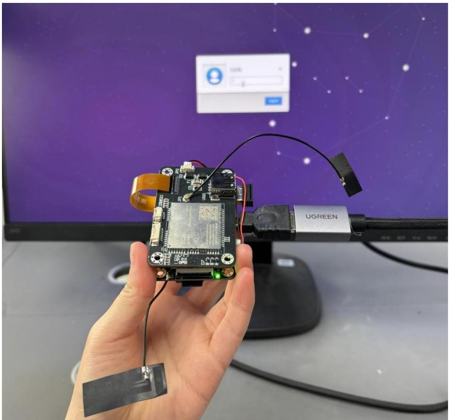
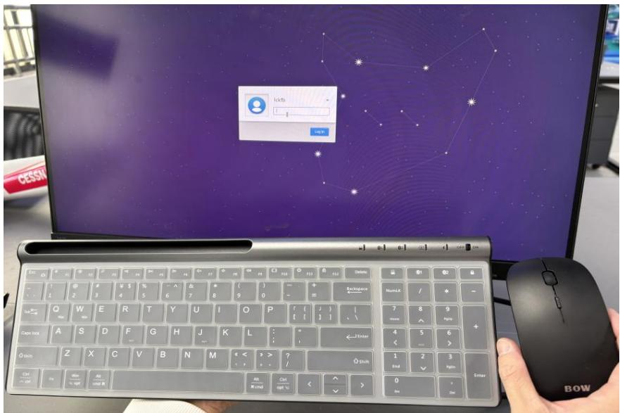
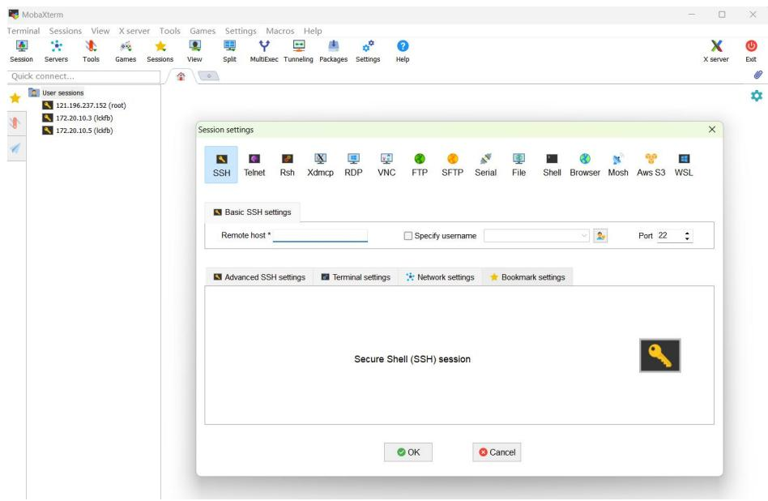
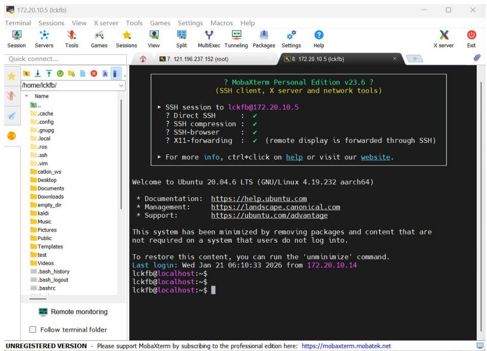

## 附录 B MobaXterm（泰山派上位机）操作说明

泰山派（RK3566）作为机载嵌入式计算平台，可独立运行 Linux 操作系统。为便于在地面阶段进行网络配置、程序部署、日志查看与调试，通常采用“本地直连操作 + 远程SSH运维”相结合的方式：在需要时通过显示器、键盘、鼠标完成基础网络接入与参数检查；在常规运维场景下使用 MobaXterm 建立 SSH远程会话，实现命令行操作与文件传输的一体化管理。

为避免异常显示或系统不稳定，泰山派建议使用电源适配器供电。实践中，供电能力不足可能导致终端显示乱码、外设间歇掉线等现象，影响调试效率与结果判读。

步骤一：本地直连

将泰山派通过HDMI 接口连接至显示屏，如图1所示：

natural_image

Hand holding an Arduino Uno connected to a UGREEN cable via cable, with a computer monitor and starry background (no readable text or symbols)

图1 泰山派连接至显示屏

并通过USB接入鼠标及键盘，完成本地交互操作与网络接入。如图2所示：

text_image

Computer screen displaying a star map login interface with username and password fields, alongside a keyboard and mouse.

图2 泰山派连接鼠标及键盘

进入系统后，输入开机密码：lckfb，在桌面右上角找到 WIFI 图标连接无线网络，找到我们打开的手机热点，正常输入热点密码进行连接即可，用于为后续SSH 远程连接建立可达链路。完成无线网连接后，在桌面右键打开终端并输入ifconfig 查看网络接口信息，并记录当前IP 地址（例如：172.20.10.5），不同的局域网环境下IP 地址可能变化，SSH 连接时需以当次实际获取的地址为准。若网络环境保持不变，IP 通常保持稳定，可直接复用已保存的 SSH 会话配置。

步骤二：在MobaXterm 中使用SSH远程连接泰山派。

在 MobaXterm 主界面选择“Session”，新建“SSH”会话。在远程主机（Remotehost）中填写泰山派 IP 地址，在用户名处填写系统用户名（本实验是： lckfb），端口保持默认 22，如图3所示：

text_image

MobaXterm
Terminal Sessions View X server Tools Games Settings Macros Help
Session Servers Tools Games Sessions View Split MultiExec Tunneling Packages Settings Help
Quick connect...
User sessions
121.196.237.152 (root)
172.20.10.3 (icfb)
172.20.10.5 (icfb)
Session settings
SSH Telnet Rsh Xdmcp RDP VNC FTP SFTP Serial File Shell Browser Mosh Aws S3 WSL
Basic SSH settings
Remote host *
Specify username Port 22
Advanced SSH settings Terminal settings Network settings Bookmark settings
Secure Shell (SSH) session
OK Cancel

图3SSH远程连接泰山派

点击 $^ { 6 6 } \mathrm { O K } ^ { 5 9 }$ 后，首次连接可能出现主机指纹（Host key）确认提示，确认后输入密码完成登录。成功进入后可看到泰山派终端界面与命令提示符，表明网络链路与身份认证均已建立，如图 4所示：

text_image

? MobaXterm Personal Edition v23.6 ?
(SSH client, X server and network tools)
► SSH session to lckfb@172.20.10.5
? Direct SSH : ✓
? SSH compression : ✓
? SSH-browser : ✓
? X11-forwarding : ✓ (remote display is forwarded through SSH)
► For more info, ctrl+click on help or visit our website.
Welcome to Ubuntu 20.04.6 LTS (GNU/Linux 4.19.232 aarch64)
* Documentation: https://help.ubuntu.com
* Management: https://landscape.canonical.com
* Support: https://ubuntu.com/advantage
This system has been minimized by removing packages and content that are not required on a system that users do not log into.
To restore this content, you can run the 'unminimize' command.
Last login: Wed Jan 21 06:10:33 2026 from 172.20.10.14
lckfb@localhost:~$
lckfb@localhost:~$
lckfb@localhost:~$

图 4 RK3566 终端界面

建议将该 SSH 会话保存为固定名称（如“RK3566-SSH”），并在会话备注中记录：常用 IP、用户名、用途（部署/调试/日志）。当 IP 变更时，仅需更新会话的 Remotehost 字段即可，避免重复配置。

远程登录后可执行常规 Linux 指令完成工程管理与状态检查，例如：目录切换、文件查看、进程查看、网络连通性确认等。