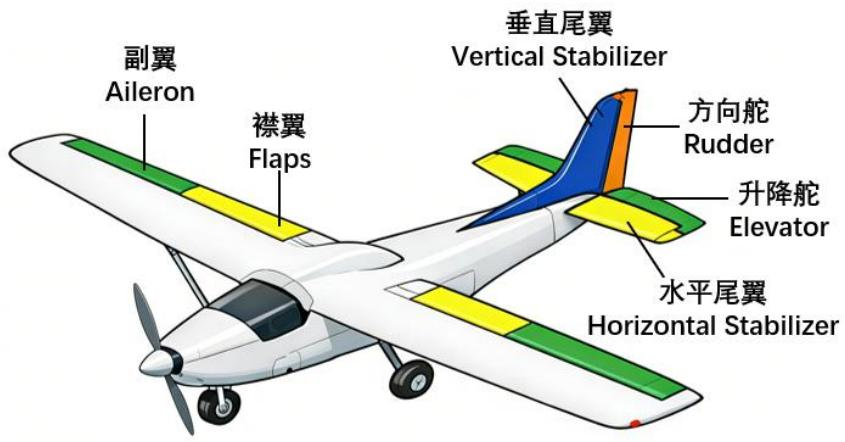
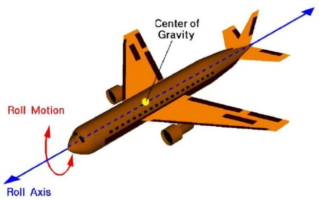
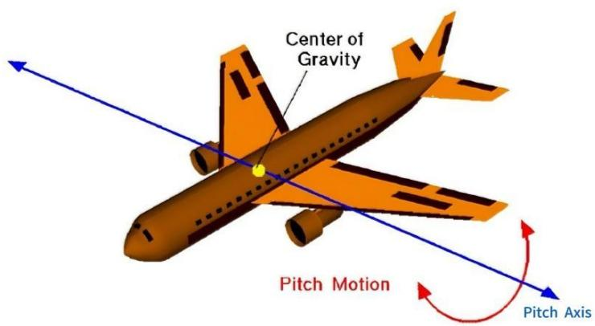
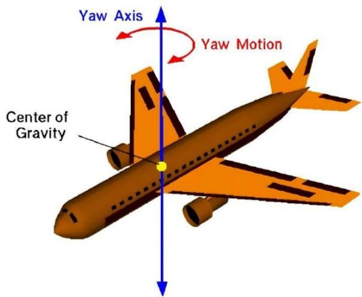

## 第二章 基础知识与准备工作

本章将系统阐述无人机的基础知识及相关准备工作。固定翼无人机作为无人机的重要类型，具备飞行速度快、续航能力强等特点，但其不具备悬停能力，且操控复杂度较高。因此，扎实掌握无人机的基础知识，对于确保固定翼无人机的安全与高效运行至关重要。

## 2.1固定翼无人机的飞行原理

从飞行技术原理角度，无人机主要可分为固定翼无人机与旋翼无人机两大类。

旋翼无人机依靠多个旋翼（常见为四旋翼、六旋翼或八旋翼）的高速旋转产生升力，并通过调节各旋翼的转速差来实现姿态控制与平移运动。该类无人机具有垂直起降能力，动力系统通常由电机驱动螺旋桨，多采用锂电池供电，续航时间一般相对较短。

固定翼无人机的升力则主要来源于其机翼的翼型结构。在飞行过程中，气流经过机翼上下表面时产生气压差，进而形成升力。固定翼无人机需依靠动力系统推动前进，在达到一定空速后，机翼方可产生足够升力以维持飞行。该类无人机可采用燃油发动机或大容量电池作为动力来源，续航时间较长，适用于远距离巡航任务。

固定翼无人机的机翼结构主要包括主翼、垂直尾翼与水平尾翼。其操纵面主要包括副翼、升降舵和方向舵，具体结构如图2.1所示：

text_image

副翼
Aileron
襟翼
Flaps
垂直尾翼
Vertical Stabilizer
方向舵
Rudder
升降舵
Elevator
水平尾翼
Horizontal Stabilizer

图 2.1 固定翼无人机机翼组成

副翼用于实现无人机的横滚控制。通过左右副翼的差动偏转（一侧向上、另一侧向下），可改变两侧机翼的升力分布，从而使无人机绕纵轴滚转。

左滚转：左副翼上偏（升力减小）、右副翼下偏（升力增大） → 右侧升力大于左侧 → 机身向左滚转。

右滚转：右副翼上偏、左副翼下偏 → 左侧升力大于右侧 → 机身向右滚转。横滚控制示意图如图2.2所示：

text_image

Center of Gravity
Roll Motion
Roll Axis

图 2.2 固定翼无人机横滚控制原理

升降舵用于控制无人机的俯仰姿态。升降舵上下偏转可改变水平尾翼的迎角，进而调整机身的俯仰角。

机头上仰（爬升）：升降舵向上偏转 → 水平尾翼产生向下的附加力 → 机尾下沉、机头抬起。

机头下俯（俯冲）：升降舵向下偏转 → 水平尾翼升力增加 → 机尾抬起、机头下降。俯仰控制示意图如图2.3所示：

text_image

Center of Gravity
Pitch Motion
Pitch Axis

图 2.3 固定翼无人机俯仰控制原理

方向舵用于实现无人机的偏航控制。方向舵左右偏转时，在垂直尾翼上产生侧向气动力，进而控制机头指向。

向左偏航：方向舵左偏 → 垂直尾翼右侧受力增大 → 机尾右推、机头左转。

向右偏航：方向舵右偏 → 机尾左推、机头右转。偏航控制示意图如图2.4所示：

text_image

Yaw Axis
Yaw Motion
Center of Gravity

图 2.4 固定翼无人机偏航控制原理