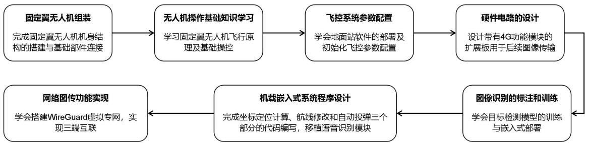
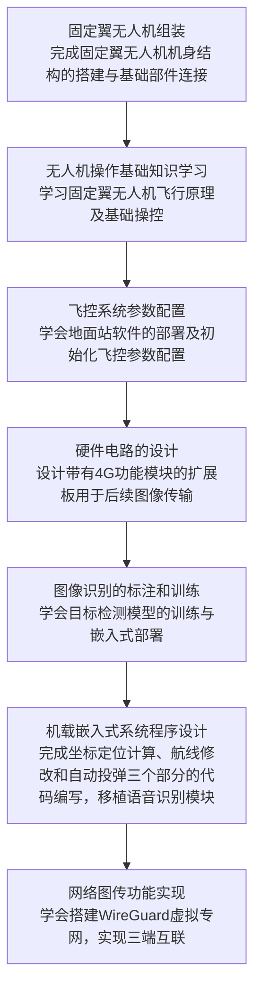
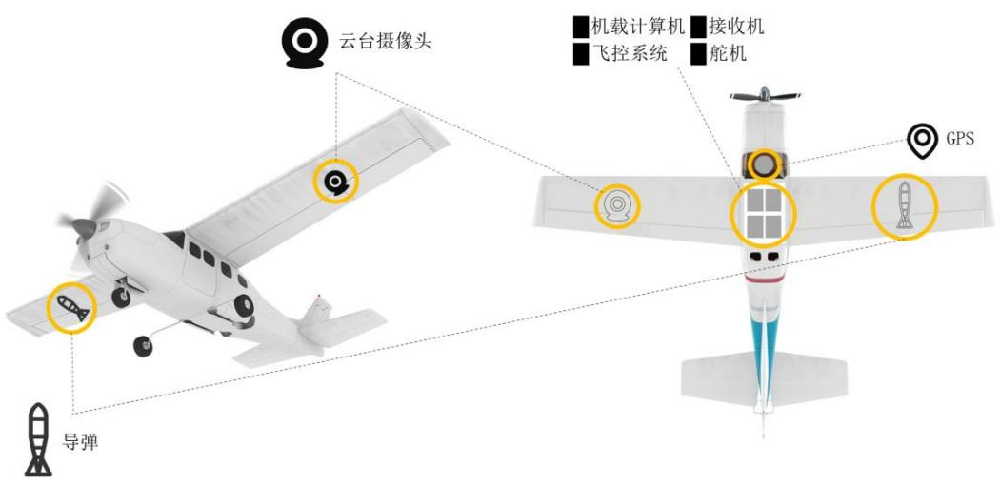
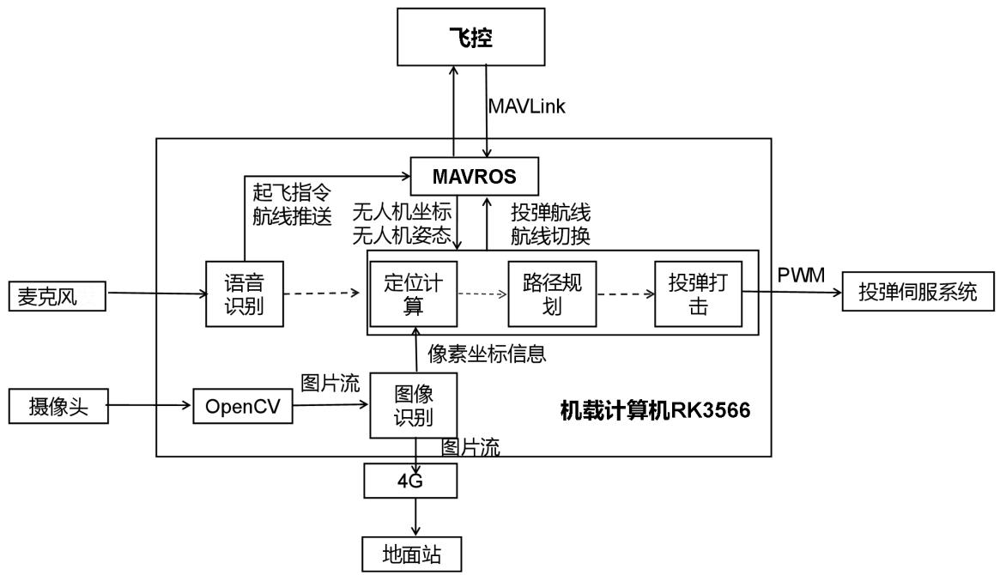
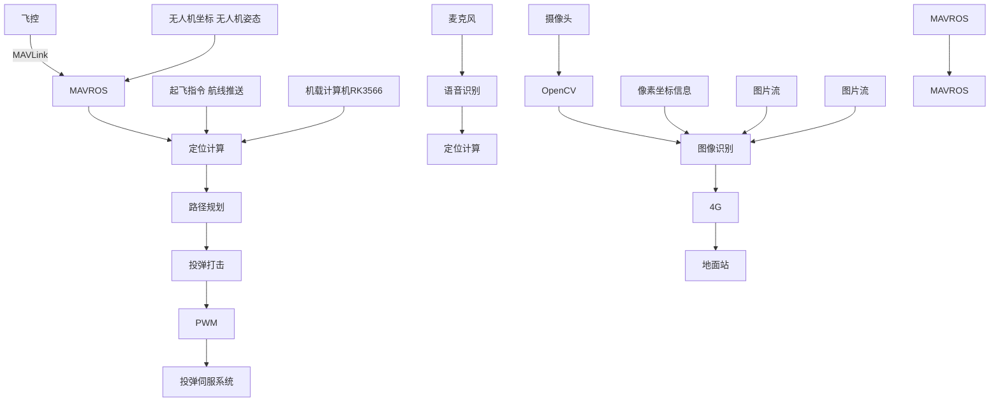
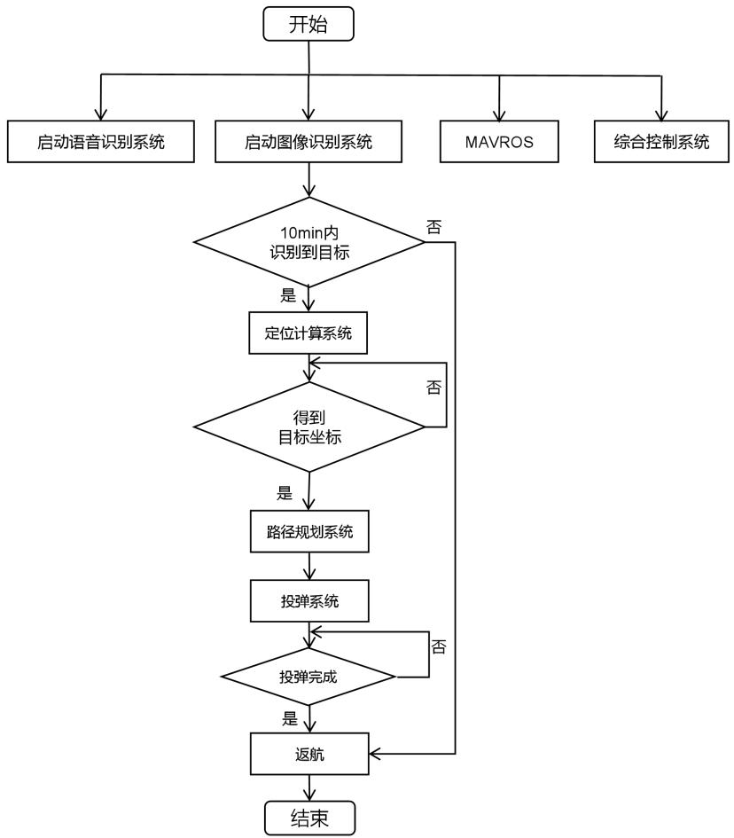
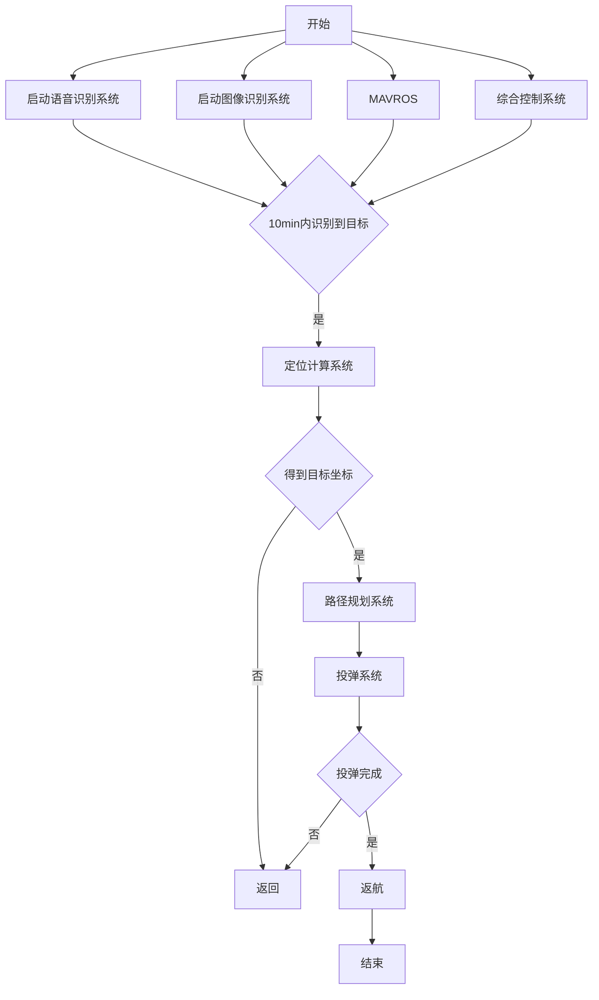
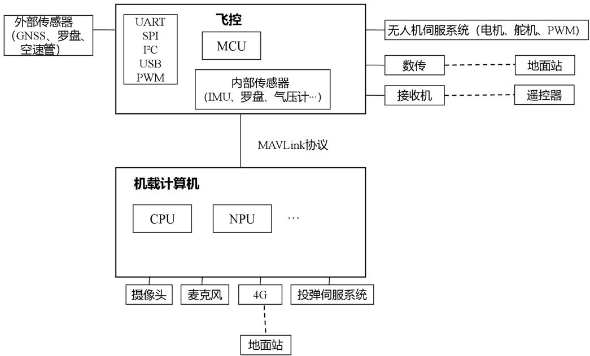
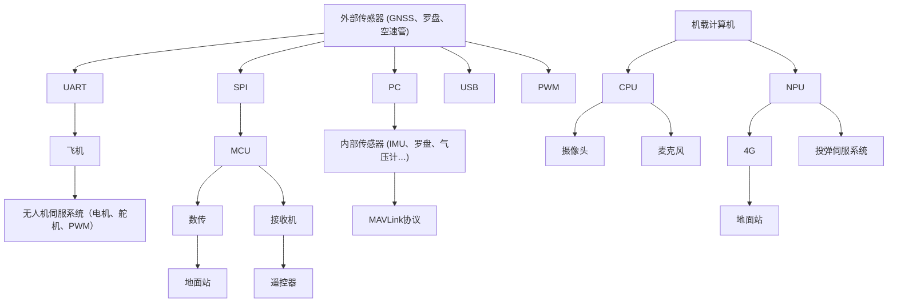

## 2.2主要设计内容及架构

## 2.2.1 实践内容

本教程的实践环节涵盖以下主要内容：（1）固定翼无人机组装（2）无人机操作基础知识学习（3）飞控系统参数配置（4）硬件电路的设计（5）图像识别的标注和训练（6）机载嵌入式系统程序设计（7）网络图传功能的实现。各实践模块关系如图2.5所示：

flowchart

图 2.5 本教程实践内容

## 2.2.2 整体架构

本实验采用的无人机整机架构如图2.6所示。机翼一侧搭载自稳云台及摄像头，另一侧配置投弹机构与仿真弹药。机身内部主要集成飞控系统与机载嵌入式计算机。飞控负责连接并控制电机、舵机、遥控接收机、GNSS 模块及云台等设备；机载嵌入式系统通过串口与飞控通信，并连接投弹执行机构。

text_image

云台摄像头
机载计算机 接收机
飞控系统 船机
GPS
导弹

图 2.6 无人机整机架构

本系统的软件架构如图2.7所示。核心功能运行于机载嵌入式系统中，主要包括语音识别、定位解算、路径规划、投弹控制、图像识别与图传等功能模块。

flowchart

图 2.7 无人机机载嵌入式系统软件架构

系统程序流程如图2.8所示。机载系统启动后，自动加载语音识别与定位投弹相关软件，接收语音指令后生成航线并发送至飞控，控制无人机起飞。抵达目标区域后，启动图像识别系统搜索目标，识别成功后进行目标定位、投弹路径规划与解算，执行打击任务后自动返航。

flowchart

图 2.8 程序流程图

硬件连接架构如图 2.9所示。飞控模块与 GNSS、电机、舵机、数传、遥控接收机等设备相连；机载嵌入式系统则集成摄像头、麦克风、投弹装置等外设。

flowchart

图 2.9 无人机机载嵌入式系统硬件架构