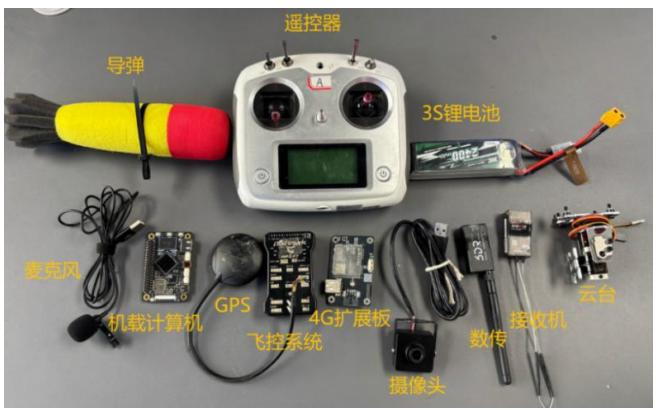
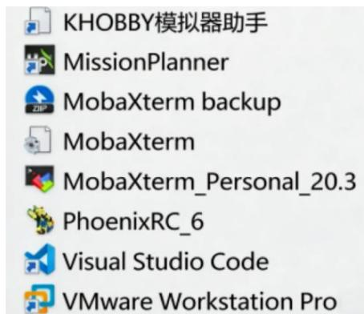

## 2.3硬件模块及软件工具介绍

本节将简要介绍固定翼无人机系统设计中所涉及的关键硬件模块与软件工具，主要包括飞控与执行机构、通信与嵌入式系统、以及地面站与开发环境等。硬件组成如图2.10所示：

text_image

导弹
遥控器
3S锂电池
麦克风
机载计算机
GPS
4G扩展板
飞控系统
云台
接收机
数传
摄像头

图 2.10 硬件组成介绍

所需主要软件工具如图2.11所示：

text_image

KHOBBY模拟器助手
MissionPlanner
MobaXterm backup
MobaXterm
MobaXterm_Personal_20.3
PhoenixRC_6
Visual Studio Code
VMware Workstation Pro

图 2.11 软件工具汇总

KHOBBY 模拟器助手和 PhoenixRC\_6：用于固定翼无人机飞行操控的模拟训练，帮助用户熟悉飞行特性与操作手感。

MissionPlanner：功能丰富的地面站软件，支持飞控参数配置、飞行数据监控与任务规划。

MobaXterm：集成了多种网络工具的上位机软件，便于远程登录与管理嵌入式设备（如泰山派开发板）及服务器，支持在Linux 环境下进行系统配置。

Visual StudioCode：轻量级代码编辑器，适用于图像识别部分的数据标注、脚本编写与模型训练相关工作。

VMware：虚拟机平台，用于在本地计算机中构建与运行不同的操作系统环境，便于软件兼容性测试与交叉开发。