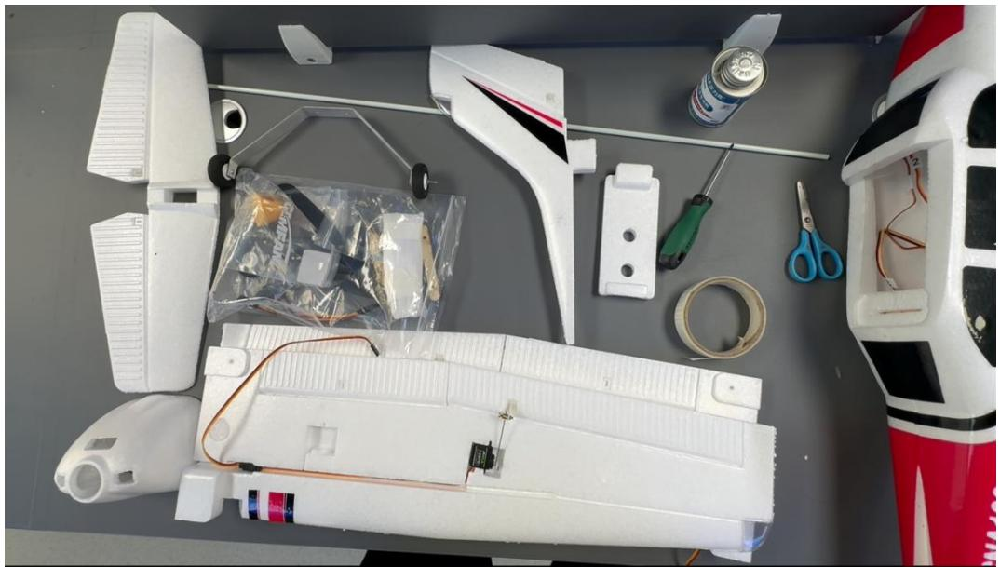
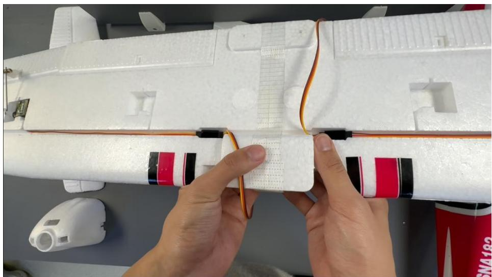
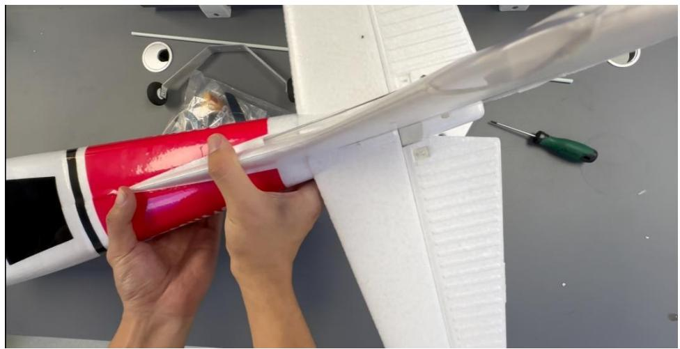
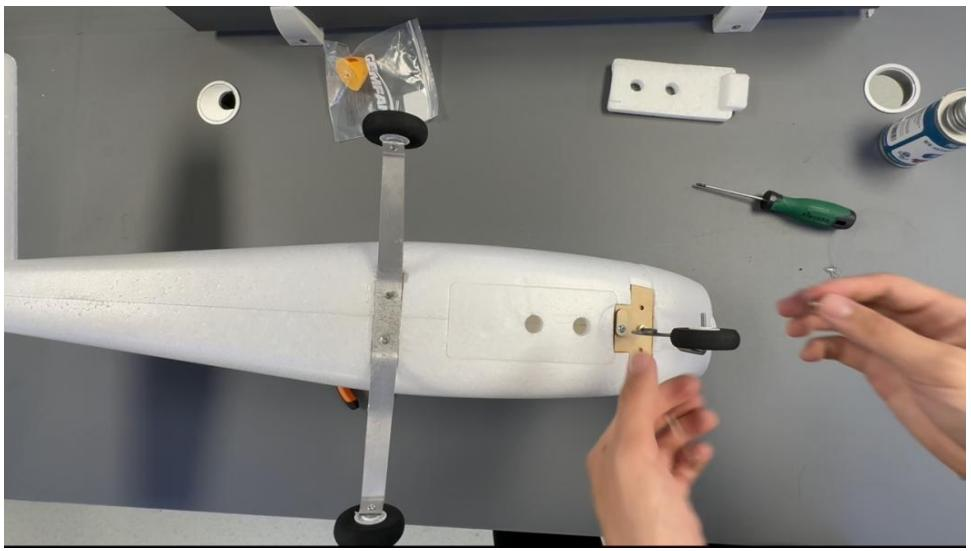
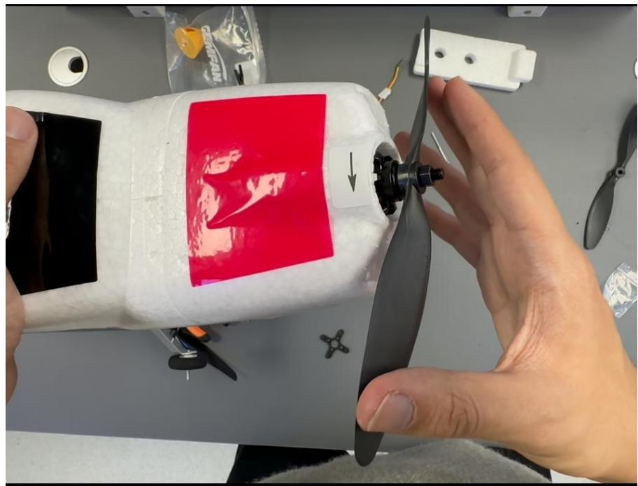
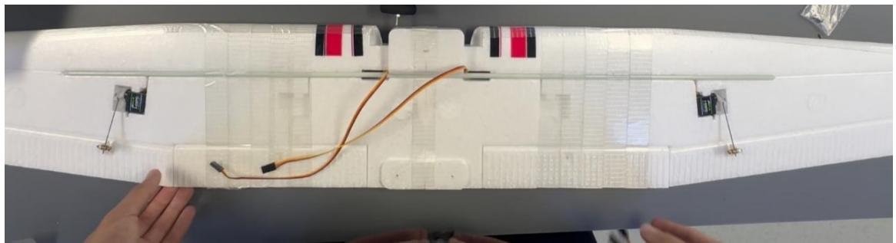
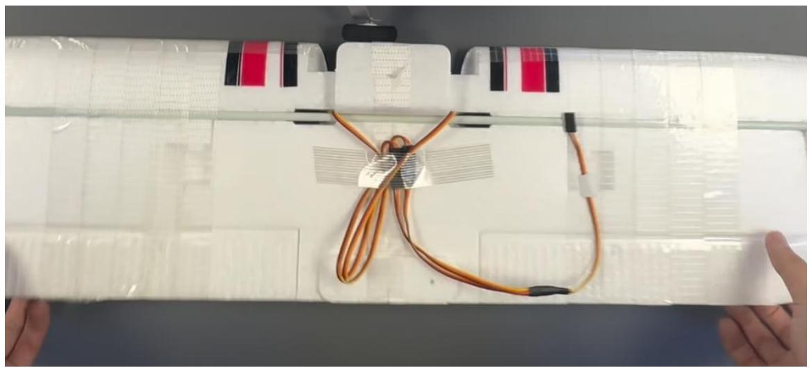
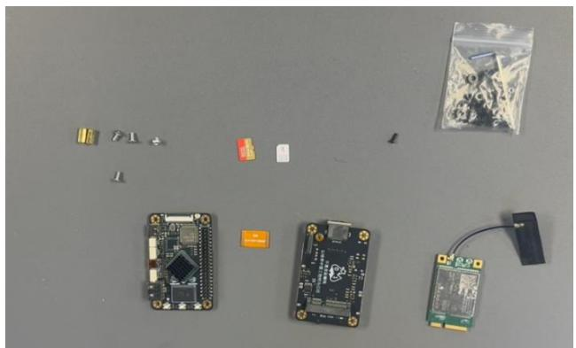
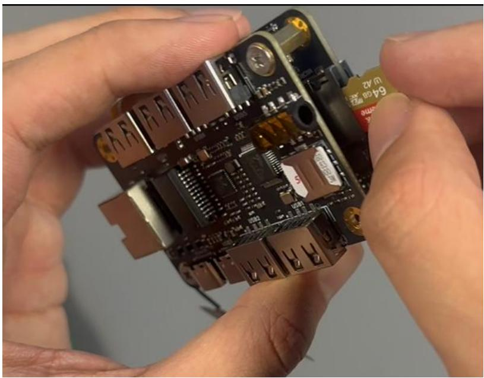

## 第三章 固定翼无人机装配、调试与试飞

## 3.1 实验一：塞斯纳无人机模型组装

## 3.1.1 实验目的

本实验旨在使学生掌握塞斯纳固定翼无人机模型的完整组装流程与关键部件的安装方法，理解各部件在飞行中的功能与作用；学习 RK3566 开发板与4G通信模块（EC20）的硬件集成技术，完成无人机智能控制平台的初步搭建；培养规范操作意识与系统调试能力，为后续实验奠定硬件基础。

## 3.1.2 实验说明

学生通过此次实验将熟悉塞斯纳模型固定翼无人机的机体结构组成及其装配流程。理解各部件的装配要点与连接逻辑。具备独立完成无人机初次组装与调试的能力。

## 3.1.3 实验步骤

准备工具：泡沫专用胶、螺丝刀、剪刀、纤维胶带。所用工具如图3.1所示：

natural_image

Top-down view of a white plastic model airplane with visible wiring, scissors, and components laid out on a gray surface (no text or symbols)

图 3.1 所用工具一览图

步骤一：组装机翼

将左右两片机翼对接，在连接处涂抹适量泡沫胶，使用纤维胶带将其固定，确保机翼紧密粘合，静置一小时，等待胶水固化。如图3.2所示：

natural_image

Close-up of hands assembling a white model airplane body with visible wiring and components (no text or symbols)

图 3.2 安装机翼

步骤二：安装水平尾翼、垂直尾翼以及轮毂

在水平尾翼及垂直尾翼的对应位置涂抹适量泡沫胶进行粘合固定。如图3.3所示：

natural_image

Close-up of hands assembling a red and white model airplane with a transparent blade, no visible text or symbols

图 3.3 安装水平尾翼和垂直尾翼

安装轮毂：后轮放入对应孔位，插入短螺丝固定，可在螺丝处少量点胶加固，前轮使用内六角螺丝固定，确保前轮能灵活转动。如图3.4所示：

natural_image

Close-up of hands assembling a white model airplane on a workbench, surrounded by tools and components (no visible text or symbols)

图 3.4 安装轮毂

## 步骤三：安装螺旋桨

取出螺旋桨配件包，将圆盘对准电机上的三个安装孔，用螺丝固定，接着垫上垫片，使螺旋桨的标识面朝外，最后拧紧螺母。操作如图3.5所示（注意：螺旋桨方向不可装反，否则会影响起飞动力）：

natural_image

Close-up of a hand using a white sewing machine to adjust a propeller, with no visible text or symbols on the device itself.

图 3.5 安装螺旋桨

## 步骤四：加固机翼

取出胶水固化好的机翼从中间剪开纤维胶带，插入机身骨架至孔道中。可在孔道处涂抹少量泡沫胶增强稳固，并适当压紧贴合。为提升机身强度，可在机翼正面加装木片，并缠绕纤维胶带加固，便于后续安装摄像头、云台和投弹舵机模

块。如图3.6所示：

natural_image

Close-up of a white plastic model with orange wires and connectors, held by hands (no visible text or symbols)

图 3.6 机翼加固处理

步骤五：连接舵机

使用一分二舵机连接线，将左右机翼内的两路舵机信号线进行汇总，预留接口用于后续接入飞控系统。完成连接后，应整理线缆，避免拉扯如图3.7所示：

natural_image

Close-up of hands holding a transparent plastic sheet with coiled orange wires and red-and-black striped strips, no visible text or symbols.

图 3.7 连接机翼的两个舵机

步骤六：RK3566 开发板、扩展板及4G模组的组装准备 SD 卡与 SIM 卡。如图3.8所示：

natural_image

Top-down view of various electronic components including a microcontroller, resistors, and a circuit board (no visible text or symbols)

图 3.8 所需物品一览图

注：在第五章之前，我们用到的是官方扩展板，包含4G功能，在后续的第五章节我们会带大家焊接一个 4G扩展板。

将 EC204G 模组插入开发板扩展槽内，使用配套螺丝进行固定；随后插入SIM 卡，并通过 FPC 软排线将模组连接至 EXP 扩展接口（注意排线方向，避免反接）。用铜柱支撑并固定整个模组，最后将SD卡插入卡槽。如图3.9所示：

natural_image

Close-up of hands holding a small electronic circuit board with visible components and connectors (no readable text or symbols)

图 3.9 插入 SIM 与 SD 卡