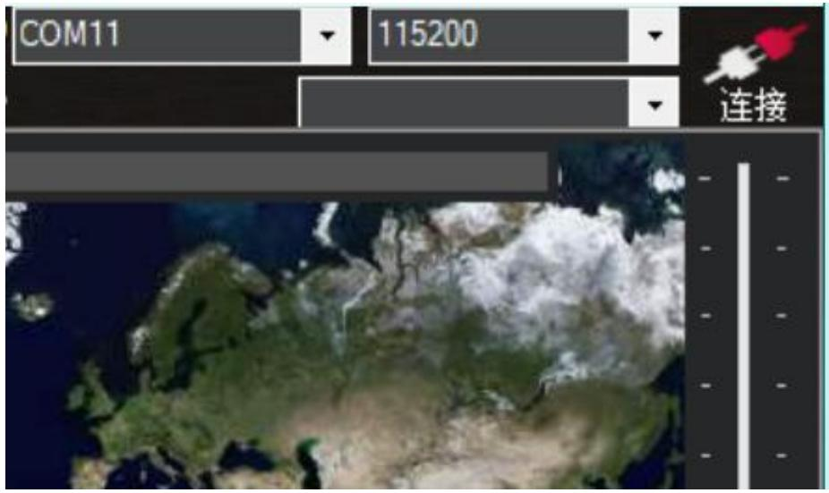
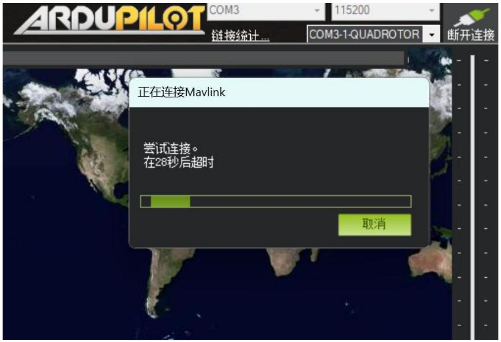
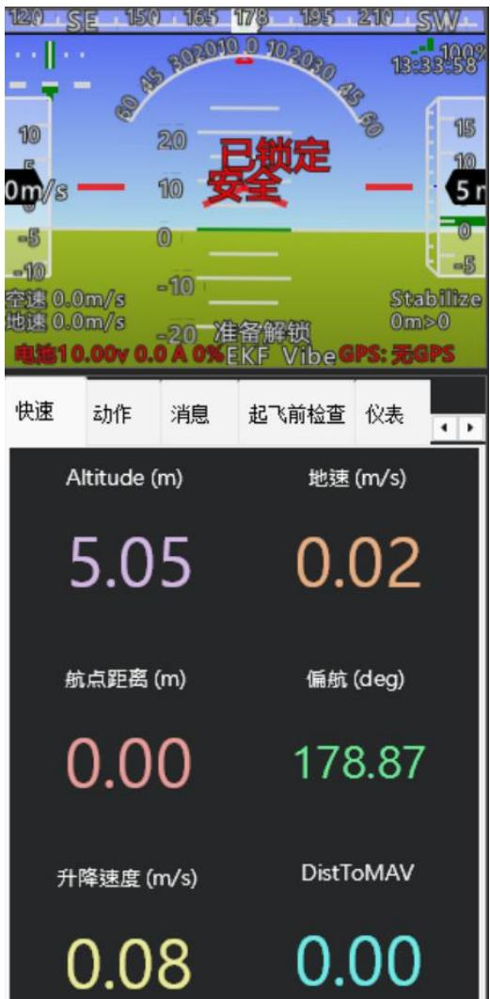
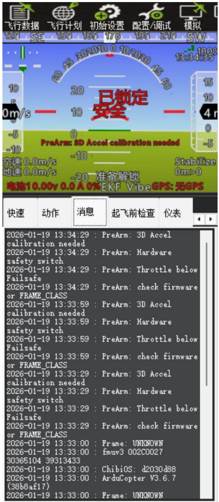
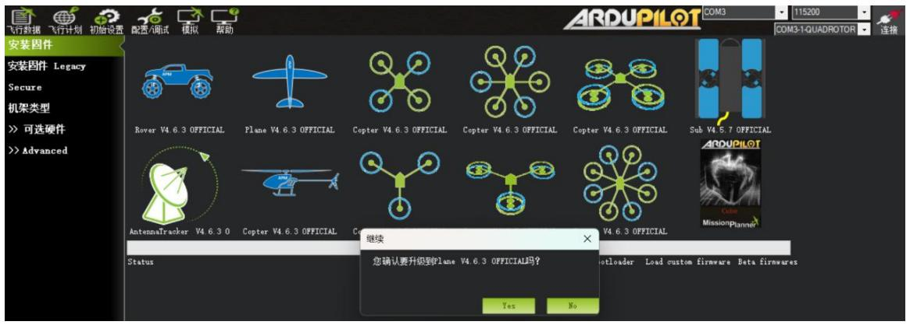
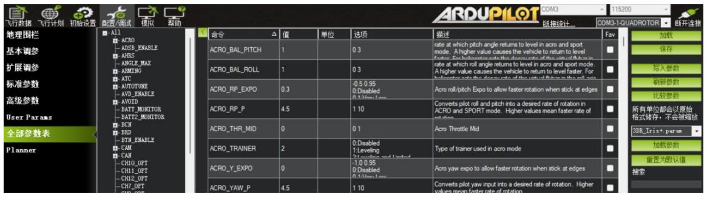
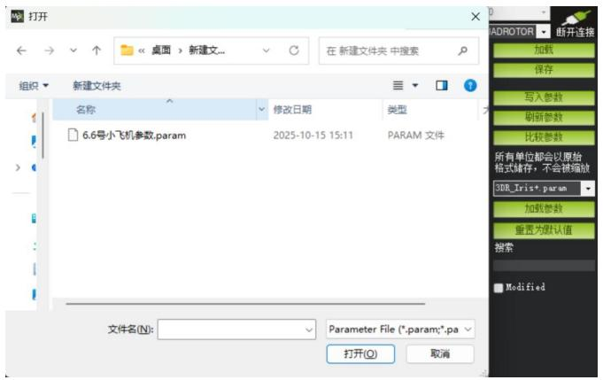
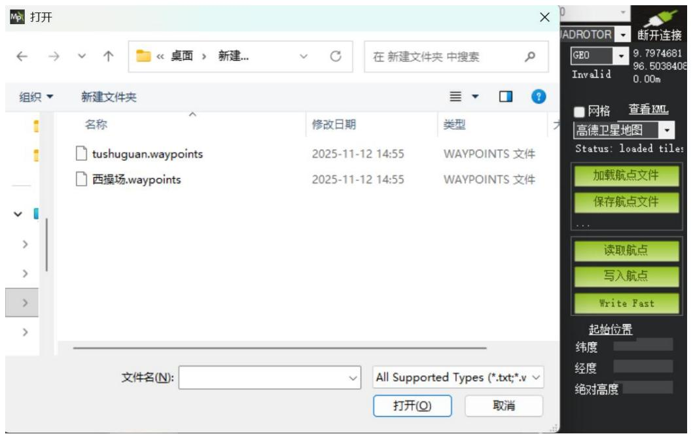
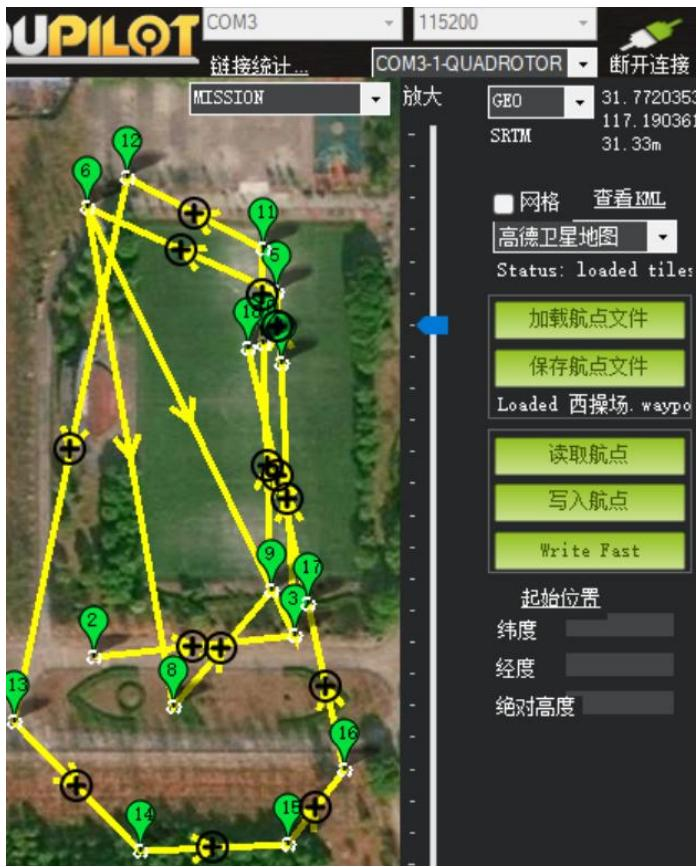

## 3.2 实验二：飞控固件升级及参数烧录

## 3.2.1 实验目的

本实验旨在使学生掌握Pixhawk飞控与Mission Planner地面站软件的连接与通信配置方法；学习查看飞控固件版本，并通过MissionPlanner 完成固件下载与烧录操作；掌握基础参数文件的加载、写入与备份流程，以及航点任务文件的导入与导出方法，为后续自主飞行任务奠定基础。

## 3.2.2 实验说明

本实验为Pixhawk 飞控系统的首次配置与初始化实验，主要内容包括：飞控与MissionPlanner的通信建立、固件版本确认与升级、基础参数文件加载与写入、航点任务文件的上传与读取。实验需使用Pixhawk 飞控、数据线、电脑及MissionPlanner 软件，并准备好预设参数文件（.param）和航点文件（.waypoints）。

## 3.2.3 实验步骤

步骤一：连接飞控

使用数据线连接飞控与电脑，打开Mission Planner，在串口选项中选择识别到的COM口（如COM11），波特率设置为 115200，点击“连接”（图3.10）。

text_image

COM11
115200
连接

图 3.10 串口与波特率选择

若连接成功，页面应如图3.11所示。若连接超时，请检查：COM 口选择是否正确、波特率是否匹配、是否使用了数据线（而非仅充电线）。

text_image

ARDUPILOT
COM3
115200
链接统计...
COM3-1-QUADROTOR
断开连接
正在连接Mavlink
尝试连接。
在28秒后超时
取消

图 3.11 飞控成功连接示意图

步骤二：熟悉地面站软件初始界面

连接成功后，Mission Planner 左上角将显示虚拟飞行仪表界面如图 3.12 所示。此界面可实时反映飞控当前的姿态状态，下方数据栏显示高度、地速、航点距离、偏航、升降速度等。

注：新飞控若未安装 GPS，高度数据可能略有偏差，因当前测量依赖气压计。

text_image

120 SE 150 165 178 195 210 SW
13:33:58
10
0m/s
空速 0.0m/s
地速 0.0m/s
-5
-10
-10
-20 准备解锁
Stabilize
0m>0
电池10.00v 0.0 A 0% EKF Vibe GPS: 无GPS
快速 动作 消息 起飞前检查 仪表
Altitude (m) 地速 (m/s)
5.05 0.02
航点距离 (m) 偏航 (deg)
0.00 178.87
升降速度 (m/s) DistToMAV
0.08 0.00

图 3.12 地面站软件初始界面

## 步骤三：固件升级步骤

点击软件上方“消息（Messages）”栏，查看当前飞控所运行的固件版本信息，如图3.13所示：

text_image

飞行数据 飞行计划 初始设置 配置/调试 模拟
120 SE 150 165 178 195 210 SW
已锁定
安全
PreArm: 3D Accel calibration needed
空速 0.0m/s -10 Stabilize
地速 0.0m/s 0m>0
-20 准备解锁
电池10.00v 0.0 A 0%EKF VibeGPS:无GPS
快速 动作 消息 起飞前检查 仪表
2026-01-19 13:34:29 : PreArm: 3D Accel
calibration needed
2026-01-19 13:34:29 : PreArm: Hardware
safety switch
2026-01-19 13:34:29 : PreArm: Throttle below
Failsafe
2026-01-19 13:34:29 : PreArm: check firmware
or FRAME_CLASS
2026-01-19 13:33:59 : PreArm: 3D Accel
calibration needed
2026-01-19 13:33:59 : PreArm: Hardware
safety switch
2026-01-19 13:33:59 : PreArm: Throttle below
Failsafe
2026-01-19 13:33:59 : PreArm: check firmware
or FRAME_CLASS
2026-01-19 13:33:29 : PreArm: 3D Accel
calibration needed
2026-01-19 13:33:29 : PreArm: Hardware
safety switch
2026-01-19 13:33:29 : PreArm: Throttle below
Failsafe
2026-01-19 13:33:29 : PreArm: check firmware
or FRAME_CLASS
2026-01-19 13:33:00 : Frame: UNKNOWN
2026-01-19 13:33:00 : fmuv3 002C0027
30365104 39313433
2026-01-19 13:33:00 : ChibiOS: d2030d88
2026-01-19 13:33:00 : ArduCopter V3.6.7
(38b8af17)
2026-01-19 13:33:00 : Frame: UNKNOWN

图 3.13 查看固件版本号

如图3.14所示。进入“初始设置”→ “安装固件”，断开连接后选择最新固件版本（如4.6.3），点击“继续”完成下载与烧录，当左下角显示“升级成功”，即表示升级完成。

提示：若升级过程中USB松动，可能导致串口号改变，请重新确认连接。

text_image

飞行数据
飞行计划
初始设置
配置/调试
模拟
帮助
安装固件
安装固件 Legacy
Secure
机架类型
>> 可选硬件
>> Advanced
Rover V4.6.3 OFFICIAL
Plane V4.6.3 OFFICIAL
Copter V4.6.3 OFFICIAL
Copter V4.6.3 OFFICIAL
Sub V4.5.7 OFFICIAL
AntennaTracker V4.6.3.0
Copter V4.6.3 OFFICIAL
Copter V4.6.3 OFFICIAL
继续
Status
您确认要升级到Plane V4.6.3 OFFICIAL吗？
Hotloader Load custom firmware Beta firmwares
Yes
No
ARDUPILOT
COM3
115200
COM3-1-QUADROTOR
连接

图 3.14 升级固件版本

步骤四：加载基础参数

固件升级完成后，重新连接飞控，进入“配置/调试” → “全部参数表”。点击“加载”，选择预先准备好的参数文件。根据提示点击“OK”与“Yes”。 如图3.15 所示：

text_image

ARDUPILOT COM3 115200
飞行数据 飞行计划 初始设置 配置/调试 模拟 帮助
命令 △ 值 单位 选项 描述 Fav
ACRO BAL_PITCH 1 0 3 rate at which pitch angle returns to level in acro and sport mode. A higher value causes the vehicle to return to level faster. For halogenate, put the down rate of the vehicle to return to level faster.
ACRO BAL_ROLL 1 0 3 rate at which roll angle returns to level in acro and sport mode. A higher value causes the vehicle to return to level faster. For halogenate, put the down rate of the vehicle to return to level faster.
ACRO RP_EXPO 0.3 -0.5 /0.95 Acro roll/pitch Expo to allow faster rotation when stick at edges
ACRO RP_P 4.5 1 10 Converts pilot roll and pitch into a desired rate of rotation in ACRO and SPORT mode. Higher values mean faster rate of rotation
ACRO THR_MID 0 0 1 Acro Throttle Mid
ACRO TRAINER 2 0 Disabled Type of trainer used in acro mode
ACRO_Y_EXPO 0 -1.0 /0.95 Acro yaw expo to allow faster rotation when stick at edges
ACRO YAW_P 4.5 1 10 Converts pilot yaw input into a desired rate of rotation. Higher values mean faster rate of rotation
地理围栏 All
基本调参
扩展调参
标准参数
高级参数
User Params
全部参数表
Planner
加载
保存
写入参数
刷新参数
比较参数
所有单位都会以原始格式储存，不会被缩放
3DR_Tris+.param
加载参数
重置为默认值
搜索

图 3.15 加载参数

加载完成后，务必点击“写入参数”，以确保飞控重启后参数仍可保留。如需备份当前参数，可点击“保存”并命名文件。如图3.16所示：

text_image

打开
桌面 > 新建文...
在 新建文件夹 中搜索
组织
新建文件夹
名称	修改日期	类型
6.6号小飞机参数.param	2025-10-15 15:11 PARAM 文件
文件名(N):	Parameter File (*.param;*.pa
打开(O)	取消
ADROTOR	断开连接
加载
保存
写入参数
刷新参数
比较参数
所有单位都会以原价格式储存，不会被缩放
3DB_Iris*.param
加载参数
重置为默认值
搜索
Modified

图 3.16 写入参数

## 步骤五：加载航点文件

如图 3.17 所示。点击“飞行计划”页面，选择“加载航点文件”。选择预设任务文件。进入 Mission Planner 的“飞行计划（Flight Plan）”界面，点击“加载航点文件”，选择预设的 .waypoints 航点任务文件。

text_image

打开
桌面 > 新建... 
在 新建文件夹 中搜索
组织
新建文件夹
名称	修改日期	类型
tushuguan.waypoints	2025-11-12 14:55	WAYPOINTS 文件
西操场.waypoints	2025-11-12 14:55	WAYPOINTS 文件
文件名(N):	All Supported Types (*.txt;*.v
打开(O)	取消
ADROTOR	断开连接
GEO	9.7974681
Invalid	96.5038408
0.00m
网格	查看XML
高德卫星地图
Status: loaded tiles:
加载航点文件
保存航点文件
...
读取航点
写入航点
Write Fast
起始位置
纬度
经度
绝对高度

图 3.17 加载航点文件

加载后，可查看航点列表与任务内容，如图 3.18 所示。点击“写入航点”完成导入。如需从飞控中导出已有航点文件，点击“读取”后再选择“保存航点文件”即可。

text_image

UPILOT COM3
链接统计...
MISSION
12
11
5
10
6
13
8
14
15
16
17
9
3
18
19
10
11
放大 GEO
31.7720353
117.190361
SRTM 31.33m
断开连接
网格 查看KML
高德卫星地图
Status: loaded tiles
加载航点文件
保存航点文件
Loaded 西操场, waypo
读取航点
写入航点
Write Fast
起始位置
纬度
经度
绝对高度

图 3.18 导出航点文件