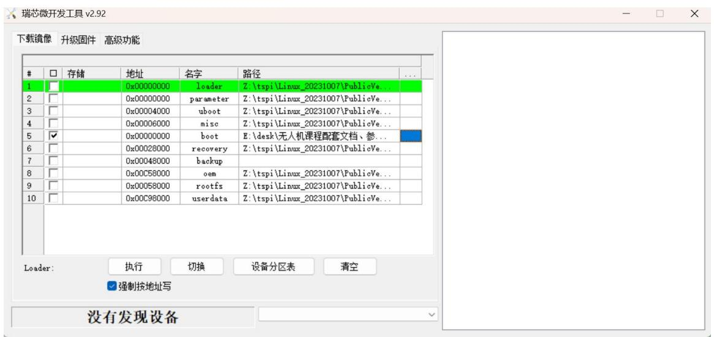
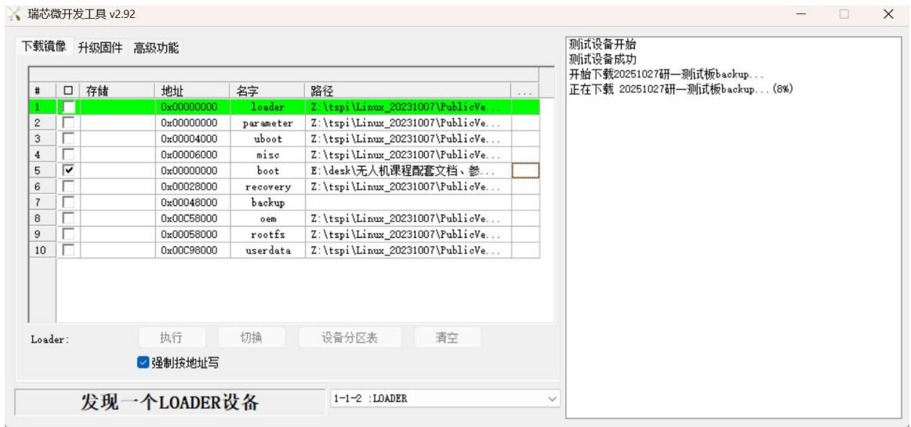
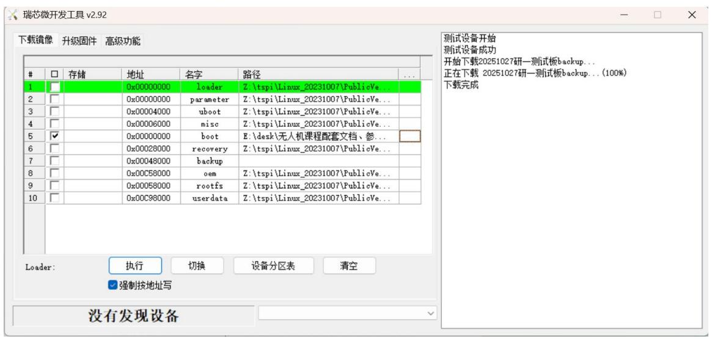

## 3.3 实验三：RK3566开发板系统镜像烧录

## 3.3.1 实验目的

本实验旨在使学生掌握在RK3566 开发板上进行系统镜像烧录的基本流程；学习使用专用烧录工具配置启动项、选择镜像文件并进行设备连接与烧录操作；熟悉开发板按键（RST 和 REC）在烧录过程中的作用，确保能够独立完成系统镜像的烧录任务。

## 3.3.2 实验说明

本次实验通过实操训练，使学生能够从镜像文件选择到设备烧录完成全流程操作。重点包括烧录工具的使用、设备连接方式与按键操作时序，确保学生具备独立完成系统镜像烧录与验证的能力。

## 3.3.3 实验步骤

步骤一：找到预先准备好的系统镜像文件，记录其存放路径。系统镜像文件通常包含操作系统内核、文件系统及基础运行环境，是嵌入式平台启动与运行的核心。如图3.19所示：

text_image

> 智能无人飞行器课程设计 > 项目二 > RK3566开发板镜像文件
名称	修改日期	类
rk3566测试板backup	2025/10/27 6:03	升

图 3.19 镜像文件路径

步骤二：打开烧录工具，勾选启动项（boot），起始地址设为0x0000，通过路径选择按钮加载镜像文件，点击“强制按地址写”。使用数据线将已组装好的RK3566 开发板与电脑连接：USB 端接入电脑，Type-C 端连接开发板。如图3.20所示：

text_image

瑞芯微开发工具 v2.92
下载镜像 升级固件 高级功能
#	□	存储	地址	名字	路径	...
1	□		0x00000000	loader	Z:\tspi\Linux_20231007\PublicVe...
2	□		0x00000000	parameter	Z:\tspi\Linux_20231007\PublicVe...
3	□		0x00004000	uboot	Z:\tspi\Linux_20231007\PublicVe...
4	□		0x00006000	misc	Z:\tspi\Linux_20231007\PublicVe...
5	✓		0x00000000	boot	E:\desk\无人机课程配套文档、参...
6	□		0x00028000=recovery	Z:\tspi\Linux_20231007\PublicVe...
7	□		0x00048000	backup	
8	□		0x00C58000{oem	Z:\tspi\Linux_20231007\PublicVe...
9	□		0x00058000=rootfs	Z:\tspi\Linux_20231007\PublicVe...
10	□		0x00C98000icerdata	Z:\tspi\Linux_20231007\PublicVe...
Loader:	执行	切换	设备分区表	清空
强制按地址写
没有发现设备

图 3.20 烧录镜像的准备步骤

步骤三：RK3566 开发板通过 REC 键与 RST 键进入系统下载模式。保持开发板与计算机连接状态，先长按 REC 键，在不松开的情况下短按一次 RST键，随后松开 REC 键。如图3.21 所示，当系统中识别到一个LOADER 设备时，点击工具界面中的“执行”按钮。随后将在右侧看到设备开始下载镜像文件的过程，请耐心等待较长时间，直至开发板测试镜像下载完成。

text_image

瑞芯微开发工具 v2.92
下载镜像 升级固件 高级功能
#	□	存储	地址	名字	路径	...
1	□		0x00000000	loader	Z:\tspi\Linux_20231007\PublicVe...
2	□		0x00000000	parameter	Z:\tspi\Linux_20231007\PublicVe...
3	□		0x00004000	uboot	Z:\tspi\Linux_20231007\PublicVe...
4	□		0x00006000	misc	Z:\tspi\Linux_20231007\PublicVe...
5	✓		0x00000000	boot	E:\desk\无人机课程配套文档、参...
6	□		0x00028000	recovery	Z:\tspi\Linux_20231007\PublicVe...
7	□		0x00048000	backup	
8	□		0x00C58000{oem	Z:\tspi\Linux_20231007\PublicVe...
9	□		0x00058000	rootsz	Z:\tspi\Linux_20231007\PublicVe...
10	□		0x00C98000icerdata	Z:\tspi\Linux_20231007\PublicVe...
Loader:	执行	切换	设备分区表	清空
强制按地址写
发现一个LOADER设备	1-1-2 :LOADER
测试设备开始
测试设备成功
开始下载20251027研一测试板backup...
正在下载 20251027研一测试板backup...(8%)

图 3.21 成功识别设备并下载镜像文件

烧录过程中需保持设备连接稳定，避免断电或误操作。烧录完成后，进度条显示为 100%，并提示下载完成，此时可断开数据线，系统镜像烧录流程结束。如图3.22所示：

text_image

瑞芯微开发工具 v2.92
下载镜像 升级固件 高级功能
#	□	存储	地址	名字	路径	...
1	□		0x00000000	loader	Z:\tspi\Linux_20231007\PublicVe...
2	□		0x00000000	parameter	Z:\tspi\Linux_20231007\PublicVe...
3	□		0x00004000	uboot	Z:\tspi\Linux_20231007\PublicVe...
4	□		0x00006000	misc	Z:\tspi\Linux_20231007\PublicVe...
5	✓		0x00000000	boot	E:\desk\无人机课程配套文档、参...
6	□		0x00028000=recovery	Z:\tspi\Linux_20231007\PublicVe...
7	□		0x00048000	backup	
8	□		0x00C58000{oem	Z:\tspi\Linux_20231007\PublicVe...
9	□		0x00058000=rootfs	Z:\tspi\Linux_20231007\PublicVe...
10	□		0x00C98000icerdata	Z:\tspi\Linux_20231007\PublicVe...
Loader:	执行	切换	设备分区表	清空
强制按地址写
没有发现设备
测试设备开始
测试设备成功
开始下载20251027研一测试板backup...
正在下载 20251027研一测试板backup...(100%)
下载完成

图 3.22 烧录完成