## 3.4 实验四：塞斯纳无人机的硬件装配

## 3.4.1 实验目的

本实验旨在使学生掌握塞斯纳固定翼无人机整机硬件的装配流程，理解飞控、舵机、电调、遥控接收机、云台等关键部件的连接逻辑与接口定义；重点完成飞控与机载嵌入式系统之间的数据通信链路搭建，通过 UART串口实现飞行控制指令与图像识别数据的双向交互，为后续飞控集成与智能任务部署奠定硬件基础。

## 3.4.2 实验说明

本实验以塞斯纳模型整机为平台，系统讲解无人机主要硬件部件的安装与调试方法。实验涵盖飞控接口识别与接线、舵机系统连接、电调与动力系统联调、遥控接收机接入、云台与图传安装等关键环节。特别强调飞控与RK3566之间的通信连接，确保通过串口（UART）或USB实现稳定数据交互，为后续飞控指令下发、状态回传及机载算法部署提供可靠的物理链路。

## 3.4.3 实验步骤

步骤一：飞控安装与接口识别

将 Pixhawk 飞控固定于机身舱体内部靠近重心位置，安装时需采用减震材料进行隔振处理，以降低飞行振动对传感器测量精度的影响。飞控主要输出接口包括 MAIN OUT 1–8 与 AUX OUT 1–6，分别用于连接基础操纵舵机、电调及扩展执行机构。飞控的结构图如图3.23所示：

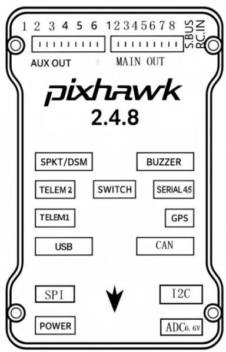

text_image

1 2 3 4 5 6 12 3 4 5 6 7 8 S.BUS
AUX OUT MAIN OUT RC.IN
pixhawk
2.4.8
SPKT/DSM BUZZER
TELEM 2 SWITCH SERIAL45
TELEM1 GPS
USB CAN
SPI I2C
POWER ADC6.6V

图3.23 飞控结构图

飞控的硬件接口连接与用途说明如表3.1所示：

表3.1 硬件接口连接与用途说明表  
步骤二：飞控与外部硬件连接

<table><tr><td>接口名称</td><td>连接部件</td><td>硬件作用</td><td>实验连接说明</td><td>是否需配置参数</td></tr><tr><td>AUX OUT 1-2</td><td>云台横滚(Roll)/云台俯仰(Pitch)</td><td>控制云台稳定水平/控制云台上下视角调整</td><td>连接云台控制模块,实现图像稳定</td><td>是</td></tr><tr><td>MAIN OUT 1-4</td><td>固定翼四路控制通道</td><td>控制副翼、升降舵、油门、方向舵</td><td>接至四路舵机信号线,实现基础姿态控制</td><td>是</td></tr><tr><td>RC IN</td><td>遥控接收机</td><td>手动遥控输入通道</td><td>输入PWM控制信号,保证飞控接收遥控命令</td><td>否(默认识别)</td></tr><tr><td>TELEM1 / TELEM2</td><td>RK3566/无线数传电台</td><td>MAVLink通信</td><td>飞控与计算机双向通信,实现ROS对接/实现飞行任务上传、状态回传等远程操作</td><td>是</td></tr><tr><td>BUZZER</td><td>声音提示</td><td>连接安全开关显示系统状态(GPS锁定、电量报警等</td><td>提供起飞、警告等状态声音反馈</td><td>是</td></tr><tr><td>GPS</td><td>UART+I2C组合</td><td>提供定位与航向</td><td>接入GNSS模块,辅助飞控进行航迹修正与定位</td><td>是</td></tr><tr><td>SWITCH</td><td>安全开关</td><td>连接安全开关显示系统状态,解锁前物理保护</td><td>防止误触发飞行,需人工确认后解锁</td><td>是</td></tr></table>

查阅飞控引脚定义，识别 MAIN OUT、AUX OUT、I2C、TELEM、USB 等接口，按照上表和实拍图进行连线。安装固定Pixhawk 飞控至机身中心位置，确保抗震安装。飞控总连线图如图3.24所示：

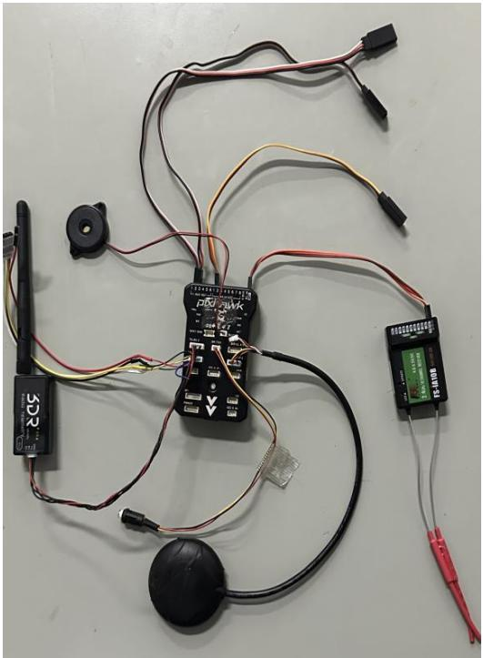

natural_image

Electrical circuit components laid out on a plain surface, including sensors, wires, and connectors (no visible text or symbols)

图 3.24 飞控总连线图

完成接线后，将飞控固定于机身内部，确保线缆整理规范、无明显拉扯或挤压飞控，在机舱内的固定图如图3.25所示：

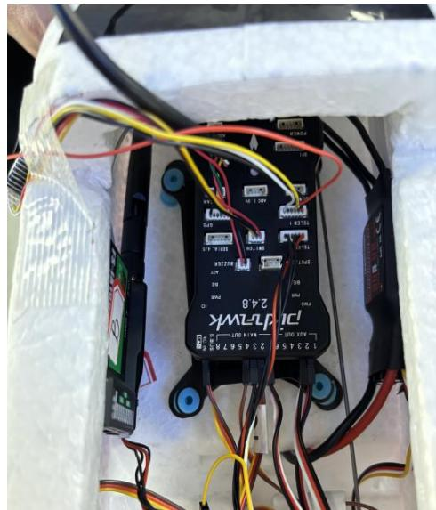

text_image

248
P1-74WK
12346 23456790
P1-74WK
248
P1-74WK
P1-74WK
P1-74WK
P1-74WK
P1-74WK
P1-74WK
P1-74WK
P1-74WK
P1-74WK
P1-74WK
P1-74WK
P1-74WK
P1-74WK
P1-74WK
P1-74WK
23456790
P1-74WK
P1-74WK
P1-74WK
P1-74WK
P1-74WK
P1-74WK
P1-74WK
P1-74WK
P1-74WK
P1-74WK
P1-74WK
P1-74WK
P1-74WK
P1-74WK
50
50
50
50
50
50
50
50
50
50
50
50
50
50
50
50
50
50
50
50
50
50
50
50
50
50
50
50
50
50
50
50
50

图 3.25 飞控固定图

飞机的油门和舵机示意图如图3.26所示：

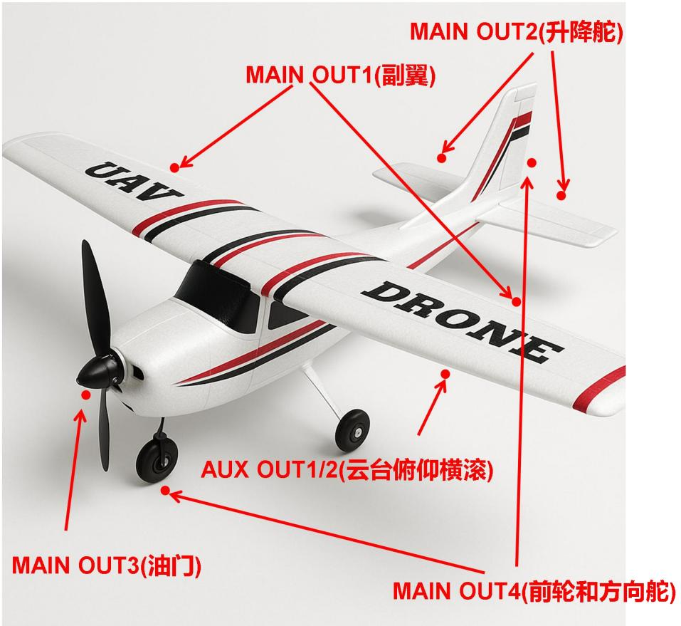

text_image

MAIN OUT2(升降舵)
MAIN OUT1(副翼)
UAV
DRONE
AUX OUT1/2(云台俯仰横滚)
MAIN OUT3(油门)
MAIN OUT4(前轮和方向舵)

图 3.26 油门和舵机连接示意图

步骤三：在 AUX OUT1/2 和 MAIN OUT 1 分别连接杜邦线。

分别用于后面连接飞控云台的横滚和俯仰以及副翼。飞控输出接口如图3.27所示：

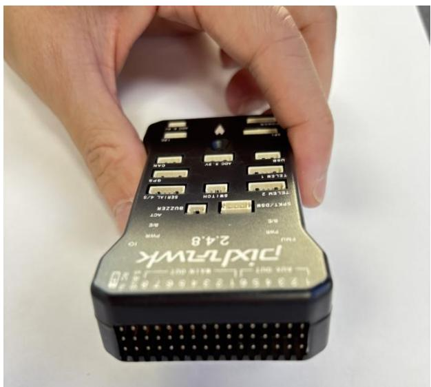

text_image

2.4.8
DPX75WK
2.4.8
P101
PWR
10
USB
400.6
AOS 2.6
GND
400.6
TALU 2.6
GND
400.6
TALU 2.6
GND
400.6
TALU 2.6
GND
400.6
TALU 2.6
GND
400.6
TALU 2.6
GND
400.6
TALU 2.6
GND
400.6
TPX75WK
10

图 3.27 飞控输出接口

注意:在连接所有杜邦线都需要注意正负极，颜色为深色、黑色或者褐色的

杜邦线，我们认定为地线，红色认定为+5v。

步骤四：方向舵接入

将第4号信号线连接至 MAIN OUT4 通道，该通道用于控制方向舵伺服机构。该舵机通过两根连杆分别连接至前轮转向机构和尾部方向舵，实现地面滑行与飞行中的方向控制。如图3.28所示：

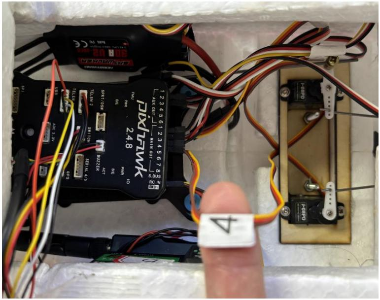

text_image

PIKTRWK
2.48
PAU
PAR
B/E
S/PAT/3500
TELEW 2
SP11-150
BI22.2ER
SEIAL 4/5
SP2
AUG 3
SP1
12345612345678
AUX OUT
MAIN OUT
S.BUS IN
RC IN
H-HPD
F-OPPO
4

图 3.28 方向舵接入图

步骤五：升降舵的接入

找到第2号信号线，连接至 MAIN OUT2 通道，该通道通过飞控与升降舵面相连，用于控制无人机的俯仰姿态。如图3.29所示：

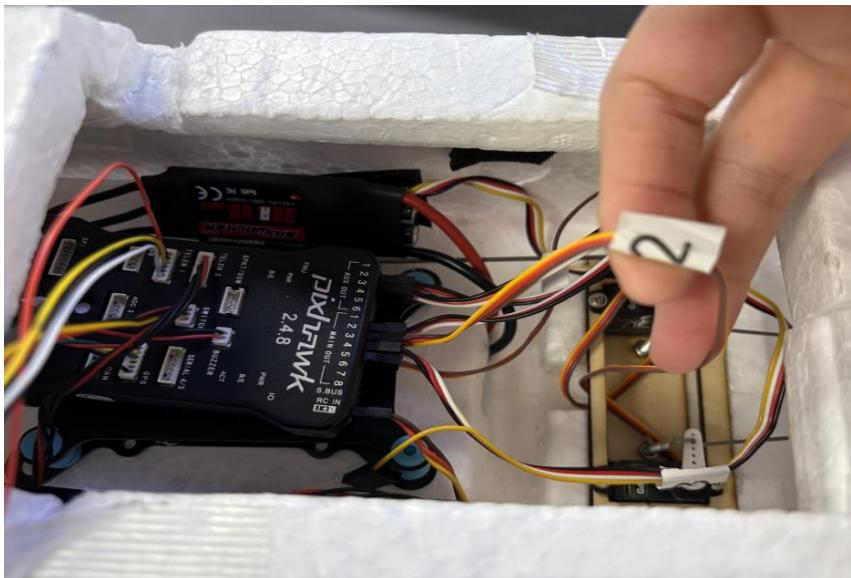

text_image

12345612345678
DXFWRK
2.48
PAM
2.48
PAM
2.48
PAM
2.48
PAM
2.48
PAM
2.48
PAM
2.48
PAM
2.48
PAM
2.48
PAM
2.48
PAM
2.48
PAM
2.48
PAM
2.48
PAM
2.30
PAM
2.30
PAM
2.30
PAM
2.30
PAM
2.30
PAM
2.30
PAM
2.30
PAM
2.30
PAM
2.30
PAM
2.30
PAM
2.30
PAM
2.30
PAM
2.30
PAM

图 3.29 升降舵接入图

步骤六：电调的接入

找到第3 号信号线，连接至 MAIN OUT3 通道，该通道通过电调（ESC）与电机相连，用于控制无人机的油门输出和动力调节。如图3.30所示：

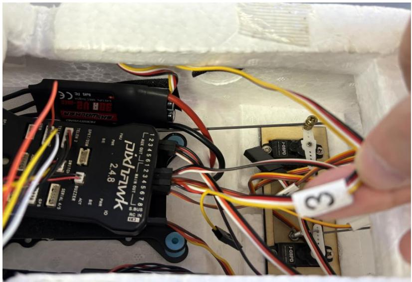

text_image

2.48
PINTRWK
12345612345678
AUX 001-BA118 001
S.BUS
RC IN
ICB
2.48
TEL: 571 (000)
RCL: 000
TELE: 000
HSPD: 000
HSPD: 000
HSPD: 000
HSPD: 000
HSPD: 000
HSPD: 000
HSPD: 000
HSPD: 000
HSPD: 000
HSPD: 000
HSPD: 000
HSPD:
3

图 3.30 电调接入图

步骤七：飞控与RK3566 通信连接

RK3566 的 TELEM1 接口引脚定义如表 3.2 所示。RK3566 官方文档附带链接：（立创开发板技术文档中心）

表 3.2 RK3566 的 TELEM1 接口引脚定义

<table><tr><td>引脚编号</td><td>信号名称</td><td>功能说明</td><td>线缆顺序(以文字正向为准)</td><td>连接 RK3566 是否用到</td></tr><tr><td>1</td><td>VCC (+5)</td><td>5V 电源输出</td><td>左一</td><td>否</td></tr><tr><td>2</td><td>TX (飞控发送)</td><td>飞控串口数据输出(接 RK3566的 RX)</td><td>左二</td><td>是(连接UART3-RX-M1</td></tr><tr><td>3</td><td>RX (飞控接收)</td><td>飞控串口数据输入(接 RK3566的 TX)</td><td>左三</td><td>是(连接UART3-TX-M1)</td></tr><tr><td>4</td><td>CTS (Clear To Send)</td><td>硬件流控制(通常悬空)</td><td>左四</td><td>否</td></tr><tr><td>5</td><td>RTS (Request To Send)</td><td>硬件流控制(通常悬空)</td><td>右二</td><td>否</td></tr><tr><td>6</td><td>GND(地线)</td><td>信号地(必须连接)</td><td>右一</td><td>是(连接 RK3566 GND)</td></tr></table>

学习完我们需要的TELEM1 的接口引脚后，将我们需要的接口根据RK3566的输入输出接口，进行接线连接。如图3.31所示：

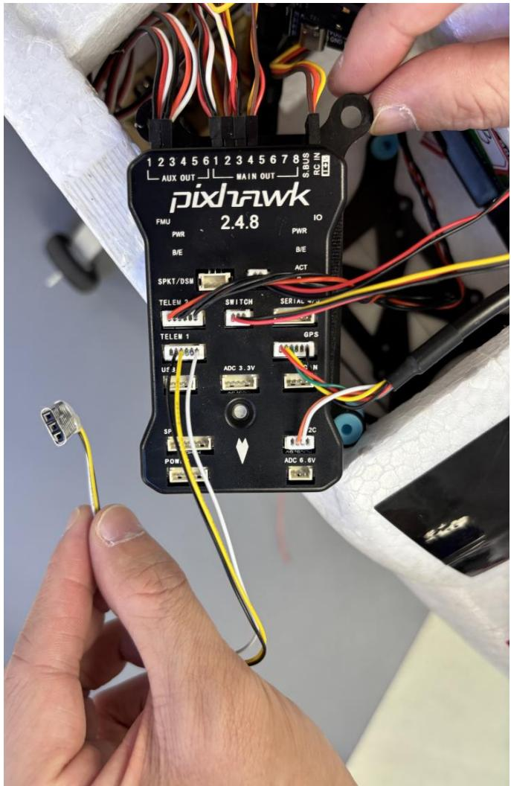

text_image

1 2 3 4 5 6 1 2 3 4 5 6 7 8
AUX OUT MAIN OUT S BUS RC IN
pixTawk
FMU 2.4.8 IO
PWR PWR
B/E B/E
SPKT/DSM ACT
TELEM 2 SWITCH SERIAL WTR
TELEM 1 GPS
UF 3 ADC 3.3V AC IN
SP ADC 6.6V
POW

图 3.31 TELEM1 串口线接线图

红框标注：飞控通过串口与泰山派RK3566 通信。

绿框标注：泰山派RK3566 连接投弹舵机进行投弹控制。

RK3566 输入输出接口图如图 3.32 所示：

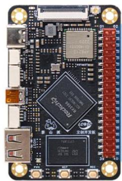

natural_image

Close-up of a black electronic circuit board with various components and connectors (no readable text or symbols)

<table><tr><td>复用功能</td><td>GPIO</td><td colspan="2">引脚编号</td><td>GPIO</td><td>复用功能</td></tr><tr><td>3.3V</td><td>3.3V</td><td>1</td><td>2</td><td>5V</td><td>5V</td></tr><tr><td>I2C2_SDA_M0</td><td>GPIO0_B6</td><td>3</td><td>4</td><td>5V</td><td>5V</td></tr><tr><td>I2C2_SCL_M0</td><td>GPIO0_B5</td><td>5</td><td>6</td><td>GND</td><td>GND</td></tr><tr><td>GPIO</td><td>GPIO1_A4</td><td>7</td><td>8</td><td>GPIO3_B7</td><td>UART3_TX_M1</td></tr><tr><td>GND</td><td>GND</td><td>9</td><td>10</td><td>GPIO3_C0</td><td>UART3_RX_M1</td></tr><tr><td>GPIO</td><td>GPIO3_A1</td><td>11</td><td>12</td><td>GPIO3_C4</td><td>PWM14_M0</td></tr><tr><td>GPIO</td><td>GPIO3_A2</td><td>13</td><td>14</td><td>GND</td><td>GND</td></tr><tr><td>GPIO</td><td>GPIO3_A3</td><td>15</td><td>16</td><td>GPIO3_A4</td><td>GPIO</td></tr><tr><td>3.3V</td><td>3.3V</td><td>17</td><td>18</td><td>GPIO3_A5</td><td>GPIO</td></tr><tr><td>SPI3_MOSL_M1</td><td>GPIO4_C3</td><td>19</td><td>20</td><td>GND</td><td>GND</td></tr><tr><td>SPI3_MISO_M1</td><td>GPIO4_C5</td><td>21</td><td>22</td><td>GPIO3_A6</td><td>GPIO</td></tr><tr><td>SPI3_CLK_M1</td><td>GPIO4_C2</td><td>23</td><td>24</td><td>GPIO4_C6</td><td>SPI3_CS0_M1</td></tr><tr><td>GND</td><td>GND</td><td>25</td><td>26</td><td>GPIO3_A7</td><td></td></tr><tr><td>I2C3_SDA_M1</td><td>GPIO3_B6</td><td>27</td><td>28</td><td>GPIO3_B5</td><td>I2C3_SCL_M1</td></tr><tr><td>GPIO</td><td>GPIO3_B0</td><td>29</td><td>30</td><td>GND</td><td>GND</td></tr><tr><td>GPIO</td><td>GPIO3_C2</td><td>31</td><td>32</td><td>GPIO3_C5</td><td>PWM15_IR_M0</td></tr><tr><td>PWM8_M0</td><td>GPIO3_B1</td><td>33</td><td>34</td><td>GND</td><td>GND</td></tr><tr><td>PWM8_M0</td><td>GPIO3_B2</td><td>35</td><td>36</td><td>GPIO3_C3</td><td>GPIO</td></tr><tr><td>GPIO</td><td>GPIO0_B7</td><td>37</td><td>38</td><td>GPIO3_B3</td><td>GPIO</td></tr><tr><td>GND</td><td>GND</td><td>39</td><td>40</td><td>GPIO3_B4</td><td>GPIO</td></tr></table>

图 3.32 RK3566 输入输出接口

正确连接RK3566 连接供电线，如图3.33所示。

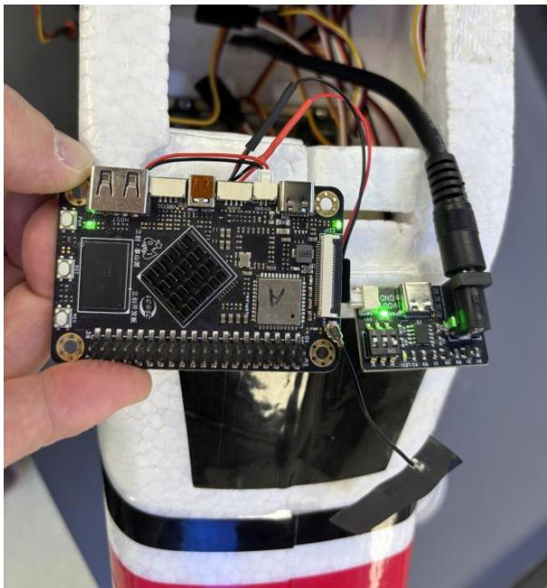

natural_image

Close-up of a hand holding an electronic circuit board with visible components and wiring (no readable text or symbols)

图 3.33 RK3566 供电接线图

投弹舵机引出杜邦线准备接RK3566,灰线接入RK3566输入输出PWM8\_M0,白线接入RK3566 输入输出5V，黑线接入RK3566 输入输出GND，同时将摄像头的USB接口接入RK3566。投弹舵机连线图如图3.34所示：

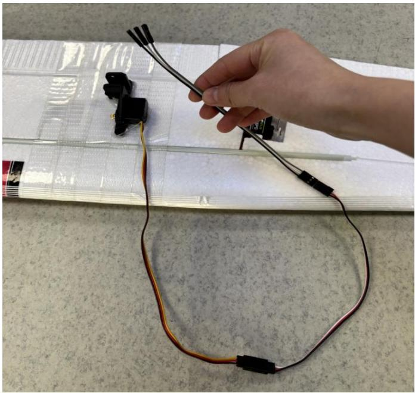

natural_image

Hand holding a black cable with three wires, placed on a white sheet of paper (no visible text or symbols)

图 3.34 投弹舵机接线图

扩展板连接投弹舵机如图3.35所示：

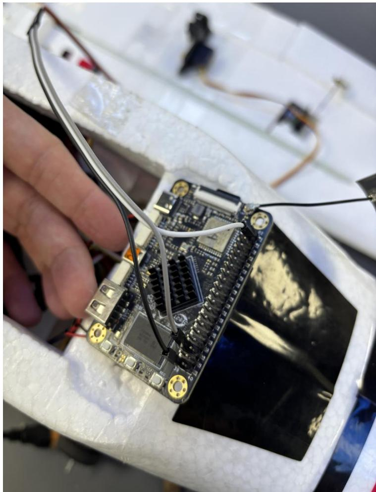

natural_image

Close-up of a hand holding an Arduino Uno board with wires, placed on a white electronic device (no visible text or symbols)

图 3.35 投弹舵机引脚接线图

连接好 RK3566 后，将其放入机仓合适的位置，将刚刚 AUX OUT 1/2 未连接的云台延长线以及MAIN OUT1 未连接的副翼进行最后的接线（注意正负极！），连接完成后，将盖上机仓，将机翼进行螺丝固定，如图 3.36所示：

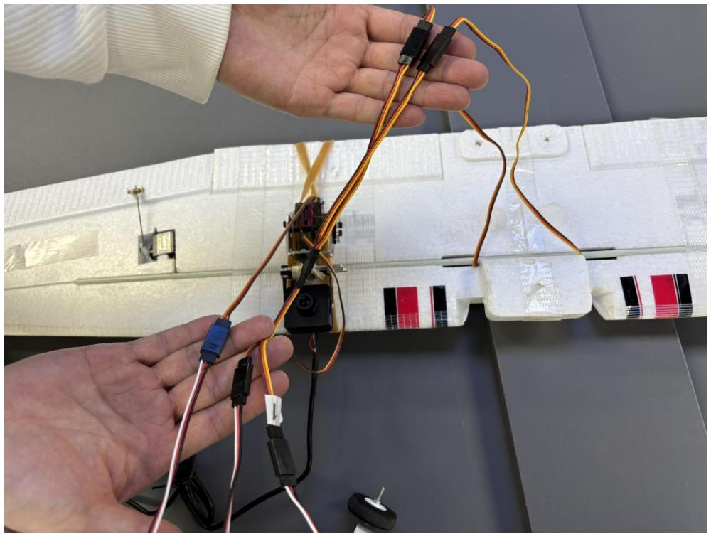

natural_image

Close-up of hands assembling a white model airplane with wires and components (no visible text or symbols)

图 3.36 连接云台和副翼

注意盖上机翼的时候，把GPS 罗盘留在外面，还要为与外部连接的线留出存放的位置。

步骤八：系统通电联调与功能测试（测试投弹）

装机完成后，固定机顶螺丝和橡皮绳，加固机翼机身机构，准备开始上电。将充满12.6V的锂电池装入底部电池仓内，然后连接XT60 一分二的公母线，一个连接飞控，一个连接机载嵌入式系统。

上电顺序：先打开遥控器，再给飞控上电，然后是机载嵌入式系统，最后是安全开关。注意：给每个步骤需要多等待几秒钟，飞控上电完，需要听到滴滴声后再给机载嵌入式系统上电。

RK3566 上电及飞控上电如图 3.37 所示：

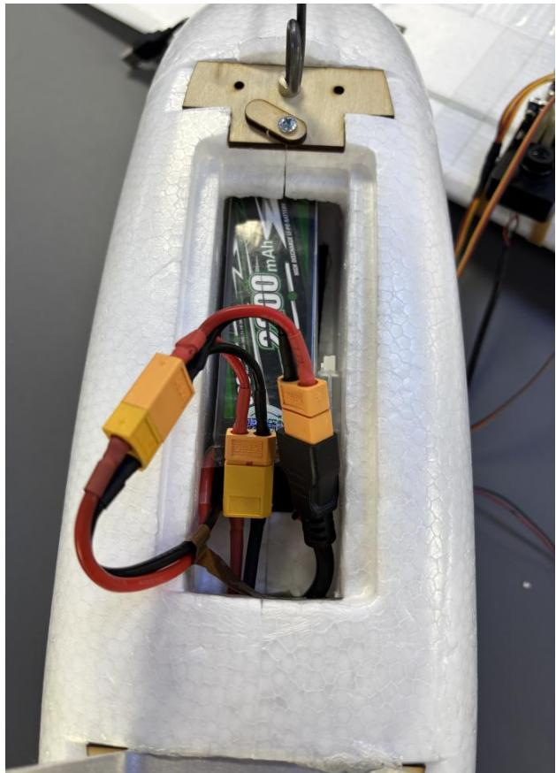

natural_image

Close-up of a white plastic cylindrical device with black and red cables connected, mounted on a metal frame (no visible text or symbols)

图 3.37 RK3566 上电和飞控上电

上电完成后，我们可以听到滴的上电声音，但是此时飞机还处于安全保护且一直发出滴滴声音，需要我们手动长按留在外侧的安全开关。如图 3.38所示：

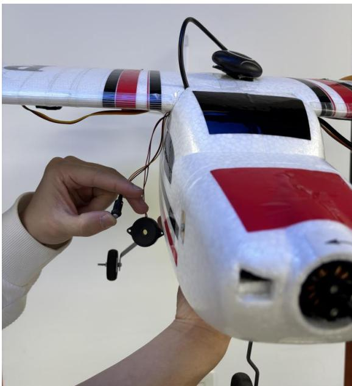

natural_image

Close-up of a hand adjusting a white and red model airplane with attached sensors and wiring (no visible text or symbols)

图 3.38 长按打开安全开关

此时我们可以测试我们的云台，通过旋转飞机，观察云台是否会偏正（如果

云台的横滚和俯仰接反，我们需要重新进行云台接线）。

测试云台横滚，如图3.39所示：

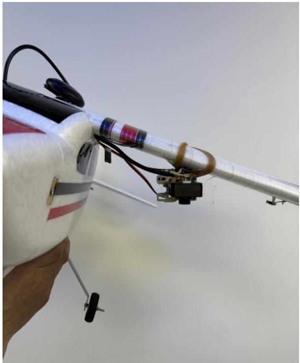

natural_image

Close-up of a small white and red model airplane with attached sensors and control components (no visible text or symbols)

图 3.39 测试云台横滚

测试云台俯仰，如图3.40所示：

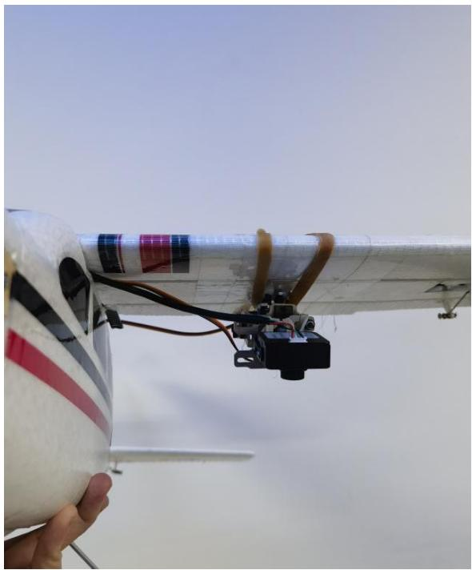

natural_image

Close-up of a small aircraft with visible propeller and control components, held by a hand (no text or symbols)

图 3.40 测试云台俯仰