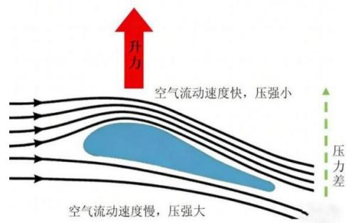
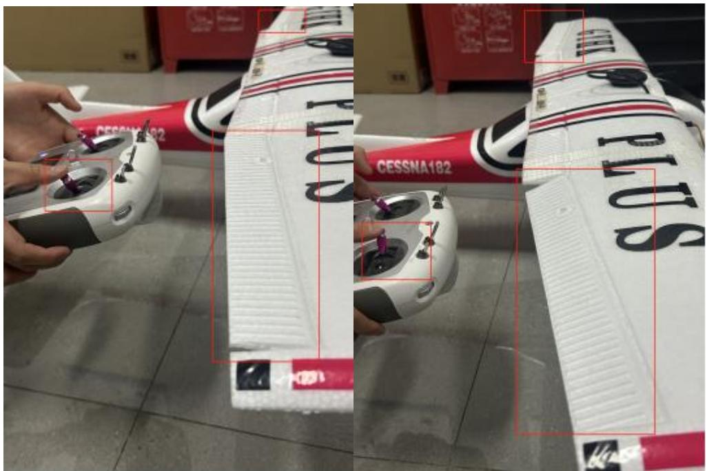
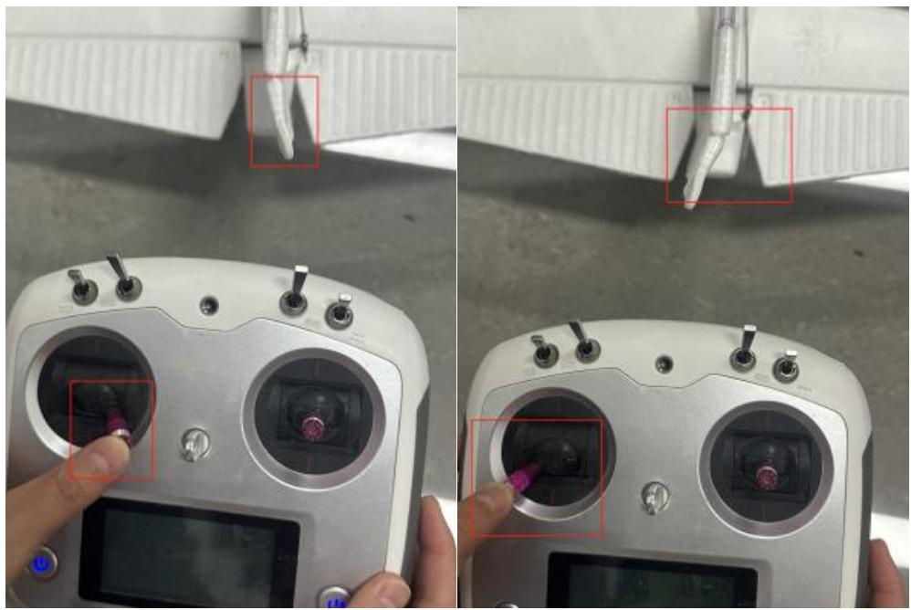
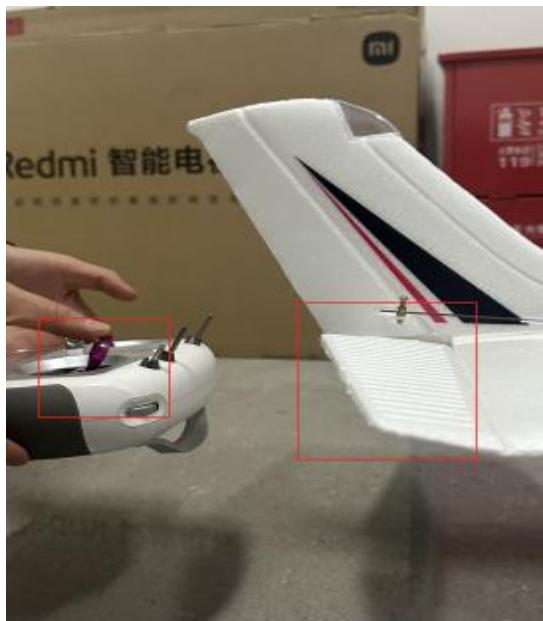
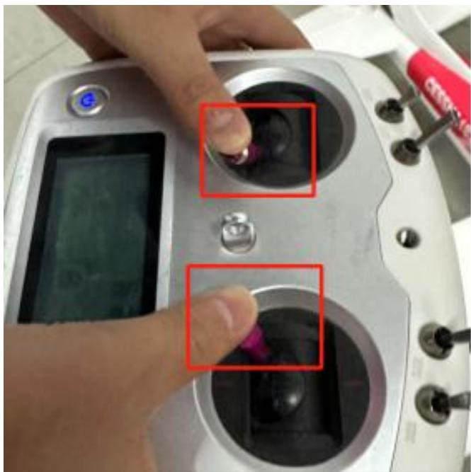
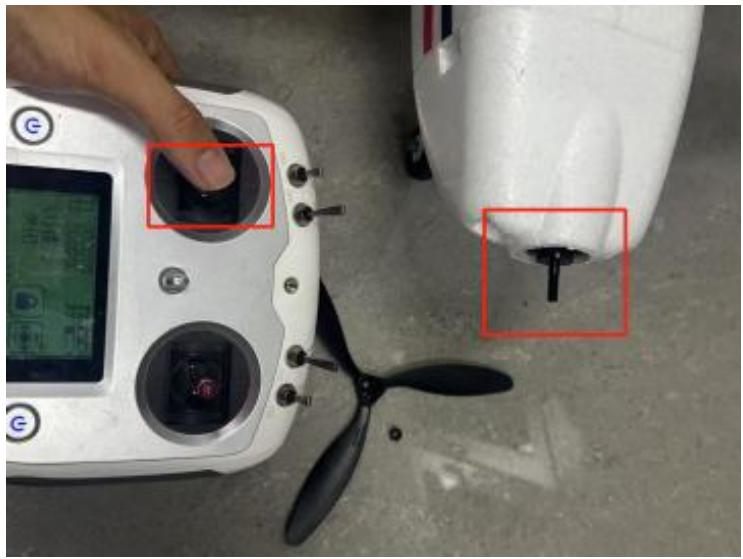

## 3.5 实验五：固定翼无人机的操纵原理与实践

## 3.5.1 实验目的

本实验旨在使学生理解固定翼无人机的基本飞行原理与三轴姿态（滚转、俯仰、偏航）控制逻辑；掌握遥控器各通道（副翼、升降舵、方向舵、油门）的功能定义与操控方法；通过地面实物操作与舵面响应观察，增强对飞行力学与姿态调节的感性认知，为后续模拟飞行与实飞操作奠定基础。

## 3.5.2 实验说明

本实验以塞斯纳固定翼模型为实物平台，结合理论讲解与实操演示，系统介绍固定翼无人机的升力产生机制、气动布局与三轴控制原理。学生将通过遥控器对各舵面进行独立操作练习，观察舵面偏转与机身姿态变化的联动关系，重点培养操控意识、舵面协调能力与应急反应思维，为后续模拟器训练与外场飞行提供前期准备。

## 3.5.3 实验步骤

步骤一：学习固定翼无人机的气动结构与飞行原理（针对副翼、升降舵、油门、方向舵）。

如图 3.41 所示。固定翼无人机通过机翼产生升力，依靠发动机或电机提供前进推力实现飞行。其主要气动结构包括机翼、机身、尾翼和控制面。机翼通过上下表面的气流速度差产生升力，这是支撑飞行的关键；机身连接各部件并减少阻力；尾翼（包括水平尾翼和垂直尾翼）负责稳定姿态和方向。副翼控制滚转、升降舵控制俯仰、方向舵控制偏航，这是基本的三大操纵面。

飞行原理上，固定翼无人机遵循四大力平衡关系：升力抵消重力，推力抵消阻力，实现稳定飞行。起飞时通过增加推力获得足够速度以产生升力；巡航时调整攻角以维持高度；降落时逐步减小推力并调整姿态，平稳接地。理解气动特性和飞行力学是掌握无人机操控与优化设计的基础，也是实现自主飞行和路径规划的重要前提。

text_image

升力
空气流动速度快，压强小
压力差
空气流动速度慢，压强大

图 3.41 机翼产生升力

下面介绍主要控制面及功能认知。

副翼（Aileron）

安装在左右主翼末端，用于控制无人机的滚转（Roll）动作，即左右倾斜。

升降舵（Elevator）

安装在水平尾翼上，用于控制无人机的俯仰（Pitch）动作，即机头上仰或下俯。

方向舵（Rudder）

安装在垂直尾翼上，用于控制无人机的偏航（Yaw）动作，即机头向左或向右转向。

油门（Throttle）

通过调节电机转速，控制无人机的推力输出，影响飞行速度和爬升动力。

步骤二：如表3.3所示。熟悉遥控器各通道功能与控制方式。

表3.3 遥控器各通道功能与控制方式

<table><tr><td>控制通道</td><td>对应舵面</td><td>主要作用</td><td>遥控器操作方向</td></tr><tr><td>油门(油门杆)</td><td>电机推力</td><td>增加或减少飞行速度、高度</td><td>左杆向上推:加速;左杆向下拉:减速</td></tr><tr><td>副翼(右杆左右)</td><td>左右副翼</td><td>左右滚转(侧倾)</td><td>右杆左推:左滚;右杆右推:右滚</td></tr><tr><td>升降舵(右杆前后)</td><td>水平尾翼(升降舵)</td><td>控制俯冲/爬升</td><td>右杆前推:俯冲;右杆后拉:爬升</td></tr><tr><td>方向舵(左杆左右)</td><td>垂直尾翼(方向舵)</td><td>控制机头左右偏航</td><td>左杆左推:向左转;左杆右推:向右转</td></tr></table>

步骤三：连接电源，在安全状态下依次操作副翼、升降舵、方向舵与油门，观察舵面响应。

每次我们连接完成后，我们都需要检查舵面反应是否正确，防止接线错误。

按照实验一进行飞控和RK3566 上电，打开安全开关。

副翼右打，观察左右副翼，发现左低右高。

副翼左打，观察左右副翼，发现左高右低。

如图3.42所示。测试副翼：

text_image

CESSNA182
PLUS
CESSNA182
PLUS

图 3.42 测试副翼

方向舵右打，观察垂直尾翼反应，方向舵右偏。

方向舵左打，观察垂直尾翼反应，方向舵左偏。

如图3.43所示。测试方向舵：

natural_image

Close-up of a hand operating a remote control device with two lenses, showing close-ups of the lens and screen (no text or symbols visible)

图 3.43 测试方向舵

升降舵下打，观察水平尾翼，水平尾翼向下。

升降舵上打，观察水平尾翼，水平尾翼向上。

如图3.44所示。测试水平尾翼：

text_image

Redmi 智能电
mi
1234

图 3.44 测试水平尾翼

注意在室内推动油门，需要提前把螺旋桨卸下来！！！

只打开安全开关，油门是不能推动的，我们需要摇杆打内八，进行遥控器解锁。如图3.45所示：

natural_image

Close-up of a hand operating a digital control device with two circular ports, one showing a finger pointing to a purple object (no visible text or symbols)

图 3.45 遥控器解锁

将油门推动到中位，听到电机转动的声音。如图3.46所示：

natural_image

Close-up of a hand operating a digital control panel next to a white drone, with no visible text or symbols on the device itself.

图3.46 测试油门