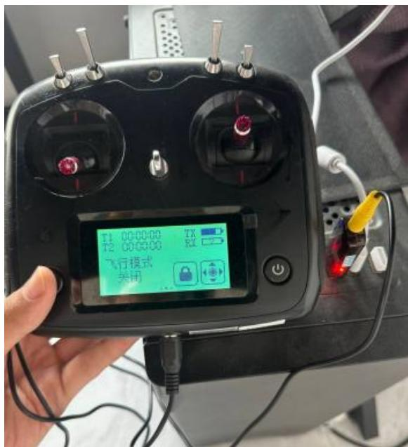
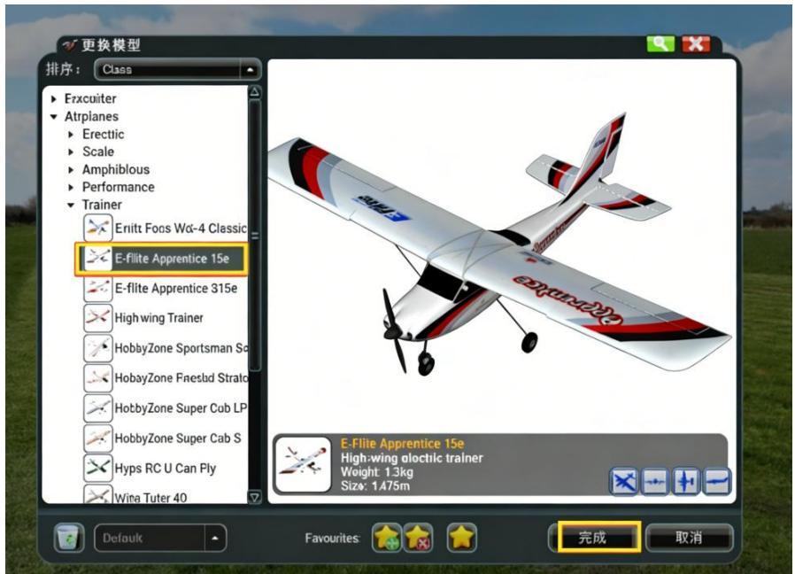
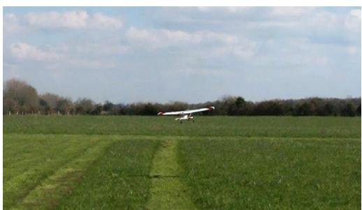

## 3.6 实验六：塞斯纳无人机模拟器试飞

## 3.6.1 实验目的

本实验旨在使学生掌握固定翼无人机飞行模拟器的基本使用方法，熟悉塞斯纳模型无人机在虚拟环境中的起飞、巡航、转向与降落操作，理解飞行模式切换与姿态控制之间的关系，在无实飞风险的条件下建立稳定的飞行操纵手感与操作流程认知。

## 3.6.2 实验说明

本实验基于固定翼无人机飞行模拟软件，采用与实机一致的遥控器作为输入设备，通过虚拟飞行环境对塞斯纳模型无人机进行操纵训练，重点训练学生对油门、副翼、升降舵和方向舵的协调控制能力，为后续实际飞行或自主飞行任务调试提供安全、有效的训练手段。

## 3.6.3 实验步骤

步骤一：使用加密狗连接遥控器与电脑，如图3.47所示：

text_image

T1 00:00:00 TX
T2 00:00:00 RX
飞行模式
关闭

图 3.47 连接加密狗

随后打开 KHOBBY 模拟器助手，选择入门机模拟器并运行 PhoenixRC6.0，操作界面如图3.48所示：

text_image

KHOBBY 22-IN1
RS9300-114
4E4D16-K-1496
硬件升级
连接模拟器或输入序列号
http://vvv.RODBBY.cn
软件惠活
专业级模拟器
入门级模拟器
穿越机模换
其它模拟器
按拟软件下
提示
帮助
2.13新增加图
搞定已安装软件路径
运行 PhoenixRC 6.0
运行 PhoenixRC 5.5
运行 PhoenixRC 5.0
运行 PhoenixRC 4.0

图 3.48 打开模拟器

## 步骤二：选择Cessna模型机型

点击左上角选择模拟器>更换模拟器>Airplane>Trainer>E-Fllite Apprentice15e>完成，如图 3.49 所示：

text_image

更换模型
排序: Class
Frxcuiter
Atrplanes
Erectic
Scale
Amphibious
Performance
Trainer
Enitt Focs Wc-4 Classic
E-flite Apprentice 15e
E-flite Apprentice 315e
High wing Trainer
HobbyZone Sportsman Sc
HobbyZone Faeslad Strato
HobbyZone Super Cub LP
HobbyZone Super Cab S
Hyps RC U Can Ply
Wine Tuter 40
E-Flite Apprentice 15e
High-wing alectic trainer
Weight: 1.3kg
Size: 1475m
Default Favourites 完成 取消

图 3.49 选择塞斯纳模型

## 步骤三：模拟起飞，观察升力产生过程与舵面响应

进行油门与升降舵配合练习：推动左杆油门，同时下拉右杆升降舵，使飞机完成拉升动作；油门测试示例如图 3.50 所示：

natural_image

Aerial view of a small airplane flying over a green agricultural field under a partly cloudy sky (no text or symbols visible)

图 3.50 测试油门

步骤四：自己尝试简单姿态控制模拟，例如爬升、俯冲、左滚、右滚、偏航控制，具体方法如表3.4所示：

表3.4 固定翼无人机基本动作与打杆方法

<table><tr><td>飞行动作</td><td>打杆说明</td><td>详细操作描述</td></tr><tr><td>爬升(Climb)</td><td>右杆向后拉(升降舵上扬)+(必要时)左杆略推油门增加动力</td><td>右手向自己方向拉动,升降舵上翘,机头抬高;同时适当推高油门,以防失速。</td></tr><tr><td>俯冲(Dive)</td><td>右杆向前推(升降舵下压)</td><td>右手向前推,升降舵下压,机头下降,俯冲加速。</td></tr><tr><td>左滚(Roll Left)</td><td>右杆向左推(副翼动作)</td><td>右手向左推,左副翼上扬,右副翼下压,机身向左倾斜。</td></tr><tr><td>右滚(Roll Right)</td><td>右杆向右推(副翼动作)</td><td>右手向右推,右副翼上扬,左副翼下压,机身向右倾斜。</td></tr><tr><td>偏航左转(Yaw Left)</td><td>左杆向左推(方向舵动作)</td><td>左手向左推,方向舵向左偏转,机头向左偏转。</td></tr><tr><td>偏航右转(Yaw Right)</td><td>左杆向右推(方向舵动作)</td><td>左手向右推,方向舵向右偏转,机头向右偏转。</td></tr></table>