## 第四章 无人机地面站系统配置与任务规划

## 4.1 实验一：Mission Planner 地面站部署与飞控初始化校准

## 4.1.1 实验目的

本实验旨在使学生掌握 MissionPlanner 地面站软件的安装与基本配置方法，熟悉飞控与计算机之间的通信连接流程，理解飞控初始化过程中加速度计、罗盘及遥控器校准的作用与原理，确保飞控系统在后续飞行任务中具备准确的姿态感知与可靠的控制输入基础。

## 4.1.2 实验说明

本实验围绕 Pixhawk 飞控的首次使用与初始化配置展开，主要内容包括MissionPlanner 软件部署、飞控通信端口设置以及必要传感器与遥控器的校准操作，通过完成飞控初始状态检查与校准，使飞控系统满足后续参数配置、自主航线规划与飞行任务执行的基本条件。

## 4.1.3 实验步骤

步骤一：Mission Planner 安装

软件安装与配置：MissionPlanner 对课程选用的固定翼模型无人机的优化支持。

从实验安装包中找到相关文件压缩包，解压过后打开 MissionPlanner软件。

也可以从官方下载最新版本，安装时勾选中文语言包。下载链接：

（ https://ardupilot.org/planner/docs/mission-planner-installation.html ） ， 如 图4.1 所示：

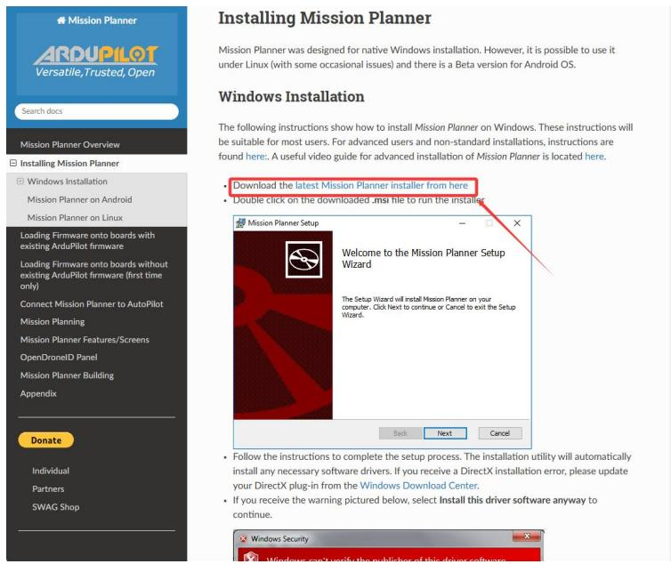

text_image

Mission Planner
ARDUPILOT
Versatile, Trusted, Open
Search docs
Mission Planner Overview
Installing Mission Planner
Windows Installation
Mission Planner on Android
Mission Planner on Linux
Loading Firmware onto boards with existing ArduPilot firmware
Loading Firmware onto boards without existing ArduPilot firmware (first time only)
Connect Mission Planner to AutoPilot
Mission Planning
Mission Planner Features/Screens
OpenDroneID Panel
Mission Planner Building
Appendix
Donate
Individual
Partners
SWAG Shop
Installing Mission Planner
The following instructions show how to install Mission Planner on Windows. These instructions will be suitable for most users. For advanced users and non-standard installations, instructions are found here:. A useful video guide for advanced installation of Mission Planner is located here.
Download the latest Mission Planner installer from here
Double click on the downloaded .ms file to run the installer.
Mission Planner Setup
Welcome to the Mission Planner Setup Wizard
The Setup Wizard will install Mission Planner on your computer. Click Next to continue or Cancel to exit the Setup Wizard.
Back	Next	Cancel
Follow the instructions to complete the setup process. The installation utility will automatically install any necessary software drivers. If you receive a DirectX installation error, please update your DirectX plug-in from the Windows Download Center.
If you receive the warning pictured below, select Install this driver software anyway to continue.
Windows Security
Windows will verify the exhibition of this driver software.

图 4.1 MissionPlanner 安装

步骤二：将飞控连接到计算机

使用 USB 数据线将 Pixhawk 飞控连接至计算机，如图 4.2 所示。连接前需确认以下条件满足：1.SD卡插入飞控，2.飞控中间的RGB LED灯闪烁（不能红灯常亮，也不能LED灯不亮）3.端口波特率正确选择。

数据线直连：在计算机上安装地面站后，用数据线卓连接飞控，另一端USB口连接计算机，如图4.2所示：

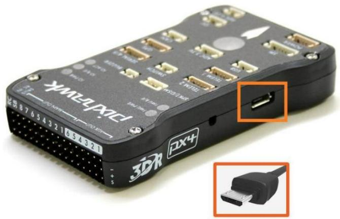

text_image

YMML-EPIXET
3D4R PX4

图 4.2 飞控连接计算机

Windows 应自动检测并安装正确的驱动程序软件，如出现驱动检查不到，可以在网上安装CH340。

当飞控已安装在机体内部不便使用 USB 直连时，可通过数传模块进行连接，数传与飞控、计算机的连接。

步骤三：数传连接

飞控端数传连接：将数传模块 A（飞控端）通过UART接口（TELEM 2），其中，数传的 TX 连接飞控 UART 的 RX，数传的 RX连接飞控UART的 TX，GND 和 5V 对应连接。

电脑端数传连接：数传自带的USB接口直接插入计算机的USB 端口。如图4.3 所示：

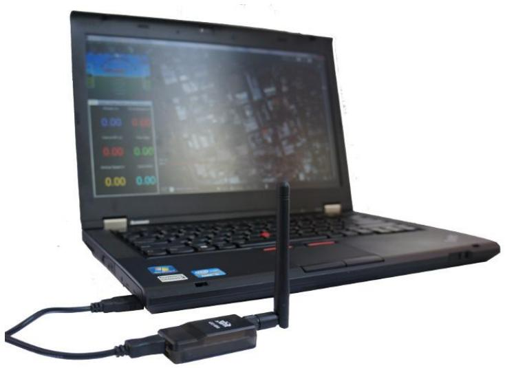

natural_image

Laptop with wireless network device connected via USB cable (no visible text or symbols)

图 4.3 数传连接计算机示意图

步骤四：选择COM端口和波特率设置

连接USB或数传后，Windows 将自动为您的飞控自动分配一个 COM 端口号，接着需要设置适当的波特率，USB 连接时波特率为 115200，如图4.4所示：

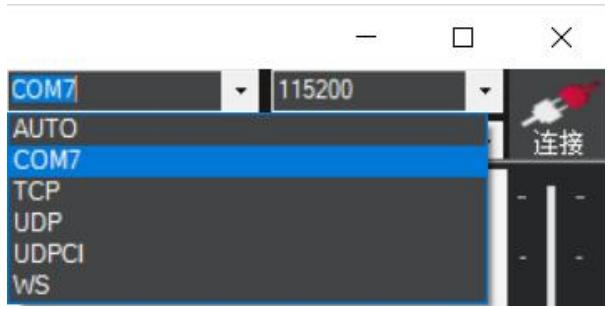

text_image

COM7
115200
AUTO
COM7
TCP
UDP
UDPCI
WS
连接

图 4.4 USB 连接波特率选择

数传连接时波特率为 57600，如图4.5所示：

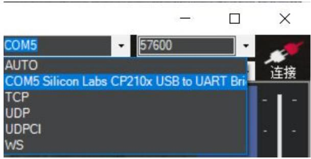

text_image

COM5
57600
AUTO
COM5 Silicon Labs CP210x USB to UART Bri
TCP
UDP
UDPCI
WS
连接

图 4.5 数传连接波特率选择

点击连接，标识变绿则连接成功。

步骤五：飞控加速度计校准

进入初始设置 > 必要硬件 > 加速度计校准，如图4.6所示：

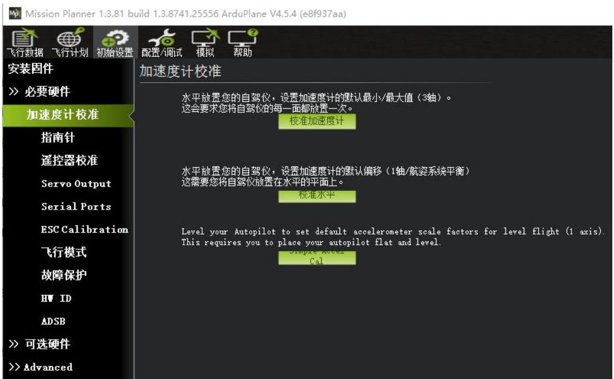

text_image

Mission Planner 1.3.81 build 1.3.8741.25556 ArduPlane V4.5.4 (e8f937aa)
飞行数据 飞行计划 初始设置 配置/调试 模拟 帮助
安装固件
>> 必要硬件
加速度计校准
指南针
遥控器校准
Servo Output
Serial Ports
ESC Calibration
飞行模式
故障保护
HV ID
ADSB
>> 可选硬件
>> Advanced
加速度计校准
水平放置您的自驾仪，设置加速度计的默认最小/最大值（3轴）。
这会要求您将自驾仪的每一面都放置一次。
校准加速度计
水平放置您的自驾仪，设置加速度计的默认偏移（1轴/航姿系统平衡）
这需要您将自驾仪放置在水平的平面上。
校准水平
Level your Autopilot to set default accelerometer scale factors for level flight (1 axis).
This requires you to place your autopilot flat and level.
Simple Accel
Cal

图 4.6 加速度计校准界面

飞控放平，箭头对向电脑屏幕，当点击“校准加速度”按钮时，飞控 RGB 灯会红蓝闪，这时我们不可以去移动飞控，等红蓝闪过后就会提示开始校准。

点击校准加速度计，依次放置飞控水平，左（指针面向右侧），右（指针面向左侧），下（指针向下），上（指针向上），反面（指针保持向前），每次完成一个方向校准，点击“完成时点击”。

如图 4.7 所示。点击校准加速度计，然后出现下图提示 Please place vehicleLEVEL。

text_image

水平放置您的自驾仪，设置加速度计的默认最小/最大值（3轴）。
这会要求您将自驾仪的每一面都放置一次。
完成时点击
Please place vehicle LEVEL

图 4.7 加速度计水平校准

正确放置飞控，完成时点击，如图4.8所示：

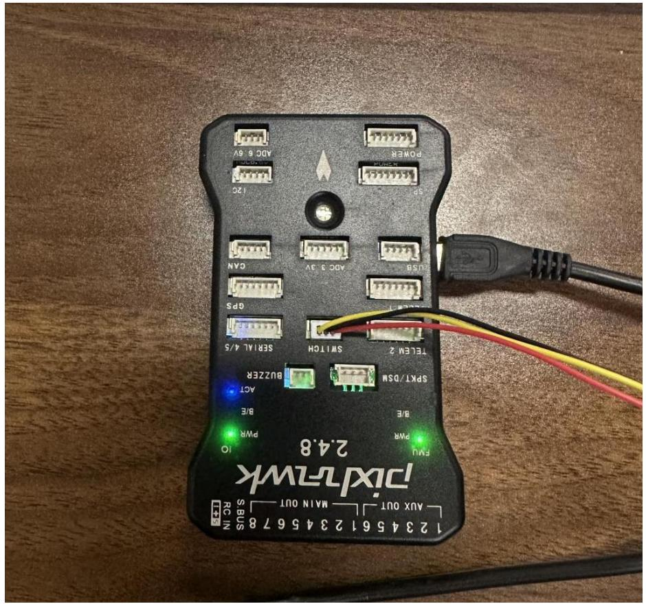

text_image

Pixel2-wk
2.4.8
123 45 61 23 45 67 78
MAX OUT MAIN OUT
S BUS
RC IN
FNU
PWM
8/E
8/E
SPKT/DSM
BUIZZER
TELEL 2
SERIAL 4/5
GPS
CAN
ADC 3 JV
USB
POWER
ADC 6 JV
120

图 4.8 飞控放置水平

完成上述操作后，出现提示 Please place vehicle LEFT。如图 4.9 所示：

text_image

水平放置您的自驾仪，设置加速度计的默认最小/最大值（3轴）。
这会要求您将自驾仪的每一面都放置一次。
完成时点击
Please place vehicle LEFT

图 4.9 加速度计左侧校准

正确放置飞控，完成时点击，如图4.10所示：

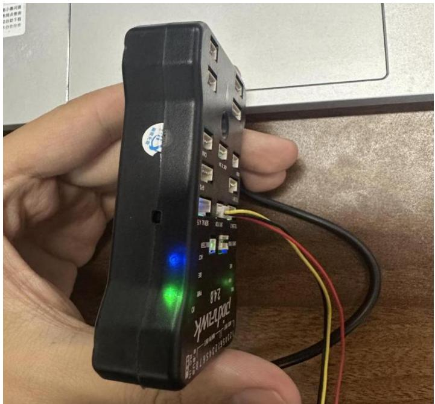

text_image

240
Brand
YMC-23WK
240

图 4.10 飞控左侧抬起放置

完成上述操作后，出现提示 Please place vehicle RIGHT，如图 4.11 所示：

text_image

水平放置您的自驾仪，设置加速度计的默认最小/最大值（3轴）。
这会要求您将自驾仪的每一面都放置一次。
完成时点击
Please place vehicle RIGHT

图 4.11 加速度计右侧校准

正确放置飞控，完成时点击，如图4.12所示：

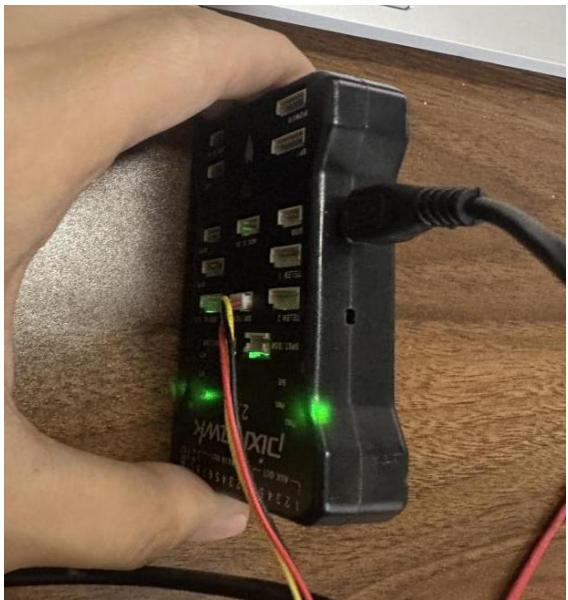

natural_image

Close-up of a hand holding an electronic device with green and red wires connected to its port, placed on a wooden surface (no visible text or symbols)

图 4.12 飞控右侧抬起放置

完成上述操作后，出现提示 Please place vehicle NOSEDOWN，如图 4.13 所示：

text_image

水平放置您的自驾仪，设置加速度计的默认最小/最大值（3轴）。
这会要求您将自驾仪的每一面都放置一次。
完成时点击
Please place vehicle NOSEDOWN

图 4.13 加速度计向下校准

正确放置飞控，完成时点击，如图4.14所示：

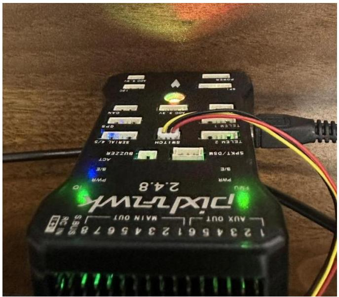

text_image

123456123456789
MAX OUT
MAX 10
2.4.8
PWR
pWR
pWR
SPKT/DSM
ACT
pWR
pWR
2.4.8
100
120
150
100
120
150
100
120
150
100
120
150
100
120
150
100
120
150
100
120
150
100
120
150
100
120
150
10
2.4.8
2.4.8
2.4.8
2.4.8
2.4.8
2.4.8
2.4.8
2.4.8
2.4.8
2.4.8
2.4.8
2.4.8
2.4.8
2.4.8
2.4.8
2.4.8
2.4.8
2.3456123456789
MAX OUT
MAX 100
MAX 100

图 4.14 飞控倒立放置

完成上述操作后，出现提示 Please place vehicle NOSEUP，如图 4.15 所示：

text_image

水平放置您的自驾仪，设置加速度计的默认最小/最大值（3轴）。
这会要求您将自驾仪的每一面都放置一次。
完成时点击
Please place vehicle NOSEUP

图 4.15 加速度计向上校准

正确放置飞控，完成时点击，如图4.16所示：

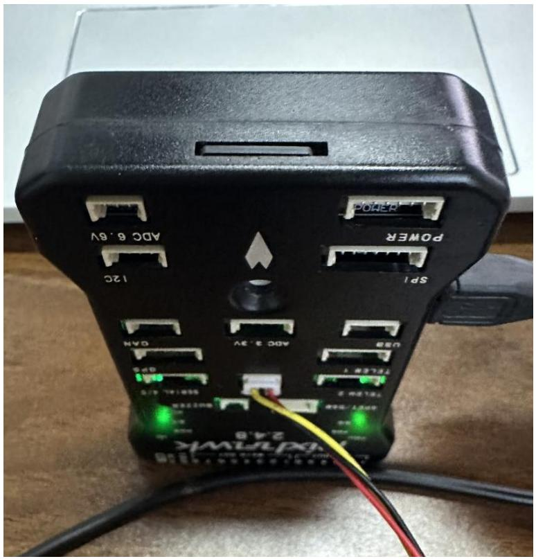

text_image

VX-71WVK
2.4.0
SP1
12C
POWER
ADC 6.6V
ADC 3.9V
GAIN
USB
TPLEATE Y
80Hz
850V 14.4/0
850V 14.4/0
850V 14.4/0
850V 14.4/0
850V 14.4/0
850V 14.4/0
850V 14.4/0
850V 14.4/0
850V 14.4/0
85V 14.4/0
85V 14.4/0
85V 14.4/0
85V 14.4/0
85V 14.4/0
85V 14.4/0
85V 14.4/0
85V 14.4/0
85V 14.4/0
85 V 14.4/0
85 V 14.4/0
85 V 14.4/0
85 V 14.4/0
85 V 14.4/0
85 V 14.4/0
85 V 14.4/0
85 V 14.4/0
85 V 14.4/0
85 V17.226
85 V17.226
85 V17.226
85 V17.226
85 V17.226
85 V17.226
85 V17.226
85 V17.226
85 V17.226
85 V17.226
85 V17.227
85 V17.227
85 V17.227
85 V17.227
85 V17.227
85 V17.227
85 V17.227
85 V17.227
85 V17.227
85 V17.227
85 V17.228
85 V17.228
85 V17.228
85 V17.228
85 V17.228
85 V17.228
85 V17.228
85 V17.228
85 V17.229
85 V17.229
85 V17.229
85 V17.229
85 V17.229
85 V17.229
85 V17.230
85 V17.230
85 V17.230
85 V17.230
85 V17.230
85 V17.230
85 V17.230
85 V17.230
85 V17.230
85 V17.230
85 V17.231
85 V17.231
85 V17.231
85 V17.231
85 V17.231
85 V17.231
85 V17.231
85 V17.231
85 V17.231
85 V17.231
85 V17.232
85 V17.232
85 V17.232
85 V17.232
85 V17.232
85 V17.232
85 V17.232
85 V17.232
85 V17.233
85 V17.233
85 V17.233
85 V17.233
85 V17.233
85 V17.233
85 V17.233
85 V17.233
85 V17.233
85 V17.233
85 V17.234

图 4.16 飞控向上放置

完成上述操作后，出现提示 Please place vehicle BACK，如图 4.17 所示：

text_image

水平放置您的自驾仪，设置加速度计的默认最小/最大值（3轴）。
这会要求您将自驾仪的每一面都放置一次。
完成时点击
Please place vehicle BACK

图 4.17 加速计背面校准

正确放置飞控，完成时点击，如图4.18所示：

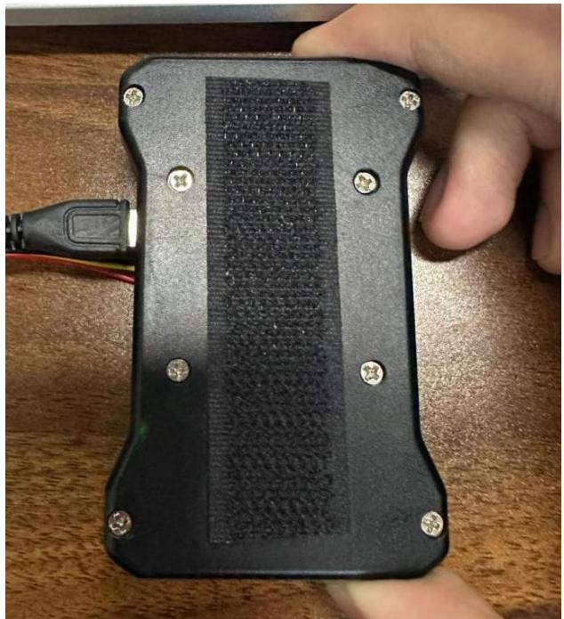

natural_image

Close-up of a black electronic device with a textured surface and multiple screws, held by a hand holding a cable (no visible text or symbols)

图 4.18 飞控背面放置

完成上述操作后，出现提示 Calibration successfully 则表示加速度计校准完成，如图4.19所示：

text_image

水平放置您的自驾仪，设置加速度计的默认最小/最大值（3轴）。
这会要求您将自驾仪的每一面都放置一次。
完成
Calibration successful

图 4.19 加速度计校准成功

完成后，将加速度计放平，点击校准水平，出现完成点击即可，如图 4.20所示：

text_image

水平放置您的自驾仪，设置加速度计的默认偏移（1轴/航姿系统平衡）
这需要您将自驾仪放置在水平的平面上。
校准水平

图 4.20 校准水平

步骤六：罗盘校准：

在校准操作之前，找到飞控上连接GPS 的接口，如图4.21所示：

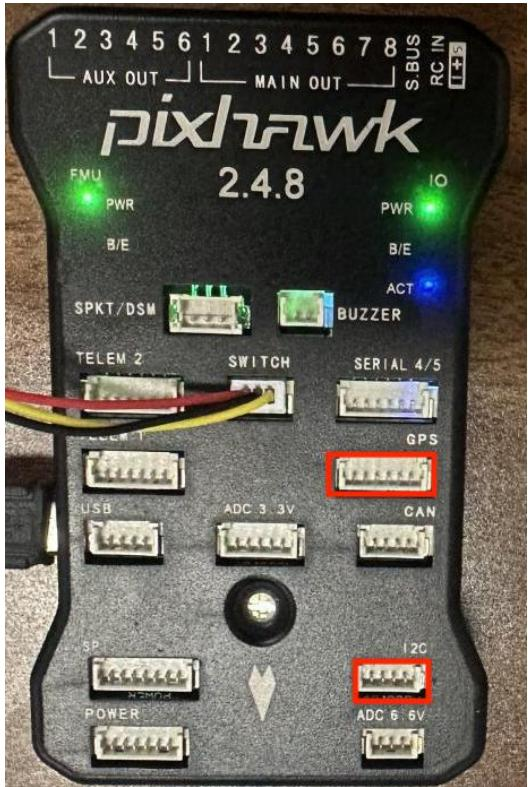

text_image

1 2 3 4 5 6 1 2 3 4 5 6 7 8
AUX OUT MAIN OUT SBUS RC IN
pixhwak
FMU IO
PWR PWR
B/E B/E
SPKT/DSM ACT
BUZZER
TELEM 2 SWITCH SERIAL 4/5
USB ADC 3.3V CAN
SP 2C
POWER ADC 6-6V

图 4.21 罗盘连线飞控接口图

连接GPS，将GPS 和飞控的指针指向同一方向放置，如图4.22所示：

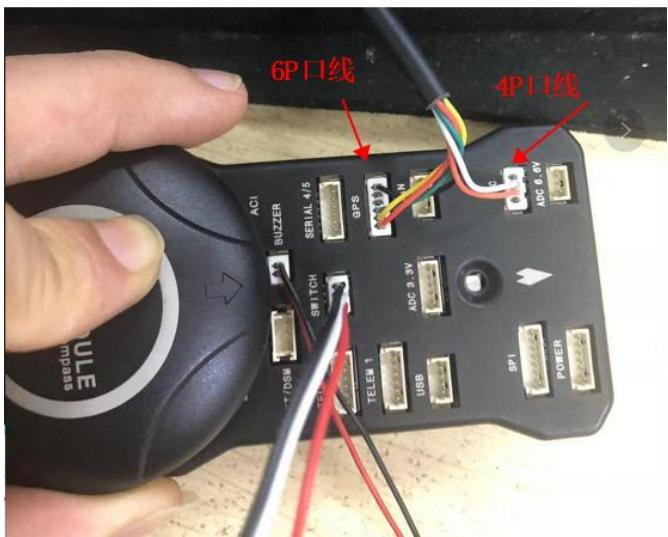

text_image

6P口线
4P口线
ACI
BUZZER
SERIAL 4/5
GPS
N
ADC 6.4V
DC 6.4V
TELEM 1
USB
SP1
POWER

图 4.22 罗盘连线飞控

进入初始设置 > 必要硬件 > 加速度计校准。因为我们只需要校准内部罗盘，只选择指南针#1的这个指南针，其他指南针#2#3 不选，“自动学习偏移量”的勾要选上，确保选项正确设置，如图 4.23 所示。之后点击“Start”按钮，校准后不用做“Accept”操作。

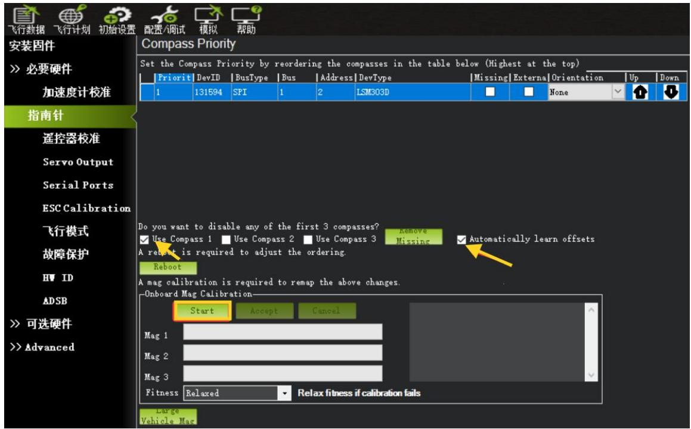

text_image

飞行数据 飞行计划 初始设置 配置/调试 模拟 帮助
安装固件
>> 必要硬件
加速度计校准
指南针
遥控器校准
Servo Output
Serial Ports
ESC Calibration
飞行模式
故障保护
HW ID
ADSB
>> 可选硬件
>> Advanced
Compass Priority
Set the Compass Priority by reordering the compasses in the table below (Highest at the top)
Priorit DevID BusType Bus Address DevType Missing Externa Orientation Up Down
1 131594 SPI 1 2 LSM303D None
Do you want to disable any of the first 3 compasses?
Use Compass 1 Use Compass 2 Use Compass 3 Remove Missing Automatically learn offsets
A reboot is required to adjust the ordering.
Reboot
A mag calibration is required to remap the above changes.
Onboard Mag Calibration
Start Accept Cancel
Mag 1
Mag 2
Mag 3
Fitness Relaxed Relax fitness if calibration fails
Large Vehicle Mag

图 4.23 指南针校准

罗盘校准过程需要 PIX 飞控罗盘和 GPS 罗盘 $3 6 0 ^ { \circ }$ 均匀缓慢的同时转动，在转动的过程中确保进度条在动，当进度条完成后会出数据，之后飞控断电重新连接。注意，出数据后不用点击“接受”按钮。

步骤七：遥控器校准

进入初始设置 > 必要硬件 > 遥控器校准

校准遥控器前先正确接上接收机，接收机请查看第二章实验一步骤二。

点击窗口右边的遥控器校准按钮，点击“校准遥控”，然后点击OK 开始拨动遥控开关，使每个通道的红色提示条移动到上下限的位置。如图4.24所示：

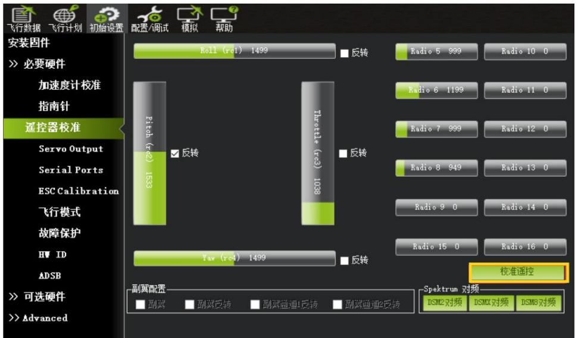

text_image

飞行数据
飞行计划
初始设置
配置/调试
模拟
帮助
安装固件
>> 必要硬件
加速度计校准
指南针
遥控器校准
Servo Output
Serial Ports
ESC Calibration
飞行模式
故障保护
HW ID
ADSB
>> 可选硬件
>> Advanced
Roll (rc1) 1499
反转
Radio 5 999
Radio 10 0
Pitch (rc2) 1533
反转
Radio 6 1199
Radio 11 0
Throttle (rc3) 1038
反转
Radio 7 999
Radio 12 0
Yaw (rc4) 1499
反转
Radio 8 949
Radio 13 0
Radio 9 0
Radio 14 0
Radio 15 0
Radio 16 0
校准遥控
副翼配置
■ 副翼
■ 副翼反转
■ 副翼通道1反转
■ 副翼通道2反转
Spektrum 对频
DSM2对频
DSMX对频
DSMB对频

图 4.24 遥控器校准界面

按钮前先打开遥控器，点击完后出现以下提示，提示 1如图4.25所示：

text_image

Ensure your transmitter is on and receiver is
powered and connected
Ensure your motor does not have power/no props!!!
OK

图 4.25 遥控器校准提示 1

（确保你的发射器是打开的，接收器是供电和连接的，确保你的电机没有电源！）提示2如图4.26所示：

text_image

Click OK and move all RC
sticks and switches to their
extreme positions so the
red bars hit the limits.
OK

图 4.26 遥控器校准提示 2

将遥控器所有摇杆、开关置于 中立位置（如油门 50%），按提示依次满行程移动各通道（摇杆、旋钮、开关）。遥控器校准如图4.27所示：

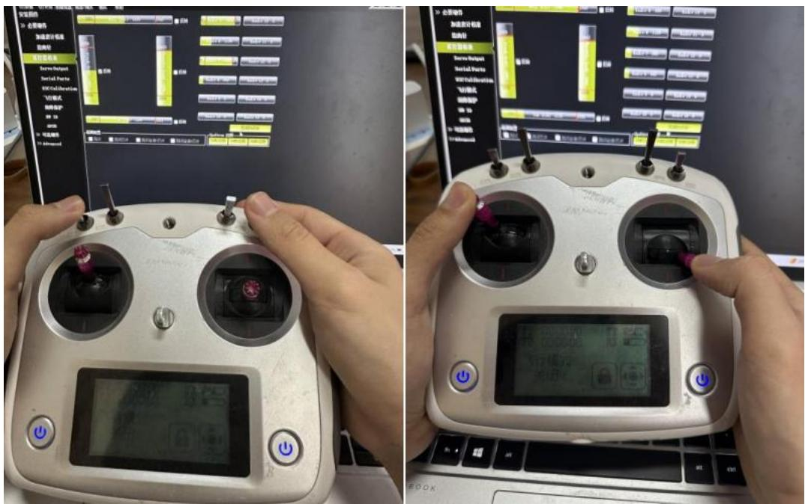

text_image

Two-panel image showing a hand operating a remote control device with labeled buttons and a digital display screen.

图 4.27 遥控器校准

确保所有通道的红色指示条在最小/最大值间均匀响应（无跳动或缺失）。如

图 4.28 所示：  
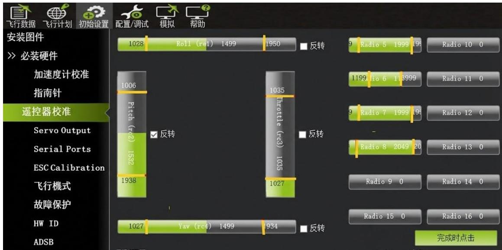

text_image

飞行数据
飞行计划
初始设置
配置/调试
模拟
帮助
安装图件
>> 必装硬件
加速度计校准
指南针
遥控器校准
Servo Output
Serial Ports
ESC Calibration
飞行模式
故障保护
HW ID
ADSB
1028 Roll (rel) 1499 1950 反转 9 Radio 5 1999 1999 Radio 10 0
1006 Pitch (r2) 1532 反转 1199 Radio 6 113999 Radio 11 0
1938 Throttle (rc3) 1035 反转 9 Radio 7 1999 Radio 12 0
1027 Yav (rc4) 1499 1934 反转 Radio 8 2049 Radio 13 0
完成时点击

图 4.28 遥控器校准完成