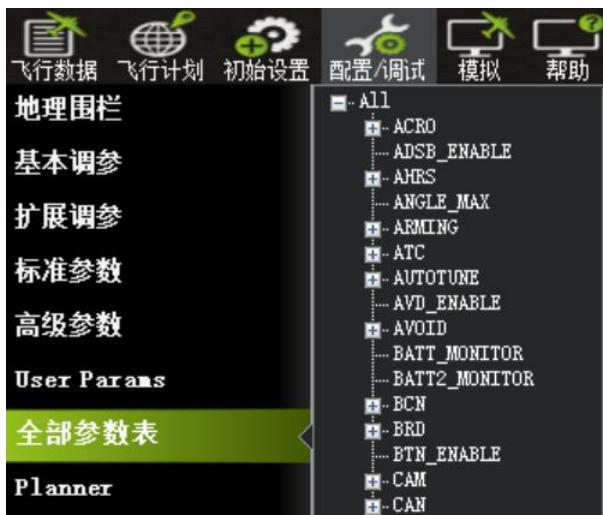
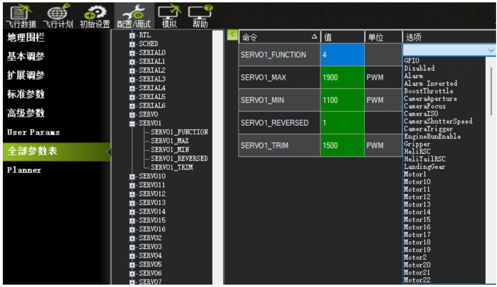
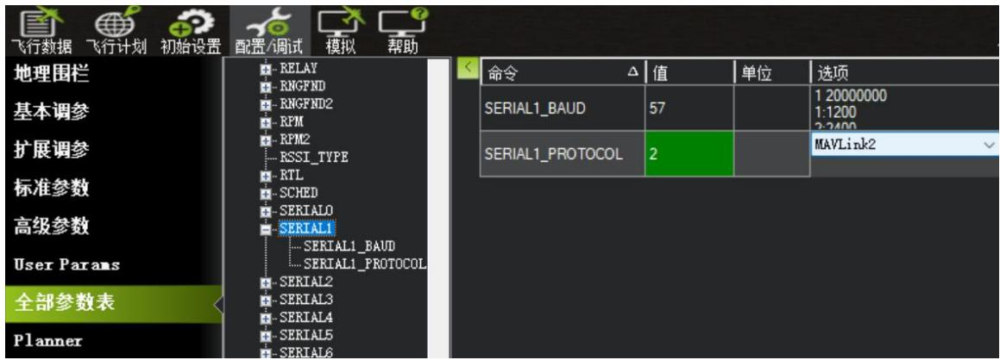
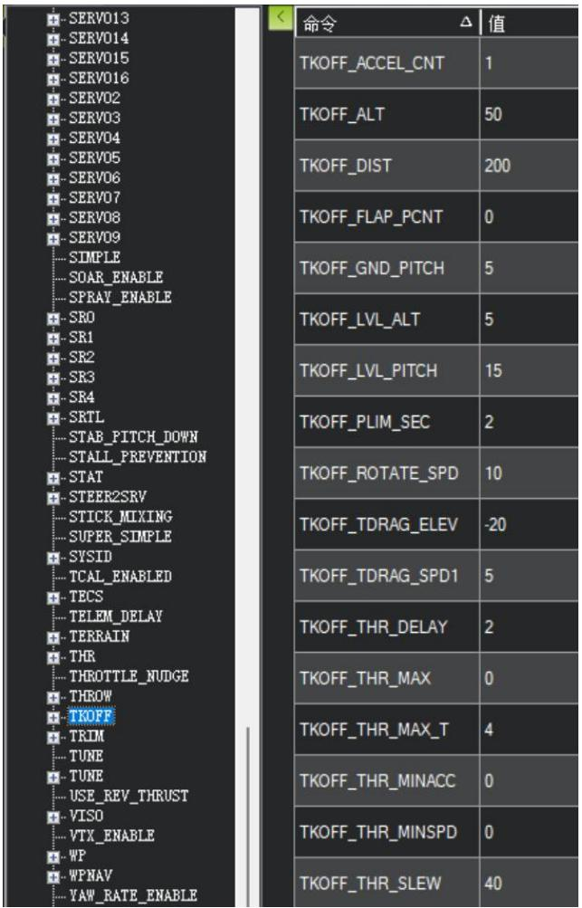

## 4.2 实验二：飞控参数配置与核心接口映射设置

## 4.2.1 实验目的

本实验旨在使学生掌握 Pixhawk 飞控常用参数的配置方法，理解固定翼无人机各操纵通道、扩展执行机构及通信接口在飞控中的功能映射关系，熟悉飞控与云台、舵机、电调、机载嵌入式计算机及数传模块之间的参数配置逻辑，为无人机后续自主飞行与任务执行提供正确、稳定的控制基础。

## 4.2.2 实验说明

本实验基于已完成初始化校准的 Pixhawk 飞控系统，通过 Mission Planner地面站对飞控参数进行配置，重点完成主输出通道（MAIN OUT）、辅助输出通道（AUX OUT）及串口通信接口的功能映射设置，同时检查与起飞、降落及安全相关的基础参数，提升飞行任务的可控性与安全性，为后续自动任务执行打下基础。

## 4.2.3 实验步骤

步骤一：连接 Pixhawk 飞控至 Mission Planner，点击“配置/调试”进入“全部参数表”（Full Parameter List）参数设置界面。全部参数表如图4.29所示：

text_image

飞行数据 飞行计划 初始设置 配置/调试 模拟 帮助
地理围栏
基本调参
扩展调参
标准参数
高级参数
User Params
全部参数表
Planner
All
ACRO
ADSB_ENABLE
AHRS
ANGLE_MAX
ARMING
ATC
AUTOTUNE
AVD_ENABLE
AVOID
BATT_MONITOR
BATT2_MONITOR
BCN
BRD
BTN_ENABLE
CAM
CAN

图 4.29 全部参数表（Full Parameter List）参数设置界面

步骤二：查找并设置SERVO1-4\_FUNCTION（主翼、副翼、升降舵、油门）即设置主通道（MAIN OUT1–4）对应舵机功能。

在 Pixhawk 飞控中，SERVOx\_FUNCTION 用于定义各个 PWM 通道（舵机通道）的功能，通常固定翼使用 MAIN OUT1–4 控制基本飞行操纵面和油门。具体设置如下：

如图4.30所示。找到SERVO1（注意不要找错），点击选项选择Aileron（副

翼）。

text_image

飞行数据 飞行计划 初始设置 配置/调试 模拟 帮助
地理围栏
基本调参
扩展调参
标准参数
高级参数
User Params
全部参数表
Planner
RTL
SCHED
SERIAL0
SERIAL1
SERIAL2
SERIAL3
SERIAL4
SERIAL5
SERIAL6
SERVO
SERVO1
SERVO1_FUNCTION
SERVO1_MAX
SERVO1_MIN
SERVO1_REVERSED
SERVO1_TRIM
SERVO10
SERVO11
SERVO12
SERVO13
SERVO14
SERVO15
SERVO16
SERVO2
SERVO3
SERVO4
SERVO5
SERVO6
SERVO7
命令	△ 值	单位	选项
SERVO1_FUNCTION	4	
SERVO1_MAX	1900	PWM	
SERVO1_MIN	1100	PWM	
SERVO1_REVERSED	1	
SERVO1_TRIM	1500	PWM	
GPIO
Disabled
Alarm
Alarm_Inverted
BoostThrottle
CameraAperture
CameraFocus
CameraISO
CameraShutterSpeed
CameraTrigger
EngineRunEnable
Gripper
HeliRSC
HeliTailRSC
LandingGear
Motor1
Motor10
Motor11
Motor12
Motor13
Motor14
Motor15
Motor16
Motor17
Motor18
Motor19
Motor2
Motor20
Motor21
Motor22

图 4.30 SERVO1 参数设置

依次找到SERVO1-4，分别进行参数选择，如表4.1所示：

表 4.1 MAIN OUT 对应通道参数设置

<table><tr><td>通道</td><td>参数</td><td>功能定义</td><td>对应部件说明</td></tr><tr><td>MAIN OUT1</td><td>SERVO1_FUNCTION = 4</td><td>Aileron(副翼)</td><td>控制无人机的左右滚转,用于转向</td></tr><tr><td>MAIN OUT2</td><td>SERVO2_FUNCTION = 19</td><td>Elevator(升降舵)</td><td>控制无人机的俯仰,决定爬升或下降</td></tr><tr><td>MAIN OUT3</td><td>SERVO3_FUNCTION = 70</td><td>Throttle(油门)</td><td>控制电机输出功率,实现动力推进</td></tr><tr><td>MAIN OUT4</td><td>SERVO4_FUNCTION = 21</td><td>Rudder(方向舵)</td><td>控制无人机的偏航,保持航向稳定</td></tr></table>

步骤三：配置辅助通道（AUXOUT）控制云台功能

Pixhawk 的 AUX OUT 接口可用于输出额外的 PWM 信号，常用于控制云台、投弹、起落架等扩展模块。本实验中，使用 SERVO9 和 SERVO10 控制云台的横滚与俯仰两个轴，依次找到 SERV9-10，分别进行参数选择，如表 4.2 所示：

表 4.2AUX OUT 对应通道参数设置

<table><tr><td>通道</td><td>参数</td><td>功能定义</td><td>对应部件说明</td></tr><tr><td>AUX</td><td rowspan="2">SERVO9_FUNCTION = 8</td><td rowspan="2">Mount Roll</td><td rowspan="2">控制云台横滚,保持相机水平稳定</td></tr><tr><td>OUT1</td></tr><tr><td>AUX</td><td rowspan="2">SERVO10_FUNCTION = 7</td><td rowspan="2">Mount Pitch</td><td rowspan="2">控制云台俯仰,实现拍摄角度调整</td></tr><tr><td>OUT2</td></tr></table>

步骤四：设置串口通信参数，如 SERIAL1 用于 RK3566，SERIAL2 用于数传（设置波特率和协议），具体设置如表4.3所示：

表 4.3TELEM 串口参数设置

<table><tr><td>串口编号</td><td>参数</td><td>参数值</td><td>接口用途</td><td>对应部件说明</td></tr><tr><td rowspan="2">TELEM1</td><td>SERIAL1_PROTOCOL=2</td><td rowspan="2">MAVLink协议波特率57600</td><td rowspan="2">连接机载嵌入式系统</td><td rowspan="2">实现飞控与计算机的数据通信,可进行模式切换、姿态读取等ROS集成操作</td></tr><tr><td>SERIAL1_BAUD=57</td></tr><tr><td rowspan="2">TELEM2</td><td>SERIAL1_PROTOCOL=2</td><td rowspan="2">MAVLink协议波特率57600</td><td rowspan="2">连接数传电台</td><td rowspan="2">远程地面站通信模块,可实现飞行状态监控与任务上传</td></tr><tr><td>SERIAL1_BAUD=57</td></tr></table>

串口通信参数设置如图4.31所示：

text_image

飞行数据 飞行计划 初始设置 配置/调试 模拟 帮助
地理围栏
基本调参
扩展调参
标准参数
高级参数
User Params
全部参数表
Planner
RELAY
RNGFND
RNGFND2
RPM
RPM2
RSSI_TYPE
RTL
SCHED
SERIAL0
SERIAL1
SERIAL1_BAUD
SERIAL1_PROTOCOL
SERIAL2
SERIAL3
SERIAL4
SERIAL5
SERIAL6
命令	值	单位	选项
SERIAL1_BAUD	57		1 20000000
1:1200
2:3400
SERIAL1_PROTOCOL	2		MAVLink2

图 4.31 串口通信参数设置

## 步骤五：遥控器接收配置

Pixhawk 飞控通过 RC IN 接口 接收遥控器信号，常用协议包括 PWM、PPM、SBUS 等，其中 SBUS 支持最多 16 个通道，延迟低、抗干扰性强，是主流接收方式。

系统默认支持自动识别，无需设置协议参数，但我们要学习和检查这几个参数。在 MissionPlanner 中执行遥控器校准，完成通道校准，确认通道对应关系，如表4.4所示：

表 4.4 RC 参数设置

<table><tr><td>参数名</td><td>对应通道功能</td><td>对应部件说明</td></tr><tr><td>RC_MAP_ROLL</td><td>副翼</td><td>1</td></tr><tr><td>RC_MAP_PITCH</td><td>升降舵</td><td>2</td></tr><tr><td>RC_MAP_YAW</td><td>方向舵</td><td>3</td></tr><tr><td>RC_MAP_THROTTLE</td><td>油门</td><td>4</td></tr><tr><td>RC_MAP_MODE_SW</td><td>模式切换开关</td><td>5</td></tr><tr><td>RC_MAP_FLAPS</td><td>襟翼通道(可选)</td><td>6或未设置</td></tr></table>

步骤六：外围功能接口（安全开关、蜂鸣器、GPS）

Pixhawk 飞控支持多种外设接入，需在参数表中激活相关功能。常见关键外设及其对应设置如表4.5所示：

表4.5 外围功能接口参数设置

<table><tr><td>外设</td><td>主要参数</td><td>接口位置</td><td>对应部件说明</td></tr><tr><td>安全开关</td><td>BRD_SAFETY_DEFLT=1(启用)</td><td>SWITCH</td><td>防止通电后立即驱动舵面或电机,需手动按下按钮后系统才可工作</td></tr><tr><td>蜂鸣器</td><td>无需特殊参数,默认启用</td><td>BUZZER接口</td><td>控制云台俯仰,实现拍摄角度调整</td></tr></table>

## Buzzer

<table><tr><td>GPS模块</td><td>GPS_TYPE = 1(自动识别)GPS_AUTO_CONFIG = 1(自动配置)GPS_AUTO_SWITCH = 1(双GPS时自动选择)</td><td>GPS端口</td><td>通过蜂鸣声提示当前系统状态,如启动完成、故障报警、GPS丢失等</td></tr></table>

步骤七：设置起飞与降落参数，如：

本步骤目标是配置飞控的自动起飞（TKOFF）与自动降落（LAND）参数，如图 4.32 所示。使无人机具备自主完成完整飞行任务的能力，参数设置将影响起飞响应的及时性、飞行安全性以及降落缓冲表现，本实验针对塞斯纳固定翼进行配置，不涉及弹射、垂直起飞等特殊方式，因此部分参数将省略，仅保留常用关键项。

text_image

SERV013
SERV014
SERV015
SERV016
SERV02
SERV03
SERV04
SERV05
SERV06
SERV07
SERV08
SERV09
SIMPLE
SOAR_ENABLE
SPRAY_ENABLE
SRO
SR1
SR2
SR3
SR4
SRTL
STAB_PITCH_DOWN
STALL_PREVENTION
STAT
STEER2SRV
STICK_MIXING
SUPER_SIMPLE
SYSID
TCAL_ENABLED
TECS
TELEM_DELAY
TERRAIN
THR
THROTTLE_NUDGE
THROW
TKOFF
TRIM
TUNE
TUNE
USE_REV_THRUST
VISO
VTX_ENABLE
WP
WPNAV
YAW_RATE_ENABLE
命令	值
TKOFF_ACCEL_CNT	1
TKOFF_ALT	50
TKOFF_DIST	200
TKOFF_FLAP_PCNT	0
TKOFF_GND_PITCH	5
TKOFF_LVL_ALT	5
TKOFF_LVL_PITCH	15
TKOFF_PLIM_SEC	2
TKOFF_ROTATE_SPD	10
TKOFF_TDRAG_ELEV	-20
TKOFF_TDRAG_SPD1	5
TKOFF_THR_DELAY	2
TKOFF_THR_MAX	0
TKOFF_THR_MAX_T	4
TKOFF_THR_MINACC	0
TKOFF_THR_MINSPD	0
TKOFF_THR_SLEW	40

图 4.32 自动起飞参数设置

在 Mission Planner > 配置/调试 > 全部参数表中依次查找以下参数，如表4.6 所示：

表4.6 自动起飞参数表设置

<table><tr><td>参数名</td><td>参数功能</td><td>建议值</td><td>实验案例设置值</td><td>设置说明</td></tr><tr><td>TKOFF_THR_MINSPD</td><td>起飞所需最小空速(单位m/s)</td><td>8-12</td><td>0</td><td>确保起飞前飞行机获得足够的速度。0表示禁用空速限制。</td></tr><tr><td>TKOFF_THR_DELAY</td><td>起飞推力延迟(单位秒)</td><td>1-3</td><td>2</td><td>起飞命令发出后延迟几秒再加推力,给飞控和动力系统预留准备时间。</td></tr><tr><td>TKOFF_ROTATE_SPD</td><td>起飞转场速度</td><td>10-15</td><td>10</td><td>到达该空速时开始仰头拉升,单位m/s。对于所有地面起飞,TKOFF_ROTATE_SPD应设置在失速速度以上,通常约为10%至30%</td></tr><tr><td>TKOFF_ALT</td><td>起飞初始目标高度</td><td>20-50</td><td>30</td><td>起飞后第一阶段的目标高度,确保避开障碍物。</td></tr><tr><td>TKOFF_DIST</td><td>起飞俯仰角(CD)</td><td>200</td><td>200</td><td>固定翼起飞滑跑距离,避免距离过短失速。</td></tr><tr><td>TKOFF_GND_PITCH</td><td>地面起飞俯仰角(°)</td><td>5-10</td><td>5</td><td>固定翼地面起飞时的初始俯仰角度。</td></tr><tr><td>TKOFF_LVL_ALT</td><td>起飞自动水平飞行高度(米)</td><td>5-10</td><td>5</td><td>起飞阶段中自动保持水平的高度。</td></tr><tr><td>TKOFF_LVL_PITCH</td><td>起飞水平飞行俯仰角(°)</td><td>10-20</td><td>15</td><td>起飞阶段水平飞行时保持的俯仰角度。</td></tr><tr><td>TKOFF_PLIM_SEC</td><td>起飞俯仰限制时间(秒)</td><td>1-3</td><td>2</td><td>起飞时俯仰角调整的时间。</td></tr></table>

自动降落参数如表4.7所示:

表4.7自动降落参数表设置

<table><tr><td>参数名</td><td>参数功能</td><td>建议值</td><td>实验案例设置值</td><td>设置说明</td></tr><tr><td>LAND_FLARE_ALT</td><td>展翼(flare)高度</td><td>2~5</td><td>3</td><td>飞机在降落前拉平机头的高度,影响落地缓冲。</td></tr><tr><td>LAND_FLARE_SEC</td><td>展翼持续时间</td><td>1-3</td><td>2</td><td>从展翼到接地的缓冲时间,确保平稳落地。</td></tr><tr><td>LAND_PITCH_CD</td><td>降落时俯仰角(CD)</td><td>-1000-1000</td><td>250</td><td>降落阶段保持的固定俯仰角,正值表示机头向上。</td></tr><tr><td>LAND_PF_ALT</td><td>预着落飞行高度(米)</td><td>10-15</td><td>10</td><td>如果飞行中油门高于该值,将中止降落过程,避免不安全降落。</td></tr></table>

第四章 无人机地面站系统配置与任务规划

<table><tr><td>LAND_PF_ALT</td><td>预着陆飞行时间(秒)</td><td>5-10</td><td>6</td><td>确保降落阶段有足够的平滑进场时间。</td></tr></table>

步骤八：保存参数并写入飞控，重启验证是否生效