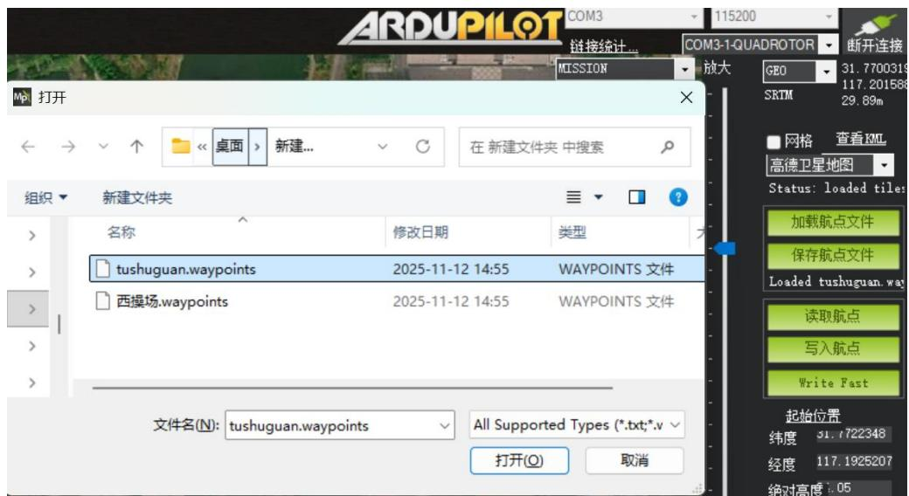
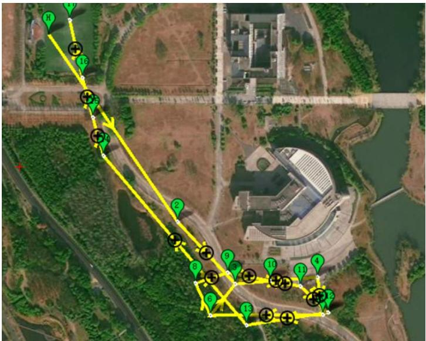
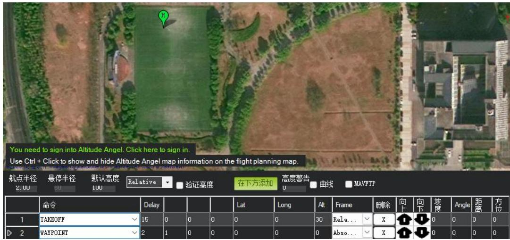
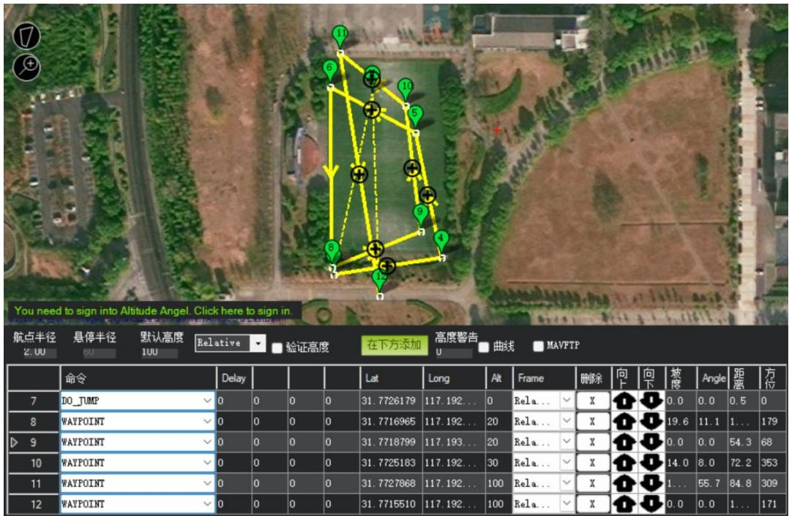
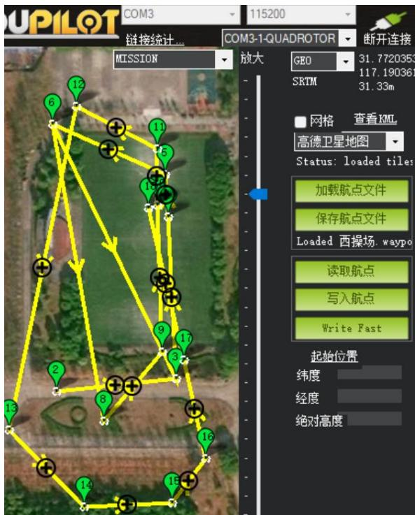

## 4.3 实验三：自主航线规划与飞行任务上传

## 4.3.1 实验目的

本实验旨在使学生掌握在 Mission Planner 地面站中进行固定翼无人机自主航线规划的方法，理解航点、飞行高度、速度及任务指令之间的逻辑关系，熟悉飞行任务的生成、检查与上传流程，为无人机执行自主飞行任务奠定规划与操作基础。

## 4.3.2 实验说明

本实验基于已完成初始化校准和参数配置的 Pixhawk 飞控系统，通过MissionPlanner 的飞行计划功能完成航点任务的规划与上传，重点训练学生对航线结构、航点顺序及任务安全性的整体把控能力，是无人机由“可控飞行”向“自主飞行”过渡的重要环节。

## 4.3.3 实验步骤

步骤一：打开 Mission Planner，连接数传，进入“Flight Plan”界面

首先我们先加载一个图书馆附近的航点文件进行学习，点击加载航点文件，然后打开航点，如图4.33所示：

text_image

ARDUPILOT COM3 115200
链接统计...
COM3-1-QUADROTOR 断开连接
MISSION
打开
桌面 新建... 在 新建文件夹 中搜索
组织 新建文件夹
名称 修改日期 类型
tushuguan.waypoints 2025-11-12 14:55 WAYPOINTS 文件
西操场.waypoints 2025-11-12 14:55 WAYPOINTS 文件
文件名(N): tushuguan.waypoints All Supported Types (*.txt;*.v
打开(O) 取消
断开连接
GEO 31.7700319
117.201588
SKTM 29.89m
网格 查看 XML
高德卫星地图
Status: loaded tiles
加载航点文件
保存航点文件
Loaded tushuguan.way
读取航点
写入航点
Write Fast
起始位置
纬度 31.7722348
经度 117.1925207
绝对高度 : .05

图 4.33 加载航点文件

其中H代表home点，在地图界面中选择合适位置作为起飞点（Home 点），确认起飞点位置与实际飞行场地一致。起飞点通常作为飞行任务的参考基准，同时也是返航（RTL）指令的目标位置。航线任务是按照顺序完成的，图书馆航线如图4.34所示：

text_image

Aerial map with numbered locations and marked points, showing a yellow path connecting labeled points in a green circle.

图 4.34 图书馆航线规划

其中航线下方有设置航点参数和命令，如图 4.35 所示。我们第一个指令是TAKEOFF（起飞），第一个参数 pich angle 为设置为 15，后面 Alt（高度）设置为30，航线任务按照数字顺序进行到6，此时航线已经到达坦克目标附件，需要进行盘旋识别坦克目标，我们设置第七个航点任务为 DO\_JUMP（跳转航点），其中设置第一个参数 WP#为 3(要跳转到第 3 个航点)，第二个参数 Repeat#（重复执行的次数），航线任务依次执行到9、10、11。因为此时飞行要进行投弹操作，我们航点高度设为20以此方便投弹进行，依次执行到14。因为此时飞机已经返航，我们要把高度降下以便降落，在航线任务17设置LAND 降落命令，第一个参数AbortAlt（高度）设置为5，第四格参数设置为1。

<table><tr><td></td><td>命令</td><td></td><td></td><td></td><td></td><td>Lat</td><td>Long</td><td>Alt</td><td colspan="2">Frame</td><td>删除</td><td>向上</td><td>向下</td><td>坡度</td><td>Angle</td><td>距离</td><td>方位</td></tr><tr><td>1</td><td>TAKEOFF</td><td>✓ 15</td><td>0</td><td>0</td><td>0</td><td>0</td><td>0</td><td>30</td><td>Rela...</td><td>✓</td><td>X</td><td></td><td></td><td>0</td><td>0</td><td>0</td><td>0</td></tr><tr><td>2</td><td>WAYPOINT</td><td>✓ 0</td><td>0</td><td>0</td><td>0</td><td>31.7699568</td><td>117.194...</td><td>30</td><td>Rela...</td><td>✓</td><td>X</td><td></td><td></td><td>9.7</td><td>5.6</td><td>3...</td><td>145</td></tr><tr><td>3</td><td>WAYPOINT</td><td>✓ 0</td><td>0</td><td>0</td><td>0</td><td>31.769202</td><td>117.195...</td><td>30</td><td>Rela...</td><td>✓</td><td>X</td><td></td><td></td><td>0.0</td><td>0.0</td><td>1...</td><td>137</td></tr><tr><td>4</td><td>WAYPOINT</td><td>✓ 0</td><td>0</td><td>0</td><td>0</td><td>31.7692818</td><td>117.196379</td><td>30</td><td>Rela...</td><td>✓</td><td>X</td><td></td><td></td><td>0.0</td><td>0.0</td><td>1...</td><td>85</td></tr><tr><td>5</td><td>WAYPOINT</td><td>✓ 0</td><td>0</td><td>0</td><td>0</td><td>31.768828</td><td>117.196...</td><td>30</td><td>Rela...</td><td>✓</td><td>X</td><td></td><td></td><td>0.0</td><td>0.0</td><td>51.0</td><td>172</td></tr><tr><td>6</td><td>WAYPOINT</td><td>✓ 0</td><td>0</td><td>0</td><td>0</td><td>31.7688143</td><td>117.194...</td><td>30</td><td>Rela...</td><td>✓</td><td>X</td><td></td><td></td><td>0.0</td><td>0.0</td><td>1...</td><td>269</td></tr><tr><td>7</td><td>DO_TUMP</td><td>✓ 3</td><td>1</td><td>0</td><td>0</td><td>31.7690827</td><td>117.195...</td><td>0</td><td>Rela...</td><td>✓</td><td>X</td><td></td><td></td><td>0</td><td>0</td><td>0</td><td>0</td></tr><tr><td>8</td><td>WAYPOINT</td><td>✓ 0</td><td>0</td><td>0</td><td>0</td><td>31.7692111</td><td>117.194...</td><td>30</td><td>Rela...</td><td>✓</td><td>X</td><td></td><td></td><td>0.0</td><td>0.0</td><td>48.8</td><td>335</td></tr><tr><td rowspan="11">9</td><td rowspan="11">WAYPOINT</td><td rowspan="11">✓ 0</td><td rowspan="7">0</td><td rowspan="7">0</td><td rowspan="7">0</td><td rowspan="7">31.7693425</td><td rowspan="7">117.195...</td><td rowspan="7">20</td><td rowspan="7">Rela...</td><td rowspan="7">✓</td><td rowspan="7">X</td><td rowspan="7"></td><td rowspan="7"></td><td rowspan="7"></td><td rowspan="7"></td><td rowspan="7"></td><td rowspan="7"></td></tr><tr></tr><tr></tr><tr></tr><tr></tr><tr></tr><tr></tr><tr><td></td><td></td><td></td><td></td><td></td><td></td><td></td><td></td><td></td><td></td><td></td><td></td><td></td><td></td><td></td></tr><tr><td></td><td></td><td></td><td></td><td></td><td></td><td></td><td></td><td></td><td></td><td></td><td></td><td></td><td></td><td></td></tr><tr><td></td><td></td><td></td><td></td><td></td><td></td><td></td><td></td><td></td><td></td><td></td><td></td><td></td><td></td><td></td></tr><tr><td></td><td></td><td></td><td></td><td></td><td></td><td></td><td></td><td></td><td></td><td></td><td></td><td></td><td></td><td></td></tr></table>

图 4.35 图书馆航点参数

学习完图书馆航线，我们开始自行绘制西操场投弹航线，主要航线任务有起飞、侦察盘旋、投弹、降落。

航线规划注意事项

1. 航点高度设置合理，整体高度不要太高，侦察盘旋时适当降低高度，在执行LAND 降落任务之前，我们要把高度降下来，防止出现无人机降落冲出场外。  
2. 航点转角不可过于锐利，固定翼飞机不能像多旋翼一样原地转弯，减少锐角（小于 60°）的转向设计。  
3. 航点不要太密集，确保飞行机有足够时间调整方向与高度。  
4. 起飞段和降落段单独设计，起飞使用 TAKEOFF 命令，设定起飞高度（如20m），同时留足爬升空间，第一航点不要设置太近。 降落前应设计一段直线滑翔下降路径，LAND 命令前需插入多个进近航点（如 30m → 22m →15m → LAND）。  
5. 避免穿越禁区或障碍物，起飞使用 TAKEOFF 命令，设定起飞高度（如 20m），同时留足爬升空间，第一航点不要设置太近。

步骤二：选择地图，点击添加起飞点（TAKEOFF），设置参数如图4.36所示：

text_image

You need to sign into Altitude Angel. Click here to sign in.
Use Ctrl + Click to show and hide Altitude Angel map information on the flight planning map.
航点半径	悬停半径	默认高度	Relative	验证高度	在下方添加	高度警告	曲线	NAVPTP
2:00	00	100
命令	Delay	Lat	Long	Alt	Frame	删除	向上	向下	坡度	Angle	距离	方位
1	TAKEOFF	15	0	0	0	0	30	Rela...	X	0	0	0
2	WAYPOINT	2	1	0	0	0	0	Abso...	X	0	0	0	0

图 4.36 加起飞点（TAKEOFF）

步骤三：逐个添加WAYPOINT，设置高度与航向，如图4.37所示：

text_image

You need to sign into Altitude Angel. Click here to sign in.
航点半径
悬停半径
默认高度
Relative
验证高度
在下方添加
高度警告
U
曲线
MAVFTP
命令	Delay		Lat	Long	Alt	Frame	删除	向卡	向下	坡度	Angle	距离	方位
7	DO_TUMP	0	0	0	0	31.7726179	117.192...	0	Rela...	✓	X	↑	↑	0.0	0.0	0.5	0
8	WAYPOINT	0	0	0	0	31.7716965	117.192...	20	Rela...	✓	X	↑	↑	19.6	11.1	1...	179
9	WAYPOINT	0	0	0	0	31.7718799	117.193...	20	Rela...	✓	X	↑	↑	0.0	0.0	54.3	68
10	WAYPOINT	0	0	0	0	31.7725183	117.192...	30	Rela...	✓	X	↑	↑	14.0	8.0	72.2	353
11	WAYPOINT	0	0	0	0	31.7727868	117.192...	100	Rela...	✓	X	↑	↑	1...	55.7	84.8	309
12	WAYPOINT	0	0	0	0	31.7715510	117.192...	100	Rela...	✓	X	↑	↑	0.0	0.0	1...	171

图 4.37 添加航线

完成航线后，可以点击保存航点文件将航线保存到文件夹，也可以点击写入航线写入到飞控中，如图4.38所示：

text_image

UPILOT
COM3
115200
链接统计...
COM3-1-QUADROTOR
断开连接
MISSION
放大 GEO
31.7720353
SRTM 117.190361
31.33m
网格 查看KML
高德卫星地图
Status: loaded tiles
加载航点文件
保存航点文件
Loaded 西操场 waypo
读取航点
写入航点
Write Fast
起始位置
纬度
经度
绝对高度

图 4.38 完成航线