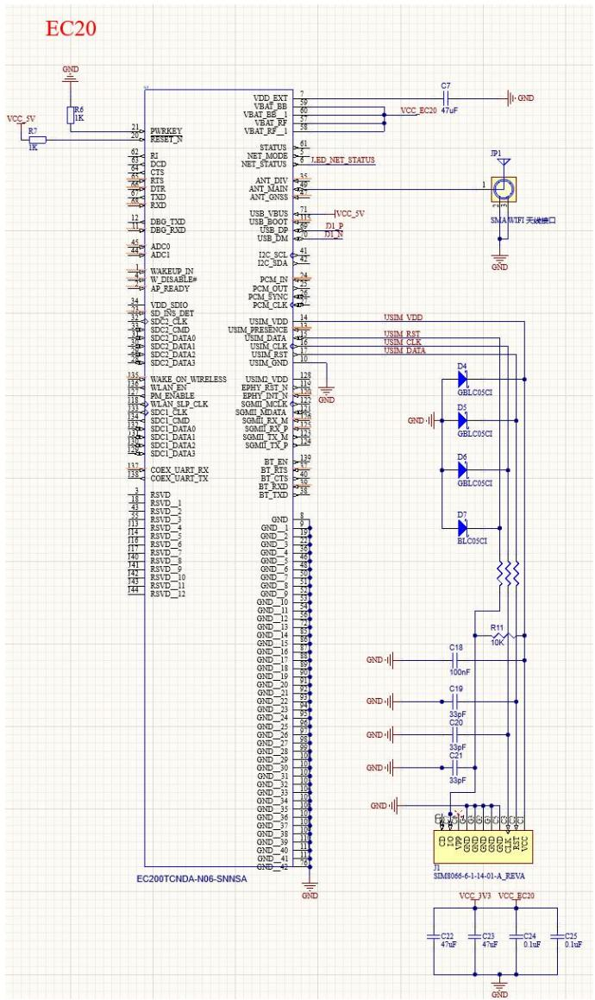
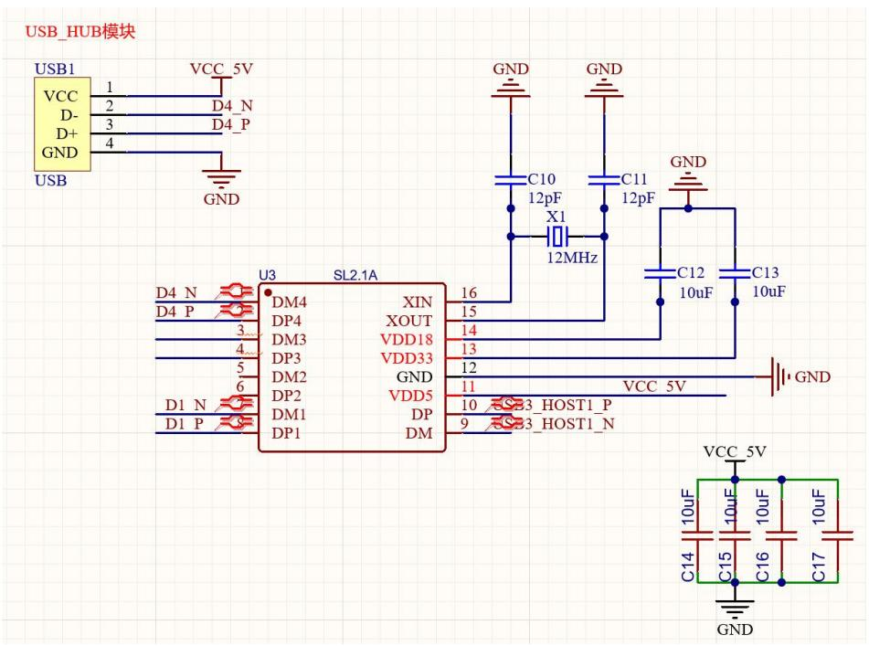
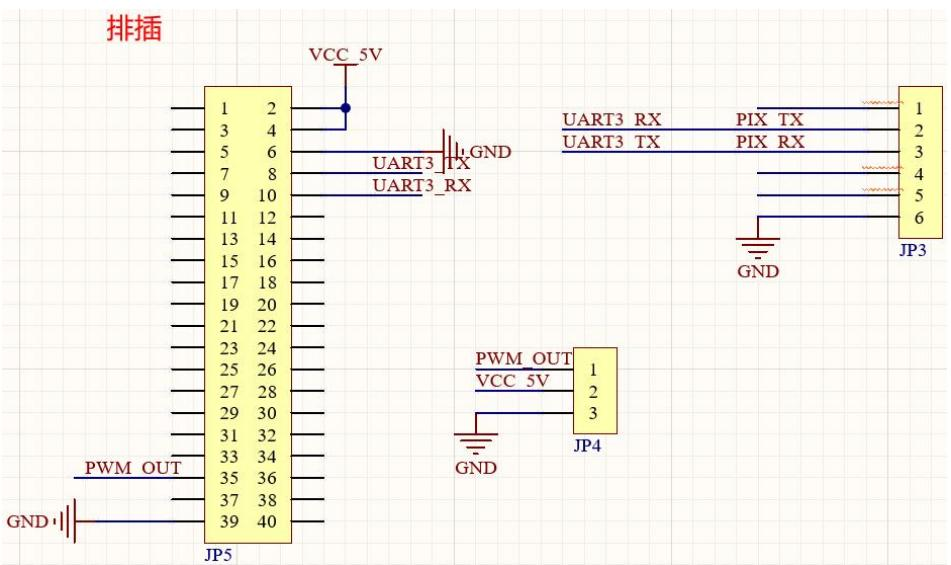
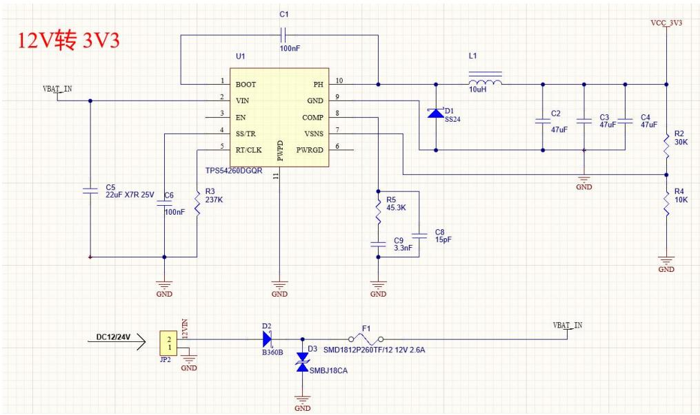
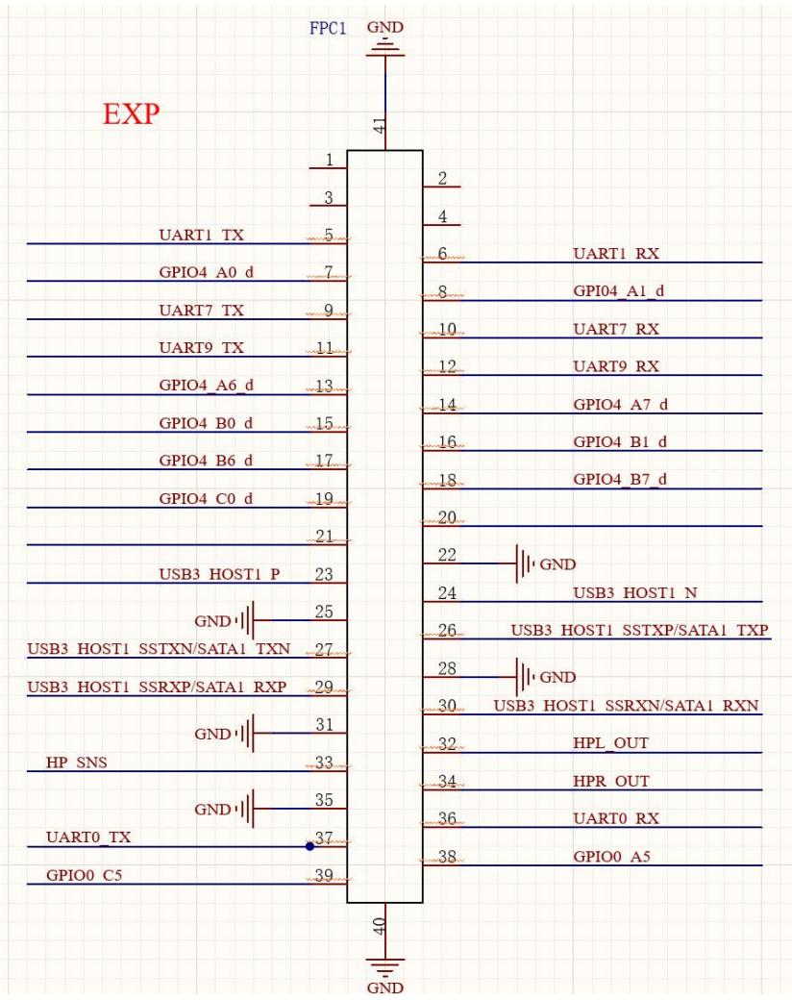
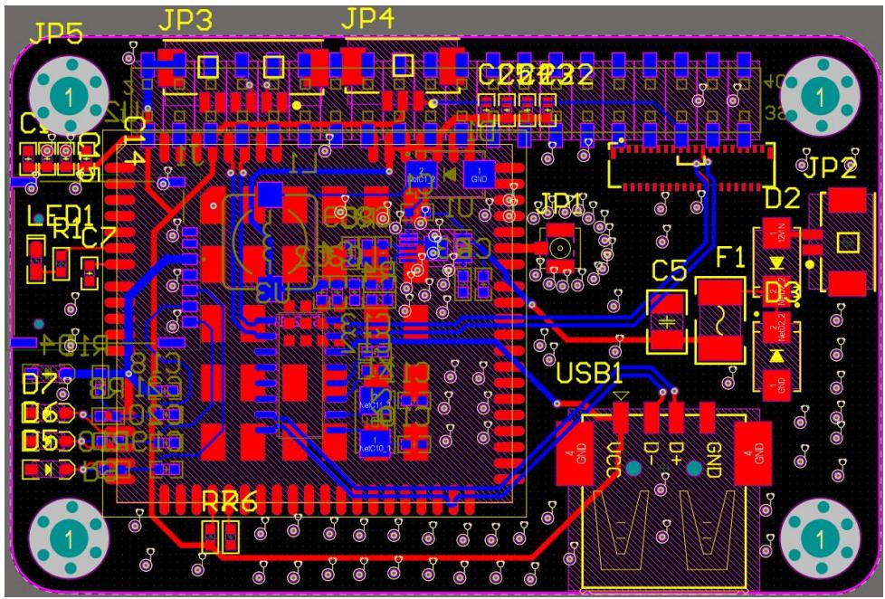
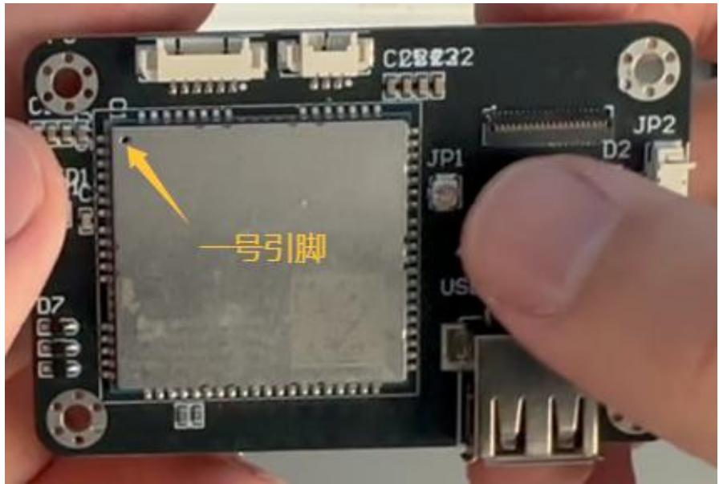
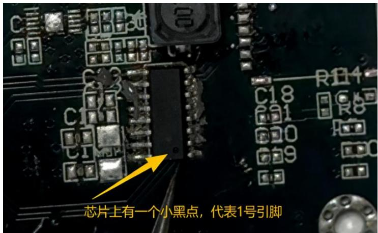
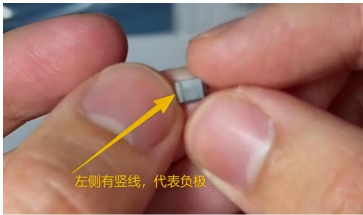
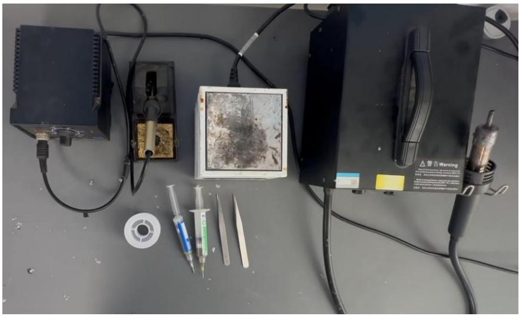

## 第五章 机载嵌入式系统的硬件设计

本章围绕机载嵌入式系统的核心焊接实践展开，重点涵盖焊接前准备、焊接工具实操及焊接后检测验证三大环节。通过系统训练，旨在帮助学习者扎实掌握机载环境下 PCB 焊接的关键技能，强化焊接质量控制与电路功能验证能力，为后续硬件系统的可靠运行奠定坚实基础。

## 5.1 实验一：机载嵌入式系统的硬件设计

## 5.1.1 实验目的

1. 理解电路原理图与PCB的对应关系，掌握“原理图定义电气逻辑、PCB承载物理实现”的基本设计流程，能够从原理图出发，梳理系统模块划分、信号流向及电源域设计要点。  
2. 能基于扩展板PCB图完成器件定位与装配前校核，重点掌握模块与芯片1号引脚识别方法以及器件极性判断，避免封装方向错误导致的硬件损坏或功能异常。

## 5.1.2 实验说明

机载嵌入式系统的硬件实现并非简单的“元件焊接”，而是包含电气逻辑定义与物理实现两个紧密衔接的阶段。原理图用于精确描述器件间的连接关系与电源/信号网络；PCB 设计则需将这些网络转化为实际布局，并额外考虑尺寸、散热、振动、电磁兼容等物理约束。设计完成后需通过 DRC（设计规则检查）等工具进行一致性验证，形成“设计‑ 验证‑ 优化”闭环，避免电气错误流入实物阶段。

实际操作中，应结合扩展板 PCB 图进行器件位置核对，并在焊接前明确各元器件的 1 号引脚及极性方向（如 4G 模块、USB HUB 芯片、二极管等）。可借助交互式BOM等辅助工具提升定位效率，确保后续焊接与调试工作建立在“位置正确、方向无误、接口清晰”的基础上。

## 5.1.3 实验步骤

步骤一：电路原理图与PCB概述

电路原理图与PCB（印制电路板）是机载嵌入式系统硬件实现的关键环节。原理图使用标准化的电气符号描述元器件之间的连接关系、功能模块划分及信号流向，其核心作用是明确“信号如何传输”，为 PCB 设计、焊接和调试提供逻辑依据。

## 步骤二：电路原理图设计

元器件符号：表示电路功能的基本单元，如电阻（R）、电容（C）、MCU（RK3566）、4G 模块（EC20）等。符号必须与实际器件的电气特性及引脚定义完全匹配，避免封装与符号不符导致的焊接错误。

导线与网络标号：导线表示电气连接，复杂电路中常使用网络标号（如VCC\_3V3、I2C\_SDA）替代长导线，提升图纸可读性，相同标号视为电气连通。

电源与接地端口：明确系统供电电压等级（如 3.3V、5V）及接地类型（数字地、模拟地）。机载系统需注意电源域划分，以减少不同电压间的相互干扰。

注释与参数标注：标注元器件型号、封装、关键参数（如容值、阻值）及设计说明，便于采购与后续调试。

EC20模块原理图如图5.1所示：

text_image

EC20
VCC_SV
R7
R6
IK
GND
PURKEY
RESET_N
VDD_EXT
VBAH_BB
VBAT_BB
VEAT_PP
VBAT_RF_1
STATUS
NET_MODE
NET_STATUS
ANT_DIV
ANT_MAIN
ANT_ONSS
USB_VBUS
USB_BOOT
USB_DP
USB_DM
ADC0
ADC1
WAKE_DN#
W_DISABLE#
AP_READY
VDD_SDIO
SD_INS_DET
SDC1_CLK
SDC1_CMD
SDC2_DATA0
SDC2_DATA1
SDC2_DATA2
SDC2_DATA3
WAKE_ON_WIRELESS
WLAN_EN
PWM_ENABLE#
WLAN_ILP_CLK
SDC1_CLK
SDC1_CMD
SDC1_DATA0
SDC1_DATA1
SDC1_DATA2
SDC1_DATA3
COEX_UART_RX
COEX_UART_TX
RSVD
RSVD_1
RSVD_2
RSVD_3
RSVD_4
RSVD_5
RSVD_6
RSVD_7
RSVD_8
RSVD_9
RSVD_10
RSVD_11
RSVD_12
VCC_EC20 47uF
VCC_V3 VCC_EC20
C7
GND
IPI
SMA NIP1 天线接口
USIM_VDD
USIM_RST
USIM_DATA
USIM_DND
USIM_VDD
USIM_DATA
USIM_DND
USIM_VDD
USIM_DATA
USIM_DND
USIM_VDD
USIM_DATA
USIM_DND
USIM_VDD
USIM_DATA
USIM_DND
USIM_VDD
USIM_DATA
USIM_DND
USIM_VDD
USIM_DATA
USIM_DND
USIM_VDD
USIM_DATA
USIM_DND
USIM_VDD
UCLCOSCI
D5
GCLCOSCI
D4
GCLCOSCI
D7
BLCOSCI
R11
10k
GND
C18 100nF C19 33pF C20 33pF C21 33pF C22 33pF C23 33pF C24 33pF C25 33pF C26 33pF C27 33pF C28 33pF C29 33pF C30 33pF C31 33pF C32 33pF C33 33pF C34 33pF C35 33pF C36 33pF C37 33pF C38 33pF C39 33pF C40 33pF C41 33pF C42 33pF C43 33pF C44 33pF C45 33pF C46 33pF C47 33pF C48 33pF C49 33pF C50 33pF C51 33pF C52 33pF C53 33pF C54 33pF C55 33pF C56 33pF C57 33pF C58 33pF C59 33pF C60 33pF C61 33pF C62 33pF C63 33pF C64 33pF C65 33pF C66 33pF C67 33pF C68 33pF C69 33pF C70 0.1uF GND
EC200TCNDA-N06-SNNSA GND SMD8066-6-1-14-01-A_REVA VCC_JV3 VCC_EC20

图 5.1 EC20 模块原理图

USB\_HUB 模块原理图如图 5.2 所示：

text_image

USB_HUB模块
USB1
VCC 5V
1
2
D4_N
D-
3
D4_P
GND
4
USB
GND
GND
C10
12pF
X1
12MHz
C11
12pF
GND
C12
10uF
C13
10uF
U3 SL2.1A
DM4 XIN
DP4 XOUT
DM3 VDD18
DP3 VDD33
DM2 GND
DP2 VDD5
DM1 DP
DP1 DM
16
15
14
13
12
11 VCC 5V
GND
D4 N DM4 DM3 DM2 DP2 DM1 DP1 DM
D4 P 3 4 5 6 D1 N D1 P 8 VCC 5V
XIN XOUT VDD18 VDD33 VDD5 DP 9 CS3_HOST1_P CS3_HOST1_N
C14 C15 C16 C17 GND

图 5.2 USB\_HUB 模块原理图

排插原理图如图5.3所示：

text_image

排插
VCC 5V
1 2
3 4
5 6
7 8
9 10
11 12
13 14
15 16
17 18
19 20
21 22
23 24
25 26
27 28
29 30
31 32
33 34
35 36
37 38
39 40
JP5
PWM OUT
GND
UART3 RX
UART3 TX
UART3_RX
GND
UART3 RX
UART3 TX
PIX TX
PIX RX
GND
JP3
1
2
3
4
5
6
PWM_OUT
VCC 5V
GND
JP4

图 5.3 排插原理图

电源模块原理图如图5.4所示：

text_image

12V转 3V3
VBAT_IN
U1
BOOT
VIN
EN
SS/TR
RT/CLK
TPS54260DGQR
PH
GND
COMP
VSNS
PWRGD
10
9
8
7
6
11
GND
R3
237K
C5
22uF X7R 25V
C6
100nF
GND
R5
45.3K
C9
3.3nF
C8
15pF
GND
D1
SS24
L1
10uH
C2
47uF
C3
47uF
C4
47uF
R2
30K
GND
R4
10K
GND
VCC_3V3
DC12/24V
JP2
12VDN
GND
D2
B360B
D3 SMD1812P260TF/12 12V 2.6A
SMBJ18CA
GND
F1
VBAT_IN

图 5.4 电源模块原理图

EXP 原理图如图 5.5 所示：

text_image

EXP
FPC1 GND
1 2
3 4
UART1 TX 5
GPIO4 A0 d 7
UART7 TX 9
UART9 TX 11
GPIO4 A6 d 13
GPIO4 B0 d 15
GPIO4 B6 d 17
GPIO4 C0 d 19
21
USB3 HOST1 P 23
GND|| 25
USB3 HOST1 SSTXN/SATA1 TXN 27
USB3 HOST1 SSRXP/SATA1 RXP 29
GND|| 31
HP SNS 33
GND|| 35
UART0 TX 37
GPIO0 C5 39
40 GND
6 UART1 RX
8 GPIO4 A1 d
10 UART7 RX
12 UART9 RX
14 GPIO4 A7 d
16 GPIO4 B1 d
18 GPIO4 B7 d
20
22 GND
24 USB3 HOST1 N
26 USB3 HOST1 SSTXP/SATA1 TXP
28 GND
30 USB3 HOST1 SSRXN/SATA1 RXN
32 HPL_OUT
34 HPR_OUT
36 UART0 RX
38 GPIO0 A5

图 5.5 EXP 原理图

## 步骤三：PCB设计

PCB 是将原理图的电气逻辑转化为实体电路的关键载体，通过铜箔导线、焊盘、过孔等结构实现元器件的机械固定与电气互联。其设计质量直接影响无人机飞行的稳定性与任务可靠性。

焊盘：器件引脚的焊接区域，形状与尺寸须与器件封装匹配，保证焊接牢固。

导线（铜箔）：信号传输的物理通道，宽度应根据电流大小设计，关键信号线需进行阻抗控制。

过孔：用于不同板层间的电气连接，常见类型包括通孔、盲孔与埋孔。机载PCB常采用盲埋孔以减轻重量并降低干扰。

敷铜与地平面：在PCB空白区域铺设铜层，形成完整的地平面或电源平面，可有效抑制电磁干扰并改善散热。

层叠结构：根据系统复杂度选择2层、4层或多层板设计。多层板有利于实现信号隔离，适用于高频、高集成度的机载系统。

## 步骤四：原理图与 PCB 的协同关系

原理图是 PCB 设计的输入依据，通过网表（Netlist）将电气连接关系导入PCB 设计软件。PCB 布局需在遵循电气逻辑的基础上，合理安排器件位置，并解决散热、抗振、尺寸等物理约束。设计完成后需通过 DRC 进行双向验证，若发现冲突可回溯优化原理图，形成设计闭环。

如图 5.6 所示。展示了扩展板的 PCB 布局示例，图中清晰呈现了各模块的摆放与走线关系。

text_image

JP5
JP3
JP4
C20122
1
C14
LED1
R1C7
1
JN01.2
1 GND
JP18
D2
F1
D3
USB1
1
1
1
D7
8A1-10
D6
10A1
D5
DCB210
RR6
1
GND
GND
GND
GND
1

图5.6 扩展板PCB电路图

通常，模块、芯片及器件实物上面都会有1号引脚和正负极方向标识，我们需要识别出来便于焊接时找对引脚方向。4G模块1号引脚标识如图5.7所示：

text_image

C2B22
JP1
JP2
D2
USB
D7
一号引脚

图5.7 4G模块1号引脚标识

USBHUB 芯片1号引脚标识如图5.8所示：

text_image

芯片上有一个小黑点，代表1号引脚

图 5.8 USB HUB 芯片 1 号引脚标识

二极管正负极判断方法如图 5.9所示：

text_image

左侧有竖线，代表负极

图5.9 二极管正负极判断方法

## 步骤五：工具调试与校准

1.焊枪：调试温度至350-380℃（常规器件）、380-400℃（密集引脚器件），使用前清洁烙铁头并镀锡。  
2.热风枪：风速1‑ 3档，温度300‑ 420℃，使用前测试出风均匀性。  
3.加热台：设定为200‑ 250℃，确保台面温度均匀、平整。  
4.配套工具：准备无铅焊锡丝、焊锡膏、防静电镊子等。  
5.环境搭建：在通风、无尘的工作台上铺设防静电垫并接地，操作人员佩戴防静电手环。将PCB固定在支架上，保持稳定。  
6.器件预处理：检查引脚是否氧化，必要时用细砂纸打磨；BGA 器件检查焊球完整性；敏感器件需在防静电环境下取用。

常用焊接工具组合如图5.10所示：

natural_image

Laboratory setup with electronic equipment including a power supply unit, soldering iron, and test probes (no visible text or symbols)

图5.10 常用焊接工具组合