## 5.2 实验二：机载嵌入式系统的焊接与调试

## 5.2.1 实验目的

1.熟练运用焊枪、热风枪、加热台等工具，掌握常规表贴元件（如0805/0603封装）及 BGA 封装器件（如EC20 4G模块）的焊接工艺，能独立完成规范焊接。  
2.掌握焊接后的外观检查、导通测试与功能验证方法，能够准确排查常见焊接缺陷，确保电路满足机载系统的可靠性要求。

## 5.2.2 实验说明

焊接是硬件实现的关键环节，其质量直接影响电路在振动、高低温等机载环境下的稳定性。本实验系统讲解焊接准备、工艺操作与质量检测的全流程要点，涵盖常规元件与精密器件的差异化工艺，并建立“外观‑ 导通‑ 功能”三级验证体系。

注意事项：

1.全程采取防静电措施，避免损坏敏感器件。  
2.高温工具操作需佩戴防护手套，工作区远离易燃物。  
3.遵循“先供电后功能、先核心后外围”的焊接顺序，防止短路或器件损坏。

## 5.2.3 实验步骤

步骤一：PCB 焊接操作

1. 焊枪操作（适用于 0805/0603 电阻电容、连接器等常规元件）：

 预热：烙铁头温度稳定后，先接触 PCB 焊盘预热1-2 秒，使焊盘温度达到焊锡熔化要求。  
 送锡：将焊锡丝靠近烙铁头与焊盘的交界处，待焊锡熔化并均匀覆盖焊盘（约占焊盘面积的 80%）后，先移开焊锡丝，再保持烙铁头停留0.5秒左右后移开。

焊点应圆润饱满、无毛刺，引脚与焊盘完全浸润，无连锡、虚焊。烙铁不用时务必放回支架，禁止触碰导线或塑料部件；焊接 MCU 等敏感器件时，需使用防静电烙铁，避免静电损坏。

接插件焊接示意图如图5.11所示：

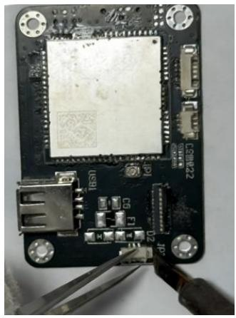

natural_image

Close-up of a black electronic circuit board with visible components and wires, no readable text or symbols present.

图5.11 接插件焊接示意图

0603 封装器件焊接示意图如图5.12所示：

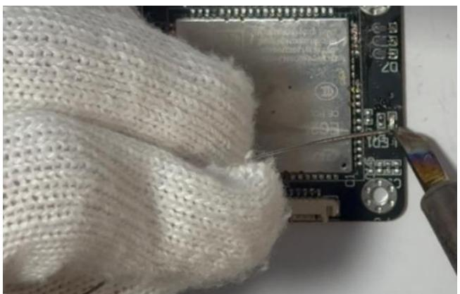

natural_image

Close-up of a hand holding a white textured fabric with a black electronic board and control panel (no visible text or symbols)

图5.12 0603封装器件焊接示意图

2. 热风枪操作（适用于 EC20 BGA 封装、QFP 封装等精密器件）：

 预处理：在器件焊盘上均匀涂抹一层薄焊锡膏，用镊子将器件精准对齐焊盘，确保引脚与焊盘一一对应。  
 参数设置：焊接EC20 模块时，温度调至400-420℃、风速2-3档；焊接小尺寸QFP 器件时，温度380-400℃、风速1-2 档。  
 加热：热风枪与 PCB 板呈 45°角，距离器件 2-5cm，以画圈方式均匀加热，观察焊锡膏熔化状态（器件轻微“塌陷”并贴合焊盘即为合格）。  
 冷却：加热完成后，保持热风枪缓慢移开，待器件自然冷却至室温，禁止用手触碰。

使用热风枪前要涂上锡膏，如图5.13所示：

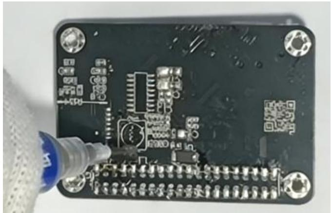

natural_image

Close-up of a Raspberry Pi board with visible circuitry and components, no readable text or symbols

图5.13 焊盘上涂上锡膏

热风枪焊接 USBHub 芯片如图 5.14 所示：

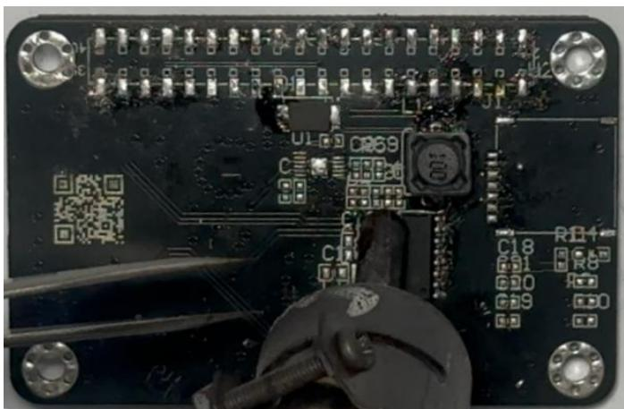

natural_image

Close-up of a black electronic circuit board with visible traces, pads, and components (no readable text or symbols)

图 5.14 热风枪焊接 USBHub 芯片示意图

热风枪焊接SIM 卡槽如图5.15所示：

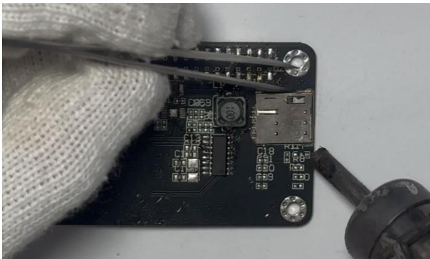

natural_image

Close-up of a black electronic circuit board with visible components and wires, being handled by gloved hands (no readable text or symbols)

图5.15 热风枪焊接SIM 卡槽示意图

3. 加热台操作（适用于大面积焊盘或多器件同步焊接）：

 放置 PCB 板：将 PCB 板焊接区域贴合加热台，用耐高温夹具固定，避免加热时移位。  
 焊接：在器件焊盘涂抹焊锡膏，对齐放置元器件，待加热台温度稳定后保持 30秒，观察焊锡膏完全熔化后关闭加热台。  
 冷却：待 PCB 板自然冷却至室温后取下，禁止直接用手触摸加热区域。  
加热台焊接多个器件，如图 5.16所示：

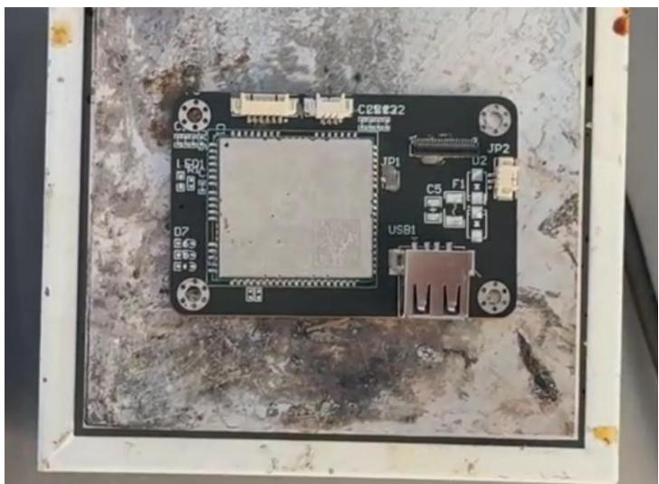

natural_image

Close-up of an electronic circuit board with labeled components (no readable text or symbols beyond labels)

图5.16 加热台焊接多个器件示意图

为避免加热台没有将各引脚“焊实”，需要使用电烙铁为各引脚进行补锡操作。电烙铁为4G模块补锡，如图 5.17所示：

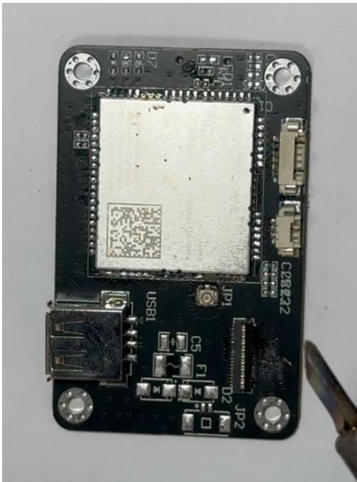

natural_image

Close-up of a black electronic circuit board with visible components and connectors (no readable text or symbols)

图5.17 4G模块补锡操作示意图

电烙铁为FPC 软座补锡。如图5.18所示：

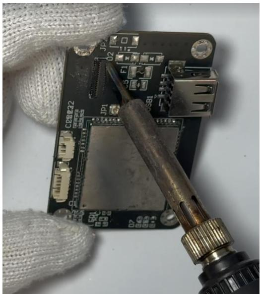

natural_image

Close-up of a soldering iron on a circuit board with visible components and soldering tool (no readable text or symbols)

图5.18 电烙铁为FPC 软座补锡示意图

4G 扩展板 BOM 表如图 5.19 所示：

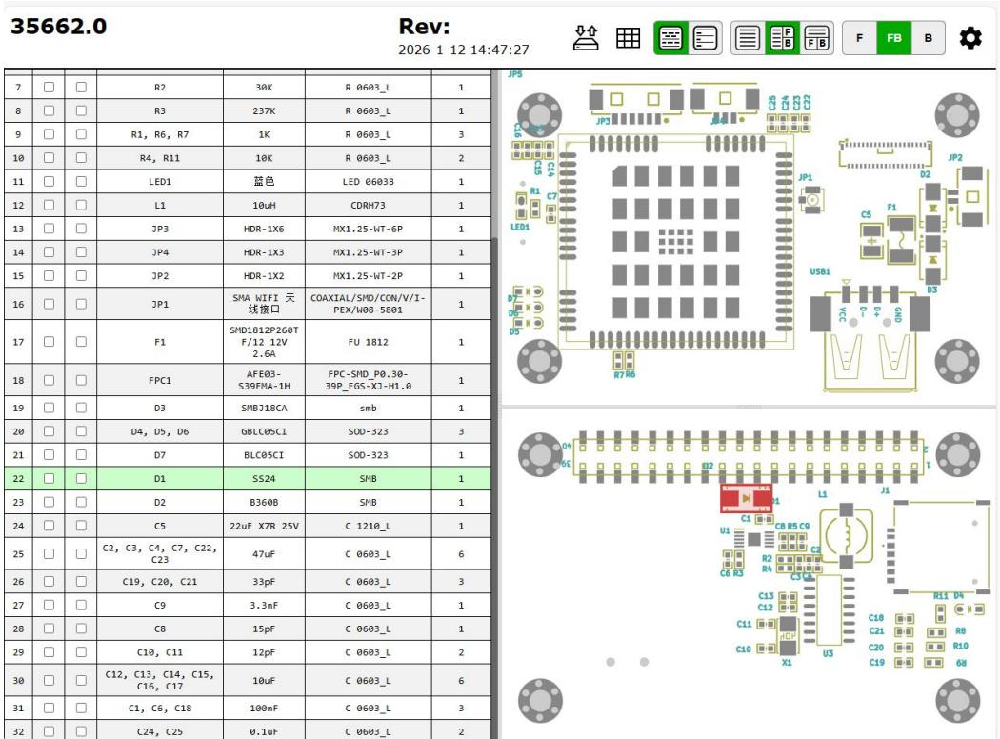

text_image

35662.0
Rev:
2026-1-12 14:47:27
7 □ □ R2 30K R 0603_L 1
8 □ □ R3 237K R 0603_L 1
9 □ □ R1, R6, R7 1K R 0603_L 3
10 □ □ R4, R11 10K R 0603_L 2
11 □ □ LED1 蓝色 LED 0603B 1
12 □ □ L1 10uH CDRH73 1
13 □ □ JP3 HDR-1X6 MX1.25-WT-6P 1
14 □ □ JP4 HDR-1X3 MX1.25-WT-3P 1
15 □ □ JP2 HDR-1X2 MX1.25-WT-2P 1
16 □ □ JP1 SMA WIFI 天线接口 COAXIAL/SMD/CON/V/I-PEX/W08-5B01 1
17 □ □ F1 SMD1812P260TF/12 12V 2.6A FU 1812 1
18 □ □ FPC1 AFE03-S39FMA-1H FPC-SMD_P0.30-39P_FGS-X3-M1.0 1
19 □ □ D3 SMBJ18CA smb 1
20 □ □ D4, D5, D6 GBLC05CI SOD-323 3
21 □ □ D7 BLC05CI SOD-323 1
22 □ □ D1 SS24 SMB 1
23 □ □ D2 B360B SMB 1
24 □ □ C5 22uF X7R 25V C 1210_L 1
25 □ □ C2, C3, C4, C7, C22, C23 47uF C 0603_L 6
26 □ □ C19, C20, C21 33pF C 0603_L 3
27 □ □ C9 3.3nF C 0603_L 1
28 □ □ C8 15pF C 0603_L 1
29 □ □ C10, C11 12pF C 0603_L 2
30 □ □ C12, C13, C14, C15, C16, C17 10uF C 0603_L 6
31 □ □ C1, C6, C18 100nF C 0603_L 3
32 □ □ C24, C25 0.1uF C 0603_L 2

图 5.19 4G 扩展板 BOM 表

通过 InteractiveHtmlBomForAD-master 插件导出的 HTML 文件，可以帮助同学门更好的找到器件焊接的位置。

## 步骤二：焊接后检测与电路验证

1.外观检测：逐一检查所有焊点，确保焊点圆润饱满、无虚焊（焊点无光泽、呈 “豆腐渣”状）、假焊（引脚与焊盘未完全贴合）、连锡（相邻焊盘短路）等缺陷。  
2.检查元器件：确认无移位、引脚弯曲、损坏，BGA 封装器件无倾斜，焊盘无脱落。发现连锡需要用吸锡带清理，虚焊则补焊，器件移位需重新焊接。  
3.导通性检测：用万用表蜂鸣档测量关键电路：电源引脚与地之间（无短路蜂鸣，避免电源短路烧毁器件）、核心器件引脚与对应焊盘（有蜂鸣则导通正常）、控制信号链路（如4G模块 USB\_DP 引脚与核心板接口）。重点排查电源电路、核心器件供电引脚、射频模块天线接口等关键链路，确保无开路。

测试前我们需要焊接一根一分二的供电线，使得电源小板能够同时为RK3566 和扩展板供电。如图5.20所示：

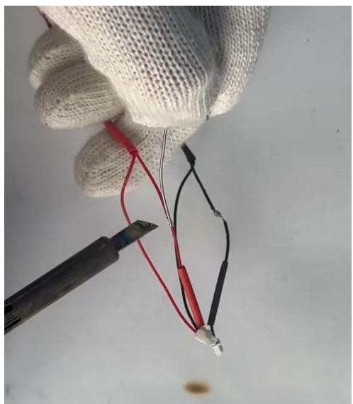

natural_image

Close-up of a gloved hand holding a thin black and red wire with a small white object nearby (no text or symbols visible)

图5.20 电源小板一分二供电线焊接

焊接好后，未避免焊线处正负极短接，需要使用热风枪及热缩管将焊线处包裹住，如图5.21所示：

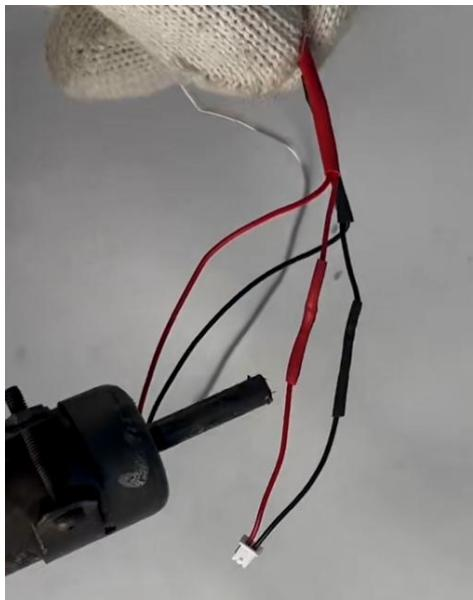

natural_image

Close-up of a wire-wrapped object with black and red wires, attached to a wire (no text or symbols visible)

图5.21 使用热缩管包裹焊接处

4.功能验证：将焊接完成的PCB板与RK3566、传感器及电源相连接。测试前我们需要插好天线、FPC 排线、键鼠 USB，确保供电电压匹配后接通电源，注意极性对应否则会烧坏电路板！若因接反而出现冒烟，散发气味等现象，我们要冷静处理，第一时间拔掉电源，保障人员安全。

测试前准备好泰山派及4G扩展板，如图 5.22所示：

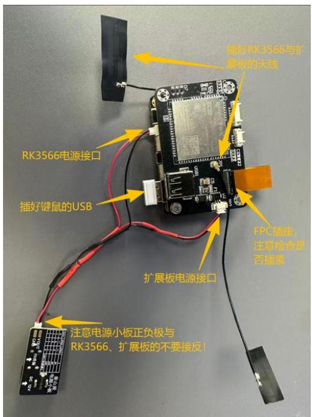

text_image

随时RK3566与扩展板的天线
RK3566电源接口
插好键鼠的USB
扩展板电源接口
FPC插座，注意检查是否插紧
注意电源小板正负极与RK3566、扩展板的不要接反！

图5.22 测试前准备

观察到红色LED灯闪烁，说明4G模块网络状态正常。如图5.23所示：

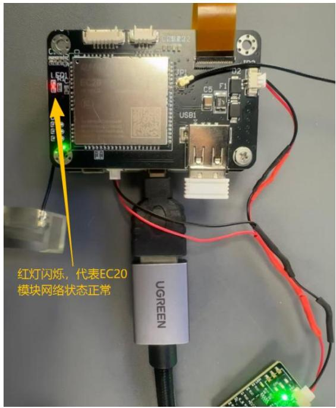

text_image

红灯闪烁，代表EC20
模块网络状态正常

图5.23 4G模块正常运作

测试4G模块VBAT引脚（EC20 模块60引脚），3.3V左右代表模块供电正常。如图5.24所示：

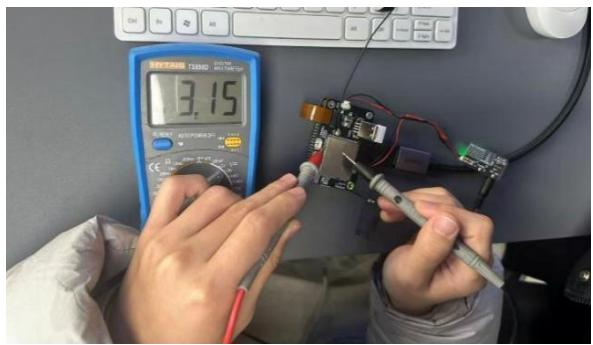

text_image

3.15Ω
TANTU
T1380
T1380
T1380
T1380
T1380
T1380
T1380
T1380
T1380
T1380
T1380
T1380
T1380
T1380
T1380
T1380
T1380
T1400
T1400
T1400
T1400
T1400
T1400
T1400
T1400
T1400
T1400
T1400
T1400
T1400
T1400
T1400
T1400
T1400
T2675
T2675
T2675
T2675
T2675
T2675
T2675
T2675
T2675
T2675
T2675
T2675
T2675
T2675
T2675
T2675
T2675
T2755
T2755
T2755
T2755
T2755
T2755
T2755
T2755
T2755
T2755
T2755
T2755
T2755
T2755
T2755
T2755
T2755
T3180
T3180
T3180
T3180
T3180
T3180
T3180
T3180
T3180
T3180
T3180
T3180
T3180
T3180
T3180
T3180

图 5.24 万用表测试 VBAT 引脚

测试 4G 模块 USB\_VBUS 引脚（EC20 模块 71 引脚），5.0V 左右代表 USBHUB 模块供电正常。如图5.25所示：

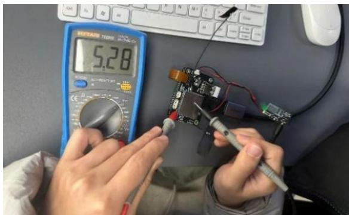

natural_image

Person working on a circuit board with a multimeter and screwdriver, no visible text or symbols

图 5.25 万用表测试 USB\_VBUS 引脚

测试 4G 模块 USIM\_VDD 引脚（EC20 模块 14 引脚），1.8V 左右代表 SIM卡槽模块供电正常。如图5.26所示：

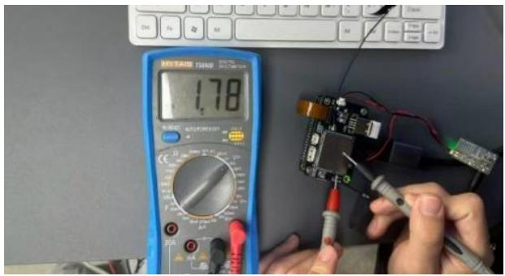

natural_image

Close-up of hands working on a circuit board with multimeter and power tool (no visible text or symbols)

图 5.26 万用表测试 USIM\_VDD 引脚

5.EC20模块功能测试：通过 HDMI 连接显示屏查看是否正常联网。当看到“Mobile Broadband”时说明 4G 模块正常，但下一行若显示“not registered”，说明我们的SIM 卡有问题或SIM 卡槽没焊接成功，可以尝试换一张SIM 卡或者重新焊接SIM 卡槽。

SIM 模块出现问题时的信息显示如图 5.27所示：

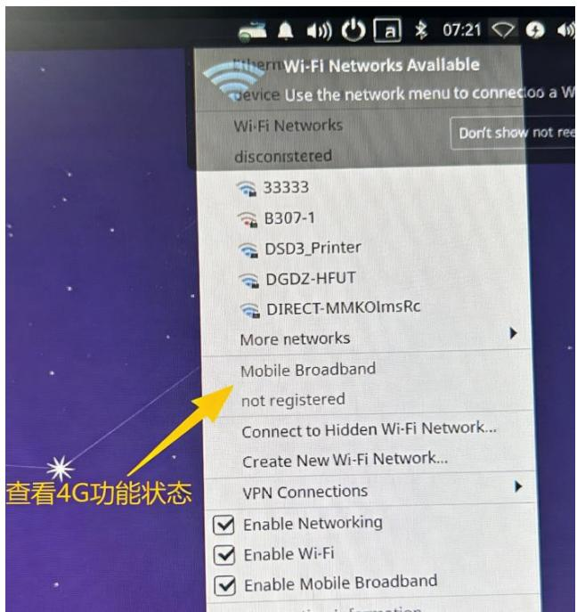

text_image

Ethernet Wi-Fi Networks Available
device: Use the network menu to connect a Wi-Fi Networks
disconistered
33333
B307-1
DSD3_Printer
DGDZ-HFUT
DIRECT-MMKOLmsRc
More networks
Mobile Broadband
not registered
Connect to Hidden Wi-Fi Network...
Create New Wi-Fi Network...
VPN Connections
Enable Networking
Enable Wi-Fi
Enable Mobile Broadband

图5.27 SIM 模块出现问题时的信息显示

当显示信息如图 5.28 所示时，代表我们 4G 模块以及 SIM 卡没有问题，能够联网。

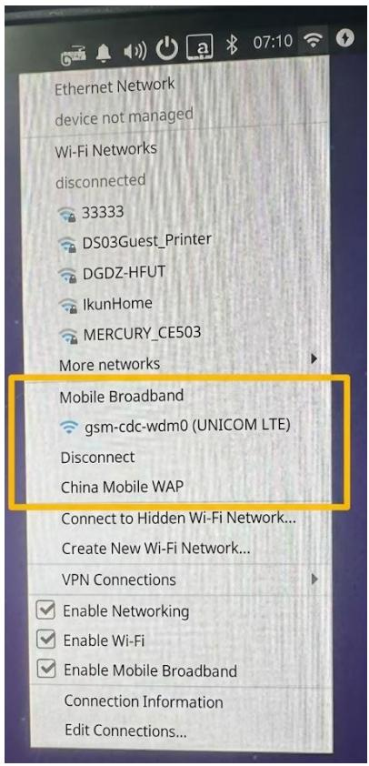

text_image

Ethernet Network
device not managed
Wi-Fi Networks
disconnected
33333
DS03Guest_Printer
DGDZ-HFUT
IkunHome
MERCURY_CE503
More networks
Mobile Broadband
gsm-cdc-wdm0 (UNICOM LTE)
Disconnect
China Mobile WAP
Connect to Hidden Wi-Fi Network...
Create New Wi-Fi Network...
VPN Connections
Enable Networking
Enable Wi-Fi
Enable Mobile Broadband
Connection Information
Edit Connections...

图5.28 能够联网时的信息显示

RK3566 40pin 引脚功能图如图 5.29 所示：

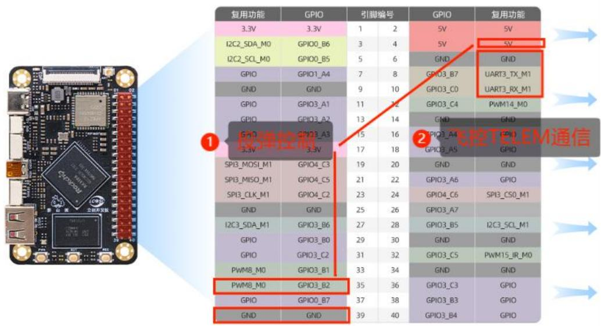

text_image

复用功能
3.3V
I2C2_SDA_M0
I2C2_SCL_M0
GPIO
GND
GPIO
GPIO1_A4
GPIO3_A1
GPIO
GPIO3_A2
GPIO
GPIO3_A3
3.3V
SPI3_MOSI_M1
SPI3_MISO_M1
SPI3_CLK_M1
GND
I2C3_SDA_M1
GPIO
GPIO3_B0
GPIO
GPIO3_C2
PWM8_M0
PWM8_M0
GPIO
GPIO0_B7
GND
GPIO0_B6
GPIO0_B5
GPIO0_B6
GPIO0_B5
GPIO0_B5
GPIO0_B5
GPIO0_B6
GPIO0_B5
GPIO0_B5
GPIO0_B5
GPIO0_B6
GPIO0_B5
GPIO0_B5
GPIO0_B6
GPIO0_B5
GPIO0_B5
GPIO0_B6
GPIO0_B5
GPIO0_B5
GPIO0_B6
GPIO0_B5
GPIO0_B5
GPIO0_B6
GPIO0_B5
GPIO0_B5
GPIO0_B6
GPIO0_B5
GPIO0_B5
GPIO0_B6
GPIO0_B5
GPIO0_B6
GPIO0_B5
GPIO0_B5
GPIO0_B6
GPIO0_B5
GPIO0_B5
GPIO0_B6
GPIO0_B5
GPIO0_B5
GPIO0_B6
GPIO0_B5
GPIO0_B5
GPIO0_B6
GPIO0_B5
GPIO0_B5
GPIO0_B6
GPIO0_B5
GPIO0_B5
GPIO0_B5
GPIO0_B6
GPIO0_B5
GPIO0_B5
GPIO0_B6
GPIO0_B5
GPIO0_B5
GPIO0_B6
GPIO0_B5
GPIO0_B5
GPIO0_B6
GPIO0_B5
GPIO0_B5
GPIO0_B6
GPIO0_B6
GPIO0_B5
GPIO0_B5
GPIO0_B5
GPIO0_B6
GPIO0_B5
GPIO0_B5
GPIO0_B6
GPIO0_B6
GPIO0_B5
GPIO0_B5
GPIO0_B5
GPIO0_B6
GPIO0_B6
GPIO0_B5
GPIO0_B5
GPIO0_B5
GPIO0_B6
GPIO0_B6
GPIO0_B5
GPIO0_B5
GPIO0_B5
GPIO0_B6
GPIO0_B6
GPIO0_B5
GPIO0_B5
GPIO0_B5
GPIO0_B6
GPIO0_B6
GPIO0_B6
GPIO0_B6
GPIO0_B6
GPIO0_B6
GND

图 5.29 RK3566 40pin 引脚功能图

RK3566 与扩展板实拍图如图5.30所示：

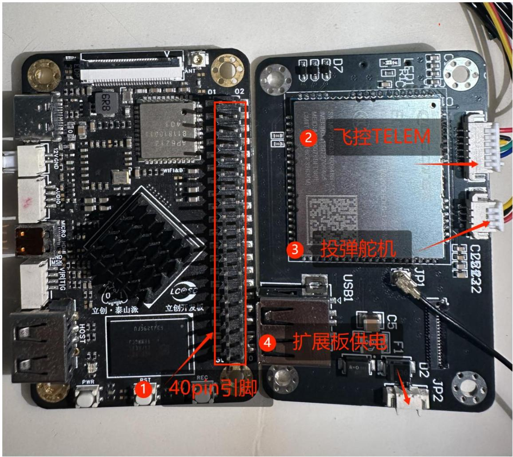

text_image

40pH引脚
飞控TELEM
投弹舵机
扩展板供电

图 5.30 RK3566 与扩展板实拍图

上图的右边是制板的扩展板，需要单独供电，板上搭载了EC20 模块，具备4G 功能，其背面的接插件可与飞控 TELEM 接口连接进行通信以及投弹舵机控制。

RK3566 与扩展板在机舱内连线实拍图如图5.31所示：

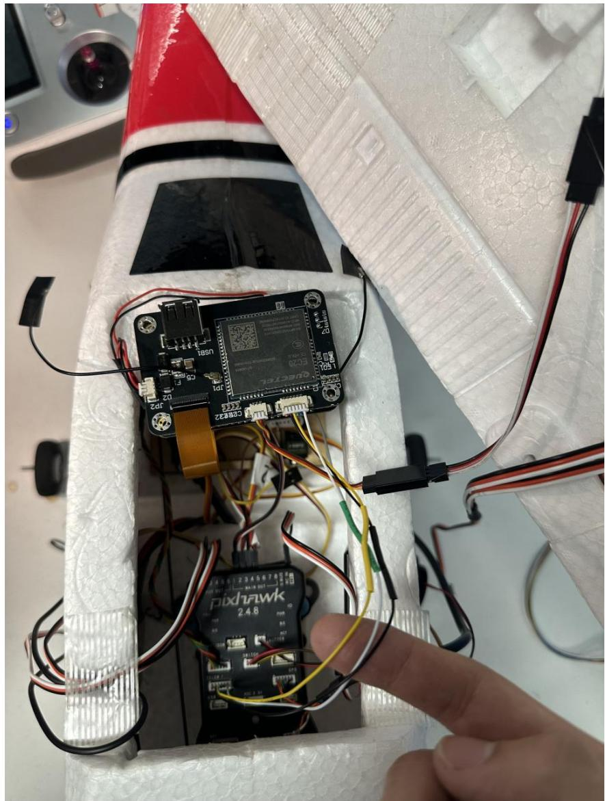

natural_image

Close-up of a robotic device with visible wiring and components, no readable text or symbols present.

图 5.31 RK3566 与扩展板连线图

注：该章节焊接的扩展板与嘉立创的扩展板功能一致，大家要注意自制扩展板和嘉立创扩展板的连线区别，需要学习手动制板的同学可以认真学习此章节。