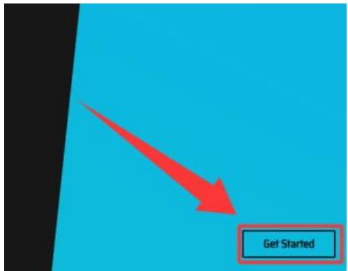
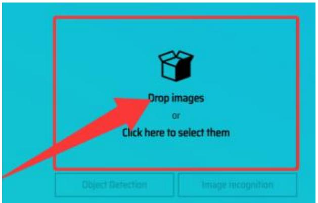
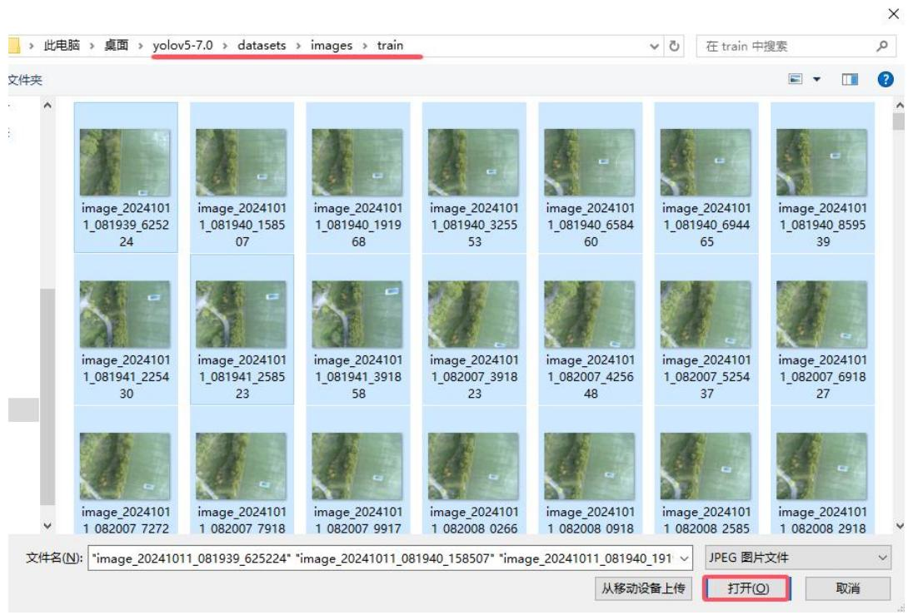
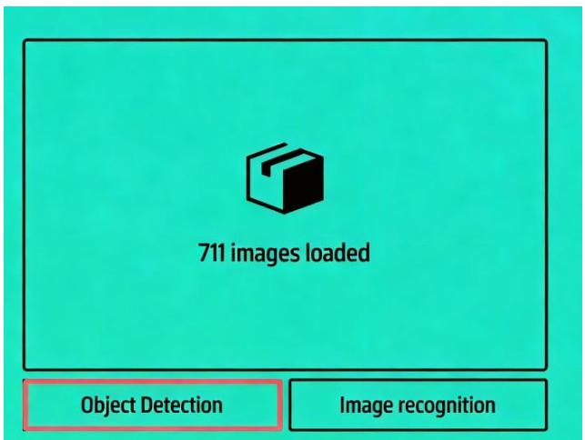
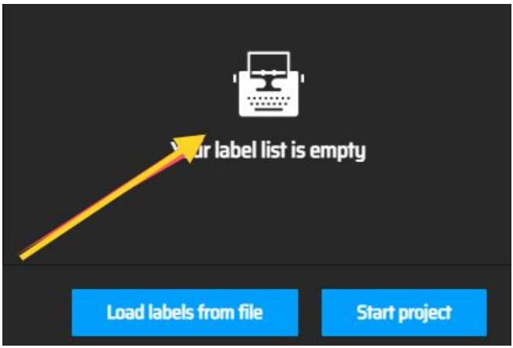
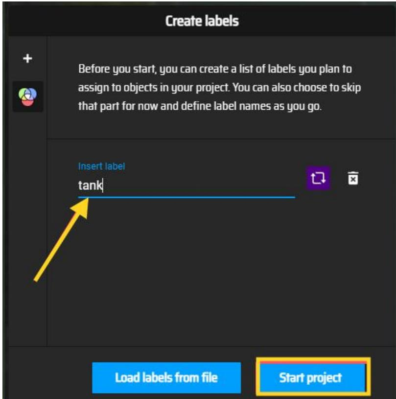
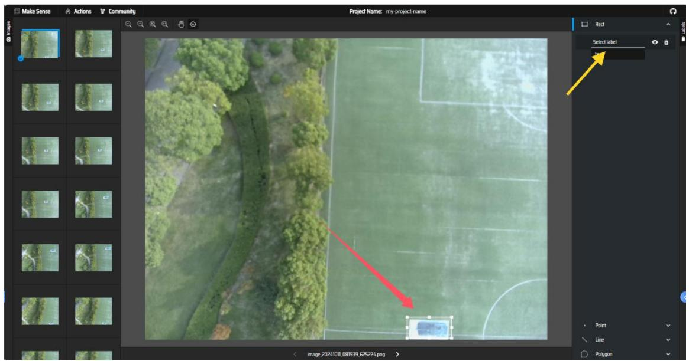
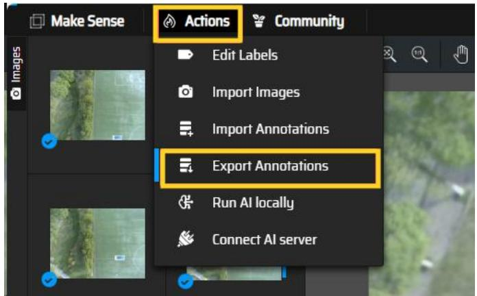
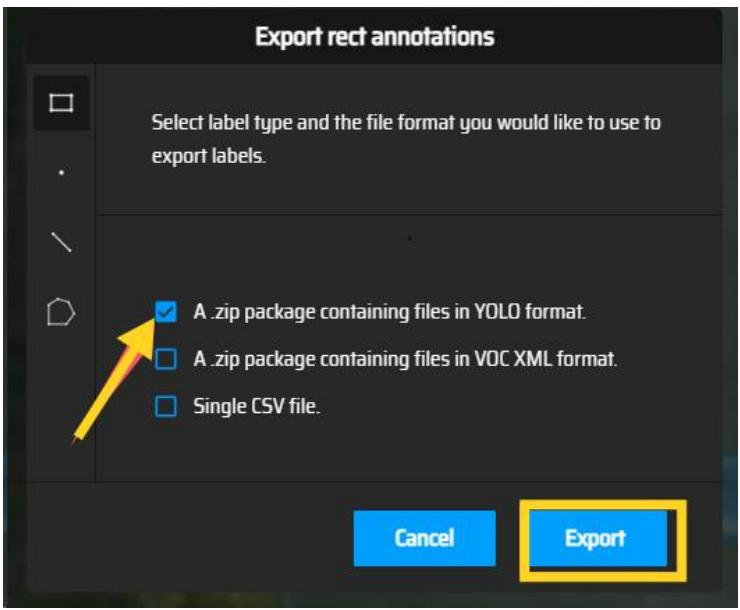

## 第六章 机载嵌入式系统的目标识别功能设计

## 6.1 实验一：图像数据标注与YOLO格式数据集构建

## 6.1.1 实验目的

本实验旨在使学生掌握使用在线标注工具makesense.ai对无人机采集图像进行目标标注的方法；熟悉 YOLOv5 模型训练所需数据集的目录结构与文件命名规范；学会按标准比例划分训练集与验证集，并完成数据预处理与归档，为后续模型训练提供高质量、格式统一的数据基础。

## 6.1.2 实验说明

本实验主要面向初步图像识别任务的数据准备环节。通过无人机采集的原始图像首先使用makesense.ai 进行标注，构建符合YOLO 格式的数据集，并按标准比例划分训练集和验证集，并按固定格式归档存放。

## 6.1.3 实验步骤

## 步骤一：数据集的划分

将提供的 1000张坦克图片按 5:1 比例分别放入文件名为train（训练集）和val（验证集）的文件。确保两集的图像无重复，且场景分布均衡（如不同光照、角度）。

创建标准目录结构（在 yolov5/datasets 下）：

```txt
yolov5/
datasets/
|— images/    # 存放原始图片
| | train/    # 800 张（训练集）
| | val/    # 200 张（验证集）
| labels/    # 后续存放标注文件（先空着）
| train/    # 训练集标签
| val/    # 验证集标签
```

## 步骤二：数据标注

使用在线工具 make sense.ai（无需安装，支持 YOLO 格式）对 images/train和 images/val 中 的 图 片 进 行 标 注 ， 生 成 YOLO 格 式 标 签 （ .txt ）

```txt
(https://www.makesense.ai/)
```

进入 make sense.ai，点击 Get Started，如图 6.1 所示：



<details>
<summary>text_image</summary>

Get Started
</details>

图 6.1 MAKE SENSE 桌面

按照下图标注点击，然后打开，如图6.2所示：



<details>
<summary>text_image</summary>

Drop images
or
Click here to select them
Object Detection
Image recognition
</details>

图 6.2 打开数据集图片

标注训练集

找到 yolov5 > datasets > images > train

然后ctrl+A 全选图片，点击打开图片，如图6.3所示：



<details>
<summary>text_image</summary>

此电脑 > 桌面 > yolov5-7.0 > datasets > images > train
在 train 中搜索
文件夹
image_2024101
1_081939_6252
24
image_2024101
1_081940_1585
07
image_2024101
1_081940_1919
68
image_2024101
1_081940_3255
53
image_2024101
1_081940_6584
60
image_2024101
1_081940_6944
65
image_2024101
1_081940_8595
39
image_2024101
1_081941_2254
30
image_2024101
1_081941_2585
23
image_2024101
1_081941_3918
58
image_2024101
1_082007_3918
23
image_2024101
1_082007_4256
48
image_2024101
1_082007_5254
37
image_2024101
1_082007_6918
27
image_2024101
1 082007 7272
image_2024101
1 082007 7918
image_2024101
1 082007 9917
image_2024101
1 082008 0266
image_2024101
1 082008 0918
image_2024101
1 082008 2585
image_2024101
1 082008 2918
文件名(N): "image_20241011_081939_625224" "image_20241011_081940_158507" "image_20241011_081940_191"
从移动设备上传 打开(O) 取消
</details>

图 6.3 全选数据集

如图 6.4 所示。点击 Object Detection。



<details>
<summary>text_image</summary>

711 images loaded
Object Detection
Image recognition
</details>

图 6.4 进行目标标注

如图6.5所示。填入要标注的数据集标签tank。



<details>
<summary>text_image</summary>

Your label list is empty
Load labels from file
Start project
</details>

图 6.5 添加标签

如图 6.6 所示。输入 tank，点击 Start project。



<details>
<summary>text_image</summary>

Create labels
Before you start, you can create a list of labels you plan to assign to objects in your project. You can also choose to skip that part for now and define label names as you go.
Insert label
tank
Load labels from file
Start project
</details>

图 6.6 开始工程

数据集标注如图 6.7所示。从第一张图片通过鼠标左键点击并拖拽的方式绘制矩形标注框，完整框选坦克目标的外接矩形区域，点击图片然后拉伸，完成矩形框绘制后，点击界面右上角的"Select label"选项，在下拉菜单中选择预设的"tank"类别标签（本实验采用单类别标注策略），首次标签设置后，系统将自动记忆当前选择，后续标注时只需直接绘制矩形框即可自动应用"tank"标签，可用快捷键ctrl +右移键（下一张）和快捷键ctrl +左移键（上一张）来快速切换图片。

标注注意事项：标注框应紧密贴合坦克目标的可见轮廓，确保不包含过多背景区域。对于部分遮挡目标，仅标注可视部分，不进行推测性标注。遇到图像质量不符合要求的情况（如严重模糊或目标不可辨），应跳过不予标注（实验给出的数据集都可以进行标注）。



<details>
<summary>text_image</summary>

Make Sense
Actions
Community
Project Name: my-project-name
Select label
Point
Line
Polygon
image 20241011_081939_625224.png
</details>

图 6.7 进行数据集标注

完成所有图片标注后，需从最后一张图片开始逆向检查：使用快捷键Ctrl+←逐张核查，确保每张有效图片均包含完整覆盖坦克目标的标注框，无遗漏或多余标注。发现错标时右键删除并重新标注。检查完毕后保存所有修改，确保数据集完整准确。

如图 6.8 所示。标注完成后，点击 Action->Export Annotations



<details>
<summary>text_image</summary>

Make Sense
Actions
Community
Edit Labels
Import Images
Import Annotations
Export Annotations
Run AI locally
Connect AI server
</details>

图 6.8 导出标注完的数据集

步骤三：导出YOLO 格式

如图 6.9 所示。勾选第一个选项，选择导出YOLO 格式（.txt），点击Export。



<details>
<summary>text_image</summary>

Export rect annotations
Select label type and the file format you would like to use to export labels.
✓ A .zip package containing files in YOLO format.
☐ A .zip package containing files in VOC XML format.
☐ Single CSV file.
Cancel	Export
</details>

图 6.9 选择 YOLO 格式

完成标注后，系统会自动下载包含标签数据的压缩包，解压后需将训练集标签文件(.txt)全部放入 yolov5/datasets/labels/train/目录，确保与训练集图片一一对应。随后对验证集图片(yolov5/datasets/images/val/)执行相同的标注流程，最终将生成的验证集标签文件统一存放至 yolov5/datasets/labels/val/目录，完成标准YOLOv5 数据集的构建。