## 6.2 实验二：训练环境搭建与模型训练

## 6.2.1 实验目的

本实验旨在使学生掌握YOLOv5目标检测模型训练的完整流程，包括Python虚拟环境的构建与配置、数据集的准备与加载、模型训练的参数设置与优化等关键环节；通过实操完成从数据到模型的转化，最终生成可用于嵌入式部署的权重文件（best.pt），为后续模型转换与边缘端推理奠定基础。

## 6.2.2 实验说明

本实验主要面向于深度学习目标检测模型的训练环节，采用改进版YOLOv5 进行坦克目标识别任务。实验将通过 Miniconda 构建独立的训练环境，安装所需依赖，配置数据集并执行训练。最终生成权重文件 best.pt，为后续模型转换与部署做好准备。

## 6.2.3 实验步骤

步骤一：安装 Miniconda

Miniconda 是一个轻量级的 Python 环境管理工具，用于创建独立的虚拟环境，便于不同项目之间的依赖隔离。

Miniconda 下载地址：https://mirrors.tuna.tsinghua.edu.cn/anaconda/miniconda/

Miniconda 下载如图 6.10 所示：

<table><tr><td>Miniconda3-py38_22.11.1-1-Linux-s390x.sn</td><td>57.9 MiB</td><td>2025-02-14 03:49</td></tr><tr><td>Miniconda3-py38_22.11.1-1-Linux-x86_64.sh</td><td>61.6 MiB</td><td>2025-02-14 03:49</td></tr><tr><td>Miniconda3-py38_22.11.1-1-MacOSX-arm64.pkg</td><td>42.9 MiB</td><td>2025-02-14 03:49</td></tr><tr><td>Miniconda3-py38_22.11.1-1-MacOSX-arm64.sh</td><td>43.2 MiB</td><td>2025-02-14 03:49</td></tr><tr><td>Miniconda3-py38_22.11.1-1-MacOSX-x86_64.pkg</td><td>44.4 MiB</td><td>2025-02-14 03:49</td></tr><tr><td>Miniconda3-py38_22.11.1-1-MacOSX-x86_64.sh</td><td>44.6 MiB</td><td>2025-02-14 03:49</td></tr><tr><td>Miniconda3-py38_22.11.1-1-Windows-x86_64.exe</td><td>52.5 MiB</td><td>2025-02-14 03:49</td></tr><tr><td>Miniconda3-py38_23.1.0-1-Linux-aarch64.sh</td><td>48.2 MiB</td><td>2025-02-14 03:49</td></tr><tr><td>Miniconda3-py38_23.1.0-1-Linux-ppc64le.sh</td><td>48.5 MiB</td><td>2025-02-14 03:49</td></tr><tr><td>Miniconda3-py38_23.1.0-1-Linux-s390x.sh</td><td>61.5 MiB</td><td>2025-02-14 03:49</td></tr><tr><td>Miniconda3-py38_23.1.0-1-Linux-x86_64.sh</td><td>65.4 MiB</td><td>2025-02-14 03:49</td></tr><tr><td>Miniconda3-py38_23.1.0-1-MacOSX-arm64.pkg</td><td>42.6 MiB</td><td>2025-02-14 03:49</td></tr><tr><td>Miniconda3-py38_23.1.0-1-MacOSX-arm64.sh</td><td>42.9 MiB</td><td>2025-02-14 03:49</td></tr></table>

图 6.10 Miniconda 下载包

双击安装包启动安装程序，点击“Next”进入下一步，如图6.11所示：

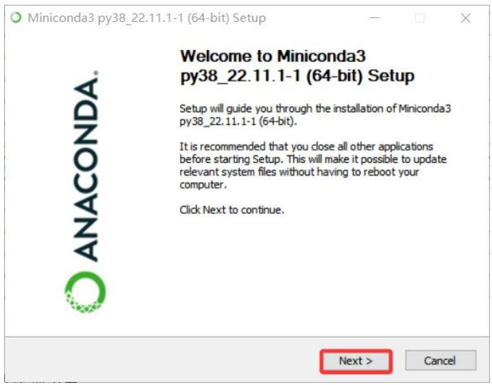

<details>
<summary>text_image</summary>

Miniconda3 py38_22.11.1-1 (64-bit) Setup
Welcome to Miniconda3
py38_22.11.1-1 (64-bit) Setup
Setup will guide you through the installation of Miniconda3
py38_22.11.1-1 (64-bit).
It is recommended that you close all other applications
before starting Setup. This will make it possible to update
relevant system files without having to reboot your
computer.
Click Next to continue.
Next >
Cancel
</details>

图 6.11 安装 Miniconda 步骤 1

阅读许可协议后，勾选“IAgree”确认接受协议条款，如图6.12所示：


<details>
<summary>text_image</summary>

Miniconda3 py38_22.11.1-1 (64-bit) Setup
License Agreement
Please review the license terms before installing Miniconda3
py38_22.11.1-1 (64-bit).
Press Page Down to see the rest of the agreement.
================ equals
End User License Agreement - Miniconda
================ equals
Copyright 2015-2022, Anaconda, Inc.
All rights reserved under the 3-clause BSD License:
This End User License Agreement (the "Agreement") is a legal agreement between you
and Anaconda, Inc. ("Anaconda") and governs your use of Miniconda.
If you accept the terms of the agreement, click I Agree to continue. You must accept the
agreement to install Miniconda3 py38_22.11.1-1 (64-bit).
Anaconda, Inc.
< Back	 I Agree	Cancel
</details>

图 6.12 安装 Miniconda 步骤 2

选择安装类型，推荐选择 “Just Me (recommended)”，仅为当前用户安装，如图6.13所示：

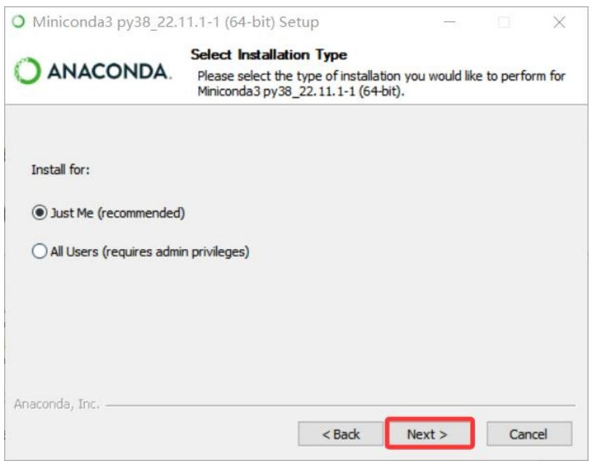

<details>
<summary>text_image</summary>

Miniconda3 py38_22.11.1-1 (64-bit) Setup
ANACONDA.
Select Installation Type
Please select the type of installation you would like to perform for
Miniconda3 py38_22.11.1-1 (64-bit).
Install for:
● Just Me (recommended)
○ All Users (requires admin privileges)
Anaconda, Inc.
< Back	Next >	Cancel
</details>

图 6.13 安装 Miniconda 步骤 3

选择安装路径，建议自定义路径（如 D:\miniconda\），确保路径无中文且剩余空间充足，如图6.14所示：

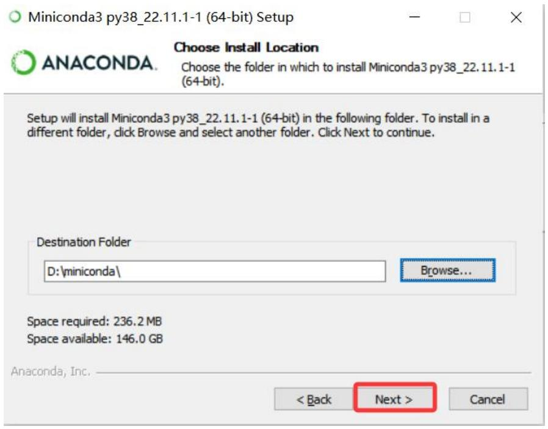

<details>
<summary>text_image</summary>

Miniconda3 py38_22.11.1-1 (64-bit) Setup
Choose Install Location
Choose the folder in which to install Miniconda3 py38_22.11.1-1 (64-bit).
Setup will install Miniconda3 py38_22.11.1-1 (64-bit) in the following folder. To install in a different folder, click Browse and select another folder. Click Next to continue.
Destination Folder
D:\miniconda\
Browse...
Space required: 236.2 MB
Space available: 146.0 GB
Anaconda, Inc.
< Back	Next >	Cancel
</details>

图 6.14 安装 Miniconda 步骤 4

高级安装选项保持默认设置，无需勾选“Add Miniconda3 to my PATHenvironment variable”，避免与系统环境冲突，如图 6.15 所示：

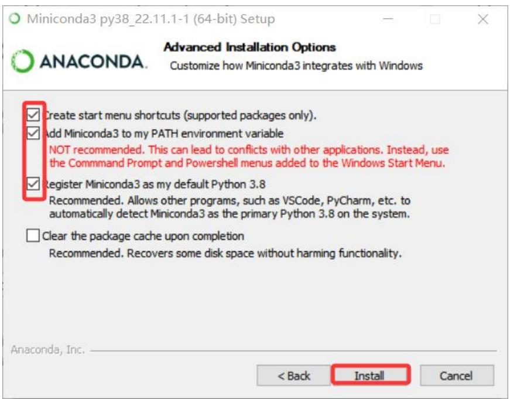

<details>
<summary>text_image</summary>

Miniconda3 py38_22.11.1-1 (64-bit) Setup
Advanced Installation Options
Customize how Miniconda3 integrates with Windows
Create start menu shortcuts (supported packages only).
Add Miniconda3 to my PATH environment variable
NOT recommended. This can lead to conflicts with other applications. Instead, use the Command Prompt and Powershell menus added to the Windows Start Menu.
Register Miniconda3 as my default Python 3.8
Recommended. Allows other programs, such as VSCode, PyCharm, etc. to automatically detect Miniconda3 as the primary Python 3.8 on the system.
Clear the package cache upon completion
Recommended. Recovers some disk space without harming functionality.
Anaconda, Inc.
< Back	Install	Cancel
</details>

图 6.15 安装 Miniconda 步骤 5

点击 “Install”开始安装，安装完成后点击 “Finish” 结束流程，如图6.16所示：

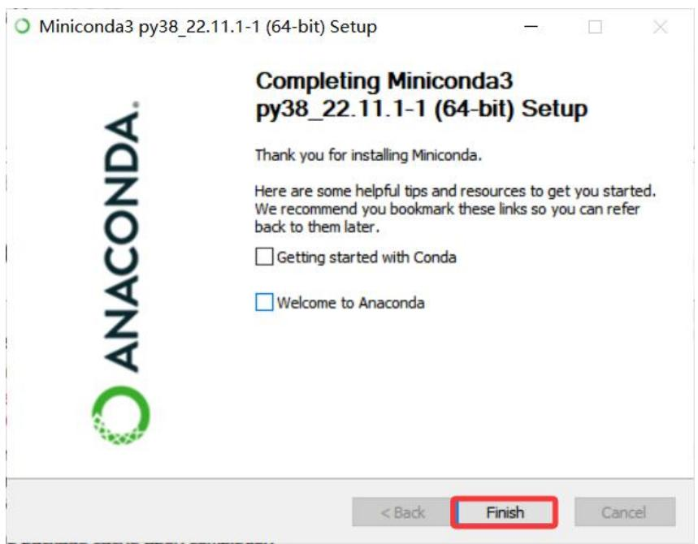

<details>
<summary>text_image</summary>

Miniconda3 py38_22.11.1-1 (64-bit) Setup
Completing Miniconda3
py38_22.11.1-1 (64-bit) Setup
Thank you for installing Miniconda.
Here are some helpful tips and resources to get you started.
We recommend you bookmark these links so you can refer
back to them later.
Getting started with Conda
Welcome to Anaconda
< Back	Finish	Cancel
</details>

图 6.16 安装 Miniconda 步骤 6

上述操作完成后，Miniconda安装完成。

Anaconda 安装完成后，需通过终端执行 conda --version 命令验证当前版本。

若显示的版本号较低（如conda 5.5.4），可能会与Python 3.8环境存在兼容性问题。此情况通常源于系统预装的旧版 Anaconda，建议通过完整卸载后重新安装最新版本。版本更新后再次执行 conda --version 应可显示较新版本号（如 conda22.11.1）。若现有 Anaconda 版本已支持 Python 3.8 环境配置，则无需重新安装。

## 步骤二：Miniconda 环境搭建

在搜索栏中输入 cmd，可以看到 Anaconda Prompt，点击打开，如图 6.17 所示：

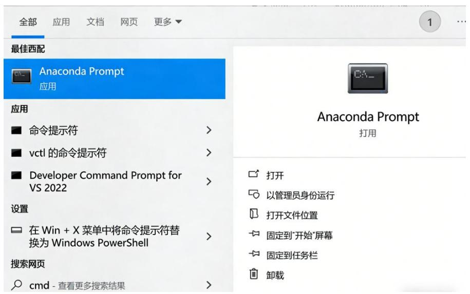

<details>
<summary>text_image</summary>

全部 应用 文档 网页 更多
最佳西配
Anaconda Prompt
应用
应用
■ 命令提示符 >
■ vctl 的命令提示符 >
■ Developer Command Prompt for VS 2022 >
设置
□ 在 Win + X 菜单中将命令提示符替换为 Windows PowerShell >
搜索网页
○ cmd - 查看更多搜索结果 >
Anaconda Prompt
打用
打开
以管理员身份运行
打开文件位置
固定到"开始"屏幕
固定到任务栏
卸载
</details>

图 6.17 打开 Anaconda Prompt

输入 conda create -n yolov5 python=3.8 -y，如图 6.18 所示：

```batch
Anaconda Prompt - conda create -n yolov5 python=3.8 -y
```

```batch
(base) C:\Users\11766>conda create -n yolov5 python=3.8 -y
Solving environment: -
```  
图 6.18 创建 yolov5 python=3.8

如图6.19所示。当出现下图的提示，则安装成功。

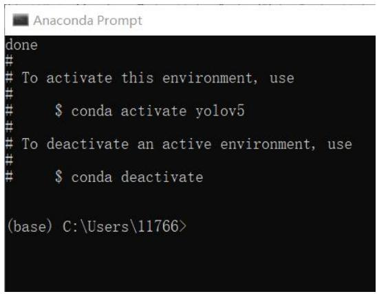

<details>
<summary>text_image</summary>

done
#
# To activate this environment, use
#
# $ conda activate yolov5
#
# To deactivate an active environment, use
#
# $ conda deactivate

(base) C:\Users\11766>
</details>

图 6.19 创建 yolov5 python=3.8 成功

输入 conda activate yolov5 来激活环境，如图 6.20 所示：

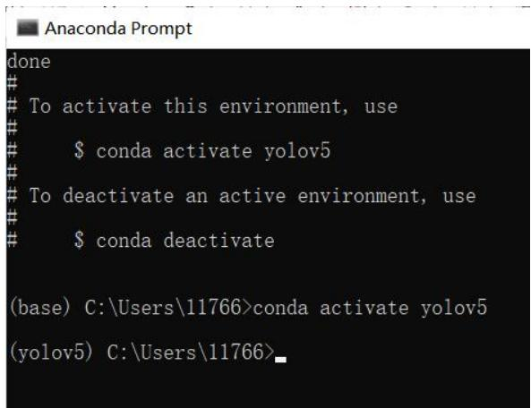

<details>
<summary>text_image</summary>

Done
#
# To activate this environment, use
#
# $ conda activate yolov5
#
# To deactivate an active environment, use
#
# $ conda deactivate
(base) C:\Users\11766>conda activate yolov5
(yolov5) C:\Users\11766>
</details>

图 6.20 激活 yolov5 环境

## 步骤三：配置PyPI镜像源

下面要配置PyPI镜像源，国内直接连接PyPI 官方源速度慢，易超时失败，YOLOv5 训练需安装大量依赖（如Torch、OpenCV 等），配置镜像源可节省90%以上安装时间。

进入清华镜像源（https://mirrors.tuna.tsinghua.edu.cn/help/pypi/），如图 6.21所示：

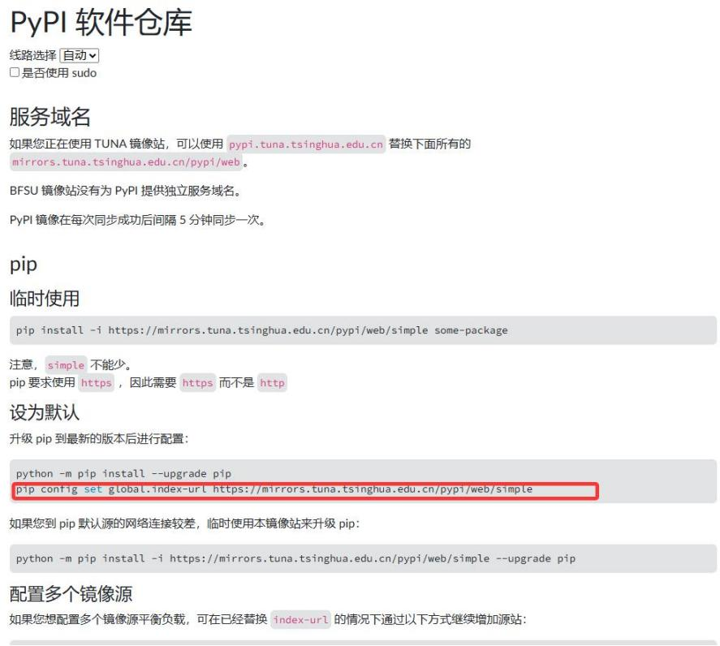

<details>
<summary>text_image</summary>

PyPI 软件仓库
线路选择 自动
□ 是否使用 sudo
服务域名
如果您正在使用 TUNA 镜像站，可以使用 pypi.tuna.tsinghua.edu.cn 替换下面所有的
mirrors.tuna.tsinghua.edu.cn/pypi/web。
BFSU 镜像站没有为 PyPI 提供独立服务域名。
PyPI 镜像在每次同步成功后间隔 5 分钟同步一次。
pip
临时使用
pip install -i https://mirrors.tuna.tsinghua.edu.cn/pypi/web/simple some-package
注意, simple 不能少。
pip 要求使用 https , 因此需要 https 而不是 http
设为默认
升级 pip 到最新的版本后进行配置：
python -m pip install --upgrade pip
pip config set global.index-url https://mirrors.tuna.tsinghua.edu.cn/pypi/web/simple
如果您到 pip 默认源的网络连接较差，临时使用本镜像站来升级 pip：
python -m pip install -i https://mirrors.tuna.tsinghua.edu.cn/pypi/web/simple --upgrade pip
配置多个镜像源
如果您想配置多个镜像源平衡负载，可在已经替换 index-url 的情况下通过以下方式继续增加源站：
</details>

图 6.21 清华源 PyPI 软件仓库

在终端中继续输入上图中的命令，将 PyPI（Python Package Index）的默认源替换为清华大学镜像源。

```txt
pip config set global.index-url https://mirrors.tuna.tsinghua.edu.cn/pypi/web/simple
```

出现 Writing to C:\Users\11766\AppData\Roaming\pip\pip.ini，则说明替换成功，如图6.22所示：

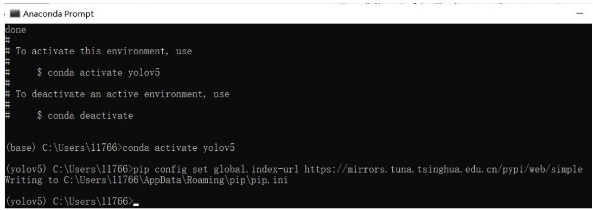

<details>
<summary>text_image</summary>

done
#
# To activate this environment, use
# # $ conda activate yolov5
# # To deactivate an active environment, use
# # $ conda deactivate

(base) C:\Users\11766>conda activate yolov5
(yolov5) C:\Users\11766>pip config set global.index-url https://mirrors.tuna.tsinghua.edu.cn/pypi/web/simple Writing to C:\Users\11766\AppData\Roaming\pip\pip.ini

(yolov5) C:\Users\11766>
</details>

图 6.22 配置清华园镜像

步骤四：PyTorch 安装

在安装 PyTorch 前，需通过 NVIDIA 控制面板确认系统 CUDA 版本以确保

兼容性，如图6.23所示。具体而言，可在桌面右键打开NVIDIA 控制面板。

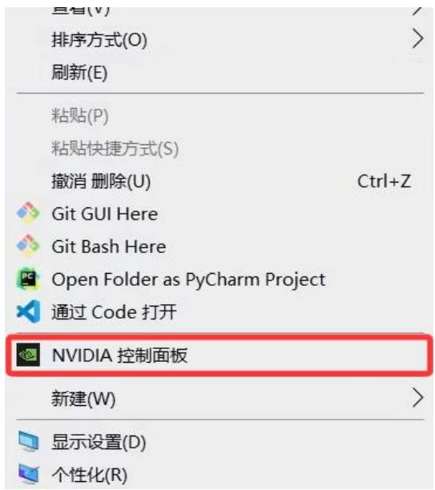

<details>
<summary>text_image</summary>

排序方式(O)
刷新(E)
粘贴(P)
粘贴快捷方式(S)
撤消 删除(U)	Ctrl+Z
Git GUI Here
Git Bash Here
Open Folder as PyCharm Project
通过 Code 打开
NVIDIA 控制面板
新建(W)
显示设置(D)
个性化(R)
</details>

图 6.23 打开 NVIDIA 控制面板

点击查看系统信息，如图6.24所示：

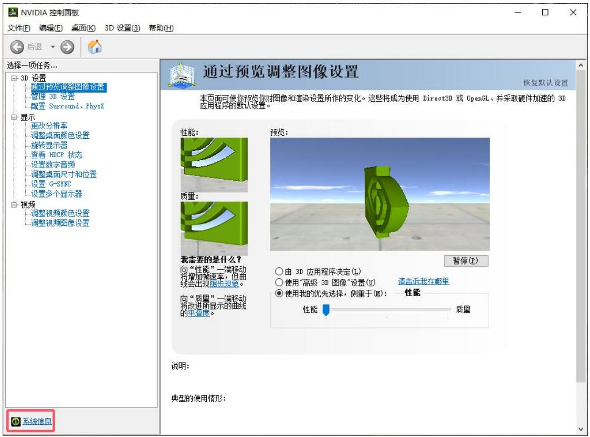

<details>
<summary>text_image</summary>

NVIDIA 控制面板
文件(E)  编辑(E)  桌面(K)  3D 设置(3)  帮助(H)
后退
选择一项任务...
3D 设置
通过预览调整图像设置
管理 3D 设置
配置 Surround、PhysX
显示
更改分辨率
调整桌面颜色设置
旋转显示器
查看 HDCP 状态
设置数字音频
调整桌面尺寸和位置
设置 G-SYNC
设置多个显示器
视频
调整视频颜色设置
调整视频图像设置
通过预览调整图像设置
恢复默认设置
本页面可使你预览你对图像和渲染设置所作的变化。这些将成为使用 Direct3D 或 OpenGL、并采取硬件加速的 3D 应用程序的默认设置。
性能:
预览:
质量:
我需要的是什么？
向“性能”一端移动
将增加帧速率，但曲线会出现错点现象。
向“质量”一端移动
将改进所显示的曲线的平滑度。
暂停(P)
○ 由 3D 应用程序决定(L)
○ 使用“高级 3D 图像”设置(U)    请告诉我在哪里
● 使用我的优先选择，侧重于(M):    性能
性能      质量
说明：
典型的使用情形：
系统信息
</details>

图 6.24 查看系统信息

通过查看系统信息中的组件选项卡获取当前 CUDA 版本号（如 12.6.65），该版本代表驱动程序支持的最高 CUDA 版本，如图 6.25 所示。基于此，安装PyTorch时应选择CUDA版本号不超过该数值的发行版，以保证框架的正常运行。

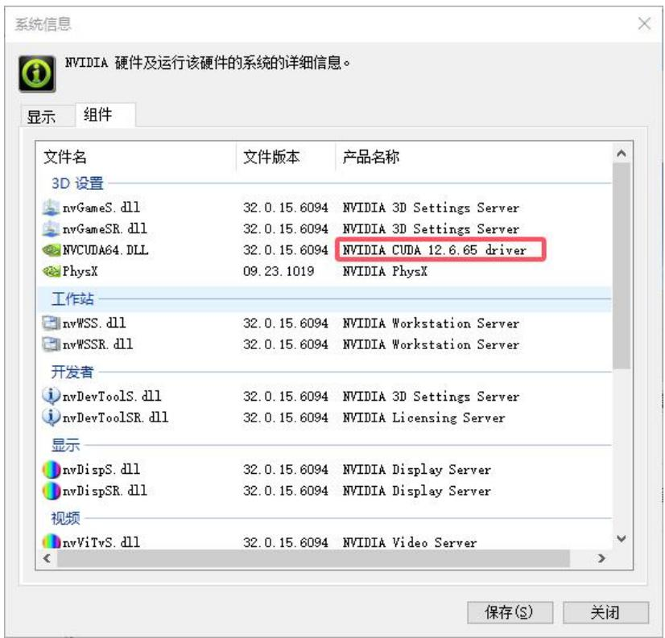

<details>
<summary>text_image</summary>

系统信息
NVIDIA 硬件及运行该硬件的系统的详细信息。
显示	组件
文件名	文件版本	产品名称
3D 设置
nvGameS.dll	32.0.15.6094	NVIDIA 3D Settings Server
nvGameSR.dll	32.0.15.6094	NVIDIA 3D Settings Server
NVCUDA64.DLL	32.0.15.6094	NVIDIA CUDA 12.6.65 driver
PhysX	09.23.1019	NVIDIA PhysX
工作站
nvWSS.dll	32.0.15.6094	NVIDIA Workstation Server
nwWSSR.dll	32.0.15.6094	NVIDIA Workstation Server
开发者
nvDevToolS.dll	32.0.15.6094	NVIDIA 3D Settings Server
nvDevToolSR.dll	32.0.15.6094	NVIDIA Licensing Server
显示
nvDispS.dll	32.0.15.6094	NVIDIA Display Server
nvDispSR.dll	32.0.15.6094	NVIDIA Display Server
视频
nvViTvS.dll	32.0.15.6094	NVIDIA Video Server
<	保存(S)	关闭
</details>

图 6.25 查看 CUDA 版本

如图6.26所示。进入PyTorch 官网，选择之前的版本。

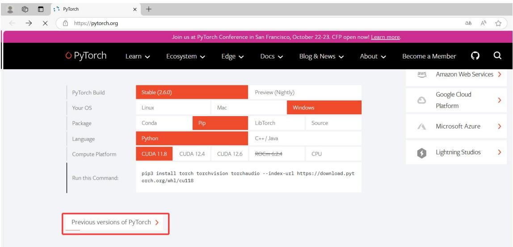

<details>
<summary>text_image</summary>

Join us at PyTorch Conference in San Francisco, October 22-23. CFP open now! Learn more.
PyTorch
Learn
Ecosystem
Edge
Docs
Blog & News
About
Become a Member
PyTorch Build
Stable (2.6.0)
Preview (Nightly)
Your OS
Linux
Mac
Windows
Package
Conda
Pip
LibTorch
Source
Language
Python
C++/Java
Compute Platform
CUDA 11.8
CUDA 12.4
CUDA 12.6
ROCm 6.2.4
CPU
Run this Command:
pip3 install torch torchvision torchaudio --index-url https://download.pytorch.org/whl/cu118
Previous versions of PyTorch >
</details>

图 6.26 进入 PyTorch 官网

查看官网依赖版本，如图6.27所示：

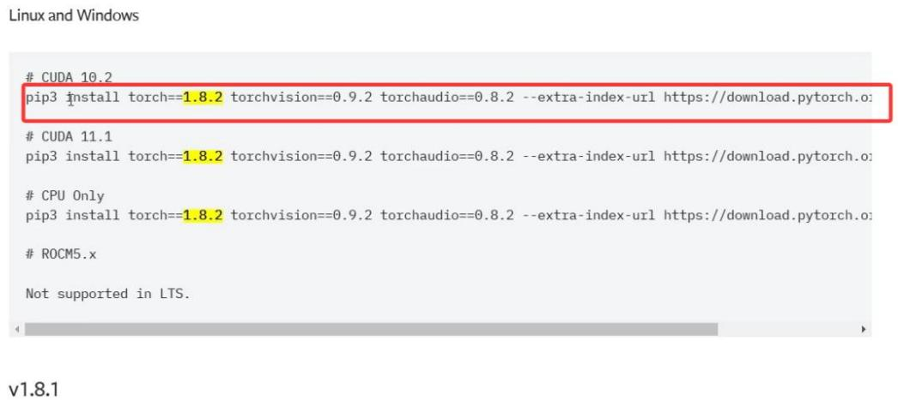

<details>
<summary>text_image</summary>

# CUDA 10.2
pip3 install torch==1.8.2 torchvision==0.9.2 torchaudio==0.8.2 --extra-index-url https://download.pytorch.0
# CUDA 11.1
pip3 install torch==1.8.2 torchvision==0.9.2 torchaudio==0.8.2 --extra-index-url https://download.pytorch.0
# CPU Only
pip3 install torch==1.8.2 torchvision==0.9.2 torchaudio==0.8.2 --extra-index-url https://download.pytorch.0
# ROCM5.x
Not supported in LTS.
</details>

图 6.27 查看官网依赖版本

（pip install torch==1.8.2 torchvision==0.9.2 torchaudio==0.8.2 --extra-index-urlhttps://download.pytorch.org/whl/lts/1.8/cu102 ）

安装 PyTorch，如图 6.28 所示：

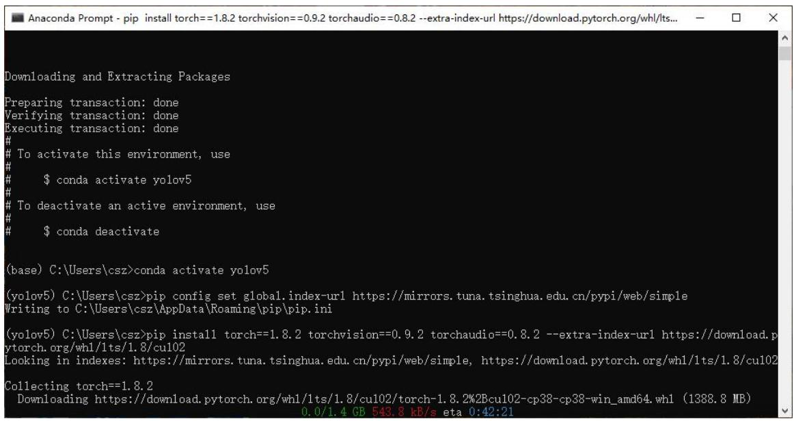

<details>
<summary>text_image</summary>

Downloading and Extracting Packages
Preparing transaction: done
Verifying transaction: done
Executing transaction: done
#
# To activate this environment, use
#
#    $ conda activate yolov5
#
# To deactivate an active environment, use
#
#    $ conda deactivate

(base) C:\Users\csz>conda activate yolov5
(yolov5) C:\Users\csz>pip config set global,index-url https://mirrors.tuna.tsinghua.edu.cn/pypi/web/simple
Writing to C:\Users\csz\AppData\Roaming\pip\pip.ini

(yolov5) C:\Users\csz>pip install torch==1.8.2 torchvision==0.9.2 torchaudio==0.8.2 --extra-index-url https://download.pytorch.org/whl/1ts/1.8/cu102
Looking in indexes: https://mirrors.tuna.tsinghua.edu.cn/pypi/web/simple, https://download.pytorch.org/whl/1ts/1.8/cu102
Collecting torch==1.8.2
    Downloading https://download.pytorch.org/whl/1ts/1.8/cu102/torch-1.8.2%Bcu102-cp38-cp38-win_amd64.whl (1388.8 MB)
                    0.0/1.4 GB 543.8 kB/s eta 0:42:21
</details>

图 6.28 安装 PyTorch

这个过程可以需要一段时间，直至终端显示 “Successfully installed” 即表示安装完成。

步骤五：安装 YOLOv5 依赖

将实验包中的 yolov5 文件夹复制到桌面，如图 6.29 所示：

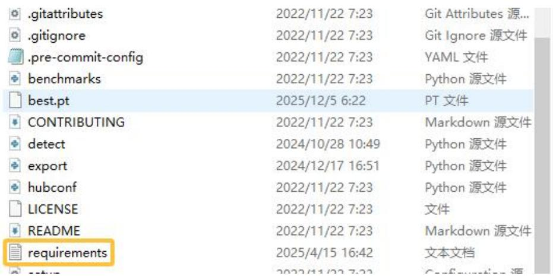

<details>
<summary>text_image</summary>

.gitattributes 2022/11/22 7:23 Git Attributes 源...
.gitignore 2022/11/22 7:23 Git Ignore 源文件
.pre-commit-config 2022/11/22 7:23 YAML 文件
benchmarks 2022/11/22 7:23 Python 源文件
best.pt 2025/12/5 6:22 PT 文件
CONTRIBUTING 2022/11/22 7:23 Markdown 源文件
detect 2024/10/28 10:49 Python 源文件
export 2024/12/17 16:51 Python 源文件
hubconf 2022/11/22 7:23 Python 源文件
LICENSE 2022/11/22 7:23 文件
README 2022/11/22 7:23 Markdown 源文件
requirements 2025/4/15 16:42 文本文档
</details>

图 6.29 找到 requirements

在终端中，进入桌面，进入 yolov5-7.0.

在终端输入 pip install -r requirements.txt，安装文本文件中的依赖，如图 6.30所示：

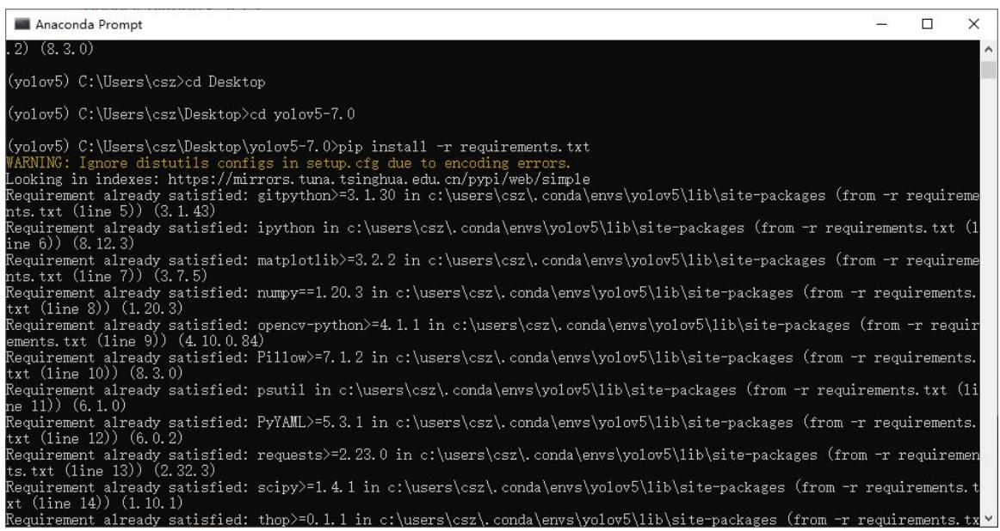

<details>
<summary>text_image</summary>

.2) (8.3.0)
(yolov5) C:\Users\csz>cd Desktop
(yolov5) C:\Users\csz\Desktop>cd yolov5-7.0
(yolov5) C:\Users\csz\Desktop\yolov5-7.0>pip install -r requirements.txt
WARNING: Ignore distutils config in setup.cfg due to encoding errors.
Looking in indexes: https://mirrors.tuna.tsinghua.edu.cn/pypi/web/simple
Requirement already satisfied: gitpython>=3.1.30 in c:\users\csz\.conda\envs\yolov5\lib\site-packages (from -r requirements.txt (line 5)) (3.1.43)
Requirement already satisfied: ipython in c:\users\csz\.conda\envs\yolov5\lib\site-packages (from -r requirements.txt (line 6)) (8.12.3)
Requirement already satisfied: matplotlib>=3.2.2 in c:\users\csz\.conda\envs\yolov5\lib\site-packages (from -r requirements.txt (line 7)) (3.7.5)
Requirement already satisfied: numpy==1.20.3 in c:\users\csz\.conda\envs\yolov5\lib\site-packages (from -r requirements.txt (line 8)) (1.20.3)
Requirement already satisfied: opencv-python>=4.1.1 in c:\users\csz\.conda\envs\yolov5\lib\site-packages (from -r requirements.txt (line 9)) (4.10.0.84)
Requirement already satisfied: Pillow>=7.1.2 in c:\users\csz\.conda\envs\yolov5\lib\site-packages (from -r requirements.txt (line 10)) (8.3.0)
Requirement already satisfied: psutil in c:\users\csz\.conda\envs\yolov5\lib\site-packages (from -r requirements.txt (line 11)) (6.1.0)
Requirement already satisfied: PyYAML>=5.3.1 in c:\users\csz\.conda\envs\yolov5\lib\site-packages (from -r requirements.txt (line 12)) (6.0.2)
Requirement already satisfied: requests>=2.23.0 in c:\users\csz\.conda\envs\yolov5\lib\site-packages (from -r requirements.txt (line 13)) (2.32.3)
Requirement already satisfied: scipy>=1.4.1 in c:\users\csz\.conda\envs\yolov5\lib\site-packages (from -r requirements.txt (line 14)) (1.10.1)
Requirement already satisfied: thop>=0.1.1 in c:\users\csz\.conda\envs\yolov5\lib\site-packages (from -r requirements.txt
</details>

图 6.30 安装相关依赖

因为案例中的电脑之前已经安装完成，所有并没有安装进度。

在同学们的实践中，如果出现下图的提示，则表示安装完成，如图 6.31 所示：

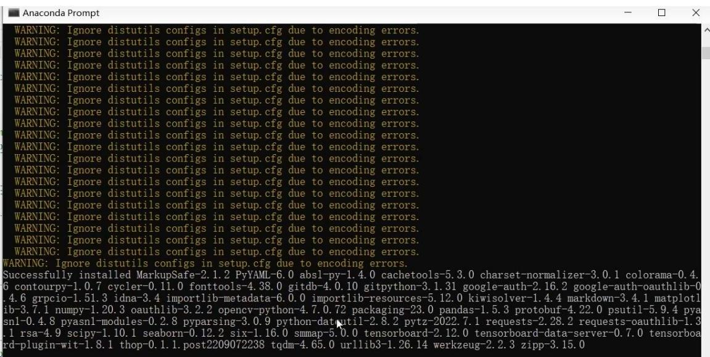

<details>
<summary>text_image</summary>

WARNING: Ignore distutils configs in setup.cfg due to encoding errors.
WARNING: Ignore distutils configs in setup.cfg due to encoding errors.
WARNING: Ignore distutils configs in setup.cfg due to encoding errors.
WARNING: Ignore distutils configs in setup.cfg due to encoding errors.
WARNING: Ignore distutils configs in setup.cfg due to encoding errors.
WARNING: Ignore distutils configs in setup.cfg due to encoding errors.
WARNING: Ignore distutils configs in setup.cfg due to encoding errors.
WARNING: Ignore distutils configs in setup.cfg due to encoding errors.
WARNING, Ignore distutils configs in setup.cfg due to encoding errors.
WARNING: Ignore distutils configs in setup.cfg due to encoding errors.
WARNING: Ignore distutils configs in setup.cfg due to encoding errors.
WARNING: Ignore distutils configs in setup.cfg due to encoding errors.
WARNING: Ignore distutils configs in setup.cfg due to encoding errors.
WARNING: Ignore distutils configs in setup.cfg due to encoding errors.
WARNING: Ignore distutils configs in setup.cfg due to encoding errors.
WARNING: Ignore dispultil config in setup.cfg due to encoding errors.
WARNING: Ignore distutils config in setup.cfg due to encoding errors.
WARNING: Ignore distutils config in setup.cfg due to encoding errors.
WARNING: Ignore distutils config in setup.cfg due to encoding errors.
WARNING: Ignore distutils config in setup.cfg due to encoding errors.
WARNING: Ignore distutils config in setup.cfg due to encoding errors.
WARNING: Ignore distutils config in setup.cfg due to encoding errors.
WARNING: Ignore distutils config in setup.cfg due to encoding errors.
WARNING: Ignore distutils config, 1.0.1 numpy-1.20.3 oauthlib-3.2.2 openv-python-4.7.0.72 packaging-23.0 pandas-1.5.3 protobuf-4.22.0 psutil-5.9.4 pyasnl-0.4.8 pyasnl-modules-0.2.8 pyparsing-3.0.9 python-datutil-2.8.2 pytz-2022.7.1 requests-2.28.2 requests-oauthlib-1.3.1 rsa-4.9 scipy-1.10.1 seaborn-0.12.2 six-1.16.0 smmap-5.0.0 tensorboard-2.12.0 tensorboard-data-server-0.7.0 tensorboard-plugin-wit-1.8.1 thop-0.1.1.post2209072238 tqdm-4.65.0 urllib3-1.26.14 werkzeug-2.2.3 zipp-3.15.0
WARNING: Ignore distutils config in setup.cfg due to encoding errors.
Successfully installed MarkupSafe-2.1.2 PyYAML-6.0 absl-py-1.4.0 cachetools-5.3.0 charset-normalizer-3.0.1 colorama-0.4.6 contourpy-1.0.7 cycler-0.11.0 fonttools-4.38.0 gitdb-4.0.10 gitpython-3.1.31 google-auth-2.16.2 google-auth-oauthlib-0.4.6 grpcio-1.51.3 idna-3.4 importlib-metadata-6.0.0 importlib-resources-5.12.0 kiwisolver-1.4.4 markdown-3.4.1 matplotlib-3.7.1 numpy-1.20.3 oauthlib-3.2.2 openv-python-4.7.0.72 packaging-23.0 pandas-1.5.3 protobuf-4.22.0 psutil-5.9.4 pyasnl-0.4.8 pyasnl-modules-0.2.8 pyparsing-3.0.9 python-datutil-2.8.2 pytz-2O22.7.1 requests-2.28.2 requests-oauthlib-1.3.1 rsa-4.9 scipy-1.10.1 seaborn-0.12.2 six-1.16.0 smmap-5.0.0 tensorboard-2.12.0 tensorboard-data-server-0.7.0 tensorboard-plugin-wit-1.8.1 thop-0.1.1 .post2209072238 tqdm-4.65.0 urllib3-1.26.14 werkzeug-2.2.3 zipp-3.15.
</details>

图 6.31 相关依赖安装完成

测试 detect.py，如图 6.32 所示：

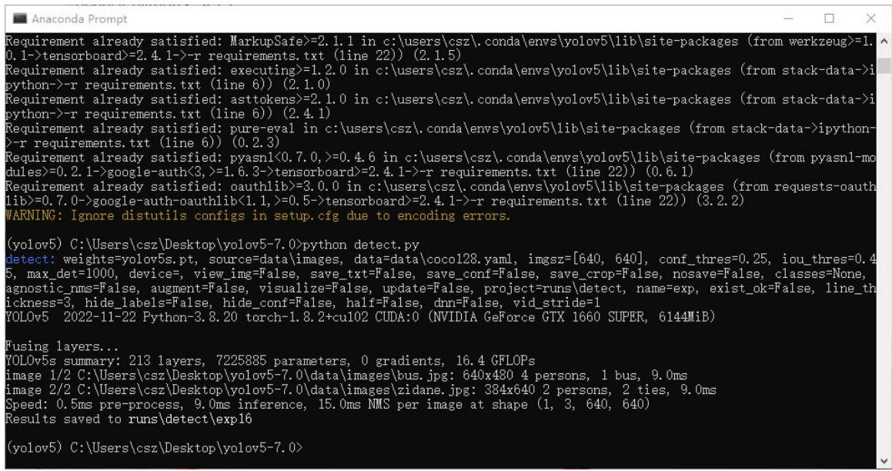

<details>
<summary>text_image</summary>

Requirement already satisfied: MarkupSafe>=2.1.1 in c:\users\csz\.conda\envs\yolov5\lib\site-packages (from werkzeug>=1.0.1->tensorboard>=2.4.1->r requirements.txt (line 22)) (2.1.5)
Requirement already satisfied: executing>=1.2.0 in c:\users\csz\.conda\envs\yolov5\lib\site-packages (from stack-data->i python->r requirements.txt (line 6)) (2.1.0)
Requirement already satisfied: asttokens>=2.1.0 in c:\users\csz\.conda\envs\yolov5\lib\site-packages (from stack-data->i python->r requirements.txt (line 6)) (2.4.1)
Requirement already satisfied: pure-eval in c:\users\csz\.conda\envs\yolov5\lib\site-packages (from stack-data->ipython->r requirements.txt (line 6)) (0.2.3)
Requirement already satisfied: pyasnl<0.7.0,>=0.4.6 in c:\users\csz\.conda\envs\yolov5\lib\site-packages (from pyasnl-modules>=0.2.1->google-auth<3,>=1.6.3->tensorboard>=2.4.1->r requirements.txt (line 22)) (0.6.1)
Requirement already satisfied: oauthlib>=3.0.0 in c:\users\csz\.conda\envs\yolov5\lib\site-packages (from requests-oauth lib>=0.7.0->google-auth-oauthlib<1.1,>=0.5->tensorboard>=2.4.1->r requirements.txt (line 22)) (3.2.2)
WARNING: Ignore distutils config in setup.cfg due to encoding errors.
(yolov5) C:\Users\csz\Desktop\yolov5-7.0>python detect.py
detect: weights=yolov5s.pt, source=data/images, data=data:cocol28.yaml, imgsz=[640, 640], conf_thres=0.25, iou_thres=0.45, max_det=1000, device=, view_img=False, save_txt=False, save_conf=False, save_crop=False, nosave=False, classes=None, agnostic_nms=False, augment=False, visualize=False, update=False, project=runs/detect, name=exp, exist_ok=False, line_thickness=3, hide_labels=False, hide_conf=False, half=False, dnm=False, vid_stride=1
YOLOv5 2022-11-22 Python-3.8.20 torch-1.8.2+cu102 CUDA:0 (NVIDIA GeForce GTX 1660 SUPER, 6144MiB)

Fusing layers...
YOLOv5s summary: 213 layers, 7225885 parameters, 0 gradients, 16.4 GFLOPs
image 1/2 C:\Users\csz\Desktop\yolov5-7.0\data\images/bus.jpg: 640x480 4 persons, 1 bus, 9.0ms
image 2/2 C:\Users\csz\Desktop\yolov5-7.0\data\images/zidane.jpg: 384x640 2 persons, 2 ties, 9.0ms
Speed: 0.5ms pre-process, 9.0ms inference, 15.0ms NMS per image at shape (1, 3, 640, 640)
Results saved to runs\detect/exp16
(yolov5) C:\Users\csz\Desktop\yolov5-7.0>
</details>

图 6.32 测试 detect.py

关于安装中的其他问题

1.pip 和 conda 到使用哪个

在一个单独的环境中，能使用 pip 就尽量使用 pip，实在有问题的情况，再使用conda 进行安装，不要来回混淆。

2.CUDA 是否必须安装

如果只需要训练、简单推理，则无需单独安装CUDA，直接在官网搜索对应的版本，通过pip安装即可。

如果需要编译、部署等，那么还是需要单独安装 CUDA 的，这部分大家可以自行百度。

## 3.显卡16XX的安装问题

如果想一切顺利运行，尽量安装cu10.x 的pytorch 版本，否则会出现预测失效、训练过程中Loss 为nan、各项指标均为0的情况.

4.如果必须安装cu11.x的版本，则需要修改代码中半精度的部分，才能避免上述问题。

## 5.显卡30XX的安装问题

30 系列的显卡不再支持 cuda10，因此务必安装 cu11.x 的 pytorch 版本。

步骤六：配置 Visual Studio Code 开发环境

安装 Visual Studio Code，安装和配置教程可网上自行查找，安装 Python 扩展。下载地址：（https://code.visualstudio.com/）

安装完成后，将我们给出的 yolov5 文件用 Visual Studio Code 打开，

点击 VS Code 右下角的 “选择解释器”，或通过 “查看”→“命令面板”→输入 “Python: 选择解释器”，选择 “yolov5” 虚拟环境对应的 Python 解释器（路径通常为 “C:\Users\ 用户名.conda\envs\yolov5\python.exe”），如图 6.33所示：

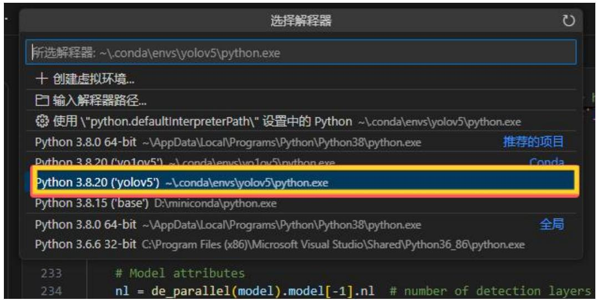

<details>
<summary>text_image</summary>

选择解释器
所选解释器: ~\.conda\envs\yolov5\python.exe
+ 创建虚拟环境...
□ 输入解释器路径...
使用\"python.defaultInterpreterPath\" 设置中的 Python ~\.conda\envs\yolov5\python.exe
Python 3.8.0 64-bit ~\.AppData\.Local\.Programs\.Python\.Python38\.python.exe
推荐的项目
Python 3.8.20 ('yolov5') ~\.conda\envs\yolov5\.python.exe
Conda
Python 3.8.20 ('yolov5') ~\.conda\envs\yolov5\.python.exe
Python 3.8.15 ('base') D:\miniconda\python.exe
全局
Python 3.8.0 64-bit ~\.AppData\.Local\.Programs\.Python\.Python38\.python.exe
Python 3.6.6 32-bit C:\Program Files (x86)\Microsoft Visual Studio\Shared\.Python36_86\.python.exe
233 # Model attributes
234 nl = de_parallel(model).model[-1].nl # number of detection layers
</details>

图 6.33 VS code 选择 Python 环境

步骤七：配置数据集YAML文件

如图6.34 所示。修改数据集配置文件，编辑YAML文件，在已经给出的data文件中找到 coco128.yaml，复制一份重新命名，案例中命名为 ccsszz.yaml。

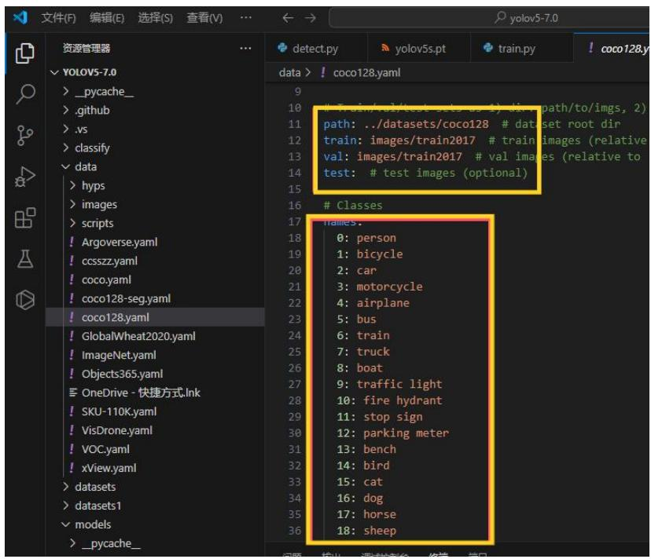

<details>
<summary>text_image</summary>

文件(F) 编辑(E) 选择(S) 查看(V) 
YOLOV5-7.0
yoloV5-7.0
> _pycache_
> .github
> .vs
> classify
data
> hyps
> images
> scripts
! Argoverse.yaml
! ccsszz.yaml
! coco.yaml
! coco128-seg.yaml
! coco128.yaml
! GlobalWheat2020.yaml
! ImageNet.yaml
! Objects365.yaml
OneDrive - 快捷方式.Ink
! SKU-110K.yaml
! VisDrone.yaml
! VOC.yaml
xView.yaml
> datasets
> datasets1
models
> _pycache_
detect.py yolov5s.pt train.py ! coco128.yml
9
path: ../datasets/coco128 # dataset root dir
train: images/train2017 # train images (relative
val: images/train2017 # val images (relative to
test: # test images (optional)
# Classes
frames.
0: person
1: bicycle
2: car
3: motorcycle
4: airplane
5: bus
6: train
7: truck
8: boat
9: traffic light
10: fire hydrant
11: stop sign
12: parking meter
13: bench
14: bird
15: cat
16: dog
17: horse
18: sheep
</details>

图 6.34 配置 YAML 文件

按照我们自己的训练集和验证集路径以及类别数和类别名称来更改，如图6.35 所示：

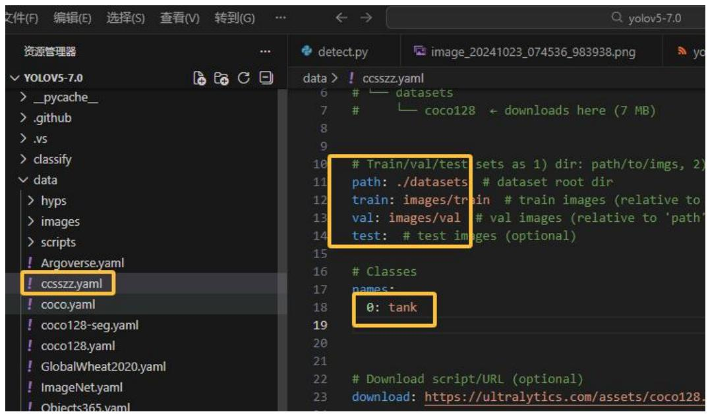

<details>
<summary>text_image</summary>

资源管理器
YOLOV5-7.0
>_pycache_
> .github
> .vs
> classify
> data
> hyps
> images
> scripts
! Argoverse.yaml
! ccsszz.yaml
! coco.yaml
! coco128-seg.yaml
! coco128.yaml
! GlobalWheat2020.yaml
! ImageNet.yaml
! Objects365.yaml
detect.py
image_20241023_074536_983938.png
data > ! ccsszz.yaml
# datasets
# coco128 < downloads here (7 MB)
#
path: ./datasets # dataset root dir
train: images/train # train images (relative to
val: images/val # val images (relative to 'path'
test: # test images (optional)
#
Classes
names:
0: tank
# Download script/URL (optional)
download: https://ultralytics.com/assets/coco128.
</details>

图 6.35 YAML 配置后

步骤八：熟悉训练参数与启动训练

打开 train.py 文件，查看 parse\_opt 函数中的关键训练参数，如图 6.36 所示：

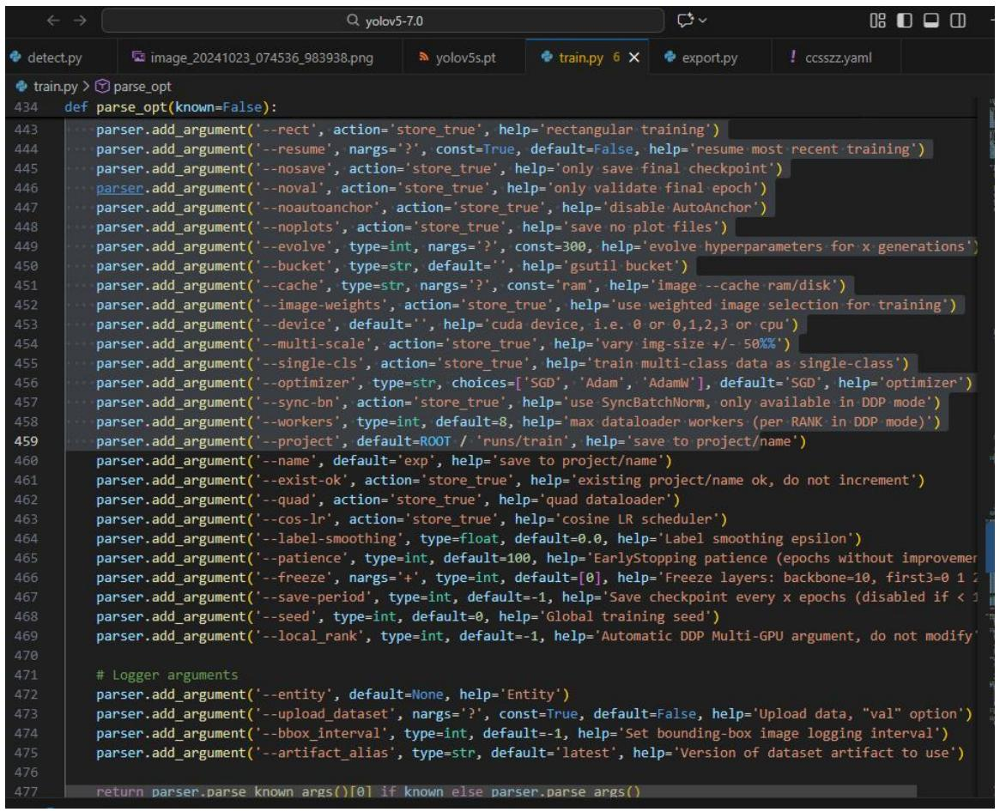

<details>
<summary>text_image</summary>

def parse_opt(known=False):
    parser.add_argument)'--rect', action='store_true', help='rectangular training')
    parser.add_argument)'--resume', nargs='?', const=True, default=False, help='resume most recent training')
    parser.add_argument)'--nosave', action='store_true', help='only save final checkpoint')
    parser.add_argument)'--noval', action='store_true', help='only validate final epoch')
    parser.add_argument)'--noautoanchor', action='store_true', help='disable AutoAnchor')
    parser.add_argument)'--noplots', action='store_true', help='save no plot files')
    parser.add_argument)'--evolve', type=int, nargs='?', const=300, help='evolve hyperparameters for x generations'
    parser.add_argument)'--bucket', type=str, default=' ', help='gsutil bucket')
    parser.add_argument)'--cache', type=str, nargs='?', const='ram', help='image --cache ram/disk')
    parser.add_argument)'--image-weights', action='store_true', help='use weighted image selection for training')
    parser.add_argument)'--device', default=' ', help='cuda device, i.e. 0 or 0,1,2,3 or cpu')
    parser.add_argument)'--multi-scale', action='store_true', help='vary img-size +/- 50%')
    parser.add_argument)'--single-cls', action='store_true', help='train multi-class data as single-class')
    parser.add_argument)'--optimizer', type=str, choices=['SGD', 'Adam', 'AdamW'], default='SGD', help='optimizer')
    parser.add_argument)'--sync-bn', action='store_true', help='use SyncBatchNorm, only available in DDP mode')
    parser.add_argument)'--workers', type=int, default=8, help='max dataloader workers (per RANK in DDP mode)')
    parser.add_argument)'--project', default=ROOT / 'runs/train', help='save to project/name')
    parser.add_argument)'--name', default='exp', help='save to project/name')
    parser.add_argument)'--exist-ok', action='store_true', help='existing project/name ok, do not increment')
    parser.add_argument)'--quad', action='store_true', help='quad dataloader')
    parser.add_argument)'--cos-lr', action='store_true', help='cosine LR scheduler')
    parser.add_argument)'--label-smoothing', type=float, default=0.0, help='Label smoothing epsilon')
    parser.add_argument)'--patience', type=int, default=100, help='EarlyStopping patience (epochs without improvement)
    parser.add_argument)'--freeze, nargs='+ ', type=int, default=[0], help='Freeze layers: backbone=10, first3=0 1 2
    parser.add_argument)'--save-period', type=int, default=-1, help='Save checkpoint every x epochs (disabled if < 1
    parser.add_argument)'--seed', type=int, default=0, help='Global training seed')
    parser.add_argument)'--local_rank', type=int, default=-1, help='Automatic DDP Multi-GPU argument, do not modify'
# Logger arguments
parser.add_argument)'--entity', default=None, help='Entity')
parser.add_argument)'--upload_dataset', nargs='?', const=True, default=False, help='Upload data, "val" option')
parser.add_argument)'--bbox_interval', type=int, default=-1, help='Set bounding-box image logging interval')
parser.add_argument)'--artifact_alias', type=str, default='latest', help='Version of dataset artifact to use')
return parser.parse known args()[0] if known else parser.parse args()
</details>

图 6.36 训练脚本中关键参数

训练脚本中关键参数如表6.1所示：

表6.1 训练脚本中关键参数

<table><tr><td>参数</td><td>示例值</td><td>说明</td></tr><tr><td>--data</td><td>data/ccsszz.yaml</td><td>数据集配置文件路径,需指定训练/验证集路径、类别数和名称。</td></tr><tr><td>--weights</td><td>yolov5s.pt</td><td>预训练模型权重,若为空(")则从零开始训练。推荐使用预训练权重加速收敛。</td></tr><tr><td>--epochs</td><td>300</td><td>训练轮次,坦克检测通常需要200-300轮(数据集较小时可减少)。</td></tr><tr><td>--batch-size</td><td>32</td><td>批大小,根据GPU显存调整(显存不足时降低此值)。</td></tr><tr><td>--imgsz</td><td>640</td><td>输入图像尺寸,必须是32的倍数。较大尺寸(如640)可提升检测精度但增加计算量。优化器选择:- SGD(默认):适合大数据集,需调参</td></tr><tr><td>--optimizer</td><td>Adam</td><td>- Adam:收敛快,适合小数据集- AdamW:改进版Adam,防过拟合</td></tr><tr><td>--cos-lr</td><td>True</td><td>余弦学习率调度,使学习率从初始值平滑下降至最终值(--lrf),推荐启用。</td></tr><tr><td>--cos-lr</td><td>True</td><td>余弦学习率调度,使学习率从初始值平滑下降至最终值(--lrf),推荐启用。</td></tr><tr><td>--label-smoothing</td><td>0.1</td><td>标签平滑,减轻过拟合(范围0-0.2)。坦克检测建议0.05-0.1。</td></tr><tr><td>--multi-scale</td><td>True</td><td>多尺度训练,随机调整输入图像尺寸(±50%),提升模型泛化能力。</td></tr><tr><td>--mosaic</td><td>1.0</td><td>马赛克增强(默认启用),将4张图像拼接训练,提升小目标检测能力。</td></tr><tr><td>-hsv-h</td><td>0.015</td><td>色调增强强度(范围0-0.1),模拟不同光照条件。</td></tr><tr><td>--cfg</td><td>yolov5s.yaml</td><td>模型配置文件,定义网络结构。可选 yolov5s/m/l/x(小/中/大/超大模型)。冻结层,冻结前 N 层(如</td></tr><tr><td>--freeze</td><td>[0]</td><td>--freeze 10 冻结骨干网络),减少训练参数。</td></tr><tr><td>--resume</td><td>True</td><td rowspan="2">恢复训练,从上次中断的检查点(last.pt)继续训练。早停机制,若验证集精度在 N 轮内未提升则终止训练(防过拟合)。</td></tr><tr><td>--patience</td><td>100</td></tr><tr><td>--device</td><td>0</td><td rowspan="2">训练设备,0 表示 GPU 0号卡,cpu 表示 CPU 训练。实验保存目录,所有输出(权重、日志、图表)将存储在此路径下。</td></tr><tr><td>--project</td><td>runs/train</td></tr><tr><td>--name</td><td>exp</td><td>实验名称,自动生成子目录(如 exp2, exp3)</td></tr></table>

终端模型训练命令如图6.37所示：

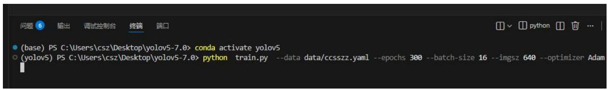

<details>
<summary>text_image</summary>

(base) PS C:\Users\csz\Desktop\yolov5-7.0> conda activate yolov5
(yolov5) PS C:\Users\csz\Desktop\yolov5-7.0> python train.py --data data/ccsszz.yaml --epochs 300 --batch-size 16 --imgsz 640 --optimizer Adam
</details>

图 6.37 终端模型训练命令

步骤九：模型训练

坦克检测推荐配置：python train.py --data data/ccsszz.yaml --weights yolov5s.pt --epochs 300 --batch-size 32 --imgsz 64 --optimizer Adam --cos-lr --label-smoothing 0.1

案例中配置：python train.py --data data/ccsszz.yaml --epochs 300 --batch-size 32 --imgsz 640 --optimizer Adam

步骤十：注意事项

1.如果显存不足可以适当降低--batch-size（如 16）或--imgsz（如 416）。

2.如果出现过拟合可以增加--label-smoothing（0.1→0.2）或减少--epochs。  
3.所有未在命令行中显式指定的参数都会使用 parse\_opt()函数中定义的默认值，通过终端直接指定的参数（如--epochs 300）优先级最高，会覆盖其他所有来源的参数值，在 train.py 的 parse\_opt()函数中定义的默认值是第二优先级。

在图中我们可以看到实时训练指标，当出现 Starting training for 300 epochs...表明训练流程已正常启动，如图6.38所示：

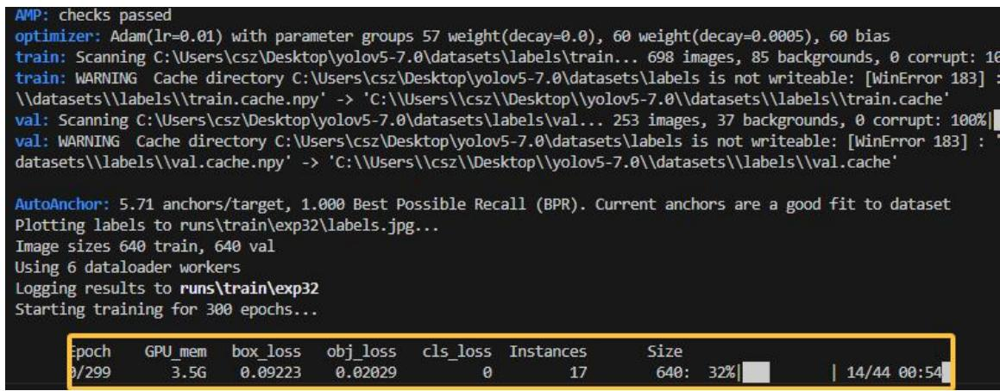

<details>
<summary>text_image</summary>

AMP: checks passed
optimizer: Adam(lr=0.01) with parameter groups 57 weight(decay=0.0), 60 weight(decay=0.0005), 60 bias
train: Scanning C:\Users\csz\Desktop\yolov5-7.0\datasets\labels\train... 698 images, 85 backgrounds, 0 corrupt: 16
train: WARNING Cache directory C:\Users\csz\Desktop\yolov5-7.0\datasets\labels is not writeable: [WinError 183] :
\\datasets\labels\train.cache.npy' -> 'C:\Users\csz\Desktop\yolov5-7.0\datasets\labels\train.cache'
val: Scanning C:\Users\csz\Desktop\yolov5-7.0\datasets\labels\val... 253 images, 37 backgrounds, 0 corrupt: 100%
val: WARNING Cache directory C:\Users\csz\Desktop\yolov5-7.0\datasets\labels is not writeable: [WinError 183] :
datasets\labels\val.cache.npy' -> 'C:\Users\csz\Desktop\yolov5-7.0\datasets\labels\val.cache'

AutoAnchor: 5.71 anchors/target, 1.000 Best Possible Recall (BPR). Current anchors are a good fit to dataset
Plotting labels to runs\train\exp32\labels.jpg...

Image sizes 640 train, 640 val

Using 6 dataloader workers
Logging results to runs\train\exp32
Starting training for 300 epochs...

epoch	GPU_mem	box_loss Power_loss cls_loss Instances Size
/299	3.5G	0.09223	0.02029	0	17	640: 32%	14/44 00:54
</details>

图 6.38 模型训练轮数进行

等待若干小时后，模型就训练完成了，如图6.39所示：

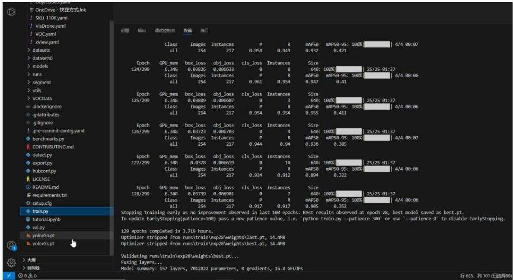

<details>
<summary>text_image</summary>

OneDrive - 快捷方式.lnk
! SKU-110K.yaml
! VisDrone.yaml
! VOC.yaml
! xView.yaml
> datasets
> datasets0
> models
> runs
> segment
> utils
> VOCDATA
.dockerignore
.gitattributes
.gitignore
,.pre-commit-config.yaml
benchmarks.py
CONTRIBUTING.md
detect.py
export.py
hubconf.py
LICENSE
README.md
requirements.txt
setup.cfg
train.py
tutorial.ipynb
.val.py
yolov5n.pt
yolov5s.pt
> 大侧
> 时间线
问题 输出 调试控制台 终调 端口
Class Images Instances P R mAP50 mAP50-95: 100% 4/4 00:07
all 254 217 0.954 0.949 0.932 0.421
Epoch GPU_mem box_loss obj_loss cls_loss Instances Size
124/299 6.34G 0.03826 0.006633 0 8 648: 100% 25/25 01:37
Class Images Instances P R mAP50 mAP50-95: 100% 4/4 00:06
all 254 217 0.961 0.954 0.947 0.41
Epoch GPU_mem box_loss obj_loss cls_loss Instances Size
125/299 6.34G 0.03809 0.006607 0 3 648: 100% 25/25 01:37
Class Images Instances P R mAP50 mAP50-95: 100% 4/4 00:06
all 254 217 0.954 0.954 0.955 0.411
Epoch GPU_mem box_loss obj_loss cls_loss Instances Size
126/299 6.34G 0.03723 0.006703 0 4 648: 100% 25/25 01:37
Class Images Instances P R mAP50 mAP50-95: 100% 4/4 00:07
all 254 217 0.944 0.94 0.936 0.385
Epoch GPU_mem box_loss obj_loss cls_loss Instances Size
127/299 6.34G 0.0378 0.006619 0 10 648: 100% 25/25 01:37
Class Images Instances P R mAP50 mAP50-95: 100% 4/4 00:06
all 254 217 0.924 0.912 0.894 0.322
Epoch GPU_mem box_loss obj_loss cls_loss Instances Size
128/299 6.34G 0.03739 0.006901 0 7 648: 100% 25/25 01:37
Class Images Instances P R mAP50 mAP50-95: 100% 4/4 00:06
all 254 217 0.917 0.917 0.905 0.352
Stopping training early as no improvement observed in last 100 epochs. Best results observed at epoch 28, best model saved as best.pt.
To update EarlyStopping(patience=100) pass a new patience value, i.e. "python train.py --patience 300" or use "--patience 0" to disable EarlyStopping.
129 epochs completed in 3.719 hours.
Optimizer stripped from runs\train\exp28\weights\last.pt, 14.4MB
Optimizer stripped from runs\train\exp28\weights\best.pt, 14.4MB
Validating runs\train\exp28\weights\best.pt...
Fusing layers...
Model summary: 157 layers, 7812822 parameters, 0 gradients, 15.8 GFLOPs
</details>

图 6.39 模型训练完成

训练终止后，系统自动生成以下文件，存储于 runs/train/exp24（exp 是你最近的训练结果，案例中是exp28）

```txt
exp28/
| — weights/
| | — best.pt    # 验证集 mAP 最高的模型权重
| | — last.pt    # 最终 epoch 的完整模型（含优化器状态）
| | — epoch23.pt    # 早停时记录的最佳 epoch 权重
| — results.png    # 损失和 mAP 变化曲线
| — labels.jpg    # 训练标签分布可视化
| — args.yaml    # 训练参数备份
```

其中best.pt 是要进行模型转化的文件。