## 6.3 实验三：模型格式转换与嵌入式部署

## 6.3.1 实验目的

本实验旨在使学生掌握 YOLOv5 模型从训练产物（best.pt）向嵌入式设备部署格式的转换流程；通过 ONNX 模型中间转换、INT8 量化 与硬件适配，最终 生成 可在 RK3566 平 台高 效运 行的 .rknn 格 式模 型； 学习 使 用RKNN-Toolkit2 工具完成模型压缩与优化，并在实际开发板中部署测试，验证边缘端图像识别系统的可行性与推理效果。

## 6.3.2 实验说明

本实验将完整实现 YOLOv5 模型的端到端部署流程：首先将训练好的best.pt模型转换为具有动态输入尺寸支持的 ONNX 格式，随后利用 RKNN-Toolkit2 进行 INT8 量化生成 NPU 专用模型 best.rknn。转换完成后，将部署模型至 RK3566开发板，结合摄像头进行实际识别测试，验证目标检测模型在边缘设备上的应用可行性。

## 6.3.3 实验步骤

步骤一：PyTorch 模型转为 ONNX 格式

为实现训练模型在RK3566 开发板的高效部署，首先将训练得到的PyTorch模型（best.pt）转换为 ONNX 中间格式，随后在 Ubuntu 虚拟机环境下调用rknn-toolkit2 工具包中的 test.py 转换脚本，将 ONNX 模型进一步转化为适配Rockchip NPU的RKNN格式，最终完成模型在嵌入式平台的轻量化部署，充分发挥硬件加速能力。模型转化流程图如图6.40所示：

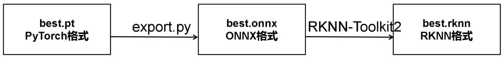

flowchart

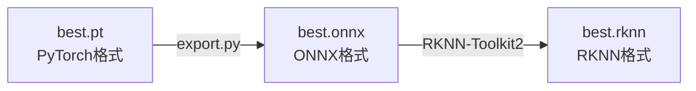

图 6.40 模型转化流程图

首先，找到实验二中训练完成的 best.py 模型，进入 yolov5-master > run >exp>weights，如图 6.41 所示：

(其中exp 是你最新一次训练的结果)

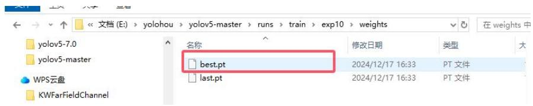

text_image

文档 (E:) > yolohou > yolov5-master > runs > train > exp10 > weights
名称	修改日期	类型	大
yolov5-7.0
yolov5-master
WPS云盘
KWFarFieldChannel
best.pt	2024/12/17 16:33	PT 文件
last.pt	2024/12/17 16:33	PT 文件

图 6.41 best.py 模型

复制最新的 best.pt 到 yolov5-master 文件下，用 VS code 打开 yolov5-master，找到 export.py，在终端输入 python export.py --rknpu --weight best.pt，pt 模型转换 onnx 成功后如图 6.42 所示：

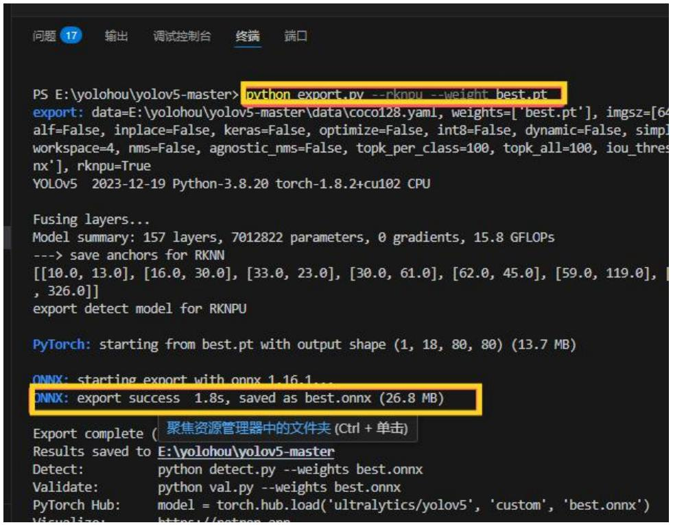

text_image

PS E:\yolohou\yolov5-master> python_export.py --rknpu --weight_best.pt
export: data=E:\yolohou\yolov5-master\data\coco128.yaml, weights=['best.pt'], imgsz=[64
alf=False, inplace=False, keras=False, optimize=False, int8=False, dynamic=False, simpl
workspace=4, nms=False, agnostic_nms=False, topk_per_class=100, topk_all=100, iou_thres
nx'], rknpu=True
YOLOv5 2023-12-19 Python-3.8.20 torch-1.8.2+cu102 CPU

Fusing layers...
Model summary: 157 layers, 7012822 parameters, 0 gradients, 15.8 GFLOPs
--> save anchors for RKNN
[[10.0, 13.0], [16.0, 30.0], [33.0, 23.0], [30.0, 61.0], [62.0, 45.0], [59.0, 119.0],
, 326.0]]
export detect model for RKNPU

PyTorch: starting from best.pt with output shape (1, 18, 80, 80) (13.7 MB)

ONNX: starting export with onnx 1.16.1...
ONNX: export success 1.8s, saved as best.onnx (26.8 MB)

Export complete ( ) 聚焦资源管理器中的文件夹 (Ctrl + 单击)
Results saved to E:\yolohou\yolov5-master
Detect: python detect.py --weights best.onnx
Validate: python val.py --weights best.onnx
PyTorch Hub: model = torch.hub.load('ultralytics/yolov5', 'custom', 'best.onnx')
Visualize: https://outputapp.com

图 6.42 pt 模型转换 onnx

如图 6.43 所示。显示以下结果，则说明模型转换成功，在 yolov5-master 文件下找到 best.onnx 文件。

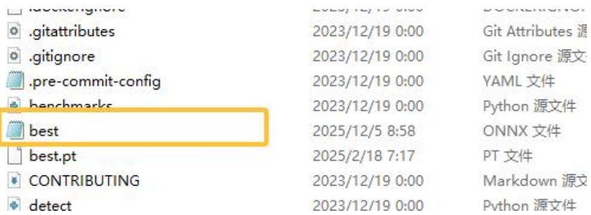

text_image

.gitattributes
.gitignore
.pre-commit-config
benchmarks
best
best.pt
CONTRIBUTING
detect
2023/12/19 0:00
2023/12/19 0:00
2023/12/19 0:00
2023/12/19 0:00
2023/12/19 0:00
2023/12/19 8:58
2025/12/18 7:17
2023/12/19 0:00
2023/12/19 0:00
2023/12/19 0:00
2023/12/19 0:00
2023/12/19 0:00
2023/12/19 0:00
2023/12/19 0:00
2013.12.19 0:00
2013.12.19 0:00
2013.12.19 0:00
2013.12.19 0:00
2013.12.19 0:00
2013.12.19 0:00
2013.12.19 8:58
2013.12.19 8:58
2013.12.19 8:58
2013.12.19 8:58
2013.12.19 8:58
2013.12.19 8:58
2013.12.19 8:58
2023.12.19 8:58
2023.12.19 8:58
2023.12.19 8:58
2023.12.19 8:58
2023.12.19 8:58
2023.12.19 8:58
2023.1/4/4/4/4/4/4/4/4/4/4/4/4/4/4/4/4/4/4/4/4/4/4/4/4/4/4/4/4/4/4/4/4/4/4/4/4/4/4/4/4/4/4/4/4/4/4/4/4/4/4/6

图 6.43 onnx 模型转换成功

步骤二：ONNX 格式转为RKNN格式

打开虚拟机找到 rknn toolkit2-master 包，如图 6.44 所示：

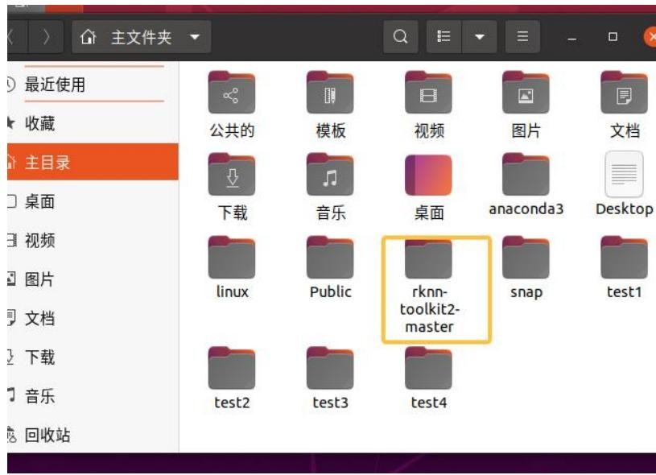

text_image

最近使用
收藏
主目录
公共的
模板
视频
图片
文档
下载
音乐
桌面
anaconda3
Desktop
linux
Public
rknn-
toolkit2-
master
snap
test1
test2
test3
test4
回收站

图 6.44 虚拟机 rknn toolkit2-master 包

打开虚拟机，然后依顺序打开 rknn-toolkit2-master->examples->onnx->yolov5，如图6.45所示：

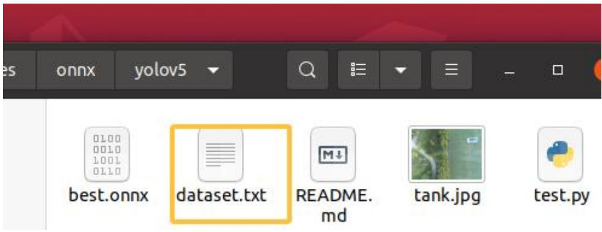

text_image

es onnx yolov5
0100
0010
1001
0110
best.onnx dataset.txt README.
md tank.jpg test.py

图 6.45 修改 dataset.txt 文件 1

将我们导出的 best.onnx 移入该文件中，打开 dataset.txt,将内容修改为 tank.jpg，如图6.46所示：

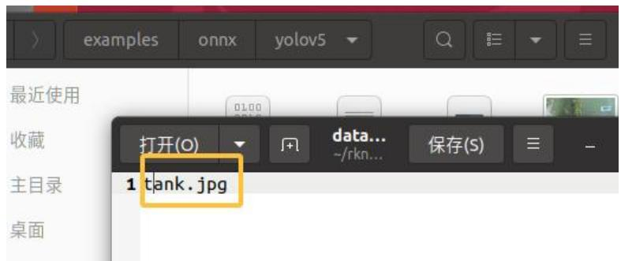

text_image

examples onnx yolov5
最近使用
收藏
主目录
桌面
打开(O) data...
~/rkn... 保存(S)
1 tank.jpg

图 6.46 修改 dataset.txt 文件 2

在该路径下打开终端，输入 conda activate rknn 激活 rknn虚拟环境（在实验给出的虚拟机中已经提前安装好 rknn 虚拟环境，想了解的相关步骤可见https://blog.csdn.net/weixin\_71719718/article/details/134454881），在终端中看到（rknn）则说明环境激活成功，输入 python test.py，如图 6.47 所示：

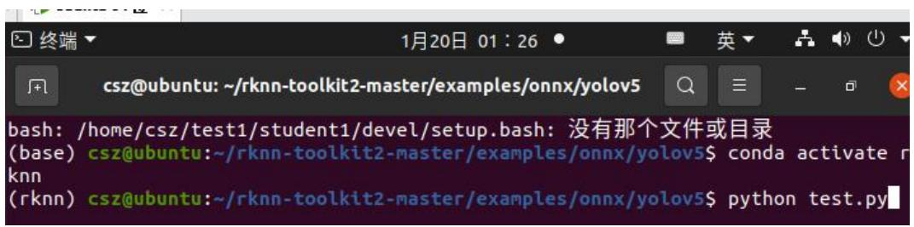

text_image

csz@ubuntu:~/rknn-toolkit2-master/examples/onnx/yolov5
bash: /home/csz/test1/student1/devel/setup.bash: 没有那个文件或目录
(base) csz@ubuntu:~/rknn-toolkit2-master/examples/onnx/yolov5$ conda activate r
knn
(rknn) csz@ubuntu:~/rknn-toolkit2-master/examples/onnx/yolov5$ python test.py

图 6.47 终端转化 RKNN 文件

在终端完成模型转换流程后，目标文件夹中会生成若干输出文件，其中最重要的转换产物是适配RK3566 平台的.rknn 模型文件，如图6.48所示：

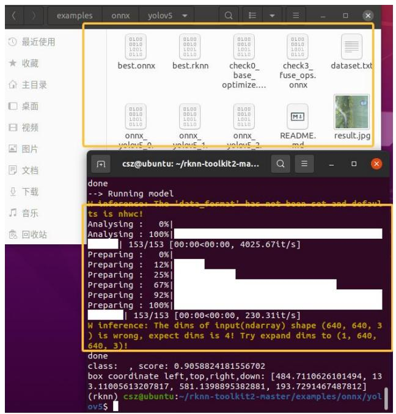

text_image

最近使用
收藏
主目录
桌面
视频
图片
文档
下载
音乐
回收站
0100
0010
1001
0110
best.onnx
0100
0010
1001
0110
check0_
base_
optimize...
0100
0010
1001
0110
check3_
fuse_ops.
onnx
dataset.txt
onnx_
yolov5_0
onnx_
yolov5_1
onnx_
yolov5_2
readME_
md
result.jpg
Done
--> Running model
W inference: The 'data_format' has not been cut and default!
ts is nhwc!
Analysing : 0%
Analysing : 100%
153/153 [00:00<00:00, 4025.67lt/s]
Preparing : 0%
Preparing : 12%
Preparing : 25%
Preparing : 67%
Preparing : 92%
Preparing : 100%
153/153 [00:00<00:00, 230.31lt/s]
W inference: The dims of input(ndarray) shape (640, 640, 3)
is wrong, expect dims is 4! Try expand dims to (1, 640,
640, 3)!
done
class: , score: 0.9058824181556702
box coordinate left, top, right, down: [484.7110626101494, 13
3.11005613207817, 581.1398895382881, 193.7291467487812]
(rknn) csz@ubuntu:~/rknn-toolkit2-master/examples/onnx/yol
ov5$

图 6.48 模型转化成功

如图6.49 所示。通过查看生成的 result.jpg 测试结果图像，可以直观验证转换后的 RKNN 模型在实际场景中的推理效果和准确度表现，这为后续嵌入式部署提供了可靠的性能验证依据。

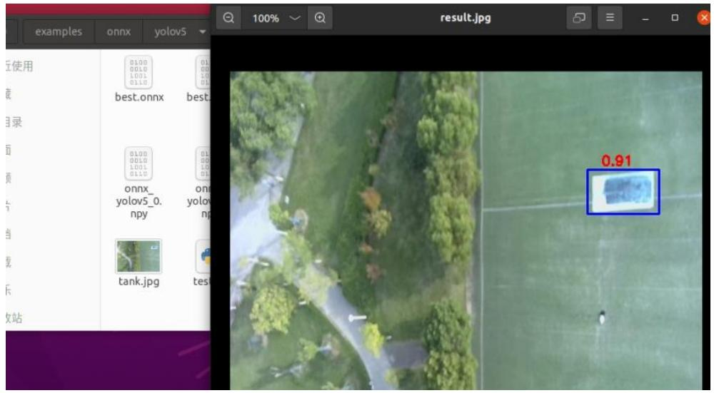

text_image

examples onnx yolov5
100% result.jpg
使用
best.onnx best
onnx_ yolov5_0. npy onny yolov
tank.jpg test
0.91
收藏站

图 6.49 模型转化效果

## 步骤三：将模型部署在RK3566

打开 MobaXterm，在泰山派 RK3566 上部署已转换为.rknn 格式的 YOLOv5s模型，路径和命名如图6.50所示（可对提供的文件进行替换）：

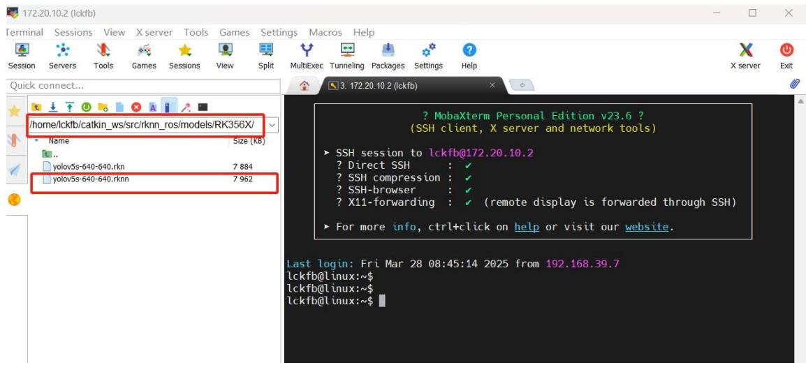

text_image

172.20.10.2 (lckfb)
Terminal
Sessions
View
X server
Tools
Games
Settings
Macros
Help
Session
Servers
Tools
Games
Sessions
View
Split
MultiExec
Tunneling
Packages
Settings
Help
X server
Exit
Quick connect...
/home/lckfb/catkin_ws/src/rknn_ros/models/RK356X/
Name
Size (KB)
..
yolov5s-640-640.rkn
7 884
yolov5s-640-640.rknn
7 962
? MobaXterm Personal Edition v23.6 ?
(SSH client, X server and network tools)
► SSH session to lckfb@172.20.10.2
? Direct SSH : ✓
? SSH compression : ✓
? SSH-browser : ✓
? X11-forwarding : ✓ (remote display is forwarded through SSH)
► For more info, ctrl+click on help or visit our website.
Last login: Fri Mar 28 08:45:14 2025 from 192.168.39.7
lckfb@linux:~$
lckfb@linux:~$
lckfb@linux:~$

图 6.50 模型部署

步骤二：测试模型，RK3566 连接摄像头，启动摄像头节点 roslaunch rknn\_roscamera.launch device:=video0（可通过 ls /dev/video\*查看可用的视频设备），另起一个终端，启动 yolo 识别 roslaunch rknn\_ros yolov5.launch chip\_type:=RK356X，在此可实时查看到是否识别到目标以及识别的精度。可另开一个终端，输入rqt\_image\_view，接收图像数据，图像化显示识别效果。可在打开的窗口选择/rknn\_image/theora 显示识别后的效果，，如图 6.51 所示：

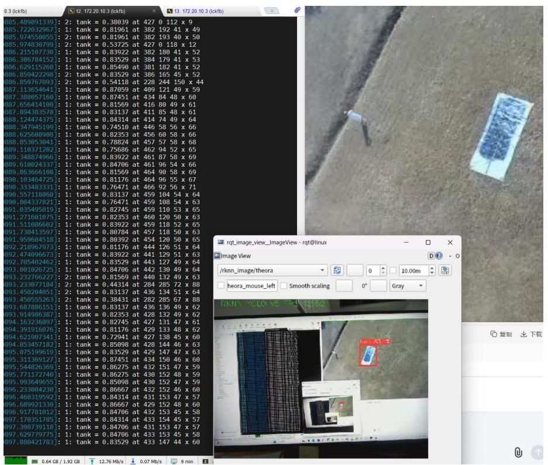

text_image

0.3 (kckfb)
885.489891339]: 2: tank = 0.38039 at 427 0 112 x 9
885.722032967]: 1: tank = 0.81961 at 382 192 41 x 49
885.974558055]: 2: tank = 0.81961 at 382 193 40 x 50
885.974836799]: 2: tank = 0.53725 at 427 0 118 x 12
886.215107730]: 1: tank = 0.83922 at 382 188 41 x 52
886.386704152]: 1: tank = 0.83529 at 384 179 41 x 53
886.629115260]: 1: tank = 0.85498 at 381 182 41 x 52
886.859422298]: 2: tank = 0.83529 at 386 165 45 x 52
886.859767093]: 2: tank = 0.54118 at 228 244 150 x 44
887.113654641]: 1: tank = 0.87059 at 409 121 49 x 59
887.388057160]: 1: tank = 0.87451 at 434 84 48 x 60
887.656414100]: 1: tank = 0.81569 at 416 80 49 x 61
887.894383578]: 1: tank = 0.83137 at 411 85 48 x 61
888.124474375]: 1: tank = 0.84314 at 414 74 49 x 64
888.347945199]: 1: tank = 0.74510 at 446 58 56 x 66
888.625600900]: 1: tank = 0.82353 at 456 60 58 x 66
888.853053041]: 1: tank = 0.78824 at 457 57 58 x 68
889.110171282]: 1: tank = 0.75686 at 462 94 52 x 65
889.348874966]: 1: tank = 0.83922 at 461 87 58 x 69
889.610024337]: 1: tank = 0.84706 at 461 96 54 x 66
889.863666100]: 1: tank = 0.81569 at 464 90 58 x 69
890.103464725]: 1: tank = 0.81176 at 464 96 55 x 67
890.333483331]: 1: tank = 0.76471 at 466 92 56 x 71
890.557118860]: 1: tank = 0.83137 at 459 104 54 x 64
890.804337821]: 1: tank = 0.76471 at 459 108 54 x 63
891.035499310]: 1: tank = 0.82745 at 459 110 53 x 65
891.271601075]: 1: tank = 0.82353 at 460 120 50 x 63
891.511086602]: 1: tank = 0.83922 at 459 118 52 x 65
891.738413597]: 1: tank = 0.80784 at 457 118 50 x 63
891.959684518]: 1: tank = 0.80392 at 454 120 50 x 65
892.218967973]: 1: tank = 0.81176 at 444 126 51 x 64
892.474096673]: 1: tank = 0.83922 at 441 129 51 x 63
892.705402462]: 1: tank = 0.83529 at 443 127 49 x 64
893.001026725]: 1: tank = 0.84706 at 442 130x49x64
893.232766227]: 2: tank = 0.81569 at 446,132x49x63
893.233077104]: 2: tank = -0.44314 at -2B#-B#-B#-B#-B#-B#-B#-B#-B#-B#-B#-B#-B#-B#-B#-B#-B#-B#-B#-B#-B#-B#-B#-B#-B#-B#-B#-B#
RKN%CLo vS %Y %E%Z
RKN%CLo vS %Y %E%Z
RKN%CLo vS %Y %E%Z
RKN%CLo vS %Y %E%Z
RKN%CLo vS %Y %E%Z
RKN%CLo vS %Y %E%Z
RKN%CLo vS %Y %E%Z
RKN%CLo vS %Y %E%Z
RKnV_###_vS_###_vS_###_vS_###_vS_###_vS_###_vS_###_vS_###_vS_###_vS_###_vS_###_vS_###_vS_###_vS_###_vS_###_vS_###_vS_###_vS_###_vS_###_vS_###_vS_###_vCLO_vS_vS_vS_vS_vS_vS_vS_vS_vS_vS_vS_vS_vS_vS_vS_vS_vS_vS_vS_vS_vS_vS_vS_vS_vS_vS_vS_vS_vS_vS_vS_vS_vS_vS_vS_vS_vS_vS_vS_vS_vS_vS_vS_vS_vS_vS_vS_vS_vS_vS_vT

图 6.51 查看模型识别效果