## 第七章 机载嵌入式系统的飞行应用（侦察打击）

本章面向固定翼无人机的机载任务链路，围绕“机载计算-飞控协同”的工程闭环，组织六个递进实验，覆盖 MAVROS 链路验证、任务航线下发与解析、语音触发控制、目标识别与地理坐标解算、在线航点更新与局部路径重构，以及投弹释放系统的工程实现与联调验证。通过分步实验，形成从通信链路到任务执行的可复现实验流程，为后续章节的算法与外场验证提供工程基础。

## 7.1 实验一：启动 MAVROS服务连接测试

## 7.1.1 实验目的

本实验旨在完成 ROS 工作空间的构建与编译，启动 MAVROS 节点并验证机载嵌入式系统与飞控之间的通信链路；同时通过编写订阅节点获取飞控发布的定位信息，验证数据链路的稳定性与接口可用性。

## 7.1.2 实验说明

MAVLink（Micro Air Vehicle Link）是一种广泛应用于无人机系统中的轻量级通信协议，用于飞控与外部设备（如地面站、机载嵌入式系统）之间进行状态信息和控制指令的双向通信。飞行控制器（如 PX4 或 ArduPilot）内部通常运行着MAVLink 协议模块，能够持续发送飞行状态信息（如GPS、姿态、速度等）以及接收来自外部的指令（如飞行模式切换、航点任务等）。

MAVROS 是一个 ROS 功能包，用于将 ROS 系统与使用 MAVLink 协议的飞行控制器（如 PX4）进行桥接通信。它将 MAVLink 协议的数据封装为 ROS话题和服务接口，使得 ROS 节点可以方便地接收飞控状态、控制飞行模式、推送航线任务等。

ROS（机器人操作系统）是一个开源的机器人软件框架，具备分布式通信架构、话题机制、服务机制和参数服务器等特点，非常适合构建无人系统的模块化应用。ROS 运行在 Ubuntu 系统中，该系统提供了高度灵活的软件开发能力，便于将图像识别、路径规划、投弹控制等模块进行解耦和协作。

本实验中，学生将使用 ROS 创建自己的工作空间（workspace），配置MAVROS 节点，并通过命令行工具对无人机系统进行基本的操作和测试。

## 7.1.3 实验步骤

步骤一：打开虚拟机镜像文件

打开 VMWare17.6，点击文件-打开，选中镜像文件（Ubuntu18.04.6.vmx），

打开，开启此虚拟机，如图7.1所示：

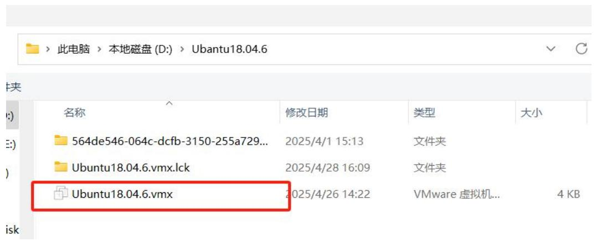

<details>
<summary>text_image</summary>

此电脑 > 本地磁盘 (D:) > Ubuntu18.04.6
文件夹
名称	修改日期	类型	大小
564de546-064c-dcfb-3150-255a729...	2025/4/1 15:13	文件夹
Ubuntu18.04.6.vmx.lck	2025/4/28 16:09	文件夹
Ubuntu18.04.6.vmx	2025/4/26 14:22	VMware 虚拟机...	4 KB
</details>

图 7.1 Ubuntu 镜像文件

## 步骤二：创建工作空间

进入 test1 文件夹下面的 student1 文件夹里面，创建工作空间 catkin\_ws 并初始化，指令操作如图7.2所示：

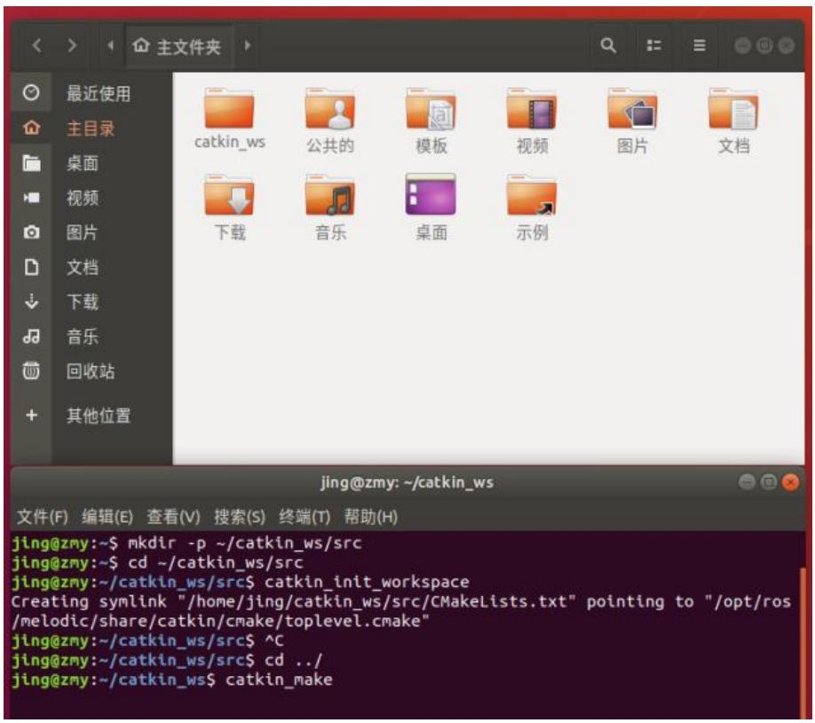

<details>
<summary>text_image</summary>

最近使用
主目录
桌面
视频
图片
文档
下载
音乐
桌面
示例
jing@zmy: ~/catkin_ws
文件(F)  编辑(E)  查看(V)  搜索(S)  终端(T)  帮助(H)
jing@zmy:~$ mkdir -p ~/catkin_ws/src
jing@zmy:~$ cd ~/catkin_ws/src
jing@zmy:~/catkin_ws/src$ catkin_init_workspace
Creating symlink "/home/jing/catkin_ws/src/CMakeLists.txt" pointing to "/opt/ros/melodic/share/catkin/cmake/toplevel.cmake"
jing@zmy:~/catkin_ws/src$ ^C
jing@zmy:~/catkin_ws/src$ cd ../
jing@zmy:~/catkin_ws$ catkin_make
</details>

图 7.2 创建工作空间

## 步骤三：编译工作空间

打开终端，在 catkin\_ws 目录下输入 catkin\_make 进行编译操作，编译成功后，该目录下会多一个build文件夹和一个devel 文件夹，显示如图7.3所示：

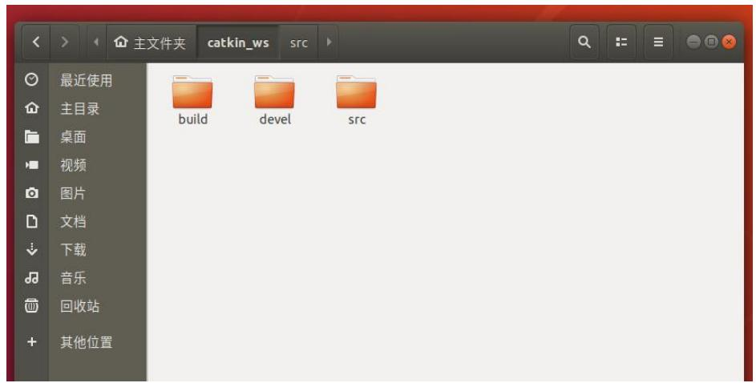

<details>
<summary>text_image</summary>

最近使用
主目录
桌面
视频
图片
文档
下载
音乐
回收站
其他位置
build
devel
src
</details>

图 7.3 编译工作空间后文件夹显示

步骤四：配置环境变量

在\~/文件夹下 Ctrl+h 打开隐藏文件./bashrc，在最下面新增一条 source\~/catkin\_ws/devel/setup.bash。这表示每次打开一个新的终端，都会自动执行这行命令，加载 ROS 工作空间的环境变量。工作空间更换的话需要更改./bashrc 的最后一行内容（每次更换工作空间都换上对应空间的环境变量，除了系统的环境变量，最多一次只有一个环境变量），例如第一个实验应该在./bashrc 最下面加这样一句 source \~/test1/student1/catkin\_ws/devel/setup.bash。以后每个实验都要改成相应的工作空间。如图7.4所示：

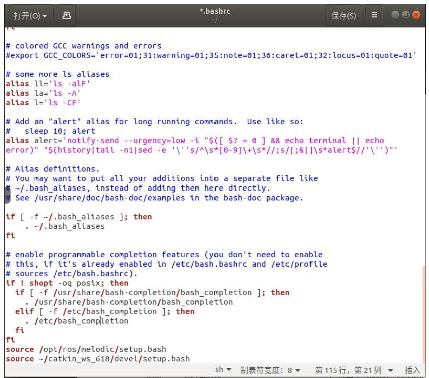

<details>
<summary>text_image</summary>

# colored GCC warnings and errors
#export GCC_COLORS='error=01;31:warning=01;35:note=01;36:caret=01;32:locus=01:quote=01'

# some more ls aliases
alias ll='ls -alF'
alias la='ls -A'
alias l='ls -CF'

# Add an "alert" alias for long running commands. Use like so:
# sleep 10; alert
alias alert='notify-send --urgency=low -i "$([ $? = 0 ] && echo terminal || echo error)" "$(history|tail -n1|sed -e '\\'s/^\s*[0-9]\+\s*//;\s[/&|\]\s*alert$//'\')"

# Alias definitions.
# You may want to put all your additions into a separate file like
# ~/.bash_aliases, instead of adding them here directly.
See /usr/share/doc/bash-doc/examples in the bash-doc package.

if [ -f ~/.bash_aliases ]; then
    . ~/.bash_aliases

fi

# enable programmable completion features (you don't need to enable
# this, if it's already enabled in /etc/bash.bashrc and /etc/profile
# sources /etc/bash.bashrc).
if ! shopt -oq posix; then
    if [ -f /usr/share/bash-completion/bash_completion ]; then
    . /usr/share/bash-completion/bash_completion
    elif [ -f /etc/bash_completion ]; then
    . /etc/bash_completion
    fi

fi
source /opt/ros/melodic/setup.bash
source ~/catkin_ws_618/devel/setup.bash
</details>

图 7.4 配置环境变量

## 步骤五：安装并运行MAVROS

启动 MAVROS 节点连接飞控，通过指令安装 MAVROS，指令如下：sudo aptinstall ros-melodic-mavros ros-melodic-mavros-extras，我们使用的是 ROS1，ROS1中，Melodic 对应 Ubuntu 18.04，Noetic 对应 Ubuntu 20.04。如图 7.5 所示：

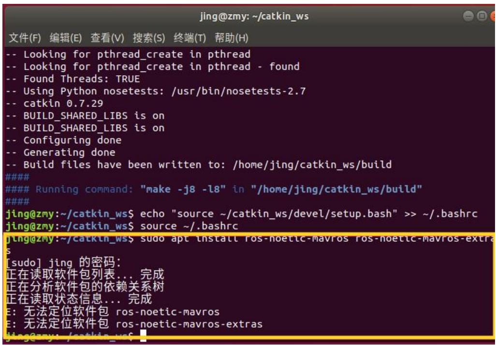

<details>
<summary>text_image</summary>

jing@zmy: ~/catkin_ws
文件(F)  编辑(E)  查看(V)  搜索(S)  终端(T)  帮助(H)
-- Looking for pthread_create in pthread
-- Looking for pthread_create in pthread - found
-- Found Threads: TRUE
-- Using Python nosetests: /usr/bin/nosetests-2.7
-- catkin 0.7.29
-- BUILD_SHARED_LIBS is on
-- BUILD_SHARED_LIBS is on
-- Configuring done
-- Generating done
-- Build files have been written to: /home/jing/catkin_ws/build
###
### Running command: "make -j8 -l8" in "/home/jing/catkin_ws/build"
###
jing@zmy:~/catkin_ws$ echo "source ~/catkin_ws/devel/setup.bash" >> ~/.bashrc
jing@zmy:~/catkin_ws$ source ~/.bashrc
jlng@zmy:~/catkin_ws$ sudo apt install ros-noetic-mavros ros-noetic-mavros-extras
[sudo] jing 的密码:
正在读取软件包列表... 完成
正在分析软件包的依赖关系树
正在读取状态信息... 完成
E: 无法定位软件包 ros-noetic-mavros
E: 无法定位软件包 ros-noetic-mavros-extras
jing@zmy: /catkin_ws$
</details>

图 7.5 安装 MAVROS

安装好MAVROS后，电脑插上数传，选择连接到虚拟机，如图7.6所示：

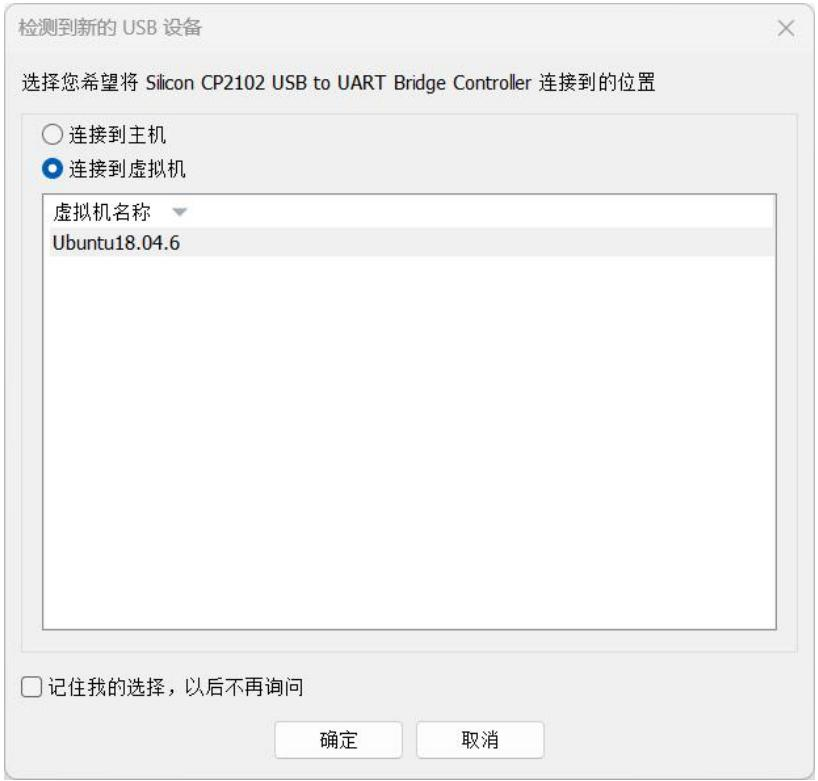

<details>
<summary>text_image</summary>

检测到新的 USB 设备
选择您希望将 Silicon CP2102 USB to UART Bridge Controller 连接到的位置
○ 连接到主机
● 连接到虚拟机
虚拟机名称
Ubuntu18.04.6
□ 记住我的选择，以后不再询问
确定	取消
</details>

图 7.6 虚拟机连接数传

运 行 MAVROS, 命 令 如 下 ： roslaunch mavros apm.launchfcu\_url:=/dev/ttyUSB0:57600(后面移植到泰山派的时候在开机自启的文件里把ttyUSB0 换成 ttyS3)，成功结果如图 7.7 所示：

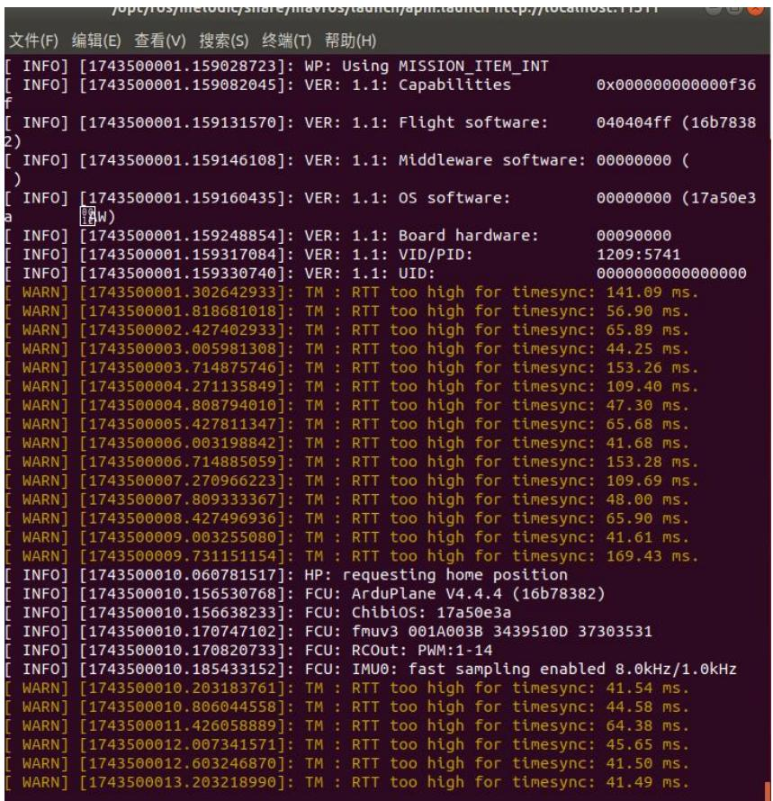

<details>
<summary>text_image</summary>

[ INFO] [1743500001.159028723]: WP: Using MISSION_ITEM_INT
[ INFO] [1743500001.159082045]: VER: 1.1: Capabilities 0x000000000000f36
[ INFO] [1743500001.159131570]: VER: 1.1: Flight software: 040404ff (16b7838
[ INFO] [1743500001.159146108]: VER: 1.1: Middleware software: 00000000 (
[ INFO] [1743500001.159160435]: VER: 1.1: OS software: 00000000 (17a50e3
[ INFO] [1743500001.159248854]: VER: 1.1: Board hardware: 00090000
[ INFO] [1743500001.159317084]: VER: 1.1: VID/PID: 1209:5741
[ INFO] [1743500001.159330740]: VER: 1.1: UID: 000000000000000
[ WARN] [1743500001.302642933]: TM : RTT too high for timesync: 141.09 ms.
[ WARN] [1743500001.818681018]: TM : RTT too high for timesync: 56.90 ms.
[ WARN] [1743500002.427402933]: TM : RTT too high for timesync: 65.89 ms.
[ WARN] [1743500003.005981308]: TM : RTT too high for timesync: 44.25 ms.
[ WARN] [1743500003.714875746]: TM : RTT too high for timesync: 153.26 ms.
[ WARN] [1743500004.271135849]: TM : RTT too high for timesync: 109.40 ms.
[ WARN] [1743500004.808794010]: TM : RTT too high for timesync: 47.30 ms.
[ WARN] [1743500005.427811347]: TM : RTT too high for timesync: 65.68 ms.
[ WARN] [1743500006.003198842]: TM : RTT too high for timesync: 41.68 ms.
[ WARN] [1743500006.714885059]: TM : RTT too high for timesync: 153.28 ms.
[ WARN] [1743500007.270966223]: TM : RTT too high for timesync: 109.69 ms.
[ WARN] [1743500007.809333367]: TM : RTT too high for timesync: 48.00 ms.
[ WARN] [1743500008.427496936]: TM : RTT too high for timesync: 65.90 ms.
[ WARN] [1743500009.003255080]: TM : RTT too high for timesync: 41.61 ms.
[ WARN] [1743500009.731151154]: TM : RTT too high for timesync: 169.43 ms.
[ INFO] [1743500010.060781517]: HP: requesting home position
[ INFO] [1743500010.156530768]: FCU: ArduPlane V4.4.4 (16b78382)
[ INFO] [1743500010.156638233]: FCU: ChibiOS: 17a5o3a
[ INFO] [1743500OIO.17O747IIO]: FCU: fmuv3  0OIAOOB 3A  3A  3A  3A
[ INFO] [17435OOOIO.17O82O733]: FCU: RCOut: PWM: 1-14
[ INFO] [17435OOOIO.185433ILO]: FCU: IMUO: fast sampling enabled 8.OKHz/1.OKHz
[ WARN] [17435OOOIO.2O3I8376I]: TM : RTT too high for timesync: 41.54 ms.
[ WARN] [17435OOOIO.8O6O445S8]: TM : RTT too high for timesync: 44.58 ms.
[ WARN] [17435OOOIO.12A6O5B889]: TM : RTT too high for timesync: 64.38 ms.
[ WARN] [17435OOOIO.2OOT3AIOIY]: TM : RTT too high for timesync: 45.65 ms.
[ WARN] [17435OOOIO.2BODIY]: TM : RTT too high for timesync: 41.5D ms.
[ WARN] [17435OOOIO.2BODIY].TM : RTT too high for timesync: 41.49 ms.
</details>

图 7.7 启动 MAVROS

步骤六：查看节点与话题

另外开一个终端查看节点和话题，如图7.8所示：

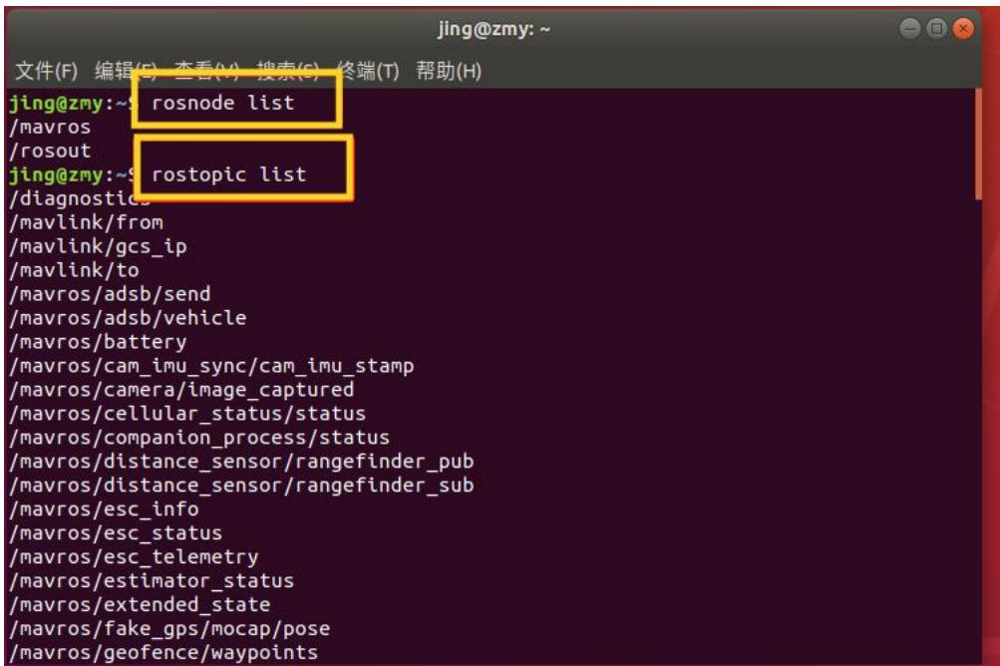

<details>
<summary>text_image</summary>

jing@zmy:~
文件(F)  编辑(E)  查看(V)  搜索(S)  终端(T)  帮助(H)
jing@zmy:~s rosnode list
/mavros
/rosout
jing@zmy:~s rostopic list
/diagnostics
/mavlink/from
/mavlink/gcs_ip
/mavlink/to
/mavros/adsb/send
/mavros/adsb/vehicle
/mavros/battery
/mavros/cam_imu_sync/cam_imu_stamp
/mavros/camera/image_captured
/mavros/cellular_status/status
/mavros/companion_process/status
/mavros/distance_sensor/rangefinder_pub
/mavros/distance_sensor/rangefinder_sub
/mavros/esc_info
/mavros/esc_status
/mavros/esc_telemetry
/mavros/estimator_status
/mavros/extended_state
/mavros/fake_gps/mocap/pose
/mavros/geofence/waypoints
</details>

图 7.8 查看节点和话题

步骤七：编写测试节点订阅位置信息

在 catkin\_ws 的 src 下面通过指令 catkin\_create\_pkg gps\_listener rospy roscppstd\_msgs 创建叫做 gps\_listener 的包，并在包下面的 src 目录编写一个叫gps\_listener.cpp 的一个 demo 代码。（mavros 官方文档有相关话题和服务，网址 https://wiki.ros.org/mavros#Published\_Topics）如图 7.9 所示：

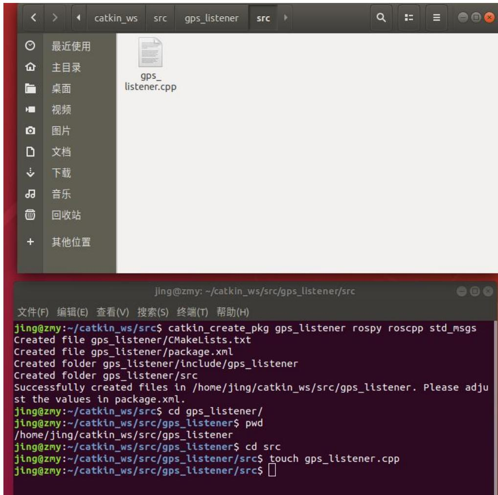

<details>
<summary>text_image</summary>

最近使用
主目录
桌面
视频
图片
文档
下载
音乐
回收站
其他位置

gps_
listener.cpp

jing@zmy:~/catkin_ws/src/gps_listener/src

文件(F)  编辑(E)  查看(V)  搜索(S)  终端(T)  帮助(H)

jing@zmy:~/catkin_ws/src$ catkin_create_pkg gps_listener rospy roscpp std_msgs
Created file gps_listener/CMakeLists.txt
Created file gps_listener/package.xml
Created folder gps_listener/include/gps_listener
Created folder gps_listener/src
Successfully created files in /home/jing/catkin_ws/src/gps_listener. Please adjust the values in package.xml.
jing@zmy:~/catkin_ws/src$ cd gps_listener/
jing@zmy:~/catkin_ws/src/gps_listener$ pwd
/home/jing/catkin_ws/src/gps_listener
jing@zmy:~/catkin_ws/src/gps_listener$ cd src
jing@zmy:~/catkin_ws/src/gps_listener/src$ touch gps_listener.cpp
jing@zmy:~/catkin_ws/src/gps_listener/src$
</details>

图 7.9 创建 demo 文件

参考代码如下：

```cpp
#include <ros/ros.h>
#include <sensor_msgs/NavSatFix.h>

//获取无人机经纬度坐标
void gpsCallback(const sensor_msgs::NavSatFix::ConstPtr& msg)
{
    ROS_INFO("Lat:%f, Lon:%f. Alt:%f", msg->latitude, msg->longitude, msg->altitude);
}
```

```cpp
//主函数
int main(int argc,char **argv)
{
    ros::init(argc,argv,"gps_listener");
    ros::NodeHandle nh;
    ros::Subscriber sub =
    nh.subscribe("/mavros/global_position/global",10,gpsCallback);//订阅无人机坐标
    ros::spin();
    return 0;
}
```

步骤八：在CMakeLists.txt中末尾添加编译项，如图7.10所示：

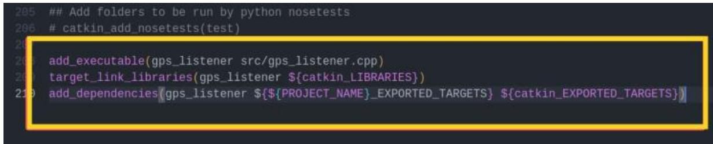

<details>
<summary>text_image</summary>

205 ## Add folders to be run by python nosetests
206 # catkin_add_nosetests(test)
206 add_executable(gps_listener src/gps_listener.cpp)
207 target_link_libraries(gps_listener ${catkin_LIBRARIES})
208 add_dependencies(gps_listener ${${PROJECT_NAME}_EXPORTED_TARGETS} ${catkin_EXPORTED_TARGETS})
</details>

图 7.10 CMakeLists.txt 文件配置

后续每个实验都要在相应的CMakeLists.txt中添加编译项，根据节点名字和可执行文件相应调整。

步骤九：编译运行并测试

使用 catkin\_make 编译工作空间 catkin\_ws,加载 ROS 空间环境变量，命令如下：source devel/setup.bash，运行节点 gps\_listener.cpp

（1）先开启一个终端启动roscore，如图7.11所示：

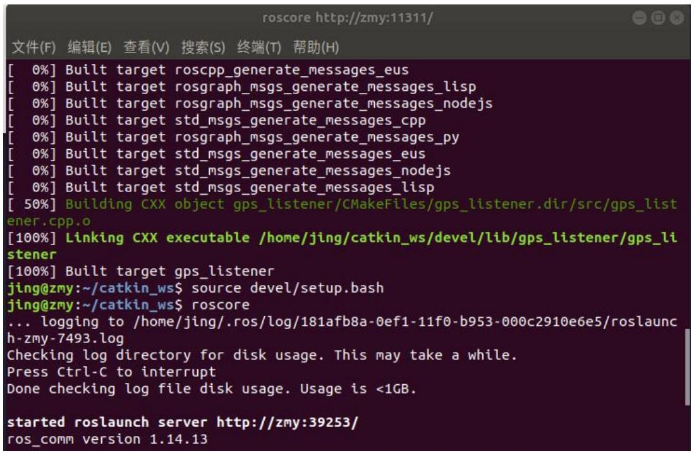

<details>
<summary>text_image</summary>

roscore http://zmy:11311/
文件(F) 编辑(E) 查看(V) 搜索(S) 终端(T) 帮助(H)
[ 0%] Built target roscpp_generate_messages_eus
[ 0%] Built target rograph_msgs_generate_messages_lisp
[ 0%] Built target rograph_msgs_generate_messages_nodejs
[ 0%] Built target std_msgs_generate_messages_cpp
[ 0%] Built target rograph_msgs_generate_messages_py
[ 0%] Built target std_msgs_generate_messages_eus
[ 0%] Built target std_msgs_generate_messages_nodejs
[ 0%] Built target std_msgs_generate_messages_lisp
[ 50%] Building CXX object gps_listener/CMakeFiles/gps_listener.dir/src/gps_list
ener.cpp.o
[100%] Linking CXX executable /home/jing/catkin_ws/devel/lib/gps_listener/gps_li
stener
[100%] Built target gps_listener
jing@zmy:~/catkin_ws$ source devel/setup.bash
jing@zmy:~/catkin_ws$ roscore
... logging to /home/jing/.ros/log/181afb8a-0ef1-11f0-b953-000c2910e6e5/roslaunch
h-zmy-7493.log
Checking log directory for disk usage. This may take a while.
Press Ctrl-C to interrupt
Done checking log file disk usage. Usage is <1GB.
started roslaunch server http://zmy:39253/
ros_comm version 1.14.13
</details>

图 7.11 启动 roscore

（2）再开启一个终端运行 MAVROS，命令如下：roslaunch mavros apm.launchfcu\_url:=/dev/ttyUSB0:57600，如图 7.12 所示：

<table><tr><td>文件(F)</td><td>编辑(E)</td><td>查看(V)</td><td>搜索(S)</td><td>终端(T)</td><td>帮助(H)</td></tr><tr><td>[ INFO]</td><td>[1743500001.159028723]:</td><td colspan="4">WP: Using MISSION_ITEM_INT</td></tr><tr><td>[ INFO]</td><td>[1743500001.159082045]:</td><td colspan="3">VER: 1.1: Capabilities</td><td>0x000000000000f36</td></tr><tr><td>[ INFO]</td><td>[1743500001.159131570]:</td><td colspan="3">VER: 1.1: Flight software:</td><td>040404ff (16b78382)</td></tr><tr><td>[ INFO]</td><td>[1743500001.159146108]:</td><td colspan="3">VER: 1.1: Middleware software:</td><td>00000000 ( )</td></tr><tr><td>[ INFO]</td><td>[1743500001.159160435]:</td><td colspan="3">VER: 1.1: OS software:</td><td>00000000 (17a50e3</td></tr><tr><td>[ INFO]</td><td>[1743500001.159248854]:</td><td colspan="3">VER: 1.1: Board hardware:</td><td>00090000</td></tr><tr><td>[ INFO]</td><td>[1743500001.159317084]:</td><td colspan="3">VER: 1.1: VID/PID:</td><td>1209:5741</td></tr><tr><td>[ INFO]</td><td>[1743500001.159330740]:</td><td colspan="3">VER: 1.1: UID:</td><td>000000000000000</td></tr><tr><td>[ WARN]</td><td>[1743500001.302642933]:</td><td colspan="3">TM : RTT too high for timesync:</td><td>141.09 ms.</td></tr><tr><td>[ WARN]</td><td>[1743500001.818681018]:</td><td colspan="3">TM : RTT too high for timesync:</td><td>56.90 ms.</td></tr><tr><td>[ WARN]</td><td>[1743500002.427402933]:</td><td colspan="3">TM : RTT too high for timesync:</td><td>65.89 ms.</td></tr><tr><td>[ WARN]</td><td>[1743500003.005981308]:</td><td colspan="3">TM : RTT too high for timesync:</td><td>44.25 ms.</td></tr><tr><td>[ WARN]</td><td>[1743500003.714875746]:</td><td colspan="3">TM : RTT too high for timesync:</td><td>153.26 ms.</td></tr><tr><td>[ WARN]</td><td>[1743500004.271135849]:</td><td colspan="3">TM : RTT too high for timesync:</td><td>109.40 ms.</td></tr><tr><td>[ WARN]</td><td>[1743500004.808794010]:</td><td colspan="3">TM : RTT too high for timesync:</td><td>47.30 ms.</td></tr><tr><td>[ WARN]</td><td>[1743500005.427811347]:</td><td colspan="3">TM : RTT too high for timesync:</td><td>65.68 ms.</td></tr><tr><td>[ WARN]</td><td>[1743500006.003198842]:</td><td colspan="3">TM : RTT too high for timesync:</td><td>41.68 ms.</td></tr><tr><td>[ WARN]</td><td>[1743500006.714885659]:</td><td colspan="3">TM : RTT too high for timesync:</td><td>153.28 ms.</td></tr><tr><td>[ WARN]</td><td>[1743500007.270966223]:</td><td colspan="3">TM : RTT too high for timesync:</td><td>109.69 ms.</td></tr><tr><td>[ WARN]</td><td>[1743500007.809333367]:</td><td colspan="3">TM : RTT too high for timesync:</td><td>48.00 ms.</td></tr><tr><td>[ WARN]</td><td>[1743500008.427496936]:</td><td colspan="3">TM : RTT too high for timesync:</td><td>65.90 ms.</td></tr><tr><td>[ WARN]</td><td>[1743500009.00325508O]:</td><td colspan="3">TM : RTT too high for timesync:</td><td>41.61 ms.</td></tr><tr><td>[ WARN]</td><td>[1743500009.731151154]:</td><td colspan="3">TM : RTT too high for timesync:</td><td>169.43 ms.</td></tr><tr><td>[ INFO]</td><td>[17435001O. 06O78I517]:</td><td colspan="3">HP: requesting home position</td><td></td></tr><tr><td>[ INFO]</td><td colspan="4">[17435OIOO 1O. 15653O768]: FCU: ArduPlane V4.4.4 ( 16b78382)</td><td></td></tr><tr><td>[ INFO]</td><td colspan="4">[17435OIOO 1O. 15663B233]: FCU: ChibioS: 17a5Oe3a</td><td></td></tr><tr><td>[ INFO]</td><td colspan="4">[17435OIOO 1O. 17O7A7I2O]: FCU: fmuv3  OOIAOOB  34395IOD  373O3S3I</td><td></td></tr><tr><td>[ INFO]</td><td colspan="4">[17435OIOO 1O. 17O82O733]: FCU: RCOut: PWM:  1-  14</td><td></td></tr><tr><td>[ INFO]</td><td colspan="4">[17435OIOO 1O. 185433I52]: FCU: IMUO: fast sampling enabled 8.OKHz/  1.OKHz</td><td></td></tr><tr><td>[ WARN]</td><td colspan="4">[17435OIOO 1O. 2O3I8R376I]: TM : RTT too high for timesync: 41.54 ms.</td><td></td></tr><tr><td>[ WARN]</td><td colspan="4">[17435OIOO 1O. 8O6O44558]: TM : RTT too high for timesync: 44.58 ms.</td><td></td></tr><tr><td>[ WARN]</td><td colspan="4">[17435OIOO 1I. 426O58889]: TM : RTT too high for timesync: 64.38 ms.</td><td></td></tr><tr><td>[ WARN]</td><td colspan="4">[17435OIOO 2I.OO734I57I]: TM : RTT too high for timesync: 45.65 ms.</td><td></td></tr><tr><td>[ WARN]</td><td colspan="4">[17435OIOO 2I.OO324687O]: TM : RTT too high for timesync: 41.5o ms.</td><td></td></tr><tr><td>[ WARN]</td><td colspan="4">[17435OIOO 2I.OO2I899O]: TM : RTT too high for timesync: 41.49 ms.</td><td></td></tr></table>

图 7.12 启动 MAVROS

（3）最后开启一个终端输入：rosrun gps\_listener gps\_listener，如图 7.13 所示：

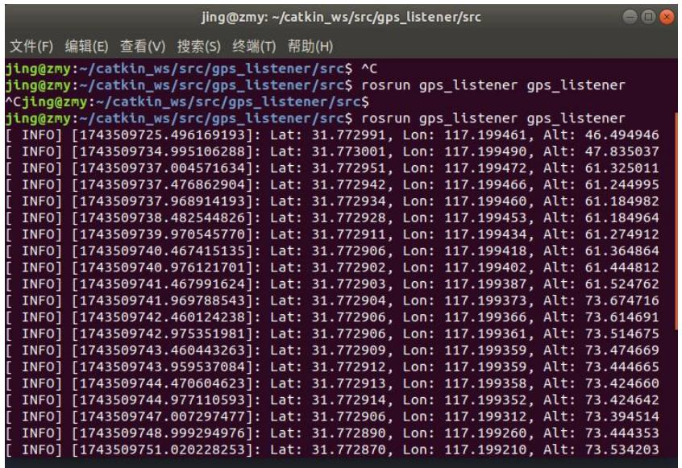

<details>
<summary>text_image</summary>

jing@zmy:~/catkin_ws/src/gps_listener/src
文件(F)  编辑(E)  查看(V)  搜索(S)  终端(T)  帮助(H)
jing@zmy:~/catkin_ws/src/gps_listener/src$ ^C
jing@zmy:~/catkin_ws/src/gps_listener/src$ rosrun gps_listener gps_listener
^Cjing@zmy:~/catkin_ws/src/gps_listener/src$
jing@zmy:~/catkin_ws/src/gps_listener/src$ rosrun gps_listener gps_listener
[ INFO] [1743509725.496169193]: Lat: 31.772991, Lon: 117.199461, Alt: 46.494946
[ INFO] [1743509734.995106288]: Lat: 31.773001, Lon: 117.199490, Alt: 47.835037
[ INFO] [1743509737.004571634]: Lat: 31.772951, Lon: 117.199472, Alt: 61.325011
[ INFO] [1743509737.476862904]: Lat: 31.772942, Lon: 117.199466, Alt: 61.244995
[ INFO] [1743509737.968914193]: Lat: 31.772934, Lon: 117.199460, Alt: 61.184982
[ INFO] [1743509738.482544826]: Lat: 31.772928, Lon: 117.199453, Alt: 61.184964
[ INFO] [1743509739.970545770]: Lat: 31.772911, Lon: 117.199434, Alt: 61.274912
[ INFO] [1743509740.467415135]: Lat: 31.772906, Lon: 117.199418, Alt: 61.364864
[ INFO] [1743509740.976121701]: Lat: 31.772902, Lon: 117.199402, Alt: 61.444812
[ INFO] [1743509741.467991624]: Lat: 31.772903, Lon: 117.199387, Alt: 61.524762
[ INFO] [1743509741.969788543]: Lat: 31.772904, Lon: 117.199373, Alt: 73.674716
[ INFO] [1743509742.460124238]: Lat: 31.772906, Lon: 117.199366, Alt: 73.614691
[ INFO] [1743509742.975351981]: Lat: 31.772906, Lon: 117.199361, Alt: 73.514675
[ INFO] [1743509743.460443263]: Lat: 31.772909, Lon: 117.199359, Alt: 73.474669
[ INFO] [1743509743.959537084]: Lat: 31.772912, Lon: 117.199359, Alt: 73.444665
[ INFO] [1743509744.470604623]: Lat: 31.772913, Lon: 117.199358, Alt: 73.424660
[ INFO] [1743509744.977110593]: Lat: 31.772914, Lon: 117.199352, Alt: 73.424642
[ INFO] [1743509747.007297477]: Lat: 31.772906, Lon: 117.199312, Alt: 73.394514
[ INFO] [1743509748.999294976]: Lat: 31.772890, Lon: 117.199260, Alt: 73.444353
[ INFO] [1743509751.020228253]: Lat: 31.772870, Lon: 117.199210, Alt: 73.534203
</details>

图 7.13 运行 gps\_listener 节点

验证实验结果，如上图得到正确经纬度和高度信息，说明MAVROS成功启动，飞控GPS数据正常接入ROS 系统。