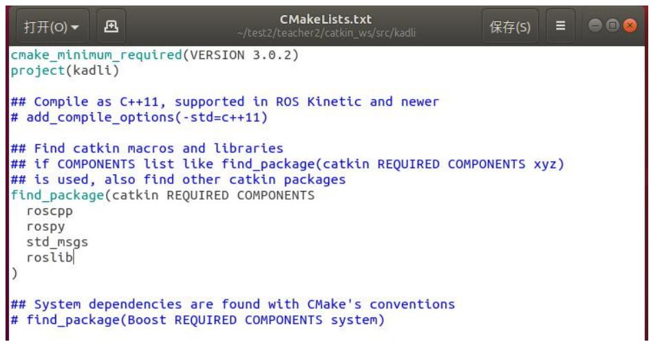
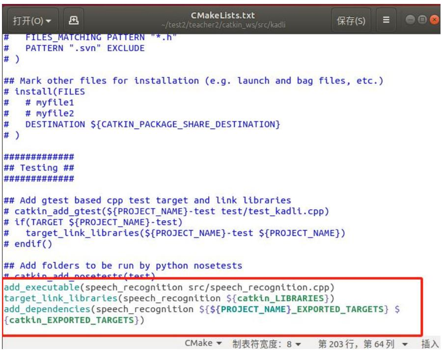
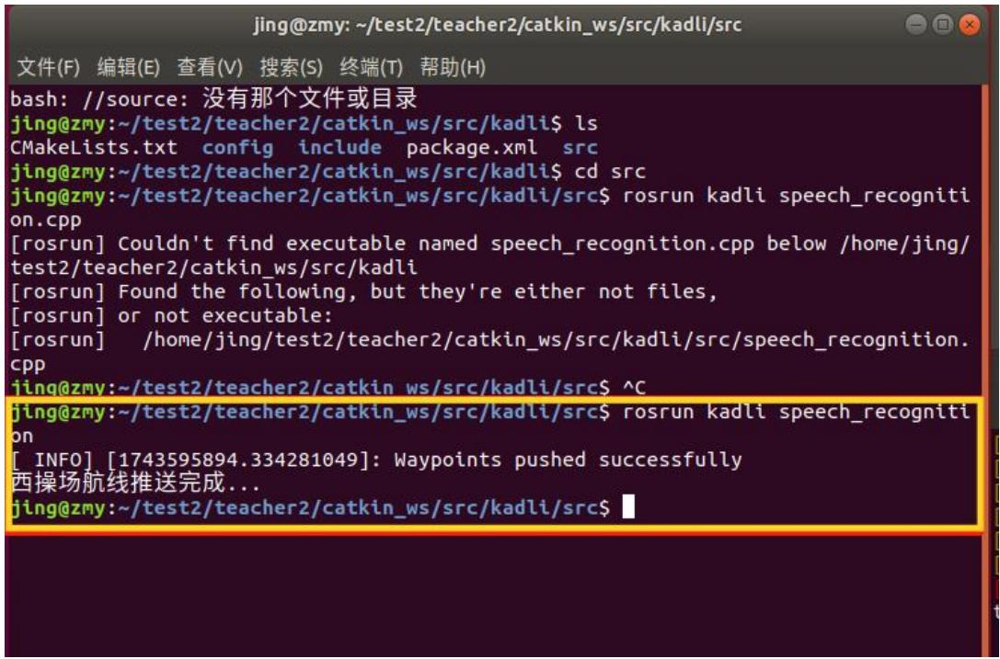
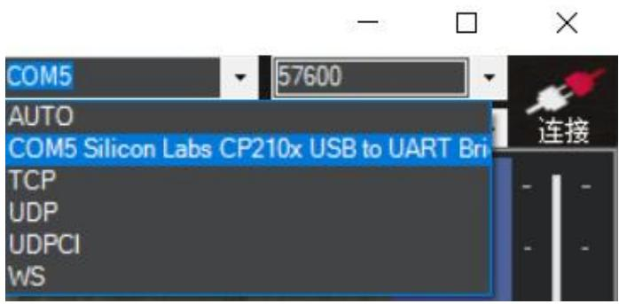
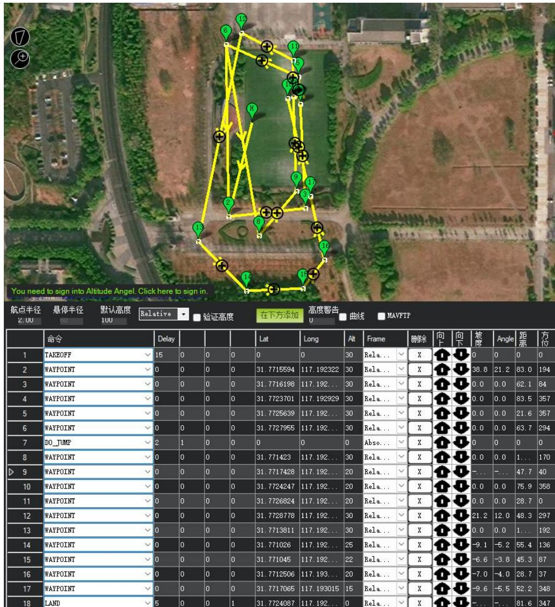

## 7.2 实验二：航线推送与航点解析文件

## 7.2.1 实验目的

本实验旨在掌握 QGC WPL 110 格式的航点文件结构和含义；掌握如何在ROS 环境中解析航点文件，完成航点序列的读取、结构化存储与下发；学会调用 MAVROS 中的/mavros/mission/push 服务，实现向飞控推送航点，初步理解自动化流程中语音识别触发任务的实现逻辑。

## 7.2.2 实验说明

地面站生成的航线通常以标准化航点文件形式保存。本实验以 QGC 航点文件格式为例，说明航点字段含义与解析流程，并通过 MAVROS 的任务推送服务将航点写入飞控任务列表，实现“文件-解析-下发”的闭环。QGroundControl导出的航线文件为 QGCWPL110 格式的纯文本文件。每一行表示一个航点，其格式为：index current frame command param1 param2 param3 param4 x\_laty\_long z\_alt autocontinue。此顺序和 mavros\_msgs::Waypoint 消息的字段顺序是不同的。解析完成后，通过调用 ROS 服务 /mavros/mission/push 将航点以mavros\_msgs::Waypoint 的形式推送给飞控，从而实现自动任务规划。

## 7.2.3 实验步骤

步骤一：新建工程包

在工作空间的 src 下面创建工程包，命令如下：catkin\_create\_pkg kadli rospyroscpp std\_msgs roslib 其 中 kadli 是 包 名 ， 后 面 的 都 是 依 赖 项 列 表 。 可 在CMakeLists.txt 文件中查看到添加的依赖项，如图 7.14 所示：



<details>
<summary>text_image</summary>

cmake_minimum_required(VERSION 3.0.2)
project(kadli)

## Compile as C++11, supported in ROS Kinetic and newer
# add_compile_options(-std=c++11)

## Find catkin macros and libraries
## if COMPONENTS list like find_package(catkin REQUIRED COMPONENTS xyz)
## is used, also find other catkin packages
find_package(catkin REQUIRED COMPONENTS
    roscpp
    rospy
    std_msgs
    roslib
)

## System dependencies are found with CMake's conventions
# find_package(Boost REQUIRED COMPONENTS system)
</details>

图 7.14 查看依赖项

步骤二：规划航线

使用 MissionPlanner 进行航线规划，将任务导出为.waypoints 文件。导出的文件采用 QGC WPL 110 格式，该格式是 MissionPlanner 和 QGroundControl 等地面站通用的航点任务文本格式，适用于ArduPilot飞控系统。存放于路径\~/test2/student2/catkin\_ws/src/kadli/config（在 kadli 包下面新建文件夹命名 config）,并确保航线规划正确。航点文件如图7.15所示：

<table><tr><td colspan="8">QGC WPL 110</td></tr><tr><td>0</td><td>1</td><td>0</td><td>16</td><td>0 0</td><td>0 0</td><td>31.7722348</td><td>117.19</td></tr><tr><td>1</td><td>0</td><td>3</td><td>22</td><td>15.00000000</td><td>0.00000000</td><td>0.00000000</td><td>0.0000</td></tr><tr><td>2</td><td>0</td><td>3</td><td>16</td><td>0.00000000</td><td>0.00000000</td><td>0.00000000</td><td>0.0000</td></tr><tr><td>3</td><td>0</td><td>3</td><td>16</td><td>0.00000000</td><td>0.00000000</td><td>0.00000000</td><td>0.0000</td></tr><tr><td>4</td><td>0</td><td>3</td><td>16</td><td>0.00000000</td><td>0.00000000</td><td>0.00000000</td><td>0.0000</td></tr><tr><td>5</td><td>0</td><td>3</td><td>16</td><td>0.00000000</td><td>0.00000000</td><td>0.00000000</td><td>0.0000</td></tr><tr><td>6</td><td>0</td><td>3</td><td>16</td><td>2.2222222222222222222222222222222222222222222222222222222222222222222222222222222222222222222222222222</td><td></td><td></td><td></td></tr><tr><td>7</td><td>16</td><td></td><td></td><td></td><td></td><td></td><td></td></tr><tr><td>8</td><td>16</td><td></td><td></td><td></td><td></td><td></td><td></td></tr><tr><td>9</td><td>16</td><td></td><td></td><td></td><td></td><td></td><td></td></tr><tr><td>11</td><td>16</td><td></td><td></td><td></td><td></td><td></td><td></td></tr><tr><td>13</td><td>16</td><td></td><td></td><td></td><td></td><td></td><td></td></tr><tr><td>14</td><td>16</td><td></td><td></td><td></td><td></td><td></td><td></td></tr><tr><td>15</td><td>16</td><td></td><td></td><td></td><td></td><td></td><td></td></tr><tr><td>16</td><td>16</td><td></td><td></td><td></td><td></td><td></td><td></td></tr><tr><td>17</td><td>16</td><td></td><td></td><td></td><td></td><td></td><td></td></tr><tr><td>18</td><td>16</td><td></td><td></td><td></td><td></td><td></td><td></td></tr></table>

图 7.15 查看.waypoint 文件

航点文件格式解析如表7.1所示：

表 7.1 QGC WPL 110 格式解析

<table><tr><td>index</td><td>Current</td><td>frame</td><td>command</td><td>Param1</td><td>Param2</td><td>Param3</td><td>Param4</td><td>x_lat</td><td>y_long</td><td>z_alt</td><td>autocontinue</td></tr><tr><td>0</td><td>1</td><td>0</td><td>16</td><td>0</td><td>0</td><td>0</td><td>0</td><td>31.772</td><td>117.19</td><td>30</td><td>1</td></tr><tr><td></td><td></td><td></td><td></td><td></td><td></td><td></td><td></td><td>2348</td><td>25207</td><td></td><td></td></tr><tr><td>1</td><td>0</td><td>3</td><td>22</td><td>15</td><td>0</td><td>0</td><td>0</td><td>0</td><td>0</td><td>30</td><td>1</td></tr><tr><td>2</td><td>0</td><td>3</td><td>16</td><td>0</td><td>0</td><td>0</td><td>0</td><td>31.771</td><td>117.19</td><td>30</td><td>1</td></tr><tr><td></td><td></td><td></td><td></td><td></td><td></td><td></td><td></td><td>5594</td><td>2322</td><td></td><td></td></tr><tr><td>3</td><td>0</td><td>3</td><td>16</td><td>0</td><td>0</td><td>0</td><td>0</td><td>31.771</td><td>117.19</td><td>30</td><td>1</td></tr><tr><td></td><td></td><td></td><td></td><td></td><td></td><td></td><td></td><td>6198</td><td>29747</td><td></td><td></td></tr><tr><td>4</td><td>0</td><td>3</td><td>16</td><td>0</td><td>0</td><td>0</td><td>0</td><td>31.772</td><td>117.19</td><td>30</td><td>1</td></tr><tr><td></td><td></td><td></td><td></td><td></td><td></td><td></td><td></td><td>3701</td><td>2929</td><td></td><td></td></tr></table>

其中index 表示航点编号，Current 表示是否是当前任务（1是当前点，其他是 0），frame 是坐标系（3 表示相对高度），command 是 MAVLink 命令编号（16表示 waypoint，22 表示 take\_off），param1\~param4 是命令的参数，x\_lat 是纬度，y\_long 是经度，z\_lat 是高度，autocontinue 表示是否继续执行下一条命令（1 表示是，0 表示否）。首行 QGC WPL 110 是文件标识和版本号，从第二行开始，每行代表一个航点，读取每行航点顺序也应该如表7.1所示。

## 步骤三：解析航点文件并上传服务推送航点

在 kadli 包的 src 下面新建 speech\_recognition.cpp 文件，来解析航点文件。打开文件，跳过第一行格式标识符（QGC WPL110）。按照上述表格字段顺序逐行读取与解析，使用 std::istringstream 将文本按列拆分，并依次赋值给对应的变量，最终转换为 mavros\_msgs::Waypoint 消息结构，用于在 ROS 中发布航线任务。解析航点文件代码框架：

```cpp
// 解析 QGC WPL 110 格式的航点文件
std::vector<mavros_msgs::Waypoint> parseWaypoints(const std::string& filepath)
{
/******************************/
//以下读取并解析航点文件程序由学生填写
/******************************/
}
```

步骤四：在ROS中创建服务客户端并推送航点

在main()函数里面初始化 ROS 节点，创建一个NodeHandle 实例用于后续发布任务。读取航点文件路径，使用上一步写好的函数 parseWaypoints()解析航点文件，创建 MAVROS 提供的/mavros/mission/push 服务客户端，构造 WaypointPush请求，将航点列表填入请求信息。调用服务接口，将航线任务上传至飞控系统。

步骤五：验证功能

修改./bashrc 里面的环境变量，CMakeLists.txt 文件末尾增加可执行文件，添加依赖关系以及链接相应的库，如图7.16所示：



<details>
<summary>text_image</summary>

# FILES_MATCHING PATTERN "*.h"
# PATTERN ".svn" EXCLUDE
# )
## Mark other files for installation (e.g. launch and bag files, etc.)
# install(FILES
# # myfile1
# # myfile2
# DESTINATION ${CATKIN_PACKAGE_SHARE_DESTINATION}
# )
###########
## Testing ###
###########
## Add gtest based cpp test target and link libraries
# catkin_add_gtest(${PROJECT_NAME}-test test/test_kadli.cpp)
# if(TARGET ${PROJECT_NAME}-test)
# target_link_libraries Angola{$PROJECT_NAME}-test ${PROJECT_NAME})
# endif()

## Add folders to be run by python nosetests
# catkin_add_nosetests(test)
add_executable(speech_recognition src/speech_recognition.cpp)
target_link_libraries(speech_recognition ${catkin_LIBRARIES})
add_dependencies(speech_recognition ${${PROJECT_NAME}_EXPORTED_TARGETS} ${catkin_EXPORTED_TARGETS})
</details>

图 7.16 配置 CMakeLists.txt 文件

编译工作空间，运行，结果如图7.17所示：



<details>
<summary>text_image</summary>

jing@zmy:~/test2/teacher2/catkin_ws/src/kadli/src
文件(F)  编辑(E)  查看(V)  搜索(S)  终端(T)  帮助(H)
bash: //source: 没有那个文件或目录
jing@zmy:~/test2/teacher2/catkin_ws/src/kadli$ ls
CMakeLists.txt  config  include  package.xml  src
jing@zmy:~/test2/teacher2/catkin_ws/src/kadli$ cd src
jing@zmy:~/test2/teacher2/catkin_ws/src/kadli/src$ rosrun kadli speech_recognition.cpp
[rosrun] Couldn't find executable named speech_recognition.cpp below /home/jing/test2/teacher2/catkin_ws/src/kadli
[rosrun] Found the following, but they're either not files,
[rosrun] or not executable:
[rosrun]    /home/jing/test2/teacher2/catkin_ws/src/kadli/src/speech_recognition.cpp
jing@zmy:~/test2/teacher2/catkin_ws/src/kadli/src$ ^C
jing@zmy:~/test2/teacher2/catkin_ws/src/kadli/src$ rosrun kadli speech_recognitionapp
[ INFO] [1743595894.334281049]: Waypoints pushed successfully
西操场航线推送完成...
jing@zmy:~/test2/teacher2/catkin_ws/src/kadli/src$
</details>

图 7.17 运行 speech\_recognition 节点

打开MissionPlanner，通常为飞控直接连接电脑波特率为 115200，数传连接波特率为 57600，选择接入的COM 端口，在此采用的是数传连接。右上角连接，如图7.18所示：



<details>
<summary>text_image</summary>

COM5
57600
AUTO
COM5 Silicon Labs CP210x USB to UART Bri
TCP
UDP
UDPCI
WS
连接
</details>

图 7.18 MissionPlanner 连接飞控

选择“飞行计划”，点击“读取航点”，即可看到飞控里面的航线，即我们推送过去的西操场航线，如图 7.19所示：



<details>
<summary>text_image</summary>

You need to sign into Altitude Angel. Click here to sign in.
航点半径  悬停半径  默认高度 Relative  验证高度  在下方添加  高度警告 U  曲线  MAVFTP
命令	Delay	Lat	Long	Alt	Frame	删除	向下	坡度	Angle	距离	方位
1	TAKEOFF	✓ 15	0	0	0	0	0	30	Rela...	✓	X	↑	↓	0	0	0	0
2	WAYPOINT	✓ 0	0	0	0	31.7715594	117.192322	30	Rela...	✓	X	↑	↓	38.8	21.2	83.0	194
3	WAYPOINT	✓ 0	0	0	0	31.7716198	117.192...	30	Rela...	✓	X	↑	↓	0.0	0.0	62.1	84
4	WAYPOINT	✓ 0	0	0	0	31.7723701	117.192929	30	Rela...	✓	X	↑	↓	0.0	0.0	83.5	357
5	WAYPOINT	✓ 0	0	0	0	31.7725639	117.192...	30	Rela...	✓	X	↑	↓	0.0	0.0	21.6	357
6	WAYPOINT	✓ 0	0	0	0	31.7727955	117.192...	30	Rela...	✓	X	↑	↓	0.0	0.0	63.7	294
7.DO_JUMP	✓ 2	1	0	0	0	0	0	Abso...	✓	X	↑	↓	0	0	0	0
8	WAYPOINT	✓ 0	0	0	0	31.771423	117.192...	30	Rela...	✓	X	↑	↓	0.0	0.0	1...	170
9	WAYPOINT	✓ 0	0	0	0	31.7717428	117.192...	20	Rela...	✓	X	↑	↓		-...		-...			47.7			40
10	WAYPOINT	✓ 0	0	0	0	31.7724247	117.192...	20	Rela...	✓	X	↑	↓		-...		-...			75.9			358
11	WAYPOINT	✓ 0	0	0	0	31.7726824	117.192...	20	Rela...	✓	X	↑	↓		-...		-...			28.7			0
12	WAYPOINT	✓ 0	0	0	0	31.7728778	117.192...	30	Rela...	✓	X	↑	↓		-...			-...			48.3			297
13	WAYPOINT	✓ 0	0	0	0	31.7713811	117.192...	30	Rela...	✓	X	↑		-...			-...			-...			1...			192
14	WAYPOINT	✓ 0&O  31.771026      117.192...      25	Rela...    X       ↑       ↓       -9.1      -5.2      55.4      136
15	WAYPOINT     ✓  0&O      31.771045      117.192...      22	Rela...    X       ↑       ↓       -6.6      -3.8      45.3      87
16	WAYPOINT     ✓  0&O      31.7712506      117.193...      20	Rela...    X       ↑       ↓       -7.0      -4.0      28.7      37
17	WAYPOINT     ✓  0&O      31.7717065      117.193015     15	Rela...    X       ↑       ↓       -9.6      -5.5      52.2      348
18 LAND     ✓ 5&O      31.7724087      117.192...      0	Rela...    X       ↑       ↓       -...      -...      -81.6      347
</details>

图 7.19 读取航点

参考代码：  
```cpp
// 解析 QGC WPL 110 格式的航点文件
std::vector<mavros msgs::Waypoint> parseWaypoints(const std::string& filepath)
{
    std::vector<mavros_msgs::Waypoint> waypoints;
    std::ifstream file(filepath);
    std::string line;
    // 忽略文件头（第一行）
    std::getline(file, line);
    while (std::getline(file, line)) {
    std::istringstream iss(line);
    mavros_msgs::Waypoint wp;
    // 解析每一行的数据
    int seq, frame, command, current, autocontinue;
    double param1, param2, param3, param4, x_lat, y_long, z_alt;
    if (!(iss >> seq >> current >> frame >> command >> param1 >> param2 >> param3 >> param4 >> x_lat >> y_long >> z_alt >> autocontinue)) {
    ROS_ERROR("Failed to parse waypoint line: %s", line.c_str());
    continue;
    }
    // 填充航点消息
    wp.frame = frame;
    wp.command = command;
    wp.is_current = (current == 1);
    wp.autocontinue = (autocontinue == 1);
    wp.param1 = param1;
    wp.param2 = param2;
    wp.param3 = param3;
    wp.param4 = param4;
    wp.x_lat = x_lat;
    wp.y_long = y_long;
    wp.z_alt = z_alt;
    waypoints.push_back(wp);
    }
    return waypoints;

// 主函数
int main(int argc, char **argv)
{
    ros::init(argc, argv, "speech_recognition");
    ros::NodeHandle nh;
    // 读取航点文件路径
    std::string package_path = ros::package::getPath("kadli");
    std::string waypoint_file = package_path + "/config/xicaochang.waypoints";
}
```

```cpp
std::vector<mavros_msgs::Waypoint> waypoints =
parseWaypoints_waypoint_file);
//创建 MAVROS 服务客户端
ros::ServiceClient wp_push_client =
nh.serviceClient<mavros_msgs::WaypointPush>("/ mavros/mission/push");
//准备服务请求
mavros_msgs::WaypointPush wp_push_srv;
wp_push_srv.request.waypoints = waypoints;
//调用服务
if(wp_push_client.call(wp_push_srv))
{
    ROS_INFO("Waypoints pushed successfully");//成功推送时打印输出
}
else
{
    ROS_ERROR("Failed to call / mavros/mission/push service");
}
std::cout << "西操场航线推送完成..." << std::endl;
}
```