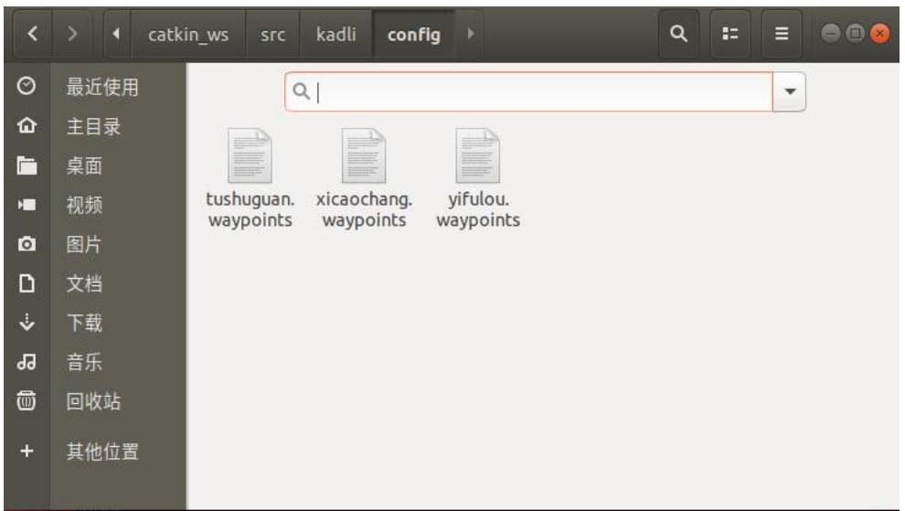
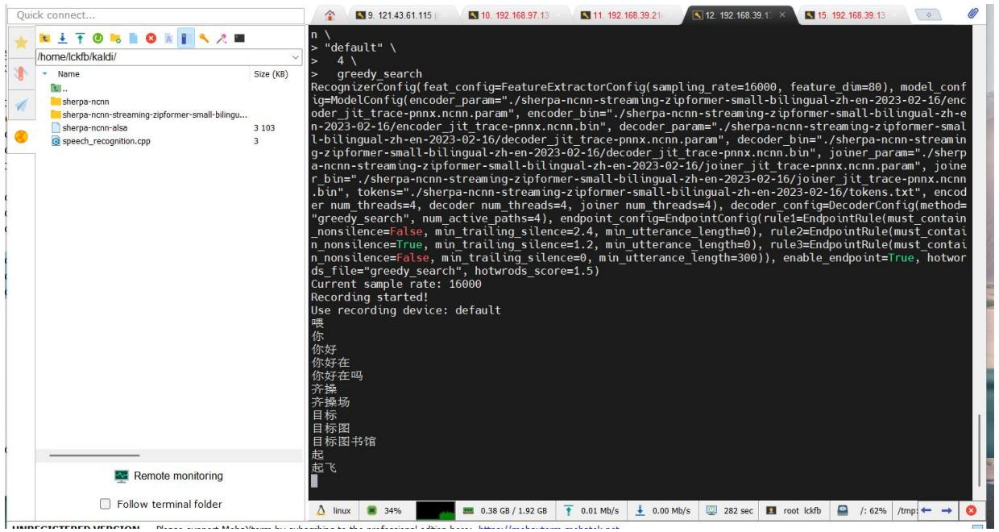

## 7.3 实验三：语音识别控制系统与自动航线推送

## 7.3.1 实验目的

本实验掌握基于语音触发的任务交互方式，学习语音识别与 ROS 之间的通信方式，熟悉将语音结果映射到特定任务，掌握自动起飞命令与飞控模式设置的基本方法，利用MissionPlanner验证航线是否被成功推送。

## 7.3.2 实验说明

本实验基于 ROS 节点运行语音识别引擎（sherpa-ncnn-alsa），通过实时识别学生的口头指令（如“图书馆”、“西操场”或“起飞”）程序监听识别文本流中的关键词，一旦识别到关键词，就加载对应的.waypoint 航点文件。使用/mavros/mission/push服务将航线推送到飞控，识别到“起飞”关键词，自动设置飞控为 AUTO 模式，最后通过 Mission Planner 验证任务是否生效。语音交互模块将语音识别结果映射为任务指令。工程实现上，通常采用“关键词-动作”映射：当识别到某条航线关键词时完成航点文件加载与推送；当识别到任务启动关键词时执行模式设置等任务启动动作，并记录服务调用回执用于链路与任务状态确认。

## 7.3.3 实验步骤

步骤一：编写代码

路径\~/test3/student3/catkin\_ws/src/kadli/config 下面已经准备好三个航点文件，分别是 yifulou.waypoints，xicaochang.waypoints，tushuguan.waypoints，文件格式为 QGC WPL 110，如图 7.20 所示：



<details>
<summary>text_image</summary>

catkin_ws src kadli config
最近使用
主目录
桌面
视频
图片
文档
下载
音乐
回收站
其他位置
tushuguan.
waypoints xicaochang.
waypoints yifulou.
waypoints
</details>

图 7.20 查看 config 里面文件

且已在 kadli 包下面的 src 创建好 speech\_recognition.cpp 文件，打开并填写

相应代码框架：  
```cpp
while (fgets(buffer.data(), buffer.size(), pipe.get()) != nullptr && ros::ok()) {
    // 假设语音识别结果是通过 fprintf(stderr, "%s", s.c_str())输出的
    // 这里我们简单地将其输出到标准输出，你可以根据需要进行处理
    std::string line(buffer.data());
    std::cout << "识别到的语音： " << line << std::endl;

    output += std::string(buffer.data(), buffer.size() - 1); // 确保不包含末尾的空字符

    /******************************/
    //以下判断语音识别内容由学生编写

    /******************************/
    //关闭语音识别进程
    if(pid != -1)
    {
    std::string kill_command = "sudo kill -9 " + std::to_string(pid);
    t result = system(kill_command.c_str());
    if(result != 0) {
    std::cerr << "Failed to kill child process!" << std::endl;
    }
    }
```

写入代码应实现要求：程序通过持续监听语音识别结果（字符串output）来判断用户意图，为了增强识别容错能力，程序需要匹配多个常见的误识别词（如“逸夫楼”“一副楼”等）来判断是否触发特定航点任务。匹配成功后获取航点文件路径，解析航点文件，通过/mavros/mission/push 服务上传航点任务。在确认航线已加载的前提下，识别到“起飞”关键词后调用/mavros/set\_mode服务，将飞控设置为AUTO模式，自动开始执行任务。

修 改 ./bashrc 里 面 的 环 境 变 量 （ 此 实 验 三 应 为 source\~/test3/student3/catkin\_ws/devel/setup.bash），CMakeLists.txt 文件末尾增加可执行文件，添加依赖关系以及链接相应的库，编译工作空间。

## 步骤二：测试麦克风语音识别效果

RK3566 连接飞控，遥控器解锁，解锁安全开关（不要安装螺旋桨！），打开 MobaXterm，把在虚拟机里写好的程序 kadli 包放进 RK3566 的 catkin\_ws 文件夹下面的 src 里面，编译，运行指令：roslaunch kadli speech\_recognition.launch，喊出如下口令，“目标-图书馆/西操场/逸夫楼-起飞”，电机转起来说明试验成

## 功。如图7.21所示：



<details>
<summary>text_image</summary>

/home/ckfb/kaldi/
Name Size (KB)
...
sherpa-ncnn
sherpa-ncnn-streaming-zipformer-small-bilingual...
sherpa-ncnn-alsa 3 103
speech_recognition.cpp 3
Remote monitoring
Follow terminal folder
n \
> "default" \
> 4 \
> greedy_search
RecognizerConfig(feat_config=FeatureExtractorConfig(sampling_rate=16000, feature_dim=80), model_config=ModelConfig(encoder_param="/sherpa-ncnn-streaming-zipformer-small-bilingual-zh-en-2023-02-16/encoder_jit_trace-pnnx.ncnn.param", encoder_bin="/sherpa-ncnn-streaming-zipformer-small-bilingual-zh-en-2023-02-16/encoder_jit_trace-pnnx.ncnn.bin", decoder_param="/sherpa-ncnn-streaming-zipformer-small-bilingual-zh-en-2023-02-16/decoder_jit_trace-pnnx.ncnn.param", decoder_bin="/sherpa-ncnn-streaming-zipformer-small-bilingual-zh-en-2023-02-16/decoder_jit_trace-pnnx.ncnn.bin", joiner_param="/sherpa-ncnn-streaming-zipformer-small-bilingual-zh-en-2023-02-16/jointer_jit_trace-pnnx.ncnn.param", joiner_bin="/sherpa-ncnn-streaming-zipformer-small-bilingual-zh-en-2023-02-16/jointer_jit_trace-pnnx.ncnn.bin", tokens="/sherpa-ncnn-streaming-zipformer-small-bilingual-zh-en-2023-02-16/tokens.txt", encoder num_threads=4, decoder num_threads=4, joiner num_threads=4), decoder_config=DecoderConfig(method="greedy_search", num_active_paths=4), endpoint_config=EndpointConfig(rule1=EndpointRule(must_contain_nonsilence=False, min_trailing_silence=2.4, min_utterance_length=0), rule2=EndpointRule(must_contain_nonsilence=True, min_trailing_silence=1.2, min_utterance_length=0), rule3=EndpointRule(must_contain_nonsilence=False, min_trailing_silence=0, min_utterance_length=300)), enable_endpoint=True, hotwords_file="greedy_search", hotwrods_score=1.5)
Current sample rate: 16000
Recording started!
Use recording device: default
喂
你
你好
你好在
你好在吗
齐操
齐操场
目标
目标图
目标图书馆
起
起飞
Linux 34% 0.38 GB / 1.92 GB 0.01 Mb/s 0.00 Mb/s 282 sec root lckfb /: 62% /tmp
</details>

图 7.21 测试效果

参考代码：

```cpp
//判断语音识别的内容
if(start_flag == 0 && (output.find("逸夫楼") != std::string::npos || output.find("一副楼") != std::string::npos ||
    output.find("亦夫楼") != std::string::npos || output.find("易夫楼") != std::string::npos ||
    output.find("一夫楼") != std::string::npos || output.find("一福楼") != std::string::npos)) {
    start_flag = 1;
    //读取航点文件路径
    std::string package_path =
    ros::package::getPath("speech_recognition");
    std::string waypoint_file = package_path + "/config/yifulou.waypoints";
    //解析航点文件
    std::vector<mavros_msgs::Waypoint> waypoints =
    parseWaypoints_waypoint_file);
    // 创建 MAVROS 服务客户端
    ros::ServiceClient wp_push_client =
    nh.serviceClient<mavros_msgs::WaypointPush>("mavros/mission/push");
    // 准备服务请求
    mavros_msgs::WaypointPush wp_push_srv;
    wp_push_srv.request.waypoints = waypoints;
    // 调用服务
    if (wp_push_client.call(wp_push_srv)) {
    ROS_INFO("Waypoints pushed successfully");
```

```cpp
} else {
    ROS_ERROR("Failed to call /mavros/mission/push service");
}
std::cout << "逸夫楼航线推送完成... " << std::endl;
}
if(start_flag == 0 && (output.find("西操场") != std::string::npos || output.find("细操场") != std::string::npos)) {
    start flag = 1;
    //读取航点文件路径
    std::string package_path =
    ros::package::getPath("speech_recognition");
    std::string waypoint_file = package_path + "/config/xicaochang.waypoints";
    //解析航点文件
    std::vector<mavros msgs::Waypoint> waypoints =
    parseWaypoints(waypoint_file);
    // 创建 MAVROS 服务客户端
    ros::ServiceClient wp_push_client = nh.serviceClient<mavros_msgs::WaypointPush>("/mavros/mission/push");
    // 准备服务请求
    mavros_msgs::WaypointPush wp_push_srv;
    wp_push_srv.request.waypoints = waypoints;
    // 调用服务
    if (wp_push_client.call(wp_push_srv)) {
    ROS_INFO("Waypoints pushed successfully");
    } else {
    ROS_ERROR("Failed to call /mavros/mission/push service");
    }
    std::cout << "西操场航线推送完成... " << std::endl;
}
if(start_flag == 0 && (output.find("图书馆") != std::string::npos)) {
    start_flag = 1;
    //读取航点文件路径
    std::string package_path =
    ros::package::getPath("speech_recognition");
    std::string waypoint_file = package_path + "/config/tushuguan.waypoints";
    //解析航点文件
    std::vector<mavros_msgs::Waypoint> waypoints =
    parseWaypoints(waypoint_file);
    // 创建 MAVROS 服务客户端
    ros::ServiceClient wp_push_client = nh.serviceClient<mavros_msgs::WaypointPush>("/mavros/mission/push");
    // 准备服务请求
    mavros_msgs::WaypointPush wp_push_srv;
```

```cpp
wp_push_srv.request.waypoints = waypoints;
// 调用服务
if (wp_push_client.call(wp_push_srv)) {
    ROS_INFO("Waypoints pushed successfully");
} else {
    ROS_ERROR("Failed to call /mavros/mission/push service");
}
std::cout << "图书馆航线推送完成... " << std::endl;
}
if(output.find("起飞") != std::string::npos && start_flag == 1){
    std::cout << "识别到起飞指令，准备发送起飞命令...\r\n " << std::endl;
//创建服务客户端 用于设置飞控模式
ros::ServiceClient set_mode_client =
nh.serviceClient<mavros msgs::SetMode>("/mavros/set mode");
//创建 setmode 服务请求
mavros_msgs::SetMode set_mode;
set mode.request.custom mode = "AUTO";
//发送模式设置请求
if (set_mode_client.call(set_mode) &&
set_mode.response.mode_sent) {
    ROS_INFO("Mode changed to AUTO"); // 模式更改成功时显示
} else {
    ROS_ERROR("Failed to change mode to AUTO"); // 模式更改失败时显示
}
std::cout << "语音 PID: " << pid << std::endl;
```