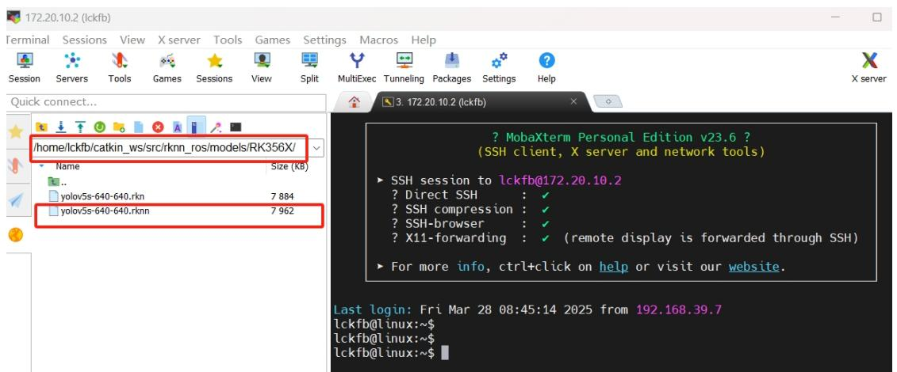
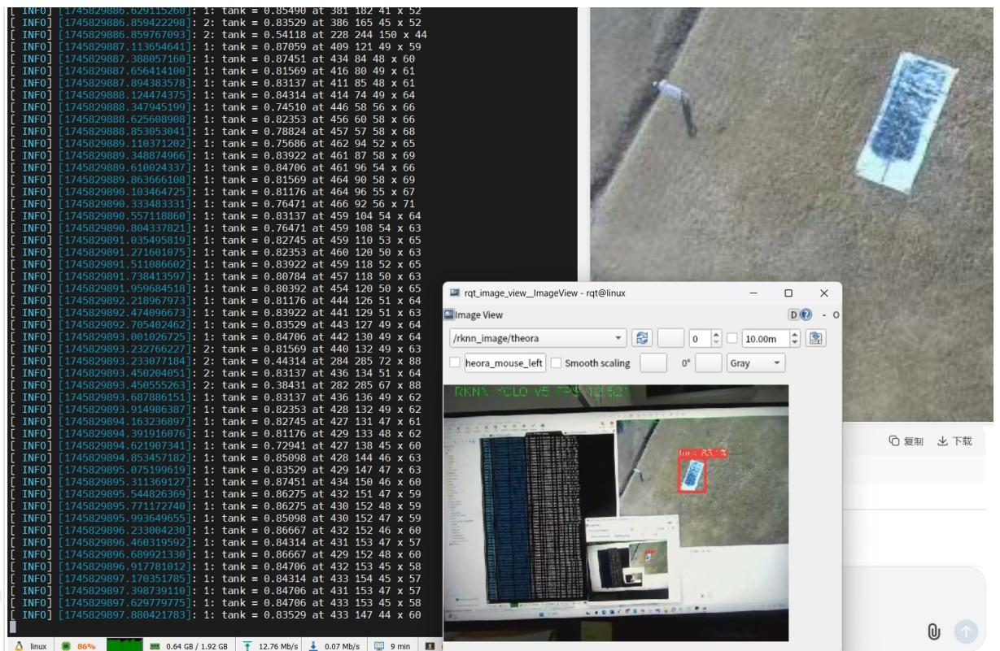
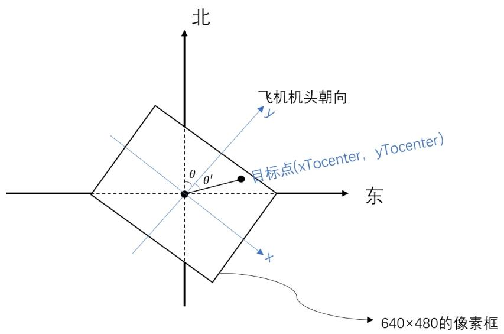
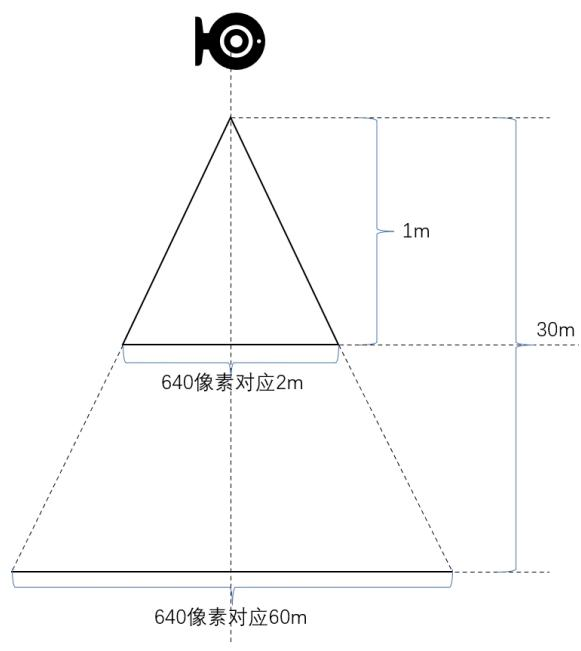
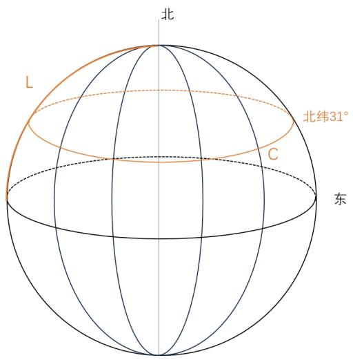

## 7.4 实验四：目标识别与地理坐标定位计算

## 7.4.1 实验目的

本实验旨在掌握如何订阅无人机的姿态信息，以及订阅图像识别话题并提取目标的像素坐标，结合无人机的 GPS、相对高度、航向角信息，理解坐标转换，实现从图像中的目标像素坐标到实际地面目标的经纬度坐标的转换。增强数据处理能力，对多个目标图像处理得到最终的目标经纬度。将目标的经纬度提供给后续任务（如修改航点、投弹等）使用，确保系统具备精确的目标定位能力。

## 7.4.2 实验说明

本实验面向飞控自动任务链中的关键环节——目标识别与定位计算。学生将在本实验中学习如何通过 ROS 框架订阅来自图像识别模块发布的 /objects 话题，获取图像中目标的像素位置。以及通过 MAVROS 文档订阅无人机姿态信息，学生将结合无人机实时位置、相对高度和航向角信息，基于坐标变换方法，完成将图像中的目标像素坐标精准转换为地面目标的经纬度坐标。为后续的航点修改、任务执行（投弹）奠定基础。程序包括：

（1）订阅无人机的位置信息：通过订阅无人机的位置、航向角和相对高度数据；  
（2）将像素坐标转换成地理坐标：结合无人机的位置信息，通过坐标变换计算目标的经纬度；  
（3）计算 3s 内拍到的目标数量，大于 20 张则得到最终的目标坐标。

## 7.4.3 实验步骤

步骤一:模型部署

打开 MobaXterm，在泰山派 RK3566 上部署已转换为.rknn 格式的 YOLOv5s 模型，可对提供的文件进行替换，路径和命名如图 7.22 所示：



<details>
<summary>text_image</summary>

/home/lckfb/catkin_ws/src/rknn_ros/models/RK356X/
Name Size (KB)
..
yolov5s-640-640.rkn 7 884
yolov5s-640-640.rknn 7 962
? MobaXterm Personal Edition v23.6 ?
(SSH client, X server and network tools)
▶ SSH session to lckfb@172.20.10.2
? Direct SSH : ✓
? SSH compression : ✓
? SSH-browser : ✓
? X11-forwarding : ✓ (remote display is forwarded through SSH)
▶ For more info, ctrl+click on help or visit our website.
Last login: Fri Mar 28 08:45:14 2025 from 192.168.39.7
lckfb@linux:~$
lckfb@linux:~$
lckfb@linux:~$
</details>

图 7.22 部署 YOLOv5s 模型

## 步骤二：测试模型

RK3566 连接摄像头，启动摄像头节点，命令如下：roslaunch rknn\_ros camera.launch device:=video0（可通过 ls /dev/video\*查看可用的视频设备），另起一个终端，启动 yolo 识别，命令如下：roslaunch rknn\_ros yolov5.launch chip\_type:=RK356X，在此可实时查看到是否识别到目标以及识别的精度。可另开一个终端，输入 rqt\_image\_view，接收图像数据，图像化显示识别效果。可在打开的窗口选择/rknn\_image/theora 显示识别后的效果。如图 7.23 所示：



<details>
<summary>text_image</summary>

[1745820886.6204115260]: 1: tank = 0.85490 at 381 182 41 x 52
[1745829886.859422298]: 2: tank = 0.83529 at 386 165 45 x 52
[1745829886.859767093]: 2: tank = 0.54118 at 228 244 150 x 44
[1745829887.113654641]: 1: tank = 0.87059 at 409 121 49 x 59
[1745829887.388057160]: 1: tank = 0.87451 at 434 84 48 x 60
[1745829887.656414100]: 1: tank = 0.81569 at 416 80 49 x 61
[1745829887.894383578]: 1: tank = 0.83137 at 411 85 48 x 61
[1745829888.124474375]: 1: tank = 0.84314 at 414 74 49 x 64
[1745829888.347945199]: 1: tank = 0.74510 at 446 58 56 x 66
[1745829888.625608908]: 1: tank = 0.82353 at 456 60 58 x 66
[1745829888.853053041]: 1: tank = 0.78824 at 457 57 58 x 68
[1745829889.110371202]: 1: tank = 0.75686 at 462 94 52 x 65
[1745829889.348874966]: 1: tank = 0.83922 at 461 87 58 x 69
[1745829889.610024337]: 1: tank = 0.84706 at 461 96 54 x 66
[1745829889.863666108]: 1: tank = 0.81569 at 464 90 58 x 69
[1745829890.103464725]: 1: tank = 0.81176 at 464 96 55 x 67
[1745829890.333483331]: 1: tank = 0.76471 at 466 92 56 x 71
[1745829890.557110860]: 1: tank = 0.83137 at 459 104 54 x 64
[1745829890.804337821]: 1: tank = 0.76471 at 459 108 54 x 63
[1745829891.035495819]: 1: tank = 0.82745 at 459 110 53 x 65
[1745829891.271601075]: 1: tank = 0.82353 at 460 120 50 x 63
[1745829891.511086602]: 1: tank = 0.83922 at 459 118 52 x 65
[1745829891.738413597]: 1: tank = 0.80784 at 457 118 50 x 63
[1745829891.959684518]: 1: tank = 0.80392 at 454 120 50 x 65
[1745829892.218967973]: 1: tank = 0.81176 at 444 126 51 x 64
[1745829892.474096673]: 1: tank = 0.83922 at 441 129 51 x 63
[1745829892.705402462]: 1: tank = 0.83529 at 443 127 49 x 64
[1745829893.001026725]: 1: tank = 0.84706 at 442 130 49 x 64
[1745829893.232766227]: 2: tank = 0.81569 at 440 132 49 x 63
[1745829893.233077184]: 2: tank = 0.44314 at 284,285,72 x,8B
[1745829893.45020405] : [ ] [ ] [ ] [ ] [ ] [ ] [ ] [ ] [ ] [ ] [ ] [ ] [ ] [ ] [ ] [ ] [ ] [ ] [ ] [ ] [ ] [ ] [ ] [ ] [ ] [ ] [ ] [ ] [ ] [ ] [ ] [ ] [ ] [ ] [ ] [ ] [ ] [ ] [ ] [ ] [ ] [ ] [ ] [ ] [ ] [ ] [ ] [ ] [ ] [ ] [ ]
[ rqt_image_view_ImageView - rqt@linux ]
Image View
/rknn_image/theora
heora_mouse_left Smooth scaling
Gray
RKN\ yCLO vS -y# yCLO
复制 下载
InfoX: .a.
InfoX: .a.
InfoX: .a.
InfoX: .a.
InfoX: .a.
InfoX: .a.
InfoX: .a.
InfoX: .a.
InfoX: .a.
InfoX: .a.
InfoX: .a.
InfoX: .a.
InfoX: .a.
InfoX: .a.
InfoX: .a.
InfoX: .a.
InfoX: .a.
InfoX: .
InfoX: .a.
InfoX: .a.
InfoX: .a.
InfoX: .a.
InfoX: .a.
InfoX: .a.
InfoX: .a.
InfoX: .a.
InfoX: .a.
InfoX: .a.
InfoX: .a.
InfoX: .a.
InfoX: .a.
InfoX: .a.
InfoX: .a.
InfoX: .a.
InfoX: i
InfoX: i
InfoX: i
InfoX: i
InfoX: i
InfoX: i
InfoX: i
InfoX: i
InfoX: i
InfoX: i
InfoX: i
InfoX: i
InfoX: i
InfoX: i
InfoX: i
InfoX: i
InfoX: i
InfoX: i
InfoX: i
InfoX: i
InfoX: i
</details>

图 7.23 测试模型识别效果

## 步骤三：编写坐标系转换函数并计算目标地理坐标

## (1) 无人机姿态相关话题:

/mavros/global\_position/global（GPS,类型：sensor\_msgs/NavSatFix）

/mavros/global\_position/rel\_alt（相对高度,类型：std\_msgs/Float64）

/mavros/global\_position/compass\_hdg（航向角,类型：std\_msgs/Float64）

在回调函数中已提取经纬度 uav\_coordinates.lat 和 uav\_coordinates.lon、相对高度 uav\_coordinates.rel\_alt、航向角 uav\_coordinates.compass\_hdg 等字段，存放于 uav\_coordinates 结构体变量里。

## (2) 像素坐标相关话题:

/objects（图像像素坐标，类型：object\_information\_msgs/Object）

在给出的代码里已经编写好各回调函数，结合 position\_coordinates 函数计算

出了相对于 x-y 坐标系的像素坐标（xToCenter，yToCenter）。

在此基础上编写目标坐标转换函数，坐标计算函数框架：

```cpp
//位置计算函数
void Target::position_coordinates(void) {
    int xToCenter = pixel_coordinates.x - 320; //x 方向到中心点像素
    int yToCenter = 240 - pixel_coordinates.y; //y 方向到中心点像素
    /******************************/
    //坐标计算函数由学生填写
    /******************************/
}
```

写入代码应实现要求：根据图像中心与像素点的相对位置关系，结合无人机的飞行高度和比例换算系数，将目标的像素坐标转换成以无人机为原点的二维直角坐标，直角坐标转换为以 y 轴为主轴的极坐标，考虑无人机的航向角信息，计算目标相对于地理坐标系正北方向的角度，转换成目标相对于无人机在地球坐标系（东-西是 X 方向，南-北是 Y 方向）的位移，再根据经纬度与实际距离的转化关系，转换成经纬度坐标增量，并加到当前无人机的经纬度坐标上，得到目标实际经纬度。坐标转换原理图如图 7.24 所示：



<details>
<summary>text_image</summary>

北
飞机机头朝向
目标点(xTocenter, yTocenter)
θ θ′
东
x
640×480的像素框
</details>

图 7.24 坐标转换原理图

求出像素距离与实际距离厘米的转换系数, 说明像素距离与实际距离的转化原理如图 7.25 所示:



<details>
<summary>text_image</summary>

1m
30m
640像素对应2m
640像素对应60m
</details>

图 7.25 像素距离与实际距离的转化关系

求出经纬度与实际距离厘米的转换系数, 经纬度与实际距离的转化原理示意图如图 7.26 所示:



<details>
<summary>text_image</summary>

北
L
北纬31°
C
东
</details>

图 7.26 经纬度与实际距离的转化关系

其中 C 是地球北纬 $31^{\circ}$ 的经度周长，除以 360 就是一经度对应的实际距离，L 是地球赤道周长的 1/4, 除以 90 就是一纬度对应的实际距离。从而算出经纬度与实际距离的对应关系以及像素与实际距离的对应关系。

步骤四：计算目标最终经纬度坐标

首先需要限制目标经纬度必须在预设的地理范围内，超出范围则丢弃。每次识别到新目标时，可用结构体变量 temp\_coordinates 暂时储存目标经纬度坐标，判断 final\_coordinates\_buf 是否为空，为空就将其加入到 final\_coordinates\_buf 缓存队列中。不为空就判断当前消息的时间是否在 final\_coordinates\_buf 中最旧的消息的 3s 内，如果在，就填充 final\_coordinates\_buf。计算 3 秒内接收到的目标数量。如果 3s 时候缓存数量超过设定阈值 20，则使用这些目标坐标计算均值作为最终的目标经纬度坐标，赋值给 final\_coordinates 结构体变量，并存入给 my\_final\_coordinates 缓冲区，并赋值给投弹点坐标 drop\_coordinates\_lat，清空 final\_coordinates\_buf 缓冲区以便进行下一次计算。如果目标数据数量不超过 20，则清空缓冲区，进行下一次计算。计算最终目标坐标函数框架：

```cpp
//最终目标坐标计算函数
void Target::final_target_coordinates(int32_t targetlat, int32_t targetlon){
    if(targetlat < SOUTH_lat_Scope || targetlat > NORTH_lat_SCOPE || targetlon < WEST_Lon_Scope || targetlon > EAST_Lon_Scope){
    return;    //超过边界阈值
    }
    Final_Coordinates temp_coordinates;
    temp_coordinates.timestamp = ros::Time::now();
    //计算最终目标坐标函数由学生填写
    //******************************************************************************************/
    /******************************************************************************************/
}
```

其中，SOUTH\_Lat\_Scope 以及其他三个相似变量都是为了限定投弹范围的，在预设航线的投弹点方圆 20m，这是为了防止偏差过大，发生危险。

步骤五：编写 saveToFile()函数

可以将需要打印的数据信息放在 saveToFile 函数里面，设置了定时器，半分钟触发一次，指定输出文件夹路径。本实验保存路径是：/home/lckfb/catkin\_ws/savedata/，保存文件函数代码框架：

```cpp
// 定时器回调函数，用于保存文件
void Target::saveToFile(const ros::TimerEvent&) {
    // 获取格式化的当前时间并创建文件名
    std::string formatted_time = formatRosTime(ros::Time::now());
    std::string folder_path = "/home/lckfb/catkin_ws/savedata/"; // 指定文件夹路径
    std::string filename = folder_path + formatted_time + ".txt";
    // 打开文件进行写入
    std::ofstream file(filename);
```

```txt
if (file.is_open()) {
    // 写入所有像素坐标数据
    for (const auto& data : pixel_coordinates_buf) {
    file << data.timestamp << " | pixel_x: " << data.x
    << ",pixel_y:" << data.y << "\n";
    }

    // 清空缓冲区
    pixel_coordinates_buf.clear();
    file.flush();
/******************************/
// 保存文件程序由学生填写

/******************************/
// 关闭文件
    file.close();
    ROS_INFO("File written successfully.");
} else {
    ROS_ERROR("Unable to open file for writing.");
}
```

三个.cpp 文件共用一个 main 函数，已在 coordinate\_cal.cpp 文件里给出。把在虚拟机里写好的程序 coordinate\_cal 包放进 RK3566 的 catkin\_ws 文件夹下面的 src 里面，编译，运行。

参考代码:

```cpp
// 函数用于将平面直角坐标系转换为极坐标系
void Target::convertRectToPolar(double x, double y, double &r, double θ) {
    r = sqrt(x * x + y * y);
    // atan2 返回的是相对于 x 轴的逆时针角度，我们需要转换为相对于 y 轴的顺时针角度
    // 因此，我们从 90 度（或 PI/2 弧度）开始，减去 atan2 返回的角度，然后转换为度
    theta = 90.0 - atan2(y, x) * 180.0 / M_PI;
    // 如果 theta 是负数，我们需要加上 360 度来转换为顺时针角度
    if (theta < 0) {
    theta += 360.0;
    }
}
// 函数用于将极坐标系转换回平面直角坐标系
void Target::convertPolarToRect(double r, double theta, double &x, double &y) {
    // 将角度从度转换为弧度
    double thetaRadians = theta * M_PI / 180.0;
```

```cpp
// 由于我们的极坐标系是以 y 轴为主轴，所以我们需要调整 theta
thetaRadians = M_PI / 2 - thetaRadians;
x = r * cos(thetaRadians);
y = r * sin(thetaRadians);
}
// 目标位置计算函数
void Target::position_coordinates(void) {
    int xToCenter = pixel_coordinates.x - 320; // x 方向到中心点像素
    int yToCenter = 240 - pixel_coordinates.y; // y 方向到中心点像素
    double xCentiMeters = xToCenter * pixelToCentiMeters *
(uav_coordinates.rel_alt); // cm
    double yCentiMeters = yToCenter * pixelToCentiMeters *
(uav_coordinates.rel_alt); // cm
    double uav_radius = 0; // 半径
    double uav_theta = 0; // 角度
    convertRectToPolar(xCentiMeters, yCentiMeters, uav radius, uav theta);
// 直角坐标系转极坐标系
    double global_theta = uav_theta + uav_coordinates compass_hdg;
// 地球坐标系角度
    if (global_theta > 360) {
    global_theta -= 360;
    }
    double xglobalCentiMeters = 0;
    double yglobalCentiMeters = 0;

convertPolarToRect(uav_radius, global_theta, xglobalCentiMeters, yglobalCentiMeters); // 极坐标系转直角坐标系
    double targetlat = (yglobalCentiMeters / LatToCentiMeters) +
    uav coordinates.lat;
    double targetlon = (xglobalCentiMeters / LonToCentiMeters) +
    uav_coordinates.lon;
    target coordinates.timestamp = pixel coordinates.timestamp;
    target_coordinates.lat = targetlat;
    target_coordinates.lon = targetlon;
    final target coordinates(targetlat, targetlon);
    ROS_INFO("Target Lat: [%.7lf], Target Lon: [%.7lf]", targetlat, targetlon);
    target_coordinates.uav_lat = uav_coordinates.lat;
    target_coordinates.uav_lon = uav_coordinates.lon;
    target_coordinates.uav_rel_alt = uav_coordinates.rel_alt;
    target_coordinates.compass_hdg = uav_coordinates.compass_hdg;
    target_coordinates.x = pixel_coordinates.x;
    target_coordinates.y = pixel_coordinates.y;
    target_coordinates.uav_timestamp = uav_coordinates.timestamp;
    target_coordinates_buf.push_back(target_coordinates);
}
// 最终目标坐标计算函数
void Target::final_target_coordinates(double targetlat, double targetlon) {
    if (targetlat < SOUTH_lat_Scope || targetlat > NORTH_lat_Scope || targetlon < WEST_Lon_Scope || targetlon > EAST_Lon_Scope) {
```

```txt
return;
}
Final_Coordinates temp_coordinates;
temp_coordinates.timestamp = ros::Time::now();
//如果这个 buf 现在是空的，就直接填充当前内容
if(final_coordinates_buf.empty()) {
    temp_coordinates.lat = targetlat;
    temp_coordinates.lon = targetlon;
    final_coordinates_buf.push_back(temp_coordinates);
} else {
    if (ros::Time::now() - final_coordinates_buf.front().timestamp < ros::Duration(3)) {
    temp_coordinates.lat = targetlat;
    temp_coordinates.lon = targetlon;
    final_coordinates_buf.push_back(temp_coordinates);
} else {
    if (final_coordinates_buf.size() > 20) {
    double sum_lat = 0;
    double sum_lon = 0;
    for (auto it = final_coordinates_buf.begin(); it != final_coordinates_buf.end(); ++it) {
    sum_lat += it->lat; //累加纬度
    sum_lon += it->lon; //累加经度
    }
    //最终经纬度坐标
    final_coordinates.lat = sum_lat / final_coordinates_buf.size();
    final_coordinates.lon = sum_lon /
final_coordinates_buf.size();
    final_coordinates.timestamp = temp_coordinates.timestamp;
    if (find_goal == 0) {
    drop_coordinates_lat = final_coordinates.lat;
    drop_coordinates_lon = final_coordinates.lon;
    find_goal = 1; //发现目标标志
    }
    my_final_coordinates.push_back(final_coordinates);
    ROS_INFO("Final Target Lat: [%.7lf], Final Target Lon: [%.7lf]", targetlat, targetlon);
    final_coordinates_buf.clear(); //清空缓冲区
    }
    else {
    final_coordinates_buf.clear();
    }
    }
}
```