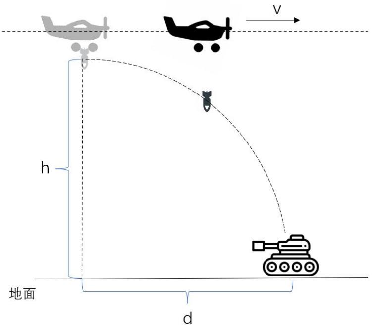

## 7.6 实验六：自动投弹系统设计与实现

## 7.6.1 实验目的

本实验旨在让学生掌握基于实时飞行参数完成自动投弹控制系统的设计与实现方法。学生将学习并掌握如何根据目标与无人机之间的相对距离、速度、飞行高度等因素，投弹时间的延迟判断与补偿动态计算投弹时机，并通过 PWM 控制机制实现弹仓开关控制，从而完成对预设目标的自动打击。

## 7.6.2 实验说明

本实验围绕固定翼无人机在执行自主打击任务过程中的关键功能“投弹控制”展开。投弹系统需在飞行过程中根据目标与无人机之间的相对位置与速度，准确判断投弹时机，并通过控制 PWM 信号实现弹仓的开关操作，确保投弹命中精度。学生需要编写 fire() 函数，通过 velocityCallback() 回调函数求无人机当前飞行速度，通过 altitudeCallback() 回调函数获得无人机当前飞行高度 uav\_coordinates.rel\_alt，通过 positionCallback() 知道无人机的经纬度，且目标经纬度在实验四已经算出来 drop\_coordinates\_lat\_int，再调用 open\_boom() 和 close\_boom() 函数实现 PWM 控制指令的下发，结合逻辑判断是否触发投弹操作。

## 7.6.3 实验步骤

步骤一：PWM 控制初始化

使用 PWM\_Init() 完成 PWM 模块的初始化, 包括导出 PWM 通道, 设置 PWM 的信号周期、设置 PWM 信号极性、使能 PWM 输出, 设置占空比 (set\_PWM 函数的功能)。验证开关弹舱函数 open\_boom() 与 close\_boom() 的有效性, 具体请参考如下代码框架:

```cpp
//PWM 初始化配置
int PWM_Init() {
    std::string command = sudo_command + " \"" + " echo 0 > " + PWM_EXPORT_PATH + "/" + PWM_EXPORT + "\"";
    if (system(command.c_str()) != 0) {
    std::cerr << "Failed to export PWM channel." << std::endl;
    //return -1;
    }

    // 调节 PWM 周期
    if (system((sudo_command + " \"" + " echo 20000000 > " + PWM_CONTROL_PATH + "/" + PWM_SET_PERIOD + "\"").c_str()) != 0) {
    std::cerr << "Failed to set PWM period." << std::endl;
    return -1;
    }
```

```cpp
// 调节 PWM 模式
    if (system((sudo_command + "```" + " echo normal > " +
    PWM_CONTROL_PATH + "/" + PWM_SET_POLAR + "\"").c_str()) != 0) {
    std::cerr << "Failed to set PWM polarity." << std::endl;
    return -1;
    }

    // 调节 PWM 占空比
    if(open boom() != 0){
    return -1;
    }

    // 初始化 PWM 输出
    if (system((sudo_command + "```" + " echo 1 > " + pwm_enable_path + "\"").c_str()) != 0) {
    std::cerr << "Failed to enable PWM output." << std::endl;
    return -1;
    }

    std::cout << "PWM output initialized and duty cycle set to 50%." << std::endl;

    return 0;
    }
// 设置 PWM 占空比
int set_PWM(int duty_cycle){
    duty_cycle = duty_cycle * 1000;

    std::cout << ((sudo_command + "```" + " echo " + std::to_string(duty_cycle) + " > " + pwm_duty_path + "\"").c_str()) << std::endl;

    // 调节 PWM 占空比
    if (system((sudo_command + "```" + " echo " + std::to_string(duty_cycle) + " > " + pwm_duty_path + "\"").c_str()) != 0) {
    std::cerr << "Failed to set PWM duty cycle." << std::endl;
    return -1;
    }
    return 0;
}
```

## 步骤二：编写 fire() 函数

通过 positionCallback()知道无人机的经纬度 uavlat 和 uavlon，且目标经纬度在实验四已经算出来 drop\_coordinates\_lat，依据经纬度差计算无人机与目标的水平距离 d（单位转换成厘米），通过 altitudeCallback()回调函数获得无人机当前相对地面飞行高度 h，通过 velocityCallback()回调函数求无人机当前飞行速度 v（乘以 100 换成厘米），从而推导出投弹自由落体时间，计算所需延迟时间 delay = 水平距离/水平速度-自由落体时间，若小于 0.3 秒，进入延迟等待，若小于等于 0，则调用 open\_boom() 函数进行投弹。投弹示意图如图 7.27 所示：



<details>
<summary>text_image</summary>

V
h
地面
d
</details>

图 7.27 投弹示意图

PWM(脉宽调制)波的完整周期是指信号从一次高电平到低电平再返回高电平的时间，对于大多数伺服电机，周期通常设定为 20ms（50Hz 的频率），即每隔 20ms 信号周期重新变化一次。占空比是指在一个 PWM 周期中，信号处于高电平状态的时间比例。舵机会根据高电平的持续时间来确定其转动的角度，常见的舵机控制范围是 $0^{\circ}$ 到 $180^{\circ}$ 。

open\_boom()函数的底层原理是通过改变伺服电机的 PWM 信号的占空比来实现的，设置一个占空比值，控制舵机到达特定的位置，进而触发投弹装置的开关。

把在虚拟机里写好的程序 coordinate\_cal 包放进 RK3566 的 catkin\_ws 文件夹下面的 src 里面，编译，运行。

参考代码:

```c
//距离计算函数
double distance_calculate(double uavlat, double uavlon) {
    double uavDistanceToHome;
    double dLat = (drop_coordinates_lat - uavlat) * LatToCentiMeters;
//纬度差 = （无人机纬度 - 基站纬度）* 纬度转化量 cm
    double dLon = (drop_coordinates_lon - uavlon) * LonToCentiMeters;
//经度差 = (无人机经度 - 基站经度)* 经度转化量
```

```cpp
uavDistanceToHome = sqrt(dLat*dLat + dLon*dLon); //无人机到基站距离 = sqrt(纬度平方 + 经度平方)
return uavDistanceToHome;
}
//速度计算函数
double velocity calculate(){
    double velocity;
    velocity = sqrt(drop_boom.velocity_x * drop_boom.velocity_x + drop_boom.velocity_y * drop_boom.velocity_y);
    return velocity;
}
//投弹函数
void fire(){
    float Vel = 0.0;    //速度(cm/s)
    double Dist = 0.0;    //距离(cm)
    double time_fall_s = 0.0; //下落时间
    double delay_need_s = 5.0f; //需投弹时间
    Vel = velocity_calculate();
    Dist = distance_calculate(uav_coordinates.lat, uav_coordinates.lon);
    time_fall_s = sqrt(2.0*(double)uav_coordinates.rel_alt/9.8); //下落时间
    delay_need_s = (double)Dist/Vel - time_fall_s; //投弹延迟时间
    ROS_INFO("velocity=%f, distance=%lf, fire_time=%f",Vel,Dist,delay_need_s);
    delay_need_s_buf.push_back(delay_need_s);
    delay_need_lat_buf.push_back(uav_coordinates.lat);
    delay_need_lon buf.push_back(uav_coordinates.lon);
    delay_need_rel_alt_buf.push_back(uav_coordinates.rel_alt);
    if(delay_need_s <= 0.3f)
    {
    if(delay_need_s <= 0)
    {
    ROS_INFO("fire!!!");
    open_boom(); // 投弹
    }
    else
    {
    ros::Duration(delay_need_s).sleep();
    ROS_INFO("fire!!!");
    open_boom();
    }
    }
}
```