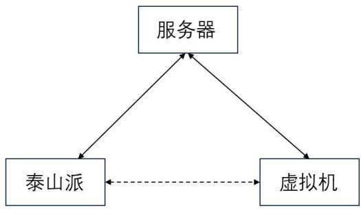
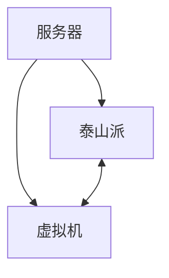
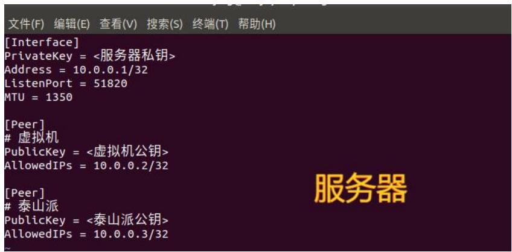
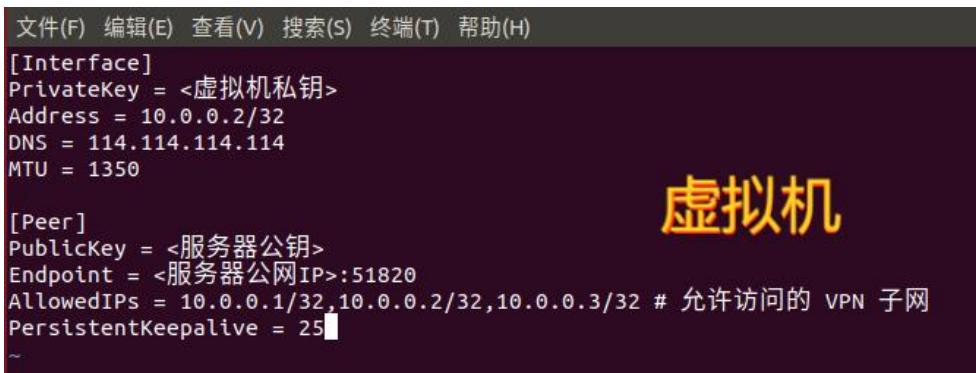
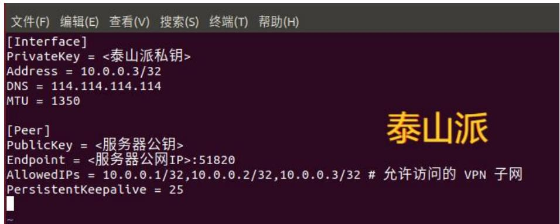
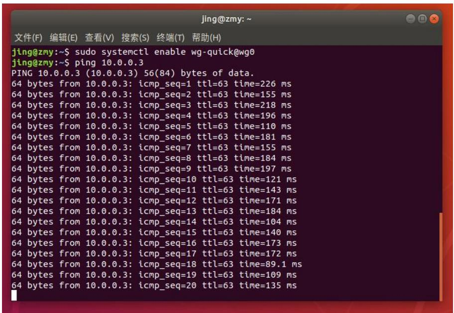
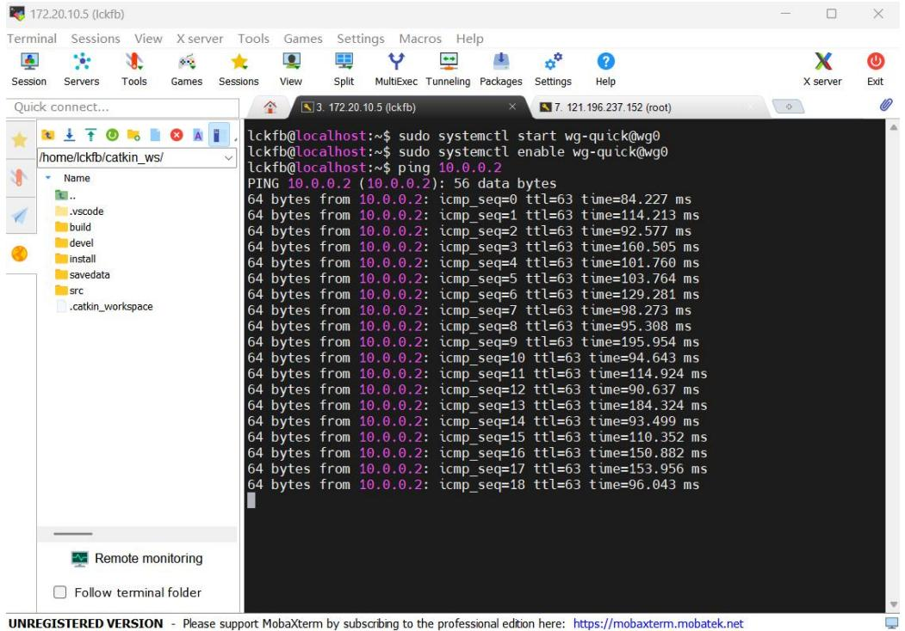
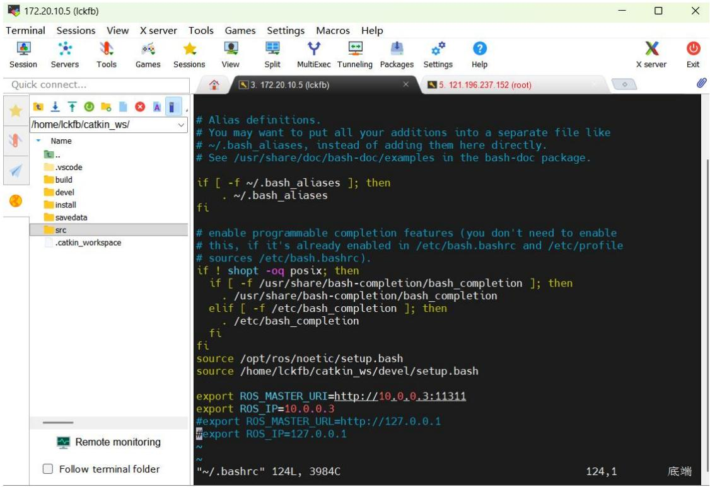
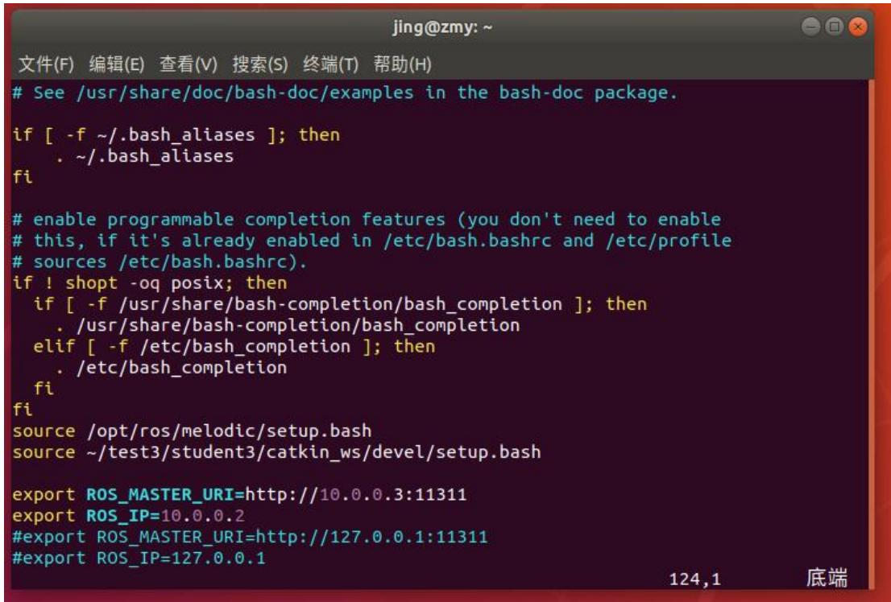
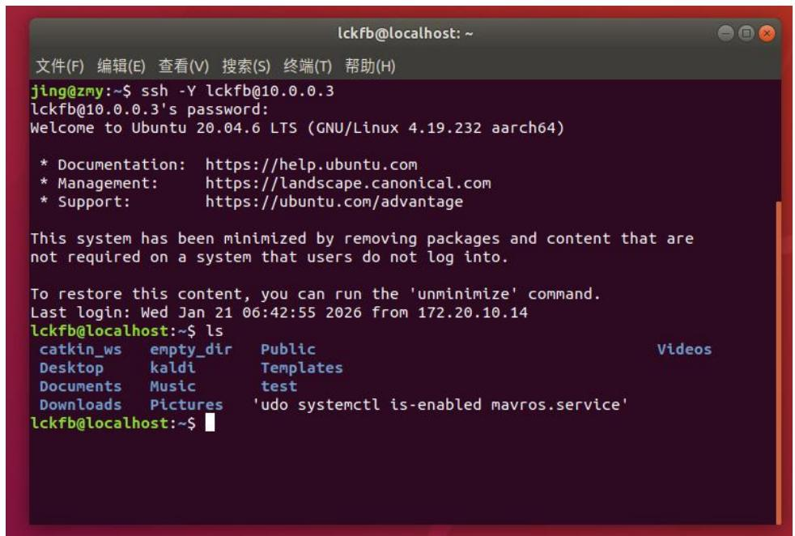

## 第八章 跨公网通信设计

## 8.1 实验一：4G配置与链路测试

## 8.1.1 实验目的

本实验旨在完成机载端在公网环境下的可靠接入与端到端数据链路验证，为后续远程图像回传提供网络基础。掌握机载 4G 通信模块的接入流程与网络状态判定方法，理解移动网络下公网地址动态变化与 NAT（网络地址转换）对连接可达性的影响，打破传统SD卡保存后离线分析的局限，实现实时回传与远程监控。构建基于 WireGuard 的虚拟专用网络（VPN）隧道，实现“跨局域网/跨公网”的逻辑同网段互联，并完成三端（服务器-机载端-地面端）的地址规划与路由策略配置学习。通过连通性与时延测试，验证 VPN 隧道的稳定性与可用带宽，形成可复用的链路测试方法与记录规范，为后续 ROS 跨主机通信与图像数据透传打下工程基础。

## 8.1.2 实验说明

传统无人机图像采集方式主要依赖本地SD卡保存，飞行任务完成后再回收分析，存在实时性差、时效性不足的问题。本实验通过搭建基于WireGuardVPN的虚拟专用网络，配合机载4G模块，使泰山派可在飞行中实时将图像数据透传回虚拟机地面站。

WireGuard 的工作机制可概括为“虚拟网卡 + 路由驱动 + 内核态加密封装”。每个节点创建虚拟接口（如 wg0）并分配同网段 VPN 地址；上层业务发往对端 VPN 地址的 IP 数据包被路由导入 wg0，由 WireGuard 在内核中完成加密与封装，再以 UDP 报文形式发送至对端公网 endpoint；对端接收后解密、解封装并将原始 IP 包注入协议栈，最终实现跨公网互通。隧道建立阶段采用公私钥身份认证与密钥协商，并以短周期会话密钥保障数据机密性与性能平衡；在移动网络等 NAT 场景下，通常需要启用保活机制以维持端口映射，降低空闲后隧道不可达的概率。工程配置中，AllowedIPs 本质上定义了“哪些目的地址应通过该隧道转发至对应对端”，从而保证多节点组网时的数据路径清晰、走向可控。上述机制共同构成本章跨公网通信的核心前提：在不改变上层应用逻辑的情况下，将公网不确定性隔离到隧道层，实现稳定、统一且端到端加密的通信底座。

在 ROS 的多机通信中，ROS\_MASTER\_URI 与 ROS\_IP 的设置分别对应“控制面”与“数据面”的关键机理：ROS\_MASTER\_URI 指定了 ROS Master（roscore）所在的地址，它负责全局命名与注册查询，即各节点启动后会先向

Master 进行注册，汇报自身的节点名、发布/订阅的话题与服务信息，并从 Master获取与之匹配的对端节点连接信息；但 Master 只承担“发现与协调”，并不转发实际话题数据。真正的数据传输发生在节点之间的点对点直连阶段：当订阅者通过 Master 获得发布者的可达地址后，会直接与发布者建立底层连接（通常为TCPROS，即基于 TCP 的流式传输，也可使用 UDPROS 等方式），完成协商后由发布者持续向订阅者推送消息，因此系统的吞吐、时延与稳定性主要取决于节点间直连链路而非 Master。ROS\_IP（或 ROS\_HOSTNAME）则决定了节点对外“自报家门”的网络地址：节点注册到 Master 时会携带自身可被其他节点访问的 IP，如果该地址填写为对端不可达的物理网卡地址（例如处于 NAT 内网的 4G 地址或另一张网卡的地址），则会出现“能看到话题列表但收不到数据”的典型现象，即控制面正常而数据面直连失败；在基于 VPN（如 WireGuard）的跨公网场景中，ROS\_IP 应填写虚拟网卡的 VPN 地址，使所有节点在同一虚拟子网内完成可达性闭环，从而保证发布者与订阅者能够通过 TCPROS 直接建立连接并稳定传输话题数据。整体而言，ROS\_MASTER\_URI 解决“去哪登记、去哪查询”，ROS\_IP 解决“别人该用哪个地址来连我”，二者共同决定跨设备ROS 系统能否从“能发现”走到“能通信”。

实验架构包括三部分：

（一）服务器（阿里云等）：充当WireGuardVPN中枢，负责中继，转发数据。  
（二）机载嵌入式系统（机载端）：通过 4G 连接互联网，并接入服务器VPN，采集数据并通过ROS节点实现图像话题发布。  
（三）虚拟机（地面端）：连接服务器 VPN，通过 rqt\_image\_view 订阅图像话题，实时接收图像数据并显示。

实验中，将在机载嵌入式系统采集图像数据，通过ROS 节点发布图像话题，地面虚拟机通过ROS订阅话题，即可实现远距离图像回传和显示。

## 8.1.3 实验步骤

步骤一：泰山派、服务器和虚拟机之间的VPN网络搭建

为了实现远程图传与数据交互，需要建立一个基于WireGuard 的VPN 网络，使得泰山派、虚拟机、服务器三者可以跨公网互通，构建一个逻辑上属于同一局域网的ROS通信环境。如图8.1所示：

flowchart

图 8.1 VPN 网络搭建

可 以 自 行 搭 建 服 务 器 ， 教 程 如 下(https://blog.csdn.net/Cai\_\_\_\_/article/details/146217318)。

在三个平台都安装 WireGuard（指令如下：1、sudo apt update，2、sudo apt installwireguard），生成服务器端密钥对（指令如下：wg genkey | tee server\_private.key| wg pubkey > server\_public.key），生成泰山派和虚拟机端密钥对（指令如下：wg genkey | tee client\_private.key | wg pubkey > client\_public.key）。分别编辑三者的/etc/wireguard/wg0.conf 文件，权限不够的要修改权限为 777。

服务器配置文件如图8.2所示：

text_image

文件(F) 编辑(E) 查看(V) 搜索(S) 终端(T) 帮助(H)
[Interface]
PrivateKey = <服务器私钥>
Address = 10.0.0.1/32
ListenPort = 51820
MTU = 1350

[Peer]
# 虚拟机
PublicKey = <虚拟机公钥>
AllowedIPs = 10.0.0.2/32

[Peer]
# 泰山派
PublicKey = <泰山派公钥>
AllowedIPs = 10.0.0.3/32

图 8.2 服务器 wg0.conf 配置

虚拟机配置文件如图8.3所示：

text_image

[Interface]
PrivateKey = <虚拟机私钥>
Address = 10.0.0.2/32
DNS = 114.114.114.114
MTU = 1350
[Peer]
PublicKey = <服务器公钥>
Endpoint = <服务器公网IP>:51820
AllowedIPs = 10.0.0.1/32,10.0.0.2/32,10.0.0.3/32 # 允许访问的 VPN 子网
PersistentKeepalive = 25
虚拟机

图 8.3 虚拟机 wg0.conf 配置

泰山派配置文件如图8.4所示：

text_image

文件(F) 编辑(E) 查看(V) 搜索(S) 终端(T) 帮助(H)
[Interface]
PrivateKey = <泰山派私钥>
Address = 10.0.0.3/32
DNS = 114.114.114.114
MTU = 1350
[Peer]
PublicKey = <服务器公钥>
Endpoint = <服务器公网IP>:51820
AllowedIPs = 10.0.0.1/32,10.0.0.2/32,10.0.0.3/32 # 允许访问的 VPN 子网
PersistentKeepalive = 25
泰山派

图 8.4 泰山派 wg0.conf 配置

在 WireGuard 中，每台设备都必须有一个唯一的虚拟的内网 IP 地址，用于设备间通信。（本实验设置的是服务器 10.0.0.1，虚拟机是 10.0.0.2，泰山派是10.0.0.3）。Address 是 WireGuard 虚拟局域网内的地址，要求在同一个网段，不能重复。

启动 WireGuard 服务（1、sudo systemctl start wg-quick@wg0，2、sudo systemctlenable wg-quick@wg0）。测试 VPN 连接情况，在三台设备上分别执行 ping 10.0.0.1（测试能否 ping 通服务器），ping 10.0.0.2（测试虚拟机），ping10.0.0.3（测试泰山派）。确保三者之间的网络连通正常。

虚拟机ping通泰山派，如图 8.5所示：

text_image

jing@zmy: ~
文件(F)  编辑(E)  查看(V)  搜索(S)  终端(T)  帮助(H)
jing@zmy:~$ sudo systemctl enable wg-quick@wg0
jing@zmy:~$ ping 10.0.0.3
PING 10.0.0.3 (10.0.0.3) 56(84) bytes of data.
64 bytes from 10.0.0.3: icmp_seq=1 ttl=63 time=226 ms
64 bytes from 10.0.0.3: icmp_seq=2 ttl=63 time=155 ms
64 bytes from 10.0.0.3: icmp_seq=3 ttl=63 time=218 ms
64 bytes from 10.0.0.3: icmp_seq=4 ttl=63 time=196 ms
64 bytes from 10.0.0.3: icmp_seq=5 ttl=63 time=110 ms
64 bytes from 10.0.0.3: icmp_seq=6 ttl=63 time=181 ms
64 bytes from 10.0.0.3: icmp_seq=7 ttl=63 time=155 ms
64 bytes from 10.0.0.3: icmp_seq=8 ttl=63 time=184 ms
64 bytes from 10.0.0.3: icmp_seq=9 ttl=63 time=197 ms
64 bytes from 10.0.0.3: icmp_seq=10 ttl=63 time=121 ms
64 bytes from 10.0.0.3: icmp_seq=11 ttl=63 time=143 ms
64 bytes from 10.0.0.3: icmp_seq=12 ttl=63 time=171 ms
64 bytes from 10.0.0.3: icmp_seq=13 ttl=63 time=184 ms
64 bytes from 10.0.0.3: icmp_seq=14 ttl=63 time=104 ms
64 bytes from 10.0.0.3: icmp_seq=15 ttl=63 time=140 ms
64 bytes from 10.0.0.3: icmp_seq=16 ttl=63 time=173 ms
64 bytes from 10.0.0.3: icmp_seq=17 ttl=63 time=172 ms
64 bytes from 10.0.0.3: icmp_seq=18 ttl=63 time=89.1 ms
64 bytes from 10.0.0.3: icmp_seq=19 ttl=63 time=109 ms
64 bytes from 10.0.0.3: icmp_seq=20 ttl=63 time=135 ms

图 8.5 虚拟机 ping 泰山派

WireGuard 连接稳定性测试结果来看，网络连通性表现良好，对10.0.0.3执行 ping 操作，20 次 ICMP 探测全部成功响应，无丢包情况，证明 VPN 隧道已稳定建立且数据传输链路通畅。延迟整体处于中等区间，波动范围在 89.1ms至 226ms 之间，平均延迟约 150 ms，虽存在一定起伏，但未出现持续高延迟或超时现象，满足日常办公与轻量业务需求。TTL 值稳定为 63，符合 Linux 节点的网络特征，进一步验证了目标节点的在线状态与路由配置的正确性。

泰山派ping通虚拟机，如图 8.6所示：

text_image

lckfb@localhost:~$ sudo systemctl start wg-quick@wg0
lckfb@localhost:~$ sudo systemctl enable wg-quick@wg0
lckfb@localhost:~$ ping 10.0.0.2
PING 10.0.0.2 (10.0.0.2): 56 data bytes
64 bytes from 10.0.0.2: icmp_seq=0 ttl=63 time=84.227 ms
64 bytes from 10.0.0.2: icmp_seq=1 ttl=63 time=114.213 ms
64 bytes from 10.0.0.2: icmp_seq=2 ttl=63 time=92.577 ms
64 bytes from 10.0.0.2: icmp_seq=3 ttl=63 time=160.505 ms
64 bytes from 10.0.0.2: icmp_seq=4 ttl=63 time=101.760 ms
64 bytes from 10.0.0.2: icmp_seq=5 ttl=63 time=103.764 ms
64 bytes from 10.0.0.2: icmp_seq=6 ttl=63 time=129.281 ms
64 bytes from 10.0.0.2: icmp_seq=7 ttl=63 time=98.273 ms
64 bytes from 10.0.0.2: icmp_seq=8 ttl=63 time=95.308 ms
64 bytes from 10.0.0.2: icmp_seq=9 ttl=63 time=195.954 ms
64 bytes from 10.0.0.2: icmp_seq=10 ttl=63 time=94.643 ms
64 bytes from 10.0.0.2: icmp_seq=11 ttl=63 time=114.924 ms
64 bytes from 10.0.0.2: icmp_seq=12 ttl=63 time=90.637 ms
64 bytes from 10.0.0.2: icmp_seq=13 ttl=63 time=184.324 ms
64 bytes from 10.0.0.2: icmp_seq=14 ttl=63 time=93.499 ms
64 bytes from 10.0.0.2: icmp_seq=15 ttl=63 time=110.352 ms
64 bytes from 10.0.0.2: icmp_seq=16 ttl=63 time=150.882 ms
64 bytes from 10.0.0.2: icmp_seq=17 ttl=63 time=153.956 ms
64 bytes from 10.0.0.2: icmp_seq=18 ttl=63 time=96.043 ms

图 8.6 泰山派 ping 虚拟机

WireGuard 连接稳定性测试结果显示，网络连通性表现优异，对10.0.0.2执行 ping 操作，19 次 ICMP 探测全部成功响应，无丢包情况，证明 VPN 隧道已稳定建立且数据传输链路通畅。延迟整体处于中等区间，波动范围在 84.227ms 至 195.954ms 之间，平均延迟约 130ms，虽存在一定起伏，但未出现持续高延迟或超时现象，满足远程开发与轻量数据传输需求。TTL 值稳定为 63，符合 Linux 节点的网络特征，进一步验证了目标节点的在线状态与路由配置的正确性。sudo wg 查看 WireGuard 状态时，latest handshake 时间正常更新。结合开机自启命令的成功执行，可判定当前 WireGuard 连接具备基础稳定性。

注意：服务器防火墙要允许 51820/UDP 端口开放，泰山派和虚拟机都需要可以访问公网（如连接校园网、4G 网、WiFi 等）。

步骤二：配置ROS主机环境变量

使泰山派（10.0.0.3）作为主控机，虚拟机（10.0.0.2）作为从机，配置两者的\~/.bashrc 文件。

在 泰 山 派 里 增 加 两 行 指 令 如 下 ： 1 、 export ROS\_MASTER\_URI =

http://10.0.0.3:11311，2、export ROS\_IP = 10.0.0.3。如图 8.7 所示：

text_image

# Alias definitions.
# You may want to put all your additions into a separate file like
# ~/.bash_aliases, instead of adding them here directly.
# See /usr/share/doc/bash-doc/examples in the bash-doc package.

if [ -f ~/.bash_aliases ]; then
    . ~/.bash_aliases

fi

# enable programmable completion features (you don't need to enable
# this, if it's already enabled in /etc/bash.bashrc and /etc/profile
# sources /etc/bash.bashrc).
if ! shopt -oq posix; then
    if [ -f /usr/share/bash-completion/bash_completion ]; then
    . /usr/share/bash-completion/bash_completion
    elif [ -f /etc/bash_completion ]; then
    . /etc/bash_completion
    fi

fi

source /opt/ros/noetic/setup.bash
source /home/lckfb/catkin_ws/devel/setup.bash

export ROS_MASTER_URI=http://10.0.0.3:11311
export ROS_IP=10.0.0.3

#export ROS_MASTER_URL=http://127.0.0.1
#export ROS_IP=127.0.0.1

~~/.bashrc" 124L, 3984C  124,1 底端

图 8.7 泰山派.bashrc 文件

在 虚 拟 机 里 增 加 两 行 指 令 如 下 ： 1 、 export ROS\_MASTER\_URI =http://10.0.0.3:11311，2、export ROS\_IP = 10.0.0.2。如图 8.8 所示：

text_image

# See /usr/share/doc/bash-doc/examples in the bash-doc package.
if [ -f ~/.bash_aliases ]; then
    . ~/.bash_aliases
fi

# enable programmable completion features (you don't need to enable
# this, if it's already enabled in /etc/bash.bashrc and /etc/profile
# sources /etc/bash.bashrc).
if ! shopt -oq posix; then
    if [ -f /usr/share/bash-completion/bash_completion ]; then
    . /usr/share/bash-completion/bash_completion
    elif [ -f /etc/bash_completion ]; then
    . /etc/bash_completion
fi

fi

source /opt/ros/melodic/setup.bash
source ~/test3/student3/catkin_ws/devel/setup.bash

export ROS_MASTER_URI=http://10.0.0.3:11311
export ROS_IP=10.0.0.2
#export ROS_MASTER_URI=http://127.0.0.1:11311
#export ROS_IP=127.0.0.1
124,1 底端

图 8.8 虚拟机.bashrc 文件

其中 ROS\_MASTER\_URL 指向泰山派的 IP，说明 Master 在泰山派，ROS\_IP

告诉自己是谁。写在.bashrc 中的内容，每次新开一个终端都会自动生效。

## 步骤三：虚拟机远程连接泰山派

1. 在虚拟机终端输入 ssh -Y lckfb@10.0.0.3，其中“-Y”的作用是在建立 SSH连接的同时，启用 X11 图形界面转发功能，允许在远程主机上运行图形界面程序，这些程序的窗口会通过 SSH 隧道传输到你的本地主机  
2.输入密码：lckfb 回车，可以看到虚拟机已经可以远程连接泰山派。如图8.9 所示：

text_image

lckfb@localhost: ~
文件(F)  编辑(E)  查看(V)  搜索(S)  终端(T)  帮助(H)
jing@zmy:~$ ssh -Y lckfb@10.0.0.3
lckfb@10.0.0.3's password:
Welcome to Ubuntu 20.04.6 LTS (GNU/Linux 4.19.232 aarch64)
* Documentation: https://help.ubuntu.com
* Management: https://landscape.canonical.com
* Support: https://ubuntu.com/advantage
This system has been minimized by removing packages and content that are
not required on a system that users do not log into.
To restore this content, you can run the 'unminimize' command.
Last login: Wed Jan 21 06:42:55 2026 from 172.20.10.14
lckfb@localhost:~$ ls
catkin_ws empty_dir Public Videos
Desktop kaldi Templates
Documents Music test
Downloads Pictures 'udo systemctl is-enabled mavros.service'
lckfb@localhost:~$

图8.9 虚拟机远程连接泰山派

在虚拟机端执行携 X11 转发的 SSH 远程登录命令 ssh -Y lckfb@10.0.0.3，成功实现对泰山派开发板的远程接入。终端回显的 Ubuntu 20.04.6 LTS 系统欢迎信息与 lckfb@linux:\~\$命令行提示符，直接印证了本次 SSH 连接的身份认证通过、网络通信链路有效。该远程连接不仅支持基础的文件系统交互操作，可通过 ls 等指令查看泰山派本地目录结构，更依托-Y 参数启用的 X11 图形转发功能，为后续在虚拟机端实时渲染泰山派摄像头采集的高帧率图片流奠定了通信基础，充分体现了 WireGuard 虚拟专用网络在异构设备间实现资源访问与图形化可视化交互的技术价值。