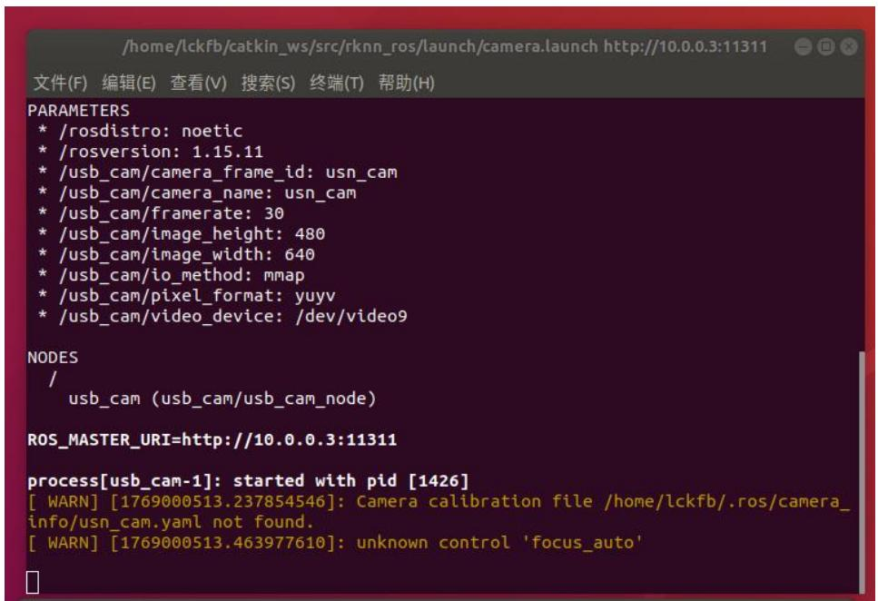
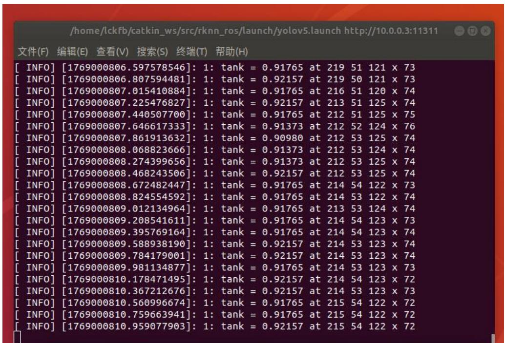
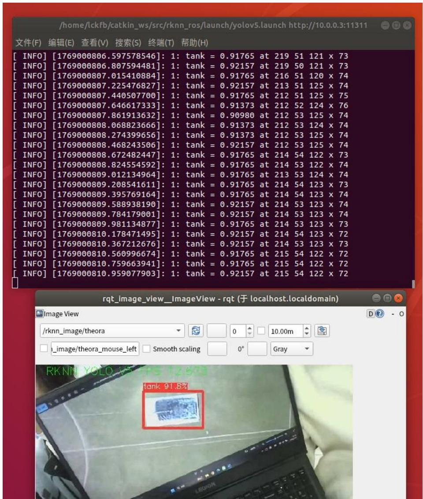

## 8.2 实验二：4G图传功能验证

## 8.2.1 实验目的

本实验旨在已建立的 4G 接入与 WireGuardVPN 隧道基础上，搭建并验证机载摄像头图像从采集、ROS 话题发布到跨公网传输、地面端订阅显示的端到端数据通路，系统性评估公网环境下图传业务的可达性、时延、丢包与画面连续性等关键指标，并沉淀可复用的图像回传配置规范，为外场任务中的远程监控与调试提供工程依据。

## 8.2.2 实验说明

本实验面向跨公网实时图传，对“4G 接入 +WireGuardVPN”通信底座在端到端图像回传场景下的可用性进行验证，系统由服务器端隧道汇聚转发、机载端图像采集与 ROS 话题发布、地面端通过 VPN 订阅显示三部分组成。依托已搭建的 VPN网络（服务器、泰山派、虚拟机三者互通），在泰山派上运行摄像头驱动节点，将实时图片流发布为 ROS 图像话题。在地面虚拟机端，通过配置相同的 ROS Master（指向泰山派），订阅该图像话题，并使用图像可视化工具（如rqt\_image\_view 节点）实时显示摄像头画面。该实验可在地面状态下验证效果，重点验证4G公网环境下的网络可达性与实时图传能力，是无人机跨区域、超视距任务执行的重要基础实验。

## 8.2.3 实验步骤

## 步骤一：启动泰山派端摄像头与图像处理节点

1 、 泰 山 派 端 启 动 USB 摄 像 头 节 点 roslaunch rknn\_ros camera.launchdevice:=video9，如图 8.10 所示：

text_image

/home/lckfb/catkin_ws/src/rknn_ros/launch/camera.launch http://10.0.0.3:11311
文件(F)  编辑(E)  查看(V)  搜索(S)  终端(T)  帮助(H)
PARAMETERS
* /rosdistro: noetic
* /rosversion: 1.15.11
* /usb_cam/camera_frame_id: usn_cam
* /usb_cam/camera_name: usn_cam
* /usb_cam/framerate: 30
* /usb_cam/image_height: 480
* /usb_cam/image_width: 640
* /usb_cam/io_method: mmap
* /usb_cam/pixel_format: yuyv
* /usb_cam/video_device: /dev/video9
NODES
/
    usb_cam (usb_cam/usb_cam_node)
ROS_MASTER_URI=http://10.0.0.3:11311
process[usb_cam-1]: started with pid [1426]
[ WARN] [1769000513.237854546]: Camera calibration file /home/lckfb/.ros/camera_info/usn_cam.yaml not found.
[ WARN] [1769000513.463977610]: unknown control 'focus_auto'

图8.10 启动摄像头节点

2、泰 山 派 启 动 图 像 处 理 节 点 roslaunch rknn\_ros yolov5.launchchip\_type:=RK356X。如图 8.11 所示：

text_image

/home/lckfb/catkin_ws/src/rknn_ros/launch/yolov5.launch http://10.0.0.3:11311
文件(F)  编辑(E)  查看(V)  搜索(S)  终端(T)  帮助(H)
[ INFO] [1769000806.597578546]: 1: tank = 0.91765 at 219 51 121 x 73
[ INFO] [1769000806.807594481]: 1: tank = 0.92157 at 219 50 121 x 73
[ INFO] [1769000807.015410884]: 1: tank = 0.91765 at 216 51 120 x 74
[ INFO] [1769000807.225476827]: 1: tank = 0.92157 at 213 51 125 x 74
[ INFO] [1769000807.440507700]: 1: tank = 0.91765 at 212 51 125 x 75
[ INFO] [1769000807.646617333]: 1: tank = 0.91373 at 212 52 124 x 76
[ INFO] [1769000807.861913632]: 1: tank = 0.90980 at 212 53 125 x 74
[ INFO] [1769000808.068823666]: 1: tank = 0.91373 at 212 53 124 x 74
[ INFO] [1769000808.274399656]: 1: tank = 0.91373 at 212 53 125 x 74
[ INFO] [1769000808.468243506]: 1: tank = 0.92157 at 212 53 125 x 74
[ INFO] [1769000808.672482447]: 1: tank = 0.91765 at 214 54 122 x 73
[ INFO] [1769000808.824554592]: 1: tank = 0.91765 at 214 53 122 x 74
[ INFO] [1769000809.012134964]: 1: tank = 0.91765 at 213 53 124 x 74
[ INFO] [1769000809.208541611]: 1: tank = 0.91765 at 214 54 123 x 73
[ INFO] [1769000809.395769164]: 1: tank = 0.91765 at 214 54 123 x 74
[ INFO] [1769000809.588938190]: 1: tank = 0.92157 at 214 53 123 x 74
[ INFO] [1769000809.784179001]: 1: tank = 0.92157 at 214 53 123 x 74
[ INFO] [1769000809.981134877]: 1: tank = 0.91765 at 214 53 123 x 73
[ INFO] [1769000810.178471495]: 1: tank = 0.92157 at 214 54 123 x 72
[ INFO] [1769000810.367212676]: 1: tank = 0.92157 at 214 53 123 x 73
[ INFO] [1769000810.560996674]: 1: tank = 0.91765 at 215 54 122 x 72
[ INFO] [1769000810.759663941]: 1: tank = 0.91765 at 215 54 122 x 72
[ INFO] [1769000810.959077903]: 1: tank = 0.92157 at 215 54 122 x 72

图8.11 启动图像识别节点

系统成功加载摄像头设备通过 ROS 框架对图片流进行发布，同时目标检测节点（YOLOv5）正常运行并持续输出检测结果日志，表明摄像头数据已被正确采集并参与实时处理。

步骤二：虚拟机端接收并显示实时图像数据

在地面端虚拟机中，通过 ROS 图像可视化工具（rqt\_image\_view）订阅泰山派发布的图像话题，成功实时显示来自机载摄像头的画面。如图8.12所示：

text_image

/home/lckfb/catkin_ws/src/rknn_ros/launch/yolov5.launch http://10.0.0.3:11311
文件(F) 编辑(E) 查看(V) 搜索(S) 终端(T) 帮助(H)
[ INFO] [1769000806.597578546]: 1: tank = 0.91765 at 219 51 121 x 73
[ INFO] [1769000806.807594481]: 1: tank = 0.92157 at 219 50 121 x 73
[ INFO] [1769000807.015410884]: 1: tank = 0.91765 at 216 51 120 x 74
[ INFO] [1769000807.225476827]: 1: tank = 0.92157 at 213 51 125 x 74
[ INFO] [1769000807.440507700]: 1: tank = 0.91765 at 212 51 125 x 75
[ INFO] [1769000807.646617333]: 1: tank = 0.91373 at 212 52 124 x 76
[ INFO] [1769000807.861913632]: 1: tank = 0.90980 at 212 53 125 x 74
[ INFO] [1769000808.068823666]: 1: tank = 0.91373 at 212 53 124 x 74
[ INFO] [1769000808.274399656]: 1: tank = 0.91373 at 212 53 125 x 74
[ INFO] [1769000808.468243506]: 1: tank = 0.92157 at 212 53 125 x 74
[ INFO] [1769000808.672482447]: 1: tank = 0.91765 at 214 54 122 x 73
[ INFO] [1769000808.824554592]: 1: tank = 0.91765 at 214 53 122 x 74
[ INFO] [1769000809.012134964]: 1: tank = 0.91765 at 213 53 124 x 74
[ INFO] [1769000809.208541611]: 1: tank = 0.91765 at 214 54 123 x 73
[ INFO] [1769000809.395769164]: 1: tank = 0.91765 at 214 54 123 x 74
[ INFO] [1769000809.588938190]: 1: tank = 0.92157 at 214 53 123 x 74
[ INFO] [1769000809.784179001]: 1: tank = 0.92157 at 214 53 123 x 74
[ INFO] [1769000809.981134877]: 1: tank = 0.91765 at 214 53 123 x 73
[ INFO] [1769000810.178471495]: 1: tank = 0.92157 at 214 54 123 x 72
[ INFO] [1769000810.367212676]: 1: tank = 0.92157 at 214 53 123 x 73
[ INFO] [1769000810.560996674]: 1: tank = 0.91765 at 215 54 122 x 72
[ INFO] [1769000810.759663941]: 1: tank = 0.91765 at 215 54 122 x 72
[ INFO] [1769000810.959077903]: 1: tank = 0.92157 at 215 54 122 x 72

rqt_image_view_ImageView - rqt (于 localhost.localdomain)
Image View
/rknn_image/theora
    D ? - O
    □_image/theora_mouse_left   Smooth scaling    □O°   Gray

RKNN YOLO Views / RKNN image / Tank: 
      □_image/theora_mouse_left   Smooth scaling    □O°   Gray

图8.12 启动图像可视化工具

从显示结果可以清晰观察到摄像头采集的现场图像及目标检测框，且画面连续、延迟较小，表明在 4G 公网环境下，虚拟机端能够稳定接收并实时显示泰山派回传的图片数据，4G 图传功能验证成功。