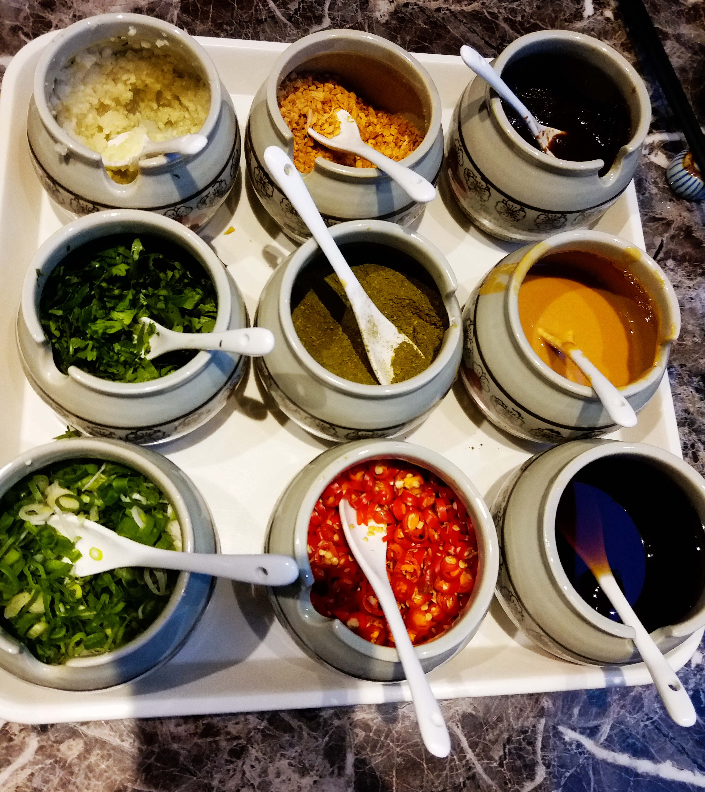
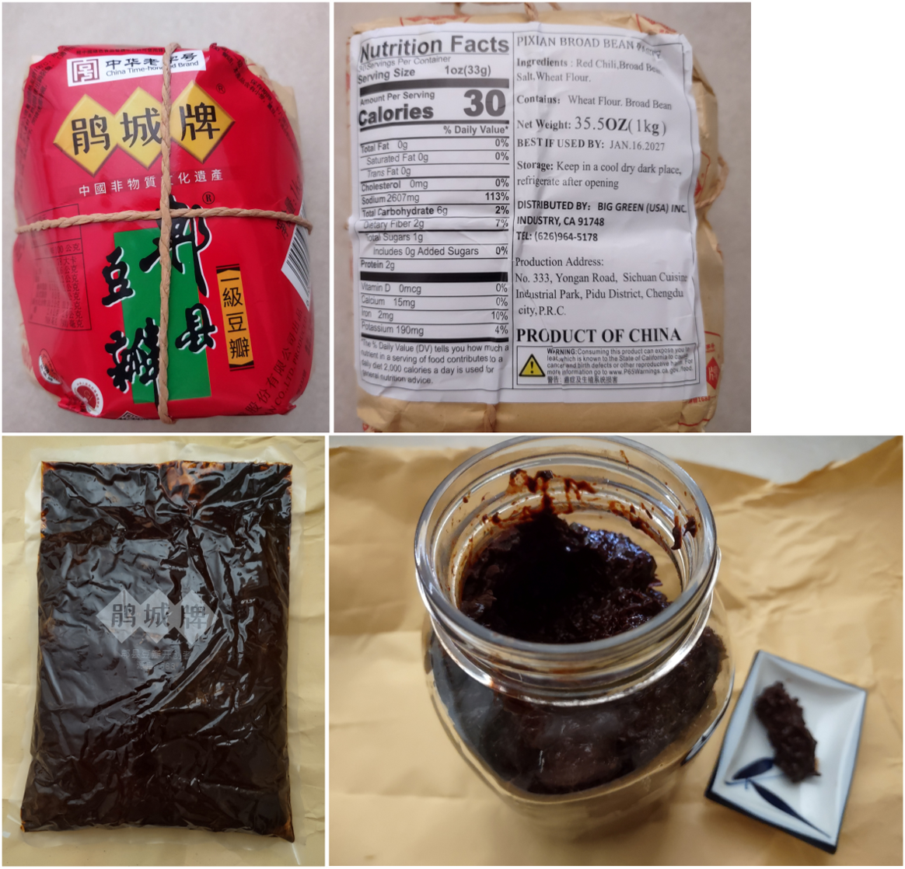
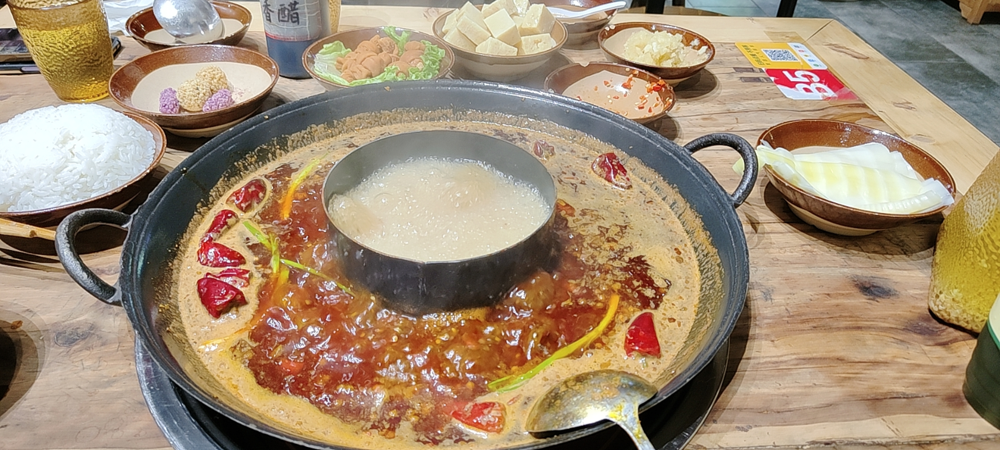
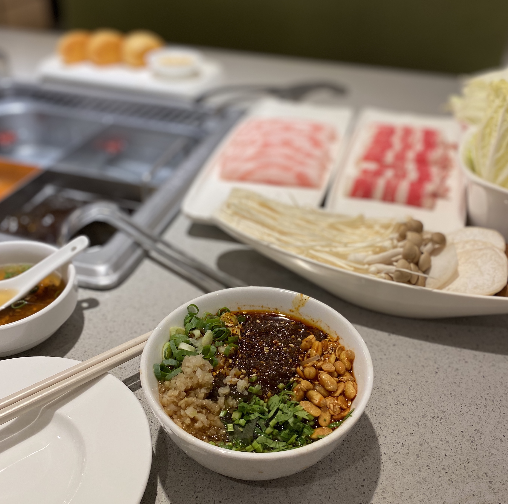

# 我最喜欢的越吃越上头的川渝火锅

## 川渝火锅 --- 在底料极致浓烈的基础上，不断地做味觉与情绪的加法。

如果要在无数种宵夜和聚餐选项里选出一个“绝对首选”，我的答案永远只有一个——川渝的老火锅。

广东的打边炉的确鲜美，老北京的铜锅涮肉也自有一番清雅风味，但它们总让你觉得太过于斯文。而川渝火锅不同，只要它一上桌，那种极度张扬的压倒性气场是其他任何食物都比不了的。你根本没有办法去忽略它：服务员端过来一口沉甸甸的铸铁锅，里边躺着一大块像山峰一样凝固住的牛油，周围铺满了红亮刺眼的干辣椒和青褐色的花椒。火苗往锅底一舔，牛油边缘开始慢慢融化，接着整锅汤底咕噜咕噜地翻滚起来。一股几乎带着实体攻击力、极度浓烈的辛香热气，会直接冲撞进你的鼻腔。你甚至连筷子都还没掰开，口水就已经在疯狂分泌了。这就叫不讲理的统治力。

其实好多人对川渝火锅有个刻板印象，觉得它就是单纯在用“辣”惩罚人，这绝对是个巨大的误会。在这口锅里，“辣”只是让你卸下防备的敲门砖，真正抓人的是它近乎诡异的丰富层次感。最先扑杀过来的是牛油那厚重霸道的醇香，紧接着干辣椒段在沸油中逼出的焦香味开始蔓延。等你真正把一片裹着红油的肉扫进嘴里，花椒潜伏已久的麻劲才会在你的舌尖上突然后知后觉地跳跃起来。这就像是一场根本停不下来的味觉过山车。特别是在滴水成冰的严寒冬夜，外头冷风呜呜地刮，三五好友往那口沸腾的冒烟红汤边上一围，即使是社交恐惧症患者，几杯扎啤下肚、几筷子毛肚落胃，也能满头大汗地拉开话匣子。它不仅仅是一顿饭，它简直就是一个超级情绪放大器，能轻松把所有的社交距离感融化在牛油里。

## 源自泥泞与江风的草根基因

*图1：重庆城市夜景。潮湿的江风和坎坷起伏的地形，催生出了这种最野性、最随性的饮食智慧。*

聊起这东西的来头，老人们最常念叨的还是“重庆江北码头说”。你大可以闭上眼睛，想象一下那个黑白滤镜里的旧时光画面：江风凛冽刺骨，雾气重得衣服都能拧出水来。那些光着膀子、肌肉结实的纤夫和挑夫们，在江边咬着牙干了一整天的极度重体力活，关节里全是湿寒。手里就几文钱，想吃顿饱饭同时又得能逼出体内的寒气，怎么办呢？

生活逼出了最粗糙但也最惊艳的智慧。他们跑到屠宰场，用极为低廉的价格买下那些达官贵人们碰都不碰的牛杂、边角料和废弃下水。在江边随便搭几块石头，支起一口缺了口的铁锅，加上江水，大把大把地撒进最便宜但味道浓烈的辣椒、花椒和老姜块去压制腥味。一群素不相识的苦力，也不需要讲什么座次礼仪，蹲在烂泥地里，各占一口锅的边缘位置，把自己那份内脏烫到半熟，烫舌头般地吞进胃里。这种完全出于生存本能、原始又粗线条的吃法，偏偏就成了今天火通大江南北的川渝火锅的前身。

身处西南这片被群山锁住的盆地，常年看不见太阳，到了冬天，那种湿冷是像针一样能扎进骨头缝里的。一锅滚烫的、重油重麻重辣的烈性食物，天生就是抗击这种郁结气候的良药。后来随着时间推移，这口大铁锅从江边被搬进街巷小店。城里的讲究人虽然把它改良了——粗铁换成了精致的小黄铜锅，香料用得更精细了，但那带劲的火爆底色被毫无保留地继承了下来。

我迷恋川渝火锅，正是因为它身上这层洗都洗不掉的“草根”底气。它的骨子里始终流淌着市井泥土气和坦荡的江湖气。哪怕现在的火锅连锁店开进了一线城市最金碧辉煌的顶配商场，哪怕服务员都打上了领结，只要那盆红汤在桌子上掀起怒火冲天的滚浪，它的核心灵魂依然是当年那个在江北码头大声划拳、大口闷肉的粗粝嗓音。不装，不端着，随意又鲜活。

## 翻滚在红油里的商业机密

*图2：香料之间的化学反应，决定了一家火锅店熬不过三个月，还是能开三十年。*

*图3：如果没有这勺经过长时间日晒夜露发酵的豆瓣酱，整锅汤底就会散架。*

真正的火锅狂魔去新店试水，菜还没上齐，只要凑近锅边深吸一口气，这家店是留还是淘汰，心里就已经有了定论。那锅疯狂涌动着血色泡沫的红汤，绝对是火锅世界里最大的底牌。

很多从来没去过西南的朋友，第一次看见九宫格里像汪洋大海一样漂浮的大葱和密密麻麻的干红指甲辣椒，筷子悬在半空都在发抖。但只要你硬着头皮，把第一片挂着油珠淌着汁的薄片毛肚送进嘴里，多半就会经历一次世界观的重塑——从极端抗拒走向无可救药的疯狂上头。

一锅绝佳的老火锅汤底，绝对不会用那种简单粗暴的死辣来折磨食客。在厨师几十个小时的熬制里，隐藏着精密的风味方程式。在这套体系里，首功当推大量的纯正牛油。植物油是挂不住味道的，只有浓重的动物油脂才能死死地吸附在食材表面，让任何素淡的蔬菜都沾染上肉的醇厚润滑。接着是提供颜色与底层酱香的源头——被称为“川菜之魂”的郫县豆瓣。

辣椒在前方负责摧枯拉朽的冲锋和痛觉体验，而茂县的花椒则负责在背后打游击偷袭，它的柑橘清香会在你猝不及防时释放微弱但持久的麻痹电流。除此之外，八角、肉豆蔻、小茴香、丁香、砂仁等几十味中药材和香料在其中充当着“和事佬”，它们的高温碰撞把所有尖锐刺人的生硬辣味修饰得婉转曲折、圆润且回味无穷。

你刚开这口锅时，闻到的是让人眼晕的浓烈油脂焦香。等几波雪花肥牛和鲜鸭肠在里面剧烈翻滚后，食材本身的蛋白质氨基酸大量溶解，原本狂暴的汤底会变得极度浓白醇厚。越往后吃，汤底的味道就越像厚积爆发的火山。用最极致猛烈的香料火力去驯化食材最原始的野性，这是西南地区人民摸索出且绝不外传的独门哲学。

## 赋予下水与内脏的二次生命

.jpg)
*图4：吃到最后，能从锅底的犄角旮旯里捞出一片早已被牛油煮得粉身碎骨还要入口即化的土豆片，那才算是个中高手。*

但是，哪怕你的汤底有着起死回生的功力，如果没有旗鼓相当的食材去接招，这也是一锅无人问津的红盐水。

在吃川渝火锅的法则里，平时那些被视作高级货的高端肥牛卷或羊肉卷，大都是排不上号的配角。真正的压轴大戏，完全属于那些在很多菜系里根本上不了台面的内脏。

“老三篇”——毛肚、鸭肠和黄喉。点吃它们并非只是为了填饱肚子，更重要的是它们能在一瞬间为你提供极致的牙齿快感。夹着那一片在呼吸间就可能老得嚼不动的鲜毛肚，“七上八下”，在沸汤里急停急落。算准了那十几秒的黄金窗口期，等它表面的小肉刺根根分明地倒竖起来，立刻手起刀落拽进碗里，咬下去脆生生地爆开汁水，享受的就是那一秒钟的极致快感。一条半米长的剔透鸭肠，在红油锅里抖散开来，刚刚微微卷曲便火速捞起，送进嘴里的弹牙感觉堪称解压顶级利器。

连这下锅的位置，在常年征战火锅桌的人眼里，也全是大智慧。最传统的九宫格本身是一口毫无隔断的大白铁锅，那井字形的铁片是为了创造出不同梯度的温度带。中间那一个正对炉火的格子火势最凶猛，是专门为了这些脆弱的毛肚鸭肠准备的“快车道”。旁边的十字格水花冒得没那么夸张，适合扔进去那些切得极厚的大片老肉、麻辣排骨这种需要用中火笃入味的重量级选手。至于最边缘的四个角角框框，温度常常只是小口地冒着泡泡，那是留给极度柔软和需要慢慢煨煮的极客食材的舞台——大块鸭血、绵软的猪脑花、需要彻底煮融的耙芋头，丢在那里不用管，半小时后再去验收。

说到给这口锅收尾的蘸料，地道的当地食客绝不会去碰什么粘稠的麻酱。配这红油锅的规矩就是极端的克制：半倒满的纯正香油，一大勺捣得细细的生蒜泥，再凭个人喜好点缀一把香葱一把香菜。这小小的油碟，主要任务根本不是加咸，而是利用香油特有的属性包裹住刚捞出来的滚烫食物，用生蒜杀灭油脂的腻感，顺便保护你脆弱的胃黏膜免遭辣椒暴徒的摧残。要是这时候能腾出手再猛喝上一大口加了足量碎冰块的唯怡豆奶或者是微甜解腻的冰粉，口腔瞬间完成从爆裂火山到深海冰川的无缝切换，这股舒爽足够让人彻底沦陷。

## 一口锅能有多大的变形记

*图5：衍生出品种繁多、适应各种奇怪场景的吃辣方式，把味蕾的边界扩得没边。*

这股从巴蜀地界刮出来的风暴，早已经冲破了单单一桌一锅的呆板规矩，生猛地长出了一个让人眼界大开的“麻辣王国”。

它不再逼迫你必须凑够四个以上的狐朋狗友才能组局。想解馋但孤身一人？下班拐进一家冒菜店，随便挑一盆素菜丸子，后厨二话不说直接在满是香料的滚锅里给你冒好。端出来的时候，上面漂着厚厚的一层红油，撒着喷香甚至还在呲拉冒油的芝麻粒，一人食也能吃出千军万马的架势。

夜市里逛累了？随便找个推着小车、白炽灯泡下热气腾腾的麻辣烫或者串串香摊位。在巨大的方形铁桶前站定，看老板行云流水地抽出竹签，把煮熟了的海带结或是香肠扔进搪瓷碗，舀上一勺泛黄的汤底。蹲在马路牙子上稀里哗啦一扫而空，那种油腻真实的生活烟火气，比坐在高级旋转餐厅里吃牛排显得带劲一百倍。

夏天三十多度连命都是空调给的，怎么吃辣？冷锅串串和成都钵钵鸡横空出世。菜品预先煮熟后，扔进那盆极度浓郁、沉淀着红油和芝麻粒的冷却底料里长时间泡着入味。走过去抓上一把滴着红油的签子直接在大马路上啃。这些变种直接告诉你：只要你爱那一口味道，无论你是一个人还是一群人，兜里是二十块还是二百块，它都能全方位无死角地把你那点空虚的味蕾填得死死的。

## 引路人与商业时代的狂欢

*图6：把四川人眼里的日常便饭，推向了全国甚至全世界食客的桌面。*

要想聊整个大环境的发展，就不得不提像海底捞这样将触角伸向大江南北甚至是海外的大型连锁。抛开对服务本身的热烈争论不谈，它真真切切地扮演了一个不容抹杀的历史角色——将这股暴力的地域性味道用更为温和妥帖的商业手段给驯化，并顺利推销了出去。

它几乎是在不遗余力地抹平吃火锅的心理门槛。那些对重油重辣充满顾虑的人，那些看到辣椒就开始肠胃抗议的食客，还有那些绝不想去拥挤老店里弄脏衣服的都市白领们，它为这批人打造了一个极其庞大、毫无压力的超级庇护所。那里有明亮干净的等候区，还有绝不会出错的微辣番茄锅底，哪怕你完全不懂火锅怎么吃，也有热情的人教你调配小料。

成千上万的人最开始就是坐在这样的环境里，小心翼翼地拿漏勺学着涮毛肚。他们弄懂了怎么搭配蒜泥耗油，慢慢习惯了那一丝残存的辣味。有趣的变化在于，随着味觉耐受度被逐渐撑开，很多人开始不满足于这种被重重保护的安全感。他们带着极强的好奇心去探索街巷里隐藏更深的“黑暗料理”，一头扎进那些辣得让人失去表情管理能力的土灶面前找寻最猛烈的刺激。在这场浩大的味觉升级战役里，商业巨舰无疑担当了最出色的启蒙大师，源源不断地给这个老口味输送难以计数的狂热新信徒。

## 永远沸腾的一口热气人生

在今天这么一个把“时间紧迫”和“效率至上”当作人生信条的时代，去吃一顿正宗的传统红汤局，老实说，绝不是什么讲究效率的事情。

你要心甘情愿地等着塞车的朋友落座，还要直愣愣地看着那口重油大铁锅慢慢泛起气泡。你不得不集中精神盯死筷子尖那片悬在半空打卷的肉片。你休想一个人躲在角落里一声不吭地低头玩手机，因为只要食物下到那翻滚的油水里，同一桌坐着的人就全部自动结盟成了“过命的战友”。

在那些让人看不清对方表情的刺眼白色蒸气里，没有一个人还能维系平日里的精致包袱和体面。所有人都在拼手速抢夺漏勺里的最后一块黄喉，被突如其来的花椒麻得倒吸凉气，急急忙忙去抢冰可乐，所有的虚假伪装都在那几口猛烈火锅气中烟消云散。

如果今天你被生活狠狠修理了一顿，一顿重度暴辣的牛油锅能逼你把满腔无法宣泄的郁闷跟着汗水毫不留情地排出每一个毛孔；如果恰巧你今天迎来了天大的好事，也没有什么能比在这翻白浪的红波前跟老朋友撞上一个响亮的酒瓶更适合狂欢了。

在这个永不停歇、永远冒着泡的铁锅结界里，其实不光熬煮了西南大地最为暴烈和霸道的香辛料，更重要的是，它沸腾翻浪的，正是我们这最直白、最喧闹而又热气腾腾的一生。

我也相信，川渝火锅以后还会继续往更细致、更多元的方向走。一方面，那种重牛油、厚底料、讲究毛肚鸭肠火候的老味道不会消失，反而会被越来越多年轻人当成真正值得认真对待的地方饮食文化去传承；另一方面，更清爽的锅底搭配、更规范的食材处理、更适合家庭和外地食客接受的吃法，也一定会让它走进更多城市、更多餐桌，甚至被更多海外食客认识和喜欢。可不管形式怎么变，只要那口锅里还保留着麻、辣、鲜、香的冲击力，还保留着一群人围坐在一起边吃边聊的热闹劲，川渝火锅最硬核的灵魂就不会变，它也会一直热热闹闹地沸腾下去。
