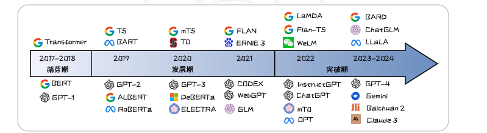
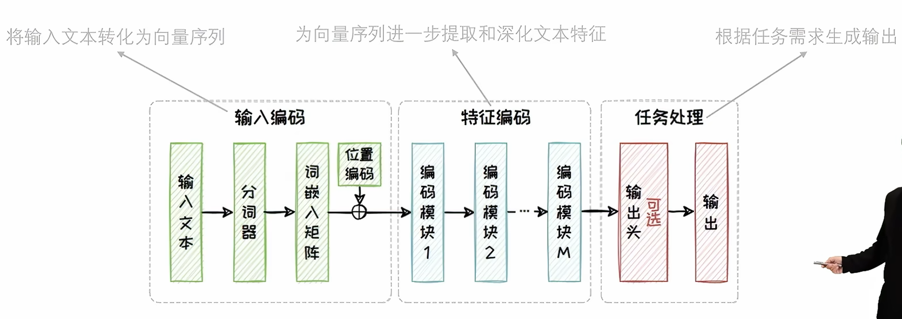
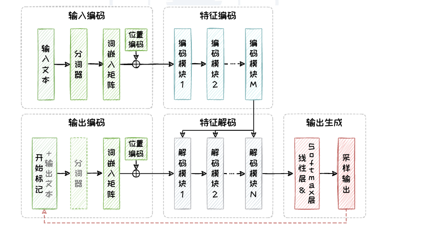
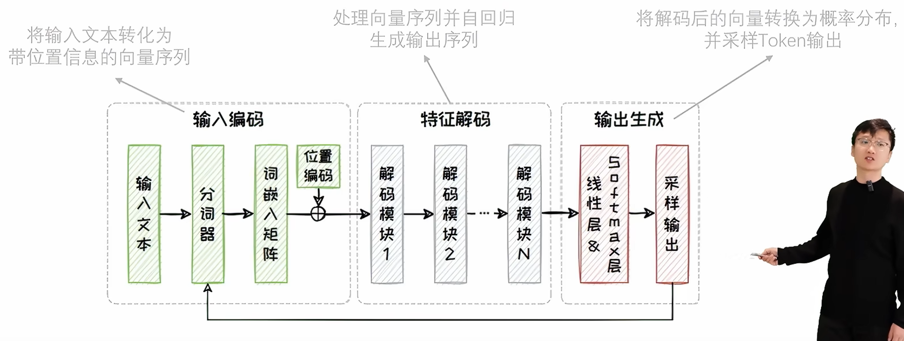
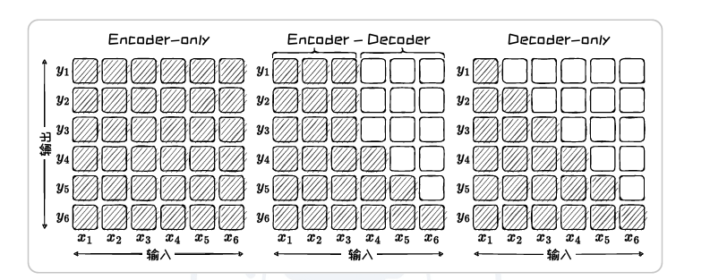

[目录](目录.md)

根据 PDF 第二章 2.1 节 **“大数据 + 大模型 → 新智能”** 的内容，为您进行详细展开。这一节主要探讨了大语言模型（LLM）能力的来源：即**规模效应（Scaling）**以及由此引发的**能力涌现（Emergence）**。

这是理解为什么现代 LLM（如 GPT-4, LLaMA 3）如此强大的理论基础。

---

### 2.1 大数据 + 大模型 → 新智能 (详细复习)

#### 1. 核心背景：LLM 的三个发展阶段
PDF 将 LLM 的发展划分为三个时期，这有助于理解技术演进的脉络：
*   **萌芽期 (2017-2018)**：
    *   标志：**Transformer** 架构诞生，**BERT** (Encoder-only) 和 **GPT-1** (Decoder-only) 问世。
    *   特征：确立了“预训练 + 微调”的范式。
*   **发展期 (2019-2022)**：
    *   标志：**GPT-3**、**T5**。
    *   特征：参数规模大幅提升（亿级 $\rightarrow$ 千亿级），开始探索大规模模型的潜力。
*   **突破期 (2022-至今)**：
    *   标志：**ChatGPT**、**GPT-4**、**LLaMA** 系列。
    *   特征：新能力涌现（如逻辑推理、代码生成），RLHF 技术引入，开源生态爆发。

---

#### 2. 能力增强：扩展法则 (Scaling Laws) —— 重中之重

这一部分的考点在于：**为了让模型变强，我们应该优先增加模型参数，还是增加训练数据？** 历史上对此有两个著名的定律。

**A. Kaplan-McCandlish 扩展法则 (OpenAI, 2020)**
*   **核心观点**：模型的性能主要取决于三个因素：**模型参数量 ($N$)**、**数据集大小 ($D$)**、**计算量 ($C$)**。与模型具体架构（层数、宽度）关系不大。
*   **关键结论**：
    *   **模型规模优先**：在计算预算增加时，应该优先分配给**增大模型参数量**，而不是同比例增加数据量。
    *   **分配比例**：建议模型规模的增长速度应快于数据规模（$N \propto C^{0.73}, D \propto C^{0.27}$）。
*   **历史局限**：这一法则指导了 GPT-3 的设计（1750亿参数，但训练数据相对较少），导致模型虽然很大，但训练得不够充分（Undertrained）。

**B. Chinchilla 扩展法则 (DeepMind, 2022)**
*   **核心观点**：**修正**了 OpenAI 的观点，认为之前的模型（如 GPT-3）**参数过大而数据不足**。
*   **关键结论**：
    *   **等比例增长**：在计算预算增加时，模型参数量 ($N$) 和训练数据量 ($D$) 应该以**近乎相等**的比例增长（约 1:1）。
    *   **最优配置**：对于一个给定参数量的模型，最优的训练数据量应该是参数量的 **20 倍**。
        *   *例子*：70亿参数（7B）的模型，应该用 1400亿（140B）Token 的数据去训练。
*   **深远影响**：
    *   开启了**“小模型 + 大数据”**的时代（如 **LLaMA** 系列）。
    *   这解释了为什么 LLaMA-65B（参数更少）能比 GPT-3（175B）性能更强——因为 LLaMA 用了多得多的数据（1.4T Token）进行了更充分的训练。

> **💡 补充完善点（PDF未详述但重要）：**
> *   **数据质量 > 数据数量**：现在的趋势不仅是堆数据量，更看重数据的筛选和配比（如教科书级数据、代码数据），高质量数据能打破 Scaling Laws 的边际效应递减。
> *   **摩尔定律的延续**：Scaling Laws 本质上是 AI 领域的摩尔定律，预示着只要算力和数据跟得上，模型智能还有提升空间。

---

#### 3. 能力扩展：涌现能力 (Emergent Abilities)

**A. 定义**
*   **量变引起质变**：当模型规模（参数量/计算量）超过某个**临界阈值**时，某些能力会突然出现，而在小模型中这些能力几乎为零（性能曲线从 Flat 突然跳变）。
*   **不可预测性**：在模型训练之前，很难预测具体会在哪个规模点涌现出什么能力。

**B. 典型涌现能力举例**
1.  **上下文学习 (In-Context Learning, ICL)**
    *   **能力**：无需梯度更新（不训练），仅通过在 Prompt 中给出的几个示例（Few-shot），模型就能学会处理新任务。
    *   **对比**：GPT-1/2 几乎做不到，GPT-3 (175B) 突然展现出极强的 ICL 能力。
2.  **思维链推理 (Chain-of-Thought, CoT)**
    *   **能力**：模型能够按照逻辑步骤，一步步推导出复杂问题的答案（如数学题、逻辑谜题）。
    *   **对比**：小模型倾向于直接猜答案（通常是错的），大模型（通常 >60B 参数）才能学会“这是因为...所以...”。
3.  **指令遵循 (Instruction Following)**
    *   **能力**：理解并执行人类复杂的自然语言指令（不仅仅是续写文本）。
4.  **代码生成与调试**
    *   **能力**：不仅仅是补全代码，还能理解代码逻辑、修复 Bug。

> **💡 补充完善点（关于“幻觉”与“涌现”的辩证）：**
> *   虽然大模型涌现出了推理能力，但**“幻觉”**（一本正经胡说八道）某种程度上也是一种涌现现象——因为模型学会了生成看起来很有逻辑但实际上错误的内容。
> *   **逆 Scaling (Inverse Scaling)**：有些任务上，模型越大反而表现越差（通常是因为模型过度拟合了训练数据中的某些错误偏见），这是 Scaling Laws 的反面案例，复习时需留意。

---

### 本节复习总结 (Cheat Sheet)

| 概念 | 核心内容 | 代表模型/机构 |
| :--- | :--- | :--- |
| **Kaplan 扩展法则** | 模型参数扩展 > 数据扩展 | GPT-3 (OpenAI) |
| **Chinchilla 扩展法则** | 模型参数扩展 $\approx$ 数据扩展 (1:1)；数据量应是参数量的20倍 | Chinchilla, LLaMA (DeepMind/Meta) |
| **涌现能力** | 规模越过阈值后突然出现的能力 (相变) | GPT-3, GPT-4 |
| **ICL (上下文学习)** | 给例子就会做，不用改参数 | GPT-3 |
| **CoT (思维链)** | 能够分步骤推理 | Wei et al. (Google) |

这一节的重点在于理解 **模型是怎么变强的**（通过 Scaling Laws 指导训练配置）以及 **变强后发生了什么**（涌现出了意想不到的新能力）。

根据 PDF 第二章 2.2 节 **“大语言模型架构概览”** 的内容，为您详细展开。

这一节是理解大模型“长什么样”的关键。它将看似复杂的 Transformer 变体归纳为三种基本范式，并解释了它们在**注意力机制**、**功能侧重**以及**历史演变**上的区别。

---

### 2.2 大语言模型架构概览 (详细复习)

#### 1. 三大主流架构 (Categories)

所有的主流 LLM 都基于 Transformer，但在具体组件的选用上分为三派：

**A. Encoder-only (仅编码器架构)**
*   **结构**：只使用 Transformer 的 Encoder 部分。
*   **机制**：
    *   **双向注意力 (Bi-directional Attention)**：在处理一个词时，能同时看到它**前面**和**后面**的所有词（“通盘考虑”）。
    *   不具备“自回归”生成能力，**通常需要加一个输出头（如分类器）来完成任务**。
*   **代表模型**：**BERT**、RoBERTa、ALBERT。
*   **适用场景**：**自然语言理解 (NLU)**。如：情感分析、文本分类、命名实体识别。

**B. Encoder-Decoder (编解码器架构)**
*   **结构**：保留了完整的 Transformer 结构（Encoder + Decoder）。
*   **机制**：
    *   **Encoder**：双向注意力，负责“理解”输入序列。
    *   **Decoder**：单向（掩码）注意力，负责“生成”输出序列。
    *   **交叉注意力 (Cross-Attention)**：连接两者，让 Decoder 在生成时能够“回头看” Encoder 提取的信息。
*   **代表模型**：**T5**、BART。
*   **适用场景**：**序列到序列 (Seq2Seq)** 任务。如：机器翻译、文本摘要（输入和输出有强对应关系）。

**C. Decoder-only (仅解码器架构) —— *当前绝对主流***
*   **结构**：只使用 Transformer 的 Decoder 部分。
*   **机制**：
    *   **单向/因果注意力 (Causal Attention)**：在预测第 $t$ 个词时，**只能看到 $t$ 之前**的词，看不到后面的词（防止“偷看答案”）。
    *   **自回归生成 (Auto-regressive)**：一个词接一个词地往后蹦。
*   **代表模型**：**GPT 系列**、**LLaMA 系列**、PaLM、Bloom。
*   **适用场景**：**自然语言生成 (NLG)** 及 **通用任务**。如：文本续写、问答、逻辑推理。

---

#### 2. 功能深度对比 (Comparison)

这一部分主要通过**注意力矩阵 (Attention Matrix)** 的形态来区分三者（PDF 图 2.6 的核心考点）：

| 架构类型                | 注意力矩阵形态              | 含义                 | 核心优势                | 核心劣势                        |
| :------------------ | :------------------- | :----------------- | :------------------ | :-------------------------- |
| **Encoder-only**    | **全向可视** (Full)      | 每个词都能关注到所有其他词      | 理解能力最强，上下文感知最完整     | 无法直接生成长文本，训练需特定任务(MLM)      |
| **Decoder-only**    | **下三角** (Triangular) | 只能关注到当前词之前的历史      | 生成能力最强，最符合人类说话/思考顺序 | 在理解任务上可能略弱于Encoder（早期观点）    |
| **Encoder-Decoder** | **混合** (Hybrid)      | 输入端全向，输出端下三角，中间有交互 | 平衡了理解与生成，适合“翻译”类任务  | 架构较重，参数利用率不如 Decoder-only 高 |

---

#### 3. 架构的历史演变 (Evolution)

理解这个演变过程，有助于明白为什么现在全是 Decoder-only 模型。

*   **阶段一：分庭抗礼 (2018)**
    *   **BERT (Encoder-only)** vs **GPT-1 (Decoder-only)**。
    *   当时 BERT 大获全胜，因为当时的 NLP 任务主要是分类、匹配等理解任务，BERT 的双向视野优势巨大。
*   **阶段二：百花齐放 (2019-2020)**
    *   **T5/BART (Encoder-Decoder)** 崛起。
    *   人们发现要做翻译、摘要这种生成任务，还是得有 Decoder。T5 提出了“万物皆可 Text-to-Text”的统一框架。
*   **阶段三：大一统 (2021-至今)**
    *   **GPT-3** 横空出世，证明了只要参数够大，**Decoder-only** 架构不仅能生成，理解能力也能通过 Scaling 涌现出来。(**因为Decoder-only架构不用根据不同任务去调节自己的输出层**)
    *   **现状**：Decoder-only 成为统治级架构（如 LLaMA, GPT-4）。

---

#### 💡 补充完善：为什么 Decoder-only 最终胜出？

PDF 中简要提到了这一点，这里为您详细补充，这通常是面试或深入理解的考点：

1.  **计算效率与工程优化 (KV Cache)**：
    *   Decoder-only 架构在推理时可以极其方便地利用 **KV Cache** 技术（缓存过去计算过的 Key 和 Value），这使得生成速度非常快。虽然 Encoder-Decoder 也可以用，但结构更复杂。
2.  **参数利用率**：
    *   在 Encoder-Decoder 架构中，Encoder 负责理解，Decoder 负责生成。但在处理纯生成任务时，Encoder 的参数往往显得有点“冗余”或传递信息存在瓶颈。Decoder-only 将所有参数都用于“预测下一个词”，训练目标更纯粹、更难，但也迫使模型学到更通用的能力。
3.  **训练数据的适配性**：
    *   互联网上的海量数据大多是**自然连续的文本**（如书籍、网页）。这种数据天生适合 **Next Token Prediction（下一词预测）** 的自回归训练任务。而 Encoder-only 需要人为构造 [MASK] 任务，Encoder-Decoder 需要构造 <输入, 输出> 对，数据准备成本更高。
4.  **零样本 (Zero-shot) 泛化能力**：
    *   实验证明，在大规模下，Decoder-only 架构在 Zero-shot / Few-shot 任务上的泛化能力通常强于其他架构。

---

**复习建议：**
在这一节，请脑海中存下一张图：
*   左边是 **BERT**（双向，看懂全文，做填空题）；
*   中间是 **T5**（左手画圆右手画方，做翻译题）；
*   右边是 **GPT**（蒙眼狂奔，只看历史，做续写题）。
*   **结论**：右边的 GPT 凭借简单的结构和暴力的美学（Scaling）赢得了现在的时代。

根据 PDF 第二章 2.3 节 **“基于 Encoder-only 架构的大语言模型”** 的内容，为您详细展开。

虽然现在生成式 AI（如 GPT）占据了头条，但 **Encoder-only** 架构（以 **BERT** 为代表）在自然语言理解（NLU）、搜索引擎优化、文本嵌入（Embeddings）等领域依然是不可或缺的基石。

---

### 2.3 基于 Encoder-only 架构的大语言模型 (详细复习)

#### 2.3.1 核心架构设计

**1. 双向注意力 (Bidirectional Attention)**
*   **定义**：在处理序列中的某个词时，模型可以同时“看到”它左边和右边的所有词。
*   **优势**：能够捕捉最完整的上下文信息，消除歧义。例如理解“苹果”是指水果还是手机，必须看完整的句子环境。

**2. 动态上下文嵌入 (Contextual Embeddings)**
*   **对比**：
    *   **静态嵌入 (Word2Vec/GloVe)**：一个词对应一个固定的向量。无论“银行”在“银行存款”还是“河岸边”中，向量都一样。
    *   **动态嵌入 (Encoder-only)**：同一个词在不同语境下生成的向量是不同的。这是自然语言处理的一次质的飞跃。

**3. 架构组成**
*   输入编码（Embedding + 位置编码）$\rightarrow$ 堆叠的 Encoder Blocks（自注意力 + 前馈网络）$\rightarrow$ 任务输出头（Task Head）。

---

#### 2.3.2 BERT：Encoder-only 的开山鼻祖

**BERT (Bidirectional Encoder Representations from Transformers)** 由 Google 在 2018 年提出。

**1. 预训练任务 (Pre-training Tasks)**
BERT 不像 GPT 那样预测下一个词，而是通过两个自监督任务来训练：
*   **MLM (Masked Language Modeling，掩码语言建模)**：
    *   **机制**：随机遮盖输入中 **15%** 的词（替换为 `[MASK]`），让模型根据上下文把这些词填回去（完形填空）。
    *   **意义**：迫使模型学习双向的上下文依赖。
*   **NSP (Next Sentence Prediction，下一句预测)**：
    *   **机制**：输入两个句子 A 和 B，预测 B 是否是 A 的真实下文。
    *   **意义**：让模型学习句子与句子之间的逻辑关系（对问答、推理任务有帮助）。

**2. 关键输入设计**
*   **[CLS] 标签**：放在序列开头的特殊 Token。经过多层处理后，[CLS] 的向量被视为**整个句子的语义表示**（Sentence Embedding），常用于分类任务。
*   **[SEP] 标签**：用于分隔两个句子。

**3. 模型规模**
*   **BERT-Base**：12层，1.1亿参数（110M）。
*   **BERT-Large**：24层，3.4亿参数（340M）。

---

#### 2.3.3 BERT 的衍生模型 (Variants)

BERT 发布后，学术界对其进行了大量的改进（魔改），主要集中在**更强的性能**、**更轻量化**、**更高效的训练**三个方向。

**1. RoBERTa (Robustly Optimized BERT)** —— *“大力出奇迹”的优化版*
*   **核心改进**：
    *   **去掉了 NSP 任务**：研究发现 NSP 对性能提升不大，甚至有副作用。
    *   **动态掩码 (Dynamic Masking)**：BERT 的 Mask 是固定的，RoBERTa 在训练过程中每次喂数据时都随机生成新的 Mask 模式。
    *   **更多数据 + 更大 Batch Size + 训练更久**：使用了 160GB 文本（BERT 只有 16GB）。
*   **结论**：结构没变，单纯靠训练策略的优化就能大幅提升性能。

**2. ALBERT (A Lite BERT)** —— *“参数瘦身”的轻量版*
*   **痛点**：BERT 参数太多，显存不够用。
*   **核心改进**：
    *   **参数因子分解 (Factorized Embedding)**：将大的词嵌入矩阵分解为两个小矩阵（$V \times H \rightarrow V \times E + E \times H$），大幅减少 Embedding 层参数。
    *   **跨层参数共享 (Cross-layer Parameter Sharing)**：所有 Encoder 层共用**同一套**参数。这意味着 12 层网络的参数量和 1 层一样多！
    *   **SOP (Sentence Order Prediction)**：用“句序预测”代替 NSP。判断两个句子是顺序的还是反序的（比 NSP 更难，更能迫使模型学到语义连贯性）。
*   **结果**：参数量剧减（BERT-Base 的 1/9），但训练和推理速度并没有显著变快（因为层数没变，计算量没变，只是存参数的内存变小了）。

**3. ELECTRA** —— *“高效率”的鉴别版*
*   **核心改进**：引入了类似 GAN（生成对抗网络）的 **生成器-判别器** 架构。
*   **RTD 任务 (Replaced Token Detection)**：
    *   **生成器**：把一些词替换成假的（但合乎语法的）词。
    *   **判别器 (ELECTRA)**：不再是预测被 Mask 的词是什么，而是**判断输入序列中的每个词是“原装的”还是“被替换过的”**。
*   **优势**：BERT 只能从 15% 的 Mask 词中学习，ELECTRA 可以从 100% 的所有 Token 中获得学习信号（每个词都要判断真假），训练效率极高。

---

#### 💡 补充完善：Encoder-only 的现状

虽然 PDF 重点介绍了这些经典模型，但在复习时您需要补充一个视角：**为什么现在大模型主要只谈 Decoder-only？**

1.  **生成能力的缺失**：Encoder-only 极其擅长**打分**（分类、判断相似度），但不擅长**说话**（生成文本）。在 ChatGPT 开启的生成式 AI 时代，它显得“功能单一”。
2.  **当前定位**：
    *   它没有消失，而是转型了。现在最先进的 **Embedding 模型**（用于 RAG 里的向量检索）大多依然是基于 BERT/RoBERTa 架构演进的（如 BGE, Jina-Embeddings）。
    *   在需要高精度分类、实体抽取等传统 NLP 任务中，小参数量的 Encoder-only 模型依然具备极高的性价比。

---

### 本节复习总结 (Cheat Sheet)

| 模型 | 架构类型 | 核心创新/特点 | 预训练任务 |
| :--- | :--- | :--- | :--- |
| **BERT** | Encoder-only | 双向注意力，[CLS] 句向量 | MLM + NSP |
| **RoBERTa** | Encoder-only | 动态掩码，更多数据 | MLM (无 NSP) |
| **ALBERT** | Encoder-only | 参数共享，矩阵分解 | MLM + SOP |
| **ELECTRA** | Encoder-only | 判别式预训练 (GAN思路) | RTD (替换词检测) |

这一节的重点是掌握 **BERT 的双向机制** 以及 **各个变体是如何针对 BERT 的弱点（NSP无用、参数过大、训练效率低）进行改进的**。

根据 PDF 第二章 2.4 节 **“基于 Encoder-Decoder 架构的大语言模型”** 的内容，为您详细展开。

这种架构（也称为 **Seq2Seq** 模型）是连接“理解”与“生成”的桥梁，曾是机器翻译和文本摘要领域的绝对王者。

---

### 2.4 基于 Encoder-Decoder 架构的大语言模型 (详细复习)

#### 2.4.1 核心架构设计

**1. 结构组成**
*   **Encoder（编码器）**：
    *   负责“阅读”和“理解”。
    *   采用**双向注意力**，能够看到输入序列的全部内容，提取出包含丰富语义的上下文向量。
*   **Decoder（解码器）**：
    *   负责“写作”和“生成”。
    *   采用**单向（掩码）注意力**，确保生成时只能看到已生成的词。
    *   **关键组件：交叉注意力 (Cross-Attention)**。这是连接 Encoder 和 Decoder 的纽带。Decoder 在每一步生成时，都会通过交叉注意力“回头看” Encoder 的输出，从中提取当前生成所需要的信息。

**2. 训练与推理**
*   **训练**：通常使用 **Teacher Forcing**，输入完整的正确答案序列，并行计算损失。
*   **推理**：采用 **自回归 (Auto-regressive)** 模式，一步步生成，直到遇到结束符 `[EOS]`。

---

#### 2.4.2 T5：大一统的“文本到文本”框架

**T5 (Text-to-Text Transfer Transformer)** 由 Google 在 2019 年提出。

**1. 核心理念：Text-to-Text**
*   **以前的做法**：不同的任务用不同的模型结构（分类任务用输出头，翻译任务用 Seq2Seq）。
*   **T5 的做法**：**所有 NLP 任务都视为“文本到文本”的转换**。
    *   **翻译**：输入 "translate English to German: That is good" $\rightarrow$ 输出 "Das ist gut"。
    *   **分类**：输入 "sentiment: This movie is bad" $\rightarrow$ 输出 "negative"。
    *   **回归**：输入 "stsb sentence1: ... sentence2: ..." $\rightarrow$ 输出 "3.8"（输出文本形式的数字）。
*   **意义**：这是 **Prompt（提示词）** 思想的早期雏形，统一了任务格式，极大地简化了多任务学习。

**2. 预训练任务：Span Corruption (片段破坏)**
*   **机制**：不只是像 BERT 那样 Mask 单个词，而是 Mask 掉**连续的文本片段 (Span)**。
*   **目标**：模型需要生成被 Mask 掉的那一段文本。
*   **优势**：迫使模型学习更长距离的语义依赖，不仅要理解词，还要理解短语和句子结构。

**3. 数据集**
*   使用了 **C4 (Colossal Clean Crawled Corpus)** 数据集，这是一个清洗过的超大规模网页文本数据集。

---

#### 2.4.3 BART：去噪自编码器

**BART (Bidirectional and Auto-Regressive Transformers)** 由 Meta (Facebook) 在 2019 年提出。

**1. 核心定位**
*   BART 可以看作是 **BERT (Encoder)** 和 **GPT (Decoder)** 的结合体。
*   它本质上是一个**去噪自编码器 (Denoising Autoencoder)**：输入是被破坏的文本，输出是重建后的原始文本。

**2. 预训练任务：花式破坏文本**
BART 设计了多种破坏文本的方式，强迫模型学会“修复”文本：
*   **Token Masking**：像 BERT 一样遮盖词。
*   **Token Deletion**：直接删掉词（模型需发现这里少了个词）。
*   **Text Infilling**：遮盖一段文本（类似 T5，模型需预测这里缺了几个词、是什么词）。
*   **Sentence Permutation**：打乱句子的顺序（模型需学会逻辑重组）。
*   **Document Rotation**：随机选一个词作为开头，把前面的移到后面（模型需识别真正的开头）。

**3. 优势**
*   由于它不仅能理解（Encoder），还能生成（Decoder），因此在 **文本摘要**、**机器翻译** 等生成型任务上表现极佳，长期霸榜。

---

#### 💡 补充完善：Encoder-Decoder 的现状

在复习这一节时，您可能会有一个疑问：**既然 T5 和 BART 这么好，为什么现在的 ChatGPT 不用这种架构？**

1.  **上限与效率**：
    *   在参数量较小（百亿级别）时，Encoder-Decoder 在特定任务（如翻译）上往往优于 Decoder-only。
    *   但随着参数量扩大到千亿级别（Scaling Laws 生效），Decoder-only 展现出了更强的**零样本泛化能力**。
2.  **数据利用率**：
    *   Encoder-Decoder 需要成对的数据（<输入, 输出>）或构造特定的去噪任务进行训练。
    *   Decoder-only 可以直接利用互联网上无限的无标注文本进行“下一词预测”训练，数据获取和训练流程更直接、更具扩展性。
3.  **当前应用**：
    *   Encoder-Decoder 并没有被淘汰。在**特定垂直领域**（如专门的翻译模型、代码注释生成、文本摘要工具）中，T5 和 BART 的变体依然非常活跃且高效。

---

### 本节复习总结 (Cheat Sheet)

| 模型 | 架构类型 | 核心理念 | 预训练任务 | 强项 |
| :--- | :--- | :--- | :--- | :--- |
| **T5** | Encoder-Decoder | **Text-to-Text** (万物皆文本) | **Span Corruption** (填补缺失片段) | 多任务统一，问答，分类 |
| **BART** | Encoder-Decoder | **去噪自编码器** (BERT+GPT) | **文本复原** (打乱、删除、遮盖后的复原) | 文本摘要，机器翻译 |

这一节的重点是理解 **Seq2Seq 结构的优势**（同时具备理解和生成能力），以及 **T5 如何通过统一输入输出格式** 为后来的 Prompt Engineering 铺平了道路。

很抱歉听到复制时的格式问题给您带来了不便。为了确保笔记内容的准确性并基于您提供的文档进行严谨的复习整理，我会在文中保留必要的引用标注，以便您在复习时能快速对应到原文档的页码和段落。

以下是根据**第2章 2.5节**为您整理的详细复习笔记，涵盖了架构演变、GPT系列、LLaMA系列及其衍生模型的所有考点细节。

---

# 2.5 基于 Decoder-only 架构的大语言模型

## 一、 核心概念与架构优势

### 1. 为什么选择 Decoder-only？

- **背景**：在开放式（Open-Ended）生成任务中，输入序列通常较简单或没有明确输入，Encoder-Decoder 架构维持一个完整的编码器显得过于复杂且缺乏灵活性 1。
    
- **优势**：
    
    - **生成特性**：通过自回归（Autoregressive）方法逐字生成文本，保持长文本的连贯性和内在一致性 2。
        
    - **轻量高效**：去除了编码器部分，模型更轻量化，在同等规模下训练和推理速度更快 3。
        
    - **Zero-shot 能力**：在缺乏明确输入或复杂输入的情况下，能更自然、流畅地生成文本 4。
        

### 2. 发展历程

- **起源**：概念最早可追溯到 2018 年的 **GPT-1**，但当时被 BERT（Encoder-only）的卓越性能所掩盖 5。
    
- **爆发**：2020 年 **GPT-3** 的突破性成功，使 Decoder-only 架构被广泛应用 6。
    
- **两大主流系列**：
    
    - **GPT 系列 (OpenAI)**：起步最早，性能标杆，后期转向闭源 7。
        
    - **LLaMA 系列 (Meta)**：起步较晚，坚持开源，凭借“小模型+大数据”占据重要地位 8。
        

---

## 二、 GPT 系列语言模型 (OpenAI)

GPT (Generative Pre-trained Transformer) 系列引领了大模型浪潮，其演进遵循**参数规模与语料规模同步激增**的规律 9。

### 1. GPT-1：初出茅庐 (2018.06)

- **核心思想**：开创了在 Decoder-only 架构下，通过**下一词预测**解决无监督文本生成的先河 10。
    
- **模型结构**：
    
    - 由 12 个解码块堆叠而成 11。
        
    - 使用**带掩码的单向自注意力模块**（Masked Self-Attention），这是与 BERT（双向注意力）的本质区别 12。
        
    - 参数量约 **1.17亿** 13。
        
- **预训练**：
    
    - 数据集：**BookCorpus** (约 5GB, 8亿 Token) 14。
        
    - 任务：下一词预测 (Next Token Prediction) 15。
        
- **下游任务**：
    
    - **有监督微调**：需要针对特定任务（如文本分类、相似度评估）构建微调策略，受限于数据量，当时泛化能力有限 16161616。
        

### 2. GPT-2：小有所成 (2019.02)

- **改进策略**：坚持 Decoder-only 路线，通过显著提升模型规模和预训练数据质量，增强泛化能力，实现**零样本学习 (Zero-shot)** 17171717。
    
- **模型结构**：
    
    - 发布了 Small (1.24亿) 到 XL (15亿) 四个版本 18。
        
    - GPT-2 XL 包含 48 个解码块，隐藏层维度 1600 19。
        
- **预训练**：
    
    - 数据集：**WebText** (40GB)，经过精心清洗的高质量网络文本 20。
        
    - 效果：学习到更复杂的语言表达，生成更准确连贯 21。
        

### 3. GPT-3：崭露头角 (2020.05)

- **核心突破**：涌现出**上下文学习 (In-Context Learning, ICL)** 能力 22。
    
    - **ICL 定义**：无需微调，仅需在输入中提供任务描述或少量示例，即可完成任务 23。
        
- **模型参数**：
    
    - 参数量最高达 **1750亿** (GPT-3 175B) 242424。
        
    - 解码块数量达 96 个，注意力头 96 个 25。
        
- **预训练**：
    
    - 数据集：约 **1TB**，涵盖 Common Crawl, WebText, Wikipedia, Books 等 26262626。
        

### 4. InstructGPT：蓄势待发 (ChatGPT 前身)

- **核心目标**：解决模型生成内容不准确、不可靠或不符合用户意图的问题（即**对齐** User Intent Alignment） 27。
    
- **关键技术：人类反馈强化学习 (RLHF)** 28。
    
    - **步骤1：有监督微调 (SFT)**：收集“问题-人类回答”对进行微调 29。
        
    - **步骤2：训练奖励模型 (Reward Model)**：模型生成多个候选输出，人工排序，训练一个能打分的奖励模型 30。
        
    - **步骤3：强化学习微调 (PPO)**：利用奖励模型的分数，通过强化学习算法优化语言模型 31。
        
- **替代算法：DPO (直接偏好优化)** 32。
    
    - 斯坦福于 2023 年提出，直接利用人类偏好数据微调模型，**省略了奖励模型和强化学习步骤**，计算效率更高 33。
        

### 5. ChatGPT 与 GPT-4：一鸣惊人

- **ChatGPT (2022.11)**：基于 InstructGPT，展现强大对话能力，开启 **LLMaaS** (LLM as a Service) 模式，模型开始**闭源** 34343434。
    
- **GPT-4 (2023.03)**：
    
    - 支持**图文双模态**输入 35。
        
    - 数学、编程和逻辑推理能力大幅提升 36。
        
- **GPT-4o (2024.05)**：响应速度大幅提升，增强多模态和多语言处理能力 37。
    

---

## 三、 LLaMA 系列语言模型 (Meta AI)

### 1. 设计理念

- **开源共创**：权重开放，推动学术界研究 38。
    
- **核心策略**：基于 **Chinchilla 扩展法则**，实践“**小模型 + 大数据**”理念 39。不单纯追求参数大，而是用更多优质数据训练相对小的模型，以获得更快的推理速度 40。
    

### 2. LLaMA-1 (2023.02)

- **语料规模**：约 **5TB** 41。
    
- **架构创新** (相比标准 Transformer 的三大改进) 42424242：
    
    1. **词嵌入模块**：使用 **RoPE (旋转位置编码)** 替代绝对位置编码，增强对序列顺序的理解。
        
    2. **激活函数**：使用 **SwiGLU** 替代 ReLU，提升性能。
        
    3. **正则化**：使用 **Pre-Norm** (RMSNorm)，在注意力模块和前馈模块的输入前进行正则化，提升训练稳定性。
        

### 3. LLaMA-2 (2023.07)

- **语料规模**：约 **7TB** 43。
    
- **技术升级**：
    
    - **RLHF**：引入人类反馈强化学习，使用 PPO 和**拒绝采样 (Rejection Sampling)** 44。
        
    - **GQA (分组查询注意力)**：在 **34B** 和 **70B** 版本中引入 45。
        
        - _原理_：多组 Query 共享相同的 Key 和 Value。
            
        - _作用_：降低内存占用，减少参数量，提升推理效率 46。
            

### 4. LLaMA-3 (2024.04)

- **语料规模**：爆发至 **50TB** (是 LLaMA-2 的 7 倍) 47。
    
    - 包含代码数据（增强逻辑）和 5% 非英文数据（增强跨语言） 48。
        
- **架构改进**：
    
    - **Tokenizer**：字典长度扩大 3 倍，显著减少 Token 数量，提升生成流畅性和推理效率 49。
        
    - **GQA**：**8B** 和 **70B** 版本**均采用**分组查询注意力机制 50。
        
- **性能**：8B 版本超越了 LLaMA-2 70B，70B 版本对标 GPT-4 51。
    

### 5. LLaMA 衍生模型生态

得益于开源，LLaMA 衍生出了众多模型 52：

- **性能改进类**：
    
    - **Alpaca**：利用 GPT-3.5 生成的指令数据微调 LLaMA-1 53。
        
    - **Vicuna**：利用 ShareGPT 对话数据微调 54。
        
    - **Guanaco**：引入 **QLoRA** 技术，大幅降低微调成本 55。
        
- **垂域任务类**：
    
    - **CodeLLaMA**：代码生成 56。
        
    - **LawGPT**：法律问答 57。
        
    - **GOAT**：数学解题 58。
        
- **多模态类**：
    
    - **LLaVA / MiniGPT4**：整合视觉编码器 (CLIP/ViT) 与 LLaMA，实现图文对齐 59。
        

---

## 四、 考前速查对比表

|**特性**|**GPT 系列 (OpenAI)**|**LLaMA 系列 (Meta)**|
|---|---|---|
|**核心架构**|Decoder-only|Decoder-only|
|**主要策略**|参数量与语料同步激增 (Scale up)|**小模型 + 大数据** (Chinchilla Law)|
|**开源情况**|GPT-3 后闭源|**全系列开源**|
|**位置编码**|学习到的绝对位置编码 (GPT-1/2/3)|**RoPE (旋转位置编码)**|
|**激活函数**|GeLU (GPT-2/3)|**SwiGLU**|
|**归一化**|LayerNorm|**RMSNorm (Pre-Norm)**|
|**关键技术**|**ICL** (上下文学习), **RLHF**|**GQA** (分组查询注意力), **RoPE**|

Would you like me to generate a specific quiz based on the differences between LLaMA-2 and LLaMA-3 to test your knowledge?

这是一份基于你提供的文件《2.6.非Transformer架构.pdf》生成的详细复习笔记。这份笔记重点梳理了当前为了解决Transformer架构在处理长序列时的计算瓶颈而产生的“非Transformer”架构，特别是**SSM（状态空间模型）**及其变体**RWKV**、**Mamba**，以及最新的**TTT（测试时训练）**范式。

---

# 2.6 非Transformer架构大语言模型复习笔记

## 1. 背景与核心动机
* [cite_start]**Transformer的局限性：** 尽管Transformer是主流架构，但其注意力机制导致计算规模随输入序列长度呈平方增长 ($O(N^2)$)，处理长序列时面临计算瓶颈 [cite: 7]。
* [cite_start]**传统RNN的局限性：** 虽然RNN推理是线性的，但难以捕捉长期依赖关系，且存在梯度消失或爆炸问题 [cite: 7]。
* [cite_start]**新架构的目标：** 结合Transformer（易并行、高性能）和RNN（线性复杂度、推理快）的优势，主要包括SSM和TTT两种范式 [cite: 7, 10]。

---

## 2. 状态空间模型 (SSM)
[cite_start]SSM范式旨在处理长程依赖性 (LRDs)，降低计算和内存开销 [cite: 13]。

### 2.1 核心思想与数学形式
[cite_start]SSM源自控制理论，通过状态变量捕捉系统随时间的连续变化 [cite: 15]。它有三种关键的表示形式：

1.  **连续形式 (系统方程)**
    * 用于描述连续数据（如音频）。
    * [cite_start]**状态方程：** $x^{\prime}(t)=Ax(t)+Bu(t)$ (描述状态如何变化) [cite: 32, 35]。
    * [cite_start]**输出方程：** $y(t)=Cx(t)+Du(t)$ (描述状态如何转化为输出，深度学习中通常忽略 $D$) [cite: 33, 35]。
    * [cite_start]*缺点：* 训练和推理都非常慢 [cite: 36]。

2.  **离散递归形式 (Recursive)**
    * [cite_start]通过**离散化 (Discretization)** (如梯形法) 将连续方程转换为递归形式 [cite: 36]。
    * [cite_start]**公式：** $x_{k}=\overline{A}x_{k-1}+\overline{B}u_{k}$ [cite: 37]。
    * [cite_start]**特点：** 类似RNN，推理高效 (线性复杂度)，但无法并行训练 [cite: 40]。

3.  **离散卷积形式 (Convolutional)**
    * [cite_start]将递归形式迭代展开，输出可视为输入与卷积核的卷积 [cite: 47]。
    * [cite_start]**公式：** $y_{k}=\overline{K}_{k}*u_{k}$ [cite: 52]。
    * [cite_start]**特点：** 利用**时不变性** (参数固定)，可高效并行训练，但自回归推理延迟大 [cite: 54]。

> [cite_start]**总结策略：** 结合优缺点，SSM架构通常选择**在训练时使用卷积形式（并行快），在推理时使用递归形式（推理快）** [cite: 54]。

---

## 3. 代表性SSM模型：RWKV & Mamba

### 3.1 RWKV (Receptance Weighted Key Value)
[cite_start]RWKV 是一种结合了RNN和Transformer优点的架构，是第一个扩展到百亿参数级别的非Transformer架构 [cite: 60, 90]。

* [cite_start]**核心机制：** WKV计算可看作两个SSM之比，采用线性注意力机制 [cite: 61, 84]。
* [cite_start]**架构模块：** [cite: 62]
    * [cite_start]**时间混合模块 (Time Mixing)：** 处理不同时间步之间的关系（类似Attention）。利用 $R, K, V$ 和衰减权重 $W$。核心公式 $wkv_t$ 类似两个SSM之比 [cite: 84, 85]。
    * [cite_start]**通道混合模块 (Channel Mixing)：** 关注同一时间步内不同特征通道的交互（类似FFN） [cite: 62]。
* **优势：**
    * [cite_start]训练可并行 (Transformer模式)，推理恒定复杂度 (RNN模式) [cite: 90]。
    * [cite_start]性能在NLP任务上与同规模Transformer相当 [cite: 92]。

### 3.2 Mamba
[cite_start]Mamba 解决了传统SSM处理信息密集型数据（如文本）能力弱的问题 [cite: 95]。

* **两大创新：**
    1.  **选择机制 (Selection Mechanism)：**
        * [cite_start]打破了传统SSM的“时不变性”。参数 $B, C, \Delta$ 变成输入 $x(t)$ 的函数（即 $S_B(x)$ 等），使模型能根据内容动态筛选信息 [cite: 96]。
        * [cite_start]代价：失去了卷积形式的并行优势 [cite: 97]。
    2.  **硬件感知算法 (Hardware-aware Algorithm)：**
        * [cite_start]为了解决选择机制带来的效率问题，Mamba利用GPU的SRAM进行计算（类似FlashAttention），减少HBM内存IO [cite: 109, 110]。
* [cite_start]**架构设计：** 均质架构，由相同的Mamba模块堆叠，包含线性层、卷积层和选择性SSM [cite: 111]。
* **性能表现：**
    * [cite_start]推理吞吐量比Transformer高5倍 (A100上) [cite: 114]。
    * [cite_start]能处理百万级别的超长序列 [cite: 114]。

---

## 4. 测试时训练 (Test-Time Training, TTT)
[cite_start]TTT 范式是为了解决SSM在**超长上下文**（如 >16k）中出现的性能饱和与遗忘问题 [cite: 117]。

* [cite_start]**核心痛点：** SSM将历史压缩成固定长度的隐藏状态，导致信息有损 [cite: 117]。
* **TTT 解决方案：**
    * [cite_start]利用**模型参数**本身来存储隐藏状态和记忆 [cite: 118]。
    * [cite_start]**动态更新：** 在推理阶段，针对每一条测试数据，一边推理一边训练（更新参数） [cite: 118]。
* [cite_start]**训练流程 (双循环)：** [cite: 130]
    * **外部循环：** 传统的自回归任务，优化全局权重。
    * [cite_start]**内部循环：** 自监督方式。模型计算重构损失 $l(W_{t-1}; x_t)$ 并通过梯度下降更新隐藏状态 $W_t$ [cite: 130, 134]。
    * [cite_start]**更新公式：** $W_{t}=W_{t-1}-\eta\nabla l(W_{t-1};x_{t})$ [cite: 134]。
* [cite_start]**优势：** 相比SSM，TTT能更有效地捕捉超长上下文中的语义，适合处理极长序列 [cite: 145]。

---

## 5. 附录：主流模型参数参考
文档中还提供了一份GPT系列与LLaMA系列的参数对比表，可用于对大模型规模建立直观认知。

| 模型          | 发布时间    | 参数量 (亿)   | 语料规模                        |
| :---------- | :------ | :-------- | :-------------------------- |
| **GPT-1**   | 2018.06 | 1.17      | [cite_start]约5GB [cite: 3]  |
| **GPT-2**   | 2019.02 | 15 (最大)   | [cite_start]40GB [cite: 3]  |
| **GPT-3**   | 2020.05 | 1750 (最大) | [cite_start]1TB [cite: 3]   |
| **LLaMA-1** | 2023.02 | 652 (最大)  | [cite_start]约5TB [cite: 3]  |
| **LLaMA-2** | 2023.07 | 700 (最大)  | [cite_start]约7TB [cite: 3]  |
| **LLaMA-3** | 2024.04 | 700 (最大)  | [cite_start]约50TB [cite: 3] |

---

### 复习建议
1.  **重点区分SSM的三种形式：** 尤其是为什么训练用卷积（并行）、推理用递归（速度）。
2.  **对比RWKV和Mamba：** RWKV侧重于用线性Attention模拟Transformer；Mamba侧重于通过“选择机制”让SSM具备内容感知能力。
3.  **理解TTT的突破：** 它打破了“训练后参数固定”的传统思维，用实时梯度更新来代替固定大小的Hidden State缓存，以换取无限的上下文记忆能力。

**Would you like me to create a quick quiz based on these notes to test your understanding?**
