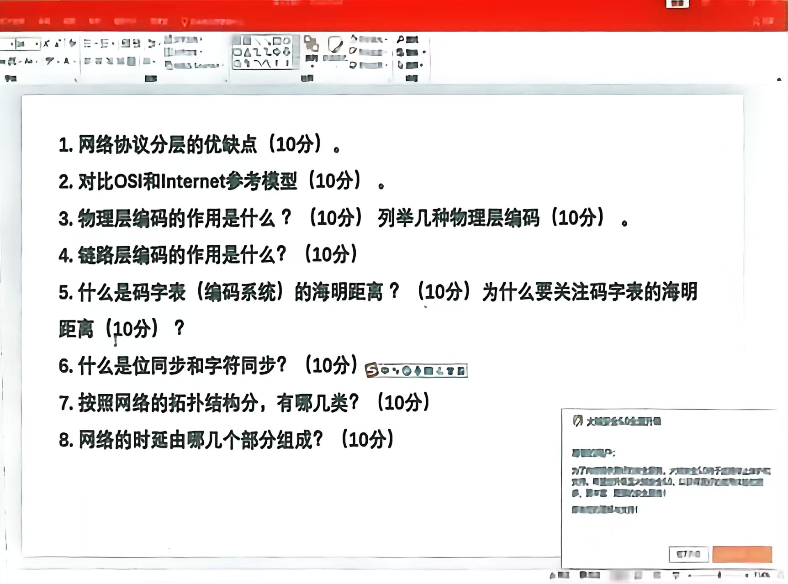
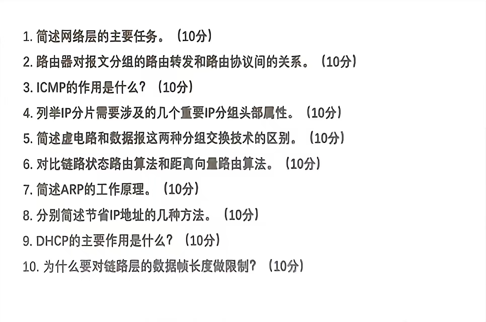
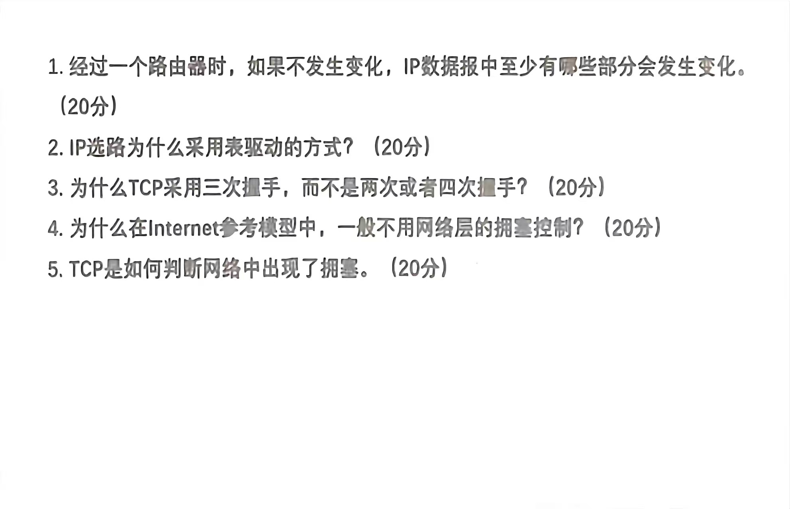

# 测试1

这是一份关于计算机网络基础知识的考试题目或复习提纲。基于图片内容，我为你详细解答每一个问题，内容涵盖了核心概念、对比分析及技术细节。

---

### 1. 网络协议分层的优缺点 (10分)

**答案：**

网络协议分层（Layering）是将复杂的网络通信过程划分为若干个层次，每一层负责特定的功能。

- **优点：**
    
    1. **降低复杂性 (Decomposition of Complexity)：** 将庞大复杂的系统分解为较小的、易于管理的子系统。每一层只需关注自己的功能，无需了解上下层的具体实现细节。
        
    2. **灵活性与独立性 (Flexibility & Independence)：** 某一层的技术实现发生变化（例如物理层从铜线换成光纤），只要接口保持不变，不会影响到其他层。
        
    3. **标准化 (Standardization)：** 分层使得不同厂商的设备和软件可以依据标准接口进行互操作（Interoperability）。
        
    4. **易于教学与理解：** 分层模型逻辑清晰，便于学习者理解网络通信的全过程。
        
- **缺点：**
    
    1. **开销增加 (Overhead)：** 每一层都需要添加头部（Header）或尾部信息，这增加了数据传输的额外开销，降低了有效载荷的比例。
        
    2. **功能重复 (Duplication of Functionality)：** 某些功能（如差错控制、流量控制）可能在多个层中重复出现，造成资源浪费。
        
    3. **层间通信受阻：** 严格的分层可能阻碍跨层优化（例如，应用层如果能知道物理层的链路状况，可以更好地调整传输策略，但严格分层限制了这种信息流动）。
        

---

### 2. 对比 OSI 和 Internet 参考模型 (10分)

**答案：**

|**比较维度**|**OSI 参考模型 (开放系统互连)**|**Internet 参考模型 (TCP/IP)**|
|---|---|---|
|**层次数量**|**7层**：物理层、数据链路层、网络层、传输层、会话层、表示层、应用层。|**4层** (或5层)：网络接口层、网际层(IP)、传输层、应用层。|
|**应用层处理**|将会话层、表示层、应用层明确分开。|将会话层和表示层的功能合并到了**应用层**中。|
|**核心特点**|理论完善，学术性强。明确区分了“服务”、“接口”和“协议”的概念。|实用性强，是事实上的国际标准（De facto standard）。更注重协议的实现。|
|**网络层模式**|支持面向连接和无连接两种通信模式。|网络层只提供**无连接**的服务（IP协议），将可靠性交给传输层。|

---

### 3. 物理层编码的作用是什么？ (10分) 列举几种物理层编码 (10分)

**答案：**

- 物理层编码的作用：
    
    物理层编码（通常指线路编码，Line Coding）的主要作用是将数字数据（比特流 0 和 1）转换为适合在物理介质上传输的信号（电信号或光信号）。其具体功能包括：
    
    1. **信号转换：** 解决数字信号与模拟信道或数字信道的匹配问题。
        
    2. **位同步 (Synchronization)：** 在信号中包含时钟信息，防止接收方与发送方时钟漂移导致误码（例如解决连0或连1导致的时钟丢失）。
        
    3. **消除直流分量：** 某些信道无法传输直流分量，编码可以调整信号频谱。
        
    4. **抗干扰能力：** 提高信号识别的准确性。
        
- 常见的物理层编码类型：
    
    1. 不归零制 (NRZ, Non-Return to Zero)： 高电平代表1，低电平代表0（或反之）。简单但无法同步，有直流分量。
    
    2. 归零制 (RZ, Return to Zero)： 信号在每个比特周期中间回归零电平。自带时钟信息，但带宽利用率低。
    
    3. 曼彻斯特编码 (Manchester Encoding)： 每一位中间都有跳变。既传输数据又传输时钟（以太网早期标准）。
    
    4. 差分曼彻斯特编码 (Differential Manchester)： 利用每一位开始处是否有跳变来表示0或1。抗干扰性更好。
    
    5. AMI 码 (Alternate Mark Inversion)： 0为零电平，1为正负交替电压。
    
    6. HDB3 码 (High Density Bipolar of Order 3)： 对AMI的改进，解决了连0问题。
    

---

### 4. 链路层编码的作用是什么？ (10分)

**答案：**

_注意：这里的“链路层编码”通常指信道编码（Channel Coding）或组帧（Framing）中的差错控制编码，而非物理层的信号波形编码。_

- **作用：**
    
    1. **差错检测与控制 (Error Detection & Correction)：** 物理线路传输是不可靠的，受噪声干扰会产生比特错误。链路层编码通过在数据中加入**冗余信息**（如校验位），使接收方能判断数据是否在传输中发生了变化，甚至纠正错误。
        
    2. **区分帧边界 (Framing)：** 确定数据帧的开始和结束位置，防止数据混乱。
        
    3. **提高传输可靠性：** 将不可靠的物理链路转变为逻辑上无差错的链路。
        
    
    _常见的链路层编码技术包括：奇偶校验、循环冗余校验 (CRC)、海明码等。_
    

---

### 5. 什么是码字表（编码系统）的海明距离？ (10分) 为什么要关注码字表的海明距离 (10分)？

**答案：**

- 什么是海明距离 (Hamming Distance)：
    
    在个编码系统（码字表）中，任意两个合法码字（Codeword）之间对应位不同的位数，称为这两个码字的海明距离。
    
    整个编码系统（码字表）的海明距离是指该系统中任意两个不同码字之间海明距离的最小值，记为 $d_{min}$。
    
    > _例子：如果码字表包含 `000` 和 `011`，它们后两位不同，距离为2。如果系统中最小的距离就是2，那么该系统的海明距离为2。_
    
- 为什么要关注它（作用）：
    
    海明距离决定了一个编码系统的检错和纠错能力：
    
    1. **检错能力：** 为了检测出 $e$ 个比特的错误，要求编码系统的海明距离 $d_{min} \ge e + 1$。
        
    2. 纠错能力： 为了纠正 $t$ 个比特的错误，要求编码系统的海明距离 $d_{min} \ge 2t + 1$。
        
        因此，关注海明距离是为了设计满足特定可靠性要求的通信协议。
        

---

### 6. 什么是位同步和字符同步？ (10分)

**答案：**

这是数据通信中同步技术的两个层次：

1. **位同步 (Bit Synchronization)：**
    
    - **定义：** 接收端必须准确地知道每个比特（Bit）的开始和结束时刻，保持与发送端的时钟频率和相位一致。
        
    - **目的：** 确保接收端能正确地从信号流中采样并判决出是“0”还是“1”，不会出现多采或漏采的情况。通常通过物理层编码（如曼彻斯特编码）或独立的时钟线来实现。
        
2. **字符同步 (Character/Word Synchronization)：**
    
    - **定义：** 在实现了位同步的基础上，接收端需要知道哪些比特组合成一个字符（或字节、帧）。即解决“从哪里开始算一个字符”的问题。
        
    - **目的：** 确保接收端能正确地将比特流划分成有意义的数据单元。通常通过特定的同步字符（如SYN）或帧定界符（如标志字节 `01111110`）来实现。
        

---

### 7. 按照网络的拓扑结构分，有哪几类？ (10分)

**答案：**

网络拓扑结构是指网络中节点和链路的物理布局。主要分类如下：

1. 总线型 (Bus Topology)： 所有设备连接到一条共享的主干电缆上。结构简单，但单点故障（主干断裂）会瘫痪全网。
    
    2. 星型 (Star Topology)： 所有设备都连接到一个中心节点（如交换机）。易于管理和故障隔离，是目前局域网最主流的结构。
    
    3. 环型 (Ring Topology)： 设备连成一个闭合的环。数据按固定方向传输（如令牌环网）。
    
    4. 网状型 (Mesh Topology)： 节点之间有多个互连路径。可靠性极高，但成本昂贵（常用于广域网核心或互联网骨干）。
    
    5. 树型 (Tree Topology)： 星型结构的扩展，呈层级状。
    
    6. 混合型 (Hybrid Topology)： 上述几种结构的组合。
    

---

### 8. 网络时延由哪几个部分组成？ (10分)

**答案：**

数据分组在网络中传输的总时延（Total Delay）通常由以下四个部分组成：

1. **处理时延 (Processing Delay)：**
    
    - 路由器或交换机在收到分组后，检查首部、决定转发路径（查路由表）以及差错校验所花费的时间。通常是微秒级。
        
2. **排队时延 (Queueing Delay)：**
    
    - 分组在路由器的输出队列中等待传输的时间。这个时间取决于网络的拥塞程度（流量越大，排队越久）。
        
3. **传输时延 (Transmission Delay) / 发送时延：**
    
    - 将分组的所有比特推向（发送到）链路所需要的时间。
        
    - 公式：$T_{trans} = L / R$ （$L$ = 分组长度， $R$ = 链路带宽/速率）。
        
4. **传播时延 (Propagation Delay)：**
    
    - 信号在物理介质（如光纤、铜线）中传播一定距离所需要的时间。
        
    - 公式：$T_{prop} = D / S$ （$D$ = 链路长度， $S$ = 信号传播速度，通常接近光速）。
        

$$总时延 = 处理时延 + 排队时延 + 传输时延 + 传播时延$$

---

我可以为你做的下一步：

如果你正在准备这门课的考试，我可以根据上述内容为你生成几道练习题或者计算题（例如计算海明距离或网络时延），帮助你巩固知识点。你需要吗？
# 测试2

这是一份非常标准的计算机网络（网络层与链路层为主）的考试试题。以下是针对每一个问题的详细解答，涵盖了核心概念和技术细节，适合用来复习或作为参考答案。

---

### 1. 简述网络层的主要任务 (10分)

**答案：**

网络层（Network Layer）是OSI模型中的第三层，其核心任务是实现数据包在不同网络（Heterogeneous Networks）之间的传输，即“互连互通”。具体任务包括：

1. **异构网络互连：** 将不同的子网（如以太网、Wi-Fi、光纤网）通过路由器连接起来，屏蔽下层物理网络技术的差异。
    
2. **逻辑寻址 (Logical Addressing)：** 为网络中的设备分配唯一的逻辑地址（如IP地址），以便在全网范围内标识源主机和目的主机。
    
3. **路由选择 (Routing)：** 通过路由算法和协议，在复杂的网络拓扑中寻找一条从源到目的地的最佳路径。
    
4. **分组转发 (Forwarding)：** 路由器根据转发表，将接收到的数据分组从合适的输出接口转发出去。
    

---

### 2. 路由器对报文分组的路由转发和路由协议间的关系 (10分)

**答案：**

这两者是路由器“控制层面”与“数据层面”的关系：

1. **路由协议 (Routing Protocols) —— 控制层面：**
    
    - **作用：** 负责收集网络拓扑信息，计算最佳路径。
        
    - **过程：** 路由器之间运行路由协议（如 OSPF, RIP, BGP），动态交换路由信息，根据算法生成**路由表 (Routing Table)**。这是“制图”的过程。
        
2. **路由转发 (Packet Forwarding) —— 数据层面：**
    
    - **作用：** 负责处理过往的每一个数据包。
        
    - **过程：** 当路由器收到一个数据包时，它根据包内的目的IP地址，去查询由路由协议生成的**转发表 (Forwarding Table)**，决定从哪个接口送出。这是“查图走路”的过程。
        
3. **关系总结：**
    
    - **路由协议是基础**，它为转发提供路径依据（生成路由表）。
        
    - **路由转发是目的**，它利用路由表实际传送数据。
        

---

### 3. ICMP的作用是什么？ (10分)

**答案：**

ICMP (Internet Control Message Protocol，网际控制报文协议) 是IP协议的辅助协议，用于弥补IP协议在可靠性和控制机制上的不足。

- **主要作用：** 在主机和路由器之间传递控制消息，主要包括**差错报告**和**网络探测**。
    
- **具体功能：**
    
    1. **差错报告 (Error Reporting)：** 当IP数据包无法到达目的地（如网络不可达、主机不可达、TTL耗尽）时，路由器会向源主机发送ICMP差错报文。
        
    2. **网络诊断与查询 (Query/Inquiry)：** 比如 `Ping` 命令使用 ICMP Echo Request/Reply 来测试连通性；`Traceroute` 使用 ICMP Time Exceeded 来追踪路径。
        

---

### 4. 列举IP分片需要涉及的几个重要IP分组头部属性 (10分)

**答案：**

当IP数据报长度超过链路层的MTU（最大传输单元）时，需要进行分片。涉及的关键头部字段有：

1. **标识 (Identification, 16位)：** 同一个原始数据报的所有分片都具有相同的标识号，以便接收端识别它们属于同一个包。
    
2. **标志 (Flags, 3位)：**
    
    - **DF (Don't Fragment)：** 设为1时禁止分片（如果必须分片则丢包）。
        
    - **MF (More Fragments)：** 设为1表示后面还有分片，设为0表示这是最后一个分片。
        
3. **片偏移 (Fragment Offset, 13位)：** 指示当前分片在原始数据报中数据的相对位置（以8字节为单位）。接收端根据此字段进行重组排序。
    
4. **总长度 (Total Length)：** 分片后，每个分片的总长度字段会修改为该分片的实际长度。
    

---

### 5. 简述虚电路和数据报这两分组交换技术的区别 (10分)

**答案：**

这是网络层提供服务的两种模式：

|**比较维度**|**虚电路 (Virtual Circuit)**|**数据报 (Datagram) - Internet采用**|
|---|---|---|
|**连接建立**|**必须建立连接** (类似打电话)。|**无需建立连接** (类似寄信)。|
|**寻址方式**|仅需短的虚电路号 (VCID)。|每个分组必须携带完整的源和目的IP地址。|
|**路径选择**|建立连接时确定路径，后续分组**按同一路径**传输。|每个分组**独立选择路径**，可能乱序到达。|
|**可靠性**|通常由网络保证顺序和无差错。|尽力而为服务 (Best Effort)，不保证可靠性。|
|**节点状态**|路由器需维护每个连接的状态信息。|路由器不保留分组的状态信息，简化了核心设备。|

---

### 6. 对比链路状态路由算法和距离向量路由算法 (10分)

**答案：**

- **距离向量 (Distance Vector, DV)：**
    
    - **代表协议：** RIP。
        
    - **原理：** “谣言传播”。路由器只和**邻居**交换信息，告知邻居自己到各目的地的距离。
        
    - **视野：** 路由器不知道全网拓扑，只知道“往哪里走”和“有多远”。
        
    - **缺点：** 收敛慢，容易出现“计数到无穷” (Count-to-infinity) 问题，也就是环路问题。
        
- **链路状态 (Link State, LS)：**
    
    - **代表协议：** OSPF, IS-IS。
        
    - **原理：** “广播全图”。路由器向全网**广播**自己的链路状态（邻居是谁、代价多少）。
        
    - **视野：** 每个路由器都能构建出完整的**全网拓扑图**，然后独立使用 Dijkstra 算法计算最短路径。
        
    - **优点：** 收敛快，不易产生环路，适合大型网络。
        

---

### 7. 简述ARP的工作原理 (10分)

**答案：**

ARP (Address Resolution Protocol) 用于将网络层的 **IP地址** 解析为链路层的 **MAC地址**。

**工作流程：**

1. **查表：** 主机 A 想给主机 B 发送数据，先检查本地 **ARP 缓存表** 是否有 B 的 MAC 地址。如果有，直接封装发送。
    
2. **广播请求：** 如果缓存没有，主机 A 发送 **ARP Request** 广播帧（目的MAC为 `FF-FF-FF-FF-FF-FF`）。内容是：“我是 IP_A，谁是 IP_B？请告诉我你的 MAC 地址。”
    
3. **单播响应：** 局域网内所有主机收到请求，只有主机 B 发现 IP 匹配。主机 B 发送 **ARP Reply** 单播帧给 A，内容是：“我是 IP_B，我的 MAC 是 MAC_B。”
    
4. **更新缓存：** 主机 A 收到响应，将映射关系写入 ARP 缓存，并开始传输数据。
    

---

### 8. 分别简述节省IP地址的几种方法 (10分)

**答案：**

随着IPv4地址枯竭，以下几种方法被用来缓解问题：

1. **NAT (网络地址转换)：** 允许局域网内部使用私有IP地址（如192.168.x.x），对外只使用一个或少量公网IP地址进行通信。这是最主要的方法。
    
2. **CIDR (无类别域间路由) / VLSM (可变长子网掩码)：** 废除了传统的A/B/C类划分，通过使用任意长度的掩码，更精确地按需分配地址块，减少了地址浪费。
    
3. **DHCP (动态主机配置协议)：** 动态分配IP。不在线的计算机不占用IP，实现了IP地址的复用（Time-sharing）。
    
4. **IPv6：** 从根本上解决问题，将地址空间从32位扩展到128位，提供近乎无限的地址。
    

---

### 9. DHCP的主要作用是什么？ (10分)

**答案：**

DHCP (Dynamic Host Configuration Protocol) 的主要作用是**自动化网络配置**。

- **核心功能：** 自动为网络中的主机分配 IP 地址。
    
- **配置参数：** 除了IP地址，还同时分发 **子网掩码**、**默认网关**、**DNS服务器地址** 等关键信息。
    
- **好处：**
    
    - 即插即用 (Plug and Play)，用户无需手动设置。
        
    - 便于管理员统一管理，避免IP冲突。
        
    - 提高IP利用率（动态回收）。
        

---

### 10. 为什么要对链路层的数据帧长度做限制？ (10分)

**答案：**

链路层的数据帧长度限制称为 **MTU (Maximum Transmission Unit)**。限制的原因主要有：

1. **硬件缓冲区限制：** 早期设备的接收缓冲区较小，如果帧过长可能导致溢出。
    
2. **纠错效率与重传代价：** 线路越长或干扰越大，出错概率越高。如果帧很长，只要其中**1个比特**出错，整个长帧都要重传，传输效率极低。
    
3. **公平性与时延：** 在共享介质（如早期以太网总线）上，如果允许一个设备发送极长的数据帧，它会长时间占用信道，导致其他设备等待时间过长（由于时延抖动，对语音视频业务不利）。
    
4. **同步问题：** 过长的帧可能导致接收端时钟同步困难。
    

---

我可以为你做的下一步：

这些题目覆盖了计算机网络的核心考点。如果你需要，我可以把第6题（路由算法）或者第8题（CIDR计算）出几道具体的计算练习题，帮你巩固解题思路。你需要吗？
# 测试3

这是一份典型的计算机网络（Computer Networking）期末考试试题，涵盖了IP协议、路由机制、TCP连接管理以及拥塞控制等核心知识点。

以下是针对每一个问题的**详细解答**，旨在帮助你理解背后的原理，而不仅仅是背诵答案。

---

### 1. 经过一个路由器时，如果不发生变化（指不分片），IP数据报中至少有哪些部分会发生变化？

核心答案：

主要有两个部分会发生变化：生存时间 (TTL) 和 首部校验和 (Header Checksum)。

详细解释：

当一个IP数据报在网络中传输，每经过一个路由器（跳步）时，路由器为了完成转发功能，必须修改IP首部的某些字段：

1. **生存时间 (Time To Live, TTL)：**
    
    - **变化原因：** 为了防止数据报因为路由环路而在网络中无限循环，IP协议设计了TTL字段。
        
    - **处理过程：** 路由器收到数据报后，会将TTL的值减1。如果减1后TTL变为0，路由器将丢弃该数据报，并向源主机发送一个ICMP“超时”报文。
        
    - **结果：** 所以，只要经过路由器，TTL必然改变。
        
2. **首部校验和 (Header Checksum)：**
    
    - **变化原因：** IP首部校验和是用来检测IP首部在传输过程中是否出现差错的。
        
    - **处理过程：** 因为**TTL字段发生了变化**（减了1），而校验和是覆盖整个IP首部的（包括TTL），所以路由器必须重新计算新的首部校验和，并将新值填入校验和字段。
        

**补充说明：**

- **源IP和目的IP地址通常不变**（除非使用了NAT网络地址转换技术，但在标准纯路由题目中，默认不考虑NAT）。
    
- **标识、标志、片偏移**：题目中假设“不发生变化”（即不分片），所以这些与分片相关的字段保持不变。
    

---

### 2. IP选路为什么采用表驱动的方式？

核心答案：

采用表驱动（路由表）主要是为了实现下一跳（Next-Hop）路由机制，以达到可扩展性、灵活性和高效性。

**详细解释：**

1. **隐藏网络拓扑细节（抽象与解耦）：**
    
    - 互联网极其庞大，让每一个主机或路由器都知道整个网络的完整路径（Source Routing，源路由）是不现实的。
        
    - 通过路由表，路由器只需要知道“要把数据包发往某个目标网络，下一站（Next Hop）该给谁”即可，而不需要知道到达终点的完整全路径。
        
2. **减少存储空间和计算开销（可扩展性）：**
    
    - 路由表通常聚合了网络前缀（CIDR），而不是存储每一个IP地址。这大大减小了路由表的大小。
        
    - 如果不用表驱动，而是每次动态计算路径或存储全路径，路由器的内存和CPU将无法承受互联网的规模。
        
3. **适应网络变化（灵活性）：**
    
    - 网络拓扑是动态的（链路断开、新增节点）。通过运行路由协议（如OSPF, BGP, RIP），路由器可以动态更新路由表。
        
    - 当网络结构变化时，只需修改路由表中的“下一跳”指向，而不需要修改正在传输的数据包本身。
        
4. **标准化与效率：**
    
    - 表驱动查找算法（如最长前缀匹配）已经非常成熟且高效（硬件化查找），能满足高速转发的需求。
        

---

### 3. 为什么TCP采用三次握手，而不是两次或者四次握手？

核心答案：

三次握手是建立可靠连接的最小次数。主要目的是为了防止已失效的连接请求报文段突然又传送到了服务端，因而产生错误，同时为了同步双方的初始序列号 (ISN)。

**详细解释：**

1. **为什么不是两次？（防止失效报文/死锁）**
    
    - **场景假设：** 假设采用两次握手。客户端发出的第一个连接请求 SYN 在网络节点长时间滞留，延误到连接释放以后的某个时间才到达服务端。
        
    - **后果：** 服务端收到这个失效的 SYN，误以为客户端又发出一次新的连接申请，于是向客户端发送确认包（ACK），并同意建立连接。
        
        - **如果是两次握手：** 服务端发出确认后，连接就建立了，服务端开始等待客户端发数据，浪费资源。但客户端并没有发出新请求，所以会忽略服务端的确认，导致服务端一直“单相思”等待。
            
    - **三次握手的作用：** 服务端收到 SYN 并回复 SYN+ACK 后，必须等待客户端的再次 ACK 确认。如果客户端没发请求，它收到服务端的 SYN+ACK 后会发送 RST（复位）拒绝，从而避免了错误连接。
        
2. **为什么不是四次？（效率优化）**
    
    - 理论上，建立连接需要双方都确认对方的能力：
        
        1. Client 发 SYN
            
        2. Server 回 ACK（确认收到 Client 的 SYN）
            
        3. Server 发 SYN（询问 Client 是否准备好）
            
        4. Client 回 ACK（确认收到 Server 的 SYN）
            
    - **合并优化：** 实际上，第2步和第3步可以合并。服务端在确认客户端 SYN 的同时，可以将自己的 SYN 夹带在同一个报文中发送（即 SYN+ACK 报文）。
        
    - 因此，四次握手是可以的，但多余。三次握手就是将中间两步合并后的最优解。
        
3. **同步序列号：**
    
    - TCP是全双工的，双方都需要向对方告知自己的初始序列号（ISN），三次握手正好能让双方都确认对方收到了自己的 ISN。
        

---

### 4. 为什么在Internet参考模型中，一般不用网络层的拥塞控制？

核心答案：

这遵循了互联网设计的端到端原则 (End-to-End Principle)。网络层（IP层）的设计理念是简单、无状态、尽力而为（Best Effort），将复杂的控制逻辑（如可靠性、拥塞控制）交给边缘的端系统（传输层 TCP）。

**详细解释：**

1. **保持网络核心的简单与高效：**
    
    - 路由器的主要任务是**高速转发分组**。如果在路由器（网络层）上实现复杂的拥塞控制算法，需要路由器维护每个连接的状态（Stateful）。
        
    - 互联网流量巨大，要求路由器去跟踪数以亿计的数据流状态是不现实的，会严重拖慢转发速度，成为瓶颈。
        
2. **端系统更了解应用需求：**
    
    - 拥塞通常表现为丢包或延迟。端系统（发送方和接收方）通过 TCP 协议能最直接地感知到是否收到了 ACK 确认，从而推断网络状况。
        
    - 不同的应用对拥塞的处理需求不同（例如实时视频流可能宁愿丢包也不愿重传），将控制权交给端系统更灵活。
        
3. **网络层的异构性：**
    
    - IP协议运行在各种不同的物理网络之上（光纤、卫星、以太网等）。如果在IP层统一做拥塞控制，很难适应所有底层网络的物理特性。
        
4. **历史原因与演进：**
    
    - 虽然网络层主要不做，但现代路由器确实引入了一些辅助机制（如 RED 随机早期检测、ECN 显式拥塞通知）来**协助**拥塞控制，但**决策和执行的主体**依然是传输层的 TCP。
        

---

### 5. TCP是如何判断网络中出现了拥塞？

核心答案：

TCP 将**丢包（Packet Loss）**视为网络拥塞的主要信号。

详细解释：

在现有的网络基础设施（光纤、铜缆）中，因为硬件故障或比特错误导致的丢包概率非常低。因此，TCP 假设：一旦发生丢包，极大概率是因为中间路由器的缓存（Buffer）溢出导致的，而缓存溢出就意味着网络拥塞。

TCP 主要通过以下两种具体方式来检测丢包（即判断拥塞）：

1. **重传超时 (RTO - Retransmission Timeout)：**
    
    - **现象：** 发送方发送数据后，启动一个定时器。如果在规定时间内没有收到接收方发回的 ACK 确认，定时器超时。
        
    - **判断：** TCP 认为该数据包在网络中丢失了，且拥塞情况可能比较严重（连确认都回不来）。
        
    - **反应：** TCP 会将拥塞窗口（cwnd）重置为 1 MSS（最大报文段），进入“慢启动”阶段，这是一种剧烈的减速反应。
        
2. **收到 3 个重复的 ACK (3 Duplicate ACKs)：**
    
    - **现象：** 假设发送方发了包 1, 2, 3, 4, 5。包 2 丢了，但 3, 4, 5 到达了接收方。接收方收到 3, 4, 5 时，会连续回复“我期望收到包 2”的 ACK（因为它是累积确认）。发送方就会收到 3 个针对包 1 的重复 ACK（加上原来的确认共 4 个 ACK）。
        
    - **判断：** TCP 认为包 2 丢了，但后续的包还能到达，说明网络拥塞状况较轻（只是偶尔丢包，没完全堵死）。
        
    - **反应：** TCP 执行**快重传 (Fast Retransmit)** 和 **快恢复 (Fast Recovery)** 算法。它会将拥塞窗口减半（而不是像超时那样降为1），然后重传丢失的包。
        

**总结：** TCP 是通过“没收到确认”或“收到重复确认”来间接推断网络发生了拥塞。